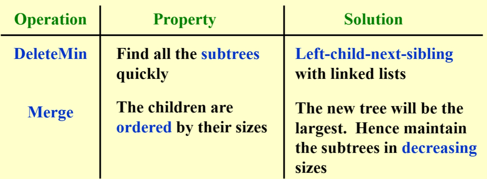

# Advanced Data Structure

[TOC]

1 Trees
-------------------------------------

### AVL trees 平衡树

平衡的二叉搜索树，目的是使动态搜索更快

所有操作的时间复杂度为：$$O(logN)$$，即高度 h

在高度为 h 的 AVL 树中，最少节点数 $$n_h≈\frac{1}{\sqrt{5}}(\frac{1+\sqrt{5}}{2})^{h+3}-1$$，其中 $$h=-1,n_h=0$$（空树的高度定义为-1）

$$n_h=n_{h-1}+n_{h-2}+1$$

h/depth

\\(n\_h\\) 最少节点数

0（一个结点root）

1

1

2

2

4

3

7

4

12

5

20

6

33

【Definition】The balance factor \\(BF( node ) = h\_L -h\_R\\) . In an AVL tree, BF( node ) = -1, 0, or 1.

在 AVL 树中，不可能出现一个节点及其两个子节点的平衡因子都为 - 1的情况

*   In an AVL tree, it is possible to have this situation that the balance factors of a node and both of its children are all +1.

#### Insert

先插入到正确的位置上 bst，从下到上更新 BF，有问题做旋转

#### 单旋转

#### 双旋转

left-right 是zjg-zag双旋转

#### Questions

### Splay trees 伸展树

性能类 AVL 树，但不关心是否平衡  
每访问一个节点 X，从这个节点向上对树进行一系列旋转，使这个节点变成根  
如果 X 的父节点是根，单旋转 X 和树根；如果 X 有父亲 P 和祖父 G，双旋转（zigzig 或 zigzag）

All of the Zig, Zig-zig, and Zig-zag rotations not only move the accessed node to the root, but also roughly half the depth of most nodes **on the path**.

均摊时间复杂度$$T=O(logN)$$

### Amortized Analysis 平摊分析

确保 amortized bound 是 实际 cost 的上界，即 worst case bound ≥ amortized bound ≥ actual cost

#### Aggregate for analysis 合计法

假设每个操作的平摊时间相同

*   只有简单的算法可以这样计算

#### Accounting method 会计法

类似银行存钱  
平摊 amortized cost ≥ 实际 actual cost  
平摊=实际+信用 credit  
定义：credit=摊还开销-实际开销

*   每个操作的平摊时间可能不同
*   困难是要猜对每个操作的 credit，所以引入第三种方法

#### Potential method 势能法

定义：

\\(D\_{i-1}\\)是在本次操作前的结构；\\(D\_i\\)是本次操作后的结构  
potential function 将当前问题的结构映射成一个数字——结构的势能  
credit = 两个势能函数 potential function 的值的差——这个操作把问题的结构改变了多少

*   困难是要找到一个好的势能函数
*   In amortized analysis, a good potential function should always assume **its minimum at the start of the sequence**.

对正整数 a, b, c, 如果$$a+b≤c$$，那么$$lga+lgb≤2lgc-2$$

### Red-Black Trees 红黑树

平衡的二叉搜索树，目的是使动态搜索更快  
定义：

1.  Root property: The root is black.
  
2.  External property: Every leaf (Leaf is a NULL child of a node) is black in the Red-Black tree.
  
3.  Internal property: The children of a red node are black. Hence possible parent of red node is a black node.
  
4.  Depth property: All the leaves have the same black depth.
  
5.  Path property: Every simple path from root to descendant leaf node contains the same number of black nodes.
  

The result of all these above-mentioned properties is that the Red-Black tree is _roughly balanced_.

一棵有 N 个内部节点的红黑树，其高度最多为\\(2ln(N+1)\\)可由以下两个命题得证

*   对于任何一个节点 x，\\(sizeof(x)≥2^{blackheight(x)}-1\\)，即 the number of internal nodes in the subtree rooted at x is more than bh(x) 子树内点数量大于等于2^bh(x)^-1
*   \\(blackheight(T)>=h(T)/2\\)

2 和 3 是旋转次数

*   In a red-black tree, an internal red node cannot be a node of degree 1

#### Insert 插入

插入，检查颜色，旋转

可以循环实现

#### Delete 删除

*   删除叶子
*   删除 1 度的节点：用孩子代替
*   删除 2 度的节点：用左子树的最大或右子树的最小代替（保持颜色不变）；删除子树的代替节点

总之，必须在被替代（删除）的路径上加一个黑节点 或者 整棵树的黑高-1 rebalance，不需要旋转

> the number of rotations in the DELETE operation is O(1)

运行时间：\\(O(logN)\\)对比 AVL，红黑树删除有优势

**被删除的节点 x 为黑色**（x 为红色可以直接删掉）  
_**case 1**：x 有个红色的兄弟 w_  
交换兄弟和它父亲的颜色；对兄弟 w 和父亲 p 进行一次旋转，转化为以下三种情况

_**case 2**：x 的兄弟 w 是黑色，且 w 的两个子节点都是黑色_  
将兄弟变红色；将 x 上移（到它原本的父亲处）；检查如果 x 变成根，则表明虽然没有在这条路径上加一个黑节点，但是成功从其他所有路径上移除了一个黑节点，可以删除原来 x；循环

_**case 3**：x 的兄弟 w 是黑色，且左孩子是红色，右孩子是黑色_  
交换兄弟和它左孩子的颜色，两者进行一次旋转；转化为情况 4

_**case 4**：x 的兄弟 w 是黑色，且右孩子是红色_  
将兄弟变红，它的孩子和父亲变黑（或其他颜色更改）；旋转父亲 p 和兄弟 w

### B+ trees

一种**查找树**，类似红黑树，不是二叉树，平衡，自下而上构建而成  
一棵m阶的B+树定义如下：  
(1)每个结点至多有m个子女；  
(2)除根结点外，每个结点至少有⌈m/2⌉个子女，根结点至少有两个子女；  
(3)有k个子女的结点必有k个关键字。  

*   B 树的高度仅随它所包含的节点数按对数增长

M 阶 B+树，总节点数 N，$$Depth(M,N)=O(⌈log\_{⌈M/2⌉}N⌉$$

通常 M=3 or 4

2-3 tree 各节点度数为2或3

*   叶子结点存储真实值；中间结点有M个指向叶子结点的指针，以及M-1个叶节点中最小值在其中间

#### Find

B+树的查找与B树不同，当索引部分某个结点的关键字与所查的关键字相等时，并不停止查找，应继续沿着这个关键字左边的指针向下，一直查到该关键字所在的叶子结点为止。

$$
T_{find}(M, N) = O(\log N)
$$
和是M阶B+树的阶数无关

#### Insert

分裂

#### Delete

insert 的反操作，结点过少时和兄弟合并，递归向上检查

### Questions

Consider the following buffer management problem. Initially the buffer size (the number of blocks) is one. Each block can accommodate exactly one item. As soon as a new item arrives, check if there is an available block. If yes, put the item into the block, induced a cost of one. Otherwise, the buffer size is doubled, and then the item is able to put into. Moreover, the old items have to be moved into the new buffer so it costs k+1 to make this insertion, where k is the number of old items. Clearly, if there are N items, the worst-case cost for one insertion can be Ω(N). To show that the average cost is O(1), let us turn to the amortized analysis. To simplify the problem, assume that the buffer is full after all the N items are placed. Which of the following potential functions works?

A. The number of items currently in the buffer  
B. The opposite number of items currently in the buffer  
C. The number of available blocks currently in the buffer  
D. The opposite number of available blocks in the buffer

> 题目解析： 设 $$size\_i$$为 第 _i_ 次插入前 buffer 的大小。 $$c^i=c\_i+ϕ\_i−ϕ\_{i−1}.$$ 如果插入前 buffer 没满，$$c\_i$$\=1 ，否则 $$c\_i$$\=$$size\_i$$+1. A: 如果插入前 buffer 没满, $$c^i=c\_i+ϕ\_i−ϕ\_{i−1}=1+(size\_i+1)−size\_i=2$$. 如果插入前 buffer 满，$$c^i=c\_i+ϕ\_i−ϕ\_{i−1}=size\_i+1+(size\_i+1)−size\_i=size\_i+2$$. B: 同理, 两种情况 $$ϕi−ϕi−1$$ 要么是 1 要么是 -1， 而 _ci_ 却和当前 buffer 大小有关，$$c^i$$ 肯定不是常数。 C: 如果插入前 buffer 没满, $$ϕi−ϕ\_{i−1}=−1,c^i=ci+ϕi−ϕi−1=1+(−1)=0$$.
>
> 如果插入前 buffer 满，$$ϕi−ϕ\_{i−1}=(size\_i−1)−0=size\_i−1$$,
>
> $$c^i=size\_i+1+ϕi−ϕi−1=2size\_i$$. D: 如果插入前 buffer 没满, $$ϕi−ϕ\_{i−1}=1, c^i=ci+ϕi−ϕ\_{i−1}=1+1=2$$. 如果插入前 buffer 满，$$ϕi−ϕ\_{i−1}=1−size\_i$$, $$c^i=size\_i+1+ϕi−ϕ\_{i−1}=2$$.

[\[题集\]Lecture2.Red-Black Trees and B+ Trees\_a 2-3 tree with 3 nonleaf nodes must have 18 keys -CSDN博客](https://blog.csdn.net/HGGshiwo/article/details/116381354)

[【PTA】【数据结构与算法】B-树和B+树 - 代码天地 (codetd.com)](https://www.codetd.com/article/10079993)

2 Inverted file index 倒排文件索引
------------------------------------------------------------------------

反向索引 哪些书里有这个词；正向，这本书里有哪些词

### structure

链表指针连接  
搜索引擎  
posting list：所有包含特定term文档的id的集合，需要从词典映射到这个集合，即 Inverted file contains a list of pointers to all occurrences of a term in the text.

### modules

index generator 包括 token analyzer stop filter, vocabulary scanner, vocabulary insertor, memory management

1.  **word stemming** 提取词干 and stop filter 将单词的不同形式都记为原型
2.  常见的词为 **stop words**，将它们剔除出原来的文件，但还是有它们的 posting list
3.  What are the pros and cons of using _hashing_, compared to _search trees_? Faster for a single word but expansive for a range of search.

### topic

_Distributed indexing_：each node contains a **subset** of a collection 集合的部分  
Dynamic indexing：新的文件先存到附加序号集中，等到用户搜索时查询 main index 以及 auxiliary index  
Compression 压缩：  
_Thresholding_ 阈值：for documents，返回前 k 个权重最大的文件；for query， 查询单词频率最低的一些文件

### Measure

\\(precision=R\_R/(R\_R+I\_R)\\)  
\\(recall=R\_R/(R\_R+R\_N)\\)

### Questions

1.  While accessing a term stored in a B+ tree in an inverted file index, range searches are expensive. **F**

[[题集]Lecture3. Inverted File Index\_in distributed indexing, document-partitioned stra-CSDN博客](https://blog.csdn.net/HGGshiwo/article/details/116351170)

Heap
-----------------------------------

### Lefiest Heap 左式堆

用建堆的方法**合并**两个堆的时间复杂度是\\(Θ(N)\\)；用指针的方式会使其他操作（find）变慢  
需要频繁的 Merge 时使用左式堆  
性质：有序性（和普通堆一样）；结构不平衡的二叉树

定义：Npl(x) **null path length** 任意一个节点 x 的 Npl 是从 x 到一个没有两个孩子的节点的**最短路径长**；令 \\(Npl(NULL)=-1\\)

\\(Npl(X)\\) = min { \\(Npl(C)+ 1\\)for all C as children of X } 从下往上算 Npl

The leftist heap property is that for every node X in the heap, the **null path length** of the left child is **at least** as large as that of the right child.

定理：

*   右路径上有 k个节点的左式树至少有总共\\(2^k-1\\)个节点；即 有 N 个节点的左式树，它的右路径上最多有\\(⌊log(N+1)⌋\\)个节点

我们可以把所有工作都放在右路径上，因为它更短

*   A leftist heap with the null path length of the root being **r** must have at least \\(2^{r+1}-1\\) nodes

#### Merge

##### recursive

step1 `Merge(H1->Right,H2)`; step2 `Attach(H2,H1->Right)`

大的根值的堆 和 小的根值的堆的右子堆 合并

 

step3 `Swap(H1->Right,H1->Left)` if necessary

`struct Treenode{     ElementType Element;     PriorityQueue Left;     PriorityQueue Right;     int Npl; };  PriorityQueue Merge ( PriorityQueue H1, PriorityQueue H2 ) {     if(H1 == NULL)return H2;     if( H2 == NULL )return H1;     if ( H1->Element < H2->Element ) return Merge1( H1, H2 );     else return Merge1( H2, H1 ); }  static PriorityQueue Merge1( PriorityQueue H1, PriorityQueue H2 ) {     if ( H1->Left == NULL )/* single node */         H1->Left = H2;/* H1->Right is already NULL and H1->Npl is already 0 */     else {         H1->Right = Merge( H1->Right, H2 );/*Step1&2*/         if ( H1->Left->Npl < H1->Right->Npl) SwapChildren( H1 );/* Step 3 */         H1->Npl= H1->Right->Npl +1;//only consider the smaller Npl     }/* end else */     return H1; }`

要求 **h1 的 root < h2 的 root**

\\(T= O(logN)\\)

##### iterative

step1 对两棵树的右路径进行排序，不改变他们的左孩子  
step2 交换孩子（如果有必要）

#### DeleteMin

step1：delete min  
step2：merge 2 subtrees

### Skew Heaps 斜堆

左式堆的自调节形式 ，目的是使任意 M 种操作花费最多\\(O(MlogN)\\)的时间

结构不平衡的二叉树，**斜堆的右路径可以是任意长度**（左右旋转）

#### Merge

总是交换左右孩子 直到包含右路径的最大节点的根没有孩子可以交换 No Npl

`merge(h1, h2)` 摊还运行时间：\\(O(logN)\\)

1.  Let h1 and h2 be the two min skew heaps to be merged. Let h1's root be smaller than h2's root (If not smaller, we can swap to get the same).
2.  We swap `h1->left` and `h1->right`. 交换小根左右堆
3.  `h1->left = merge(h2, h1->left)` 将大根和小根的左堆合并

#### Insert

保持最小的节点，交换（左树变到右树），再连另外一棵树

优势：不需要额外空间去保存路径长度，不需要测试来确保什么时候要交换孩子

*   A perfectly balanced tree forms if keys 1 to 2k−1 are inserted in order into an initally empty skew heap.

#### 平摊分析

\\(T\_{amoritized}=O(logN)\\)

\\(ϕ(D\_i)=\\)number of heavy nodes

【Definition】 A node p is _heavy_ if the number of descendants of p's _right_ subtree is **at least half** of the number of descendants of p, and light otherwise. Note that the number of descendants of a node includes the node itself.  
只有在原来右路径上的节点 heavy/light 状态会改变  
h-heavy nodes；l-light nodes  
  
为什么 light node 的复杂度是\\(log(N)\\)：每一个 light node 的右子树 node 数量都要减半（≤(n-1)/2)

### Questions

[\[题集\]Lecture 4. Leftist Heaps and Skew Heaps\_when doing amortized analysis, which one of the fo-CSDN博客](https://blog.csdn.net/HGGshiwo/article/details/115060750)

[Assignment 4 2-2\_we can perform buildheap for leftist heaps by cons-CSDN博客](https://blog.csdn.net/zju_fish1996/article/details/50992928)

Binomial Queue
-------------------------------------------------------

一种优先队列，heap-ordered 树的集合=array of binomial trees  
一棵\\(B\_k\\) 二项式树有 k 个孩子，即\\(B\_0\\)……\\(B\_{k-1}\\)，\\(B\_k\\)有共\\(2^k\\)个节点，每个节点的深度是\\(C\_k^d\\)  
一个不管多少大小的优先队列，可以被一组二项树唯一地表示，eg：13=\\(1101\_2\\)，相当于一个 B1，一个 B2，一个 B3

### FindMin

遍历所有根  
对共有 N 个节点的二项队列，最多有 \\(⌊logN⌋\\)个根，因此时间复杂度为\\(O(logN)\\)，平均时间是常数

### Merge

二进制加法算队列，再合并；确保根是最小数

二项树队列必须高度有序，而不是根大小有序

摊还运行时间：\\(O(logN)\\)

`CombineTrees(BinTree T1, BinTree T2){     // Merge 2 trees of equal size     if( }`

`BinQueue Merge(BinQueue H1, BinQueue H2){     BinTree T1, T2,Carry=NULL;     int i,j;     if(H1->CurrentSize+H2->CurrentSize > Capacity) ErrorMessage();     H1->CurrentSize += H2->CurrentSize;     for(i=0,j=1; j<=H1->CurrentSize; i++,j*=2){         //i是树的序号，j是对应树的大小         T1=H1->TheTrees[i];         T2=H2->TheTrees[i];         switch(4*!!Carry + 2* !!T2 + !!T1){             //T1是个指针，如果T1不是一个空指针，T1=1, !T1=0, !!T1=1             //4*!!Carry + 2* !!T2 + !!T1是一个数             case 0://000             case 1:break;//001             case 2://010                 H1->TheTrees[i]=T2;                 H2->TheTrees[i]=NULL;                 break;             case 3://011                 Carry=CombineTrees(T1,T2);                 H1->TheTrees[i]= H2->TheTrees[i]=NULL;break;             case 4: //100                 H1->TheTrees[i]=Carry;                 Carry=NULL;break;             case 5://101                 Carry=CombineTrees(T1,Carry);                 H1->TheTrees[i]=NULL;break;             case 6://110                 Carry=CombineTrees(T2,Carry);                 H2->TheTrees[i]=NULL;break;             case 7://111                 H1->TheTrees[i]=Carry;                 Carry=CombineTrees(T1,T2);                 H2->TheTrees[i]=NULL;break;         }     }     return H1; }`     

`ElementType DeleteMin( BinQueue H ){     BinQueue DeletedQueue;     Position DeletedTree, OldRoot;     ElementType Minltem = Infinity; /* the minimum item to be returned */     int i, j, MinTree; /* MinTree is the index of the tree with the minimum item */     if ( lsEmpty(H)){          PrintErrorMessage();          return -Infinity; }     for (i=0;i< MaxTrees; i++){//MaxTrees可以用实际根的数量代替         /* Step 1: find the minimum item */         if( H->TheTrees[i] && H->TheTrees[i]->Element < MinItem ){             MinItem =H->TheTrees[i]->Element;              MinTree =i;          } /* end if */}/*end for-i-loop*/     DeletedTree = H->TheTrees[ MinTree ];     H->TheTrees[ MinTree ]= NULL;      /* Step 2: remove the MinTree from H => H'*/     OldRoot =DeletedTree; /* Step 3.1: remove the root */     DeletedTree = DeletedTree->LeftChild;     free(OldRoot);     DeletedQueue =Initialize(); /* Step 3.2: create H” */     DeletedQueue->CurrentSize=(1<<MinTree )-1; /* 2^MinTree-1 */     for (j= MinTree -1;j>= 0;j--){         DeletedQueue->TheTreesj]= DeletedTree;         DeletedTree = DeletedTree->NextSibling;         DeletedQueue->TheTrees[j]->NextSibling = NULL;     }/* end for-j-loop */     H->CurrentSize -= DeletedQueue->CurrentSize + 1;     H = Merge( H, DeletedQueue ); /* Step 4: merge H' and H” */     return MinItem; }`

### Insert

一种特殊的 merge

将 n 个节点插入一个空二项队列，最坏时间复杂度为\\(O(N)\\)

若最小还没出现的二项式树是\\(B\_i\\)，那么时间复杂度为\\(Const(i+1)\\)，即平均时间是常数

摊还运行时间：\\(O(1)\\)

### DeleteMin

1.  `FindMin` in \\(B\_k\\) //\\(O(logN)\\)
2.  将 \\(B\_k\\)从 H 中移走 //\\(O(1)\\)
3.  将根从\\(B\_k\\)中移走 //\\(O(logN)\\)
4.  `Merge(H',H'')` //\\(O(logN)\\)

摊还运行时间：\\(O(logN)\\)

删除要将原队列一分为二进行合并

### Analysis

*   一个 N 个元素的二项队列可以由 N 次连续的插入在\\(O(N)\\)时间内实现（最坏情况\\(O(N)\\)

证明：

#### Aggregate

#### Potential

\\(T\_{worst}=O(logN)\\)

\\(T\_{amoritized}=2\\)

### Questions

1.  For a binomial queue, \_\_ take(s) a constant time on average. **C**

A. merging and delete-min B. find-min and delete-min C. find-min and insertion D. merging and insertion

> 二项队列找到最小和插入的平均时间是常数

2.  The potential function _Q_ of a binomial queue is the number of the trees. After merging two binomial queues _H_1 with 22 nodes and _H_2 with 13 nodes，what is the potential change _Q_(_H_1+_H_2)−(_Q_(_H_1)+_Q_(_H_2)) ? **A**

A.-3

B.0

C.-2

D.2

> H1=16+4+2
>
> H2=8+4+1
>
> H1+H2=35=32+2+1
>
> 势能变化=3-3-3=-3

Backtracking
---------------------------------------------------

回溯：分步解决问题，如果此路不通，就回到之前的点走另一条路。节约穷举时间

### 8-Queen problem

1.  建一个游戏树（不是真的在program里），路径个数为叶子节点个数
2.  对所有路径做深度优先搜索（post-order traversal）

### Turnpike problem

\\(N\\) points有\\(N(N-1)/2\\) 个距离，第一个点\\(x\_1=0\\) ，要求给定距离，找到点集

1.  根据距离个数算N
2.  得到最小点和最大点
3.  找到次大的距离并检查

### Game

tik-tack-toe：Minimax Strategy

\\(f(P)=W\_{computer}-W\_{human}\\)，函数值越小，人类胜利可能性越大

α-β pruning：将搜索的时间复杂度限制到\\(O(\\sqrt{N})\\) 个节点

α pruning：在Max层，如果α≥β则剪枝α

β pruning：在Min层，如果α≥β则剪枝β

[剪枝](https://so.csdn.net/so/search?q=剪枝&spm=1001.2101.3001.7020)发生的情况：

其兄弟节点比它的节点更优。它的另外一个子节点被剪枝？

由于不会选它的父亲了，因此它被剪枝了

根据[深度优先搜索](https://so.csdn.net/so/search?q=深度优先搜索&spm=1001.2101.3001.7020)，必须先遍历左孩子，才是根，才是右孩子，只可能是右孩子被剪枝

Min里面找最大，Max里面找最小？

### Questions

What makes the time complexity analysis of a backtracking algorithm very difficult is that _the number of solutions_ that do satisfy the restriction is hard to estimate.

> TRUE

In backtracking, if different solution spaces have different sizes, start testing from the partial solution with the largest space size would have a better chance to reduce the time cost.

> FALSE

\[[题集\]Lecture 6. Backtracking\_in the tic-tac-toe game, a "goodness" function of -CSDN博客](https://blog.csdn.net/HGGshiwo/article/details/116332056)

Divide and Conquer
---------------------------------------------------------------

### closest points

分成多个子问题，用循环解决

在N个点中，找到距离最近的两个点（重合为0）

1.  穷举：check N(N-1)/2次，\\(T=O(N^2)\\)
2.  分治：分成两部分，最小只有3种情况，\\(T=O(NlogN)\\)

代码：

### 三种方法解决递归

1.  #### substitution
  

先猜，然后用归纳法证明

eg, \\(T(N)=2T(⌊N/2⌋)+N\\) ，\\(T=O(NlogN)\\)

2.  #### recursion-tree
  

eg, \\(T(N)=3T(N/4)+Θ(N^2)\\)

高度：\\(log\_4N\\)

3.  #### master theorem
  

### Questions

快排quick sort和归并merge用了divide and conquer算法

[数据结构错题整理（二）\_for the recurrence equation t(n)=at(n/b)+f(n), if -CSDN博客](https://blog.csdn.net/FUNNYQian123/article/details/113482627)

Dynamic programming
-----------------------------------------------------------------

动态规划可以解决Longest common subsequence problem

polynomial time 多项式时间

*   动态规划不保证都能在多项式时间解决问题

To solve a problem by dynamic programming instead of recursions, the key approach is to store the results of computations for the subproblems so that we only have to compute each different subproblem once. Those solutions can be stored in an array or a hash table.

### Fibonacci number

只解决子问题一次，将答案存在表中

\\(T=O(N)\\)

### Matrix Multiplication

矩阵链乘法

\\(T=O(N^3)\\)

### Optimal binary search tree

最优二叉搜索树是静态搜索（没有插入和删除）最佳，使所有操作访问的节点总数最少

在weight一定时，选cost最小的

optimal cost = total weight + this cost

\\(T=O(N^3)\\)

### Floyd-warshall算法

All-pairs shortest path

所有结点对的最短路径问题：

1.  Dijkstra 单源最短路径 \\(T=O(V^3)\\) 适合稀疏图
  
2.  Floyd-warshall，不能处理负数cost，因为弗洛伊德算法将在有限步后终止，但如果存在负cost循环，则最短距离为负无穷大。
  

`/* A[ ] contains the adjacency matrix with A[ i ][ i ] = 0 */  /* D[ ] contains the values of the shortest path */  /* N is the number of vertices */  /* A negative cycle exists iff D[ i ][ i ] < 0 */  void AllPairs( TwoDimArray A, TwoDimArray D, int N )  {   int  i, j, k;   for ( i = 0; i < N; i++ )  /* Initialize D */       for( j = 0; j < N; j++ )          D[ i ][ j ] = A[ i ][ j ];   for( k = 0; k < N; k++ )  /* add one vertex k into the path */      for( i = 0; i < N; i++ )           for( j = 0; j < N; j++ )               if( D[ i ][ k ] + D[ k ][ j ] < D[ i ][ j ] )                   /* Update shortest path */                   D[ i ][ j ] = D[ i ][ k ] + D[ k ][ j ];  }`

 \\(T=Θ(V^3)\\) ，稠密图会更快

Greedy Algorithms
-------------------------------------------------------------

### Introduction

贪心算法在每个阶段都做当前限制下的最优解，结果不回退

note：贪心只在当前最佳=全局最佳时有用，它并不保证最优解（但接近）

### Acitivity selection

找最多不冲突的时间段

#### A DP problem

Greedy Rule 1：选出时间段开始最早的（但不与已经选出的间隔重叠）**×**

Greedy Rule 2：选出时间段最短的**×**

Greedy Rule 3：选出时间段冲突最少的**×**

Greedy Rule 4：选出时间段结束最早的**√**

【Theorem】

令S为活动选择问题（Activity Selection Problem）中所有活动的集合。则**最早结束的活动**\\(a\_s\\)一定被包含在S的某个最大相容活动子集中。

\\(T=O(NlogN)\\)

#### DP solution

If each activity has a weight, DP solution is still correct but Greedy solution may be not.

**0-1背包问题**

`f[i][j]=max(f[i-1][j-w[i]]+v[i], f[i-1][j])`

\\(T=O(N^2W)\\)，W是个数

### Huffman code

频率高的字符编码简短

\\(cost=\\sum{d\_if\_i}\\)

为了得到唯一的解码（消除二义性），对不同字母编码前缀要不同

所有结点不是叶子就必须有两个孩子

build the tree from bottom-up

``

\\(T=O(ClogC)\\)

### Questions

[实验12 Greedy Algorithm练习题 答案与解析\_given 4 cases of frequences of four characters. in-CSDN博客](https://blog.csdn.net/dylan_sjc/article/details/111610827)

NP-completeness
---------------------------------------------------------

### NP definition

停机问题(halting problem)是不可判定问题(undecidable problem)

**P**: 能在多项式时间内解决的问题

**NP（nondeterministic polynomial-time）**：不能在多项式时间内解决或不确定能不能在多项式时间内解决，但如果我们可以在多项式时间内证明一个问题的任意“是”的实例是正确的，那么这个问题属于NP类

NP类包含所有多项式时间解的问题

**NP-complete(NPC)**： NPC问题是NP问题的一个子集，是最难的NP问题。任意NP问题在多项式时间内都能够规约到它的NP问题，即解决了此NPC问题，所有NP问题也都得到解决。

 如果NPC问题有一个多项式的解，那么NP中的每一个问题必然都有一个多项式的解，这使得NPC问题是所有NP问题中最难的问题。

**NP hard**：NP难问题，所有NP问题在多项式时间内都能约化(Reducibility)到它的问题(不一定是NP问题)。

All NP problems can be solved in polynomial time in a non-deterministic machine. NP问题可以被非确定图灵机在多项式时间内解决

All Np problems are decidable.

如果A是NPC且A能在多项式时间内化成B，则A比B要难

### NPC problems

NPC问题有：circuit-SAT，traveling salesman巡回售货员，Hamilton cycle哈密顿圈，最长路径，bin packing装箱问题，knapsack背包问题，graph coloring图着色，vertex cover

*   If a decision problem B is in P and A reduces to B, then decision problem A is in P.
*   A decision problem B is **NP-complete** if B is in NP and for _every NP problem_ A, A reduces to B.
*   A decision problem C is **NP-complete** if C is in NP and for _some NP-complete problem_ B, B reduces to C.
*   X reduces to Y means X ≤ Y, X=>Y, X可以多项式规约到Y

#### Proof

为了证明某个新问题是NPC，必须先证明它属于NP，然后将一个适当的NPC问题变换到该问题。

第一个NPC问题是可满足性问题（satisfiability）：把一个bool表达式作为输入并提问是否该表达式对式中各变量的一次赋值取值1

### Formal language framework

【Formal language theory】A language L belongs to **NP** iff there exist a two-input polynomial-time algorithm A that verifies language L in polynomial time.

co-NP: A problem has its complement in NP

### Questions

1.  Given that problem A is NP-complete. If problem B is in NP and can be polynomially reduced to problem A, then problem B is NP-complete. ×

> **F** The correct requirement for B to be NP-complete is not just that it is in NP and reduces to A, but that every problem in NP can be reduced to B. 少了个条件：B还必须是NP-hard，即 every problem in NP can be reduced to B

\[[题解\]ADS10 NP-Completeness\_if l 1 ≤ p l 2 and l 2 ∈np, then l 1 ∈np.-CSDN博客](https://blog.csdn.net/HGGshiwo/article/details/118367178)

Approximation algorithm
---------------------------------------------------------------------------

近似算法

### Introduction

An **approximation** algorithm guarantees to seek out high accuracy and top quality solution (say within 1% of optimum) Approximation algorithms are used to get an answer near the (optimal) solution of an optimization problem in polynomial time

approximation ratio: \\(\\rho(n)\\)，

PTAS：polynomial time approximation schema

PTAS 's complexity: \\(O(n^{2/\\varepsilon})\\)

FPTAS 's complexity: \\(O(n^3(1/\\varepsilon)^2)\\)

### Approximate bin packing

近似装箱问题：np-hard问题

**Next fit**

眼前的bin放不下就开新的bin

approximation ratio: 2

Next fit never uses more than **2M – 1** bins (M: the optimal number)

`void NextFit ( ) {   read item1;     while ( read item2 ) {         if ( item2 can be packed in the same bin as item1 )     place item2 in the bin;         else     create a new bin for item2;         item1 = item2;     } /* end-while */ }`

**First fit**

从左到右遍历找到可以放下当前package的bin

First fit never uses more than **17M / 10** bins (M: the optimal number)

`void FirstFit ( ) {   while ( read item ) {         scan for the first bin that is large enough for item;         if ( found )     place item in that bin;         else     create a new bin for item;     } /* end-while */ }`

Can be implemented in O( N log N )

**Best fit**

找一个尽量塞得最满的bin放package，可以回退以达到best fit

``

**online algorithm**

不改决定，一个一个处理package，不能一直保证结果是最佳

【Theorem】There are inputs that force any on-line bin-packing algorithm to use at least 5/3 the optimal number of bins.

**offline algorithm**

全局判断，等到输入数据被读完后再做决定

trouble maker：大物品

解决办法：把物品大小从小到大排序，接着使用first fit/best fit decreasing算法

First fit decreasing never uses more than **11M / 9 + 6/9** bins (M: the optimal number)

### Knapsack problem

第一种：simple 可取物品的部分，对\\(profit\_i/weight\_i\\)贪心（取最大的放）

第二种：hard 0-1version 只能取整个物品或者不取

approximation ratio: 2

动态规划解决：

### 10.4 K-center

确定中心使到点的距离最小

`Centers  Greedy-2r ( Sites S[ ], int n, int K, double r ) {   Sites  S’[ ] = S[ ]; /* S’ is the set of the remaining sites */     Centers  C[ ] = ;     while ( S’[ ] !=  ) {         Select any s from S’ and add it to C;         Delete all s’ from S’ that are at dist(s’, s)  2r;     } /* end-while */     if ( |C| ≤ K ) return C;     else ERROR(No set of K centers with covering radius at most r); }`

算\\(r(c^\*)\\)

【Theorem】 Suppose the algorithm selects more than K centers. Then for any set C _of size at most K, the covering radius is r(C_) > r.

approximation ratio: 2

binary search：

a smarter solution：

``

### Questions

\[[题解\]ADS11 Approximation\_as we know there is a 2-approximation algorithm fo-CSDN博客](https://blog.csdn.net/HGGshiwo/article/details/118529278)

Local search
-----------------------------------------------------

### basic

solve problems approximately at a local optimum

neighbor relation S~S': S' is a neighboring solution of S~S' can be obtain by a small modification of S

N(S)：neighborhood of S - the set {S': S~S'}

`//梯度下降`

### Vertex cover

problem:

Metropolis algorithm

``

### Hopfield neural

state-flipping algorithm

### Maximum Cut problem

``

最多\\(O(n/\\varepsilon\*logW)\\)

### Questions

greedy&local search 最小生成树问题

2.  

Randomize
-----------------------------------------------

### Introduction

Pr\[A\]: 事件A的概率

\\(\\overline{A}\\): 事件A的补集

算法随机，不是输入随机

### Hiring problems

Naive solution: 遇见比之前最好的质量更好的就替换

worst case: 候选人质量升序排序 \\(O(NC\_h)\\)

Randomness assumption: 前i个候选者都平等的可能是最好的

Randomized permutation algorithm

`//Assign each element A[ i ] a random priority P[ i ],and sort void PermuteBySorting ( ElemType A[ ], int N ) { for ( i=1; i<=N; i++ ) A[i].P = 1 + rand()%(N3 ); /* makes it more likely that all priorities are unique */ Sort A, using P as the sort keys; } //Claim: Permute By Sorting produces a uniform random permutation of the input, assuming all priorities are distinct.`

Online hiring algorithm--hire only once

``

\\(Pr\[S\_i\]=Pr\[A∩B\]=Pr\[A\]\*Pr\[B\]=1/N=\\frac{k}{N(i-1)}\\)

\\(Pr\[S\]=\\sum\_{i=k+1}^{N}Pr\[S\_i\]=\\sum\_{i=k+1}^{N}\\frac{k}{N(i-1)}=\\frac{k}{N}\\sum\_{i=k}^{N-1}\\frac{1}{i}\\)

\\(\\frac{k}{N}In(\\frac{N}{k})≤Pr\[S\]≤\\frac{k}{N}In(\\frac{N-1}{k-1})\\)

best value of k=\\(\\(\\frac{N}{e}\\)\\)

succeed in hiring the best-qualified applicant with probability at least 1/e

### Randomized quick sort

随机选pivot，得到central splitter的概率Pr=0.5

\\(E\[T\_{type j}\]=O(N)\\)

number of different types = O(logN)

总O(NlogN)

Parallel Algorithm
-----------------------------------------------------------------

### Introduction

#### Parallel Random Access Machine(PRAM)

To solve access conflicts, Exclusive-Read-Exclusive-Write(EREW)

concurrent-read Exclusive-Write(CREW)

Concurrent-Read Concurrent-Write(CRCW)

``

\\(T(n)=logn+2\\)

#### Work-Depth(WD)

W(n): total number of operations

`1`

W(n)=2n

### Prefix-sums

``

W(n)=O(n)

T(n)=O(logn)

C是从上往下计算的，B是从下往上算的

###  Merging

merge->rank

T=O(1)

W=O(n+m)=O(nlogn)--binary search

#### Parallel ranking

1.  partition 分组AB：p=n/logn
2.  actual ranking：最多2p个O(logn)子问题

W(n)=O(n)；T(n)=O(logn)

### Maximum finding

a doubly-logarithmic paradigm

h=loglogn

All paris:T(n)=O(1)

Random samplin: W(n)=O(n)；T(n)=O(1)

\\(O(1/n^c)\\)

并行方法将问题分成子问题只能减少workload，不能降低最坏情况

### Questions

\[[题解\]ADS14 Parallel Algorithms\_while comparing a serial algorithm with its parall-CSDN博客](https://blog.csdn.net/HGGshiwo/article/details/118539814)

External Sorting
-------------------------------------------------------------

###  Introduction

mergesort

store data on tapes, can use at least 3 drives

N: number of records M: size of internal memory

#### Exmaple

10M(10,000,000) records of 128 Bytes each and 4MB internal memory.

1.  the number of runs: 128\*10MB/4MB = 320 runs
2.  1(the first run generation) + \\(log\_2320\\) = 10 passes

Then, **the number of passes is \\(1+\\lceil log\_2{N/M}\\rceil\\)**

seek time: O(number of passes)

### Pass reduction

use k-way merge

每组第一个先加入heap，最小的弹出，然后其余两个上移左移，再加入新的元素（按第一组第一个、第二组第一个、第k组第一个、第一组第二个、第二组第二个······）

**The number of passes is** \\(1+\\lceil log\_k{N/M}\\rceil\\); we need **2k tapes**

#### Polyphase merge

require k+1 tapes only, split into \\(F\_{N-1}, F\_{N-2},···,F\_{N-k}\\), where \\(F\_N^k=0, F\_{k-1}^k=1\\), number of runs is the Fibonacci number \\(F\_N\\)

按斐波那契数分割更好

### Buffer handling

k-way merge: **2k input** buffers & **2 output** buffers

I/O time will increase despite the decrease of passes, the optimal k depends on the disk parameters and amount of internal memory available for buffers

### Run generation and merge

**Replacement selection**

\\(L\_{avg}=2M\\) (expected value) 对基本有序的输入很有用，输出有序段长短不同

Huffman哈夫曼 tree can get minimum merge times.

提高内存利用率，升级硬盘，提升I/O速度

> A. T(N, k) is O(N log k) for a fixed N

[数据结构与算法 外部排序\_to merge 55 runs using 3 tapes for a 2-way merge, -CSDN博客](https://blog.csdn.net/m0_51424656/article/details/122444855)

2024年6月26日 00:54:04 2024年6月25日 23:02:31