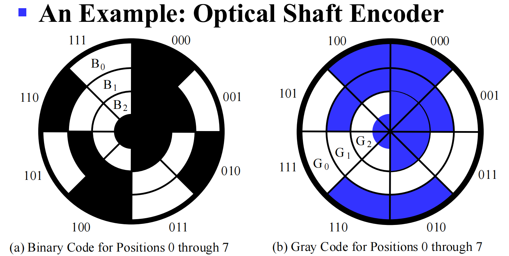
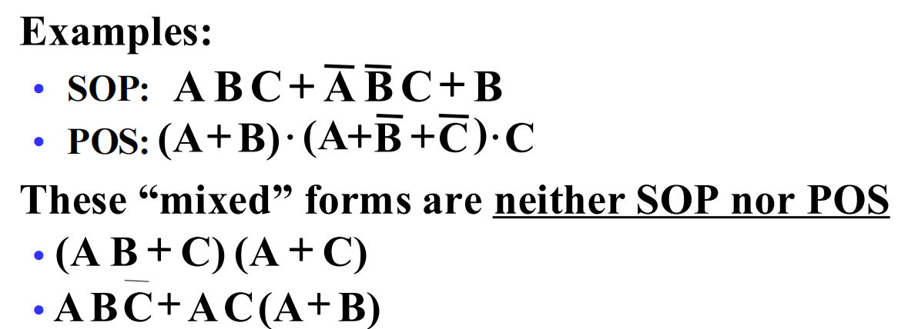

# Logic and Computer Design Fundamentals 数字与逻辑设计

> [!TIP]
>
> 

## Digital Systems and Information

数字系统与信息

### Digital System

Digital System: Takes a set of discrete information inputs and discrete internal information (system state) and generates a set of discrete information outputs.

**Synchronous Sequential System** 同步时序电路：状态在离散的时间点更新

**Asynchronous Sequential System** 异步时序电路：状态在任何时间点更新

> [!NOTE]
>
> 现代计算机基本都选择同步！异步的错误率很高
>
> 1/主频 = 周期 是规定的更新时间间隔

**A Digital Counter** 计数器是异步电路

AD 转换：模拟-> 数字

Two level, or binary values are the most prevalent values in digital systems

### Number System

数字系统表示

二进制补码 = 反码+1，则二进制减法可以用 `被减数+减数的补码` 来算（最后把溢出的高位舍去）

#### 进制转化

To convert from one base to another:
1) Convert the Integer Part
2) Convert the Fraction Part
3) Join the two results with a radix point

10-> 2：整数部分 除二取余，从下往上得到结果；小数部分 乘二取整，从上往下得到结果

2-> 10：$\sum$ (digit × respective power of 2)

8 <-> 16：通过 2 进制转换

#### Binary Coded Decimal (BCD)

二进制编码的十进制数：The BCD code is the 8,4,2,1 code

**BCD Arithmetic**

### Coding

#### PARITY BIT Error-Detection Codes

一种简单的冗余形式是奇偶校验 parity，即在代码字上附加一个额外的位，以使 1 的数量为奇数或偶数。奇偶校验可以检测所有单比特错误和一些多比特错误。

#### GRAY CODE

格雷码：相邻数之间只有一个 bit 不一样

## Combinational Logic Circuits

组合逻辑电路

### Gate Circuits and Boolean Equations

#### Binary Logic and Gates

二值逻辑和逻辑门

|      | 英语 |                       符号表示                        |
| :--: | :--: | :---------------------------------------------------: |
|  与  | AND  |                     × 或者 $\and$                     |
|  或  |  OR  |                     + 或者 $\or$                      |
|  非  | NOT  |        |

真值表 Truth table

MOS Transistor

Switch models

- NO = 0, NC = 1

#### Boolean Algebra

The **dual** 对偶 of an algebraic expression is obtained by interchanging + and · and interchanging 0’s and 1’s.

>  [!NOTE]
>
> 公式（两边取 dual 也成立）
>
> 

**Example**

**Complementing Functions**: Use DeMorgan's Theorem to complement a function:

1. Interchange AND and OR operators
2. Complement each constant value and literal

Example: Complement F =  x  y  z  + x  y   z ； F  = (x +  y  + z)( x  + y + z)

#### Standard Forms

**Canonical Forms** 标准型

**Minterms** are AND terms with every variable present in either true or complemented form.

最小项：所有变量都以源变量或者反变量的形式出现，且仅出现一次的乘积项。其特征是在真值表

- 对于 n 个变量，一共有 2^n^个不同的最小项

**Maxterms** are OR terms with every variable in true or complemented form.

二变量 X、Y 的 4 个最小项和 4 个最大项

- 最大项和最小项之间是互补(complemented)的关系

最小项之和(sum of minterm)

- If F = m~0~+m~1~+m~7~=, then F = M~2~M~3~M~4~M~5~M~6~

- 最小项序号 Index：x  y  z = 101 = 5
- 

**Standard Sum-of-Products (SOP)form 积之和** : equations are written as **an OR of AND terms** 

**Standard Product-of-Sums (POS) form 和之积** : equations are written as **an AND of OR terms**

### Circuit Optimization

#### Two-Level Optimization

##### cost criteria

**Literal cost (L) 文字成本**：the number of literal appearances in a Boolean expression corresponding to the logic circuit diagram

**Gate input cost (G)门输入成本**：the number of inputs to the gates in the implementation corresponding exactly to the given equation or equations.

Gate input cost with NOTs (GN)：把取反也算作操作

#### Karnaugh Maps (K-map)

卡诺图

- 当表示函数最小项的两个方格有相同边缘，这些方格就可以组合到一起形成一个少了一个变量的乘积项
- 对于三变量、四变量的卡诺图，要几何上理解共享边缘
  - 4✖4的4个边角可以合并成一个

##### 四变量卡诺图

Four variable maps can have rectangles corresponding to:
• A single 1 = 4 variables, (i.e. Minterm)
• Two 1s = 3 variables,
• Four 1s = 2 variables
• Eight 1s = 1 variable,
• Sixteen 1s = zero variables (i.e.Constant "1")

目标：

1. Find all prime implicants 标1
2. Include all essential prime implicants in the solution 找到最大的矩形覆盖尽可能多的1
3. Select a minimum cost set of non-essential prime implicants to cover all minterms not yet covered
4. Minimize the overlap among prime implicants as much as possible. 减少重叠
5. 得到的矩形数量就是简化后布尔函数的项数（积之和）

> [!NOTE]
>
> 合并1=合并0
>
> 最后划分的结果可能不唯一

**无关最小项(don't care condition)**：函数中没有指定的最小项，在卡诺图中用“$×$”表示

- 包含无关最小项的矩阵划分结果可能不唯一

#### Multiple-Level Optimization

不好用卡诺图

提取公因式降门输入成本

### Additional Gates and Circuits

• Other Gate Types
• Exclusive-OR Operator and Gates
• High-Impedance Outputs
• Propagation Delay