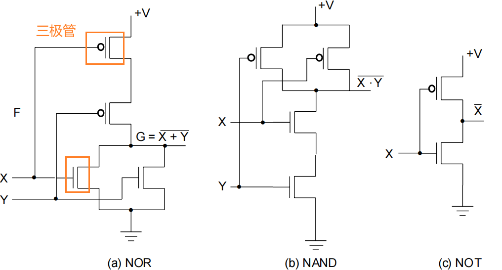
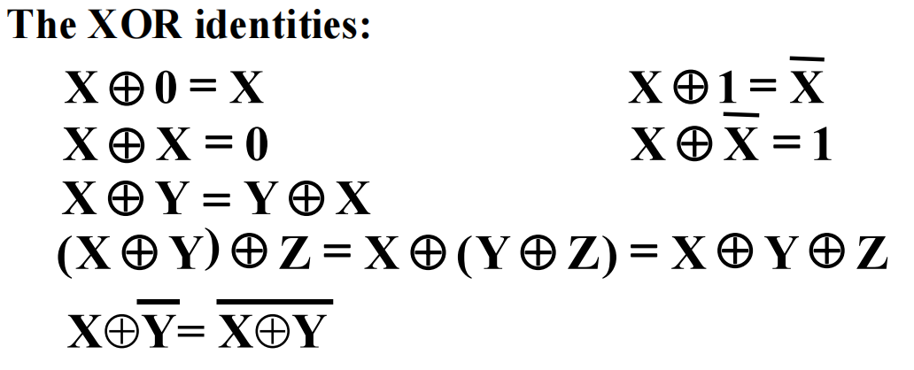
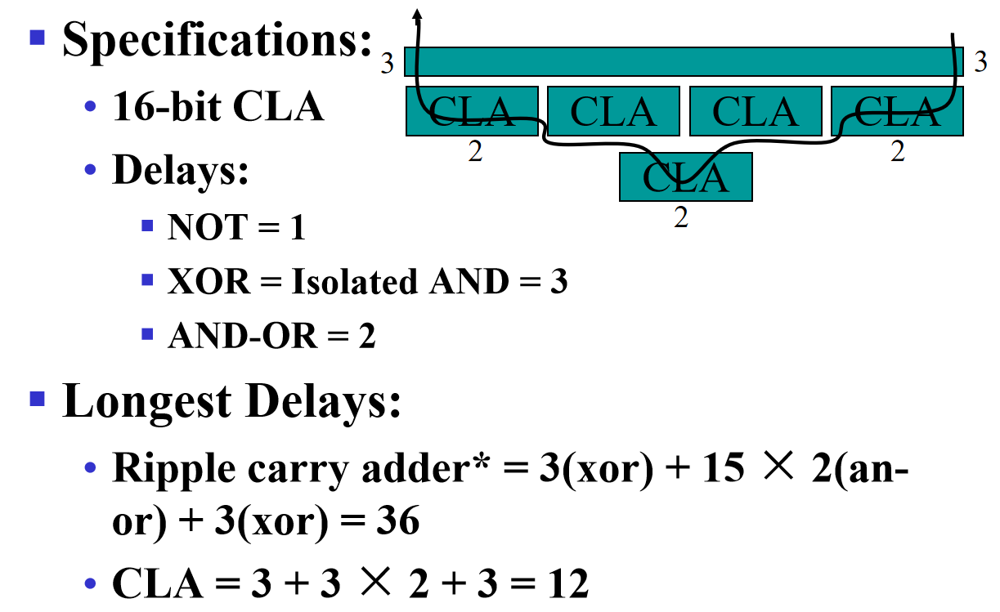
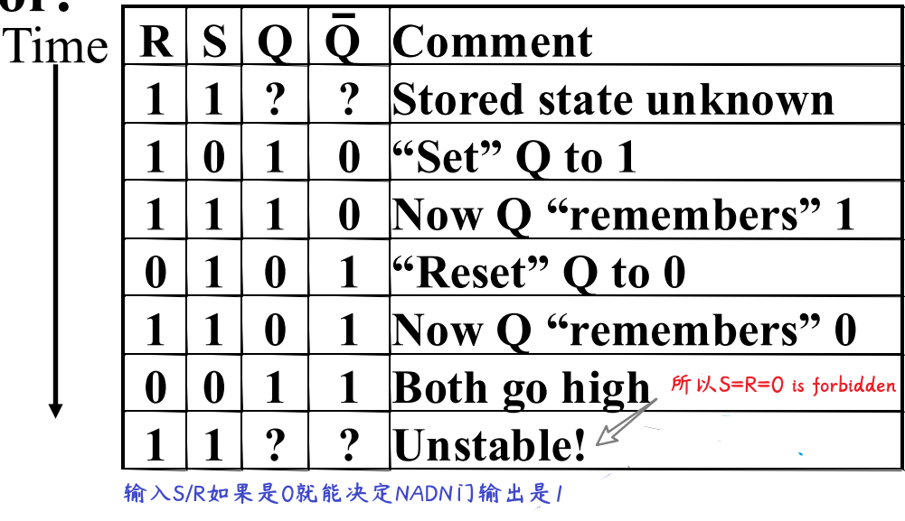

# Logic and Computer Design Fundamentals 数字与逻辑设计

> [!TIP]
>
> 

## Digital Systems and Information

数字系统与信息

### Digital System

Digital System: Takes a set of discrete information inputs and discrete internal information (system state) and generates a set of discrete information outputs.

**Synchronous Sequential System** 同步时序电路：状态在离散的时间点更新

**Asynchronous Sequential System** 异步时序电路：状态在任何时间点更新

> [!NOTE]
>
> 现代计算机基本都选择同步！异步的错误率很高
>
> 1/主频 = 周期 是规定的更新时间间隔

**A Digital Counter** 计数器是异步电路

AD 转换：模拟-> 数字

Two level, or binary values are the most prevalent values in digital systems

### Number System

数字系统表示

二进制补码 = 反码+1，则二进制减法可以用 `被减数+减数的补码` 来算（最后把溢出的高位舍去）

#### 进制转化

To convert from one base to another:
1) Convert the Integer Part
2) Convert the Fraction Part
3) Join the two results with a radix point

10-> 2：整数部分 除二取余，从下往上得到结果；小数部分 乘二取整，从上往下得到结果

2-> 10：$\sum$ (digit × respective power of 2)

8 <-> 16：通过 2 进制转换

#### Binary Coded Decimal (BCD)

二进制编码的十进制数：The BCD code is the 8,4,2,1 code

**BCD Arithmetic**

### Coding

#### PARITY BIT Error-Detection Codes

一种简单的冗余形式是奇偶校验 parity，即在代码字上附加一个额外的位，以使 1 的数量为奇数或偶数。奇偶校验可以检测所有单比特错误和一些多比特错误。

#### GRAY CODE

格雷码：相邻数之间只有一个 bit 不一样

## Combinational Logic Circuits

组合逻辑电路

### Gate Circuits and Boolean Equations

#### Binary Logic and Gates

二值逻辑和逻辑门

|      | 英语 |                       符号表示                        |
| :--: | :--: | :---------------------------------------------------: |
|  与  | AND  |                     × 或者 $\and$                     |
|  或  |  OR  |                     + 或者 $\or$                      |
|  非  | NOT  |        |

真值表 Truth table

MOS Transistor

Switch models

- NO = 0, NC = 1

**通用门(Universal Gate)**：能够表示其他所有门的逻辑门，NAND 和 NOR 都是通用门

#### Boolean Algebra

The **dual** 对偶 of an algebraic expression is obtained by interchanging + and · and interchanging 0’s and 1’s.

>  [!NOTE]
>
> 公式（两边取 dual 也成立）
>
> 

**Example**

**互补函数(Complementing Functions)**: Use DeMorgan's Theorem to complement a function:

1. Interchange AND and OR operators
2. Complement each constant value and literal

Example: Complement F =  x  y  z  + x  y   z ； F  = (x +  y  + z)( x  + y + z)

**一致性定理(Consensus Theorem)**：$XY+\overline{X}Z+YZ=XY+\overline{X}Z+(X+\overline{X})YZ=XY+\overline{X}Z$

#### Standard Forms

**Canonical Forms** 标准型

**Minterms** are AND terms with every variable present in either true or complemented form.

**最小项**：逻辑值为 1 的乘积项。所有变量都以源变量或者反变量的形式出现，且仅出现一次的乘积项。其特征是在真值表中仅仅表示二进制变量的一个组合，而且对于那种组合其值为 1，对于其他组和其值为 0

- 对于 n 个变量，一共有 2^n^个不同的最小项
- 每个项都要包含所有变量

最大项：**Maxterms** are OR terms with every variable in true or complemented form.

二变量 X、Y 的 4 个最小项和 4 个最大项

- 最大项和最小项之间是互补(complemented)的关系，即 $\overline{m_j}=M_j$

**最小项之和(SOM, sum of minterm)**

- If F = m~0~+m~1~+m~7~= $\sum{m_i}$, then F = M~2~M~3~M~4~M~5~M~6~

- 最小项序号 Index：x  y  z = 101 = 5
- 挑出真值表中所有结果是 `1` 的最小项

**最大项之积(POM)**

- 挑出所有结果为 `0` 的最大项

**Standard Sum-of-Products (SOP)form 积之和** : equations are written as **an OR of AND terms** 

**Standard Product-of-Sums (POS) form 和之积** : equations are written as **an AND of OR terms**

- POS 最外面是乘法，括号里面+连起来的单项不能是两项

### Circuit Optimization

#### Two-Level Optimization

##### cost criteria

**Literal cost (L) 文字成本**：the number of literal appearances in a Boolean expression corresponding to the logic circuit diagram

**Gate input cost (G)门输入成本**：the number of inputs to the gates in the implementation corresponding exactly to the given equation or equations.

**Gate input cost with NOTs (GN)**：把取反也算作操作

#### Karnaugh Maps (K-map)

卡诺图

- 当表示函数最小项的两个方格有相同边缘，这些方格就可以组合到一起形成一个少了一个变量的乘积项
- 对于三变量、四变量的卡诺图，要几何上理解共享边缘
  - eg, 4✖4 的 4 个边角可以合并成一个矩形

##### 二变量卡诺图

##### 三变量卡诺图

##### 四变量卡诺图

Four variable maps can have rectangles corresponding to:
• A single 1 = 4 variables, (i.e. Minterm)
• Two 1s = 3 variables,
• Four 1s = 2 variables
• Eight 1s = 1 variable,
• Sixteen 1s = zero variables (i.e.Constant "1")

目标：

1. Find all prime implicants 标 1
2. Include all essential prime implicants in the solution 找到最大的矩形覆盖尽可能多的 1
3. Select a minimum cost set of non-essential prime implicants to cover all minterms not yet covered
4. Minimize the overlap among prime implicants as much as possible. 减少重叠
5. 得到的矩形数量就是简化后布尔函数的项数（积之和）

> [!NOTE]
>
> 合并 1 = 合并 0
>
> 最后划分的结果可能不唯一

**主蕴涵项（prime）**：卡诺图中的 **极大** 蕴含项

**质主蕴含项（又称必要蕴涵项 essential）**：质主蕴含项是包含只被它（基本主蕴含项）覆盖的 `1` 的主蕴含项

> 对于任意函数，主蕴含项一定存在，但是质主蕴含项不一定存在
>

**无关最小项(don't care condition)**：函数中没有指定的最小项，在卡诺图中用“$×$”表示

- 包含无关最小项的矩阵划分结果可能不唯一

#### Multiple-Level Optimization

不好用卡诺图

提取公因式降门输入成本

### Additional Gates and Circuits

#### Other Gate Types

primitive gate: 一次操作 AND, OR + an inversion

complex gate: 不止一次操作
• High-Impedance Outputs

#### Propagation Delay

High-to-low (HL) and low-to-high (LH) transitions are defined with respect to the output, not the input. 输出从高-> 低 / 低-> 高

传输延迟（propagation delay）：输出响应输入的变化

惯性延迟（inertial delay）：类似传输延迟，但如果输入变化使输出在一个小于拒绝时间（rejection time）的间隔内发生两次变化，那么两次变化中的第一次将不会发生

传输延迟 t~pd~= max(t~PHL~, t~PLH~) 

#### Exclusive-OR Operator and Gates

XOR 异或：复杂门，相同出 0、不同出 1

- $X ⨁ Y = X \overline{Y} + \overline{X} Y$

XNOR 同或（异或非）：复杂门，相同出 1、不同出 0

- $\overline{X ⨁ Y} = XY + \overline{X}\overline{Y}$

多变量异或运算又被称为奇函数（odd function）

奇函数的反函数称为偶函数（even function）

## Combinational Logic Design

### Implementation Technology and Logic Design

#### Design Procedure

Hierarchical Design 分层设计

#### Combinational Logic

宽线

### Decoder 译码

the conversion of an n-bit input code to an m-bit output code with n ≤ m ≤ 2^n^ such that each valid code word produces a unique output code

译码就是将一个 n 位的输入码转化成一个 m 位的输出码，decoder 出来是最小项

#### n-m 译码器

3-8 译码器 = 1 个 2-4 译码器+1 个 1-2 译码器；1 个 2-4 译码器 = 2 个 1-2 译码器

如何构造译码器？

- 

#### Decoder with Enable

n-m decoder 输出端连接 m 个使能电路（使能信号 EN），能够控制连接

demultiplexer 多路分配器

#### 基于译码器的组合电路

combinational logic implementation - Decoder and OR gates

任何 n 输入 m 输出的组合电路都可以用 1 个 n-2^n^译码器和 m 个或门实现

全加器：3 位输入，输出 sum 和进位 carry（3-8 译码器）

### Encoder 编码

2^n^输入，n 输出

### Selection

多路复用器：从多条输入中选择一个输入，并将信息直接传输到输出

2-to-1-line multiplexer：1 个 1-2 decoder + 两个使能电路 EN + 1 个两输入或门

64-to-1-line multiplexer：2 个 3-8 decoder（4+8 个与门）+64 个与门+1 个或门 --> cost =？

4-to-1-line multiplexer：1 个 2-4 decoder + 4 个 4×2 与或门 --> cost = 10+32+16 = 58

若有 n 个变量，找到 Truth tables 的最小项，

### Arithmetic Functions

#### Iterative Combinational circuits 迭代组合电路

数字 $A_nA_{n-1}...A_1A_0$ + $B_nB_{n-1}...B_1B_0$

#### Adder 加法器

##### 半加器（两个输入、两个输出）

$S=X\oplus Y$

$C=XY$

##### 全加器（三个输入、两个输出）

$S = X\oplus Y\oplus Z$

$C = XY+ (X\oplus Y)Z$

$X·Y$   is carry generate(G), $X\oplus Y$  is carry propagate(P)

全加器由两个半加器+一个或门组成

##### Carry Lookahead Adder

C4 = G3 + P3G2 + P3P2G1+ P3P2P1G0 + P3P2P1P0 C0 = G0~3+ P0~3C0

行波进位加法器 ripple carry adder

延迟

#### Subtracter 减法                                                                                                                                                                                                                                                                                                                                                                                                                                                                                                                                          

对于 n < 0, 2's complement 补码 = 反码（对除了符号位取反）+1

对于 n > 0, 补码 = 反码 = 源码

补码再求一次补码就是源码

overflow 检查符号位，和第一个操作数一致则没有溢出

Extension

#### ALU

## Sequential Circuits

时序电路

组合电路是时序电路的一部分

### Storage Elements and Sequential Circuit Analysis

#### introduction

存储组合电路的状态 state

next state = f(input, state)

outputs(Mealy) = g(inputs, state) 显示表达 inputs，即使 state 不变 inputs 变化就会变化

outputs(Moore)= h(state) 隐含 inputs，只有状态变化才输出变化

- 计算机大多采用 Moore 形式

**同步时序电路 synchronous**：离散时间点，时钟锁定

**异步时序电路 asynchronous**：即时变化，如果时钟也作为输入的一部分，就是异步

#### types

gate delay

> Based on the provided image, the glitch in the output signal Y of the 2-input multiplexer occurs because of the **propagation delay of the inverter (NOT gate)**.
>
> Here's a breakdown of why:
>
> 1. **Multiplexer Function:** The circuit is designed so that when the select signal S is 1, Y = A, and when S is 0, Y = B.
>
> 2. **Signal Transition:** The glitch happens when the select signal S transitions from 1 to 0. At this specific moment in the timing diagram, both inputs A and B are high (1).
>
> 3. **Ideal vs. Real Behavior:** Ideally, when S changes from 1 to 0, the output Y should switch from following A to following B. Since both A and B are high, Y should remain high.
>
> 4. **Inverter Delay:** However, the inverter which generates Sˉ (the inverted version of S) has a delay (indicated as 0.2 time units in the diagram).
>
> 5. Race Condition:
>
>     When S goes from 1 to 0:
>
>    - The signal S=0 arrives quickly at the input of the top AND gate, disabling it.
>    - The signal Sˉ remains 0 for a short time (0.2 units) due to the inverter's delay before it becomes 1.
>    - During this short delay period, *both* S and Sˉ are effectively 0 at the inputs of their respective AND gates.
>
> 6. **Output Drops:** With both AND gates receiving a 0 on their select inputs (S=0 for the top, Sˉ=0 temporarily for the bottom), both AND gates output 0.
>
> 7. **Glitch Formation:** Since both inputs to the final OR gate are 0, its output Y drops to 0. This creates the brief low pulse, known as a glitch.
>
> 8. **Recovery:** Once the inverter delay passes, Sˉ becomes 1, enabling the bottom AND gate. Since B is 1, the bottom AND gate outputs 1, and the OR gate output Y goes back to 1.
>
> In summary, the delay in the inverter causes a brief period where neither input A nor B is selected, leading to the temporary incorrect low output (the glitch).

震荡电路 oscillator，不稳定unstable

### Storage elements

#### Latches 锁存器

保持输出输入端不变

Triggers 触发器可以当锁存器用，反之不行

SR和$\overline{S}\overline{R}$

##### SR低有效(NAND)

两个交叉耦合的与非门 NAND

输出Q=1且$\overline{Q}$=0，置位状态 set state

输出Q=0且$\overline{Q}$=1，复位状态 reset state

两个输入S=R=0，输出=1，禁止

两个输入S=R=1，输出=0，未定义状态

##### SR高有效(NOR)

两个交叉耦合的或非门 NOR

##### 门控制 Clocked S - R Latch

D Latch

#### 主从触发器 Flip-flop

S-R Master-Slave：两个CSR

https://g.co/gemini/share/dfbd4526995a

##### Flip-Flop Timing Parameters

a) 主从触发器：$传播延迟>t_{hold}$，$t_{setup}=t_w$

b)边缘触发器（负）：$t_{setup}<t_w$

> ts - setup time 
>
> - Master-slave - Equal to the width of the triggering pulse
> - Edge-triggered - Equal to a time interval that is generally much less than the width of the the triggering pulse
>
> th - hold time - Often equal to zero
> tpx - propagation delay
>
> - Same parameters as for gates except
> - Measured from clock edge that triggers the output change to the output change

If the **clock period is too short**, some data changes will not propagate through the circuit to flip-flop  inputs before the setup time interval begins

触发器需要setup时间，$t_{pd,FF}$触发器延迟，$t_{pd,COMB}$组合逻辑电路总延迟时间（触发器输入-输出），$t_{slack}$是extra time in the clock period in addition to the sum of the delays and setup time on a path，$t_p$(clock period=1/clock frequency)是所有这些时间之和

计算可允许的$t_{pd,COMB}$：主从触发器可允许的gates要少于边缘触发器

### Sequential circuit analysis

#### State Diagrams 状态图

Two states are **equivalent** if their response for each possible input sequence is an identical output sequence.

Alternatively, two states are **equivalent** if their outputs produced for each input symbol is identical and their next states for each input symbol are the same or equivalent.

弧线上是输入/输出，如果输出在里面（moore模型），说明输入不会改变输出的值

#### Moore and Mealy Models

Moore Model 摩尔模型

- Named after E.F. Moore 
- Outputs are a function ONLY of states
- Usually specified on the states

Mealy Model 米利模型

- Named after G. Mealy
- Outputs are a function of inputs AND states
- Usually specified on the state transition arcs

#### State tables 状态表

### Sequential Circuit Design

1. Finding a State Diagram
2. Convert it to a state table

#### 状态简化

**状态简化**：获得一个最小化的状态表。这个表不仅能正确地反映设计的全部要求，而且状态的数目最少

**状态等效**：状态S1和S2是完全确定状态表中的两个状态，对于所有可能的输入序列，输出出响应序列完全相同

- 或次态相同
  或次态交错
  或次态循环

完全确定状态表： 状态表中的次态和输出都有确定的状态和确定的输出值

##### 隐含表化简

