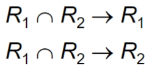
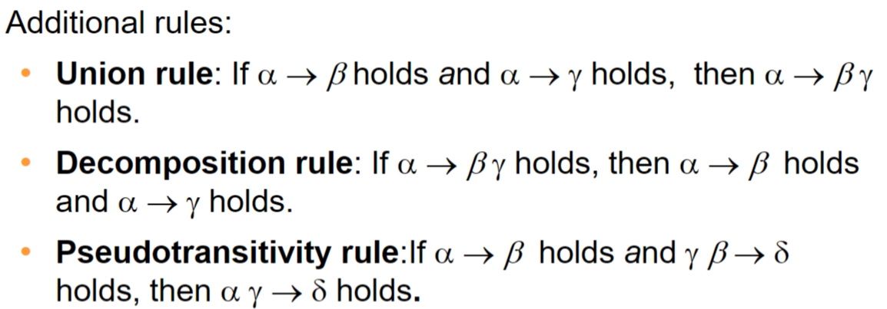
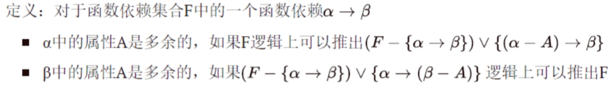
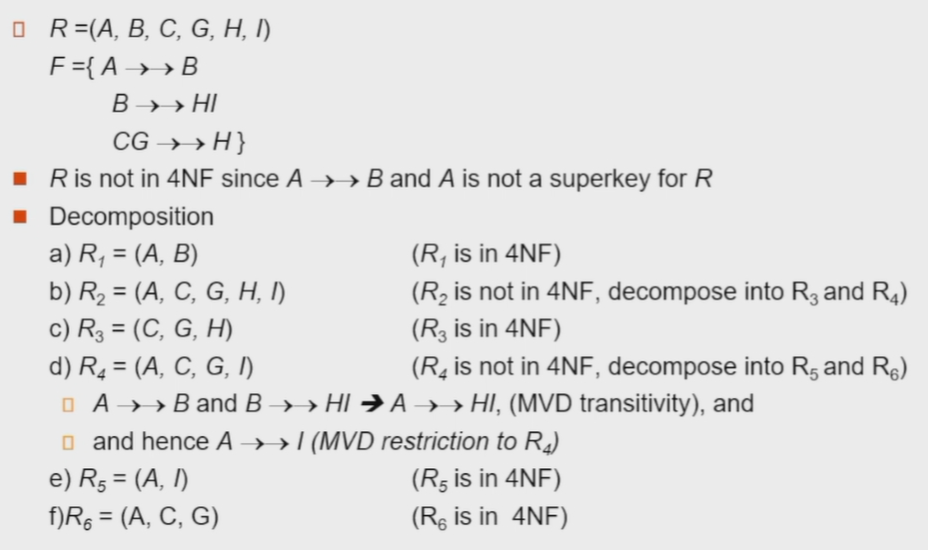
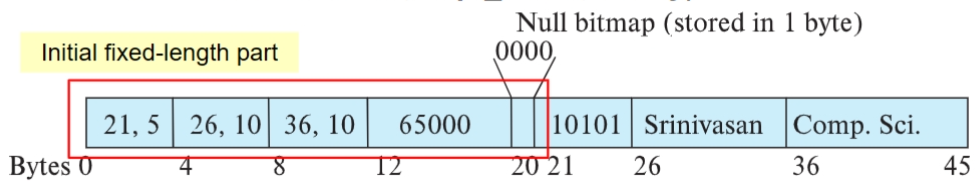
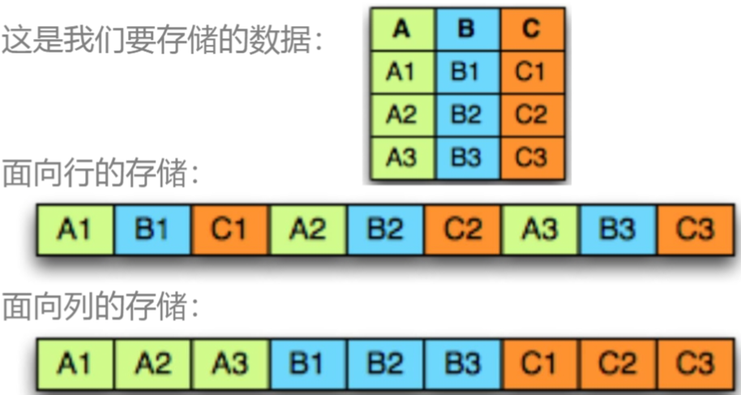
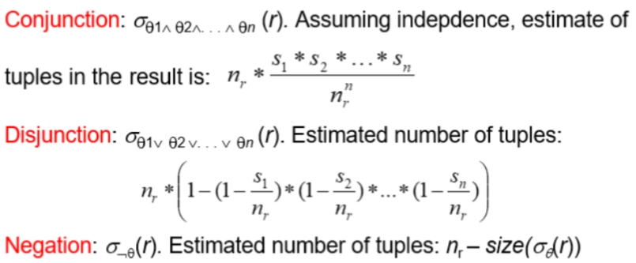
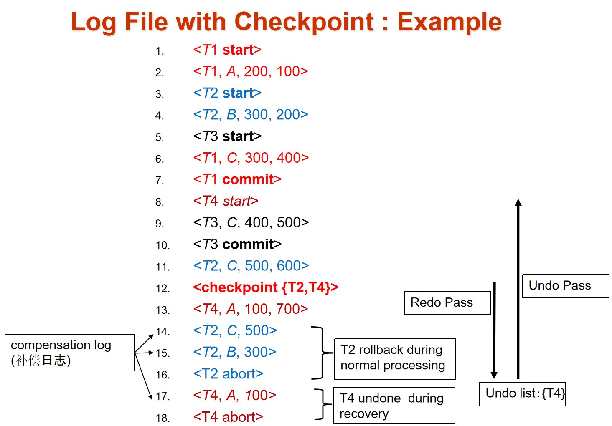

# 数据库系统 Database System

## 1 Introduction


Database-management system(DBMS) 

## 2 Relation schema
realtion 表<br />tuple 元组<br />attribute 列<br />domain 域<br />atomic 原子的：域中的元素是不可再分单元，eg 年龄是原子的，地址不是原子的<br />null value 空值：表示值未知或不存在<br />instance 实例<br />super key 超码：一个或多个属性的集合，可以在一个关系中**唯一**地标识出一个元组<br />candidate key 候选码：**最小的超码**<br />primary key(constraint) 主码：一个关系中可以区分不同元组的主要方式的候选码；应选择那些值（基本）从不变化的属性<br />foreign key：r1 引用 r2（主），r1 中每个元组对 A 的取值必须是 r2 中某个元组对 B（被引用） 的取值

- 被引用属性（集）必须是引用关系的主码

relational database schema 关系数据库架构

eg, $Match(\underline{match\_id},location,time)$

## 3 SQL
数据定义语言 DDL<br />数据操纵语言 DML

### 3.1 基本类型
```sql
char(n) /*固定长度的字符串，若没满n，则补空格*/
varchar(n)
int
smallint /*小整数*/
numeric(p,d)/*共p位，小数点左边有d位*/
real, double precision
float(n)
```
### 3.2 查询基本结构
```sql
select A1,A2...,An 属性
from r1,r2,....,rn 关系列表
where P 谓词

select distinct name/*去重*/
select all name/*（显式）不去重*/
```
`distinct` 强行去重<br />`all`（显式）不去重<br />**select** 子句可含有 +、-、*、/ 运算符<br />**where** 子句可以使用逻辑连词 and、or 和 not，也支持 between and 指定查询范围，支持比较运算符<br />**from** 列出了子句上关系的笛卡尔积

`as`重命名
```sql
select distinct T.name
from instructor as T, instructor as S
where T.salary >S.salary and S.dept_name = 'Biology';
# 同一张表需要在两处出现
```
#### 字符串运算
`upper(s)`大写<br />`lower(s)`小写<br />`trim(s)`去后面的空格

`'Intro%'`匹配以 Intro 开头的字符串<br />`'%Comp%'`匹配包含 Comp 的字符串<br />`'___'`匹配任意三个字符的字符串<br />`'___%'`匹配至少含有三个字符的字符串<br />**escape** 定义转义字符, eg `like 'ab\%cd%' escape '\'`
```sql
select
from
where xx like 'yy%'
where zz like 'ab\%cd%' escape '\'
```

`*`可以在 select 子句中表示“**所有的属性**”，eg `select instructor.*****`，`select *`（from 中所有关系的属性）

`order by` 排序，desc 降序、asc 升序，eg **`order by salary desc, name asc`**，默认升序

where **子句中可以用** `between` 或者 `not between`

```plsql
where A.a = B.a and C = xx
相当于
where (A.a, C) = (B.a, xx)
```
#### 集合运算
**union **将两个查询语句合并，自动去重；保留重复项用 `union all`

- UNION和UNION ALL的ORDER BY子句要写在最后一条SELECT语句后面！

**intersect** 交运算 取交集，自动去重；保留重复项用 `intersect all`

**except** 差运算，输出在第一个但不在第二个的元组，保留重复项用 `except all`

#### 关于空值
|  | A | B | result |
| --- | --- | --- | --- |
| and | true | unknown | unknown |
|  | false | unknown | false |
|  | unknown | unknown | unknown |
| or | true | unknown | true |
|  | false | unknown | unknown |
|  | unknown | unknown | unknown |
| not | unknown | unknown | unknown |

`is null`, `is not null`<br />`is unknown`, `is not unknown`

- 注意：`null=null` 返回 unknown
- Where语句中谓词unknown最终被作为false处理

### 3.3 Aggregate function 聚集函数
**avg(col)** 必须数字集<br />**min(col)**<br />**max(col)**<br />**sum(col)** 必须数字集，忽略输入的 null 值<br />**count(col) **

- `count(*)`计算一个关系中元组的数量，除了**count(*) **之外的聚集函数都忽略输入的 null 值
-  AVG()、MAX()、MIN()、SUM()函数忽略列值为NULL的行
- 使用COUNT(column)对特定列中具有值的行进行计数，忽略NULL值

```sql
select max(salary) max_salary
from employee natural join participate
where pId="p1102"
# 参加"p1102"项目中employee工资最大的值
```

#### group by 分组聚集

- 任何出现在 select 中但没有被聚集（以上 5 个函数）的属性必须出现在 group by 中，否则是错误查询

```sql
# 平均工资大于 10000 的人名并去重
select count(distinct name)
from table_name1
group by dept_name
having avg(salary) > 10000
```

having 子句在 group by 后，针对 group by 每个分组，可以在 having 中使用聚集函数

- where 是针对 from 子句的结果关系
- select 最后对剩下的分组得到单个结果元组

**some() **某一个；=some 等价于 in，≠some不等价于 not in<br />**all() **所有；≠all等价于 not in，=all 不等价于 in


```sql
select eID
from participate
group by eId
having count(distinct role = 3)
# 以3种不同身份参加项目的employee id

select type from movie,comment
where movie.title = commment.title
group by title
having avg(grade) >= all(select avg(grade)
                         from movie,commment
                         where movie.title=comment.title
                         group by title)
# 平均分最高的电影种类

SELECT A.branch_name, avg(balance)
FROM account A, branch B
WHERE A.branch_name = B.branch_name and
	branch_city =‘Brooklyn’
GROUP BY A.branch_name
HAVING avg(balance) > 1200
# 平均余额大于分支城市是Brooklyn的所有分支的分支名字

select account_number AN, balance
from account A
where balance >=(
    select max(balance)
    from account B
    where A.branch_name=B.brantch_name
	)
order by balance
# 每家银行余额最多的账户
```

#### 执行顺序

select->from->where->group by->having->select->distinct->order by

### 3.4 Nested Subqueries 嵌套子查询
在where 和 from 里面
#### in & not in
测试资格
```sql
select
from
where xx in yy(可以是嵌套语句）;
        
SELECT distinct customer_name
FROM borrower
WHERE customer_name in (
    SELECT customer_name
	FROM depositor)

SELECT distinct customer_name
FROM borrower
WHERE customer_name not in (
    SELECT customer_name
	FROM depositor)
```
#### exist & not exist
- exist 非空时返回 true

- 关系 A 包含关系 B == **not exist** ( B **except** A )
- for all X, P(X) == **not exist** X such that **not** P(X)

```sql
Select title from movie
Except
Select title from movie
Where exists ( 
    select *
	From comment A, comment B
	Where A.title=movie.title 
    And A.user_name = B.user_name
	And B.title=’ the avenger’
	And A.grade <=B.grade )
```

#### unique
没有重复的元组 unique = true<br />如果判断元组结果为空，unique = true<br />当且仅当关系中存在两个元组 t1, t2 & t1=t2，则 unique = false
#### with
定义一种临时关系，只对包含 with 子句的查询有效
```sql
with max_budget(value) as (select xx from table1) /* 命名（变量名）as 一种关系 */
select
from
where ;
```

#### 标量子查询

只返回一个包含单个属性的元组

```sql
select dept_name,
(
    select count(*)
    from instructor
    where department.dept_name = instructor.dept_name
)as num_instructors
from department;
```

### 3.5 数据库创建、修改

#### DDL 数据定义语言

Create, alter, drop table

**create & drop & alter**

```sql
create table department
  (
    dept_name varchar(20),

    /*以下是完整性约束*/
    primary key(dept_name),
    foreign key(x) references y,
      
    check(条件);
    check()in();
  );

drop table r; /*删除表，表没了*/
delete from r;/*删除元组，表还在*/
  
alter table r add A D;
alter table r drop A;
ALTER TABLE employees ADD age INT;
ALTER TABLE employees MODIFY COLUMN salary DECIMAL(10,2);
```
sql 禁止破坏完整性的数据更新

#### DML 数据操作语言

Select, insert, delete, update

**delete**

```sql
delete from r
where P;
```
where 省略时删除所有关系中的元组，但关系还存在，只是变空了

**insert**

```sql
insert into table1(A,B,C)
  values(a,b,c);

insert into table2
  select
  from
  where;
```
在执行插入之前执行完 select 语句很重要，否则以下会产生问题（无限插入）：
```sql
insert into table1
  select * 
  from table1 ;
```
插入（复制）不能是主键

**update**

```sql
update table1
set xxx
where yyy;
```
##### case
```sql
update table1
set salary = case
  when salary <= 10000 
  then salary*1.05
  else salary *1.03
  end;

select case [col_name] # 简单函数
  when [value1]
  then [result1]
  else [default]
 end;
 
 CASE WHEN [expr] THEN [result1]...ELSE [default] END
```
#### DCL 数据控制语言

Grant, revoke 详见 [4.7](#4.7 授权 Authorization)

### 3.6 形式化关系查询语言

选择、投影、并、交、差、笛卡尔积、重命名、自然连接、除


## 4 SQL medium

### 4.1 Join 连接
#### natural join
只考虑两个关系模式中都出现的属性上取值相同的元组对<br />结果中，相同的属性排在最前（去重），然后先左边再右边的属性
```sql
select name,course_id 
from student, takes # 各表做笛卡尔积
where student.ID = takes.ID;
/*相当于*/
select name,course_id
from student natural join takes;
```
```sql
select name, title
from student natural join takes, course
where takes.course_id = course.course_id
/*相当于*/
select name, title
from (student natural join takes) join course using (course_id);
```

- **using** 谓词可以指定属性名列表，`r1 join r2 using(A1, A2)`
- **on** 允许在参与连接上的关系上设置通用的谓词，类似 where；用法与 using 一样，在连接表达式末尾，`join···on P`。

`select from student join takes on student.ID=takes.ID;`<br />在很多情况下，on 可以用 where 等价替换，但它们对外连接的表现是不同的

#### outer join 外连接
类似连接，但是结果中会创建包含空值(NULL)的元组，来保留在连接中会丢失的元组<br />**左（右）外连接**：只保留运算之前左（右）边关系的元组<br />**全外连接（full outer join）**：保留两个关系中的元组<br />eg，`select from student natural left outer join takes;`
### 4.2 Views 视图
一种“虚拟关系”，在概念上包含查询的结果，with 子句拓展到单个查询之外的方式

一种只显示数据表中部分属性值的机制：不会在数据库中创建新的表，只是隐藏了部分数据

 优点：安全，简单易用，逻辑独立

#### 定义视图
`create view v（视图名） as <查询表达式>`

- 一旦我们定义了一个视图，我们就可以用视图名来代指该视图所生成的虚拟关系，用在 from 子句中
- 视图与 with 语句的不同：视图一旦创建，在它被显式删除前都可用；而 with 语句对定义它的查询来说只是本地可用的

视图属性名可以显示指定，下例：
```sql
create view de_total_salary(dept_name, total_salary) as
  select dept_name, sum(salary) # 将sum(salary)名字指定为total_salary
  from instructor
  group by dept_name
```
视图可嵌套定义

#### 物化视图 Materialized view
定义视图的实际关系发生改变，视图也随之发生改变<br />保持物化视图一直在更新状态的过程为物化视图维护，简称视图维护（view maintenance）
##### 更新 update
```sql
insert into faculty
  values('30765','Green','Music');
```
更新可能有问题（插入的值在原来关系上是被新创建的），那么这些值将为 null 在关系表中<br />在这种情况下，通过利用空值来更新关系来得到对视图的更新是不可行的<br />sql 不推荐更新和修改<br />如果满足以下条件，视图是可更新的（插入、更新、删除）：

- from 子句中只要一个数据库关系（创建时只使用了一张表的数据
- The select clause contains only attribute names of the relation and does not have any expressions, aggregates, or distinct specification.  创建时没有进行distinct和聚合操作
- Any attribute not listed in the select clause can be set to null; that is, it does not have a not null constraint and is not part of a primary key. 没有出现空值和default
- The query does not have a group by or having clause.

### 4.3 事物 transaction
查询或更新语句的序列组成<br />commit<br />rollback
### 4.4 完整性约束 Integrity Constraints
完整性约束保证授权用户对数据库所做的更改不会导致数据一致性的丢失；而安全性约束(Security constraints) 是防止未经授权的用户访问数据库
#### 4.4.1 单关系
在 create table 中，<br />`not null` 非空约束，是一种域约束<br />`unique` 唯一性约束，可以为 null<br />`check(P)` 关系中的每个元组必须满足谓词 P（可以是包含子查询在内的任意谓词）；若计算结果为未知，它也是满足的

#### 4.4.2 引用完整性

``foreign key(x) references y``或者``foreign key(x) references y(x)``

第二种被指定的属性列表必须声明为被引用关系的超码

- 外码必须引用一组兼容的属性，数量和数据类型必须兼容
- 可以和定义同时声明外码
- 如果一个级联的更新或删除所导致的对约束的违反不能通过进一步的级联操作来解决，那么系统就会中止该事物，修改被全部撤销

```sql
create table course
(
    ...
    foreign key(dept_name)references department
    	on delete cascade
    	on update cascade,
)
```

级联删除`on delete cascade`：删除引用了被删除系得的元组

#### 4.4.3 给约束赋名

在`create table()`里命名

```sql
salary numeric(8,2),constraint minsalary check(salary>29000)，
```

取消约束用drop

```sql
alter table instructor drop constraint minsalary;
```

#### 4.4.4 断言

断言就是一个谓词，数据库总能满足一个条件，检测和维护的开销较高

```sql
create assertion <assertion-name> check <predicate>;
```

### 4.5 数据类型

#### 4.5.1 时间

时间戳timestamp

``extract(field from d)``从date或time中提取单独的域，如year、second

#### 4.5.2 类型转换

```sql
cast(e as t) #将表达式e转换成t
```

输出空值的方式

```sql
select ID, coalesce(salary, 0) as salary #将salary为null的项输出为0
```

- **coalesce**要求所有参数必须是同类型，eg 空工资不能显示为’N/A‘

- **decode**函数可以更改类型（在Oracle中

```sql
select ID, decode(salary, null, 'N/A', salary) as salary
```

#### 4.5.3 缺省值default

```sql
create table student(
	tot_cred numeric(3,0)default 0,
)
```

#### 4.5.4 大对象

字符数据 `clob()`

二进制数据 `blob()`

获取一个定位器提取数据，而不是都放入内存中

#### 4.5.5 自定义类型
创建类型

```sql
create type dollar as numeric(12,2) final;
# 定义为总共12位的小数，两位在小数点后
# final没有意义，有时可省
```

创建域

```sql
create domain dollar as numeric(12,2) not null;
```

- 域上可以申明非空或缺省值，但是自定义类型不行
- 域不是强类型的（not strongly typed），一个域类型的值可以赋值给另一个域类型

#### 4.5.6 生成唯一码值

```sql
ID number(5) generated always as identity #Oracle、DB2
#此后insert不用输ID
ID serial #PostgreSQL
ID number(5) atuo_increment #MySQL
ID number(5) as identity #SqlSever
```

#### 4.5.7 createtable 拓展

创建相同模式的表

```sql
create table1 like table2;
```

创建查询结果的表

```sql
create table1 as(
	select
    from
    where
)with data;
```

- 与view的区别是：当表被创建时内容被加载，视图总是反应当前查询结果


### 4.6 Index 索引
索引是一种特殊的数据结构<br />创建

```sql
create (unique) index <索引名> on <关系名> (<属性列表>);
```

撤销

```sql
drop index <索引名>;
```

重命名

```sql
ALTER INDEX SCno RENAME SCSno;
```


### 4.7 授权 Authorization

权限操作：选择、插入、更新、删除

#### 4.7.1 授权与收权

授权：

```sql
grant <权限列表>
on <关系名或视图名>
to <用户/角色列表>;
```

如``grant select on department to Amit; grant update(budget) on departmrnt to Amit;``

收权：


```sql
revoke <权限列表>
on <关系名或视图名>
to <用户/角色列表>;
```

如``revoke select on department to Amit; revoke update(budget) on departmrnt to Amit;``

#### 4.7.2 角色

``create role A;``

一个用户/角色的权限包括：

1. 直接授予该用户/角色的所有权限；（给自己授权）
2. 授予该用户/角色所拥有角色的所有权限

- 权限可被继承，如``grant A to B; grant B to C;``，那么C有A和B的所有权限

#### 4.7.3 视图


## 5 Advanced SQL

### 5.1 使用程序设计语言访问SQL

#### 5.1.1 JDBC

动态SQL：JDBC，ODBC

嵌入式SQL

```java
public static void JDBCexample(String userid, String passwd)
{
    try (
        Connection conn = DriverManager.getConnection(//连接
            "jdbc:oracle:thin:@db.yale.edu:1521:univdb",//协议 服务器主机名称 端口号 特定数据库
            userid, //数据库用户标识
            passwd);//密码
        Statement stmt = conn.createStatement();
    ) {
        try {
            stmt.executeUpdate(//执行语句
                "insert into instructor values(’77987’,’Kim’,’Physics’,98000)");
        }
        catch ( SQLException sqle) {
            System.out.println("Could not insert tuple. " + sqle);
        }
        ResultSet rset = stmt.executeQuery(//执行语句
            "select dept name, avg (salary) "+
            " from instructor "+
            " group by dept name");
        while (rset.next()) {//是否还存在尚未提取的元组
            System.out.println(rset.getString("dept name") + " " +
                               rset.getFloat(2));
        }
    }
    catch (Exception sqle)
    {
        System.out.println("Exception : " + sqle);
    }
}
```

##### 预备语句 prepared statement

用？代替某些值

```sql
PreparedStatement pStmt = conn.prepareStatement(
"insert into instructor values(?,?,?,?)");
pStmt.setString(1, "88877");
pStmt.setString(2, "Perry");
pStmt.setString(3, "Finance");
pStmt.setInt(4, 125000);
pStmt.executeUpdate();
pStmt.setString(1, "88878");
pStmt.executeUpdate();
```

- 相同的语句只用编译一次

- 预备语句可以避免SQL注入，因为输入的字符串将被插入转义字符

- 不要创建一条连接字符串的查询

`.getMetaData()` 在运行时从数据库系统获得所处数据的声明

`.setAutoCommit(true/false)` 开/关自动提交

`.commit()`事物必须显式地提交/回退

`.rollback()`

#### 5.1.2 ODBC

open data connectivity

```sql
void ODBCexample()
{
	RETCODE error;
	HENV env; /* environment */
	HDBC conn; /* database connection */
	SQLAllocEnv(&env);
	SQLAllocConnect(env, &conn);
	SQLConnect(conn, "db.yale.edu", SQL NTS , "avi", SQL NTS ,"avipasswd", SQL NTS );
{
	char deptname[80];
	float salary;
	int lenOut1, lenOut2;
	HSTMT stmt;
	char * sqlquery = "select dept name, sum (salary)
from instructor	group by dept name";
	SQLAllocStmt(conn, &stmt);
	error = SQLExecDirect(stmt, sqlquery, SQL NTS );
	if (error == SQL SUCCESS ) {
		SQLBindCol(stmt, 1, SQL C CHAR , deptname , 80, &lenOut1);
		SQLBindCol(stmt, 2, SQL C FLOAT, &salary, 0 , &lenOut2);
		while ( SQLFetch (stmt) == SQL SUCCESS ) {
			printf (" %s %g∖n", deptname, salary);
		}
	}
	SQLFreeStmt(stmt, SQL DROP );
}
	SQLDisconnect(conn);
	SQLFreeConnect(conn);
	SQLFreeEnv(env);
}
```


#### 嵌入式SQL

`EXEC SQL <嵌入式SQL语句> END_EXEC;` 识别嵌入sql请求

可使用宿主语言host language的变量，需在变量名前加上**:**

遍历一个嵌入式sql的查询结果，声明一个游标变量(cursor)，`declare c cursor for <SQL query>`

`EXEC SQL open c;` open 执行语句并将结果存在一个临时关系中

`EXEC SQL fetch c into :si, :sn` fetch 在查询结果中一个元组的值放在宿主语言变量中

如何更新：

```sql
EXEC SQL
declare c curor for
	select*
	from instructor
	where dept_name='Music'
	for update
```

### 5.2 函数与过程

#### 5.2.1 函数

```sql
create function dept_count(dept_name varchar(20))
	returns integer
	begin
	declare d_count integer;
		select count(*) into d_count
		from instructor
		where instructor.dept_name= dept_name
	return d_count;
	end
```

​	使用方法：`dept_count(dept_name)`

**表函数（table function）**

```sql
create function instructor of (dept name varchar(20))
returns table (
    ID varchar (5),
    name varchar (20),
    dept name varchar (20),
    salary numeric (8,2))
return table
(select ID, name, dept name, salary
 from instructor
 where instructor.dept name = instructor of.dept name);
```

​	使用方法：`select * from table(instructor_of('Finance'));`

#### 5.2.2 过程 procedures

以上dept_count也可以写成一个过程：

```sql
create procedure dept_count_proc(in dept_name varchar(20),out d_count integer)
    begin
    	select count(*) into d_count
    	from instructor
    	where instructor.dept_name= dept_count_proc.dept_name
    end
```

​	in 待赋值的参数；out 返回结果参数

​	使用方式：`declare d_count integer; call dept_count_proc('Physics',d_count);`

##### while and repeat statements

```sql
while boolean expression do
	sequence of statements ;
end while
repeat
	sequence of statements ;
until boolean expression
end repeat
```

##### loop

```sql
declare n integer default 0;
for r as
	select budget from department
	where dept_name = 'Music'
do
	set n = n + r.budget
end for
```

##### if-then-else

```sql
if boolean expression
	then statement or compound statement
elseif boolean expression
	then statement or compound statement
else statement or compound statement
end if
```


### 5.3 Trigger 触发器

只要发生特定的事件并且满足相应的条件，数据库系统自动执行

可用来实行特殊的完整性约束

以下展示触发器确保section关系的time_slot_id属性上的引用完整性

```sql
create trigger timeslot check1 after insert on section # 插入后启动
referencing new row as nrow # 创建了一个过渡变量nrow，用来存储所插入行的值（除了插入还可以用来更新
for each row # 显式地在被插入每一行上迭代
when (nrow.time slot id not in ( # when指定条件
    select time slot id
    from time slot)) /* time slot id not present in time slot */
begin
rollback
end;

create trigger timeslot check2 after delete on timeslot #删除后
referencing old row as orow # 创建一个变量存储已更新或删除的行的值
for each row
when (orow.time slot id not in (
    select time slot id
    from time slot) /* last tuple for time slot id deleted from time slot */
      and orow.time slot id in (
          select time slot id
          from section)) /* and time slot id still referenced from section*/
begin
rollback
end; # begin automic <sql语句> end;
```

## 6 E-R 模型的数据库设计

实体-联系模型

### 6.1 设计

E-R模型由实体entities和关系relation组成
• 实体：用于区分其他种类的物体
• 可以是具体的货抽象的
• 拥有自身的属性
• 关系：实体之间的联系
• 一对一、一对多、多对多

### 6.2 实体和联系

实体(entity)：可区别于其他对象的“事物”或“对象”；例如，人、课程

实体集(entity set)：共享相同性质、具有相同类型的实体的集合

- 实体集是矩形，属性是由直线连接的椭圆形
- 

联系(relationship)：多个实体之间相互关联

联系集(relationship set)：相同类型联系的集合

- **联系集**在E-R图中用**菱形**表示，菱形通过**线条**连接都多个不同的**实体集**（**矩形**）


- 联系集的**度**(degree)：参与联系集的实体集的数目（二元联系集的度为2）
- 联系集的**属性**是未分割的矩阵，用**虚线与联系集的菱形相连**
- 联系集仅显示在一个位置，但实体集可以在不止一个位置重复出现

### 6.3 复杂属性

- 域/值集：属性可以取值的集合

- 简单属性不能被划分成子部分；复合(composite)属性可以划分，如name包括first name,last name

- 单值single-valued属性：属性对一个特定实体只有一个单独的值（如学生的ID）；多值 mutivalued属性：对应于一组值（教师的电话号码{phone_num}）

- 派生属性derived：不存储它的值，只在需要的时候计算出来

### 6.4 映射基数

映射基数(mapping cardinality)：一个实体额能通过一个联系集关联领一些实体的数量

联系集和实体集之间：

- **有向线段→**指向”一“的一侧，**无向线段–** 指向”多“的一侧

- **双线**表示一个实体在联系集中全部参与

全部参与：一个实体集E中的每一个实体都参与到联系集R的至少一个联系中，否则就是部分参与

`l..h`：l表示最小基数，h表示最大基数


​	一位教师可以有0或多名学生，每名学生必须有且只有一位导师

### 6.5 主码

#### 6.5.1 联系集R的主码

联系集R的主码：实体集的$primary-key(E_i)$ 的集合，也是超码

若有属性，实体集的$primary-key(E_i)$ 的集合再并上属性能构成联系集R中一个单独的联系

我们至多允许一个箭头从一个非二元的联系集指出

#### 6.5.2 弱实体集

弱实体集(weak entity set)的存在依赖于另一个标识性实体集(indentifying entity set)；我们使用标识性实体集的*主码*和*分辨符属性*(discriminator attribute)来唯一地标识弱实体。

每一个弱实体必须和一个标识性实体相关联，它们的相关联关系被称为标识性联系(identifying relationship)

- **双边框的矩形**描述弱实体集，其分辨符被加上**虚的下划线**
- 关联弱实体集和标识性强实体集的联系集以**双边框的菱形**表示

### 6.6 删除冗余属性

### 6.7 将E-R图转换成关系模式

### 6.8 拓展

#### 6.8.1 特化

在实体集内部进行分组的过程称为**特化(specialization)**

- 特化用从特化实体指向另一方实体的**空心箭头**来表示

重叠(overlapping)特化：一个实体可以属于多个特化实体集

不相交(disjoint)特化：一个实体属于至多一个特化实体集

- 特化联系还可以被称作超类-子类联系(superclass-subclass)

#### 6.8.2 概化


#### 6.8.5 聚集

聚集(aggregation)是一种抽象

#### 6.9 问题

- 联系集中已经隐含相关实体集主码属性了，不能再将它们作为联系集的属性

## 7 关系数据库设计

### 7.1 好的设计关系的特点

#### 7.1.1 分解

无损分解lossless decomposition：如果用两个关系模式R1和R2去替代R时没有信息丢失，则该分解是一个无损分解。

#### 7.1.2 规范化理论

### 7.2 使用函数依赖进行分解

#### 7.2.1 符号

属性集：$\alpha$

$r(R)$​：具有模式R的关系r

K：R的一个超码

函数依赖：

如果$R_1∩R_2$ 构成$R_1$ 或$R_2$​​ 的超码，那么R的该分解就是一个无损分解。

#### 7.2.2  函数依赖

$F^{+}$表示集合F的闭包，即能从给定的集合F 推导出所有函数依赖的集合，$F^{+}$​包含所有的函数依赖

**平凡trivial函数依赖**：函数依赖被所有关系满足。一般来说，如果β ⊆ α，则形如α → β的函数依赖是平凡的


#### 7.2.3 无损分解

有损分解：不能用分解后的几个关系重建原本的关系

无损分解：R分解为（R1，R2）并且R= R1∪R2

无损分解判定方法：

- 当且仅当$R_1∩R_2→R_1$ or $R_1∩R_2→R_2$ ，或者说$R_1∩R_2$要么构成R1的超码要么构成R2的超码

##### Example

*For the relation schema R(A, B, C, D) with the functional dependencies set F={A→B, B→CD}.*
*1)List all candidate keys of the relation.*
*2)Decompose the relation into a collection of BCNF relations. The decomposition must be lossless-join.*

1) A是候选码

2) R还不是BCNF，因为存在一条非平凡的函数依赖B→CD，它的左边不是key。
3) R1={B, C, D}, R2={A, B}. F1={B->CD}, F2={A->B}。 R1∩R2=(B), B是R1的候选码，所以分解是无损的。

### 7.3 范式

#### 7.3.1 BCNF(Boyce-Codd Normal Form)

##### BCNF 定义

A relation schema R is in BCNF with respect to a set F of functional dependencies if, for all functional dependencies in $F^+$ of the form α → β, where α ⊆ R and β ⊆ R, at least one of the following holds 闭包F^+^中的**所有函数依赖**α → β**至少**满足下面一条：

- α → β is a trivial functional dependency 平凡函数依赖(即 β ⊆ α).
- α is a superkey超码 for schema 关系模式R，即α → R

*没有函数依赖也是BC范式（F是空的）*

算法：如果左边(α)和右边(β)有公共属性，把右边的公共属性去掉；


**依赖保持dependency preserving**：如果通过检验单一关系上的函数依赖，就能确保所有的函数依赖成立，那么这样的分解时依赖保持的；或者原来关系R上的每一个函数依赖，都可以在分解后的单一关系上得到检验或者推导得到。


令$F_1∪F_2∪……∪F_n=F'$, $F'^+=F^+$的分解为**保持依赖的分解**(dependency-preserving decomposition)

BCNF和函数依赖可能不能同时满足，所以出现了第三范式——放松了对非平凡函数依赖左边必须是超码的约束。

##### BCNF检测

1. 检查一个**非平凡**的函数依赖`α → β`是否违反BCNF：计算$\alpha^+$（α的属性闭包）检查它是否包含R中的所有属性（是否是R的一个超码）；如果是，则满足BCNF

2. 检查一个关系模式R知否属于BCNF：检查给定集合F中的依赖是否违反

3. 检查R上的一个分解模式$R_i$是否违反BCNF：
   - 检查给定集合中$F^+$中的依赖是否违反
   - 对于$R_i$中属性的每个子集$\alpha$，检查$\alpha^+$，要么不包含$R_i-\alpha$的任何属性，要么包含$R_i$的所有属性；如果$R_i$中某个属性集$\alpha$违反了该条件，则$\alpha → (\alpha^+-\alpha)∩R_i$这个函数依赖说明$R_i$违反了BCNF

- 如果F中没有依赖违法BCNF，则在$F^+$​中也不会有依赖违反BCNF

##### Example1

R=(A,B,C), F={A->B, B->C}, KEY={A}

R不是BCNF，因为B不是key，但可以通过分解R使之满足BCNF

##### Example2

*Decomposition R1=(A, B), R2 =(A, C)*

1. F1=(A→B}，F2={A→C)
2. R1 and R2 in BCNF
3. Lossless-join decomposition
4. Not dependency preserving, since $(F1 ∪F2)^+<> F^+$​ 

##### Example3

R=(A,B,C), F={A->B,B->C) 无损分解


#### 7.3.2 第三范式 3NF

定义：对$F^+$ 中形如 α → β的函数依赖, where α ⊆ R and β ⊆ R, at least one of the following holds:

- α → β is a trivial functional dependency 平凡函数依赖(即 β ⊆ α).
- α is a superkey超码 for schema R
- β-α中的每个属性A都被包含在R的一个候选码中（不是单个候选码必须包含β-α的所有属性，属性可以被包含在不同候选码中）

BCNF一定是3NF，实际上3NF是为了保证独立性保护的BCNF

3NF有冗余，某些情况需要设置一些空值

3NF要求消除非主属性对主键的传递依赖

##### 3NF判定

不需要判断闭包中的所有函数依赖,只需要对已有的F中的所有函数依赖进行判断

用闭包可以检查α→β中的a是不是超键；如果不是，就需要检查β中的每一个属性包含在R的候选键中

### 7.4 函数依赖理论

#### 7.4.1 函数依赖的闭包

$$\alpha\beta=\alpha∪\beta$$

**阿姆斯特朗公理** Armstrong's axiom：用来寻找被逻辑蕴含的函数依赖



#### 7.4.2 属性集的闭包

令$\alpha$为一个属性集，如果$\alpha$的闭包$\alpha^+$里包含R中所有属性，则$\alpha$​为超码（画有向图）

##### 用途（为什么计算属性闭包？）

1. 判断$\alpha$是不是超码（主键）：计算$\alpha^+$，检查其是否包含R中的所有属性；如果a的闭包包含了所有属性，则a是主键
2. 检查函数依赖α → β是否成立（属于$F^+$）：计算$\alpha^+$，检查它是否包含$\beta$
3. 计算函数依赖闭包F+，以得到整个关系模式的闭包

#### 7.4.3 正则覆盖 Canonical cover

 正则覆盖是函数依赖关系的最小集合，非正则覆盖的的产生主要是因为有了无关属性

**无关属性** extraneous：去除也不改变该函数依赖集的闭包



从右侧移除一个属性可以使之变成更强的约束：If A ∈ β, to check if A is extraneous, consider the set `F′ = (F−{α→β}) ∪ {α→(β−A)}`and check if α → A can be inferred from F ′. To do so, compute α+ (the closure of α) under F ′; if α+ includes A, then A is extraneous in β.

从左侧移除一个属性可以使之变成更弱的约束：To test if attribute A∈a is extraneous in a. Let `y=a-{A}`. Check if y→β can be inferred from F. Compute y* using the dependencies in F. If y* includes all attributes in β then, A is extraneous in a.


##### 正则覆盖$F_c$​​的性质

- $F$和$F_c$互相逻辑蕴含对面
- $F_c$中的任何函数依赖都不包含无关属性
- $F_c$中每个函数依赖的左侧都是唯一的，eg 不存在两个依赖关系$\alpha_1→\beta_1$和$\alpha_2→\beta_2$，满足$\alpha_1=\alpha_2$​

正则覆盖不一定唯一

##### Example

1. 假定F包含 AB → CD, A → E, E → C。为了检验 C 在 AB → CD中是否是无关的，计算F ′ = {AB → D, A → E, E → C}下AB 的属性闭包 。该闭包为ABCDE，包含CD，所以C是无关的。

2. 关系R(A, B, C, D, E), F={B → A, A → B, AB → C, B→C, CD→E}。

   则正则覆盖为：{ A → B, B → AC, B→C, CD→E}；候选码为AD、BD；R不是BCNF， A → B, A不是key

   可BCNF无损分解为：R1(C, D, E), F1={CD→E}，R2(B, C), F2={B→C}，R3(A, B), F3={A→B, B→A}，R4(A,D), F4={A→D}，也是依赖保持的；

   或者分解为：R1(B, C), F1={B→C}，R2(A, B), F2={A→B, B→A}，R3(A,D,E), F3={AD→E}，不是依赖保持的无法检验CD→E；

   或者分解为：R1(A B), F1={A→B, B→A}，R2(C, D, E), F2={CD→E}，R3(A,C,D), F3={AD→C}，不是依赖保持的，闭包≠原来的，把R3继续分解成R3(A, C), F3={A→C}，R4(A, D), F2={A→D}，依赖保持（不能单独检验但F并起来可以检验）

   分解从叶子（末尾）更可能保持依赖


### 7.6 使用多值依赖的分解

#### 7.6.1 多值依赖

多值依赖又称为元组产生依赖

多值依赖 α →→ β：α和β之间的联系独立于 α 和 R-β 之间的联系。若模式R上所有关系都满足多值依赖α →→ β，则α →→ β在模式R上是**平凡的多值依赖**，即  β ⊆ α 或 α∩β=R，则 α →→ β 是平凡的

eg，一位教师与其地址的联系独立于该教师与系之间的联系

- 若α → β，则 α →→ β，即每一个函数依赖也是一个多值依赖
- 若α →→ β，则 α →→ R- α -β

#### 7.6.2 第四范式

定义：对于 $D^+$ 中所有形如 α →→ β的多值依赖，其中 α ⊆ R and β ⊆ R，至少有一下之一成立：

- α →→ β 是一个平凡的多值依赖
- α 是 R的一个超码

每个4NF都属于BCNF

#### 7.6.3 4NF分解

令r(R)是一个关系模式，D为R上的函数依赖和多值依赖的集合。令r1(R1)、r2(R2)为一个分解，当且仅当以下的多值依赖至少有一个属于$D^+$，这个分解是R的无损分解：

- R1∩R2→→ R1
- R1∩R2→→ R2

##### Example




### 7.7 第一范式

如果一个域的元素被认为是不可再分的单元，则称这个域是原子的（atomic）。如果一个关系模式R的所有属性的域都是原子的，则称R属于**第一范式**。

eg，如果职员的编号组成为“系+号码”（CS0010），则这个属性不是原子的，即该关系模式非第一范式

- 在任何关系数据库中，第一范式都是最基本的要求
- 第一范式不足：数据冗余、更新数据复杂、插入和删除数据异常

### Questions

1.  For a database table, which description is **correct**?  

   **A**. *First Normal Form (lNF) requires that each column in the table has atomicity* 

   B. Second Normal Form (2NF) requires that each column in the table is not null 

   C. Third Normal Form (3NF) requires that each column in the table has uniqueness. 

   D. Bovce-Codd Normal Form (BCNF) requires that each column in the table is a primary key.

> - **Third Normal Form (3NF):** A table is in 3NF if it is in 2NF and all the columns are mutually independent except for the primary key dependencies. That means there should be **no transitive dependency** for non-prime attributes as part of another non-prime attribute.
>
> - **Boyce-Codd Normal Form (BCNF):** A stronger version of the 3NF, BCNF is reached when, for every one of its dependencies, the left side is a super key, which is a key that uniquely identifies a row.

2. For relation schema R(A,B,C,D)with functional dependencies set F={A→C, C→A, AB→CD, BC→AD). 
   1) Find all candidate keys of R. 
   2) Is R in BCNF? Explain the reason.

> 1. AB, BC
> 2. Since there are dependencies (A→C and C→A) where the left-hand side is not a superkey, **R is not in BCNF**

3. 

> a. Functional Dependencies:
>
> From the table structure and description, we can identify the following functional dependencies:
>
> 1. branchID → addressInformation, mgrStaffID, name
>    - Since each branchID is unique and identifies a specific branch with its address and manager.
> 2. mgrStaffID → name
>    - Each manager’s ID identifies a unique manager, and therefore, a unique name.
>
> Why this table is not in 3NF:
>
> The table is not in Third Normal Form (3NF) because it violates the rule that every non-key attribute must depend only on the primary key. Here:
>
> - The non-key attribute `name` depends on `mgrStaffID`, which is not part of the primary key (`branchID`). This dependency creates a transitive dependency (a 3NF violation) as `name` is dependent on `mgrStaffID` which in turn depends on `branchID`.
>
> b. Normalization to Third Normal Form (3NF):
>
> Decompose to remove transitive dependencies to make all attributes depend only on the primary key.
>
> - **Table 1 (BranchTable):**
>   - **branchID**: Primary Key
>   - **addressInformation**
>   - **mgrStaffID**: Foreign Key referencing ManagerTable
> - **Table 2 (ManagerTable):**
>   - **mgrStaffID**: Primary Key
>   - **name**
>
> c. Primary Key and Foreign Keys in the 3NF Relations:
>
> as b is showed abo

## 8 存储管理

### 8.1 物理存储概述


高速缓存cache：最快最昂贵
主存 main memory
闪存 flash
磁盘magnetic disk：磁盘读写慢是因为它是机械运动；写比读慢，因为要检查校验位
光学存储器 optical：DVD
磁带/磁盘存储器 magnetic tapes

磁带储存器被称为顺序访问：

- 顺序访问(sequantial access)模式：连续的请求会请求处于相邻的磁道或者相邻的磁道上连续的块。顺序访问中只有读取第一个块时需要寻道，后续的请求不需要寻道。

磁盘和SSD存储器被称为随机访问：

- 随机访问模式(random access)模式：相继的请求会请求那些随机位于磁盘上的块，每一次请求都需要一次磁盘寻道。一张磁盘在每秒能够满足的随机块访问的数量取决于寻道时间

磁盘和高速缓存的速度差大约7个数量级


### 8.2 磁盘

磁盘表面被逻辑地划分为**磁道**（track），磁道又被划分为**扇区**（sector）。**扇区**是磁盘读写信息的**最小单位**（一般512bytes）。
数据以**块**为单位在磁盘和主存间传输。块是一个逻辑单元，包含固定数目的扇区

磁盘质量的主要度量指标：容量capacity、访问时间access time、数据传输率data-transfer rate、可靠性（平均故障时间Mean time to failure）

访问时间 = 寻道时间seek time + 旋转延迟时间rotatinal lantency time

平均故障时间（MTTF）越长越好（我们希望设备无故障运行的时间）

每秒I/O操作数（IOPS）


RAID（Redundant Array of Independent Disk）独立磁盘冗余阵列。

- 通过冗余提高可靠性
- 通过并行提高性能

优化方法：buffering, read-ahead, disk-arm-scheduling, file organization

### 8.3 闪存

NAND

SSD固态硬盘，和磁盘相比具有更低的数据访问延迟和更高的数据传输带宽

闪存必须先擦除后再写；为了快速访问，逻辑到物理的页面映射被复制到内存中的转换表中

### 8.4 文件组织

块是储存分配和数据传输的（最小）单位

每条记录被完全包含在块内（不允许跨块存储

#### 8.4.1 定长记录

文件的开头分配了特定数量的字节作为文件头；被删除的记录形成了一条自由链表

每个文件被划分为固定长度的block，block是数据存取/存储空间分配的基本单位

- 记录的长度不能超过block
-  每条记录一定都是完整的
- 参考实现：Free List 用链表的形式来存储records
- 优势：存储和读取访问寻址简单
- 缺点：可能浪费存储空间

#### 8.4.2 变长记录

在记录的初始部分被表示为（偏移量，长度）对，即（数据开始位置，变长属性的字节长度）

- 属性按照顺序连续存储
- 变长的变量用offset+data的形式存储，空值用null-value bitmap存储

空位图(null bitmap)



分槽的页slotted page结构，记录从末尾处开始**连续**分配空间


Block Header内容

- 记录的总数
- lock中的空闲区域的end
- 每条记录所在的位置和大小

指针指向头中记录的条目

#### 8.4.3 列式存储



优点：

- 当只访问部分属性时，减少IO开销
- 提高CPU缓存性能
- 提高压缩率
- 可以在现代CPU架构中实现Vector Processing

缺点：

- 行重构开销更大
- 删除和更新的开销更大
- 解压所需时间更长

列式存储column在数据查询方面表现更好，但是在事务处理方面表现较差

### 8.5 文件中记录的组织

#### 8.5.1 堆文件组织

自由空间图（free-space map）

每个项表示一个比例f，即块中有至少比例为f的空间是自由的

块i的自由空间比例=值/2^n(bits)^

二级自由空间图：每个项表示自由空间图100个项，存储值为100个项中的最大值

#### 8.5.2 顺序文件组织

按某个搜索码排序

搜索码是任意属性或者属性的集合

每条记录指向按搜索码顺序排序的下一条记录，处理时顺序和物理顺序不同

#### 8.5.3 多表聚簇文件组织

聚簇码（cluster key）定义了哪些记录被存储在一起

#### 8.5.4 划分

表划分（table partitioning）通常基于一个属性值完成，将关系划分成更小的关系来存储

### 8.6 数据字典存储

数据字典存储元数据

元数据（metadata）：关于数据的数据，例如维护关于关系的数据

### 8.7 数据库缓冲区

#### 8.7.1 缓冲区管理器

在一个进程从缓冲块中读取数据之前，先执行pin（钉住）这个块；进程完成数据读取后，再执行解除钉住操作

对多进程，每个缓冲块维护**钉住计数**，只有一个页面的钉住计数为0时，块才能被移除

共享/排他锁：？

#### 8.7.2 替换策略 Buffer-Replacement Policy

最近最少使用（LRU）在操作系统中时可以接受的，但在数据库中替换块的最优策略是最近最常使用（MRU）

日志磁盘（log disk）：写操作，先写日志（buffer中，再修改数据

https://chatgpt.com/share/29bc8b7e-8a42-44d6-a99b-45d5d77d95cb

### Questions

哈希查询适合单点查询，范围查询的话顺序查询更好

## 9 索引

### 9.1 基础

如果一个文件上有多个索引，那它就有多个搜索码

两种基本索引类型：顺序、散列

评价因素：访问类型、访问时间、插入时间、删除时间、空间开销

索引项（index entry）由一个搜索码值和指针构成

主索引（primary index）比secondary index 高效

### 9.2 顺序索引

**聚集（主）索引**：搜索码定义了文件的次序，即允许按照与一个文件中的物理顺序相对应的顺序去读取该文件的记录

**稠密**索引（dense index）：每个搜索码值都有一个索引项

**稀疏**索引（Sparse index）：只为某些搜索码值search-key建立索引项，只有是聚集索引（顺序文件）时才使用稀疏索引

辅助索引（Secondary Indices）：数据文件中的记录顺序与索引文件中索引项的顺序不一致，应用于需要查询的field并非主键

多级索引（multilevel indices）：把内层索引文件看作顺序数据文件一样，在其上建立外层的稀疏索引

非唯一性搜索码（nonunique search key）：如果一种关系可以又不知一条包含相同搜索码值得记录

复合搜索码（composite search key）：包含多个属性，按字典序排列

### 9.3 B+树索引

#### 9.3.1 结构

性质：


B+树计算：

n：B+树每个节点的指针数量

非叶结点有⌈𝑛/2⌉~n个孩子；根节点有2 ~ n个孩子

- 每个**叶节点**最多可有**n-1**个值，最少包含**⌈(𝑛-1)/2⌉**个值

- 非叶节点是一个多级稀疏索引，最多容纳n个指针，最少容纳⌈𝑛/2⌉个指针

- 根节点包含的指针可以少于⌈𝑛/2⌉，但必须至少包含两个指针（除了树只由一个节点组成）


N：搜索码个数

B^+^树高度估计：

- 最小：所有叶节点都满，$h=\lceil{log_n(N)}\rceil$ 不太对
- 最大：所有叶节点都半满，$h=\lceil{log_{\lceil{n/2}\rceil}(N/2)}\rceil$

#### 9.3.2 查询

如果文件中有N个搜索码值，那么这条路径的长度（树高）不超过$$⌈log_{⌈𝑛/2⌉}N⌉$$​，这里 n(fan-out or entries)=磁盘规模(4096B)/（搜索码+指针规模）(B)

- 最坏查询Block数量=路径长度+bucket block+查询内容block

在叶子节点，如果给定范围内有M个指针，则最多需要访问⌈M/(n/2)⌉+1个叶节点来检索指针

日志结构合并树LSM(log-structured merge tree) trees：一个内存树+多个磁盘树，对写做优化，牺牲了部分读型讷讷感

#### 9.3.3 更新

插入时，将原来叶节点n-1个值和待插入的一个值分成两组，前⌈𝑛/2⌉个值放到原来的节点中

在进行删除后，B+树种非叶节点出现的值可能在树的任何叶节点中都不存在

更新的复杂度：和$$log_{⌈𝑛/2⌉}N$$成正比

Buffer trees：给B+树每个内部节点一个buffer

对于叶节点，索引将被插入到根的缓冲区中，而不是遍历树。如果缓冲区满时，缓冲区中的每个索引记录都会从树向下推一级到相应的子节点。如果子节点是内部节点，则将索引记录添加到子节点节点缓冲区；如果该缓冲区已满，则该缓冲区中的所有记录都会类似地被下推。
缓冲区中的所有记录在按下之前都按搜索键进行排序。如果子节点是一个叶节点，索引记录以通常的方式插入到叶中。如果插入导致过满的叶节点、该节点以通常的B+树方式被分割，其中分裂可能传播到父节点。过满内部的拆分节点是以通常的方式完成的，同时还有拆分缓冲区的附加步骤；这个缓冲区条目根据它们的键值在两个拆分的节点之间进行分区。

插入次数减少，所以I/O次数会少

#### 9.3.4 非唯一性搜索码

方法1：每个码只储存一次，维护一个带有搜索码值的记录指针的桶bucket

方法2：每条记录储存一次搜索码值

#### Quiz

1. Considering a B+ tree for indexing, Each node can fit **three pointers** and **two key values**, denoted as $<A_1, K_1, A_2, K_2, A_3>$, Within each node, the keys satisfy K1 < K2, For all search field values X in the sub-tree pointed by Ai, we have:  $K_{i-1} ≤ X<K_i$; for 1<i<3; $X<K_i$ , for i=1; $K_{i-1}≤X$, for i=3; Construct a B+ tree for the following set of key values:(2, 3, 6, 4, 5, 1, 8, 7), assuming that values are inserted one by one, and the number of key values in internal nodes and leaf nodes are both 2. When we split a node, one value remains in the left node and the other two are split out to the newly created right one.  

   

   

3. Assume that the B+ tree(n=3) contains 2024 index items, estimate the **height** of the B+ tree. Give the lower and upper bound.

> B+ Tree Properties:
>
> - Each internal node can have between ⌈𝑛/2⌉=2 and 𝑛=3 children.
> - Each leaf node can have between ⌈𝑛/2⌉−1=1 and 𝑛−1=2 keys.
>
> **Lower Bound Calculation:**
>
> - For the lower bound, assume the internal nodes have the minimum number of children.
>
> 1. Height 1 (root level): At least 1 node.
> 2. Height 2: At least 2 nodes (each node at level 1 has at least 2 children).
> 3. Height 3: At least 2^2^=4 nodes.
> 4. Height ℎ: At least 2^ℎ−1^ nodes.
>
> So, at height ℎ, we have at least: 
> $$
> \sum_{i=0}^{h-1}2^i=2^h-1
> $$
> Given 2024 index items: 
>
> 2^ℎ^−1 ≥ 2024
>
> ℎ ≥ $log⁡_22025$ ≈ 10.001
>
> So, the lower bound height is approximately 11.
>
> **Upper Bound Calculation:**
>
> - For the upper bound, assume the internal nodes have the maximum number of children.
>
> 1. Height 1 (root level): At most 1 node.
> 2. Height 2: At most 3 nodes (each node at level 1 has at most 3 children).
> 3. Height 3: At most 32=932=9 nodes.
> 4. Height ℎ: At most 3^ℎ−1^nodes.
>
> So, at height ℎ, we have at most: 
> $$
> \sum_{i=0}^{h-1}3^i=\frac{3^h-1}{2}
> $$
> Given 2024 index items:
>
> $\frac{3^h-1}{2}$≥2024
>
> ℎ ≥ $log⁡_34049$ ≥ 7.56
>
> So, the upper bound height is approximately 8.

4. Assume that the B+ tree (n=3) contains 2024 index items, estimate the size (i.e. the number of nodes) of the B+ tree. Give the lower and upper bound.

> **Lower Bound Calculation:**
>
> Maximum keys per node: 2 keys (since 𝑛=3*n*=3, each node can hold 2 keys). 向上取整！
>
> - Number of leaf nodes: ⌈2024/2⌉=1012.
> - Number of internal nodes: ⌈1012/3⌉=338. At the bottom level (just above leaf nodes), each internal node can have up to 3 children (pointers).
>
> - At the next level: ⌈338/3⌉=113
> - At the level above that: ⌈113/3⌉=38
> - Continuing further: ⌈38/3⌉=13
> - Next level: ⌈13/3⌉=5
> - Finally: ⌈5/3⌉=2
> - And at the root level: ⌈2/3⌉=1
>
> ​	So, the total number of nodes (summing all levels) for the lower bound is approximately: 1012+338+113+38+13+5+2+1=1522
>
> **Upper Bound Calculation:**
>
> Minimum keys per internal node: 1 key (since each node has at least 2 pointers). 向下取整！
>
> - Each leaf node can hold at least 1 key.
> - Number of leaf nodes: ⌈2024/1⌉=2024
>- Number of internal nodes at the bottom level (just above leaf nodes), each internal node can have at least 2 children: ⌊2024/2⌋=1012
> - At the next level: ⌊1012/2⌋=506
>- At the level above that: ⌊506/2⌋=253
> - Continuing further: ⌊253/2⌋=126
> - Next level: ⌊126/2⌋=63
> - And continuing: ⌊63/2⌋=31
> - Next: ⌊31/2⌋=15
> - Next: ⌊15/2⌋=7
> - Finally: ⌊7/2⌋=3
> - And at the root level: ⌊3/2⌋=1
> 
> ​	So, the total number of nodes (summing all levels) for the upper bound is approximately:  
> 
>2024+1012+506+253+126+63+31+15+7+3+1=4041

### 9.4 散列索引 Hash indices

索引记录随机分布

桶bucket记录，桶溢出的话用溢出链来处理多条记录

计算$h(K_i)$​确定桶再遍历桶来查找，不支持范围查询

桶的数量：$(n_r/f_r)*(1+d)$，$f_r$是每个桶容纳的记录的数量，d是避让因子（0.2表示桶中20%的空间大概是空的）

### 9.5 多码索引

### 9.6 位图索引

## 10 查询处理和查询优化

### 10.1 概述


### 10.2 查询代价

在大型数据库中，在**磁盘上存取数据**的代价通常是最主要的代价

总成本cost = b个块\*传输一个数据块的时间$t_r$ + 执行S次随机I/O\*平均块访问时间（寻道+旋转延迟）$t_s$​

$cost = b*t_r + S*t_s$

### 10.3 关系代数运算的执行

#### 10.3.1 选择运算

$h_i$​：索引的高度
$b_r$​：文件中的块数量
$t_T$：一个块的传输时间
$t_s$：一个块的寻道时间


##### 文件扫描

A1 线性搜索
A2 聚集索引+key比较
A3 聚集索引+非key比较
A4 辅助索引+key比较
A4 辅助索引+非key比较
A5 聚集索引+比较
A6 非聚集索引+比较

##### 复杂选择

合取∧：

析取∨：

否定-：

A7 使用一个索引的合取选择
A8 使用组合索引的合区选择
A9 使用标识交集的合区选择
A10 使用标识集的析取选择

#### 10.3.2 排序

外排序 Merge 归并：对M-1个归并段进行归并，每一次归并段的数量减少为原来的1/(M-1)

$b_b$：一次读/写块的个数
buffer blocks per run = read/write $b_b$​​ blocks at a time

$b_r$​：关系r记录的总块数

M：主存缓冲区可以用来排序的块数

传输块总数 block transfers：$b_r ( 2⌈log_{⌊M/b_b⌋–1} (b_r/ M)⌉ + 1)$

寻道次数 seeks：$2⌈b_r/M⌉+⌈b_r/b_b⌉( 2⌈log_{⌊M/b_b⌋–1} (b_r/ M)⌉ - 1)$

Example


块传输总数：$b_b=1, b_r=12, M=3$​，12 ∗ (2*2 + 1) = 60 

磁盘寻道总数：$b_b=1, b_r=12, M=3$， 2*12/3 + 12 ∗ (2 ∗2 − 1) = 44 

#### 10.3.3 连接运算

等值连接（equal-join）表示形如的连接

##### 嵌套-循环 连接（Nested-loop join）

**r** is called the **outer** relation and **s** the **inner** relation of the join；
r外层s内层
$b_r$：关系r记录的总块数
$n_r$：关系r中包含的元组个数

worst case 缓冲区只能容纳每个关系的一个数据块: $(b_r + n_r ∗ b_s )block-transfers + (b_r + n_r) seeks$

best case 缓冲区能同时容纳两个关系（或一个能完全放在内存中的关系作为内层）：$(b_r + b_s )block-transfers + (2) seeks$

##### 块嵌套-循环 连接（Block nested-loop join）

worst case 缓冲区只能容纳每个关系的一个数据块: $(b_r*b_s + b_r)block-transfers + (2b_r)seeks$

best case 缓冲区能同时容纳两个关系（或一个能完全放在内存中的关系作为内层）: $(b_s + b_r)block-transfers + (2)seeks$

因为是block所以算的时候是看number of blocks

- 如果两个关系都不能放进内存中，则**小关系作为外层关系**连接效率更高

Improved: M为块数


##### 索引嵌套-循环连接（indexed nested-loop join）

$t_T$：一个块的传输时间
$t_s$：一个块的寻道时间

worst cost = $b_r(t_T+t_S)+n_r*c$​

* c 表示使用连接条件对关系s进行单次选择操作的代价
* 最坏情况，缓冲区只能容纳关系r的一块和索引的一块

算的时候$n_r$看number of records，$b_r$看number of blocks

将tuple少的关系作为外关系

##### 排序归并-连接（Merge-join)

设为每个关系分配$b_b$个缓冲块，假设排序好的（没排序还要算上排序代价）


##### 哈希-连接（Hash-join）


为了使右边si个东西存进内存，n is chosen as $⌈b_s/M⌉ * f$​ where f is a “fudge factor”, typically around 1.2

M: number of pages
n: number of partitions

当$M>(b_s/M)+1$，其中$b_s/M=n_h$分区的规模，则关系不需要递归分区


$b_b=\lfloor\frac{M}{n+1}\rfloor=\lfloor\frac{M}{b_s/M+1}\rfloor$ 每次能传输的buffer数

如果需要递归分区（M>$\sqrt{b_s}$）


散列具有随机性和均匀性

##### Example


### 10.4 表达式执行

物化

算子树对表达式进行图形化展示

物化执行：每个中间运算的结果都内创建（物化），然后用于下一层运算的执行

### 10.5 查询优化

#### 10.5.1 等价关系

1. Conjuctive合取选择可分为单个选择运算的级联 

2. 选择运算满足交换律commutative 

3. 一系列投影运算中只有最后一个是必须的 

4. 选择运算可与笛卡尔积以及θ连接相结合

5. θ连接运算满足交换律 
6. 自然连接结合律
7. θ连接结合律

#### 10.5.3 查询规模估计

$n_r$：关系r中的元组数
$b_r$：包含关系r中元组的块数
$l_r$：关系r中一个元组的字节数
$f_r$：关系r的块因子——一个块中能容纳关系r的元组数
V(A,r)：关系r中对于属性A的非重复值的数量，与$Π_A(r)$​的规模相同


record number per block of r = blocksize/$l_r$
blocks of r = $n_r$/record number per block of r（向上取整）

**选择规模估计**

$σ_{A=\alpha}(r)$：$\alpha$是频繁出现的值；否则，没有可用的直方图，假设取值是均匀分布的，估计为$n_r/V(A,r)$个元组

$σ_{A≤v}(r)$：假设最大最小储存在目录中，值均匀分布，则

**复杂选择**



连接规模估计：


#### 10.5.4 执行优化

### Exercises

1. 

   a. 


## 11 事务管理

### 11.1 概念

ACID：原子性一致性隔离性持久性

-  原子性 Atomicity：事务中的所有步骤只能完全执行(commit)或者回滚(rollback)
- 持久性 Durability：更新之后哪怕软硬件出了问题，更新的数据也必须存在
- 一致性 Consistency：单独执行事务可以保持数据库的一致性
- 独立性 Isolation：事务在并行执行的时候不能感知到其他事务正在执行，执行中间结果对于其他并发执行的事务是隐藏的

事务的状态：
\- active 初始状态，执行中的事务都处于这个状态
\- partially committed 在最后一句指令被执行之后
\- failed 在发现执行失败之后
\- aborted 回滚结束，会选择是重新执行事务还是结束
\- committed 事务被完整的执行

### 11.5 并发控制

调度（schedule）：一系列用于指定并发事务的执行顺序的指令

串行调度（serial）：先执行T1再执行T2，保证数据库一致性

等价调度（equivalent schedule）：改变处理的顺序但是和原来等价

可串行化调度：多个事务的并发执行是正确的，当且仅当其结果与按某一次序串行地执行这些事务时的结果相同，称这样的调度策略为可串行化调度。

可串行化：可以转化成串行调度

### 11.6 可串行化

对同一数据项Q，只有I、J全是read的情况下，两条指令的顺序才是无关紧要的；如果有至少一条指令是write则I和J是冲突的

如果调度S可以经过一系列非冲突指令的交换而转换成调度S'，则称它们是**冲突等价**（conflict serializable）的

若一个调度S与一个串行调度是冲突等价的，则称S是**冲突可串行化**的（conflict serializable）

#### Example


视图可串行化（view serializability


每个冲突可串行化的调度也是视图~；反之不对


- 每个不是冲突串行化的视图可串行化调度都有盲写

##### Precedence graph （前驱图 ）

$T_i->T_j$：

1. Ti write(Q)在Tj read(Q)前
2. Ti read(Q)在Tj write(Q)前
3. Ti write(Q)在Tj write(Q)前

- 前驱图无环，则是冲突可串行化的

### 11.7 事物隔离性和原子性

**可恢复调度**（recoverable schedules）：对每对事务$T_i$和$T_j$，如果$T_j$读取了$T_i$之前写过的数据项，则$T_i$必须在$T_j$提交之前先提交
`Ti写->Ti提交->Tj读->Tj提交` or `Ti写->Tj读->Ti提交->Tj提交`

**无级联调度**（cascadeless schedules）：对每对事务$T_i$和$T_j$，如果$T_j$读取了先前由$T_i$所写的一个数据项，则$T_i$的提交操作必须出现在$T_j$这一读操作前；每个无极联调度都是可恢复的
`Ti写->Ti提交->Tj读`

因单个事物失效而导致一系列事物回滚的现象称为级联回滚

## 12 并发控制与恢复

concurrency-control

### 12.1 锁


#### two-phrase locking protocol 两阶段封锁协议

- 保证可串行化
- 不保证不会有死锁
- 可能发生级联回滚
- strict ~：严格的两阶段封锁协议可以避免级联回滚，保证没有脏读（dirty read）
- rigorous~：所有锁必须保持到事务commit或者abort

机制：

- 

tree protocol 树协议

只能用排他锁，对一个数据项只能封锁一次

保证冲突可串行化，且不会有死锁


### 12.2 死锁处理

死锁举例：

 
Neither T3 nor T4 can make progress — executing  lock-S(B) causes T4 to wait for T3 to release its lock on B, while executing  lock-X(A) causes T3  to wait for T4 to release its lock on A.


Starvation 饥荒：一个事务在等一个数据项的Xlock，一群别的事务在等他release，造成饥荒

12.3 多粒度

granularity

细粒度：低层（叶子层）高并发、封锁代价高

粗粒度：高层（根）

- 

### 12.4 插入、删除与谓词读

12.4.1 删除

12.4.2 插入

12.4.3 谓词读和幻象现象

幻象（phantom phenomenon）

索引封锁（index-locking）

### 12.8 故障分类 

恢复机制（recovery schema）

事务故障 transaction failure：

- 逻辑错误：非法输入、溢出、超出资源限制
- 系统错误：死锁

系统崩溃 system crash：硬件、软件或操作系统故障

磁盘故障 disk failure：备份

### 12.9 存储器

易失性存储器
非易失性存储器
稳定存储器：接近稳定的，保存一份copy用来实现恢复

### 12.10 恢复与原子性

基于日志的恢复（log-based）

恢复算法需要能维持**幂等性（idempotent）**，执行恢复多次的结果一样（恢复过程中中断）

#### 12.10.1 日志记录

更新日志记录 $<T_i,X_i,V_1,V_2>$：

- 事务标识 Ti
- 数据项标识 Xi
- 旧值 V1
- 新值 V2

立即数据库修改（immediate）：事务还没commit数据库就已经修改了；日志更新记录必须在数据库内容被写之前被写

延迟数据库修改（deferred）：事务直至提交都没有修改

**事务提交**：一个事务*commit的日志记录被输出到稳定存储器*上

**撤销undo**：日志中只有$<T_i start>$记录，从后往前一步步撤销，结束于事务开始

**重做redo**：日志中包括$<T_i start>$记录以及$<T_i commit>$或$<T_i abort>$​记录，哪里开始出错从哪里开始重做


##### 单个事务回滚

-从后往前扫描，当发现记录$<T_i,X_i,V_1,V_2>$的时候
\- 将X的值修改为原本的值
\- 在日志的末尾写入记录$<T_i,X_i,V_1>$
\- 发现start记录的时候，停止扫描并在日志中写入abort记录

#### 12.10.2 检查点 checkpoint

每隔一段时间：

1. Output all log records currently residing in main memory onto stable storage.
2. Output all modified buffer blocks to the disk. 
3. Write a log record `< checkpoint L>` onto stable storage where L is a list of all transactions active at the time of checkpoint.

- All updates are stopped while doing checkpointing!!!



模糊检查点（fuzzy checkpoint）


Write-Ahead Logging 日志先写原则：在checkpoint记录日志后，修改过的缓冲块写到磁盘前开始更新日志

- 只有在修改过的缓冲块列表中所所有缓冲块都输出到磁盘上后，`last_checkpoint`才会更新
- 正在输出到磁盘的缓冲块不能更新！

### 12.11 恢复算法

在重做阶段，会记录从最近的检查点开始重演的每一天日志记录

重复历史（repeating history）：按照原先的执行次序重复执行动作

恢复的两个阶段：redo和undo

redo需要先找到最后一个check point并且设置undo-list
\> 1.从checkpoint开始往下读
\> 2.当发现修改值的记录 <Ti, Xj, V1, V2>日志或者 <Ti, Xj, V2>的redo-only日志的时候，执行重做，将值V2写给数据项Xj
\> 3.当发现start的时候将这个事务加入undo-list
\> 4.当发现commit或者abort的时候将对应的事务从undo-list中移除

 undo
\> 1.从日志的末尾开始往回读
\> 2.当发现记录 <Ti, Xj, V1, V2>并且Ti在undo-list中的时候，进行一次回滚
\> 3.当发现Ti start并且Ti在undo-list中的时候，写一条abort日志并且从undo-list中移除Ti
\> 4.当undo-list空了的时候停止undo

### 12.12 缓冲区管理

日志记录先存储到缓冲区中，然后等待被输出到稳定存储器

强制日志（log force）

当下述情况之一发生时必须写到稳定存储器：

- 在<T_i,commit>日志记录可以被输出到稳定存储器之前，与事务相关的所有日必须已经被输出到稳定存储器。
- 在主存中的一个数据块输出到(非易失性存储器中的)数据库之前，与该块中的数据相关的所有日志记录必须已经被输出到稳定存储器。

### 12.13 ARIES recovery

另一种恢复算法

log sequence number (LSN) to identify log records
标注日志，以页的形式来存储LSN来标注数据库页表中进行了哪些更新

PageLSN 最后改变的日志记录：PageLSN is used during recovery to prevent repeated redo 

Dirty page table：

- *PageLSN* of the page
- *RecLSN* is an LSN such that log records before this LSN have
  already been applied to the page version on the disk
- 使用脏页表(dirty page table) 来避免不必要的redo


ARIES recovers from a system crash in three passes——三轮遍历

- Analysis pass: This pass determines which transactions to undo, which pages were dirty at the time of the crash, and the LSN from which the redo pass should start.
- Redo pass: This pass starts from a position determined during analysis and performs a redo, repeating history, to bring the database to a state it was in before the crash.
- Undo pass: This pass rolls back all transactions that were incomplete at the time of crash. 


**分析阶段**

需要决定哪些事务undo，哪些页是脏页

从最后一条完整的checkpoint日志记录开始

读取脏页表的信息

- 设置RedoLSN = min RecLSN(脏页表中的)，如果脏页表是空的就设置为checkpoint的LSN
- 设置undo-list：checkpoint中记录的事务
- 读取undo-list中每一个事务的最后一条记录的LSN

从checkpoint开始正向扫描（读后面的日志

- 如果发现了不在undo-list中的记录就写入undo-list
- 当发现一条更新记录的时候，如果这一页不在脏页表中，用该记录的LSN作为RecLSN写入脏页表中
- 如果发现了标志事务结束的日志记录(commit, abort) 就从undo-list中移除这个事务
- 搜索直到undo-list中的每一个事务都到了最后一条

分析结束之后

- RedoLSN决定了从哪里开始redo

- 所有undo-list中的事务都需要回滚

**Redo阶段**

从RedoLSN开始正向扫描，当发现更新记录的时候

- 如果这一页不在脏页表中，或者这一条记录的LSN小于页面的RecLSN就忽略这一条
- 否则从磁盘中读取这一页，如果磁盘中得到的这一页PageLSN比这一条要小，就redo，否则就忽略这一条记录

**Undo阶段**

从日志末尾先向前搜索，undo所有undo-list中有的事务

符合如下条件的记录可以跳过

- 用分析阶段的最后一个LSN来找到每个日志最后的记录
- 每次选择一个最大的LSN对应的事务undo

在undo一条记录之后

- 对于普通的记录，将NextLSN设置为PrevLSN
- 对于CLR记录，将NextLSN设置为UndoNextLSN

如何undo：当一条记录undo的时候

- 生成一个包含执行操作的CLR
- 设置CLR的UndoNextLSN 为更新记录的LSN

