# Discrete Mathematics 离散数学及其应用

## 1 The Foundations: Logic and Proofs

### 1.1 Propositional Logic

具有确切真值的陈述句称为命题（proposition）

- 复合命题有组成，则有2的n次方行

- n个命题变量可以构造 $2^{2^n}$ 不同 (非等价) 命题propositions

 **_p ∨ q (disjunction of p and q_): **the proposition “_p or q_,” which is true if and only if at least one of p and q is true 

**p ∧ q (conjunction of p and q): ** the proposition “_p and q_,” which is true if and only if both p and q are true

**p ⊕ q (exclusive or of p and q): ** the proposition “_p XOR q_,” which is true when exactly one of p and q is true

**_p → q (_p _implies q_): **the proposition “if _p_, then _q_,” which is false if and only if p is true and q is false

### 1.2 Applications of Propositional Logic

对偶复合命题

The dual compound proposition that contains only the logical operator: $∧,∨,﹁$, the proposition obtained by replacing each ∨ by ∧ , each by ∨ ∧, each T by F, and each F by T. The dual of S is denoted by S*.

### 1.3 Propositional Equivalences
 A **minterm** is a conjunctive of literals in which each variable is *represented exactly once*. For example, If a formula has the variables p, q, r, then p∧¬q∧ r is a minterm, but p∧¬q and p∧¬p∧r are not.

Disjunctive normal form 析取范式：取各命题变量或其否定的合取式 ∧ 的析取式∨，其中每一组合取试对应一组真值组合，从而使该复合命题为真。 eg, (a∧b)∨(c∧d)∨(e∧f). 

If a formula is expressed as a disjunction of minterms, it is said to be in **full disjunctive normal form** 全析取范式. For example, 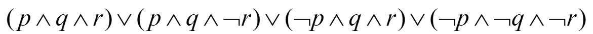，括号间用析取∨连接。**Every compound proposition is logically equivalent to a full DNF**

- Disjunctive析取范式（）外由析取∨连接，（）内由合取∧连接
- Conjunctive合取范式（）外由合取∧连接，（）内由析取∨连接

Any formula A is tautologically equivalent to a formula in full disjunctive normal form

其他逻辑运算符

给定一个联结词集合，如果所有命题公式都能用其中的联结词等价表示出来，则称该联结词集合为全功能联结词集合，或称该联结词集合为功能完备的 functionally complete 。

例如，{ ¬ , ∨ , ∧ } 、、{ ¬ , ∨ } 、{ ¬ , ∧ }  都是全功能联结词集合，还有 { ¬ , → } 、{ ↑ }、{ ↓ }  也是。

### 1.4 Predicates and Quantifiers
∃：existential quantifier ∃∀ 有最高级优先权

Uniqueness **∃!x, P(x)** == **one and only one x** in the universe of the discourse

#### More logical equivalences
 

#### Example

1. "Every student in this class has taken a course in Java."

   Solution 1: If U is all students in this class, define a propositional function J(x) denoting "x has taken a course in Java" and translate as **∀x J(x)**.

   Solution 2: But if U is all people, also define a propositional function S(x) denoting "x is a student in this class" and translate as **∀x (S(x)→J(x))**

! note：

**∀x (S(x)∧J(x))** is not correct 它的意思是所有人都在这个班级中且上了Java课程

2. "Some student in this class has taken a course in Java."

   Solution 1: If U is all students in this class, translate as **∃x J(x)**

   Solution 2: But if U is all people, then translate as **∃x (S(x)∧J(x)**)

!note:

**∃x (S(x) -> J(x))** is not correct 它包括了那些不在这个班级上的人也上了Java课程，与题意不符

### 1.5 Nested Quantifiers

#### Prenex normal form 前束范式
How to obtain prenex normal form? 1. Eliminate all occurrences of → and ↔ from the formula in question. 2. Move all negations inward such that, in the end, negation only appear as part of literals. 3. Standardize the variables a part (when necessary). 4. The prenex normal form can now be obtained by moving all quantifiers to the front of the formula.
##### Example
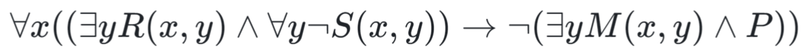   第二个任意y可以不用换成任意u，直接把任意y提到前边就OK 

### 1.6 Rules of Inference

##### Example
Show that the premises “A student in this class has not read the book,” and “Everyone in this class passed the first exam” imply the conclusion “Someone who passed the first exam has not read the book.

Solution: Let C(x) be “x is in this class,” B(x) be “x has read the book,” and P(x) be “x passed the first exam.” The premises are ∃x(C(x) ∧ ¬B(x)) and ∀x(C(x) → P(x)). The conclusion is ∃x(P(x) ∧ ¬B(x)). These steps can be used to establish the conclusion from the premises.

Step Reason:

1. ∃x(C(x) ∧ ¬B(x)) 	Premise
2. C(a) ∧ ¬B(a) 		Existential instantiation from (1)
3. C(a) 				Simplification from (2)
4. ∀x(C(x) → P(x)) 	Premise
5. C(a) → P(a) 		Universal instantiation from (4)
6. P(a) 				Modus ponens from (3) and (5)
7. ¬B(a) 			Simplification from (2)
8. P(a) ∧ ¬B(a) 		Conjunction from (6) and (7)
9. ∃x(P(x) ∧ ¬B(x)) 	Existential generalization from (8)

Fallacy 谬论

Universal modus ponens广泛假言推理：

∀x(P(x) → Q(x)) 
P(a), a 是域中的一个特定值
=> Q(a)

∀x(P(x) → Q(x)) 
¬Q(a), a 是域中的一个特定值
=> ¬P(a)

### 1.7 Introduction to Proofs
定理(theorem):可以证明为真的数学断言。
猜想(conjecture):真值未知的数学断言。
证明(proof):对定理为真的展示过程。
公理(axiom):假设为真的并可作为基础用来证明定理的命题。
引理(lemma):用来证明其他定理的定理。
推论(corollary):可以被证明是刚刚证明的一个定理的结论的命题。

### 1.8 Proof Methods and Strategy

**proof by contraposition 反证法: **a proof that p → q is true that proceeds by showing that p must be false when q is false  **proof by contradiction 归谬法: **a proof that p is true based on the truth of the conditional statement ¬_p → q_, where q is a contradiction  **exhaustive proof 穷举法: **a proof that establishes a result by checking a list of all possible cases  **proof by cases: **a proof broken into separate cases, where these cases cover all possibilities
**Mathematical induction** 数学归纳法：详见 [5](#5 Induction and Recursion)

**counterexample** 反例

## 2 Basic Structures: Sets, Functions, Sequences, Sums, and Matrices
### 2.1 Sets
**N **= {0_, 1_, _2_, _3_, _…}_, the set of all **natural numbers **自然数集 **Z **= {… _,_−2_,_−1, _0_, 1, 2, …}, the set of all **integers **整数集 **Z**+ = {1, 2, _3_, _…}_, the set of all **positive integers **正整数集 **Q **= {p/q ∣ p ∈ **Z**, q ∈ **Z**, and q ≠ 0}, the set of all **rational numbers **有理数集
**R**, the set of all **real numbers** 实数集 **R**+, the set of all **positive real numbers ** 正实数集 **C**, the set of all **complex numbers** 复数集

【Definition】A set is an unordered collection of objects

---

_**A ⊆ B**：_∀_x_(_x ∈ A  →  x ∈  B_)

For every set _S_,  ∅ ⊆ _S_

**S = T (set equality): **  S and T have the same elements（集合中的元素顺序或者重复元素不影响结果）

**S ⊆ T (S is a subset子集 of T): **every element of  S  is also an element of T

_**S ⊂ T** (_S is a **proper subset真子集** of T): S is a subset of T and S ≠ T 

**finite set** 有限集: a set with n elements, where n is a nonnegative integer

**infinite set** 无限集: a set that is not finite 

**|S| (the cardinality/size of _S_)**: the number of elements in _S_ 有限集的大小 

**Power set Ρ(S)：S的所有子集**

正确

##### Example 1
What is the _**Cartesian product **_**笛卡尔积** of _A = {1_, _2} and B = {_a, b, c_}?  _Solution: _The Cartesian product  A × B  is  	A × B = {(1_, a_)_, _(1_, b_)_, _(1_, c_)_, _(2_, a_)_, _(2_, b_)_, _(2_, c_)}.  But the Cartesian product B × A  is  	B × A = {(_a, _1)_, _(_a, _2)_, _(_b, _1)_, _(_b, _2)_, _(_c, _1)_, _(_c, _2)}. This is not equal to A × B._
##### Example 2
What is the Cartesian product _A × B × C_, where _A = {0_, _1}, B = {1_, _2}, and C = {0_, _1_, _2}?  _Solution: _The Cartesian product A × B × C consists of all ordered triples (_a, b, c_), where a ∈ A_,  _b ∈ B_, and _c ∈ C_.  Hence, _A × B × C = {(0_, _1_, _0)_, _(0_, _1_, _1)_, _(0_, _1_, _2)_, _(0_, _2_, _0)_, _(0_, _2_, _1)_, _(0_, _2_, _2)_, _(1_, _1_, _0)_, _(1_, _1_, _1)_, _(1_, _1_, _2)_, _(1_, _2_, _0)_, _(1_, _2_, _1)_, _(1_, _2, 2_ )}.

---

Note that when _A_, _B_, and _C are sets, (_A _× B_) × C is not the same as A × B × C  
##### Example 3
Suppose that _A = {1_, _2}.  It follows that A2 = {(1_, _1)_, _(1_, _2)_, _(2_, _1)_, _(2_, _2)}  and A3= {(1_, _1_, _1)_, _(1_, _1_, _2)_, _(1_, _2_, _1)_, _(1_, _2_, _2)_, _(2_, _1_, _1)_, _(2_, _1_, _2)_, _(2_, _2_, _1)_, _(2_, _2_, 2)}.
### 2.2 Set Operations
容斥原理：|A ∪ B| = |A| + |B| − |A ∩ B| 

**Union**： A∪B
**Intersection**： A∩B
**Complement**： U-A

**Difference**：A非B的部分

**Symmetric**：A和B中不重合的部分

##### Example

Use set builder notation and logical equivalences to establish the first De Morgan law A∩B=A∪B. 

Solution: We can prove this identity with the following steps. 

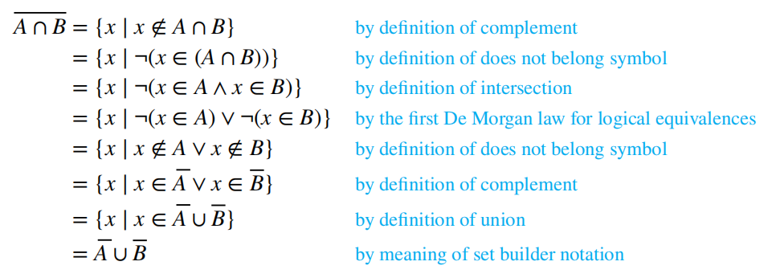

_Let A_, _B_, and C be sets. Show that A∪(B ∩ C ) = (C∪B) ∩ A.  

### 2.3 Functions

Functions are sometimes also called **mappings **or **transformations**. 

domain定义域；codomain值域

  即 ∀a∀b ( f (a)=f (b) → a=b **单射 injection/one-to-one**：对X中任意两个不同的x1、x2，f(x1)不等于f(x2)，集合x的元素数 < 集合y  即 ∀y ∃x (f(x)=y) **满射 surjective/onto**：Y中的任何一个元素都是X中某元素的像  **双射bijection**：既单又满

inverse function逆函数 f^-1^(b)=a iff f(a)=b

只有当f是双射时才有逆函数

arbitrary means 任意  

### 2.4 Sequences and Summations
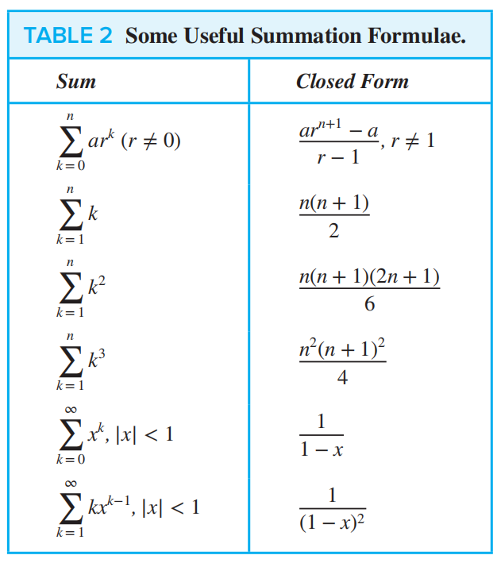

 

### 2.5 Cardinality of Sets

集合的基数

#### 2.5.1 Introduction

实数集的基数>有理数
不是所有无限集的基数是一样的

The sets A and B have the **same cardinality** (denoted by | A |= | B |) iff there exists a **one-to-one correspondence** (bijection) from A to B. 基数相同，当且仅当有一一对应关系。

如果B是A的子集，则|B|≤|A|;

#### 2.5.2 Countable sets

**Countable sets** 可数集：A set that is either finite or has the same cardinality as the set of positive integers 和正整数集的基数相同的集合是可数的

Let the cardinality of a countably infinite set S be $\aleph$. 
We write |S|=$\aleph_0$ and say that S has cardinality "alepha null".​

An infinite set is countable if and only if it is possible to list the elements of the set in a sequence (indexed by the positive integers) 无限集可数，当且仅当可以用序列列出集合的元素

##### Example 1

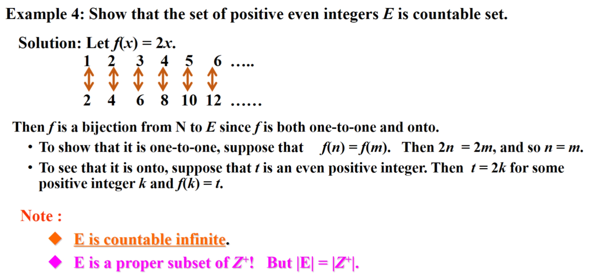

##### Example 2

- The Positive Rational Numbers are Countable

- The set of all rational numbers Q, positive and negative, is countable infinite. 所有有理数集是无限可数集
- The set of rational numbers and the set of natural numbers have same cardinality，namely |Q| = |N| 有理数集和自然数集基数相同

#### 2.5.3 Uncountable sets

【Theorem】The set of real numbers (between 0 and 1) is **uncountable**. 实数集不可数

cantor diagonalization argument 对角线论证

##### (Un)Computable

A function is **computable** 可计算 if there is a computer program in some programming language that **finds the values of this function**. If a function is not computable we say it is uncomputable.

##### Continuum Hypothesis 连续性假设

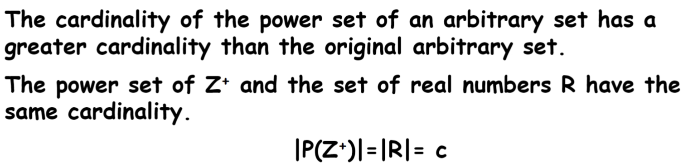

- 任意集合其所有子集的基数大于原来集合的基数
- 正整数集的所有子集和实数集有相同的基数

不存在一个无穷集合，它的势比自然数集($\aleph_0$)的势大，比实数集（连续统）势小

The set of all functions from $\mathbb{N}$ to $\mathbb{N}$ is uncountably infinite, with a cardinality of ${2^{\aleph_0}}$, the same as the cardinality of the continuum

#### Conclusion

## 3 Algorithms

### 3.1 Algorithms
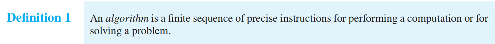

Searching Algorithms; Sorting; String Matching; Greedy Algorithms

Properties of Algorithms: input, output, definiteness, correctness, finiteness, effectiveness, generality

### 3.2 The Growth of Functions
**f(x) is O(g(x)) **: the fact that |f(x)| ≤ C|g(x)| for all x > k for some constants C and k **f(x) is 𝛀(g(x)) : **the fact that |f(x)| ≥ C|g(_x_)| for all x > k for some positive constants C and k  **f(x) is 𝚯(g(x)) :**the fact that f(x) is both _O(g(x)) and Ω(g(x)) 

#### Big-O 
$log(n!) = O(nlog n)$    
#### Big-Omega and Big-Theta Notation

$\omega$：增率的下界

f(x) is $\Omega(g(x))$ if and only if g(x) is O(f(x))

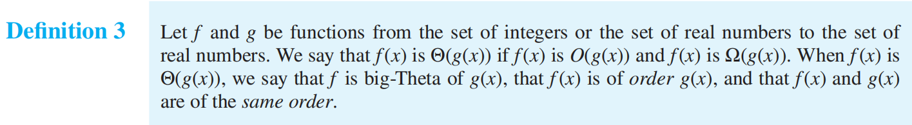

---

##### example

### 3.3 Complexity of Algorithms

## 4 Number Theory and Cryptography
### 4.1 Divisibility and Modular Arithmetic

**a∣b： **a divides b = b/a, b是大的被除数  

**a div d**: a 整除d为q

同余定理 congruence

【**定理四**】 **a ≡ b (mod m)，则a=b+km** 

模m算术：满足

### 4.2 Integer Representations and Algorithms
 n的b进制展开式 
### 4.3 Primes and Greatest Common Divisors
**relatively prime互素** **prime 素数** **composite 合数** **Mersenne prime 梅森素数: **a prime of the form 2p _− 1, where p is prime **Trial Division 试除法** 

**The Sieve of Eratosthenes 埃拉托斯特尼筛法**

100内筛2、3、5、7整除的数 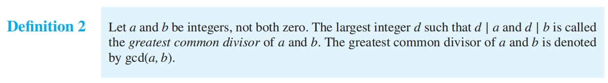

欧几里得定理：素数的无穷性
梅森素数 mersenne primes

【Prime number theorem 素数定理】：随机选取一个小于n的正整数是素数的概率为$\frac{1}{lnn}$

**gcd**(Greatest common divisor)：最大公约数

**lcm**(least common divisor)：最小公倍数

#### The Euclidean Algorithm 欧几里得算法

**贝祖定理**

**Bezout coefficients of a and b: **sa + tb = gcd(a, b)

**a ≡ b (mod m)** (a is congruent to b modulo m): a − b is divisible by m，即a-b能被m整除

##### Example

### 4.4 Solving Congruences 求解同余方程
**sa **+ **tm **= 1 (mod m) → s是a mod m的逆，满足 sa≡1(mod m)

1. 用欧几里得算法算模的逆s
2. 左右两边同 ✖s
3. 等式右边即为x的解

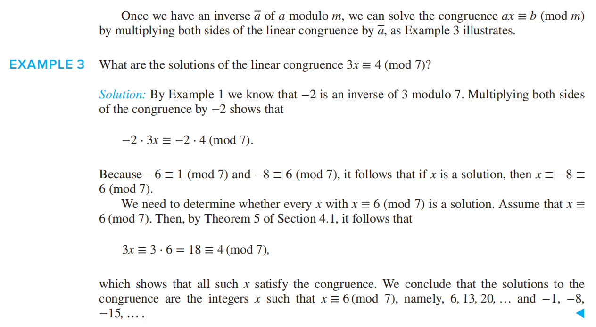

该解法a，m要求互素，即gcd(a,m)=1

#### Chinese remainder theorem 中国剩余定理

 其中, = 一个数(mod m)  **Back substitution 反向替换 → 翻译成一个同余式**

同余方程重写为

**pseudo prime to the base  b** 以b为基底的伪素数: a composite integer  n such that  $bn−1 ≡ 1 (\mod n)$ 

---

#### Fermat's little theorem 费马小定理

  

**Carmichael 卡米切尔数**

## 5 Induction and Recursion
### 5.1 Mathematical Induction
**Mathematical Induction 数学归纳法**

(P(1)∧∀k(P(k)→P(k+1)))→∀n P(n)

 **inductive hypothesis 归纳假设** 

### 5.2 Strong Induction and Well-Ordering 
**强归纳法（第二归纳法）和良序性**

(P($n_0$)∧∀k(k>=$n_0$∧P($n_0$)∧P($n_0$+1)∧···∧P(k)→P(k+1)))→∀n P(n)

良序性：Every *nonempty* set of *nonnegative* integers has the smallest element.
每个非空的自然数集都有最小的元素。

数学归纳法和第二数学归纳法的有效性来自良序性原理。
实际上，数学归纳法、第二数学归纳法和良序性是等价的原理

### 5.3 Recursive Definitions and Structural Induction
**递归定义和结构归纳法** 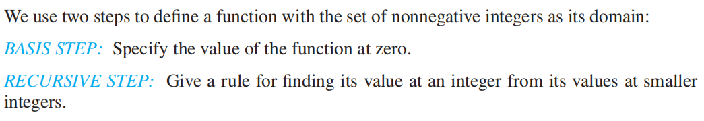

记$f_n=n!$

LAME'S Theorem

**Well-formed formulae** for compound proposition:

The set of well-formed formulae in propositional logic involving T, F, propositional variables, and operators from the set {¬,∧,∨,→,↔}.

**Structural Induction 结构归纳**

  

**Generalized Induction 广义归纳法**

Generalized induction is used to prove results about **sets other than the integers** that have the **well-ordering property**.

**lexicographic ordering 字典序**

### 5.4 Recursive Algorithms
**递归算法** 

**geometric progression:几何数列（等比）**

**arithmetic progression:等差**

## 6 Counting
### 6.1 The Basics of Counting
乘积原则

根据乘法原则，从m个元素的集合映射到n个元素的集合有n^m^个不同的函数；有n(n-1)……(n-m+1)个不同的单射函数（m≤n）；有
$$
n^m-C_n^1(n-1)^m+C_n^2(n-2)^m-...+(-1)^{n-1}C_n^{n-1}*1^m
$$
个不同的满射函数（n≤m）[详见8.6](#8.6 Applications of Inclusion–Exclusion)

求和原则

The subtraction rule is also known as the **principle of inclusion–exclusion**

减法原则又称容斥原理

除法原则

### 6.2 The Pigeonhole Principle
鸽巢/洞原理

广义鸽洞原理：把N个物品放到k个箱子中，至少有一个箱子中包含至少$⌈N/k⌉$ 个物品（向上取整）

Example

在6个人的群体中，每两个人不是朋友就是敌人，那么有3个共同的朋友或者敌人

### 6.3 Permutations and Combinations
排序与组合  

组合数$C(n,r)=C(n,n-r)$证明：重复计数方法或者双射方法

### 6.4 Binomial Coefficients

**二项式定理**

 **帕斯卡恒等式 pascal's identity**   

**Vandermonde's Identity 范德蒙德恒等式**

 

证明：长度为n+1的位串里有r+1个1，最后一个1在第k位。那么前k-1位必须有r个1，即有C(k-1, r)种情况，同时对于最后一个1，k最小为r+1，最大为n+1，则把所有情况相加，=左边

### 6.5 Generalized Permutations and Combinations

**permutation 排列** 

**Combination with repetition** n个元素集合中允许重复的r组合个数: $H_n^r=C_{n-1+r}^r=C_{n-1+r}^{n-1}$

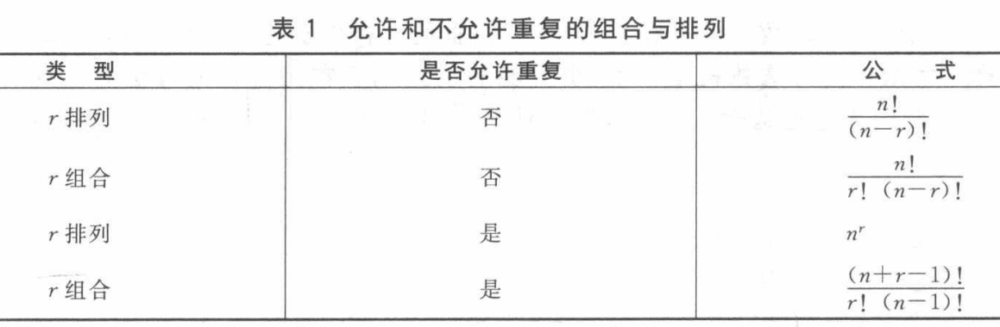

1. **Distinguishable objects and distinguishable boxes**不同物品不同箱子

2. **Indistinguishable objects and distinguishable boxes**相同物品不同箱子

3. **Distinguishable objects and indistinguishable boxes**不同物品相同箱子

：将n个不同的物品放进k个相同的箱子

$S(n,j)j!$​：将n个不同的物品放进j个相同的箱子（没有箱子是空的）

4. **Indistinguishable objects and indistinguishable boxes**相同物品相同箱子

   没有公式，手算

   Eg, 6本相同的书放到4个相同的盒子中，有{6}, {5,1}, {4,2}, {4,1,1}, {3,3}, {3,2,1}, {3,1,1,1}, {2,2,2}, {2,2,1,1}，共9种情况

## 8 Advanced Counting Techniques
### 8.1 Applications of Recurrence Relations
递推关系  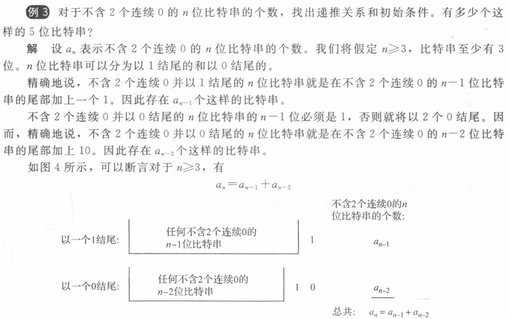
### 8.2 Solving Linear Recurrence Relations
求解线性递推关系

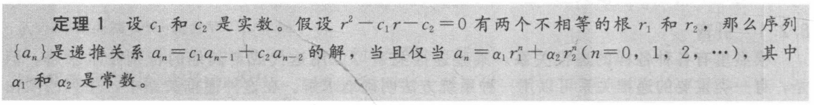

Fibonacci numbers:

**linear线性**：右边是$a_k$*c之和+F(n)

**homogeneous同类**：都是形如$s_j*s$的项

 **constant coefficients常系数**：对每个$a_k$​前的系数都是常数

**degree k**：左边$a_n$，右边最多追溯到前k项即$a_{n-k}$

   

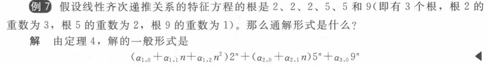

定理6是特解的形式，和F(n)有关

最后$a_n$要把通解$a_n^{(h)}$和特解$a_n^{(p)}$相加

### 8.4 Generating Functions

生成函数

#### Extended Binomial Theorem 拓展二项式系数

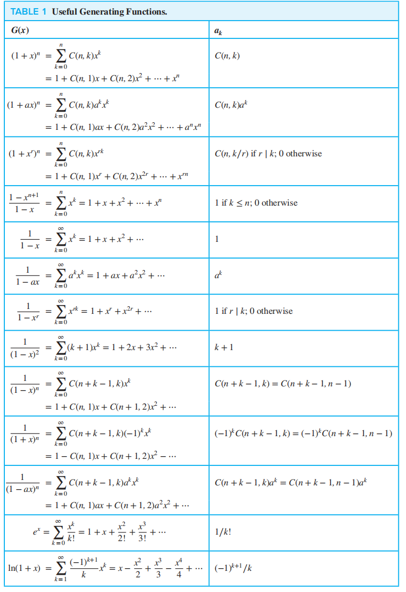

利用公式，其中$a_k=1$

利用公式，其中$c_k$全为1的生成函数为$\frac{1}{1-x}$

#### Solve Recurrence Relations

[9.6: Using generating functions to solve recurrences - Mathematics LibreTexts](https://math.libretexts.org/Bookshelves/Combinatorics_and_Discrete_Mathematics/Applied_Combinatorics_(Keller_and_Trotter)/09%3A_Recurrence_Equations/9.06%3A_Using_generating_functions_to_solve_recurrences)这个写的更易于理解

#### Counting Problems

$$
G(x)=(1+x+x^2+x^3+...)^n=\frac{1}{(1-x)^n}
$$

#### Example

### 8.5 Inclusion–Exclusion

**容斥原理**

向下取整

### 8.6 Applications of Inclusion–Exclusion

m个东西分配给n个人，每个人至少有一件东西的方法总数：

即映上函数onto/surgective function m →n（每个y至少有一个x与之对应）

**derangement 错排**

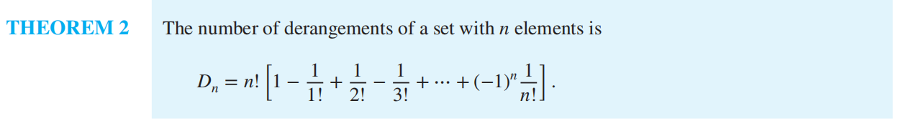

即 $≈ n!/e$最接近的整数

## 9 Relations

### 9.1 Relations and Their Properties
**binary relation from A to B **二元关系 

- 二元关系是一个集合， R包含于A✖B
- n元关系就是A1✖A2✖···✖An的子集

#### Properties of binary relations

**reflexive **自反性

自反关系：矩阵主对角线都是1；有向图每个顶点都有环

**irreflexive **反自反性

反自反关系：矩阵主对角线都是0；存在既不是自反也不是反自反的关系

**symmetric & antisymmetric **对称性和反对称性

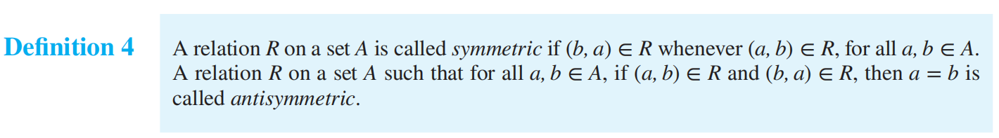

对称性：矩阵主对角线为对称轴

反对称性，主对角线随意，以主对角线为轴的一边如果是1，另一边必须是0

对称性和反对称性不是互斥的

**transitive **传递性

R的n次幂

对于n个元素的集合，以下关系有多少种？

| reflexive 自反 | irreflexive 反自反 | symmetric and reflexive 对称+自反 |
| -------------- | ------------------ | --------------------------------- |
| $2^{n^2-n}$    | $2^{n^2-n}$        | $$ 2^{n(n-1)/2}$$                 |

| symmetric 对称                                  | antisymmetric 反对称       | asymmetric 非对称 |
| ----------------------------------------------- | -------------------------- | ----------------- |
| $2^n✖2^{\frac{n^2-n}{2}}= 2^{\frac{n(n+1)}{2}}$ | $2^n*3^{\frac{n(n-1)}{2}}$ | $3^{C(n, 2)}$     |

$$
C(n, 2)=n(n-1)/2
$$

- n个元素的集合A上共有$2^{n^2}$​种二元关系

#### Example

正整数的整除关系是：reflexive, symmetric, transitive

从m个元素的集合到n个元素的集合的不同关系有$2^{mn}$个

### 9.3 Representing Relations

#### Combining relations

$R^{-1}$：R的逆，$R^{−1}=$​{(y,x)∣(x,y)∈R}

A⨀B，两个矩阵的布尔乘积

A⨁B：异或，不一样就出1

$M_{S∘R}= M_R ·M_S = M_R ⨀M_S$

$R^{n+1}=R^n∘R$​​ ——关系R的幂集

- S∘R≠R∘S

[【集合论】关系幂运算 ( 关系幂运算 | 关系幂运算示例 | 关系幂运算性质 )_关系的幂运算-CSDN博客](https://blog.csdn.net/shulianghan/article/details/108956605)

 

### 9.4 Closures of Relations

**Reflective Closures 自反闭包** $r(R)$​

【 Corollary 】$R = R ∩ I_A$  ⇔ R is a reflexive relation 

**Symmetric Closures** 对称闭包 $s(R)$​

【 Corollary 】$R = R ∪ R^{-1}$​ ⇔ R is a symmetric relation 

**Transitive Closures** 传递闭包 

  

**R^∗^ (connectivity relation 连通性关系)**: the relation consisting of those ordered pairs (_a, b_) such that there is a path from _a to b_

**传递闭包等于连通性关系**  t(R)=R^*^ 

传递闭包的0-1矩阵（矩阵并

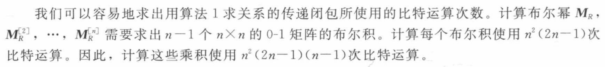

#### Warshall's algorithm 沃舍尔算法

use the concept of the **interior vertices **of a path  用到了一条路径内部顶点的概念

内部顶点：一条路径去掉起点和终点，如acdafbj的内部顶点cdafb

<矩阵中$$a_{ij}={0,1}$$表示有从i到j的路径

 

k确定的情况下，原先矩阵是1的还是1，只要检查第k列是1的行中的0有没有变化

total number of bit operations（时间复杂度

### 9.5 Equivalence Relations

#### Equivalence Relations 等价关系

**equivalent 等价: **if R is an equivalence relation, a is equivalent to b  if `aRb`

**等价关系：自反+对称+传递**

 

- 模m同余是等价关系 R={(a,b) | a≡b(mod m), a,b∈Z}

#### Equivalence Classes 等价类

 **representative**代表元 **$[a]_R$ (equivalence class of a with respect to R ) **等价类**: **the set of all elements of A that are equivalent to a

 **[a]m (congruence class modulo m)**模m的同余类  

等价关系的数量：partition of a set 有一个分化就有一个等价关系

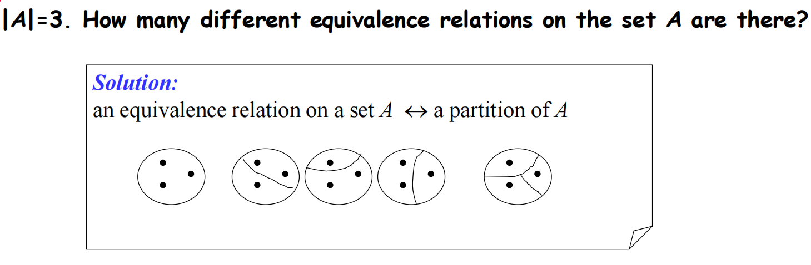

> 5个（3个元素集合的等价关系有5个）

#### Questions

1 R={(a,b) | a≡b(mod m), a,b∈Z},  $pr(Z)={[0]_m,[1]_m,····,[m-1]_m}$​

2 If |A|=n, the p(n)=? 
p(n): the number of different equivalence relations on a set with n elements

> $p(n)=B_n=\sum_{k=0}^{n}C(n,k)$

### 9.6 Partial Orderings

#### Partial Orderings

**poset (S, R)偏序集: **a set S and a partial ordering R on this set 

**偏序**：自反+**反对称**+传递 

Example: 

 ≤: less than or equal to

**totally (or linearly) ordered set **全序（线序）集：一个偏序集中每对元素都是可比的

#### Well-ordered良序

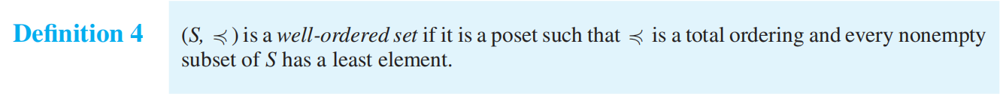**良序归纳定理**

Lexicographic ordering 字典顺序

#### Hasse diagram 哈塞图
表示的是偏序

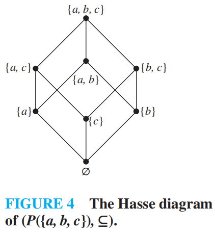

Chain and antichain

#### Maximal and Minimal Elements 极大元与极小元
 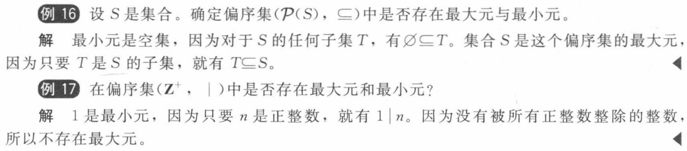

Let A be a partially ordered set. If A has a least element a, then a is unique, and is also a minimal element of A. However, the converse fails: a minimal element of A is generally not a least element of A, and a partially ordered set A can have many minimal elements (in which case none of them can be least elements)

**上界和下界（可以有多个）**

**LUB最小上界&GLB最大下界（最多只能有1个）**

#### lattice 格
**Definition:** A partially ordered set in which every pair of elements has both a least upper bound and a greatest lower bound is called a **lattice**.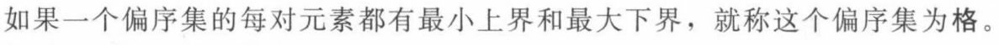

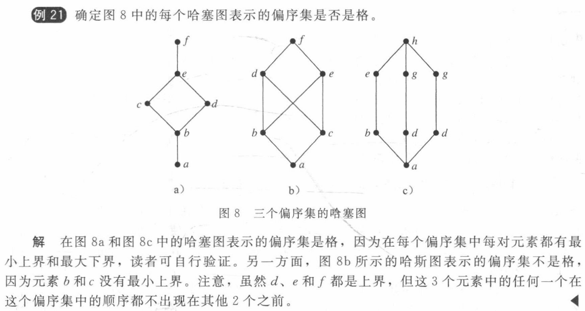

- 图b中d和e同为b、c最小上界，不唯一，最小上界最多只能有1个

- 每一个全序集（totally ordered set）都是格
- (Z^+^, |) & (P(s), ⊆) 是格

#### Topological Sorting 拓扑排序

 

## 10 Graphs
### 10.1 Graphs and Graph Models
 **finite graph 有限图** A graph in which each edge connects two different vertices and where no two edges connect the same pair of vertices is called a **simple graph**.
简单图没有环，无多重边，无向

Graphs that may have **multiple edges **connecting the same vertices are called **multigraphs**.

**loops:** edges that connect a vertex to itself

**undirected graphs 无向图**: a graph with undirected edges. **directed graph 有向图** : a graph with directed edges. **mixed graph**: a graph with both directed and undirected edges. 

**Simple graph** 简单图: A graph in which each edge connects two different vertices and where no two edges connect the same pair of vertices.  **Multigraph** 多重图: Graphs that may have multiple edges connecting the same vertices. **Pseudograph 伪图**: Graphs that may include loops, and possibly multiple edges connecting the same pair of vertices.

 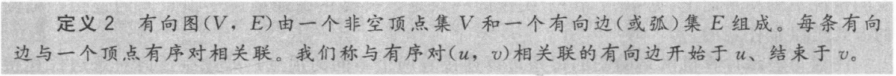 When a directed graph has no loops and has no multiple directed edges, it is called a **simple directed graph.** 
### 10.2 Graph Terminology and Special Types of Graphs
#### Basic Terminology
  

- 握手定理说明无向图顶点度数之和为偶数

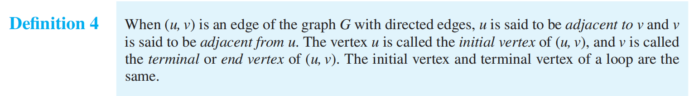 

 The undirected graph that results from ignoring the directions of edges is called the **underlying undirected graph**. 基本无向图忽略边的方向

非空简单图一定存在度数一样的顶点

####  Some Special Simple Graphs

##### Complete Graphs 完全图 Kn

每对顶点间都有一条边的简单图

Kn的边数：$$\frac {n (n-1)} {2}$$

##### 圆圈 Cn

##### 车轮 Wn

相同n，比Cycles多一个点放中间和周围的点连

##### 立方体 Qn

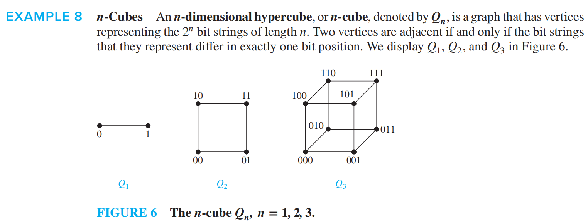

Qn的顶点数是2^n^，Qn的边数是n*2^(n-1)^

##### Bipartite Graphs 二分图
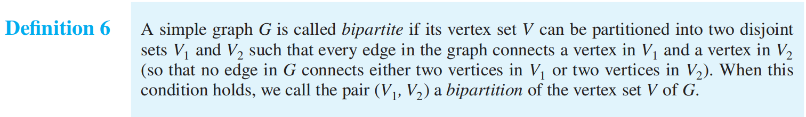 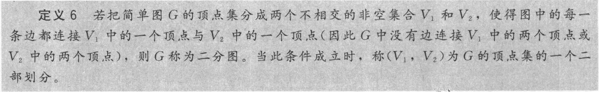

每条线段一端是红色顶点，一端是蓝色顶点

- 树是二分图

判断二分图的条件（当且仅当可以用两个颜色着色相邻顶点不重复）

 

**complete bipartite graphs 完全二分图** 

$K_{n,n}$

##### Regular Graphs 正则图

A simply graph is called regular if every vertex of this graph has the same degree.每个顶点度数相同
A regular graph is called n-regular if every vertex in this graph has degree n.
For example, $K_n$ is a (n-1)-regualr; $K_{n,n}$ is a n-regular. 

#### New Graphs from Old

**subgraph 子图**

H is a *spanning subgraph* of G if W=V, F⊆E

- 选择顶点数✖剩下每条边2种可能情况，C(4,3)✖2^3^表示选3个顶点保留、剩下3条边每条边都有在/不在两种情况

导出的子图：只有被移除的顶点相关的边不在

**GRAPH UNIONS 并图**

### 10.3 Representing Graphs and Graph Isomorphism
同构 **adjacency lists**  
#### Adjacency Matrices  邻接矩阵
邻接矩阵 $A = [a_{ij}]$​，

The adjacency matrix of a simple graph is symmetric, that is, $a_{ij} = a_{ji}$.  All undirected graphs, including multigraphs and pseudographs, have **symmetric adjacency matrices**.. 多重图、伪图、简单图的邻接矩阵都对称

 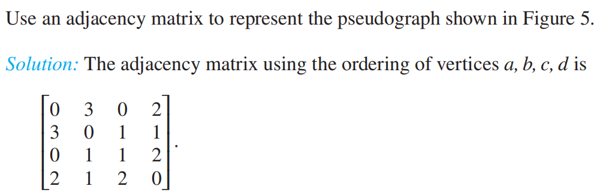 The adjacency matrix for a directed graph does not have to be symmetric.  有向图的邻接矩阵不一定对称

#### Incidence Matrices 关联矩阵
n × m matrix M = $[m_{ij}]$，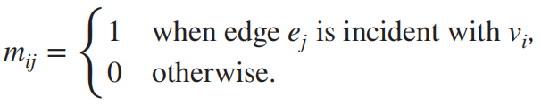  
#### Isomorphism of Graphs 同构
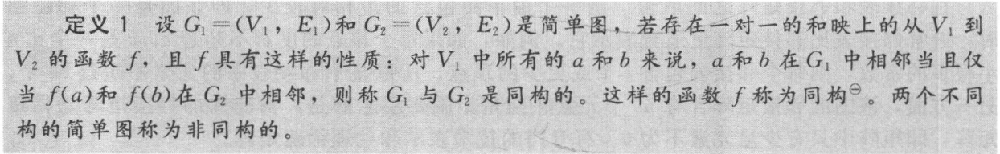  **graph invariant 图形不变量** 顶点数、边数、顶点的度数

9个顶点不同构的有根树有9个

### 10.4 Connectivity
**simple path/circuit 简单通路/回路：**a path that does not contain an edge more than once 只包含一条边一次

**circuit/cycle**圆圈：路径开始、结束于同一个顶点

   **connected graph: **an undirected graph with the property that there is a path between every pair of vertices 无向图，每对不同的顶点间都有一条路径

#### Paths in Acquaintanceship Graphs  无向图的连通性
每对顶点之间都有路径，则图是连通的 **connected components 连通分支组件**

图G的极大连通子图被称作连通组件

- For any nonempty subset S of set V, the number of connected components in G-S <=|S|

**cut vertices**(or **articulation points**) 割点：a vertex v such that G − v is disconnected

**cut edge **or **bridge** 割边：an edge e such that G - e is disconnected

割点和割边都能使图的组件变多

​	不是所有连通图都有割点，这些图被称为不可分割的 nonseparable graphs，它们可以认为比有割点的图连通性更强

We measure the graph connectivity based on the minimum number of vertices that can be removed to disconnect a graph.我们用使图变得不连通的最小移出顶点数来衡量图的连通性

**Vextex connectivity 点连通性**

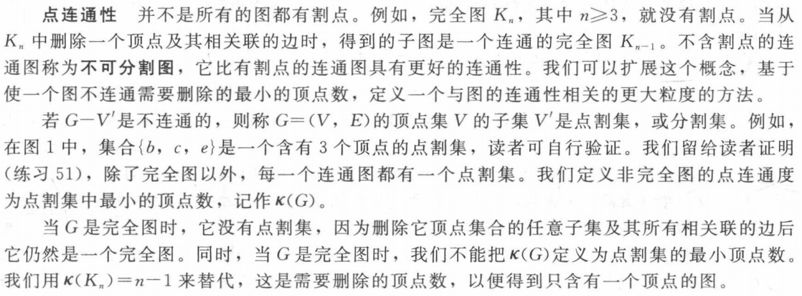

A subset V′ of the vertex set V of G = (V, E) is a **vertex cut**, or **separating set**, if G − V ′ is disconnected.

- 所有连通图都有点割集，除了完全图

**𝜿(G) (the vertex connectivity of G): **the size of a smallest vertex cut of G 点割集

**Edge connectivity 边连通度**

**𝝀(_G_) (the edge connectivity of _G_)**: the size of a smallest edge cut of _G_ 边

- 找到度最小的顶点，删边

点≤边≤最小顶点度数

#### Connectedness in Directed Graphs 有向图的连通性

Strongly connected强连通：有一条路从a到b，从b到a（对所有图中的顶点a,b）

**Strong components of a directed graph**

#### Paths and Isomorphism

两个图同构当且仅当它们有相同长度的简单回路 or 两个图包含经过顶点的路径且两个图中路径对应的顶点具有相同的度数

同构

#### Counting Paths Between Vertices
 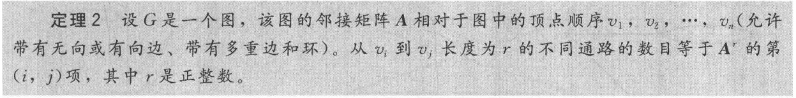

矩阵的乘法$A^{r+1}=A^r·A=(d_{ij})_{n✖n}$，第m行✖第n列得到第(m, n)个元素的值

### 10.5 Euler and Hamilton Paths
#### Euler Paths and Circuits 欧拉通路&回路
经过边 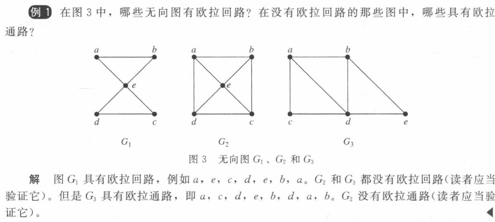 

**NECESSARY AND SUFFICIENT CONDITIONS FOR EULER CIRCUITS AND PATHS** 欧拉回路/通路的充分必要条件

 

有欧拉通路就从一个奇数度的顶点出发，于另一个奇数度的顶点结束

**Euler circuits and paths in directed graphs有向图 欧拉回路/通路的充分必要条件**

欧拉回路：A directed multigraph having no isolated vertices has an Euler circuit if and only if

- the graph is weakly connected 弱连通
- the in-degree and out-degree of each vertex are equal 每个顶点入度和出度一样

欧拉通路：A directed multigraph having no isolated vertices has an Euler path but not an Euler circuit if and only if

- the graph is weakly connected 弱连通
- the in-degree and out-degree of each vertex are equal for all but two vertices, one that has in-degree 1 larger than its out-degree and the other that has out-degree 1 larger than its in-degree 每个顶点入度和出度一样，但有两个顶点是例外：一个 入度=出度+1，另一个 出度=入度+1

#### Hamilton Paths and Circuits 哈密顿

经过顶点   **CONDITIONS FOR THE EXISTENCE OF HAMILTON CIRCUITS**

哈密顿回路存在（充分）条件（没有有效的必要条件）

 

若一个图存在哈密顿回路，就称为哈密顿图 hamilton graph

- Kn（完全图）存在哈密顿回路（n≥3）
- n个顶点的完全图有多少不同长度的哈密顿回路？$\frac{(n-1)!}{2}$

### 10.6 Shortest-Path Problems
Graphs that have a number assigned to each edge are called **weighted graphs**.加权图  

### 10.7 Planar Graphs

平面图  

完全二分图$K_{2,n}(n≥1)$是平面图；完全二分图$K_{1,n}$是平面图

#### Euler's Formula 欧拉公式

regions面，edges边，vertices顶点

- 连通！平面！简单图！才满足欧拉公式

$$
2e=\sum_{all-region-R}deg(R)
$$
如果平面图G有k个连通组件，e条边和v个顶点，那么区域r=e-v+2+(k-1)=e-v+k+1

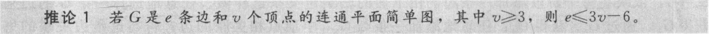

不连通的简单平面图e≤3v-6也成立

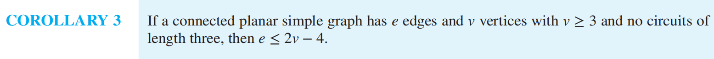

如果一个连通平面图每个区域region有至少k条边，则$e≤\frac{(v-2)k}{k-2}$

#### Kuratowski’s Theorem 库拉图斯基
**homeomorphic 同胚的：**two undirected graphs are homeomorphic if they can be obtained from the same graph by a sequence of elementary subdivisions

**elementary subdivision 初等细分：**the removal of an edge {_u, v_} of an undirected graph and the addition of a new vertex _w together with edges {_u, w_} and {_w, v}

 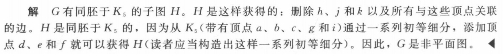 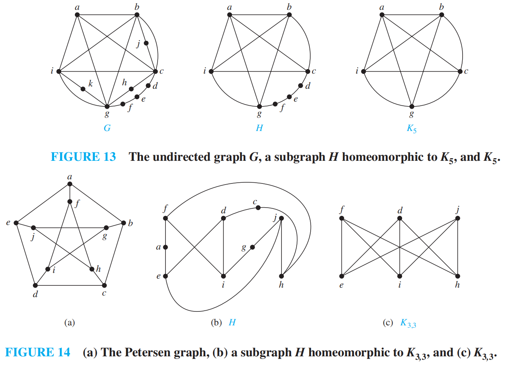

### 10.8 Graph Coloring

**dual graph **对偶图

  

**chromatic number** $\chi(G)$: the least number of colors needed for the coloring of this graph

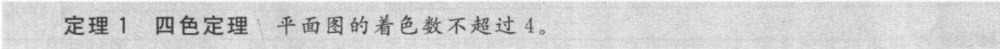

$\chi(K_n)=n, \chi(K_n-e)=n-1,\chi(K_{m,n}=2)$

能用两个颜色着色的简单图都是二分图；连通二分图能用2个颜色着色

## 11 Trees
### 11.1 Introduction to Trees

连通+无向+n个顶点&n-1条边是一棵树；连通+无向+没有简单回路是一棵树

**forest**：

无向图是一棵树当且仅当任意一对顶点之间都有唯一简单路径(unique simple path)

**root** 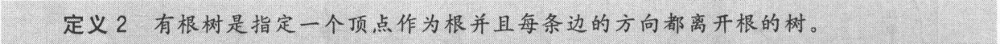**parent 父母 of v in a rooted tree: **the vertex u such that (u, v) is an edge of the rooted tree **child 孩子 of a vertex v in a rooted tree: **any vertex with v as its parent **internal vertex 内点: **a vertex that has children **leaf 树叶: **a vertex with no children  **full m-ary tree 满m叉树: **a tree with the property that every internal vertex has exactly m children 每个内点都有m个孩子 **ordered tree 有序树: **a tree in which the children of each internal vertex are linearly ordered 每个内点的孩子都是有序的 

#### Properties of Trees
   **BALANCED _m_-ARY TREES 平衡的m叉树** **level of a vertex 顶点的层: **the length of the path from the root to this vertex  **height of a tree 树高: **the largest level of the vertices of a tree **balanced tree: **a tree in which every leaf is at level h or h − 1, where h is the height of the tree  

根的高度是0

### 11.2 Applications of Trees

**binary search tree 二叉搜索树**

 

Decision Trees 决策树

**Huffman coding 哈夫曼编码** 

左边的点权重>右边

#### Game Trees 博弈树
 
### 11.3 Tree Traversal
遍历算法 **preorder traversal** 前序：Visit root, visit subtrees left to right 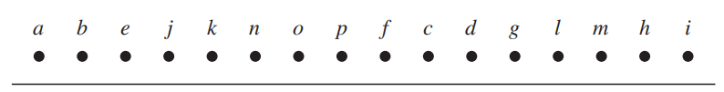 **inorder traversal** 中序：Visit leftmost subtree, visit root, visit other subtrees left to right  **postorder traversal **后序：Visit subtrees left to right; visit root  
#### Infix, Prefix, and Postfix Notation 中缀、前后缀记法
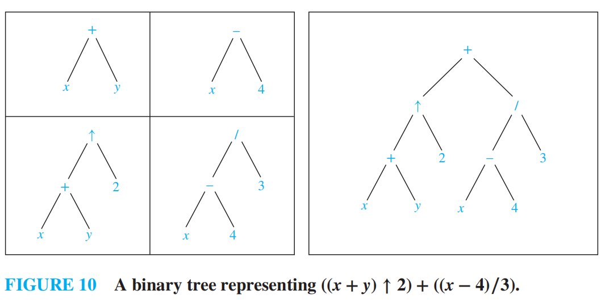 The fully parenthesized expression obtained in this way is said to be in **infifix form. 中缀** **prefix form 前缀**  **postfix form 后缀**  
### 11.4 Spanning Trees
生成树 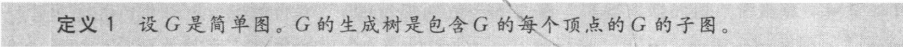

 **depth-first search 深度优先搜索 **also called **backtracking** 回溯  

1. 任意选择图形的一个顶点作为根。
2. 从这个顶点开始的路径，连续添加边，其中每条新的边都与路径中的最后一个顶点和一个还没不在路径中的顶点相连
3. 继续向这条路径添加边，越长越好。
4. 如果该路径穿过图形的所有顶点，那么由该路径组成的树就是一棵生成树。
5. 如果路径没有穿过所有顶点，就必须增加更多的边。如果可能的话，回到路径中的最后一个顶点，形成一条新的路径。从这个顶点开始，穿过尚未访问的顶点。如果做不到这一点，就向后移动路径中的另一个顶点。
6. 重复这个过程。

 **tree edges and back edges** 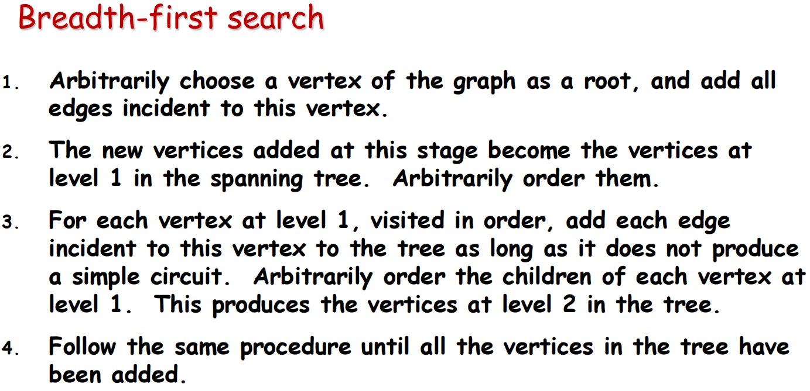 1.任意选择图的一个顶点作为根，并将所有与该顶点相关的边相连。 2.在此阶段添加的新顶点将成为生成树中的级别1。任意排序他们。 3.对于级别1的每个顶点，按顺序访问，添加每个边只要它不产生简单的回路，就可以入射到树的这个顶点。任意排序级别为1的每个顶点的子顶点。这将生成树中级别为2的顶点。 4.按照相同的过程进行操作，直到添加了树中的所有顶点。

### 11.5 Minimum Spanning Trees
**spanning tree: **a tree containing all vertices of a graph  生成树：包含图的所有顶点的树 **minimum spanning tree: **a spanning tree with smallest possible sum of weights of its edges 最小生成树：边的权之和最小 

#### Prim’s algorithm 普林算法
  

