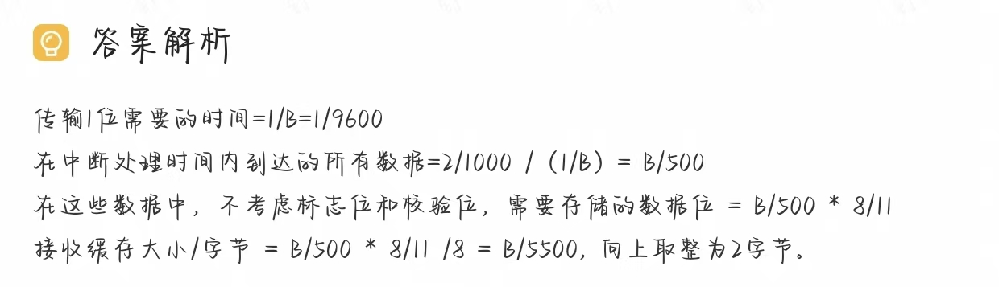
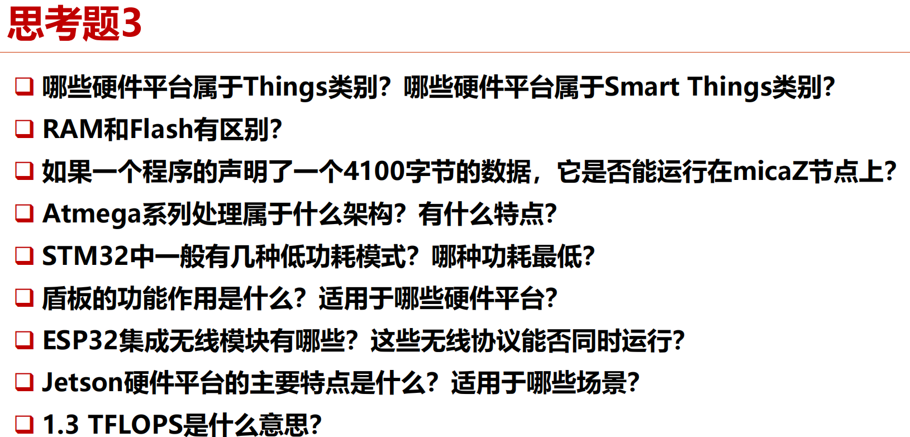
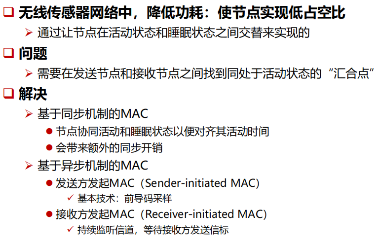
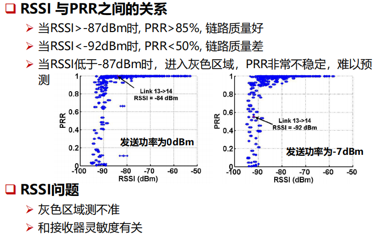
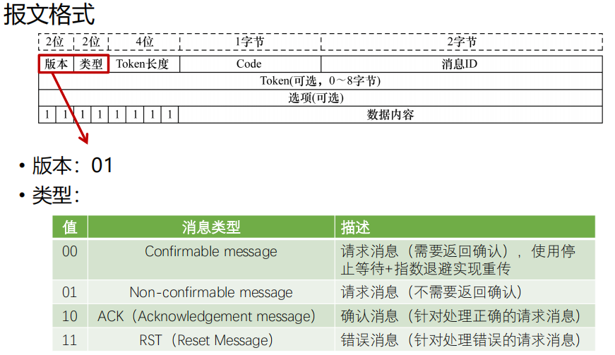
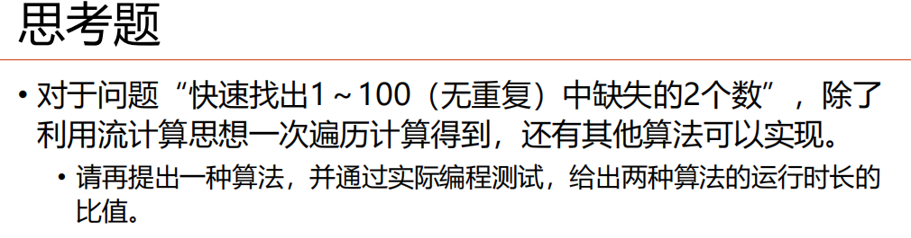

# 物联网技术基础与应用开发

> [!NOTE]
>
> 50%实验+50%考试
>
> 单选70分+大题*4 30分

> [!TIP]
>
> 物联网基本概念 架构 软件 协议 挑战 占空比（算生命周期）、设备分类、设备类型
>
> esp32特点 arduine、哈佛冯诺依曼
>
> 物联网os概念、各类os概念、区别，哪个操作系统有哪些机制方法
>
> 差分、tinyml模型压缩、蓝牙通信机制、ble哪些层，每一层干什么
>
> matter thread协议概念、lora 蓝牙协议 coap mqtt、ifttt规则 无服务器计算 service？
>
> 流计算、物模型组成部分、安全 概念、线程的调度、centinios  xx thread 机制不需要、PRR计算、云平台

## 第一章 物联网概述

### 物联网的定义和发展趋势

物联网就是**物理设备**以及其他嵌入了**电子器件、软件、传感器的物件**组成的网络。这些
物件具有**感知能力**、**计算能力**以及**连接能力**，从而能更直接地将物理世界集成到数字世
界中。
eg，智慧家居 共享单车

#### 物联网发展趋势

2010-2015 传感网、RFID
2015-2020 操作系统、物联网云平台
2020至今 AIoT

#### 典型的物联网架构

### 物联网应用开发构建面临的挑战与机遇

#### 挑战

挑战1：开发链长。一个完整的物联网应用包括嵌入式开发、云平台开发以及用户端开发，涉及嵌入式、前端、后端等不同开发技术，需要不同类型开发人员共同协作完成

挑战2：物联网领域还没有出现固定的终端类型

挑战3：目前，物联网应用开发的架构还是属于“垂直一体化”

#### 机遇

机遇1：低代码开发是目前重要的发展趋势。数字化场景落地需求爆发式增长，低代码成为效能提升的突破点。根据
Gartner预测，到2024年，75％的应用程序将在低代码平台中开发。IEEE Computer Society (IEEE CS)将低代码技术列为2022年16大技术趋势之一。

机遇2：AI大模型使得基于自然语言的开发成为可能

机遇3：碎片化、异构性意味没有独裁垄断。不像PC、Mobile卷性能，IoT硬件平台可以往低功耗、小体积等多元化方向发展

机遇4：近年来出现的Matter协议，利用区块链技术实现跨生态去中心化认证；开源云平台软件ThingsBoard，IoTSharp等，使得“标准化”的物联网应用开发变得可能。

### 物联网典型应用

智慧城市 鸿山物联网小镇

智慧校园 CMU GIoTTO

空气质量检测 Mosaic

> 
>

### 思考题

#### 思考题1

> 

无源后向散射通信技术

区别于RFID, 实现tag与tag之间的通信
如环境后向散射（ ambient backscatter）

#### 思考题2

> **典型物联网（IoT）应用架构的组成部分**
>
> 一个典型的物联网应用架构通常包括以下几个关键部分：
>
> 1. **设备层（感知层）**：
>    - 这层包括各种物联网设备和传感器，负责数据采集。设备可以是温度传感器、湿度传感器、摄像头等，感知物理世界中的变化并将这些数据发送到网关或云端。
>    - 设备通常具有有限的计算和存储能力，需要低功耗设计，以延长电池寿命。
>
> 2. **网络层（通信层）**：
>    - 该层负责将设备收集到的数据通过网络传输到云端或边缘计算设备。通信方式可以是Wi-Fi、蜂窝网络（如5G）、蓝牙、Zigbee、LoRa等。
>    - 网络层还包括各种网关设备，作为本地设备与外部网络之间的桥梁，它们可以在数据传输前对数据进行预处理或聚合。
>
> 3. **云平台/边缘计算（处理层）**：
>    - 云平台是存储、处理和分析物联网数据的核心部分。通过云平台，数据可以被分析、存储，并根据业务需求进行进一步处理。
>    - 在某些应用中，出于实时性或减少数据传输带宽的考虑，会使用**边缘计算**，将部分计算和处理任务分布在离物联网设备较近的节点上，以加快响应时间。
>
> 4. **应用层（服务层）**：
>    - 这一层包含具体的业务应用，如数据可视化、自动化控制、预测性维护等。应用层可以是用户交互的界面，允许用户通过手机App、网页或控制台监控和控制物联网设备。
>
> 5. **安全与管理层**：
>    - 物联网架构中，安全性非常重要。该层包含设备身份认证、数据加密、访问控制、漏洞检测等技术，保障物联网系统的安全性。
>    - 此外，这一层还负责设备的远程管理、固件升级、状态监控和健康管理等。
>
> ### 物联网开发与传统PC程序开发的不同
>
> 1. **硬件受限**：
>    1. **物联网设备通常资源有限**，如低功耗、有限的计算能力和存储空间。而传统PC程序开发面向的设备通常具有强大的计算和存储资源。因此，物联网开发需要考虑资源优化，特别是在数据处理、存储和通信方面要尽量简化。
>    2. 例如，在嵌入式设备上开发的程序通常使用C语言或MicroPython等轻量级语言，而传统PC程序通常使用Java、Python等高级语言。
>
> 2. **网络通信复杂性**：
>    1. 物联网应用高度依赖于网络通信，需要与多个传感器、网关和云平台交互。开发者需要考虑各种通信协议（如MQTT、CoAP、HTTP、LoRa等），并优化数据传输以减少带宽和延迟。
>    2. 而传统PC应用的网络通信主要是通过本地网络或互联网的较少协议（如TCP/IP、HTTP）实现的，且对实时性要求相对较低。
>
> 3. **实时性和延迟敏感**：
>    1. 许多物联网应用要求具备实时性，尤其在工业自动化或医疗健康场景中，设备需要即时响应外部事件。开发过程中需要优化延迟、确保快速响应。
>    2. 传统PC应用通常对实时性要求不高，或者可以通过更高的计算能力来弥补延迟问题。
>
> 4. **异构性和大规模设备管理**：
>    1. 物联网系统中存在各种不同类型的设备和传感器，彼此可能具有不同的通信协议和硬件特性，开发时需要考虑设备的异构性，以及如何兼容不同类型的设备。
>    2. 同时，物联网通常涉及大量设备的管理，包括设备的远程控制、数据采集、监控、固件升级等，这与传统PC程序的单设备开发和管理模式有显著不同。
>
> 5. **安全性要求更高**：
>    1. 由于物联网设备分布广泛、通常在公共或未受保护的环境中运行，因此需要更强的安全措施，如设备认证、通信加密、数据隐私保护等。
>    2. 传统PC开发尽管也有安全问题，但物联网设备的物理不安全性和广泛的攻击面增加了系统整体的安全复杂性。
>
>
> 总结来说，物联网开发不仅要求应对设备资源的受限性，还需要面对通信、实时性、安全性和大规模设备管理等复杂问题。而传统PC程序开发相对集中在单个设备上，开发环境和硬件资源较为统一，开发难度在这些方面较低。

## 第二章 物联网硬件平台

### 关键特性:fire:

**占空比x%**：工作时间占总时间的x%

>  $P = CV^2FT$
>
> - $P$ ：功耗（Power），表示系统在运行时的能耗，单位通常为瓦特（W）。
> - $C$ ：电容（Capacitance），指处理器相关电路的等效电容，单位为法拉（F）。它与处理器的设计和工艺有关，通常是一个固定的值。
> - $V$ ：电压（Voltage），是给处理器供电的电压，单位为伏特（V）。
> - $F$ ：主频（Frequency），即处理器每秒钟振荡的次数，单位为赫兹（Hz）。主频越高，处理器执行指令的速度越快。
> - $T$ ：时间（Time），指的是处理器在某一频率和电压下运行的时间，单位为秒（s）。
>
> 该公式表示功耗与电压的平方、主频率以及时间成正比。增加主频（\( F \)）或电压（\( V \)）都会增加处理器的功耗。
>
> - **电压**：因为功耗与电压的平方成正比，增加电压会显著增加功耗。
> - **主频**：增加主频虽然能提高运算速度，但会线性增加功耗。
>   
>
> 因此，提升运算速度（提高主频）和降低能耗之间是一个权衡过程。

**波特率**（Baud rate）：每秒钟传输的符号数或比特数（bit per second, bps）

- 传输1位数据所需的时间就是1秒内传输1位的时间，即**1位数据所需时间 = 1秒 / B**。因此，传输1位数据的时间为 $\frac{1}{B}$ 秒

### 常见的硬件平台

| 平台类型    | 分类                 | 特点                                             | 说明                                                         |
| ----------- | -------------------- | ------------------------------------------------ | ------------------------------------------------------------ |
| 传感节点    | 物件Things           | 低功耗、体积小、集成度高、低成本                 | 高度集成，专为低功耗和无线传感网络设计。                     |
| STM32平台   | 物件Things           | 开发方便、丰富的通信接口、调试简单、低功耗       | 基于ARM Cortex-M系列的微控制器，提供广泛的型号选择，从低功耗到高性能。适合需要一定处理能力和外设扩展的应用；丰富的开发工具和库支持；适用于快速开发和原型设计。 |
| ESP32平台   | 物件Things           | 性能稳定、高度集中、超低功耗、双模解决方案       | 集成Wi-Fi和蓝牙功能的微控制器，具有双核处理器和低功耗特性。  |
| Arduino平台 | 物件Things           | 上手容易、开发简单、可扩展性强、低功耗、开源创新 | 简单的编程模型，广泛的社区支持。适合初学者和教育用途；模块化的设计允许快速原型开发；大量现成的扩展板和库。 |
| 树莓派      | 智能物件Smart things | 开发简单、上手容易、功能强大                     | 基于ARM的单板计算机，具有完整的操作系统和较高的处理能力。    |
| Jetson平台  | 智能物件Smart things | 计算能力强大、低功耗、高度集成、支持多种AI框架   | 基于NVIDIA的GPU，提供强大的图形和并行计算能力。适合高性能计算任务，如图像处理、机器学习和深度学习；支持CUDA和OpenCV等高级库。 |

### 思考题

#### 思考题1

> **第一个问题：选择哪块MCU以支持代码片段？**
>
> 代码片段中定义了一个大小为10240字节（约10KB）的 `buf` 缓冲区。要选择合适的MCU，我们需要确保它有足够的**RAM**来存储该缓冲区。
>
> - Msp430F2618 具有8KB RAM，不足以容纳10KB的缓冲区。
> - Msp430F5437 具有16KB RAM，足够支持10KB的缓冲区。
>
> 因此，为了支持该代码片段，**Msp430F5437** 是合适的选择。
>
> ---
>
> **第二个问题：能耗比较**
>
> 假设Msp430F2618和Msp430F5437都运行10秒，且占空比为80%和0.1%，我们计算能耗时要分别考虑工作和睡眠模式下的功耗。表格中给出的工作电流和睡眠电流分别为：
>
> - Msp430F2618：
>   - 工作电流：0.5 mA
>   - 睡眠电流：1.1 µA
> - Msp430F5437：
>   - 工作电流：0.28 mA
>   - 睡眠电流：1.7 µA
>
> 1. 占空比为80%时
>
> - 对于Msp430F2618：
>   - 工作时间：10秒 × 80% = 8秒
>   - 睡眠时间：10秒 × 20% = 2秒
>   - 电压：3V
>   - 总能耗 = （0.5 mA × 8秒 × 3v）+（1.1 µA × 2秒 × 3v） ≈ 0.012 J (A×s×V)
>
> - 对于Msp430F5437：
>   - 工作时间：10秒 × 80% = 8秒
>   - 睡眠时间：10秒 × 20% = 2秒
>   - 总能耗 = （0.28 mA × 8秒 × 3v）+（1.7 µA × 2秒 × 3v） ≈ 0.0067 J
>
> 因此，当占空比为80%时，**Msp430F5437** 的能耗较低。
>
> 
>
> 2. 占空比为0.1%时
>
> - 对于Msp430F2618：
>   - 工作时间：10秒 × 0.1% = 0.01秒
>   - 睡眠时间：10秒 × 99.9% = 9.99秒
>   - 总能耗 = （0.5 mA × 0.01秒 × 3v）+（1.1 µA × 9.99秒 × 3v） ≈ 4.7967×10^-5^ J
>
> - 对于Msp430F5437：
>   - 工作时间：10秒 × 0.1% = 0.01秒
>   - 睡眠时间：10秒 × 99.9% = 9.99秒
>   - 总能耗 = （0.28 mA × 0.01秒 × 3v）+（1.7 µA × 9.99秒 × 3v） ≈ 5.9349×10^-5^ J
>
> 因此，当占空比为0.1%时，**Msp430F2618** 具有较低的能耗。

#### 思考题2

> 
>
> - 数据位为8位，8 bits = 1 byte，最后向上取整

#### 思考题3

##### **RAM**和**Flash**的区别

| **区别**           | **RAM** (随机存取存储器)                          | **Flash** (闪存)                           |
|--------------------|---------------------------------------------------|--------------------------------------------|
| **数据存储持久性**  | 易失性，断电后数据丢失                             | 非易失性，断电后数据仍然保留               |
| **读写速度**       | 速度快，适合频繁的读写操作                         | 读写速度较慢，尤其是写入操作               |
| **使用场景**       | 临时存储运行时的数据和指令，操作系统和应用程序      | 长期存储固件、操作系统、应用程序和用户数据 |
| **存储容量与价格** | 容量较小，单位价格较高                             | 容量较大，单位价格相对便宜                 |
| **电源依赖性**     | 需要持续电源来保持数据                             | 无需电源也可保存数据                       |

-------------------------

**micaZ节点**的RAM大小为4KB<4100B，不能

---------------------

Atmega系列处理器属于AVR体系结构，AVR的存储体系结构是**哈佛结构**，具有**分离的数据寻址空间和程序寻址空间**

##### **STM32**有**三种低功耗模式**

- 睡眠模式：内核停止运行，外设保持运行状态。一般适用于等待外设的中断时降低功耗。
- 停机模式：所有时钟都停止，此模式功耗较低，大概在20μA左右
- 待机模式：功耗最低，在2μA左右。关闭所有的时钟，还把1.2V区域的电源也完全关闭了。

##### **盾板**：为Arduino提供了非常强大的扩展能力

##### ESP32的无线集成模块有哪些？这些无线协议能否同时运行？

ESP32 是一款功能强大的微控制器，集成了多个无线通信模块，支持多种无线协议。以下是 ESP32 主要的无线集成模块及其支持的无线协议：

1. **ESP32 无线集成模块**

   - **Wi-Fi**：ESP32 支持 2.4 GHz 频段的 Wi-Fi，符合 IEEE 802.11 b/g/n 协议。
   - **Bluetooth**：
     - **Bluetooth Classic（传统蓝牙）**：用于经典的蓝牙通信，如音频传输、数据串流。
     - **Bluetooth Low Energy (BLE)**：用于低功耗应用，特别适合物联网设备的短距离数据传输。
   - **其他无线协议支持**：
     - **ESP-NOW**：一种由 Espressif 开发的低功耗、低延迟的无线通信协议，适合短距离设备间的点对点或组播通信。

2. **无线协议的同时运行**

ESP32 可以同时支持多种无线协议，但不同协议的共存能力有限，具体情况如下：

- **Wi-Fi 和 Bluetooth（经典蓝牙和 BLE）**：
  - **共存支持**：ESP32 内置了 Wi-Fi 和蓝牙共存机制，允许 Wi-Fi 和 Bluetooth（Classic 或 BLE）同时运行。通过共存算法，ESP32 可以在共享天线资源时动态切换，从而避免干扰。
  - **性能影响**：尽管支持同时运行，但 Wi-Fi 和蓝牙在频带上会有干扰，因此共存时性能可能会有所降低，例如Wi-Fi 速度可能变慢，或蓝牙传输延迟增加。

- **Wi-Fi 和 ESP-NOW**：
  - **共存支持**：ESP32 支持同时运行 Wi-Fi 和 ESP-NOW。这两者可以共存，且不需要复杂的配置。这使得设备可以同时进行网络通信（通过Wi-Fi）和设备间的点对点通信（通过ESP-NOW）。
  - **性能影响**：虽然可以共存，但具体性能也取决于使用场景。如果 Wi-Fi 流量很大，可能会影响 ESP-NOW 的实时性。

- **Bluetooth Classic 和 BLE**：
  - **共存支持**：ESP32 的 Bluetooth Classic 和 BLE 可以同时运行，因为 ESP32 支持 Dual-mode Bluetooth。但在某些场景下，共享天线和硬件资源可能会影响性能，尤其是在高数据流量的应用中。

##### **Jetson**硬件平台的**主要特点**

**强大的计算能力**：Jetson平台根据不同产品型号提供不同级别的计算能力，例如Jetson Nano提供472 GFLOPs(FP16)的浮点运算性能，而Jetson AGX Xavier则提供超过32 TFLOPs的浮点运算性能

**低功耗设计**：特别是Jetson Nano，其功耗仅为5瓦特，适合对功耗有严格要求的应用场景，如无人机和机器人等

**高度集成**：Jetson平台设备体积小巧，例如Jetson TX2大小仅相当于一张信用卡，便于集成到各种设备中

**支持多种AI框架**：Jetson平台支持TensorFlow、PyTorch、Caffe/Caffe2、Keras、MXNet等多种现代神经网络框架，方便开发者进行AI应用开发

##### 1.3TFTOPS的意思

**TFTOPS(Tera Floating-point Operations Per Second)**: **每秒万亿次(10^12^)浮点运算**

## 第三章 物联网操作系统

### 概述

#### 物联网操作系统与传统操作系统的区别

1. **存储空间占用不同**: 物联网操作系统内存占用较小，一般只有几十KB
2. **内存管理方式不同**: 物联网OS无内存管理单元（MMU）
3. **OS特权模式不同**: 很多物联网芯片不具有CPU特权模式，所有的指令都能访问任何硬件资源 -> 有Bug的程序可以在不受操作系统的控制下轻松地占用CPU周期

### 关键特性

#### 编程模型

#### 调度方式:fire:

**抢占式**

- 高优先级线程会抢占低优先级线程的执行

**非抢占式**

- 系统一旦把处理器分配给就绪队列中的某线程后，该线程便一直执行下去，直至完成或阻塞

**协作式**

- 在协作式调度中，只有在线程主动交出CPU的控制权(`yield()`)后，才可以让其他的线程得到CPU的控制权

**时间片轮转**

- 系统默认给每个线程分配了相同时间片的CPU资源，当某个线程的CPU时间片用完时，即使该线程的任务尚未执行完，也必须交出CPU的控制权，让其他线程执行

#### I/O操作方式

#### 内存分配

#### 软件更新

**基于整个镜像的软件更新**：对软件系统的所有部分进行更新**

**基于模块化的软件更新**：将软件镜像细分为各个模块，根据需求选择其中的某些模块进行更新

**基于差分的软件更新**：将旧版本与新版本的代码做差分，得到升级部分的补丁即差分文件；可以对整个镜像进行差分，也可以对模块进行差分

##### 差分:fire:

#### 网络服务

#### AI支持能力

TinyML

gf

### 典型物联网操作系统

#### Contiki OS

RIOT

AliOS Things

### 思考题

#### 思考题1

> **(1) 非抢占式调度**
>
> 在非抢占式调度下，线程按照启动的顺序执行，一个线程执行完之后，才会开始下一个线程。
>
> - 线程a：从0s开始，执行10秒，完成时间为10s。
> - 线程b：在线程a执行完之后才开始，线程b从10s开始执行，执行20秒，完成时间为10 + 20 = 30s。
> - 线程c：在线程b执行完之后才开始，线程c从30s开始执行，执行30秒，完成时间为30 + 30 = 60s。
>
> 因此，在非抢占式调度下，三个线程的完成时间分别是：
>
> - 线程a：10秒
> - 线程b：30秒
> - 线程c：60秒
>
> ---
>
> **(2) 抢占式调度**（优先级c > b > a）
>
> 在抢占式调度中，优先级高的线程会抢占优先级低的线程。假设线程a、b、c的优先级分别为：c > b > a，并且它们的就绪时间分别为第1s、第2s、第15s。
>
> 我们按照时间顺序分析：
>
> - **0s到1s**：没有任何线程就绪，因此没有线程执行。
> - **1s时**：线程a就绪并开始执行。
> - **2s时**：线程b就绪，但因为线程a已经开始执行，且线程b的优先级比线程a高，线程a会被抢占，线程b开始执行。
> - **15s时**：线程c就绪，因为c的优先级最高，它会抢占正在执行的线程b，因此线程b被暂停，线程c开始执行。
>
> 然后分别计算每个线程的执行时间：
>
> - 线程a：只执行了1s（在1s到2s之间）。
> - 线程b：只执行了13s（在2s到15s之间）。
> - 线程c：从15s开始执行，执行完30秒后，完成时间为15 + 30 = 45s。
> - 线程b：线程c执行完后，线程b继续执行剩余的7秒，完成时间为45 + 7 = 52s。
> - 线程a：线程b执行完后，线程a继续执行剩余的9秒，完成时间为52 + 9 = 61s。
>
> 因此，在抢占式调度下，三个线程的完成时间分别是：
>
> - 线程a：61秒
> - 线程b：52秒
> - 线程c：45秒
>
> ---
>
> **(3) 时间片轮转调度**（时间片10s）
>
> 在时间片轮转的调度方式下，每个线程轮流执行指定长度的时间片（10秒），如果一个线程的执行时间超过时间片，则下一个线程开始执行。假设线程a、b、c分别在第0s、第10s、第20s启动：
>
> - **0s到10s**：线程a开始执行，执行10秒（它的全部执行时间为10s），完成时间为10s。
> - **10s到20s**：线程b就绪并开始执行，执行10秒（它的执行时间为20s，因此还剩10秒）。
> - **20s到30s**：线程c就绪并开始执行，执行10秒（它的执行时间为30秒，因此还剩20秒）。
> - **30s到40s**：线程b回到时间片轮转，继续执行剩余的10秒，完成时间为40s。
> - **40s到50s**：线程c继续执行剩余的10秒，还剩10秒。
> - **50s到60s**：线程c继续执行最后的10秒，完成时间为60s。
>
> 因此，在时间片轮转调度下，三个线程的完成时间分别是：
>
> - 线程a：10秒
> - 线程b：40秒
> - 线程c：60秒

#### 思考题2

> 在程序**头部**插入函数差分升级包**占用空间比较大**。因为若在头部插入函数，则在此之后的函数跳转地址都需要做相应修改，因此所需要修改的内容更多，整体程序转化后形成的二进制文件与源文件的差距可能会特别大，而在尾部插入函数可能仅仅是后面与源文件有差距，前面二进制文件都一样，差距不是很大。

#### 思考题3

> 基于协作式的调度模式、使用单个堆栈实现、不能使用局部变量
>
> 

## 第四章 低功耗短距离通信协议

> [!IMPORTANT]
>
> 掌握**IEEE 802.15.4的调制与解调技术**
>
> 掌握链路**PRR的计算与估计方法**
>
> 掌握**CTP协议**的基本工作原理，以及路由指标**ETX的计算方法**
>
> 掌握**BLE的基础协议架构**及**链路层工作流程**
>
> 掌握**BLE Mesh中的数据包路由过程**

### 概述

发射功率与传输距离的关系： P ∝ d^n^

#### 典型协议

**IEEE 802.15.4**：覆盖低速无线个域网的物理层和MAC层

### 关键特性

#### 功耗

> [!NOTE]
>
> **D输出功率(dBm)与P传输功率(mW)换算**：*D = 10lgP*

嵌入式设备的功耗很大部分来源于通信功耗

#### 通信距离

##### 书后习题

**多跳网络——获得更大的通信距离**

#### 频带和数据率

##### 课后习题

#### 安全性

芯片加密

#### 非技术特性

### 基于IEEE802.15.4的传感网协议

#### 物理层:fire:

**DSSS** **扩频**

每4bit数据转化为32位码片(chips)，按下图转换

##### **O-QPSK调制**

将32位码元序列调制到信号的I和Q相位上

- 每个相位的chip rate = C/2 = 1M chip/s
- 每个码元的发送时间：1s/(1Mchip/s )= 1us
- O表示offset，表示相位偏移，offset=0.5 us

##### **帧结构**

物理层数据单元(PPDU)=物理层头部+MAC层数据单元(MPDU)

#### 思考题

> IEEE 802.15.4 物理层使用**O-QPSK（Offset Quadrature Phase Shift Keying）**调制技术来传输数据。它工作在2.4GHz频段时采用的速率为250kbps，并且将每个字节映射为32个伪随机序列码元。这是通过将每4位的符号映射到一个32个片（chip）的码元序列来完成的。具体的调制步骤如下：
>
> 1. 二进制数据流要被分组为4位的符号（symbol），然后通过查询上述映射表将这些符号转换为对应的32片（chip）序列。
> 2. 数据流10111110将会被划分为4位一组：1011 1110
> 3. 片序列的交织（I/Q相位映射）
>
> O-QPSK调制将生成的片序列交织到I相位和Q相位。具体来说，每个片序列的**奇数位分配给I相位**，**偶数位分配给Q相位**。并且，Q相位相对于I相位延迟半个片时间单位。
>
> 对于第一组的片序列：
>
> ==0==1==1==0==0==0==0==0==0==1==1==1==0==1==1==1==1==0==1==1==1==0==0==0==1==1==0==0==1==0==0==1
>
> - I相位（奇数位）：0100010111101010
> - Q相位（偶数位）：1000111101001001
>
> 对于第二组的片序列：
> ==1==0==0==1==1==1==0==0==0==0==1==1==0==1==0==1==0==0==1==0==0==0==1==0==1==1==1==0==1==1==0==1
>
> - I相位（奇数位）：1010010001011110
> - Q相位（偶数位）：0110011100001011
>

#### 低功耗MAC

**目标**：尽可能降低传感器节点的通信能耗

**无线通信中造成能源浪费的原因**

- 空闲侦听：能源浪费的主要来源
- 冲突：可能会造成接收方无法解码所涉及的任何数据包
- 偷听：传感器节点接收不是发给自己的数据包
- 控制开销：包头和其他类型的数据包开销

##### 同步MAC：S-MAC

空闲侦听依然开销很大：所有人一开始都必须醒着，直到某个人开始传输数据

##### 发送方发起异步MAC：LPL MAC

**LPL (Low Power Listening)**

CCA(Clear Channel Assessment)：对无线信道进行简短的采样以检测信道能量

CS(Carrier Sensing)：

##### 课后习题

#### **链路质量估计**:fire:

##### **接收信号强度(Radio Signal Strength Indicator, RSSI)**

##### **信噪比(Signal to Noise Ratio，SNR)**

- 信号功率与噪声功率的比率, 单位dB
- $SNR=10log(S/N)$​​, S为信号功率，N为噪声功率
- N噪声功率(Noise Floor): RSSI寄存器在不收包时的读数，通常在-98dBm左右
- S信号功率：收到的数据包的RSSI值

##### LQI (Link Quality Indicator)

链接质量指标

- 帧定界符（SFD）之后8个symbol的码元错误率(CER)
- 在CTP中，认为LQI高于105的链路为高质量链路
- **平均**LQI与PRR关联性高

##### 数据包接收率(Packet Reception Ratio，PRR)

- 数据包成功接收率 （不考虑重传）
- 衡量链路质量的最终指标

#### CTP&RPL

##### CTP:fire:

CTP（Collection Tree Protocol）是一种用于无线传感器网络（WSN）的路由协议，主要用于数据收集场景。它的基本工作原理是构建一个数据收集树（Collection Tree），并通过该树从多个传感器节点将数据汇集到一个或多个数据收集器（通常称为“汇聚节点”或“接收器”）。CTP 协议主要用于高效、可靠地将数据从分布在网络中的各个传感器节点传输到中心节点。

- 多对一的路由模式
- 基于距离向量路由协议, 选择**距离最短的路径**
- 建立在CSMA MAC或LPL MAC，及链路质量估计器上

1. **树形结构构建**

   CTP通过构建一个路由树，使得所有的传感器节点可以将数据发送到一个或多个收集点。这个树的根节点是汇聚节点，传感器节点通过中间节点逐跳将数据传递到根节点。

   - **路由度量（ETX）**：CTP 使用 **ETX（Expected Transmission Count）** 作为路由度量。ETX 表示从源节点到目标节点传输一个数据包所需的期望传输次数。ETX值越低，表示链路越好。
   - 每个节点都会维护一个到达汇聚节点的最优路径，并基于ETX值来选择其父节点，以形成一棵数据收集树。

2. **数据传输**

   - **向上传输**：当传感器节点有数据要发送时，数据会通过树形结构逐跳向上传输，每个节点都会将数据传递给它的父节点，最终到达汇聚节点。
   - **逐跳路由**：数据包会被逐跳转发，每一跳的转发节点会根据ETX值选择最优路径（通常选择ETX值最小的路径）。

3. **自适应性和鲁棒性**

   - **动态调整**：CTP能够适应网络环境的变化。如果某个节点或链路失效，节点可以选择其他父节点或者重新调整路由路径，从而保证数据收集的连续性和可靠性。
   - **路由更新**：节点会周期性地广播控制信息，更新自身的ETX值和父节点信息，其他节点接收到这些广播后，会调整自己的路由选择。

4. **控制报文**

   - **路由探测包（Beacon）**：CTP节点定期发送路由探测包，以便邻居节点了解它们的ETX值和路由信息。基于这些探测包，节点可以动态选择最优的父节点。
   - **路由错误包（Route Error Packet）**：如果某个节点发现其父节点不可达，或者数据传输失败，它会发送路由错误包通知网络其他部分，以便更新路由。

5. **低功耗设计**

   - CTP协议的设计中考虑了传感器节点的功耗问题。通过减少不必要的传输和计算，CTP协议可以延长传感器节点的电池寿命。
   - **节能机制**：节点在没有数据发送时可以进入低功耗模式，并且CTP通过路由稳定性、最小化重传等方式减少通信开销，从而降低能耗。

6. **拥塞控制**

   - CTP采用了拥塞控制机制，确保在高数据量的情况下，不会出现网络拥塞或数据丢失。
   - 当某个节点检测到拥塞时，它会减少数据发送频率，并通知上游节点调整数据发送速率。

CTP 协议的工作流程总结：

1. **初始化阶段**：网络节点初始化时，广播探测包，选择最优父节点，形成数据收集树。
2. **路由维护**：节点通过定期广播更新ETX值和父节点选择，维持数据收集树的最优状态。
3. **数据传输**：当有数据需要发送时，节点通过父节点将数据逐跳传输至汇聚节点。
4. **动态调整**：当链路状况或节点状态发生变化时，节点会选择新的父节点，动态调整路由结构。
5. **低功耗**：节点在空闲时进入低功耗模式，通过减少控制报文和数据传输的频率来节省能量。

###### **CTP**路由回路问题

产生原因：路由信息陈旧, 没有及时更新

如何发现：数据包中的节点ETX应该逐跳减小

解决方法：1. 通过广播beacon包来解决不一致性

2. 当数据包ETX高于设定的阈值时，不再发送该数据包

​																																																																					

##### ETX:fire:

**路由指标：ETX(expected number of transmissions)**																																																																																																																																																																																																																																																								链路/路径ETX：在一条链路/路径上成功发送一个数据包所需的传输次数

- $ETXf = 1 / (df × dr) ≈ 1/df$
- df：数据包成功到达接收者的概率
- dr：接收者回复的ACK包成功到达发送者的概率

###### 课后习题

#### 思考题

> 一条路径的ETX表示在这条路径上成功传输一个数据包所需要的传输次数。一个数据包在一条路径上传输成功，则需要在每一跳的链路上传输成功。数据包在第一跳的链路上需要传输次，然后数据包继续在第二跳链路上传输，需要传输次。以此类推，直到传输到第n跳链路，在第n跳链路上需要传输次。因此在链路P上总共需要传输的次数为。
>
> 即路径P的ETX为组成该跳路径的所有链路ETX之和。

### 蓝牙低功耗协议（BLE）

#### 基于BLE的通信场景

BLE的设备构造成了**星型的网络**（piconet）

- 一个master，多个slave
- master负责了整个piconet的通信协调，slave只能和master通信
- 在一个piconet中，每个slave使用的是不同的通信信道

一个BLE设备可以同时为一个piconet的slave，也同时为另外一个
piconet的slave或者master

#### BLE Mesh:fire:

**mesh**组网（多跳）：网络中节点不同的角色

**组网：四种链路类型**

(1) ADV(Not Relayed)：非转发节点的广播包收发

(2) ADV(Low power)：用于低功耗节点与朋友节点之间收发数据包，

(3) ADV Bearer：两个节点之间可以基于mesh协议收发广播消息，并且可以作为中继转发；

(4) GATT Bearer：用于没有mesh能力的传统节点也能参与MESH网络

> 1)	节点**E**发送数据包给节点**R**。
> 2)	转发节点**Q**和**R**收到收据包，**N**也收到数据包。其中，转发节点**Q**和**R**将**TTL**修改为2，广播该数据包。**N**也收到该数据包，但是由于其朋友特性未启用，因此不会转发该数据包。
> 3)	对于Q广播的数据包，节点A，B，C，D都收到了，但是不属于自己，就丢弃了，朋友节点P收到了数据包，将TTL修改为1，广播该数据包；对于R转发的数据包，转发节点S和O都收到了，将TTL修改为1，广播该数据包，节点H收到了，但是发现不属于自己，就丢弃了。
> 4)	对于P转发的数据包，低功耗节点I、J、K如果由于睡眠状态没有收到，则等到I、J、K醒来时，去询问P节点，发现没有自己的数据包；如果低功耗节点I、J、K正好收到了该数据包，发现不属于自己，也会丢弃数据包。
> 5)	对于S转发的数据包，T收到了，发现不属于自己，就丢弃了。
> 6)	对于O转发的数据包，节点F、G收到了，发现不属于自己，就丢弃了；低功耗节点L、M如果由于睡眠状态没有收到，则等到L、M醒来时，去询问O节点，O发现有属于L的数据包，就向L发送了数据包，L收到数据包保留下来。M发现没有自己的数据包，就继续睡眠。如果低功耗节点L、M收到了发送过来的数据包，则，M会发现不是自己的数据包，直接丢弃，L会检查到是自己的数据包，则保留下来。

#### 物理层协议

链路层协议

L2CAP协议

#### ATT属性检索协议和GATT通用属性框架

ATT(Attribute Protocol)：提供对服务的**检索**功能
GATT(Generic Attribute Profile)：定义了服务存储的**数据结构**

#### 蓝牙 5.x规范

编码物理层（LE Coded PHY）

## 第五章 低功耗广域网

> [!IMPORTANT]
>
> 掌握**卷积码的编码与解码算法**
>
> 掌握**LoRaWAN的覆盖增强计算方式**

### 概述

**LPWAN**(Low-power WAN):**低功耗广域网**

特点：长距离、网路性能要求较低

#### 典型协议

**NB-IoT** 

**LoRaWAN**

### 关键特性

#### 通信距离

##### 增加通信距离的关键

- **功率谱密度**(Power Spectrum Density)：单位频谱内的发送能量强度。密度越高，传输距离越远。

  - $$
    PSD = 功率/带宽(mW/KHz)
    $$

  - 带宽越小，功率谱密度越大，覆盖增益越大

- **重传**：连续重传，融合多次接收的数据进行解码，提升解码率

  - 重传次数越多，速率降低，误码率降低。上行最大重复传输128次，理论上增益20dB，即$$10×lg(N)$$，N是次数；而考虑到传输效率，系统不会无限制重传，一般取重传增益为12dB

- **多接收天线**：多根天线接收的信号融合，提升解码概率

  - 理论来说，1TmR的系统比1T1R有$$10lg(m)$$的增益
    - 1**T**：1 根发送天线

    - m**R**：m 根接收天线

- **扩频**：通过增加发送数据的冗余，提高数据解调的成功率

  - 常见的扩频技术：DSSS(直接序列扩频), CSS (线性频变扩频)， FHSS (跳频扩频)

NB-IoT使用的技术

- 增加功率谱密度、重传、多接收天线

LoRa使用的技术

- 扩频

##### CSS扩频——LoRa提升距离的关键

宽带线性调频脉冲对信息进行编码，增加信号带宽来降低对信噪比的要求

通过扩频技术，将一个数据位用很多码片来表示，即$$2^{SF}/SF$$​个码片来表
示一个实际的位，**SF为扩频因子**

#### 功耗

常见的状态：发送、接收、空闲、睡眠

##### NB-IoT低功耗技术

- PSM(Power Saving Mode)机制：深度睡眠状态，UE(user equipment)不能被访问
- TAU(Tracking Area Update)：当终端在空闲状态的寻呼监听中发现自己所处的tracking area id 变化时，需要向基站发起TAU请求，更新自己的相关参数
- eDRX(extended Discontinuous Reception)增长的休眠时间；DRX默认寻呼周期为1.28s, eDRX最长可达2.92h

总结：

- PSM和eDRX都是属于3GPP协议中的技术，且对NB-IoT和eMTC都是适用的
- 相比较而言，eDRX（idle，1mA）的**省电效果差**些，但是**实时性好**些(PSM, 5μA) 
- 如果终端每天发送一次200byte报文，5瓦时电池寿命可达12.8年

##### LoRaWAN低功耗技术

- 低功耗MAC协议(Class A, Class B) 

#### 数据率

**LPWAN**适用于数据传输延迟不敏感的场景，比如远程抄表，因此，其数据率相对较低

**最大的物理层数据率**

- NB-IoT上行为250kbps, 下行为 226.7kbps

- LoRaWAN上行和下行一样，最高为5.470kbps

**实际的数据率将会更低**

#### 频段分配与使用

#### 基站部署/公私网的使用

NB-IoT的部署方式：复用LTE基站，使用公网

LoRaWAN的部署方式：自行搭建基站，使用私网

#### **非技术特性**

NB-IoT闭源，LoRaWAN开源

### **代表性协议**

#### **NB-IoT**

##### 物理层

##### 链路层(卷积码:fire:

异或：不同出1

#### LoRaWAN

Long Range (LoRa)：长距离广域网技术

显著特征：长距离、低功耗、大连接、低成本

##### **LoRaWAN**设备类型

###### CLASS A

设备想发即发，发送的信道和数据率在入网过程中，由网关指定

###### CLASS B

###### CLASS C

### 思考题

#### 思考题1

> 详见 [增加通信距离的关键](# 增加通信距离的关键)
>
> (1)  增强通信距离的技术主要有增加功率谱密度(Power Spectrum Density)，重传，多接收天线，以及扩频。
>
> (2)  NB-IoT：
>
> a)   减小带宽，增大功率谱密度，进而增大覆盖增益。
>
> b)   重传，增加接收数据的冗余，提高数据解码成功的概率，进而增加覆盖效益。
>
> c)   多接受天线。
>
> d)   具有164dB的链路预算，相比于GPRS和LTE，NB-IoT链路预算有20dB的提升，开阔环境信号覆盖范围可以增加七倍。
>
> e)   使用低成本的“中继”产品，来拓展和延伸网络，完成“盲区”的信号覆盖。
>
> LoRaWAN：
>
> a)   使用低成本的“中继”产品，来拓展和延伸网络，完成“盲区”的信号覆盖。
>
> b)   通过使用高扩频因子，LoRa技术可将小容量数据通过大范围的无线电频谱传输出去。
>
> c)   在一个运转良好的GFSK接收端，8dB的最小信噪比（SNR）需要可靠地解调信号，采用配置AngelBlocks的方式，LoRa可解调一个信号，其信噪比为-20dB，GFSK方式与这一结果差距为28dB，这相当于范围和距离扩大了很多。
>
> d)   将chirp 线性调频技术用于扩频通信的商用应用，在延续FSK 低功耗特性的基础上，进一步增大了通信距离。

#### 思考题2

> 结果：00 11 01 01
>
> 编码：0 1 1 0

#### 思考题3

> 虽然LoRa能同时接受正交的6个SF，但受限于解调器数目，SX1301最多只能同时解调8个用户发来的数据，而非48个。由于ADR机制的存在，使得网关容量能提高232.6%。因此最终SX1301相较于SX1276/8能提升的容量为：
>
> - 容量与解调器的数量成正比

## 第六章

> [!IMPORTANT]
>
> 掌握**HTTP、MQTT、CoAP协议的传输模型和报文格式**
>
> 掌握**判定IFTTT规则冲突**的方法

### 概述

根据服务的逻辑关系，现有的物联网云平台可分为以下4类 

**连接管理平台**CMP(Connectivity Management Platform)

- 例如中国移动OneLink

**设备管理平台**DMP(Device Management Platform)

- 海尔U+

**应用使能平台**AEP(Application Enablement Platform)

- 阿里云

**业务分析平台**BAP(Business Analytics Platform)

- 阿里云+西门子MindSphere

### 物联网云平台主要功能

#### 设备连接:fire:

##### HTTP

协议包太长

- HTTP请求返回协议携带很多首部行，会增加整个报文长度，对于物联网设备短消息、低频率场景而言是一个重量级数据传输协议

##### CoAP

CoAP（Constrained Application Protocol）是一种M2M（machine-to-machine）数据传输协议，主要用于物联网中资源受限的节点和网络应用。

###### 报文格式

request-response形式

###### 特点

**轻量级**：数据包头部长度短，相比于HTTP消息长度减少很多

**没有中间代理**：节点之间可以直接通信，无需通过中间服务器进行消息转发

**类似HTTP**：具有类似HTTP Header的控制字段，可实现GET、POST、DELETE等方法

**灵活**：消息传输方式（GET、POST，Confirmable、Non-confirmable）多，每种传输方式代价不同，可基于不同的应用场景灵活选择

**主动请求**：数据从A传输到B，则B必须先主动发送Request请求到A

8+32 B (CoAP) vs 32+824 B (HTTP) 

##### MQTT

MQTT（Message Queuing Telemetry Transport）是一种M2M（machine-to-machine）数据传输协议，它被设计为极其轻量的发布/订阅消息传送模型

###### 特点

**轻量级**

- 数据包头短

**支持广播**

- 基于发布-订阅模式，可实现**一对多通信**

**支持双向通信**

- 通过两个话题可建立两个Client之间的双向通信
- 一个话题中，Client A publish、Client B subscribe，另一个话题中，Client A subscribe、Client B publish 

**灵活**

- 可选QoS有三种，可基于不同的应用场景灵活选

  | QoS 等级 | 延迟 | 传输可靠性 | 适用场景 | 选择原因 |
|----------|------|------------|----------|-----------|
| **QoS 0** (最多一次) | 最低延迟 | 最低，消息可能丢失 | 环境监测、周期性数据报告、非关键通知 | 适合对数据丢失不敏感、对延迟敏感的场景 |
| **QoS 1** (至少一次) | 中等延迟 | 较高，消息至少到达一次，但可能重复 | 财务日志记录、设备控制 | 适合不怕消息重复、但要求消息到达的场景 |
| **QoS 2** (只有一次) | 最高延迟 | 最高，消息保证只到达一次且不重复 | 支付确认、关键设备控制（如医疗设备） | 适合需要消息唯一性和准确传递的关键应用 |

###### 报文格式

例子:上传一个温度25度到云

(32+20) B (MQTT) **vs** (32+824) B (HTTP) 

> TCP控制头：20固定头部+12选项=32

#### 设备管理

##### 管理方式

直接管理：用户通过云直接向设备发送指令

**设备影子**：利用设备的持久虚拟版（包含设备的最新状态）管理设备

#### IFTTT与规则引擎

IFTTT: If This Then That

##### 规则冲突:fire:

布尔可满足性问题 (SAT)

- 给定布尔表达式，是否存在一组变量赋值，使结果为真

可满足性模理论 (SMT)

- SMT是SAT的推广，涉及非布尔变量，例如实数、整数、数组等

##### 实时性 vs. 能耗

对IoT设备的查询频率高

- 实时性高，但能耗过大

对IoT设备的查询频率低

- 能耗小，但实时性低

#### 时序数据库与流计算

时序数据（Time Series Data）: 带有timestamp的数据

##### 流计算

严格的定义：对数据流进行一次扫描，并对其特征进行计算

一般的定义：流算法只对每个数据在短时间内做数次简单计算，流算法使用的内存空间通常较少

#### 安全认证

##### 设备认证

基于**对称密钥**的设备认证

- 云平台和设备共享对称密钥
- 物联网云平台在添加设备时，生成密钥，用户在编写设备端代码时，将密钥配置在设备上
- 在实际使用中，设备端通过令牌与云平台连接，令牌由设备密钥对设备标识、随机数或时间戳等加密生成

基于**非对称密钥**的设备认证

- 设备使用私钥进行签名，云平台获取公钥用于认证

X.509证书

IBC

- 将设备标识作为认证过程的公钥

#### 无服务器计算

无服务器计算(Serverless Computing) 是一种全托管计算服务，免去人工管理、运维，例如管理服务器等基础设施的麻烦，用户唯一需要做的只是编写代码上传

##### 无服务器计算优势

工程效率提升

- 借助函数计算和其他云端服务的集成，用户只需要编写少量代码就可以串联多个服务完成复杂的功能。用户不需要负担服务器配置/升级，资源扩容/缩容等繁琐工作，运维成本大幅降低

可靠性提升

- 用户不需要购买或维护任何的服务器，不需要安装任何的软件，系统自动处理基础设施层各种错误，减少宕机、网络中断等危机情况发生，提升系统可靠性

弹性伸缩

- 应用程序所需计算资源的伸缩能在毫秒级别由无服务器计算平台自动完成，用户不需要负责增减服务器的数量

降低成本

- 研究数据表明，70%以上的服务器资源并未得到充分利用，函数计算采用无服务器计算模式，资源使用率达100%，通常能节省10%-90%的成本

#### 边缘计算

在边缘计算模式下，数据的初步分析可以下发到边缘侧的路由器或是设备进行计算

##### 边缘计算的优势

**实时**：降低时延，达到高响应的云服务；

**节省**：将物联网数据在边缘端即时处理，节省骨干网带宽；

**安全**：数据分析不出户，边缘端处理数据，保证物联网数据的安全与隐私性；

**稳定**：主干网断网仍可分析，具有较高的可用性

### 主要的物联网云平台

| 平台                                        | 功能                                                         | 特点                                                         |
| ------------------------------------------- | ------------------------------------------------------------ | ------------------------------------------------------------ |
| **Amazon AWS IoT**                          | 设备通信、设备影子、规则引擎、身份验证和授权、注册表、无服务计算 | Lambda（无需配置或管理服务器即可运行代码）                   |
| **Microsoft Azure IoT**                     | 设备连接、管理、数据存储、设备身份认证、无服务计算、边缘计算 | 机器学习服务                                                 |
| **阿里云IoT**                               | 设备通信、管理、时序存储、规则引擎、设备与身份认证、函数计算、边缘计算 | 设备认证平台ID^2^、一站式开发平台IoT Studio                  |
| **HomeAssistant**开源的家庭自动化物联网平台 | 本地控制、隐私保护、适合在Raspberry Pi 或本地服务器上运行、设备通信、个性化管理 | Home Control负责收集信息和控制设备。 Home Automation根据用户配置触发命令。 Smart Home会根据之前的行为触发命令。 |
| **ThingsBoard**                             | 平台集成处理数据、规则引擎、                                 | 可扩展性、容错性和高效性、开源免费、自主部署、社区支持       |

### 思考题

#### 思考题1

**对比MQTT，HTTP，CoAP**

|                                    | MQTT                               | CoAP                                  | HTTP                         |
| ---------------------------------- | ---------------------------------- | ------------------------------------- | ---------------------------- |
| **OSI模型所处层次**                | 应用层                             | 应用层                                | 应用层                       |
| **传输层协议**                     | TCP（默认），也可以支持TLS         | UDP（默认），支持DTLS                 | TCP，支持TLS/SSL             |
| **可靠**                           | 支持 QoS（质量服务），提供可靠传输 | 支持确认消息（ACK），可靠性取决于实现 | 内建可靠性，基于TCP连接      |
| **传输代价**                       | 较低，适合资源受限的设备           | 较低，非常适合资源受限的设备（最低）  | 较高，数据量大，开销较高     |
| **多播**                           | 不支持？？                         | 支持                                  | 不支持                       |
| **双向通信（资源受限的设备）**     | 适合，采用发布/订阅模式            | 适合，采用请求/响应模式               | 不太适合，需要持续的连接维护 |
| **中间代理转发**                   | 支持（有Broker）                   | 支持（有代理服务器）                  | 不常用，通常直接通信         |
| **上传温度示例的报文长度（字节）** | 32+20                              | 32+8                                  | 32+824                       |

#### 思考题2

> 通过平方和、以及总和求解

## 第七章

> [!IMPORTANT]
>
> 掌握TinyLink物联网应用开发流程
> 掌握IoTStudio物模型定义及服务编排流程
> 掌握TinyLink与IoT Studio联合开发方法

### 云-端一体开发平台主要功能

我们认为，理想的物联网云-端一体开发应该包括如下功能

- 支持设备端开发
- 支持云服务开发
- 支持Web应用/移动应用开发
- 支持三端集成开发流程的简化

### 典型物联网云-端一体开发平台

### 思考题

#### 思考题1

简述云-端一体开发平台是如何简化物联网应用开发的。

## 第八章 物联网安全

### **物联网攻击**

**网络层面**

- 被动
  - 嗅探
  - 扫描
  - 窃听
- 主动
  - 假冒
  - 信息篡改
  - 重放
  - 拒绝服务Dos/DDos
  - 干扰
  - 病毒与恶意软件

**硬件层面**

- 故障注入
- 植入接口
- 逆向工程
- 侧信道攻击
  - 一种简单功耗分析（Simple Power Analysis, SPA）攻击，通过采集单条功耗曲线能够直接推断密钥位值。适用于使用一些和密钥相关跳转指令且功耗消耗差别较大密码算法，如RSA、ECC。

### **物联网安全机制**

