# 操作系统 Operating System Concepts


> [!NOTE]
>
> LAB 0-7（5+15+15+15+20+20+10+10 = 110）
>
> 考试：40 选择+4 填空+3 问答（schedule+syn+memory）
>
> 3 张 A4 纸（可正反打印）


## 概述 Overview

> [!IMPORTANT]
>
> 第一章
>
> - kernel
>- 中断
> - 同步异步 I/O
>- 设备 status table
> - storage hierarchy
>- cache 一致性
> - os structure: multiprogramming(系统视角 cpu utilization 并发), multitasking(用户角度 time-sharing 现代 os 使用)
> - os 操作：用户模式、内核模式
> - 进程、内存、储存管理
> 
### 操作系统功能&定义

从计算机角度，**操作系统** 是个程序，管理电脑硬件

- resource allocator：分配资源（cpu、内存、I/O 设备——硬件 hardware 提供资源）
- control program：防止资源滥用

**定义**：The operating system is the one program running at all times on the computer——namely kernel
操作系统是一直运行在计算机上的程序——通常称为内核

multi-user OS: Linux ubuntu

### 计算机系统的运行

计算机 = CPU + 多个设备控制器（I/O devices），通过公用总线相连，该总线提供了共享内存的访问

CPU 和 I/O 设备可以并发执行（execute concurrently），并竞争访问内存，需要内存控制器协调访问内存

每个设备控制器 device controller

- 控制特定的设备（磁盘驱动器、音频、视频显示..）
- 有本地缓冲区（local buffer），存储 I/O
- 经系统总线 system bus 触发中断 interrupt 告知 CPU 已完成

#### 原语 atmic operation

按层次结构设计的操作系统的底层是原语，一种程序

- 位于操作系统底层，最接近硬件
- 运行具有原子性，操作一气呵成（不能被打断）
- 运行时间短，调用频繁

定义原语的直接方法是关中断

#### 中断 interrupt

中断是硬件或软件产生的一种信号，用于通知 CPU 需要对某一事件进行处理

ISR 中断服务例程 interrupt service routine

中断向量 interrupt vector：存储中断 *例程* 的地址 the addresses of all the service routines

- 寄存器（Interrupt architecture）储存被中断 *指令* 的地址 

有中断在处理时会停止其他未到的中断
Incoming interrupts are disabled while another interrupt is being processed to prevent a lost interrupt.

-------------------

外部中断：cpu 外部事件，如 I/O 设备请求、时钟信号

内部中断：cpu 内部事件，如仿管指令、缺页异常

trap ：软件的中断，经常由错误或用户请求（又称 系统调用 system call）导致

fault：通常由指令执行引起的异常，如非法操作码、缺页故障、除数为 0、运算溢出

```markmap
---
# 根节点默认文本（若内容存在根节点，则此选项失效）
title: 中断
# 配置:
markmap:
  # 是否允许缩放
  zoom: false
  # 是否允许平移
  pan: false
  # 节点最大长度（0则无长度限制）
  maxWidth: 0
  # 节点水平间距
  spacingHorizontal: 30
  # 节点垂直间距
  spacingVertical: 5
  # 节点内部边距
  paddingX: 5
  # 图形的窗口填充率
  fitRatio: 0.75
  # 展开的最大节点级别（-1则展开全部）
  initialExpandLevel: -1
  # 多少级开始固定分支颜色
  colorFreezeLevel: 6
  # 颜色
  color: ['#4E79A7', '#F28E2C', '#E15759', '#76B7B2', '#59A14F', '#EDC949', '#AF7AA1', '#FF9DA7', '#9C755F', '#BAB0AB']
  # 动画持续时间
  duration: 100
  # 图形高度
  height: 100px
  # 背景色
  backgroundColor: "#f8f8f8"
---

## 内部异常Exception

- 故障（Fault） 软件中断
- 自陷（trap） 软件中断
- 终止（abort） 硬件中断

## 外部中断Interruption（硬件）

- 可屏蔽中断 INTR
- 不可屏蔽中断 NMI
```

**操作系统是由中断驱动的 An operating system is interrupt-driven**

中断处理——一种软件例程处理

1. 恢复 CPU 状态——存寄存器&程序计数器 PC（program counter）
   - 计数器：存储下一条要执行的指令的位置
2. 确定中断类型：通过通用例程或矢量中断系统进行轮询 polling by a generic routine or vectored interrupt system
3. 用户态和内核态的转换：kernel -> user by OS；user --> kernel by 硬件（中断/异常）

两种 I/O 处理方式：

1. 要等待，处理完传回——同步 synchronous
2. 接收到（没做完）就传回——异步 asynchronous


DMA：直接内存访问


每块只产生一个中断

### 存储


速度、花销、易失性

一级二级三级是按容量分的

高速缓存 cache——更快的数据访问机制，主存可以认为是二级存储的最后一个 cache

### 计算机体系结构

**多处理器** multiprocessing

- 增加吞吐量
- 规模经济
- 增加可靠性

对称多处理器 SMP symmetric multiprocessing：所有处理器对等、没有主从关系，共享内存

多核 multicore

- 单片通信比芯片间通信快
- 多核电源消耗低

非均匀内存访问 Non-uniform memory access(NUMA architecture)

- CPU 通过一个共享系统连接
- 随着处理器的增加而更有效地扩展
- 跨互连的远程内存速度较慢
- 操作系统需要仔细的 CPU 调度和内存管理

### 操作系统设计

**Multiprogramming 多道程序设计** needed for efficiency (==CPU utilization==)

- 组织各项任务让 CPU 总有工作做
- 加载多项任务到内存
- 通过 job scheduling 安排选一个任务做
- 定义：在一个 cpu 上 **并发** 运行多个进程；多个 cpu，每个 cpu 并发，总体并行
- 宏观上并行，微观上串行

**Timesharing (multitasking)** is logical extension in which CPU switches jobs so frequently that users can interact with each job while it is running, creating interactive computing (==interactivity==)

- 响应速度足够快
- 多任务（进程 process）并发在 CPU 上执行 -> CPU 调度 scheduling
- 如果一个进程不能全放入内存 memory -> 换入换出 swapping（将没用的进程挪出）
- 虚存 virtual memory：一种技术允许 CPU 执行不完全在内存的进程

> [!NOTE]
>
> 并行和并发的区别？
>
> - 并行：多个事件在同一时刻发生
> - 并发：多个事件在同一时间间隔发生


### 操作系统执行 OS operations

**双模式 dual-mode** 操作允许操作系统保护自身和其他系统组件

- 用户模式和内核模式 user mode & kernel mode
- 硬件提供的模式位 mode bit
  - 提供区分系统何时运行用户代码或内核代码的能力
  - 一些指令被指定为特权指令 privileged，只能在内核模式下执行（不允许用户直接使用）
  - 系统调用 system call 将模式更改为 kernel 模式，再通过系统调用回来将其重置为 user 模式


**Timer 定时器**：防止无限循环/进程占用资源

- 在一段时间后中断进程 set interrupt
- 操作系统将计数器 counter `-1`，**到 0 产生中断**
- 在安排流程之前进行设置，以重新获得控制权或终止超过分配时间的程序

#### Process management 进程管理

程序是被动实体，进程是主动实体 active entity

- 需要资源去执行
- 进程终止时将资源还给操作系统
- **多线程进程 Multi-threaded process** 每个线程都有一个计数器
- **多路复用 multiplexing**-> 实现并发 concurrency


#### Memory management 内存管理


#### File management 文件管理

文件管理：创建、删除、加密

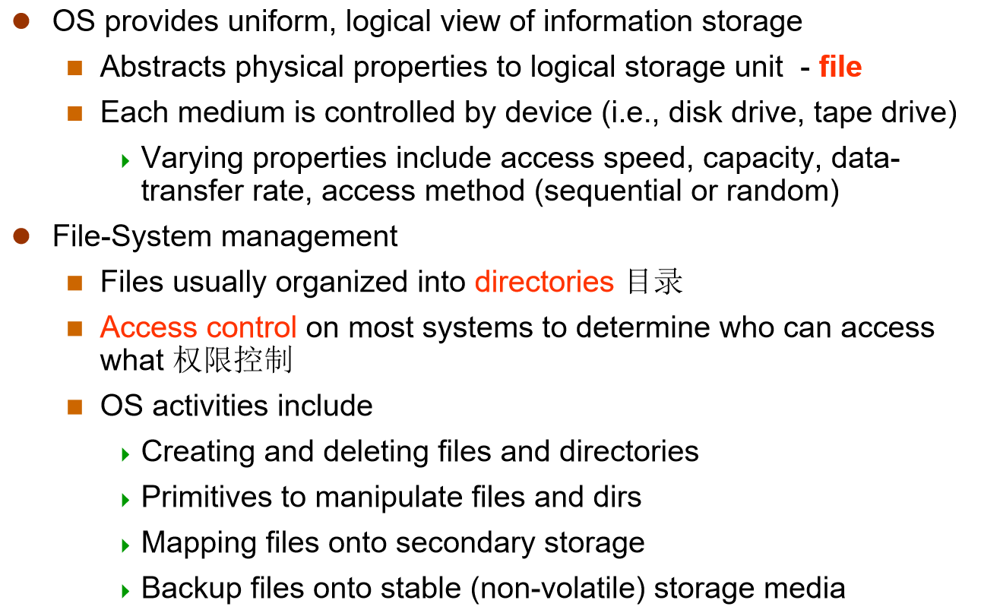

管道 pipe 是一种文件

#### Storage management 存储管理

Mass-Storage Management


I/O Subsystem 子系统


### 总结 OS purposes

- Abstraction 抽象： a way to hide complexity
- Multiplex 多路复用（空间、时间）
- Isolation 隔离（用户/核模式）
- Sharing 共享（用户、进程 资源共享-> 并发）
- Security 安全（特权指令
- Performance 性能
- Range of uses


## 结构 Operating-System Structures

> [!IMPORTANT]
>
> 第二章
>
> - os 服务
> - 系统调用 system call：api
> - os design & implementation
> - os structures
>   - layed
>   - monolithic
>   - microkernel 微内核 优缺点(overhead)
>   
### 操作系统服务

操作系统提供的服务有：

- UI(user interface)
- CLI(command line)
  - 优点：对重复性工作高效

- GUI (Graphics User Interface)

### System call 系统调用

#### 系统调用实现

API（Application program interface)：被封装过 high-level 的系统调用

- Mostly accessed by programs via a high-level API rather than direct system call use 主要通过高级的 API 接触程序而不是直接的系统调用

每个系统调用有个编号，通过系统调用表 table

系统调用发生时，程序控制权将交给内核来完成服务，服务完成后，控制权再还给程序（回到用户状态

系统调用是用户应用（软件）和硬件之间沟通的桥梁——保证了安全和有效的沟通 secure & efficient

> 系统调用是 OS 提供给用户的，只能通过用户程序间接使用
>
> 系统调用的目的是——请求系统服务

#### 参数传递

保存当前 cpu 的 PSW 和 PC

最简单：寄存器保存

间接方式：block、table、memory，把内存中 buffer 地址告诉寄存器（Linux & Solaris）

其他：栈 stack，不一定支持多用户

- block 和 stack 方法不限制参数的数量或长度

#### 系统调用分类/功能

Process control 进程管理
File management 文件管理
Device management 设备管理
Information maintenance (e.g. time, date) 信息维护（内存管理）
Communications 交流
Protection 保护


### 系统程序

分类：File manipulation、Status information、File modification、Programming language support、Program loading and execution、Communications、Application programs

.....debuggers

不是系统程序：web browsers、word processors（用户程序）


### os 设计和实现

os 设计和实现不是一个解决问题的过程（不是具体的问题而是创造性过程）

1.由目标和指标出发：用户目标、系统目标

2.被硬件和系统类型影响

**Policy**:   What to do? 策略（确定具体做什么事，eg 允许某些用户访问某些文件）
**Mechanism**:  How to do it? 机制（定义做事方式）

内存管理、cpu 调度是机制？（算法是机制？

配置文件写的是策略（policy）

==Provide mechanism rather than policy==. In particular, place user interface policy in the clients' hands. 

操作系统基本类型（3）：批处理、分时、实时


### 操作系统结构

#### Simple Structure

MS-DOS: provide the most functionality in the least space

- 不分模块，界面和多级功能间没有很好的分开

#### UNIX

UNIX – 受硬件功能限制，原始 UNIX 操作系统结构有限。UNIX 操作系统由两个可分离的部分组成

- 系统程序
- 内核
  - 包括系统调用接口以下和物理硬件以上的所有内容
  - 提供文件系统、CPU 调度、内存管理和其他操作系统功能；一个级别的大量功能

#### Monolithic System Structure 宏内核架构

- 将系统的主要功能模态作为一个整体运行在内核
- 主流操作系统都采用宏内核，如 Windows、Android、iOS、macos、Linux

**UNIX System Structure** 宏内核


#### Microkernel System Structure 微内核

对应宏内核

将尽可能多的内容从内核移至“用户”空间，提供一小部分服务，例如进程调度

用户模块之间使用消息传递进行通信 message passing

- 基于客户/服务器模式（C/S）
- 采用“机制与策略分离”原理
- 采用面向对象技术

优点：

- 更易于扩展 extend 微内核
- 更易于将操作系统移植 port 到新架构（flexibility）
- 更可靠（内核模式下运行的代码更少）、安全
- 分布式计算

缺点：

- 用户空间与内核空间通信的性能开销大，性能差 performance（宏内核更高效）
- 系统服务、驱动程序的复杂性
- 上下文切换不太有效

#### Hybrid Structure——Darwin

混合模式：By ??

Windows, MacOS, iOS——混合内核

#### Layered Approach 分层方法

操作系统分为多个层（级别），每层都建立在较低层之上。

**最底层（第 0 层）是硬件；最高层（第 N 层）是用户界面**。

通过模块化 modularity ，可以选择各层，以便每层仅使用较低层的功能（操作）和服务

逻辑分层：


逐层调用（不能跨层调用）、逐层封装——层之间通讯的效率问题

优点：便于系统调试和验证；易扩充、易维护

缺点：require more overhead for iter-layer communication 效率低；合理定义各层比较困难

#### Modules 模块化

和分层相似但更灵活、可拓展性 scal，但有模块兼容性问题

- 使用目标导向的方法
- 每个模块再需要时可以加载到内核中（loadable）
- 每个模块核心组件隔离
- 模块相互调用（通过已知的接口）而不是消息传递

LKMs(loadable kernel modules): extend the functionality of the kernel dynamically

优点：提高了操作系统设计的正确性、可理解性、可维护性；增强操作系统的可适应性；加速开发

缺点：模块间接口规定很难满足对接口的实际需求；无法找到一共可靠的决定顺序

#### Other Structures

**Exokernel 外核** (1994)：高度简化 kernel，只负责资源分配，提供了低级的硬件操作，必须通过定制 library 供应用使用

- 高性能，但定制化 library 难度大，兼容性差

Unikernel: statically linked with the OS code needed.Good for cloud service, APP boots in tens of ms.


### 虚拟机 Virtual Machines

A virtual machine takes the layered approach to its logical conclusion.  It treats *hardware and the operating system kernel* as though they were all **hardware** 虚拟机将硬件和操作系统内核都看作硬件

A virtual machine provides an interface identical to the underlying bare hardware

The operating system creates the illusion of multiple processes, each executing on its own processor with its own (virtual) memory

#### 分类

第一类 VMM 直接运行在硬盘上，最高级（内核态）

第二类 VMM 运行在宿主操作系统上，普通程序（用户态）

#### HyperVisor

TYPE1 Bare-Metal 裸金属 architecture

- 更高的性能、和硬件直接接触、安全性更高

TYPE2 Hosted 宿主 需要 hostOS，eg VMware、Oracle

- 应用简单、和现有 OS 兼容性高、适合测试和开发环境

选 2 不选 1 的常见原因：easier integration with existing host OS


三种技术：

VM：更好的隔离性、灵活性，有资源消耗（复杂）的问题

LC：更加轻量级，不需要加载内核 os（docker）

Uk：所有东西都打包，只能允许一个 app 运行

### OS 生成

操作系统初始化时需要创建 **中断向量表**

### 系统启动 System Boot

引导程序 bootstrap program 在开机 power-up/reboot 时

1. 加载到 ROM/EPROM 上（Read-only Memory 是 firmware 固件）
2. 初始化系统
3. bootstrap 定位操作系统内核并加载到内存、开始执行
4. OS 最终被加载到 RAM

- 操作系统的引导程序位于硬盘中
- 引导扇区产生在对硬盘进行高级格式化时


## 进程 Processes

> [!IMPORTANT]
>
> 第三章
>
> - 进程状态 status
> - 进程控制块 PCB
> - 上下文切换
> - 进程调度（job queue: 所有 process, ready queue: 为 cpu 服务, device queue）
> - 生产者-消费者模型
>   - unbounded buffer, bounded buffer（有限 buffer size）

### 进程概念

An operating system executes a variety of programs:

- Batch system – a batch is a sequence of jobs
- Time-sharing systems – user programs or tasks
  - Multitasking
  - Less turnaround, less CPU idle, user interaction

> [!NOTE]
>
> Textbook uses the terms *job* and *process* almost interchangeably

#### 定义

进程是运行中的程序，按照指令流顺序进行

一个进程包含

- text section (code)
- data section (global vars)
- stack (function parameters, local vars, return addresses)
- heap (dynamically allocated memory)
- program counter 

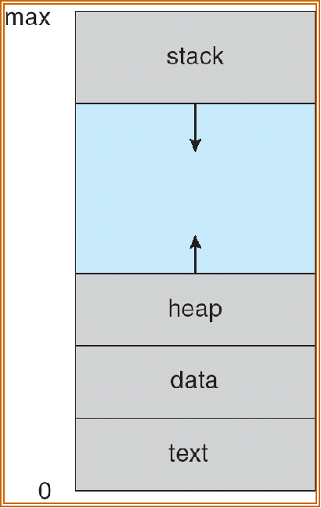 stack 和 heap 相对而生：灵活应用内存空间

进程是一个独立的运行单位，也是操作系统进行资源分配和调度的基本单位

#### Process state

进程状态


- **new 创建态**：正在被创建中
  - 创建新进程的操作原语
    - 申请一个空白 PCB，填写用于控制和管理进程的信息
    - 分配运行所需资源
    - 初始化 PCB
    - 转入就绪态并插入就绪队列

- **running 运行态**
- **ready 就绪态**：等待被分配一个处理器 processor（CPU）已经被加载进内存 memory
- **waiting/block 阻塞态**：等待某个资源可用（不包括 CPU）或者等待 I/O 完成
  - 阻塞原语 Block 执行过程
    - 找到被阻塞进程的标识号 PID 对应的 PCB
    - 若该进程为运行态，则保护其线程，将其状态转为阻塞态，停止运行
    - 将该 PCB 插入相应事件的等待队列，将 CPU 调度给其他进程

- **terminated 终止态**：结束进程
  - 终止进程的操作
    - 根据被终止进程的标识符，检索出该进程的 PCB，从中读出该进程的状态。
    - 若被终止进程处于运行状态，立即终止该进程的执行，将 CPU 资源分配给其他进程。
    - 若该进程还有子孙进程，则通常需将其所有子孙进程终止（有些 OS 无此操作）
    - 将该进程所拥有的全部资源，或归还给其父进程，或归还给操作系统
    - 将该 PCB 从所在队列(链表)中删除


-----------------

- 进程唤醒 wakeup 原语

  - 在该事件队列中找到相应进程的 PCB

  - 将其从等待队列中移出，并设置状态为就绪态

  - 将该 PCB 插入就绪队列，等待调度程序调度

#### Process control block(PCB)

- OS 数据结构，用来跟踪进程和相关资源

- PCB 包含：进程状态、PC、寄存器值、CPU 调度、内存管理信息、accounting 信息、I/O 信息
- Process ID 是进程的独特编号
- PCB 中的 PC 是记录程序目前正在运行的位置


[Context Switch 上下文切换](# Context Switch 上下文切换) 的 overhead

> 分配设备不需要创建新进程
>
> 用户登录成功、启动程序执行需要创建新进程

### 进程调度 scheduling

#### Process Scheduling Queues

CPU Switch From Process to Process

**Job queue** – set of all processes in the system（包括 ready 和正在执行的

**Ready queue** – set of all processes residing in *main memory*, ready and waiting to execute（等待 CPU

**Device queues** – set of processes waiting for an I/O device 有很多设备（申请使用 device——通过系统调用

Processes migrate among the various queues

> [!IMPORTANT]
>
> 一个 PCB 能不能在两个队列（device&ready）里同时排队？
>
> - 不可能


> [!NOTE]
> 
> 我们是把 PCB 放到进程队列里；
>
> CPU 有四个核可以有 4 个队列，也可以只有 1 个队列

#### Schedulers 调度器

==调度器是程序的一部分，A scheduler is a piece of program==

**Long-term scheduler**  (or job scheduler) – selects which processes should be brought into memory (the ready queue) 

长期调度控制多道程序设计(并发) degree of multiprogramming

**Short-term scheduler**  (or CPU scheduler) – selects which process should be executed next and allocates CPU

- The long-term scheduler is invoked very infrequently (seconds, minutes) => (may be slow)
- The short-term scheduler is invoked very frequently (milliseconds) => (must be fast)

**Medium Term Scheduling**：进程在内存和磁盘间交换 swap in and out

> [!WARNING]
>
> UNIX and Windows do not use long-term scheduling

交换运行程序到磁盘（....？


Processes can be described as either:

- **I/O-bound process** I/O 绑定进程 – spends more time doing I/O than computations, many short CPU bursts，eg：下载

- **CPU-bound process** CPU 绑定进程 – spends more time doing computations; few very long CPU bursts，eg：科学计算

#### Context Switch 上下文切换

当 CPU 切换到另一个进程时，系统必须保存旧进程的状态，并为新进程加载保存的状态

上下文切换的流程如下：
1）挂起一个进程，将 CPU 上下文保存到 PCB ，包括程序计数器和其他寄存器。
2）将进程的 PCB 移入相应的队列，如就绪、在某事件阻塞等队列。
3）选择另一个进程执行，并更新其 PCB 。
4）恢复新进程的 CPU 上下文。
5）跳转到新进程 PCB 中的程序计数器所指向的位置执行。

上下文切换的消耗：

上下文切换通常是计算密集型的，即它需要相当可观的 CPU 时间，在每秒几十上百次的切换中，每次切换都需要纳秒量级的时间，所以上下文切换对系统来说意味着消耗大量的 CPU 时间。

时间取决于硬件支持；在 SPARC 架构中，提供了寄存器组

- 上下文切换时 PCB 不必记录进程优先级，优先级是内核 kernel 判断的
- 上下文切换只能发生在内核态
- 进程上下文采用进程 PCB 表示，包括 CPU 寄存器的值、进程状态和内存管理信息等。

> [!NOTE]
>
> 调度是决策行为，切换是执行行为
>
> 先有资源调度，再有进程切换


### 进程操作

#### Process Creation

父进程创造子进程 fork

- Resource sharing

  - Parent and children share all resources

  - Children share subset of parent’s resources

  - Parent and child share no resources
- Execution

  - Parent and children execute concurrently
  - Parent waits until children terminate
- Address space
  - Child duplicate of parent
  - Child *has a program loaded into it*

- UNIX examples
  - **fork** system call creates new process
  - **exec** system call used after a fork to replace the process's memory space with a new program

> 父进程和子进程可以并发执行
>
> 父进程和子进程有各自的空间，不共享虚拟地址
>
> 父进程和子进程有不同的进程控制块（PCB）-> 隔离
>
> 父进程和子进程不能同时使用


> [!NOTE]
>
> 子进程可以 **继承** 父进程的内容；
> 需要重置 pid，cpu time，优先级，堆栈
>
> list of open files？？

OS 不是真的 copy，显式 copy

> [!CAUTION]
>
> 创造进程的新线程不是通过 fork

#### Process Termination


### 共同协作 cooperating

#### Cooperating Processes

**Independent** process 独立进程 cannot affect or be affected by the execution of another process

**Cooperating** process can affect or be affected by the execution of another process

*Advantages* of process cooperation:

- Information sharing
- Computation speed-up (Multiple CPUs)
- Modularity
- Convenience

#### Producer-consumer


主要目的是 解决 生产者线程和消费者线程之间进行数据的 **同步** 操作

```c
//Shared data
#define BUFFER_SIZE 10
typedef struct {
	. . .
} item;

item buffer[BUFFER_SIZE];
int in = 0;
int out = 0;

//Bounded-Buffer – Insert() Method
//Producer pseudo-code:
while (true) {
    Produce an item;
    while (((in + 1) % BUFFER_SIZE   == out); 
           /* do nothing -- no free buffers */
    buffer[in] = item;
    in = (in + 1) % BUFFER_SIZE;
}

//Bounded Buffer – Remove() Method
//Consumer pseudo-code:
while (true) {
    while (in == out); //do nothing, nothing to consume

    Remove an item from the buffer;
    item = buffer[out];
    out = (out + 1) % BUFFER SIZE;
    return item;
}
```

> How many items？
>
> - (in-out) % BUFFER_SIZE
> - 或者加一个变量 count

### 进程间通信

#### Interprocess Communication (IPC)

Two models for IPC: **message passing** 消息队列 and **shared memory** 共享内存（文件）

通信模型：


共享内存的主要优点：数据一致性

In IPC, minimize shared resources can reduce conflicts

#### Direct Communication

explictly 显式的

A link is associated with exactly one pair of communicating processes

Between each pair there exists exactly one link

#### Indirect Communication

mailbox(ports)——both synchronous and asynchronous communication

A link may be associated with many processes

Each pair of processes may share several communication links

#### Synchronization 同步性

send 是一个系统调用

**Blocking** is considered **synchronous**

- Blocking send has the sender blocked until the message is received
- Blocking receive has the receiver block until a message is available

**Non-blocking** is considered **asynchronous**

- Non-blocking send has the sender send the message and continue
- Non-blocking receive has the receiver receive a valid message or null


### Communication in Client-Server Systems

#### Sockets


## 线程 Threads

> [!IMPORTANT]
>
> 第四章
>
> - 线程概念
> - 线程资源：私有数据（寄存器和栈）
> - 用户、内核线程
> - multi-threading models 线程模型 3 种

### Overview

程序内部隔离和调度

#### Single and Multithreaded Processes

###### 

CPU 调度 schedule/dispatch 的最小（基本）单位：线程 thread

资源分配 allocate 的最小（基本）单位：进程 process

##### 进程和线程的区别


线程可以在多个 CPU 上执行

同一进程的线程共享地址空间和资源

线程可以提高系统并发性

#### Benfits

Responsiveness：interactive applications

Resource Sharing：memory for code and data can be shared.

Economy：creating processes are more expensive.

Utilization of MP Architectures 多处理器架构：multi-threading increases concurrency 可拓展性

#### User Level Threads(ULT)

Thread management done by user-level threads library

Three primary thread libraries: 

- UNIX: POSIX Pthreads (can also be provided as system library) 
- Windows: Windows API (Java)

一个用户级线程只能映射到一个内核级线程

对于用户级线程，内核并不知情

> 用户级线程间的切换比内核级切换效率高
>
> 用户级线程可以在不支持内核级线程的操作系统上实现
>
> 用户级线程的切换通过 **线程库**，不需要内核的支持，即线程库为用户级线程建立一个线程控制块

#### Kernel Level Threads(KLT)

Almost all contemporary OS implements kernel threads.

Kernel level threads：支持调度，便于线程切换，避免阻塞；执行的载体

User level threads：；逻辑的载体

内核级线程所需要的资源是以进程为单位申请的

> 内核级（系统级）线程的调度由操作系统完成

> [!NOTE]
>
> 多线程的特长：提高并发性，例如矩阵乘法、web 服务器响应 HTTP
>
> 多线程不共享栈指针
>
> 同一进程中的各个线程有相同的地址单位


### Multithreading Models

#### Many-to-one Model

多对一模型

一个用户级线程卡住了，整个进程就卡住了

thread management is efficient, but will block if making system call, kernel can schedule only one thread at a time

线程管理是高效的，但如果进行系统调用会阻塞，内核一次只能调度一个线程


> Q：某个分时系统采用 **多对一** 线程模型。内存中有 10 个进程并发运行，其中 9 个进程中只有一个线程，另外一个进程 A 拥有 11 个线程。则 A 获得的 CPU 时间占总时间的 1/10

#### One-to-one

Each user-level thread maps to kernel thread

more concurrency, but creating thread is expensive

能让线程并行，每个用户级线程都有一个内核级线程

> Q：某个分时系统采用 **一对一** 线程模型。内存中有 10 个进程并发运行，其中 9 个进程中只有一个线程，另外一个进程 A 拥有 11 个线程。则 A 获得的 CPU 时间占总时间的 11/20

#### Many-to-Many Model

flexible，LWP ID kernel 根据情况看调度

Allows many user level threads to be mapped to many kernel threads

Allows the operating system to create a sufficient number of kernel threads

#### Two-level Model

Similar to M: M, except that it allows a user thread to be bound to kernel thread


### Threading Issues

Semantics 语义 of `fork()` and `exec(）`

> Does fork() duplicate only the calling thread or all threads?
>
> - Some unix systems have two versions of fork(), one that **duplicates all threads** and another that **duplicates the thread** that invokes fork().
>
> - Exec() will replace the entire process.

#### Thread Cancellation

**Asynchronous cancellation** 异步 terminates the target thread  immediately

**Deferred cancellation** 延后 allows the target thread to periodically check via a flag if it should be cancelled

#### Signal Handling

A **signal handler** is used to process signals, either synchronous or asynchronous:

- Signal is generated by particular event
- Signal is delivered to a process
- Signal is handled

#### Thread Pools 线程池

Create a number of threads in a pool where they await work

Advantages

- Usually slightly faster to service a request with an existing thread than create a new thread
- Allows the number of threads in the application(s) to be bound to the size of the pool

**Thread-Local Storage（TLS）**：Allows each thread to have its own copy of data

#### Scheduler Activations 调度激活

LWP is a virtual processor attached to kernel thread

Scheduler activations provide **upcalls** - a communication mechanism from the kernel to the thread library

Upcalls are handled by the thread library with an **upcall handler**.

This communication allows an application to maintain the correct number of kernel threads

When an application thread is about to block, an upcall is triggered. 


## 调度 CPU Scheduling

> [!IMPORTANT]
>
> 第五章
>
> - 调度标准 5 个
> - 抢占、非抢占
> - 调度算法 6 个

### Basic concepts

scheduler dispatch 调度器

调度资源？CPU

调度目标？Processes/threads

==Goal: 在多道程序设计 multiprogramming 下 CPU 使用率最大化==


CPU-I/O Burst Cycle：Process execution consists of a cycle of CPU execution and I/O wait

进程实际运行时 CPU 占用时间少，I/O 多

大部分 CPU burst 时间非常短

调度的层次：高级（作业）调度 --> 中级（内存）调度 --> 低级（进程调度）

#### CPU Scheduler

CPU 可能进行调度的情况（4 种）


non-preemptive 非抢占式调度 1 & 4

preemptive ✔️ 2 & 3

---------------

不能调度的情况：

1. 处理中断过程中
2. 需要完全屏蔽中断的原子操作过程中

#### Dispacher

dispacher latency：P0 停止运行到 P1 运行


### scheduling criteria

1. CPU utilization CPU 利用率：**CPU 使用率 = (1 - 空闲态运行时间/总运行时间) \* 100%**

2. Throughtput 吞吐率：**进程数/总执行时间**

3. Turnaround time 周转时间  = 进程完成时间 - 进程提交时间（进程提交到结束）

4. waiting time 等待时间

5. response time 响应时间


### 调度算法 scheduling algorithms

#### FCFS(First-Come, First-Served)

先来先服务算法


> [!IMPORTANT]
>
> Arrival order makes a difference!
> 到达顺序很重要

- FCFS 是 **非抢占式** 算法
- FCFS 简单、公平
- **Convoy effect**（护航效应）: short process behind long process, the average waiting time may be longer, leading to I/O devices & CPU being idle

**有利于长作业，不利于短作业；有利于 CPU 繁忙型，不利于 I/O 繁忙型**

> 短作业位于长作业后时调度时间要很长；I/O 繁忙会有很多 waiting，不断排队到 ready queue 队尾，如果排到长作业后面就要很长时间

#### SJF(Shortest-Job-First)

短作业优先算法

- SJF is a priority scheduling where priority is the predicted next CPU burst time

- SJF 既可以是抢占式也可以是非抢占式
  - nonpreemptive – once CPU given to the process it cannot be preempted until completes its CPU burst
  - preemptive – if a new process arrives with CPU burst length less than remaining time of current executing process, preempt. This scheme is known as the **Shortest-Remaining-TimeFirst (SRTF)** 最短剩余时间调度算法
- SJF is **optimal** – gives **minimum average waiting time** for a given set of processes
- Which is better? Preemptive? Nonpreemptive? 不确定，要根据到达时间和 cpu burst 确定
- **Starvation 饥饿问题**，优先级低的进程一直无法运行，短作业都会发生
- Not good for long process 不适合长进程，因为优先调度 cpu burst 最短的进程

##### nonpreemptive


##### preemptive


#### Priority Scheduling

优先级调度算法

The CPU is allocated to the process with the highest priority (smallest integer means highest priority)

- Preemptive

- nonpreemptive

**Static Priority**: determine when processes is created; do not change 静态优先

Problem：**Starvation 饥饿** – low priority processes may never execute

Solution：**Aging** （老化）– as time progresses increase the priority of the process——**Dynamic Priority** 提高优先级

#### Highest Response Ratio Next （HRRN）

高响应比优先算法

- 非抢占式
- HRRN is a **compromise** 折中 between FCFS and SJF
- Computing response ratio requires time
- improve the responsiveness of the system 提高系统响应性

Response Ratio （响应比） = $\frac{\text{cpu burst}+\text{waiting time}}{\text{cpu burst}}$ （等待时间和执行时间都要考虑

Take Response Ratio as priority

Larger Response Ratio, higher priority

##### HRRN 算法的工作原理

1. **初始化**： 记录每个进程的到达时间和所需的服务时间。

2. **计算响应比**： 对于每个就绪队列中的进程，计算其响应比。

3. **选择最高响应比的进程**： 
   1. 选择具有最高响应比的进程执行。
   2. 如果有多个进程具有相同的最高响应比，则可以按照其他规则（如先到先服务）来选择。

4. **更新等待时间和响应比**： 
   1. 每次调度后，更新所有就绪队列中进程的等待时间。
   2. 重新计算所有进程的响应比

#### Round Robin (RR)

时间片轮转算法

- Origin from signature method
- Each process gets a small unit of CPU time (time quantum), usually 10-100 milliseconds. After this time has elapsed, the process is preempted and added to the end of the ready queue. 提高系统交互性（人机交互）
- Application: Time-sharing system, Multi-tasking system
- 当前进程的时间片用完后，该进程的状态由执行态变成就绪态


#### Multilevel Queue

多层队列算法

Ready queue is partitioned into separate queues:

- foreground (interactive)
- background (batch)

Each queue has its **own scheduling algorithm**, for example

- foreground – RR
- background – FCFS 计算密集

Scheduling must be done between the queues

- Fixed priority scheduling; (i.e., serve all from foreground then from background). Possibility of starvation.

- Time slice – each queue gets a certain amount of CPU time which it can schedule amongst its processes; i.e., 80% to foreground in RR ， 20% to background in FCFS 


#### Multiple Feedback Queue

多级反馈队列

- 多个就绪队列，优先级逐一降低，按照队列优先级调度

- 设置多个就绪队列，优先级从第一级依次降低

- 优先级高的队列，进程时间片越短

- 每个队列都采用 FCFS ，若在该时间片完成，则撒离系统，未完成，转入下一级级队列

- 按队列优先级调度，仅当上一级为空时，才运行下一级

进程进来，先到优先级最高的队列中，时间片内完成则撤离；否则，到下一级队列排队

#### Multiple-processor scheduling(了解)

多处理器调度

Load balancing 负载均衡

Symmetric multiprocessing(SMP) 对称处理器：每个处理器都是自我调度，多个处理器可以运行、更新一个相同的数据结构

Asymmetric multiprocessing 非对称处理器：只有一个处理器可以接触系统数据结构（调度），减轻数据共享，其他处理器只执行用户代码

- 当调度的处理器坏了，整个系统就运行不下去了

#### Real-time scheduling(了解)

实时调度

实时系统一定要在规定时间内完成

Hard real-time systems 硬实时系统：ddl 前没运行完有严重后果

Soft real-time systems 软实时系统：可以在 ddl 前没运行完（eg，腾讯会议

- Earliest ddl First 最早截止时间优先
- Least Laxity First 最低松弛度优先（不怎么用）
  - A 的松弛度 = A 必须完成的时间-A 需要运行的时间-当前时间
- Rate Monotonic scheduling 速率单调调度
  - 基于任务的周期（一个进程多久执行一次）来分配优先级，周期越短任务优先级越高

#### Thread scheduling(了解)

线程调度

Local scheduling 用户级

Global scheduling 内核级

> [!NOTE]
>
> 批处理 FCFS
>
> 分时系统
>
> 实时系统


### Q


> 外设是不可抢占的
>
> waiting time 是进程等待 CPU 资源的时间！


## 进程同步 Process synchronization

> [!IMPORTANT]
>
> 基本概念：syn，race，critical section，four requirements（互斥/忙则等待、空闲让进、优先等待、）
>
> 软件实现方法：单标志，双标志、、、
>
> 硬件实现方法：原理、关中断、Test and Set、Swap、CAS、mutex lock
>
> 信号量机制：信号量基本概念（形式、类型、用法、实现、缺点）、三个经典问题（有界缓冲区、读写者、哲学家）
>
> - 非忙等/阻塞信号量
>
> 管程：基本概念（形式、特点、条件变量）、应用

### 背景 background

共享数据的并发访问可能导致数据不一致性；并发进程是异步的，所以需要同步

Producer-consumer 生产者消费者问题：解决多个进程间的同步和异步问题

 

count++和 count--两步有可能出错

#### Race condition 竞态条件

出错的 example：

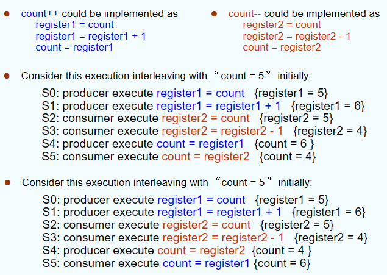

出错的原因：抢占式调度，多个进程对 shared data 进行操作

Race condition 定义：a memory location is accessed concurrently, and at least one access is a write

> **对于访问共享的内核数据，非抢占式的内核是否受竞态条件的影响？**
>
> - 可能会受影响，当多处理器对 shared data 进行操作

### 临界区问题 critical-section problem

> **What operations/processes may have critical problems in OS kernel?**
>
> - cpu
> - 用户态：一个进程的多个线程（满足 shared data 和并发执行）

**临界资源**：多进程或多进程中被共享的资源(shared data)且一次只允许一个进程使用

**临界区**：程序中一个访问公共资源的程序片段，每个进程中访问临界资源的那段代码被称为临界区

> [!NOTE]
>
> **以下是临界资源吗？**
>
> - 全局共享变量（是），局部变量（不是），只读数据（不是），CPU（不是）

对一个进程，可能存在多个临界区；临界区可以合并（depends）

> [!CAUTION]
>
> 共享资源才需要互斥

#### 解决方案 solution

##### Mutual Exclusion（互斥/忙则等待）

如果进程 P~i~ 正在其临界区中执行，则其他进程不能在其临界区中执行

##### Progress（空闲让进）

如果没有任何进程在其临界区中执行，并且存在一些希望进入其临界区的进程，则不能无限期地推迟选择下一个将进入临界区的进程（即允许一个请求进入临界区的进程立即进入临界区）

##### Bounded waiting（有限等待）

在一个进程发出进入其临界区的请求之后，在该请求被批准之前，必须对允许其他进程进入其临界区的 **次数** 进行限制

- 假设每个进程以非零速度执行
- 没有关于 *N* 个进程相对速度的假设

##### 让权等待

（原则上应该遵守，但非必须）当进程不能进入临界区时，应立即释放处理器，防止进程忙则等待。

### 同步机制

#### 软件方法

##### 单标志法


i 和 j 交替执行

- 满足 Mutual Exclusion 和 bounded waiting
- 不满足 progess

##### 双标志后检查法


- 满足 Mutual Exclusion
- 不满足 Progress，违背空闲让进准则，存在 CPU 调度的一种情况，两个标志都为 TRUE 后一直循环下去）
- 如果没有死循环是 bounded waiting，但可能有所以总体不是

##### 双标志先检查法


和前面两种算法相比，先 while 再设 flag 值：


- **不满足 Mutual Exclusion**（存在 CPU 调度的一种情况，两个标志都为 TRUE，并进入临界区
- 满足 Progres
- 优点：不用交替进入，可连续使用

##### Peterson’s Solution

双进程解决方案
假设 LOAD 和 STORE 指令是原子的；即不能被中断。
两个进程共享两个变量：`int turn;Boolean flag[2];`
变量 `turn` 表示轮到谁进入临界区。
flag 数组用于指示进程是否已准备好进入临界区。`flag[i] = true` 表示进程 P~i~ 已准备好

基本思想：

```c
//Process Pi
while (true) {
    flag[i] = TRUE;
    turn = j;
    while ( flag[j] && turn == j);
    CRITICAL SECTION
        flag[i] = FALSE;
    REMAINDER SECTION
}

//Process Pj
while (true) {
    flag[j] = TRUE;
    turn = i;
    while ( flag[i] && turn == i);
    CRITICAL SECTION
        flag[j] = FALSE;
    REMAINDER SECTION
}
```

- 满足 mutual exception 和 progress
- 满足 bounded waiting，bound 是 1
- 但还是不满足让权等待

> [!CAUTION]
>
> There are no guarantees that Peterson's solution works correctly on modern computer architectures.
>
> Reason：计算机编译优化 -> 代码的乱序执行【先 load（读），再 store（赋值）】
>
> Solution：Memory barrier ( 内存栅栏 ) -- 插入这条指令后就不会乱序执行了

##### Bakery Algorithm (面包房算法) Lamport

Multiple-Process Solutions： for **n** processes

1. 任何时间，最多只能有一个进程进入 critical section ；
2. 每个进程最终都会进入 critical section ；
3. 每个进程都能停在 noncritical section ；
4. 不能对进程的速度做任何假设。

基本思想（排队取号）：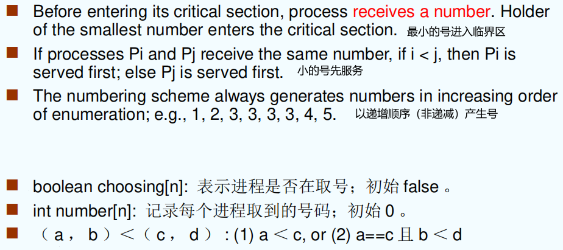

```c
//Multiple-Process Solutions
do{
    choosing[i] = true;
    number[i] = max{number[0], number[1], …, number[n-1]}+1; // 选号码
    choosing[i] = false;
    for(j = 0; j ＜ n; j++){
        while (choosing[j]);
        while ((number[j] != 0) && (number[j], j) ＜ (number[i], i));
    };
    CRITICAL SECTION
        number[i] = 0;
    REMAINDER SECTION
} while(1);
```

- 满足 mutual exception 和 progress，
- 满足 bounded waiting，bound 为 n-1

#### 硬件方法

**Synchronization Hardware**

Modern machines provide special atomic hardware **instructions**

​	-> ==Atomic = non-interruptable== (原子操作，不能中断；后三种方法都用了这一思想)

**优点**  

- 适用于任意数目的进程，在单处理器或多处理器上

- 简单，容易验证其正确性

- 可以支持进程内存在多个临界区，只需为每个临界区设立一个布尔变量

**缺点**

- 耗费 CPU 时间，不能实现“让权等待” 

- 可能不满足有限等待：从等待进程中随机选择一个进入临界区，有的进程可能一直选不上 

- 可能死锁

##### 关中断法 Disable interrupts(中断屏蔽法) 

思想：进入临界区前直接屏蔽中断，保证临界区资源顺利使用；使用完毕，打开中断

```c
while (true) {

    Disable Interrupts; 
    Critical section;
    Enable Interrupts; 
    Remainder section;

} 
```

###### 缺点

- **可能影响系统效率**：滥用关中断会严重影响 CPU 执行效率，其锁住 CPU 可能导致原本一些短时间即可完成的需要等待开中断，影响 cpu 并发执行，cpu 利用率下降

- **不适用于多 CPU 系统**：中断屏蔽法适用于单 CPU 系统，在多 CPU 系统中 **无法有效同步** 各个 CPU 的操作。 
- **安全性问题**：滥用关中断权力可能导致严重后果，例如在关闭中断期间，一些重要的中断请求可能被错过，影响系统的稳定性和可靠性。

##### TestAndSet Lock Instruction（TSL）

Test and modify the content of a word atomically.

Shared boolean variable lock, initialized to false.

```c
boolean TestAndSet (boolean *target)
{
    boolean rv = *target;
    *target = TRUE;
    return rv:
}
while (true) {
    while ( TestAndSet (&lock ));/* do nothing*/
    // critical section
    lock = FALSE;
    // remainder section 
};
```

- 满足 mutual exclusion, progress
- 不满足 bounded waiting（进入临界区靠运气），不满足让权等待
- 等待进入临界区的进程不会主动放弃 CPU

##### Swap Instruction

思想

1. 对每个临界资源，swap 设置一个全局 `bool` 变量 `lock`(初值为 false) ，每个进程设置局部变量 `key`(初值为 true)

2. 进程调用 `swap()` 指令访问临界区，会交换 key 和 lock 的值，实现上锁，进入访问

3. 退出时把 `lock` 重置为 `false`

```c
while (true) {
    key = TRUE;
    while (key = =TRUE)
        Swap(&lock, &key) ; 

    // critical section
    lock = FALSE;
    // remainder section 
}

void Swap(boolean *a, boolean *b)
{
    boolean temp = *a;
    *a = *b;
    *b = temp;
}
```

- 满足 mutual exclusion, progress
- 不满足 bounded waiting（

##### The compare_and_swap (CAS) Instruction

思想

1. Executed atomically
2. Returns the original value of passed parameter **value**
3. Set the variable **value** the value of the passed parameter **new_value** but only if `*value == expected` is true. That is, the swap takes place only under this condition.

```c
//Shared integer lock initialized to 0;
while (true){
    while (compare_and_swap(&lock, 0, 1) != 0) ; /* do nothing */ 
    /* critical section */ 
    lock = 0; 
    /* remainder section */ 
}
int compare_and_swap(int *value, int expected, int new_value)
{ 
    int temp = *value; 
    if (*value == expected) 
        *value = new_value; 
    return temp; 
}
```

- 满足 mutual exclusion, progress
- 不满足 bounded waiting（

解决办法：排队

##### Bounded-waiting with compare-and-swap


- 满足 mutual exclusion, progress 和 bounded waiting

> [!CAUTION]
>
> 以上对 TS 和 Swap 指令的描述仅为功能描述，它们由硬件逻辑实现，不会被中断


#### 互斥锁 Mutex locks


But this solution requires **busy waiting** **（不停空循环）**

This lock therefore called a **spinlock** **（也叫 自旋锁）**

- 主要采用硬件机制来实现
- 缺点：忙等待

#### 信号量方法 Semaphores

用来解决同步和互斥问题

Two indivisible operations modify S: 

- `wait()` and `signal()`, originally called `P()` and `V()` 

- Proberen(测试)，Verhogen(增加) 

- 只能在 wait 和 signal 中对信号量进行操作

- 低级的进程通信原语

Can only be accessed via two indivisible (atomic) operations:

```c
wait (S) { //资源进入临界区
    while S <= 0; // no-op，S <= 0：有进程在临界区
    S--;
}
signal (S) { //资源退出临界区，空出资源给其他进程
    S++;
}
```

Can be implemented without busy waiting --> 实现让权等待

> [!IMPORTANT]
>
> 
>
> S.value = 0 已经有一个进程在临界区

信号量种类：

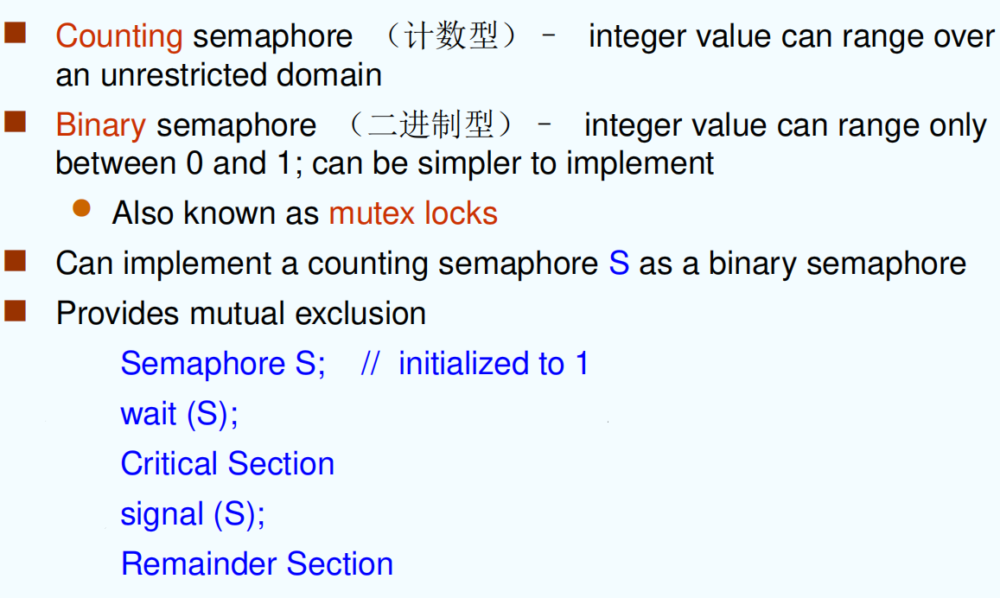

👆 互斥访问

同步操作：


Question：有四个房间，四个进程访问


##### 实现 Semaphore Implementation

###### Busy waiting


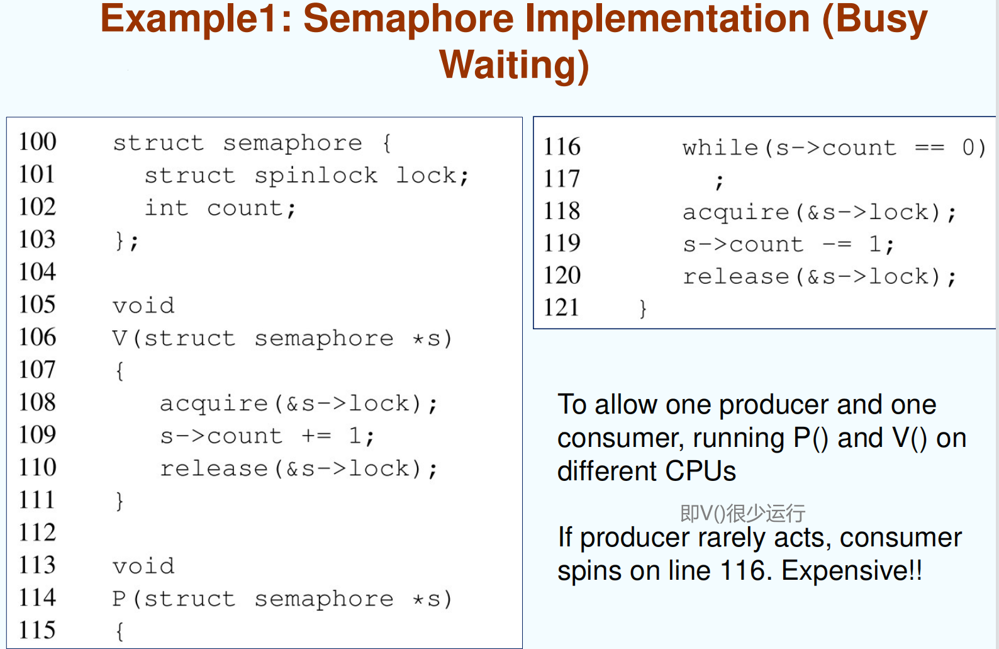

对 P 不太友好

###### no Busy waiting 非忙等


```c
/*Implementation of wait*/
wait (S){ //取信号量操作
    value--;
    if (value < 0) { 
        // add this process to waiting queue
        block(); // 插到S的waiting queue中
    }
}

/*Implementation of signal*/
Signal (S){ 
    value++;
    if (value <= 0) { 
        // remove a process P from the waiting queue
        wakeup(P); // 把一个进程唤醒，移出waiting queue，到临界区执行
    }
}
```

- S 的取值可以是负的了（相比原先的 wait 和 signal），S 取负表示当前队列排队进程的个数


> [!WARNING]
>
> 进程在标黄处 sleep 后，再次被唤醒时会从头开始执行！

Busy waiting? No busy waiting?

- No busy waiting

What if one must choose busy waiting?

- 电脑要多 CPU
- 上下文切换时间 > busy waiting，选择 no busy waiting；< 的话两者都行

##### Deadlock and Starvation

**Deadlock 死锁** – two or more processes are waiting indefinitely for an event that can be caused by only one of the waiting processes

**Starvation 饥饿** – indefinite blocking. A process may never be removed from the semaphore queue in which it is suspended

##### Classical Problems of Synchronization

###### Bounded-Buffer Problem

*N* buffers, each can hold one item

- Semaphore **mutex** initialized to the value **1** 互斥信号量 1 个
- Semaphore **full** initialized to the value 0, counting full items
- Semaphore **empty** initialized to the value **N**, counting empty items


###### Readers and Writers Problem

**读者写者问题**

A data set is shared among a number of concurrent processes

- Readers – only read the data set; they do not perform any updates
- Writers – can both read and write.

**Problem** – allow multiple readers to read at the same time. Only one single writer can access the shared data at the same time.  ( 读者优先 ) 


Shared Data

- Data set

- Semaphore **mutex** initialized to 1, to ensure mutual exclusion when readcount is updated.

- Semaphore **wrt** initialized to 1.

- Integer **readcount** initialized to 0 读者的数量


###### Dining-Philosophers Problem

**哲学家就餐问题**

Shared data 

- Bowl of rice (data set)

- Semaphore `chopstick [5]` initialized to 1


如果只设置一个筷子的信号量，设置为 5，有什么问题？一个筷子可能被拿两次，违反互斥性

#### 管程方法 monitor

实现互斥和同步

##### Monitor

A high-level abstraction that provides a convenient and effective mechanism for process synchronization. 

Only **one** process may be active within the monitor at a time. (hint: the other processes may be sleeping within the monitor)

```c
//管程变量只有内部函数可以访问
monitor monitor-name
{
    // shared variable declarations
    procedure P1 (…) { …. }
    …
        procedure Pn (…) {……}
    Initialization code ( ….) { … }
    … 
}
```

 函数挂起

`x.wait()` 作用：阻塞该进程并将他插入到 x 序列

管程中的 signal 操作和信号量的 V 操作不同：V 一定会改变信号量的值 S = S+1，但是 signal 是针对某个条件变量的，若不存在因该条件而阻塞的进程，则 signal 不会产生任何影响

##### 管程方法解决哲学家就餐问题

```c
monitor DP
{ 
    enum { THINKING; HUNGRY, EATING) state [5] ;
          condition self [5]; 
          //philosopher i can delay herself when unable to get chopsticks
          void pickup (int i) { // 拿筷子
              state[i] = HUNGRY;
              test(i); // 看看左边右边有没有人在eating
              if (state[i] != EATING) // 自己hungry
                  self[i].wait; // 筷子还不可用，等待
          }
          void putdown (int i) { 
              state[i] = THINKING;
              // test left and right neighbors
              test((i + 4) % 5); // 如若满足则唤醒进行吃饭
              test((i + 1) % 5);
          }
          void test (int i) { 
              if ( (state[(i + 4) % 5] != EATING) &&
                  (state[i] == HUNGRY) &&
                  (state[(i + 1) % 5] != EATING) ) { 
                  state[i] = EATING ;
                  self[i].signal() ; //执行时不在signal中等待，这句signal没有用
              } }
          initialization_code() { 
              for (int i = 0; i < 5; i++)
                  state[i] = THINKING;
          } }
```

- When the left and right philosophers, **self [(i+4)%5]** and **self [(i+1)%5]**

  continue to eat, **self [i]** may *starve*

#### 例子

##### Pthreads

It provides:

- mutex locks

- condition variables

Non-portable extensions include:

- read-write locks

- spin locks

Using `pthread_cond_wait()` & `pthread_cond_signal()`


## 死锁 Deadlock

> [!IMPORTANT]
>
> 基本概念：死锁概念，4 个必要条件，资源分配图，cycle &deadlock
> solutions：3 种策略
> 死锁预防（如何破坏四个必要条件)
> 死锁避免（安全状态，安全状态与死锁，单实例算法，多实例算法——**银行家算法**）
> 检测（单实例算法——wait for graph，多实例算法)
> 恢复

### The Deadlock Problem

**死锁**：多个进程因竞争共享资源而造成相互等待的一种僵局，使得各个进程都被阻塞，若无外力作用，这些进程都将永远不能再向前推进

发生死锁的进程必定处于阻塞态

#### 产生死锁的四个必要条件

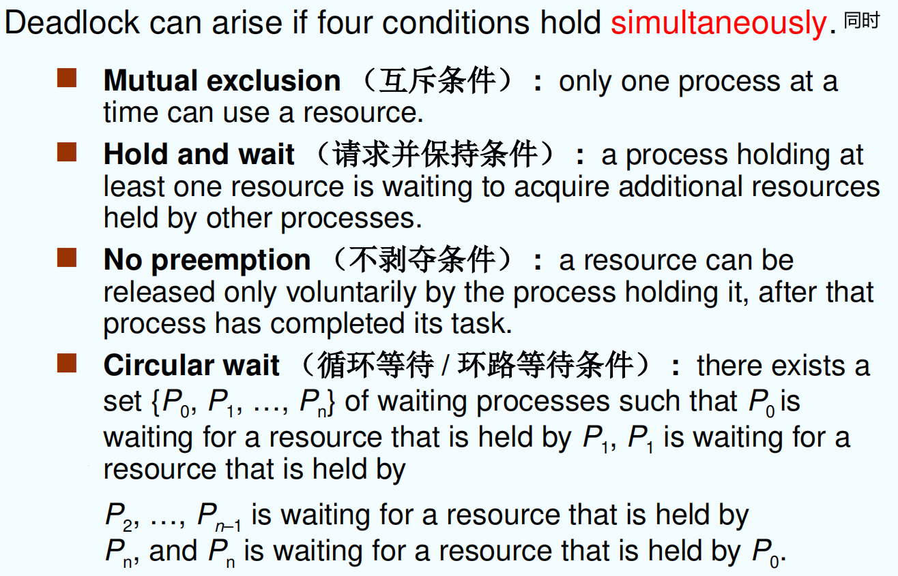

> 

**死锁公式**：

假设系统共有 m 个资源，n 个进程，每个进程需要 k 个资源，若满足 $m>n×(k- 1)$，则系统一定不会发生死锁

### 系统模型 System Model

resource type & resource instances

#### 资源分配图 Resource-Allocation Graph

A set of vertices **顶点 V** and a set of edges **边 E**


顶点表示资源 R 或进程 P

边：

- **P-> R**，进程指向资源，进程申请资源 ==> 申请边
- **R-> P **，资源指向进程，进程可以使用资源，资源已经被分配给进程 ==> 分配边

死锁一定有环，有环不一定死锁

If graph contains no cycles => no deadlock. 无环一定没有死锁

If graph contains a cycle =>

- if only one instance per resource type, then deadlock.

- if several instances per resource type, possibility of deadlock.


### 死锁处理方法 Methods for Handling Deadlocks

Ensure that the system will never enter a deadlock state. 让系统永远不进入死锁状态 ---- **Prevention 死锁预防**、 **Avoidance 死锁避免**

Allow the system to enter a deadlock state and then recover. 允许系统进入死锁状态，但可以恢复 ----**Detection 死锁检测**、 **Recovery 死锁解除**

Ignore the problem and pretend that deadlocks never occur in the system. 忽略，假装不出现死锁 ---- **鸵鸟算法**（Ostrich Algorithm）

- 大多数操作系统使用鸵鸟算法 used by most operating systems, including UNIX、Linux、Windows.
- 为什么选这个？用户运行多，解决代价少

#### Deadlock Prevention (预防)

破坏死锁产生的四个必要条件之一 Restrain the ways request can be made.

- 限制用户申请资源的顺序 -- 破坏循环等待（条件 4）

1. **Prevent Mutual Exclusion 不互斥**： not required for sharable resources; must hold for nonsharable resources 不共享资源，即互斥使用资源，实际中不太可行（这个条件无法被破坏）
2. **Prevent Hold and Wait 不请求等待** ：一次分配好所有资源 must guarantee that whenever a process requests a resource, it does not hold any other resources.
   1. Require process to request and be allocated all its resources before it begins execution, or allow process to request resources only when the process has none (**release all current resources before requesting any additional ones**).
      要求进程在开始执行之前请求并分配所有资源，或者仅在进程没有资源时才允许进程请求资源（在请求任何其他资源之前释放所有当前资源）。
   2. **Low resource utilization**; **starvation possible**. (example: copy data from DVD drive to a disk file, sorts the file, then prints the results to a printer.)
      **资源利用率低**；**可能出现饥饿**。（例如：将数据从 DVD 驱动器复制到磁盘文件，对文件进行排序，然后将结果打印到打印机。）
3. **Prevent No Preemption 可剥夺**：变成非抢占式，实际中不太可行
4. **Prevent Circular Wait 不循环等待**：impose a total **ordering** of all resource types, and require that each process requests resources in an increasing order of enumeration. 
   对所有资源类型实行总体 **排序**，并要求每个进程按照枚举的递增顺序请求资源。


以上方法在实际中都不太可行

#### Deadlock Avoidance (避免) 

通过动态检测资源分配的安全性，确保系统 **不会进入不安全状态**

- 为实现安全性，我们需要知道
  - 每个进程所需资源 max 数量 each process declares the maximum number of resources of each type that it may need
  - The deadlock-avoidance algorithm dynamically examines the resource-allocation state to ensure that there can never be a circular-wait condition.
  - Resource-allocation state is defined by the number of available and allocated resources, and the maximum demands of the processes.

##### safe state 安全状态

<P1 , P2 , …, Pn> 称为安全序列。如果系统不存在安全序列，则称系统处于不安全状态

对于进程序列中的每一个进程 Pi，当前系统已经分配了一些资源，还剩下一些资源。如果 **Pi 前面的资源之和+系统剩下的资源 能够满足 Pi 执行完毕**，则这个序列是个安全状态。


> [!NOTE]
>
> If a system is in safe state => no deadlocks. 安全状态一定无死锁
>
> If a system is in unsafe state => possibility of deadlock. 不安全可能有死锁
>
> Avoidance => ensure that a system will never enter an unsafe state.


##### Avoidance algorithms

**Single** instance of a resource type. Use a resourceallocation graph

**Multiple** instances of a resource type. Use the banker’s algorithm

##### Resource-Allocation Graph Algorithm 资源分配图算法

Claim edge Pi -> Rj indicated that process Pi may request resource Rj

有三种边：claim edge、request edge 和 assignment edge

？

##### Banker’s Algorithm 银行家算法:fire:


数据结构


Example

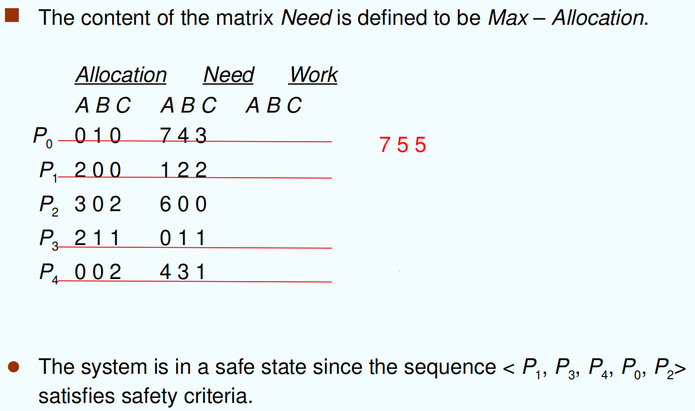


- 实际上很多操作系统都不是使用银行家算法进行死锁避免

##### Safety Algorithm


#### Deadlock Detection ( 检测 ) 

本质：safety 算法，全部满足就没有死锁

##### 单实例 Single Instance of Each Resource Type

检查 wait-for graph 有没有环


##### 多实例 Several Instances of a Resource Type

多实例，调用 safety 算法

时间复杂度：O(m × n^2^)

##### Completely Reducible Graph 可完全化简图

能消去图中所有边，能则称为可完全化简图

找出一个既不阻塞又非独立的进程结点 Pi

在顺利的情况下，分配给其资源让其完成，消去所有边变成孤立点

循环上述两步操作，直至消去所有边，代表无死锁。

### Recovery from Deadlock

解除死锁的方法：

1. 资源剥夺法：把部分进程挂起，剥夺其资源

2. 撤销进程法：撤销部分进程，释放资源

3. 进程回退法：让一个进程或多个进程回退到避免死锁的地步，释放中间资源

依据：进程的优先级、已执行时间、剩余时间、已用资源、交互还是批处理等


#### Resource Preemption

Selecting a victim – minimize cost.
Rollback – return to some safe state, restart process for that state.
Starvation – same process may always be picked as victim, include number of rollback in cost factor

## 内存管理 Memory Management

> [!IMPORTANT]
>
> 内存管理基本概念：
>
> - 源程序处理流程、链接
> - 地址绑定 binding
>   - 编译、装入、执行时刻
> - 逻辑地址与物理地址
>   - MMU
>
> variable-partition scheme
>
> - 内存分配算法 FF best worst
> - 外部、内部碎片
>
> 内存保护
>
> 连续分配管理方式
>
> Paging 分页管理方式
>
> - page table、TLB、分级页表、索引页表
> - TLB effective access time
>
> 分段管理方式、段页管理
>
> - segment table
> - 分配方式更灵活

### Background

电磁感应

**Semiconductor ROM/RAM**

DRAM: 动态随机存取存储器

SRAM: 静态随机存取存储器

ROM: 只读存储器

**“Memory Wall”**

内存墙 Memory is much slower than processors, and consumes more energy

**Emerging NVM Technologies**

**NVMs** : 非挥发性存储器，非易失性存储器

- non-volatile; low idle power; no refreshes; high write overheads; etc. 

**Phase-Change Memory(PCM)**：相变存储器

- Intel/Micron 3D Xpoint；Intel Optane DC Persistent Memory / DC SSD 

**ReRAM/RRAM**：电阻式存储器

- Arbitrary programmed cell resistance (“memristor”). 
- First invented by HP Labs, now produced by many companies (in early stage). 

-----------------------------------------------

Program must **be brought (from disk) into memory** and placed within a process for it to be run only storage CPU can access Main memory and registers directly

Register access in one CPU clock (or less)

Main memory can take many cycles

Cache sits between main memory and CPU registers

#### Cache Hierarchy

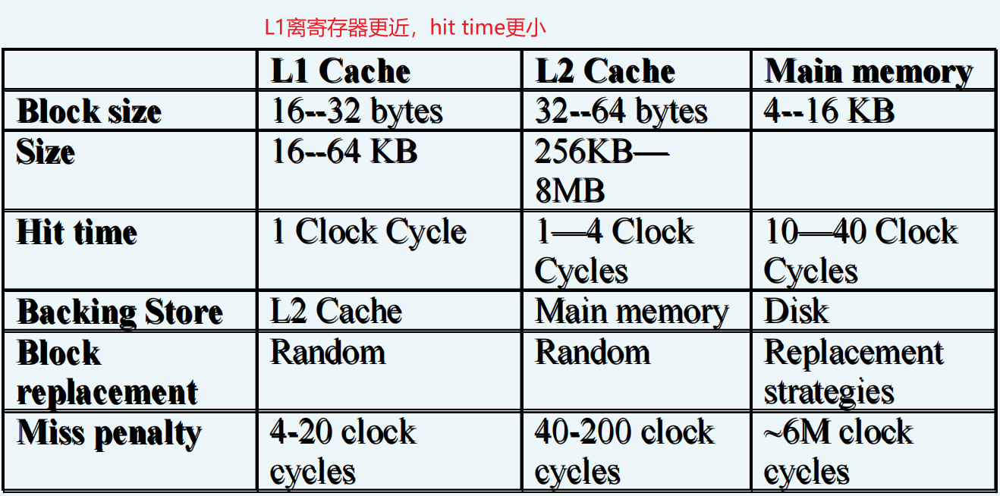

#### Multistep Processing of a User Program

运行程序过程：complier -- linker -- loader -- run

- **Symbolic Address 符号地址**: Addresses in the source program are generally symbolic (such as the variable count 函数名/变量名). 
- **Relocatable Addresses 可重定位地址** : A compiler typically binds these symbolic addresses to relocatable addresses (such as “14 bytes from the beginning of this module”). 
- **Absolute Addresses 绝对地址** : The linker or loader binds the relocatable addresses to absolute addresses (such as 74014)

#### Binding of Instructions and Data to Memory

地址绑定

**Address binding**(Mapping From one address space to another) of instructions and data to memory addresses can happen at three different stages

- **Compile time 编译时刻** : If memory location known a priori, absolute code can be generated; must recompile code if starting location changes
- **Load time 装入时刻** : Must generate relocatable codeif memory location is not known at compile time
- **Execution time 执行时刻** : Binding delayed until run time if the process can be moved during its execution from one memory segment to another. Need hardware support for address maps (e.g., base and limit registers 两个寄存器用来快速地址映射和绑定)
  - Base register 基址寄存器 , limit register 限长寄存器 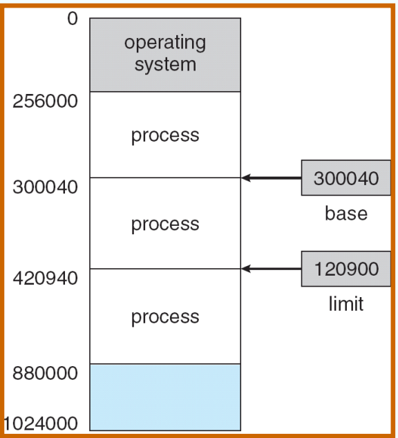
- Linux, Windows 系统在 **执行时刻** 进行地址绑定

#### Logical vs. Physical Address Space

The concept of a logical address space that is bound to a separate physical address space is central to proper memory management

- **Logical address** 逻辑地址 – generated by the CPU; also referred to as virtual address
- **Physical address** 物理地址 – address seen by the memory unit

Logical and physical addresses are the **same** in **compile-time and load-time** address-binding schemes

Logical (virtual) and physical addresses **differ** in **execution time** address-binding scheme

##### Memory-Management Unit (MMU)

Hardware device that maps virtual to physical address 硬件 实现地址转换

The user program deals with logical addresses; it never sees the real physical addresses

#### 链接 Linking

##### Dynamic Linking

动态链接

Linking postponed until execution time

- Small piece of code, **stub 桩**, used to locate the appropriate memory-resident library routine
- Stub replaces itself with the address of the routine, and executes the routine

Dynamic linking is particularly useful for libraries 共享库里的函数只用存一次

- Saves main memory space
- Reduces size of exe image file
- Relinking of new library not needed

##### static linking

静态链接

- 运行前将库函数和程序等链接成一个完整的装入模块

#### 装入 Loading

##### Dynamic Loading

动态装入：程序用到了再装进内存

- Better memory-space utilization; unused routine is never loaded
- 装入内存时地址均为相对地址；执行时再绑定地址
- 优点：可以将程序分配到不连续的储存区，运行期间可以动态申请分配内存

##### Static loading

静态装入：把程序全部装入内存

- 地址在装入时转换（绝对地址），装入后程序在内存中不能移动，也不能再申请空间

#### 总结

**程序的链接与装入**

- 编译
  - 从高级语言到目标模块的过程 ( 实际是预处理、编译、汇编三个阶段的统称 ) 
  - 本质是一些机器可以“看懂”的 0/1 指令和数据文件

- 链接
  - 把编译后的目标模块与所需库函数链接在一起形成一个整体
  - 静态链接、装入时动态链接、运行时动态链接
  - 形成逻辑地址
  
- 装入
  - 将虚拟地址映射为内存实际的物理地址
  - 绝对装入、静态重定位 ( 可重定位装入 ) 、动态重定位 ( 动态运行时装入 )

--------------

进程内存映像 image

- 代码段
  - 只读代码段 `.init` `.text`(用户程序机器码) `.rodata`
- 数据段
  -  `.data`(已初始化的全局变量和静态变量) `.bss`(未初始化和所有初始化为 0 的全局变量和静态变量)

- 进程控制块 PCB
- 堆
- 栈

### 连续分配 Contiguous Memory Allocation

Relocation register 可重定位寄存器 contains value of smallest <span style="color:#00CC00;"> physical address </span>

单一连续分配，用户程序独占用户区

- 简单、无外部碎片
- 只能用于单用户、单操作系统，有内部碎片、储存器的利用率低

Limit register contains range of logical addresses – each logical address must be less than the limit register

MMU maps logical address dynamically

**多分区分配 Multi**

- 固定分区 fixed partitioning：如果内存大程序小，浪费资源

- 动态分区 dynamic partition

  - Hole – block of available memory; holes of various size are scattered throughout memory

  - When a process arrives, it is allocated memory from a hole large enough to accommodate it

  - Operating system maintains information about: a) allocated partitions b) free partitions (hole)

#### 动态分配的算法 Dynamic storage-allocation problem

基于顺序搜索的分配算法：

**FF(First Fit)**：Allocate the first hole that is big enough 按顺序第一个放得下的洞；空闲分区按地址递增的次序排列

**NF(Next Fit)**：下一个放的下的洞

**BF(Best Fit)**： Allocate the smallest hole that is big enough; must search entire list, unless ordered by size 最小能放得下的洞，会产生一些小碎片（tiny leftover holes）最容易产生碎片

- 空闲分区按容量递增的次序排列

**WF(Worst Fit)**：Allocate the largest hole; must also search entire list 最大的洞，会产生一些大碎片（large leftover holes）

- 空闲分区按容量递减的次序排列

> [!NOTE]
>
> First-fit and best-fit better than worst-fit in terms of speed and storage utilization


#### Fragmentation

**External Fragmentation 外部碎片**– total memory space exists to satisfy a request, but it is not contiguous

**Internal Fragmentation 内部碎片**(refer to the textbook p287) – allocated memory may be slightly larger than requested memory; this size difference is memory internal to a partition, but not being used

**Reduce external fragmentation by compaction/defragmentation** 通过压缩减少外部碎片

- Shuffle memory contents to place all free memory together in one large block
- Compaction is possible *only if* <span style="color:#CC0066;"> relocation is dynamic </span>, and is done at execution time
- I/O problem I/O 操作时也不允许进行压缩
  - Latch job in memory while it is involved in I/O
  - Do I/O only into OS buffers
  - Another solution to external frag. is non-contiguous allocation

### 分页 Paging

分页存储管理

Logical address space of a process can be noncontiguous 逻辑地址可以不连续; process is allocated physical memory whenever the latter is available

Divide physical memory into fixed-sized blocks called **frames**(size is power of 2, between 512 bytes and 8,192 bytes)
Divide logical memory into blocks of same size called **pages**

To run a program of size n pages, need to find n free frames and load program

分页通过硬件机制实现

#### Address Translation Scheme


页号、页面偏移

地址转换


> 为了将虚拟地址转换为物理地址，需要结合虚拟地址的页号和页内偏移，以及页表中页号与页框号的映射关系。以下是计算步骤：
>
> ### 已知条件
>
> 1. **页面大小** = $$4 \, \text{KB} = 2^{12} = 4096 \, \text{bytes}$$，页号用高 20 位，页内偏移用低 12 位表示。
> 2. 虚拟地址：
>    - 2362H =  $9026_{10}$
>    - 1565H = $5477_{10}$
> 3. 页表：
>    - 页号 0 → 页框号 101H
>    - 页号 1 → 页框号 102H
>    - 页号 2 → 页框号 254H
>
> ------
>
> ### 转换步骤
>
> #### 1. 计算虚拟地址的页号和页内偏移
>
> $$\text{页号} = \left\lfloor \frac{\text{虚拟地址}}{\text{页面大小}} \right\rfloor$$, $$\quad \text{页内偏移} = \text{虚拟地址} \mod \text{页面大小}$$
>
> - **2362H**： $$\text{页号} = \left\lfloor \frac{9026}{4096} \right\rfloor = 2$$, $$\quad \text{页内偏移} = 9026 \mod 4096 = 1834$$
> - **1565H**： $$\text{页号} = \left\lfloor \frac{5477}{4096} \right\rfloor = 1$$, $$\text{页内偏移} = 5477 \mod 4096 = 1381$$
>
> #### 2. 根据页表找到对应页框号
>
> - **页号 2** → 页框号 254H
> - **页号 1** → 页框号 102H
>
> 页框号左移 12 位（乘以 4096），再加上页内偏移，得到物理地址。
>
> ------
>
> #### 3. 计算物理地址
>
> - **2362H（页号 2，页框号 254H）**：$$\text{物理地址} = \text{页框号} \times 4096 + \text{页内偏移}$$，$$\text{物理地址} = 254H \times 4096 + 1834 = 254000H + 072A = 25472AH$$
> - **1565H（页号 1，页框号 102H）**：$$\text{物理地址} = 102H \times 4096 + 1381 = 102000H + 0565 = 1020565H$$
>
> ------
>
> ### 结果
>
> 1. 虚拟地址 2362H → 物理地址 25472AH
> 2. 虚拟地址 1565H → 物理地址 1020565H

#### Page 

TablePage table is kept in main memory

**Page-table base register (PTBR)** points to the page table
**Page-table length register (PTLR)** indicates size of the page table
In this scheme every data/instruction access requires **two** memory accesses. One for the page table and one for the data/instruction.

> [!NOTE]
>
> Pagetable 放在内存里，访问逻辑地址要访问两次内存

The two-memory-access problem can be solved by the use of a special fast-lookup hardware cache called associative memory or translation look-aside buffers (**TLB** s 转换旁视缓冲 , 一称快表 )

#### Paging Hardware With TLB


#### Effective Access Time

TLB 快表命中率（EAT）
$$
EAT = (M + \varepsilon) \times \alpha + (2M +\varepsilon)\times(1 – \alpha)
$$

Associative Lookup 查 TLB 时间  $\varepsilon$ 

Assume memory cycle time 访问内存时间 $M$ 

Hit ratio – percentage of times that a page number is found in the associative registers; ratio related to number of associative registers

Hit ratio = $\alpha$​

例子：

#### Memory Protection in Paged Scheme

内存保护

Valid-invalid bit attached to each entry in the page table


#### Shared Pages

**Shared code**：One copy of <span style="color:#CC0066;"> read-only </span> (reentrant) code shared among processes (i.e., text editors, compilers, window systems)；

Shared code must appear in <span style="color:#CC0066;"> same location in the logical address space </span> of all processes 逻辑地址一样在 TLB 只用存一次


### Structure of the Page Table

#### Hierarchical Paging 分级页表/多级页表

两级页表

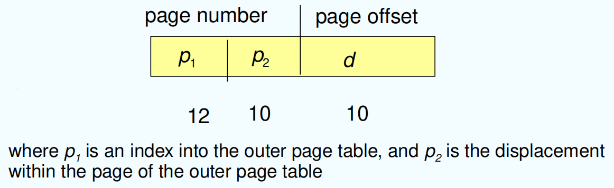

p1-> outer page table -- p2 -> page of page table -- d -> real physical address 

64 = 42+10+12, 32 = 12+10+10

> [!NOTE]
>
> **Page-table base register (PTBR)** ？
>
> **What are the benefits of the hierarchical page**? 节省内存（pagetable 的内存空间）


#### Hashed Page Tables

Variation for 64-bit addresses is the **clustered page table**


哈希优点：快，hashtable 比 pagetable 小


#### 倒排页表 Inverted Page Tables


缺点：慢；好处：只有一个 pagetable

Search is slow, so put page table entries into a hash table. TLB can be used to speed up hash-table reference.

#### 页表项计算


### Swapping 

A process can be swapped temporarily out of memory to a backing store, and then brought back into memory for continued execution 进程可以暂时从内存交换到备用存储器，然后再返回到内存中继续执行
**Backing store 交换区** – fast disk large enough to accommodate copies of all memory images for all users; must provide direct access to these memory images 足够大的快速磁盘，可以容纳所有用户的所有内存映像的副本；必须提供对这些内存映像的直接访问


### 分段 Segmentation

Memory-management scheme that supports user view of memory 

**Segment table** – maps two-dimensional physical addresses; each table entry has: 

- **base** – contains the starting physical address where the segments reside in memory

- **limit** – specifies the length of the segment

**Segment-table base register (STBR)** points to the segment table’s location in memory 段表中每个块对应的起始物理地址

**Segment-table length register (STLR)** indicates number of segments used by a program

- segment number **s** is legal if **s** < **STLR**

使用动态内存分配

引入段式存储管理方式，主要是为了满足用户的下列要求：

- 方便编程、分段共享、分段保护、动态链接和动态增长

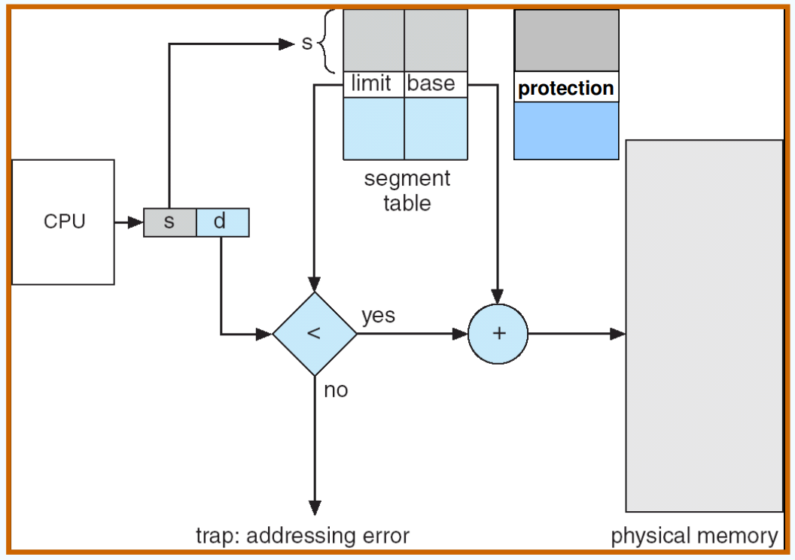

非连续分配

- 每个进程都有一张段表，每个段表项对应进程中的一段

分段管理保护

- 存取控制保护
- 地址越界保护

在 **段式分配** 中，取一次数据时先从内存查找段表，再拼成物理地址后访问内存，共需要 2 次内存访问。

在 **段页式分配** 中，取一次数据时先从内存查找段表，再访问内存查找相应的页表，最后拼成物理地址后访问内存，共需要 3 次内存访问。


### Example: The Intel Pentium

奔腾处理器

Supports both segmentation and segmentation with paging 段页混合，先分段再分页

linear address: 32 offset


#### Intel Pentium Segmentation

根据段号找页表基址，根据分页的 va（页框号）找到页号，两者拼接

Local Descriptor Table contains entries for the segments local to each program itself; 
Global Descriptor Table contains entries of the system (OS).

--------------------

**分段** 式存储管理方法有利于程序的 **动态链接**

操作系统实现 **分区** 存储管理的代价最小


存储管理方式中，只要是固定的分配就会产生内部碎片，其余的都会产生外部碎片。若固定和不固定同时存在(例如段页式)，则仍视为固定。

## Virtual Memory 虚拟内存

> [!IMPORTANT]
>
> 虚拟内存基本概念：定义、好处
>
> - 按需分页、分段
>
> 请求页式管理：
>
> - 好处
> - 逻辑地址转换
> - page fault 缺页中断处理
>   - 缺页有效访问时间
> - 页面替换
>   - 页面替换算法（FIFO OPTIMAL LRU CLOCK ENAHNCED CLOCK）
> - 帧的分配和置换策略、抖动、工作集
>
> kernel 内存分配

### Background

**Virtual memory** – separation of user logical memory from physical memory 虚拟内存不是物理对象，而是指内核提供的用于管理物理内存和虚拟地址的抽象和机制的集合

- Only **part** of the program needs to be in memory for execution 作业不必全部装入内存
- Logical address space can therefore be much **larger** than physical address space 逻辑地址可以比物理地址大很多
- Allows address spaces to be **shared** by several processes 地址空间可以被多个进程共享
- Allows for more efficient process **creation**

> 非虚拟存储器：作业在运行前必须全部装入内存，且在运行过程中也一直驻留内存
>
> 虚拟存储器：作业在运行前不必全部装入内存，且在运行过程中也不必一直驻留内存

Virtual memory can be implemented via 虚拟内存的实现：

- **Demand paging 请求式分页**

- **Demand segmentation 请求式分段**

----------------------------------

#### principle of locality

**局部性原理 (principle of locality)**: 指程序在执行过程中的一个较短时期所执行的指令地址和指令的操作数地址，分别局限于一定区域。

- 时间局部性 : 一条指令的一次执行和下次执行，一个数据的一次访问和下次访问都集中在一个较短时期内 ; 
- 空间局部性 : 当前指令和邻近的几条指令，当前访问的数据和邻近的数据都集中在一个较小区域内。
- 虚拟存储器是具有请求调入功能和置换功能，仅把进程的一部分装入内存便可运行进程的存储管理系统，它能从逻辑上对内存容量进行扩充的一种虚拟的存储管理系统。
- 虚拟存储器只能基于非连续分配——os 虚拟技术中的空分复用技术

-----------------

虚拟内存其他优点：

- System libraries can be shared by several processes through mapping of the shared object into a virtual address space 通过将共享对象映射到虚拟地址空间，系统库可由多个进程共享
- Shared memory is enabled 共享内存
- Pages can be shared during process creation (speeds up creation) 可在进程创建期间共享页面（加快创建速度）

#### Process Creation

Virtual memory allows other benefits during process creation:
- **Copy-on-Write(COW) 写时复制**：CoW 的主要目的是减少内存使用和提高性能，通过延迟实际的内存
  复制，直到某个进程尝试修改内存内容时才进行复制（省时间和空间）
- **Memory-Mapped Files (later)**: 将文件内容映射到进程的地址空间的技术。通过内存映射文件，可以像访问内存一样访问文件内容，而无需显式地进行读写操作。这种技术在处理大文件、提高文件访问性能以及实现进程间通信等方面非常有用


### Demand Paging

请求调页，需要时将页面放到内存

Bring a page into memory only when it is needed

- Less I/O needed

- Less memory needed 

- Faster response

- More users

- Page is needed => reference to it

  - invalid reference => abort

  - not-in-memory => bring to memory

- Lazy swapper – never swaps a page into memory unless page will be needed
  - Swapper that deals with pages is a pager

Transfer of a Paged Memory to Contiguous Disk Space 连续分配

#### Valid-Invalid Bit

With each page table entry a valid–invalid bit is associated (**v**: in-memory, **i**: not-in-memory)

* Initially valid–invalid bit is set to i on all entries
* During address translation, if valid–invalid bit in page table entry is **i** => **page fault** (a trap to the OS 缺页中断)


#### Page Fault

If there is a reference to a page, first reference to that page will trap to operating system: **page fault**

缺页处理流程：

1. Operating system looks at <span style="color:#CC0000;"> another table </span> (kept with PCB) to decide:
  - Invalid reference => abort
  - Just not in memory
2. Get empty frame
3. Swap page into frame
4. Reset tables 磁盘内部表和页表
5. Set `validation bit = v`
6. Restart the instruction that caused the page fault
   1. 中断后恢复 block move
   2. auto increment/decrement location

> 页面替换不是必须的

------------------

What’s the state of the process that has page fault?

-------------

#### Performance of Demand Paging

Page Fault Rate 0 ≤ p ≤ 1.0
- if p = 0 no page faults 
- if p = 1, every reference is a fault

**Effective Access Time (EAT)**
EAT = (1 – p) × memory access + p (page fault overhead + swap page out + swap page in + restart overhead)

例子：


> [!NOTE]
>
> 请求分页存储管理中，若把页面尺寸增大，那么页帧数减小，缺页中断次数也会减少


### Copy-on-Write

Copy-on-Write (COW) allows both parent and child processes to initially share the same pages in memory

If either process modifies a shared page, only then is the page copied

COW allows more efficient process creation as only modified pages are copied

Free pages are allocated from a **pool** of zeroed-out pages

CoW 的主要目的是减少内存使用和提高性能，通过延迟实际的内存复制，直到某个进程尝试修改内存内容时才进行复制

### Page Replacement

#### Page replacement

如果没有空闲帧 free frame：

**Page replacement 页面替换** – find some page in memory, but not really in use, swap it out

- algorithm 页面替换算法
- performance – want an algorithm which will result in minimum number of page faults
- Same page may be brought into memory several times

好处：

- Prevent over-allocation of memory by modifying page-fault service routine to include page replacement
- Use **modify (dirty) bit 脏位** to reduce overhead of page transfers – only modified pages are written to disk
- Page replacement completes separation between logical memory and physical memory – large virtual memory can be provided on a smaller physical memory

实际上不是等到没有空闲帧的时候进行替换，操作系统会提前做


#### Page Replacement Algorithms

Want lowest page-fault rate 最低缺页率

输入：引用串 reference string；输出：缺页的次数 number of page faults on that string

> [!NOTE]
>
> **内存无限大，缺页会无线趋近于零吗**？不会，趋于一个常数，缺页次数随着内存变大会变小

##### First-In-First-Out (FIFO) Algorithm

先进先出算法

Belady


##### Optimal Algorithm

**最佳置换算法** 缺页次数最小 => optimal

替换将来最长不使用的 page Replace page that will not be used for longest period of time


##### Least Recently Used (LRU) Algorithm

**最近最久未使用** 置换算法：选择内存中最久没有引用的页面被置换。这是局部性原理的合理近似，性能接近最佳算法。但由于需要记录页面使用时间，硬件开销太大。


##### LRU Algorithm

以下三种方法都是通过硬件实现

Counter implementation：每次引用时钟+1

Stack implementation：设置一个特殊的栈，把被访问的页面移到栈顶，于是栈底的是最久未使用页面。

移位寄存器 : 被访问时左边最高位置 1 ，定期右移并且最高位补 0 ，于是寄存器数值最小的是最久未使用页面。 (AdditionalReference-Bits Algorithm 附加引用位算法 )

##### LRU Approximation Algorithms

又叫 second chance algorithm，clock algorithm

reference bit

- 当访问到 page，bit = 1，周期内被访问过至少一次；bit = 0，较长时间内没被访问过，替换出去

second chance

##### Enhanced second chance Algorithm

使用引用位和修改位 (reference bit, modified bit)，引用过或者修改过置为 1 记录每个页面被引用的次数

淘汰次序：(0,0) > (0,1) > (1,0) > (1,1)

基本思想：

第 1 轮扫描 : 查找 (0, 0) ，不做修改
第 2 轮扫描 : 查找 (0, 1) ，修改访问位为 0 
第 3 轮扫描 : 查找 (0, 0) ，不做修改
第 4 轮扫描 : 查找 (0, 1)

##### Counting-based Algorithms

Keep a counter of the number of references that have been made to each page 

- **LFU Algorithm**: replaces page with smallest count 使用次数最少的页面置换出去
- **MFU Algorithm(most frequently used)**: based on the argument that the page with the smallest count was probably just brought in and has yet to be used 使用次数最多的页面置换出去


#####  Page Buffering Algorithm 页面缓冲算法

通过被置换页面的缓冲，有机会找回刚被置换的页面

被置换页面的选择和处理：用 FIFO 算法选择被置换页，把被置换的页面放入两个链表之一，如果页面未被修改，就将其归入到 **空闲页面链表** 的末尾，否则将其归入到 **已修改页面链表**。 

需要调入新的页面时：将新页面内容读入到空闲页面链表的第一项所指的页面，然后将第一项删除。 
空闲页面和已修改页面，仍停留在内存中一段时间，如果这些页面被再次访问，这些页面还在内存中。
当已修改页面达到一定数目后，再将它们一起调出到外存，然后将它们归入空闲页面链表。

实际中，Windows 、 Linux 页面置换算法是基于 **页面缓冲算法**

### Allocation of Frames 

分配：Each process needs minimum number of pages － usually determined by computer architecture

#### Fixed Allocation 固定分配

Equal allocation 等分

Proportional allocation – Allocate according to the size of process 按进程比例分配

#### Priority Allocation 优先级分配

Use a proportional allocation scheme using priorities rather than size

If process Pi generates a page fault,

- select for a replacement one of its frames
- select for replacement a frame from a process with a lower priority number

#### Global vs. Local Allocation

**Global replacement** 全局替换– process selects a replacement frame from the set of all frames; one process can take a frame from another

**Local replacement** 本地替换– each process selects from only its own set of allocated frames

Problem with global replacement 问题: unpredictable page-fault rate. Cannot control its own page-fault rate. 

More common Problem with local replacement: free frames are not available for others. – Low throughput

固定分配、全局置换不能组合使用

### Thrashing 抖动、颠簸

> 所有页面置换策略都可能引起抖动

If a process does not have “enough” pages, the page-fault rate is very high. This leads to:

- low CPU utilization
- Queuing at the paging device, the ready queue becomes empty
- operating system thinks that it needs to increase the degree of multiprogramming
- another process added to the system 循环

**Thrashing**：a process is busy swapping pages in and out 忙于页面替换，内存不够

Thrashing 解决方法 : 

- 增加物理内存
- 优化页面置换算法
- 在 cpu 调度中引入工作集算法
- 动态调整进程的内存分配
- 限制并发进程数
- 内存压缩

-----------------------

#### Demand Paging and Thrashing

Why does demand paging work?
Locality model 局部性
- Process migrates from one locality to another
- Localities may overlap

Why does thrashing occur? 

- size of locality > total memory size

To limit the effect of thrashing:  local replacement algo cannot steal frames from other processes. But queue in page device 
increases effective access time. 

To prevent thrashing: allocate memory to accommodate its locality

#### Working-Set Model 工作集

△ ≡ working-set window: a fixed number of page references

m = total available frames

WSSi (working set size of Process Pi ) = total number of pages referenced in the most recent  (varies 

in time)

D = WSSi （total demand frames for all processes in the system

if D > m，Thrashing

Policy if D > m, then suspend one of the processes


#### Page-Fault Frequency Scheme

Establish “acceptable” page-fault rate for each process 调节 frame 数控制 page fault

- If actual rate too low, process loses frame

- If actual rate too high, process gains frame


### 内存映射文件 Memory-Mapped Files

Simplifies file access by treating file I/O through memory rather than **read() write()** system calls

Also allows several processes to map the same file allowing the pages in memory to be shared

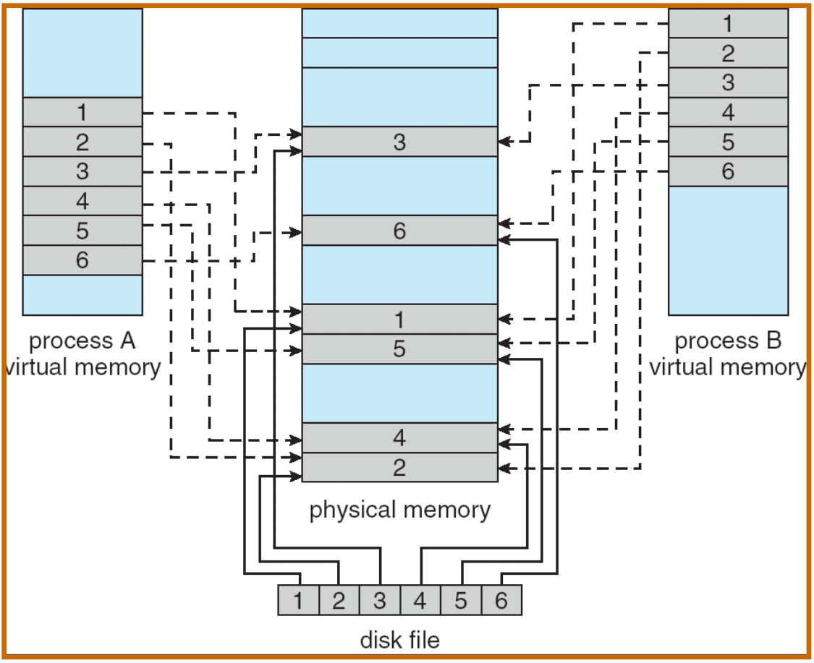

内存映射文件可以通过修改内存中的数据来实现对文件的写操作


### Allocating Kernel Memory

reated differently from user memory

Often allocated from a free-memory pool

- Kernel requests memory for structures of varying sizes – needs to reduce fragmentation

- Some kernel memory needs to be contiguous (certain h/w device interacts with contiguous physical memory)

Therefore, many systems do NOT utilize paging for kernel code and data.

#### Buddy System （伙伴系统）

Allocates memory from fixed-size segment consisting of physically contiguous pages

Memory allocated using **power-of-2 allocator** 32 64 128 256

Linux 内存管理子系统采用基于内存区域 **伙伴算法** 来管理物理页帧的分配和回收

#### Slab Allocator

**Slab** is one or more physically contiguous pages-- 是一个预分配的内存池，包含多个相同大小的对象 

**Cache** consists of one or more slabs

- Single cache for each unique kernel data structure

- Each cache filled with **objects** – instantiations of the data structure

When cache created, filled with objects marked as **free**

When structures stored, objects marked as **used**

- If slab is full of used objects, next object allocated from empty slab

- If no empty slabs, new slab allocated

**Benefits** include no fragmentation, fast memory request satisfaction

主要目的：为申请不足一页帧的小对象（缓冲）申请与释放物理内存，以减少碎片

#### Other Issues – Prepaging ( 预调页 )

To reduce the large number of page faults that occurs at process startup

- Prepage all or some of the pages a process will need, before they are referenced

#### Other Issues – Page Size

Page size selection must take into consideration:

- Fragmentation -> small page size

- table size -> large page size

- I/O times -> large page size

- Locality -> small page size, accurate locality

#### Other Issues – TLB Reach（ TLB 范围）

TLB Reach - The amount of memory accessible from the TLB 增大 TLB 范围减少缺页

TLB Reach = (TLB Size) ✖ (Page Size)

Increase the Page Size

- This may lead to an increase in fragmentation as not all applications require a large page size 

Provide Multiple Page Sizes

- This allows applications that require larger page sizes the opportunity to use them without an increase in fragmentation

#### Other Issues – Program Structure

缺页次数和程序有关

EG，按列访问和按行访问


### Other Considerations

不重要 过

### Operating-System Examples

不重要 过

## File-System Interface

> [!IMPORTANT]
>
> 解释文件系统的功能
> 描述文件系统的接口
> 讨论文件系统设计权衡，包括访问方法、文件共享、文件锁定和目录结构
> 探索文件系统保护

### File Concept

#### File system

什么是文件系统？The way that controls how data is stored and retrieved in a storage medium.

- File naming 文件命名
- Where files are placed 位置
- Metadata 和文件内容相关的管理信息
- Access rules 访问规则

#### File Concept

什么是文件？

- Contiguous logical address space. A sequence of bits, bytes, lines, or records. The meaning is defined by the creator and user. 连续的逻辑地址空间，一些位、字节、行或记录的序列
- 在用户进行输入、输出中，文件是基本单位

文件类型 Types: 

Data：numeric, character, binary
Program：Source, Object, Executable

#### File Structure

- None 无结构文件 - sequence of words, bytes

- Simple record structure

  - Lines 

  - Fixed length 定长记录

  - Variable length 变长记录

- Complex Structures

  - Formatted document：顺序文件、索引文件、索引顺序、散列
  - Relocatable load file	

- Can simulate last two with first method by inserting appropriate control characters
  通过插入适当的控制字符，可以用第一种方法模拟最后两种

- Who decides:

  - Operating system 操作系统决定文件
  - Program 程序

#### Operations & file attributes

File is an abstract data type 抽象数据类型

**Create** – 为新文件分配外存空间 + 在目录中创建一个目录项

**Write** – define a pointer，每发生写操作，更新写指针

**Read** – use the same pointer
	Per-process current file-position pointer

**Reposition within file** (**file seek**) - 文件跳转到特定位置开始读写

**Delete** - 删除文件对应的目录项和文件控制块（FCB），回收磁盘空间和内存缓冲区

**Truncate** - 怎么截断文件

**Open**(Fi) – search the directory structure on disk for entry F~i~, and move the content of entry to memory

**Close** (Fi) – move the content of entry F~i~ in memory to directory structure on disk

------------------------

文件属性

**Name** – only information kept in human-readable form 文件名唯一

**Identifier** 文件标识符 – unique tag (number) identifies file within file system

**Type** 类型 – needed for systems that support different types

**Location** – pointer to file location on device

**Size** – current file size

**Protection** – controls who can do reading, writing, executing

**Time, date, and user identification** – data for protection, security, and usage monitoring

Information about files are kept in the <span style="color:#CC0000;"> directory structure </span>, which is maintained on the disk

#### Open files

文件描述符是存储在进程的 `files_struct` 结构中的 `fd`（文件描述符表）数组的下标，用于唯一标识一个已打开的文件


`Open()` **system call** returns a pointer to an entry in the **open-file table**

Per-process table 每个进程的打开文件表: maintained by the kernel; unique for each

- Current file pointer
- Access rights
- …

System-wide table 全局 table: maintained by the kernel

- Open count 计数
- location？文件磁盘位置
- ...

----------------------------------

Several pieces of data are needed to manage open files:

**File pointer**:  pointer to last read/write location, per process that has the file open

**File-open count**: counter of number of times a file is open – to allow removal of data from open-file table when last processes closes it 访问计数值

**Disk location of the file**: cache of data access information – system doesn’t need to read it from disk for every operation. 文件物理地址

**Access rights**: *per-process* access mode information

打开一个文件时，属于内存索引结点而磁盘索引结点没有的内容是 访问计数值


> [!NOTE]
>
> **文件描述符 FD & 文件控制块 FCB？**
>
> | 特性             | 文件描述符（FD）                      | 文件控制块（FCB）                |
> | ---------------- | ------------------------------------- | -------------------------------- |
> | **定义层次**     | 用户进程与操作系统之间的接口          | 文件系统内部的管理结构           |
> | **作用**         | 标识打开的文件，用于文件操作          | 存储文件元信息，管理文件内容     |
> | **与进程的关系** | 进程相关，属于进程的文件描述符表      | 独立于进程，全局共享             |
> | **存在形式**     | 整数值，操作系统分配和管理            | 数据结构，位于内存和磁盘         |
> | **存储的信息**   | 打开的文件标识符                      | 文件元数据（大小、权限、位置等） |
> | **典型操作**     | 系统调用 `open()`、`read()`、`write()` | 文件系统操作，涉及文件定位与管理 |
>
> - **文件描述符** 是操作系统提供给用户进程的简化文件接口，用于文件操作的快捷标识。
> - **文件控制块** 是文件系统用于存储文件信息和管理文件的底层结构，体现了文件的全局属性和状态。
>
> 两者互相关联但层次不同：文件描述符通过操作系统内部结构（如文件描述符表、打开文件表等）最终映射到文件控制块，从而完成具体的文件操作。


### Access Methods


顺序访问


直接访问


### 目录结构 Directory Structure

The directory can be viewed as **a symbol table** that translates file names into their file control blocks.

FCB 文件控制块

A collection of nodes containing (management)  information about all files

目录独立于所有文件之外的文件，有结构、每个 entry 就是一个 FCB，每个 FCB 对应于一个文件

Both the directory structure and the files reside on disk.

#### Both the directory structure and the files reside on disk


The directory records information about the files in the system – such as name, location, size and type.

#### Operations Performed on Directory


#### 目录作用

**Efficiency** – locating a file quickly

**Naming** – convenient to users

1. Two users can have same name for different files
2. The same file can have several different names

**Grouping** – logical grouping of files by properties, (e.g., all Java programs, all games, …)

#### Single-Level Directory

为所有用户只提供一级目录，不方便，命名、分组问题


#### Two-Level Directory

每个用户有个文件夹


还是不够高效

#### Tree-Structured Directories

树状目录


从一个目录到一个子目录需要一次磁盘 I/O 操作

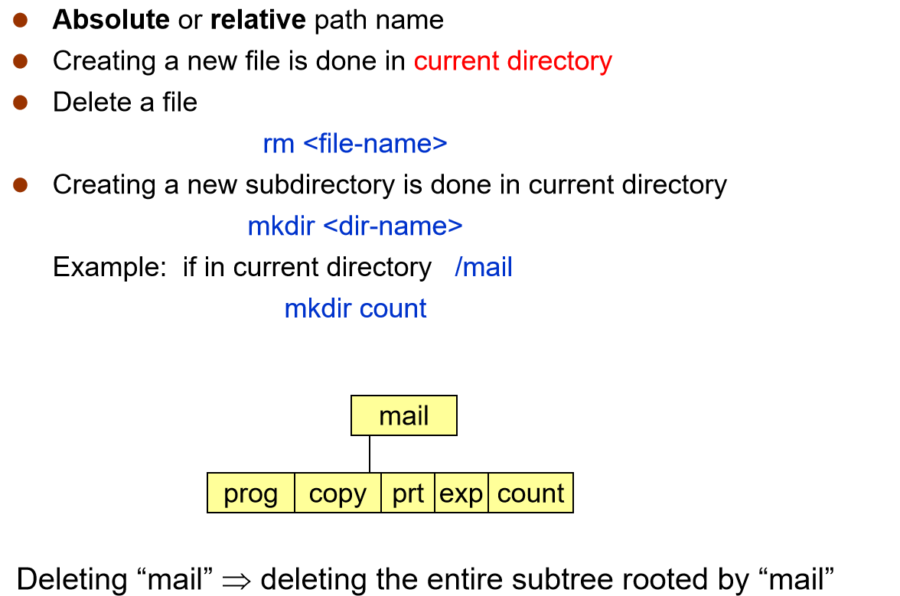

#### Acyclic-Graph Directories

无环目录

共享子目录或文件

- Requirement for file sharing
- Have shared subdirectories and files


如果有环的话，会有删除问题，重复找到这个文件，reference count（文件被引用次数）<> 0 即使没被使用过

#### Soft (Symbolic) Link vs. Hard Link

软链接

A **soft link** is a **separate file** that points to the original file by storing its path. 

The soft link **has its own inode** (FCB), and its data contains the path to the linked file, not the file data itself.

Soft links can **span file systems** since they are simply paths to other files.

字符串指向路径，类似快捷方式，可以跨磁盘，可以在有引用的时候被其他用户删除（链接无效）

-----------------------

A **hard link** is **an additional name** for an existing file. It increases the file's *link count*, which is a count of how many names (links) a file has.

Hard Link 硬链接: Both the original file and the hard link point to the **same inode** (FCB).

Hard links cannot span file systems; one **cannot** create a hard link for a directory to **prevent the creation of cycles**.

指针指向 索引块 -> 文件（FCB/inode 索引节点），只能在同一个文件系统中被使用，在有引用的时候不能被其他用户删除


**Summary**: hard link points to the actual data on the disk, while the symbolic link points to the path of the file 硬链接指向磁盘上的实际数据，而符号链接指向文件的路径

- 两种链接方式都能解决 dangling pointer 的问题
- 硬链接的查找速度比软链接快

### File-System Mounting 文件系统挂载

A file system must be **mounted** before it can be accessed 文件系统必须先 **挂载** 才能访问

An un-mounted file system is mounted at a **mount point**


> 可以挂载到 fred 上吗？可以
>
> 原来 fred 下的内容（help）可以访问吗？访问不了但还在盘上

#### Mount Point


### File Sharing

Sharing of files on multi-user systems is desirable

Sharing may be done through a protection scheme

On distributed systems, files may be shared across a network

Network File System (NFS) is a common distributed file-sharing method

####  Multiple Users

**User ID** s identify users, allowing permissions and protections to be per-user

**Group ID** s allow users to be in groups, permitting group access rights

#### Remote File Systems


#### Consistency Semantics


### Protection

File owner/creator should be able to control:

- what can be done
- by whom

Types of access：Read, Write, Execute, Append, Delete, List

#### Access Lists and Groups

Mode of access:  read, write, execute

权限


> d 指目录
>
> pbg 指 hard link 的数量


## 文件系统实现 File system Implementation

> [!IMPORTANT]
>
> To describe the **details** of implementing local file systems and directory structures
>
> To discuss **block allocation** and **free-block algorithms** and trade-offs
>
> 磁盘结构
>
> 内存结构
>
> 

### File-System Structure

File structure

- Logical storage unit
- Collection of related information

File system resides on secondary storage (disks)

File system organized into **layers**

文件的物理结构：连续分配、链接分配

物理文件的组织方式是由操作系统确定的

一个文件系统可以存放文件的数量受限于文件控制块的数量

#### Layered File System 分层


#### Data Structures Used to Implement FS

**Disk structures** 磁盘结构

- 主引导记录 Master Boot Record（MBR）
  - 分区表
  - Boot control block (per volume) 引导块/启动卷

- Volume control block per volume (**superblock** in Unix) 超级块
- Directory structure per file system 目录
- Per-file FCB (**inode** in Unix) 文件控制块

- 文件系统空闲块息

- 其他所有目录和文件

**In-memory structures**

- In-memory mount table about each mounted volume 关于每个已安装卷的内存安装表
- Directory cache
- System-wide open-file table
- Per-process open-file table

#### FCB

**File control block** – storage structure consisting of information about a file

FCB 存放控制文件需要的各种信息的数据结构，以实现按名存取

FCB 与文件一一对应，一个 FCB 就是一个文件目录项

FCB 包含：基本信息、存取控制信息、使用信息

ACL：access control list 访问控制表


####  In-memory Structure

open/read a file

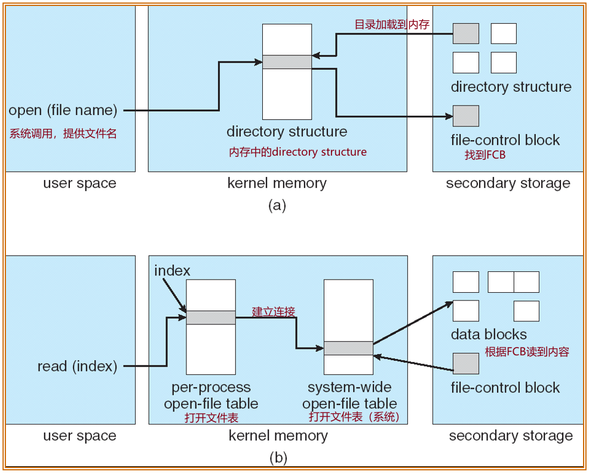


### Virtual File System (VFS) 虚拟文件系统

Virtual File Systems (VFS) provide an **object-oriented way** of implementing file systems. 面向对象方法

VFS allows the same system call interface (the API) to be used for different types of file systems.

The API is to the VFS interface, rather than any specific type of file system.

Defines a network-wide unique structure called **vnode**.


封装


The four primary object types of VFS 虚拟文件系统的物理结构:

- **superblock object** 超级块: a specific mounted filesystem, corresponding to (but not equal) the superblock in the disk structure
- **inode object** 索引节点: a specific file, corresponding to (but not equal) FCB in the disk structure
- **dentry object** 目录: an individual directory entry
- **file object** 文件: an open file as associated with a process, existing as long as the file is opened

### Directory Implementation

Linear list of file names with pointer to the data blocks. 线性列表

- simple to program
- time-consuming to execute Hash 

Table – linear list with hash data structure. 哈希表

- decreases directory search time
- collisions – situations where two file names hash to the same locationfixed size
- can use chained-overflow hash table
- Or rehashing to another larger hash table

### Allocation Methods

#### Contiguous allocation 连续分配

- Each file occupies a set of contiguous blocks on the disk
- Simple – only starting location (block #) and length (number of blocks) are required
- Random access supported
- Wasteful of space (dynamic storage-allocation problem)
- Files cannot grow Mapping from logical to physical：

Block to be accessed = Q + start_no
Displacement into block = R

缺点：

- 会有碎片，不方便文件扩展
- 磁盘 I/O 次数最多

----------------------------------

改进：**Extent-Based Systems**

Many newer file systems (I.e. Veritas File System) use a modified contiguous allocation scheme

Extent-based file systems allocate disk blocks in **extents**

An extent is a contiguous block of disks

- Extents are allocated for file allocation
- A file consists of one or more extents.

Extend 太多，浪费

#### Linked allocation 链接分配

##### 隐式链接

Each file is a linked list of disk blocks: blocks may be scattered anywhere on the disk.

block 最前面有个 pointer


特点

- Simple – need only starting address
- Free-space management system – no waste of space 
- **No random access, poor reliability** 不支持随机访问
- Mapping

##### 显式链接

改进：文件分配表 File-Allocation Table（FAT），以空间换时间

好处：灵活，快，提高检索速度、减少访问磁盘的次数

坏处：要在内存中存 FAT，占用一定空间

#### Indexed allocation 索引分配

Brings all pointers together into the index block，index block 存 pointer 信息


- Need index table (analogous to *page table*)

- Random access

- Dynamic access without external fragmentation, but have overhead of index block.

- When mapping from logical to physical in a file of maximum size of 256K words and block size of 512 words.  We need only 1 block for index table.

  

Mapping

When mapping from logical to physical in a file of unbounded length (block size of 512 words). – more pointers are needed

##### Linked scheme

**Linked scheme** – Link blocks of index table (no limit on size). 链式


-------------------------------------

##### Two-level index

**Two-level index** (maximum file size is 512^3^)


|                                          | **Two-level** **Index**                                      | **Linked** **Scheme**                                        |
| ---------------------------------------- | ------------------------------------------------------------ | ------------------------------------------------------------ |
| **Scalability**                          | Supports very large files (up to 512³ words)                 | Supports dynamic file growth, but chaining may limit scalability |
| **Random** **Access** **Efficiency**     | High: Quick locates data blocks using two-level index        | Low: Requires sequential traversal of the linked list to find the target block |
| **Sequential** **Access** **Efficiency** | Low: Requires multiple index lookups                         | High: Linked blocks are directly connected                   |
| **Storage** **Overhead**                 | High: Index tables consume significant space, especially for small files | Low: Only requires additional space for pointers in each block |
| **Implementation** **Complexity**        | High: Requires management of two-level index table           | Low: Easier to implement with simple linked structure        |
| **Reliability**                          | High: Index table corruption affects only part of the file   | Low: A broken link can make subsequent blocks inaccessible   |
| **Disk** **Fragmentation**               | None: Blocks don’t need to be stored contiguously            | Present: Linked structure can lead to scattered data blocks  |
| **Best** **Use** **Case**                | Suitable for random access and very large files (e.g., databases, large file systems) | Suitable for sequential access and small to medium-sized files (e.g., log files, streaming data) |

##### Combined Scheme

Combined Scheme:  UNIX (4K bytes per block)


#### Summary

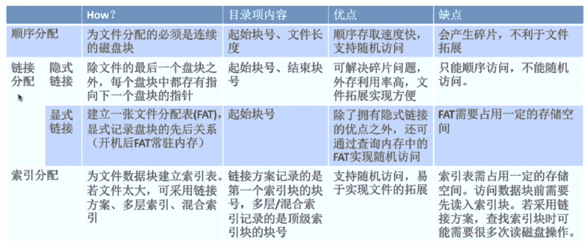

### Free-Space Management 磁盘空闲空间管理

#### 空闲表法

属于连续分配方式

优点

- 较高分配速度，减少访问磁盘的 I/O 频率

#### Bit Map 位示图

当前空闲的磁盘块记录在 super block 中


- 缺点
  - Bit map requires extra space

- 优点
  - Easy to get contiguous files
  - 简单


Example:		

block size = 212 bytes		
disk size = 230 bytes (1 gigabyte)		
n = 230/212 = 218 bits (or 32K bytes)

#### Linked list 链表法

- Linked list (free list) 空闲链表

  - Cannot get contiguous space easily 难以得到连续空间

  - But basically can work (FAT)

  - No waste of space

- Grouping 分组– a modification of the Linked List 成组链表法
  - Addresses of the n free blocks are stored in the first block. 
  - The first n-1 blocks are actually free. 
  - The last block contains addresses of another n free blocks
- Counting 计数
  - Address of the first free block and number n contiguous blocks 

#### Protect

Need to protect:

- Pointer to free list
- Bit map
  - Must be kept on disk
  - The copy in memory and disk may differ
  - Cannot allow for block [i] to have a situation where bit [i] = 1 in memory and bit [i] = 0 on disk

Solution:

- Set bit [i] = 1 in disk（1 代表空闲）
- deallocate block [i]
- Set bit [i] = 1 in memory

先更新磁盘再更新内存，保持数据一致性，避免 crash

### Efficiency and Performance

Efficiency dependent on:

- **disk allocation** and **directory** algorithms
- types of data kept in file’s directory entry (for example “last write date” is recorded in directory)
- Generally, every data item has to be considered for its effect.

Performance

- **disk cache** – separate section of main memory for frequently used blocks
- **free-behind and read-ahead** – techniques to optimize sequential access
- improve PC performance by dedicating section of memory as virtual disk, or RAM disk

#### Page Cache

A page cache caches **pages** rather than disk blocks using <span style="color:#CC0000;"> virtual memory </span> techniques

Memory-mapped I/O uses a page cache

Routine I/O through the file system uses the buffer (disk) cache

This leads to the following figure


#### Unified Buffer Cache

A unified buffer cache uses the same page cache to cache both **memory-mapped** pages and ordinary **file system I/O**

Avoids double caching

用一个统一的 buffer cache


## Mass-Storage Systems

> [!IMPORTANT]
>
> Time to access a disk block
>
> - seek time, rotational delay, transfer time
>
> 磁盘调度算法
>
> RAID concept


### Overview of Mass Storage Structure

#### Magnetic disks

Magnetic disks provide bulk of secondary storage of modern computers

Drives rotate at 60 to 200 times per secondTransfer rate is rate at which data flow between drive and computer

**Positioning time** (random-access time) is time to move disk arm to desired cylinder (seek time) and time for desired sector to rotate under the disk head (rotational latency)

Head crash results from disk head making contact with the disk surfaceThat’s bad

每秒转速 r，实际上

半径小（内圈）的和半径大的（外圈）存的数据大小一样


Disks can be removable

Drive attached to computer via **I/O bus**

Buses vary, including EIDE, ATA, SATA, USB, Fiber Channel, SCSIHost controller in computer uses bus to talk to disk controller built into drive or storage array


#### Nonvolatile Memory Devices

SSD uses NVM devices

Magnetic tape

### Disk

#### Disk Structure

Disk drives are addressed as large *1-dimensional arrays of logical blocks*, where the logical block is the smallest unit of transfer. 

- 主引导记录 Master Boot Record
  - 分区表
  - Boot control block (per volume) 引导块/启动卷

- Volume control block per volume (**superblock** in Unix) 超级块
- Directory structure per file system 目录
- Per-file FCB (**inode** in Unix) 文件控制块

- 文件系统空闲块息

- 其他所有目录和文件


SSD 固态硬盘

- 缺点：易磨损
- 基于闪存技术，随机读写速度高于磁盘（写 > 读）
- 有磨损均衡机制，目的是延长固态硬盘寿命
  - 静态磨损均衡算法通常比动态~表现更优秀

#### Disk Attachment

磁盘接口

Network-Attached Storage

#### Accessing a Disk Page


transfer time 和 rotational delay 和磁盘转速有关，转速越高，开销越小

旋转延迟

- Average rotational latency (half a rotation) 平均 1/2 个圈的延迟

- 与磁盘调度算法无关

- 取决于磁盘空间的分配程序

- 与文件的物理结构有关


主要目标是减少 seek time 以提高效率

- 寻道时间最长


寻道时间 $T_S=m\times n+s$，m 是与磁盘移动相关的常数，n 是跨越磁道数量，s 是启动磁头臂的时间

旋转延迟时间 $T_r = \frac{1}{2r}$，r 是磁盘的旋转速度

传输时间 $T_t=\frac{b}{rN}$，b 是每次读/写的字节数，N 是一个磁道上的字节数

总平均存取时间 $T_a=T_s+T_r+T_t$

#### Disk Scheduling

磁盘调度算法

Access time has two major components

- Seek time is the time for the disk are to move the heads to the cylinder containing the desired sector.
- Rotational latency is the additional time waiting for the disk to rotate the desired sector to the disk head.

Minimize seek time

Metric: Seek time ≈ seek distance

Several algorithms exist to schedule the servicing of disk I/O requests. 

We illustrate them with a request queue (0-199). 最外侧 0，最里层 199

Distance = 98-45 = 53 两个数相减就行

##### FCFS

先来先服务

- 会出现 zig zag

- 优点：公平性
- 平均寻道长度 =  总磁道数/移动次数

##### SSTF

shortest seek time first 最短寻道时间优先

- 每次调度与当前磁头最近的磁道

- 可能会产生饥饿现象 may cause starvation of some requests
- 性能比 FCFS 好


##### SCAN

扫描算法

The disk arm starts at one end of the disk, and moves toward the other end, servicing requests until it gets to the other end of the disk, where the head movement is reversed and servicing continues.

Sometimes called the elevator algorithm 电梯调度算法

- 规定了磁头移动方向，可避免饥饿

  - EG, [0, 200] 100, 160, 200, 90, 10

    

- 对最近扫描过的区域不公平，因此它在局部性方面不如 FCFS 和 SSTF

##### C-SCAN

循环扫描算法 circular-SCAN

Provides a more uniform wait time than SCAN.

The head moves from one end of the disk to the other, servicing requests as it goes.  When it reaches the other end, however, it immediately returns to the beginning of the disk, without servicing any requests on the return trip.

Treats the cylinders as a circular list that wraps around from the last cylinder to the first one.

- EG, [0, 200] 100, 160, 200, 0, 10, 90

  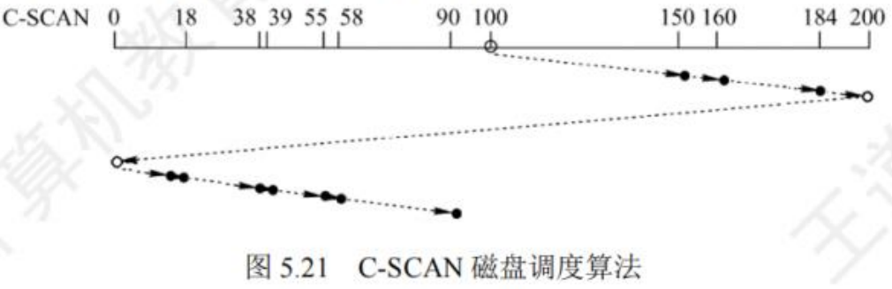

##### C-Look

改进 SCAN 和 C-SCAN，磁头只需要移动到最远端的一个请求即可返回，不需要到达磁盘端点


> Question: What scheduling algorithm is good for SSD（solid state disk，固态硬盘）? 
>
> - FCFS


#### Disk Management

**Low-level formatting**, or physical formatting — Dividing a disk into sectors that the disk controller can read and write.

To use a disk to hold files, the operating system still needs to record its own data structures on the disk.

- Partition the disk into one or more groups of cylinders.
- Logical formatting or “making a file system”.

Boot block initializes system.

- The *bootstrap* is stored in ROM.
- Bootstrap loader program.

Methods such as sector sparing used to handle bad blocks.

磁盘逻辑格式化程序

- 建立文件系统的根目录（逻辑格式化）
- 对保存空闲磁盘块信息的数据结构进行初始化

### Swap-Space Management

Swap-space — Virtual memory uses disk space as an extension of main memory.

Swap-space can be carved out of the normal file system, or, more commonly, it can be in a separate disk partition. 可以是文件也可以是分区

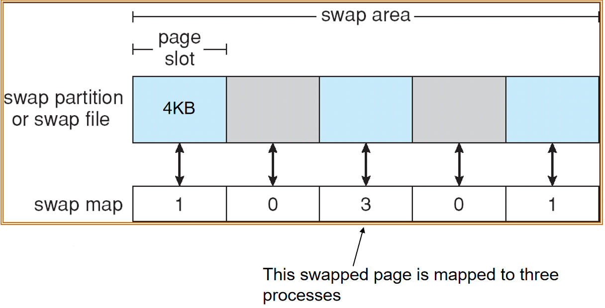


### RAID Structure

RAID：Redundant Arrays of Independent Disks 独立磁盘冗余阵列

RAID – multiple disk drives provides reliability via redundancy.

RAID is arranged into six different levels.


Disk **striping** uses a group of disks as one storage unit.

- Bit-level StripingBlock-level Striping 
- different blocks of a file are striped


### Stable-Storage Implementation

既可以顺序读写，也可以按任意次序读写的存储器

- U 盘、光盘、磁盘


## I/O Systems

> [!IMPORTANT]
>
> Explore the structure of an operating system’s I/O subsystem
>
> Discuss the principles of I/O hardware and its complexity
>
> Provide details of the performance aspects of I/O hardware and software
>
> Interrupts, DMA,
>
> 

### I/O Hardware Application 

Common concepts

- **Port** 端口
  - port addresses, used by Special I/O instructions & **Memory-mapped** I/O
  - Device control registers mapped into processor address space.
- **Bus** 总线 (daisy chain or shared direct access)
- **Controller** (host adapter) 控制器

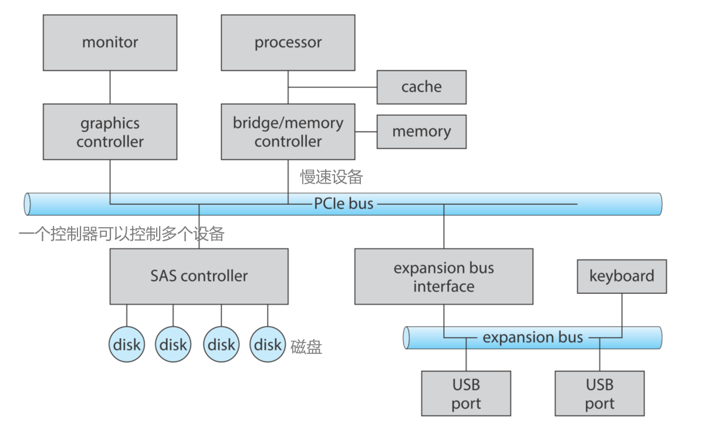

#### I/O Port Registers

**Data-in**: read by the host to get input

**Data-out**: written by the host to send output

- data in/out 是相对于 CPU 而言，从外部设备读取是 in，输出是 out

**Status** 状态寄存器: device status read by the host

**Control** 控制寄存器: written by the host to start a command or change the mode of a device

#### I/O controling methods

##### Polling

轮循——一种 I/O 控制方式

Repeated for each byte:


Determines state of device 

- command-ready
- busy
- Error

Busy-wait cycle in Step 1 to wait for I/O from device

> [!CAUTION]
>
> Repeatedly reading the status register until the busy bit becomes clear. <span style="color:#CC0000;"> Can be inefficient!! </span>

##### Interrupts

一种 I/O 控制方式

**CPU Interrupt-request line** triggered by I/O device

**Interrupt handler** 中断处理 receives interrupts

**Maskable** to ignore or delay some interrupts

Interrupt vector to dispatch interrupt to correct handler

- Based on priority
- Some nonmaskable
- Interrupt chaining: To handle more devices than interrupt vector elements. Handlers on each list are called one by one.

Interrupt mechanism also used for exceptions

EG，键盘 keyboard

----------------------------------

**Various Interrupt Processing** 其他中断处理过程

**Page fault**: saves the state of the process, moves it to the waiting queue, schedules another process to resume execution, then returns.

**Trap** (s/w interrupt): saves the state of user code, switches to supervisor mode. Low priority 低优先级

Low priority interrupt can be preempted by high priority ones. 低优先级中断能被高优先级中断抢占

Example usage: 

- high-priority handler records the I/O status, clears the device interrupt, starts the next pending I/O, and raises a low-priority interrupt to complete the work
- Later, the low-priority handlercompletes the user-level I/O by copying data from kernel buffers to the application space and calling the scheduler to place the application on the ready queue

##### Direct Memory Access

DMA 直接内存访问——一种 I/O 控制方式，是控制器

Used to avoid programmed I/O (可编程 I/O) for large data movement 

Requires DMA controller

需要 CPU 指出所取数据的地址与长度

优点

- Bypasses CPU to transfer data directly between I/O device and memory 绕过 CPU，直接在 I/O 设备和内存之间传输数据 --> CPU 和设备并行操作程度得到提升
- 数据传输以块为单位，CPU 介入的频率进一步降低


需要 4 类寄存器

- CR 命令寄存器
- MAR 内存地址寄存器
- DR 数据寄存器
- DC 数据计数器

#### Application I/O Interface 应用程序 I/O 接口

Devices vary in many dimensions

- Character-stream or block
- Sequential or random-access
- Sharable or dedicated
- Speed of operation
- read-write, read only, or write only

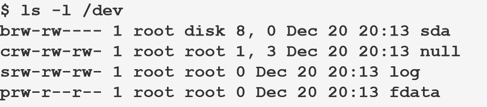

Permissions  Owner  Group  Major Device Number  Minor Device Number  Timestamp  Device  Name


用户程序对 I/O 设备的请求采用逻辑设备名。而程序执行时使用物理设备名，它们之间的转换是设备无关软件层完成的。主设备和从设备是总线仲裁中的概念。

#### I/O Devices

设备视为特殊的文件，可以使用文件名访问物理设备

**Block devices** 块设备 include disk drives

- Commands include read, write, seek 
- Raw I/O or file-system access 
- Memory-mapped file access possible 可寻址

**Character devices** 字符设备 include keyboards, mice, serial ports

- Commands include get, put
- Libraries layered on top allow line editing

Clocks and Timers

----------------

共享设备必须是可寻址和可随机访问的设备

将系统调用参数翻译成设备操作命令的工作由 *设备无关的 os 软件* 完成

向设备寄存器的写命令是在 I/O 软件的 *设备驱动程序* 中完成的


输入/输出软件一般从上到下分为 4 个层次：用户层、与设备无关的软件层、设备驱动程序及中断处理程序。与设备无关的软件层也就是系统调用的处理程序。


设备的独立性是指用户编程时使用的设备与实际使用的设备无关


#### Blocking and Nonblocking I/O

Blocking 阻塞式 I/O- process suspended until I/O completed

- Easy to use and understand
- Insufficient for some needs

Nonblocking 非阻塞式 I/O - I/O call returns as much as available

- User interface, data copy (buffered I/O)
- Implemented via multi-threading
- Returns quickly with count of bytes read or written

Asynchronous - process runs while I/O executes

- Difficult to use
- I/O subsystem signals process when I/O completed


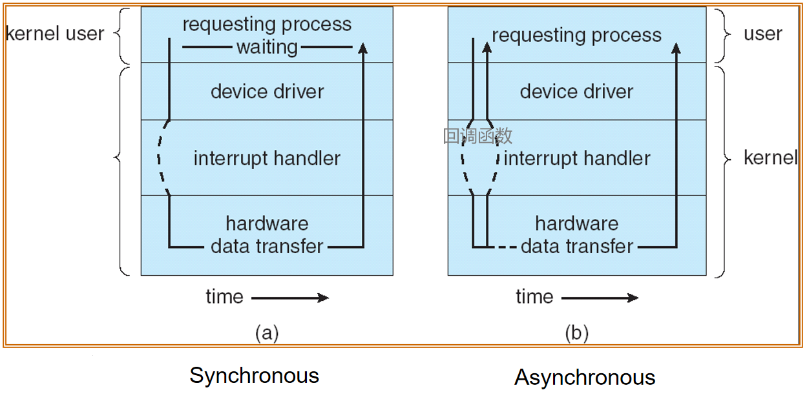

### Kernel I/O Interface 

#### Kernel I/O Subsystem

Device-status Table

##### **Scheduling** 调度

- Some I/O request ordering via per-device queue
  - E.g. disk scheduling
- Some OSs try fairness

##### Buffering

**Buffering** 缓存- store data in memory while transferring *between devices*

- To cope with device *speed mismatch*, e.g. receiving data from  modem to disk. 缓和 CPU 和 I/O 设备间速度不匹配的矛盾（通常 CPU 比 I/O 快）
  - Double buffering 双缓冲
- To cope with device transfer *size mismatch*, e.g. network packet
- To maintain “copy semantics” (when a write() system call specifies a buffer for storing the data, and modifies its contents after the system call)
- 减少磁盘 I/O 次数


T ：I/O 输入到缓冲区的时间
M：缓冲区传送到工作区时间
C：CPU 对数据的处理时间

单缓冲区平均处理每块数据的时间：$Max(C, T)+M$

双缓冲区平均处理每块数据的时间：$Max(C+T, M)$


循环缓冲

缓冲池

- 可供多个进程共享使用

##### Disk caching 磁盘高速缓存

**Caching** - fast memory holding copy of data

- Always just *a copy*
- Key to performance
- 软件机制
- 解决 I/O 比 CPU 慢很多的问题


高速缓存和缓冲区的对比

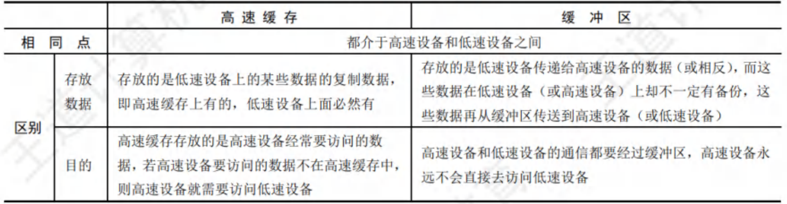

##### Spooling

**Spooling** 假脱机- hold output for a device

- If device can serve only one request at a time i.e., Printing
- 软件机制，需要外存、多道程序设计技术的支持
  - 大容量、高速度的外存作为输入井、输出井

- 提高 I/O 速度，独占设备改造成共享设备
- 以空间换时间
- 可以实现虚拟设备

通道技术

- 硬件机制

**Device reservation** - provides exclusive access to a device

- System calls for allocation and deallocation
- Watch out for deadlock

#### I/O Subsystem Transforming 

先分配设备，再分配设备控制器，最后分配通道


用户程序发出磁盘 I/O 请求后，

- 系统的处理流程是：用户程序 → 系统调用处理程序 → 设备驱动程序 → 中断处理程序

- 其中，计算数据所在磁盘的柱面号、磁头号、扇区号的程序是 **设备驱动程序**

  - 驱动程序与 I/O 控制方式有关

    初始化设备是由驱动程序控制完成的

    进程再执行驱动程序时可能进入阻塞态

    读/写设备的操作是由驱动程序控制完成的

  - 设备驱动程序处理顺序

    - 将抽象要求转化成具体要求 → 对服务请求进行校验 → 检查设备的状态 → 传送必要参数 → 启动 I/O 设备

#### I/O Requests to Hardware Operations

通道控制设备控制器，设备控制器控制设备工作

设备分配过程中，先后访问的数据结构为 SDT DCT COCT CHCT，设备、控制器、通道都要可用


Consider reading a file from disk for a process: 

- Determine device holding file MS-DOS uses the ‘c:’ disk id; Unix uses the mount table
- Translate name to device representation
- Physically read data from disk into buffer
- Make data available to requesting process
- Return control to process


#### Performance

**I/O** is a major factor in system performance:

- Demands CPU to execute device driver, kernel I/O code
- Context switches due to interrupts are heavy burden on CPU
- Data copying
- Network traffic especially stressful

改善磁盘 I/P 性能

- 重排 I/O 请求次序
- 预读和滞后写
- 优化文件物理块的分布

## Quiz & LAB

### quiz

make install  Linux /boot

~ home directory

struct task_struct

h✖ 10+200(1-h)=（1+0.5）✖100 

### lab

Linux 指令：ls, cp, ln, mv, echo, ....

**目录类**

1. **pwd**
    **作用**：显示当前工作目录的绝对路径。
    **示例**：

   ```bash
   $ pwd
   /home/user
   ```

2. **cd**
    **作用**：切换工作目录。
    **示例**：

   ```bash
   $ cd /etc
   $ pwd
   /etc
   ```

3. **ls**
    **作用**：列出指定目录下的文件和子目录。
    **常用选项**：

   - `-l`：详细信息格式。
   - `-a`：显示隐藏文件（以 `.` 开头的文件）。
      **示例**：

   ```bash
   $ ls -la
   ```

4. **ln**
    **作用**：创建文件的链接（硬链接或符号链接）。
    **示例**：

   - 创建符号链接：

     ```bash
     $ ln -s /path/to/original /path/to/link
     ```

   - 创建硬链接：

     ```bash
     $ ln /path/to/original /path/to/link
     ```

5. **.**
    **作用**：表示当前目录。
    **示例**：

   ```bash
   $ ls .
   ```

6. **..**
    **作用**：表示上级目录。
    **示例**：

   ```bash
   $ cd ..
   ```

7. **~**
    **作用**：表示当前用户的主目录。
    **示例**：

   ```bash
   $ cd ~
   ```

**权限类**

1. **chmod**
    **作用**：更改文件或目录的权限。
    **格式**：`chmod [选项] 权限 文件`
    **示例**：

   ```bash
   $ chmod 755 file
   ```

2. **chown**
    **作用**：更改文件或目录的所有者。
    **格式**：`chown [选项] 用户:组 文件`
    **示例**：

   ```bash
   $ chown user:group file
   ```

**解压类**

1. **tar**
    **作用**：创建和提取 tar 压缩包。
    **示例**：

   - 创建压缩包：

     ```bash
     $ tar -cvf archive.tar file1 file2
     ```

   - 解压压缩包：

     ```bash
     $ tar -xvf archive.tar
     ```

2. **gzip**
    **作用**：对文件进行压缩或解压缩（.gz 格式）。
    **示例**：

   - 压缩：

     ```bash
     $ gzip file
     ```

   - 解压：

     ```bash
     $ gzip -d file.gz
     ```

**搜索类**

1. **grep**
    **作用**：搜索文本内容。
    **示例**：

   ```bash
   $ grep "pattern" file
   ```

2. **find**
    **作用**：搜索文件或目录。
    **示例**：

   ```bash
   $ find . -name "*.h" -print
   ```

**设备类**

1. **mount**
    **作用**：挂载设备或文件系统。
    **示例**：

   ```bash
   $ mount /dev/sda1 /mnt
   ```

2. **umount**
    **作用**：卸载挂载的设备或文件系统。
    **示例**：

   ```bash
   $ umount /mnt
   ```

**进程类**

1. **ps**
    **作用**：查看系统中的进程。
    **示例**：

   ```bash
   $ ps aux
   ```

2. **top**
    **作用**：动态显示系统资源使用情况和进程信息。
    **示例**：

   ```bash
   $ top
   ```

3. **kill**
    **作用**：终止指定进程。
    **示例**：

   ```bash
   $ kill -9 PID
   ```

**文件类**

1. **echo**
    **作用**：输出字符串到终端或文件。
    **示例**：

   ```bash
   $ echo "Hello, World!" > file
   ```

2. **cat**
    **作用**：查看文件内容或合并文件。
    **示例**：

   ```bash
   $ cat file
   ```

3. **touch**
    **作用**：创建空文件或更新文件的时间戳。
    **示例**：

   ```bash
   $ touch file
   ```

4. **mkdir**
    **作用**：创建目录。
    **示例**：

   ```bash
   $ mkdir directory
   ```


实验指导书

trap 和系统调用

Linux 文件系统：FCB, inode, VFS structure

