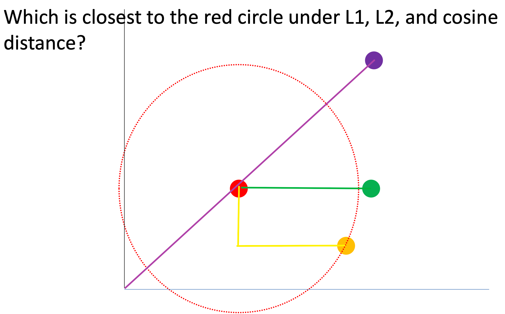
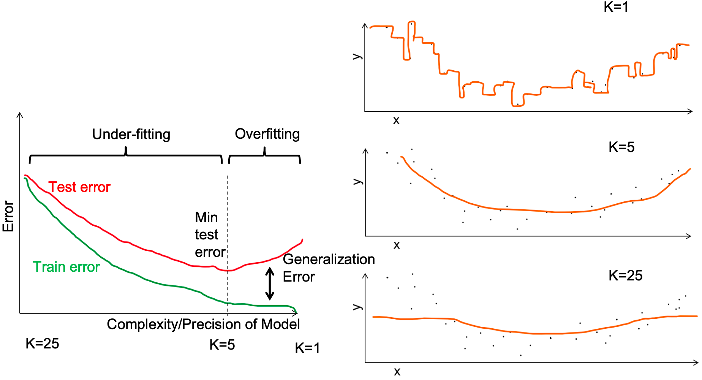
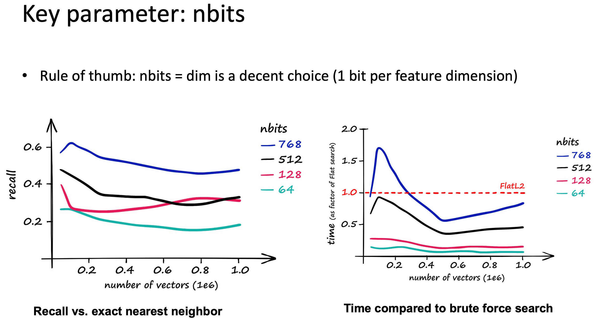
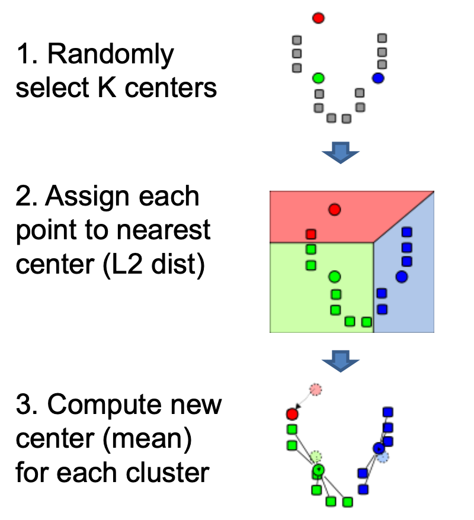
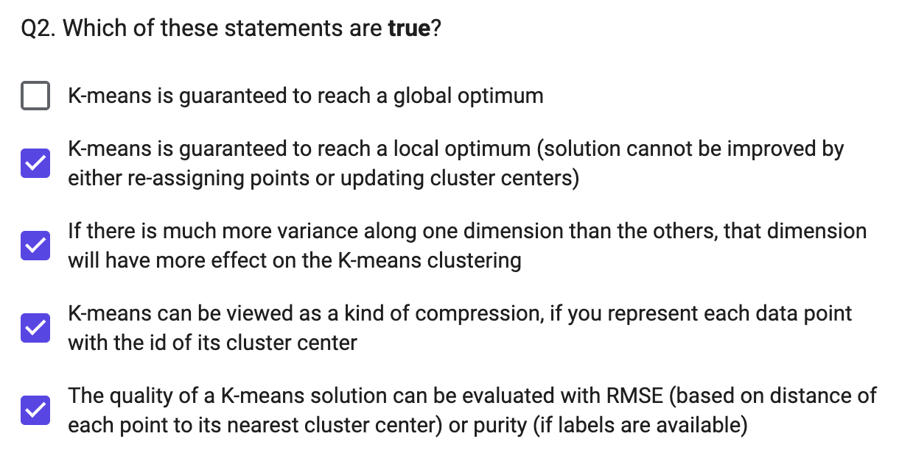

# CS441 Applied Machine Learning

## Lecture 1: Introduction

**Instructor:** Derek Hoiem

### A Brief History of AI/ML

**Early days (1950-1980)**

-   Turing's Imitation Game (1949)
-   Logic Theorist theorem prover (Newell & Simon, 1955)
-   The Perceptron (Rosenblatt, 1957) — at the time expected to lead to AGI
-   ELIZA chatbot (Weizenbaum, 1966)

**A few wins (1980-2010)**

-   USPS OCR for mail (1982)
-   Expert systems — first commercially successful AI (1980s)
-   Navlab5 self-driving car: drove ~2,848 miles, 98% autonomous, avg 64 mph (1995)
-   Deep Blue beats Kasparov at chess (1997)
-   Roomba (2002)
-   Face detection in digital cameras (2005)
-   Google Translate (2006)

**Deep learning / generative era (2012-now)**

-   CNNs dominate ImageNet Challenge (2012)
-   AlphaGo beats Lee Sedol at Go (2016)
-   ChatGPT public release (2022)
-   AI chatbots reach 1B+ weekly active users (2025)

**Older examples of "AI" imagination/history:**

-   Rabbi Loew's Golem (folklore)
-   Vaucanson's Automata (1738) — flute player, defecating duck, tambourine player
-   The Mechanical Turk (1770) — fake chess-playing machine, secretly operated by a human chess master; played against Benjamin Franklin and Napoleon
-   Babbage's Analytical Engine (1837, never fully built); Ada Lovelace wrote the first "computer program" for it in 1843 (calculating Bernoulli numbers)

### What Is Machine Learning?

Two components feed into a **Model**:

-   **Data**: collect, annotate, curate, format
-   **Design**: model architecture, loss function, training algorithm, evaluation design
-   These are refined in a **train/evaluate loop**.

**Traditional ML** → emphasis on Design (hand-crafted features + algorithm choice). **Deep ML (vision/text/audio)** → emphasis on Data (representations learned automatically).

Example: **Alexa speech recognition** improved mainly by scaling up *data collection* (people recording scripted speech), not by better algorithms.

#### General ML pipeline

Input data (text/images/audio; discrete or continuous; clean or noisy; few or many features/examples) → **Encoder** (manual features, deep nets, trees, clustering, kernels, etc.) → **Decoder** (linear/logistic regression, SVM, nearest neighbor, probabilistic model, clustering, embeddings, etc.) → **Prediction** (category, pixel labels, generated content, positions, yes/no) → compared to target labels via a **loss/feedback** signal that adjusts the model.

Two design questions:

1.  How do we encode information?
2.  How do we predict/decode it?

### Why Learn ML?

-   **Appreciate your own intelligence** — our identities are shaped by what we learn; building learning machines helps us understand our own learning.
-   **Learn to use ML to solve problems**: key concepts/methodologies, algorithm strengths/limitations, domain-specific representations, and how to pick the right tool for a job.
-   **Develop responsibly** — understand societal/individual impacts (recommender systems, surveillance, robots, smart assistants, text generation, autonomous cars, social media bots). Example cited: a Tesla crash photo, illustrating real-world stakes of autonomous systems.

### Course Content Roadmap (conceptual arc)

**I. Fundamentals of Learning**

-   Building classifiers/regressors from features; working with data
-   Instance-based methods (KNN), linear models, probabilistic methods, trees

**II. Deep Representation Learning**

-   Learning effective representations
-   Optimization, MLPs, CNNs, transformers, vision, language, foundation models

**III. Applications**

-   Ethics/impact, bias & fairness, building/deploying ML applications, reinforcement learning, audio/time-series

#### Conceptual questions driving each unit

-   **Instance-based methods:** How do we represent data as numbers? Given a new sample, how do we find similar examples and use them for prediction? How do we reduce dimensionality and visualize similarity?
-   **Linear models:** How do we learn a linear model — a weighted combination of features — to produce a score/prediction?
-   **Probabilistic methods:** How do we estimate the likelihood of a data sample and use it for prediction, grouping, or outlier detection?
-   **Trees/ensembles:** How do we learn rules from data and use them to vote on predictions?
-   **Neural networks:** How do we learn new representations of data using neural networks?
-   **Vision & language:** How do we learn to represent images and text together?
-   **Ethics/impact:** How do we understand AI's social/personal impact and develop responsibly?
-   **Applications (audio, RL):** How does ML get deployed in practice? What about other domains (audio) and methods (RL)?

### Datasets You'll Work With

-   Handwritten digits
-   City temperatures (predict next day)
-   Text messages (spam vs. not)
-   Salaries
-   Penguin measurements (predict species)
-   Images of pets and flowers (breed/species classification)
-   Your own data (final project)


## Lecture 2: K-Nearest Neighbor

Foundation of Learning: Association


We can change the structure of data to make it easier to process

Typically, we assume that all of the data samples within $X_{train}$ and $X_{test}$ come from the same

distribution and are independent of each other (called **i.i.d. = independent and identically**

**distributed**). That means, e.g., that $x_0$ does not tell us anything about $x_1$ if we already know

the sampling distribution $D$


Machine learning model maps from features to prediction


Nearest neighbor algorithm

```python
def nearest_neighbour_classfier(X_query, X_train, y_train):
  
```

KNN: **Increasing K** gives a **smoother decision boundary** (less sensitive to unusual data points)


Simple: an excellent baseline and sometimes hard to beat 

- Higher K gives smoother functions 

- Can work with only one example per class 

- Naturally scales with data: can work very well if you have a very large trainingset

Naïve implementations are slow, but fast retrieval methods are available

(as we’ll see in Lecture 4)

No training time (other than storing/indexing examples)

With infinite examples, 1-NN provably has error that is at most twice Bayes optimal error (but we never have infinite examples)

$$\hat{y} = \frac{1}{K}\sum_{k=1}^{K} y_{(k)}$$

Measure and analyze classification performance

-   Classification error: $err(X) = \frac1N\sum_if(x_i) \neq y_i$
    -   Percent of examples that are wrongly predicted

-   $acc(X)=1-err(X)$


Performance measures are an estimate

E.g., suppose we have 1,000 training samples and measure anerror rate of 8% on 100 test samples. 

\- With a different set of test samples, we **expect** to see the same error rate, but it could **vary**

\- With a different set of the same number of training samples, we also expect to see the same error rate, but with variance

\- If we increase the number of test samples, the expected test error doesn’t change, but the variance in the estimate decreases

\- If we increase the number of training samples, the expected test error will be lower


### Summary

Key Assumptions

- Samples with similar input features will have similar output predictions 

- Depending on distance measure, may assume all dimensions are equally important

Model Parameters

- Features and predictions of the training set

Designs

-   K (number of nearest neighbors to use for prediction) 

-   How to combine multiple predictions if K > 1

- Feature design (selection, transformations) 

- Distance function (e.g. L2, L1, Mahalanobis)

When to Use

- Few examples per class, many classes 

- Features are all roughly equally important 

- Training data available for prediction changes frequently 

- Can be applied to classification or regression, with discrete or continuous features 

- Most powerful when combined with feature learning

When Not to Use

- Many examples are available per class (feature learning with linear classifier may be better) 

- Limited storage (cannot store many training examples) 

- Limited computation (linear model may be faster to evaluate)


## Lecture 3: KNN Regression and Generalization

In machine learning, we have 

**Sample**: a data point, such as a feature vector and label corresponding to the input and desired output of the model 

**Dataset**: a collection of samples 

**Training set**: a dataset used to train the model 

**Validation set**: a dataset used to select which model to use or compare variants and manually set parameters 

**Test set**: a dataset used to evaluate the final model


L2, L1 distance

Dot product

Cosine similarity




measure

Root mean squared error

Mean absolute error

**RMSE/MAE** are unit-dependent measures of accuracy, while R2 is a unitless measure of the fraction of explained variance

```python
def regress_KNN(X_query, X_train, y_train, K):
# (1) Compute distances between X_query and each sample in X_train
# (2) Get the K_smallest_idx: K indices corresponding to smallest distances(e.g. use np.argsort)
# (3) Return the mean of y_train[K_smallest_idx]
def RMSE(y_pred, y_true):
	return np.sqrt(np.mean((y_pred-y_true)**2))
Testing procedure:
# Get y_pred[i] = regressKNN(X_test[i], X_train,y_train, K) for each ith sample in X_test
# measure error: err = RMSE(y_pred, y_test)
```


Error and Bias Variance Trade-off

Test error is composed of 

– Irreducible error (perfect prediction not possible given features) 

– Bias (model cannot perfectly fit the true function) 

– Variance (parameters cannot be perfectly learned from training data)



Generalization error: test error – training error * (This is the course definition. Sometimes generalization error is defined as the test error.)

 If we increase K in K-NN:

-   Variance 🔽
-   Generalization error 🔽
-   training error 🔼

I plot training error and validation error as I change one of the hyperparameters of my model (e.g. K). I see signs of **overfitting** when <u>Validation error starts to rise</u>


## Retrieval and Clustering

FAISS library makes even brute-force search very fast

Approximate search

-   Locality Sensitive Hashing (LSH)

Basic LSH process 

1.   Convert each data point into an array of bits, using the same conversion process/parameters for each 

2.   Map the arrays into buckets (e.g. with 10 bits, you have 2^10 buckets) 

     – Can use subsets of arrays to create multiple sets of buckets 

3.   On query, return points in the same bucket(s) 

     – Can check additional buckets by flipping bits to find points within hash distances greater than 0


Random Projection LSH




Clustering

-   Assign a label to each data point based on the similarities between points
-   Why cluster 
    -   Represent data point with a single integer instead of a floating point vector 
        -   Saves space 
        -   Simple to count and estimate probability 
    -   Discover trends in the data 
    -   Make predictions based on groupings


K-means algorithm

聚类算法

```python
kmeans(X, K, maxiter)
  # Create cluster centers
  center = X[:K].copy()
  Until maxiter iterations or convergence:
    For each nth sample in X:
    # get index of nearest center
      idx[n] = get_nearest(X[n], centers)
    For each kth center:
    # get mean of data points assigned to cluster k
      center[k] = X[idx==k].mean(axis=0)
  	Convergence is if no idx changed in this iteration
  return center, idx
```



1.   Choose $K$ initial centroids.
2.   Assign each data point to the nearest centroid.
3.   Recompute each centroid as the mean of the points assigned to it.
4.   Repeat steps 2–3 until assignments stop changing much.

Disadvantage

-   All feature dimensions have equal weight 
-   Tends to break data into clusters of similar numbers of points (can be good or bad)
-   Does not take into account any local structure 
-   Typically, no easy way to choose K 
-   Can be slow if the number of data points and clusters is large

RMSE = root mean squared error

Evaluating clusters with purity

-   Purity is the count of data points with the most common label in each cluster, divided by the total number of data points (N)



Hierarchical K-means

-   Iteratively cluster points into K groups, then cluster each group into K groups

Advantages

-   Fast cluster training
-   Fast lookup,  Find cluster number in $O(log(K)*D)$ vs. $O(K*D)$


Agglomerative clustering

-   Finding structures in the data (image segmentation, grouping camera locations together)
