# CS441 Applied Machine Learning

## Lecture 1: Introduction

**Instructor:** Derek Hoiem

### A Brief History of AI/ML

**Early days (1950-1980)**

-   Turing's Imitation Game (1949)
-   Logic Theorist theorem prover (Newell & Simon, 1955)
-   The Perceptron (Rosenblatt, 1957) — at the time expected to lead to AGI
-   ELIZA chatbot (Weizenbaum, 1966)

**A few wins (1980-2010)**

-   USPS OCR for mail (1982)
-   Expert systems — first commercially successful AI (1980s)
-   Navlab5 self-driving car: drove ~2,848 miles, 98% autonomous, avg 64 mph (1995)
-   Deep Blue beats Kasparov at chess (1997)
-   Roomba (2002)
-   Face detection in digital cameras (2005)
-   Google Translate (2006)

**Deep learning / generative era (2012-now)**

-   CNNs dominate ImageNet Challenge (2012)
-   AlphaGo beats Lee Sedol at Go (2016)
-   ChatGPT public release (2022)
-   AI chatbots reach 1B+ weekly active users (2025)

**Older examples of "AI" imagination/history:**

-   Rabbi Loew's Golem (folklore)
-   Vaucanson's Automata (1738) — flute player, defecating duck, tambourine player
-   The Mechanical Turk (1770) — fake chess-playing machine, secretly operated by a human chess master; played against Benjamin Franklin and Napoleon
-   Babbage's Analytical Engine (1837, never fully built); Ada Lovelace wrote the first "computer program" for it in 1843 (calculating Bernoulli numbers)

### What Is Machine Learning?

Two components feed into a **Model**:

-   **Data**: collect, annotate, curate, format
-   **Design**: model architecture, loss function, training algorithm, evaluation design
-   These are refined in a **train/evaluate loop**.

**Traditional ML** → emphasis on Design (hand-crafted features + algorithm choice). **Deep ML (vision/text/audio)** → emphasis on Data (representations learned automatically).

Example: **Alexa speech recognition** improved mainly by scaling up *data collection* (people recording scripted speech), not by better algorithms.

#### General ML pipeline

Input data (text/images/audio; discrete or continuous; clean or noisy; few or many features/examples) → **Encoder** (manual features, deep nets, trees, clustering, kernels, etc.) → **Decoder** (linear/logistic regression, SVM, nearest neighbor, probabilistic model, clustering, embeddings, etc.) → **Prediction** (category, pixel labels, generated content, positions, yes/no) → compared to target labels via a **loss/feedback** signal that adjusts the model.

Two design questions:

1.  How do we encode information?
2.  How do we predict/decode it?

### Why Learn ML?

-   **Appreciate your own intelligence** — our identities are shaped by what we learn; building learning machines helps us understand our own learning.
-   **Learn to use ML to solve problems**: key concepts/methodologies, algorithm strengths/limitations, domain-specific representations, and how to pick the right tool for a job.
-   **Develop responsibly** — understand societal/individual impacts (recommender systems, surveillance, robots, smart assistants, text generation, autonomous cars, social media bots). Example cited: a Tesla crash photo, illustrating real-world stakes of autonomous systems.

### Course Content Roadmap (conceptual arc)

**I. Fundamentals of Learning**

-   Building classifiers/regressors from features; working with data
-   Instance-based methods (KNN), linear models, probabilistic methods, trees

**II. Deep Representation Learning**

-   Learning effective representations
-   Optimization, MLPs, CNNs, transformers, vision, language, foundation models

**III. Applications**

-   Ethics/impact, bias & fairness, building/deploying ML applications, reinforcement learning, audio/time-series

#### Conceptual questions driving each unit

-   **Instance-based methods:** How do we represent data as numbers? Given a new sample, how do we find similar examples and use them for prediction? How do we reduce dimensionality and visualize similarity?
-   **Linear models:** How do we learn a linear model — a weighted combination of features — to produce a score/prediction?
-   **Probabilistic methods:** How do we estimate the likelihood of a data sample and use it for prediction, grouping, or outlier detection?
-   **Trees/ensembles:** How do we learn rules from data and use them to vote on predictions?
-   **Neural networks:** How do we learn new representations of data using neural networks?
-   **Vision & language:** How do we learn to represent images and text together?
-   **Ethics/impact:** How do we understand AI's social/personal impact and develop responsibly?
-   **Applications (audio, RL):** How does ML get deployed in practice? What about other domains (audio) and methods (RL)?

### Datasets You'll Work With

-   Handwritten digits
-   City temperatures (predict next day)
-   Text messages (spam vs. not)
-   Salaries
-   Penguin measurements (predict species)
-   Images of pets and flowers (breed/species classification)
-   Your own data (final project)


## Lecture 2: K-Nearest Neighbor

Foundation of Learning: Association


We can change the structure of data to make it easier to process

Typically, we assume that all of the data samples within $X_{train}$ and $X_{test}$ come from the same

distribution and are independent of each other (called **i.i.d. = independent and identically**

**distributed**). That means, e.g., that $x_0$ does not tell us anything about $x_1$ if we already know

the sampling distribution $D$


Machine learning model maps from features to prediction


Nearest neighbor algorithm

```python
def nearest_neighbour_classfier(X_query, X_train, y_train):
  
```

KNN: **Increasing K** gives a **smoother decision boundary** (less sensitive to unusual data points)


Simple: an excellent baseline and sometimes hard to beat 

- Higher K gives smoother functions 

- Can work with only one example per class 

- Naturally scales with data: can work very well if you have a very large trainingset

Naïve implementations are slow, but fast retrieval methods are available

(as we’ll see in Lecture 4)

No training time (other than storing/indexing examples)

With infinite examples, 1-NN provably has error that is at most twice Bayes optimal error (but we never have infinite examples)

$$\hat{y} = \frac{1}{K}\sum_{k=1}^{K} y_{(k)}$$

Measure and analyze classification performance

-   Classification error: $err(X) = \frac1N\sum_if(x_i) \neq y_i$
    -   Percent of examples that are wrongly predicted

-   $acc(X)=1-err(X)$


Performance measures are an estimate

E.g., suppose we have 1,000 training samples and measure anerror rate of 8% on 100 test samples. 

\- With a different set of test samples, we **expect** to see the same error rate, but it could **vary**

\- With a different set of the same number of training samples, we also expect to see the same error rate, but with variance

\- If we increase the number of test samples, the expected test error doesn’t change, but the variance in the estimate decreases

\- If we increase the number of training samples, the expected test error will be lower


### Summary

Key Assumptions

- Samples with similar input features will have similar output predictions 

- Depending on distance measure, may assume all dimensions are equally important

Model Parameters

- Features and predictions of the training set

Designs

-   K (number of nearest neighbors to use for prediction) 

-   How to combine multiple predictions if K > 1

- Feature design (selection, transformations) 

- Distance function (e.g. L2, L1, Mahalanobis)

When to Use

- Few examples per class, many classes 

- Features are all roughly equally important 

- Training data available for prediction changes frequently 

- Can be applied to classification or regression, with discrete or continuous features 

- Most powerful when combined with feature learning

When Not to Use

- Many examples are available per class (feature learning with linear classifier may be better) 

- Limited storage (cannot store many training examples) 

- Limited computation (linear model may be faster to evaluate)


## Lecture 3: KNN Regression and Generalization

In machine learning, we have 

**Sample**: a data point, such as a feature vector and label corresponding to the input and desired output of the model 

**Dataset**: a collection of samples 

**Training set**: a dataset used to train the model 

**Validation set**: a dataset used to select which model to use or compare variants and manually set parameters 

**Test set**: a dataset used to evaluate the final model


L2, L1 distance

Dot product

Cosine similarity

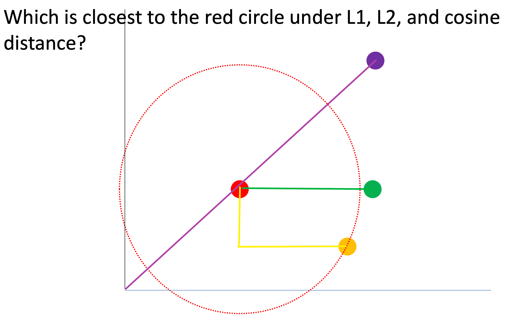


measure

Root mean squared error

Mean absolute error

**RMSE/MAE** are unit-dependent measures of accuracy, while R2 is a unitless measure of the fraction of explained variance

```python
def regress_KNN(X_query, X_train, y_train, K):
# (1) Compute distances between X_query and each sample in X_train
# (2) Get the K_smallest_idx: K indices corresponding to smallest distances(e.g. use np.argsort)
# (3) Return the mean of y_train[K_smallest_idx]
def RMSE(y_pred, y_true):
	return np.sqrt(np.mean((y_pred-y_true)**2))
Testing procedure:
# Get y_pred[i] = regressKNN(X_test[i], X_train,y_train, K) for each ith sample in X_test
# measure error: err = RMSE(y_pred, y_test)
```


Error and Bias Variance Trade-off

Test error is composed of 

– Irreducible error (perfect prediction not possible given features) 

– Bias (model cannot perfectly fit the true function) 

– Variance (parameters cannot be perfectly learned from training data)

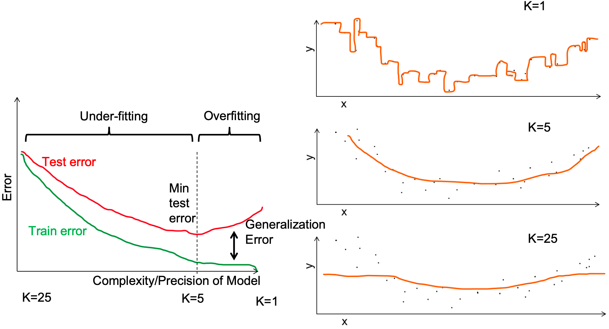

Generalization error: test error – training error * (This is the course definition. Sometimes generalization error is defined as the test error.)

 If we increase K in K-NN:

-   Variance 🔽
-   Generalization error 🔽
-   training error 🔼

I plot training error and validation error as I change one of the hyperparameters of my model (e.g. K). I see signs of **overfitting** when <u>Validation error starts to rise</u>


## Retrieval and Clustering

FAISS library makes even brute-force search very fast

Approximate search

-   Locality Sensitive Hashing (LSH)

Basic LSH process 

1.   Convert each data point into an array of bits, using the same conversion process/parameters for each 

2.   Map the arrays into buckets (e.g. with 10 bits, you have 2^10 buckets) 

     – Can use subsets of arrays to create multiple sets of buckets 

3.   On query, return points in the same bucket(s) 

     – Can check additional buckets by flipping bits to find points within hash distances greater than 0


Random Projection LSH

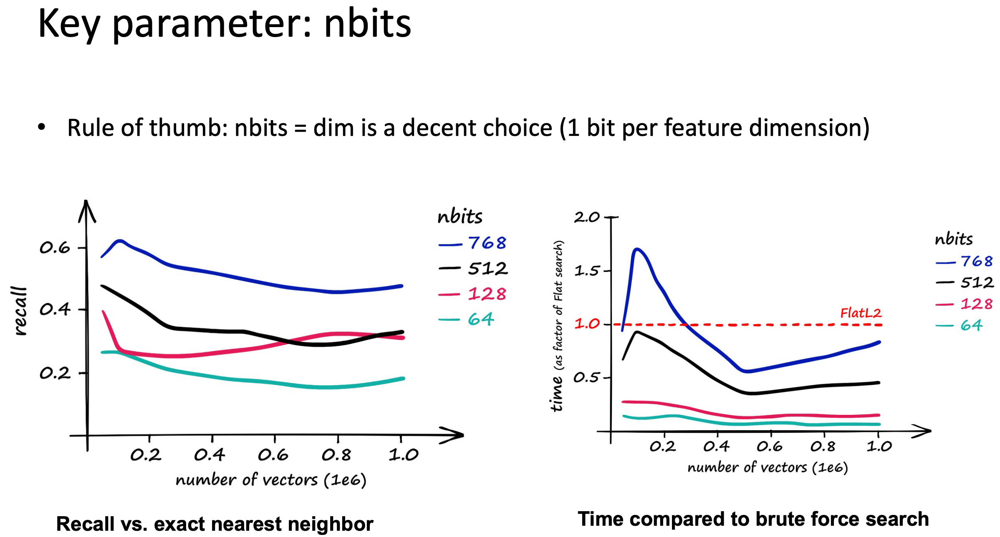


Clustering

-   Assign a label to each data point based on the similarities between points
-   Why cluster 
    -   Represent data point with a single integer instead of a floating point vector 
        -   Saves space 
        -   Simple to count and estimate probability 
    -   Discover trends in the data 
    -   Make predictions based on groupings


K-means algorithm

聚类算法

```python
kmeans(X, K, maxiter)
  # Create cluster centers
  center = X[:K].copy()
  Until maxiter iterations or convergence:
    For each nth sample in X:
    # get index of nearest center
      idx[n] = get_nearest(X[n], centers)
    For each kth center:
    # get mean of data points assigned to cluster k
      center[k] = X[idx==k].mean(axis=0)
  	Convergence is if no idx changed in this iteration
  return center, idx
```

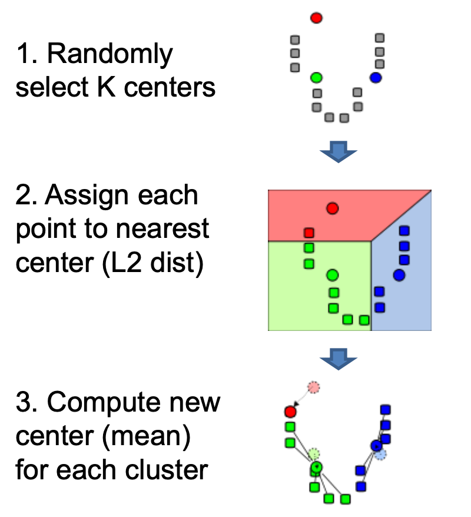

1.   Choose $K$ initial centroids.
2.   Assign each data point to the nearest centroid.
3.   Recompute each centroid as the mean of the points assigned to it.
4.   Repeat steps 2–3 until assignments stop changing much.

Disadvantage

-   All feature dimensions have equal weight 
-   Tends to break data into clusters of similar numbers of points (can be good or bad)
-   Does not take into account any local structure 
-   Typically, no easy way to choose K 
-   Can be slow if the number of data points and clusters is large

RMSE = root mean squared error

Evaluating clusters with purity

-   Purity is the count of data points with the most common label in each cluster, divided by the total number of data points (N)

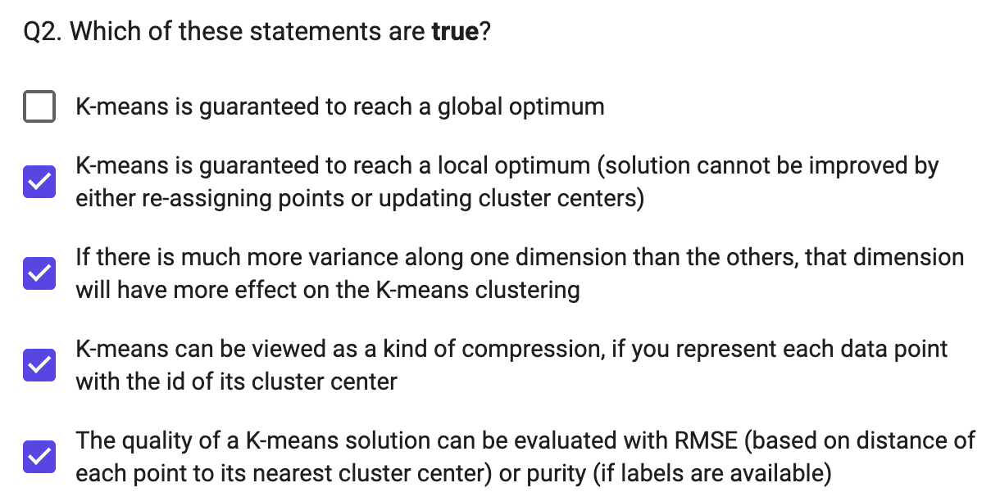


#### Hierarchical K-means

-   Iteratively cluster points into K groups, then cluster each group into K groups

Advantages

-   Fast cluster training
-   Fast lookup,  Find cluster number in $O(log(K)*D)$ vs. $O(K*D)$


#### Agglomerative clustering

-   Finding structures in the data (image segmentation, grouping camera locations together)


## Lecture 5: Dimensionality Reduction: PCA and low-D embeddings

Goal: We want to represent high dimensional data with fewer dimensions

-   Compression: reduced storage, faster retrieval
-   Visualization: plot in two dimensions

A good dimensionality reduction can be defined in different ways

-   Be able to reproduce the original data 
-   Preserve discriminative features
-   Preserve the neighborhood structure


**PCA**: Principal Component Analysis

Preserving variance (minimizing MSE) *does not* necessarily lead to perceptually good reconstruction.

-   Key optimality guarantee of PCA: among *all* possible N-dimensional linear projections, the top N principal components are the ones that retain the most total variance.


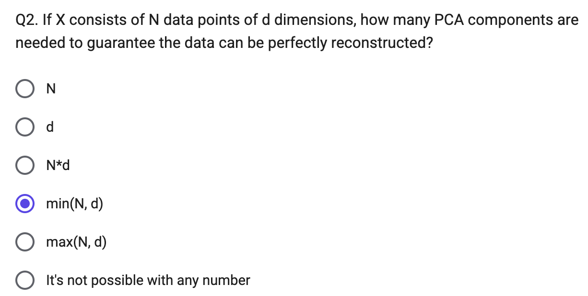

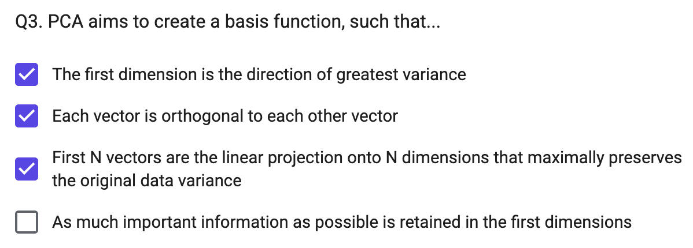

orthogonal正交

#### Key linear algebra terms (for PCA)

-   **Vector**: can represent a data point **x**, or a **projection** direction **w**. $\mathbf{w}^T\mathbf{x}$ projects data point **x** onto the axis defined by **w** (e.g. $w=[1,0]^T$ selects the first coordinate of x; $w=[1,1]^T$ adds the two coordinates)
-   **Matrix**: can represent a set of data points, or a set of projection vectors
-   **Translation**: adds a constant to each coordinate, e.g. centering $\mathbf{x}_c = \mathbf{x}-\mu_x$
-   **Scaling**: multiplies each coordinate by a constant (a diagonal matrix)
-   **Rotation**: a set of projections that preserves distances between points and distances to the origin; each row/column is a **basis vector** with unit norm, mutually orthogonal ($r_i^Tr_i=1,\ r_i^Tr_j=0$)
-   **Rank** of matrix $M$: number of linearly independent rows/columns of $M$; $Rank(M) \le \min(\text{rows},\text{columns})$
-   **Eigenvector** $v$ / **eigenvalue** $\lambda$ of $M$: defined by $Mv=\lambda v$
-   **SVD** (singular value decomposition): $A=U\Sigma V^T$
    -   Columns of $U$ = eigenvectors of $AA^T$
    -   Columns of $V$ = eigenvectors of $A^TA$
    -   $\Sigma$ = diagonal matrix of singular values = square roots of the eigenvalues of both $AA^T$ and $A^TA$

#### PCA — formal derivation

Given a point set ${\mathbf{p}*j}*{j=1...P}$ in an $M$-dim space, PCA finds a basis such that the most variation is in the first basis vector, the second-most in the second vector (orthogonal to the first), etc.

Projection onto direction $\mathbf{u}$ (data mean $\mu$): $u(\mathbf{x}_i) = \mathbf{u}^T(\mathbf{x}_i-\mu)$

Find the unit direction $\mathbf u$ ($\lVert\mathbf u\rVert=1$) that **maximizes variance of the projected data**:

$$\text{maximize}\quad \frac1N\sum_{i=1}^N \mathbf{u}^T(\mathbf{x}_i-\mu)(\mathbf{u}^T(\mathbf{x}_i-\mu))^T = \mathbf{u}^T\Sigma\mathbf{u},\qquad \Sigma=\frac1N\sum_i(\mathbf{x}_i-\mu)(\mathbf{x}_i-\mu)^T\ (\text{covariance matrix})$$

-   The maximizing direction = **eigenvector of $\Sigma$ with the largest eigenvalue** (derivable via Rayleigh quotient / Lagrange multiplier)
-   The first $r<M$ principal components give the $r$-dim linear basis that minimizes MSE of reconstructing the original points

**Choosing subspace dimension $r$**: plot eigenvalues $\lambda_j$ vs. $j$ — larger $r$ → lower expected reconstruction error, with diminishing returns once eigenvalues flatten out

```python
\# PCA components as eigenvectors of the covariance matrix

x_mu = np.mean(X, axis=0)

X_cov = np.matmul((X-x_mu).transpose(), X-x_mu) / X.shape[0]

[lam, v] = np.linalg.eig(X_cov)

\# Equivalent, using sklearn (eigenvalues == explained_variance_)

from sklearn.decomposition import PCA

pca_transform = PCA().fit(X)
```

#### Eigenfaces — PCA applied to face images

-   Input: $\mathbf{x}_1,...,\mathbf{x}_N$ = pixel values of aligned face images
-   PCA gives a mean face $\mu$ and top eigenvectors $u_1,...,u_k$ ("**eigenfaces**")
-   Visualize the appearance variation each component captures: $\mu \pm 3\sigma_k u_k$
-   Represent a face **x** in "face space" coordinates: $\mathbf{x}\rightarrow[u_1^T(\mathbf{x}-\mu),...,u_k^T(\mathbf{x}-\mu)]=w_1,...,w_k$
-   Reconstruction: $\hat{\mathbf{x}} = \mu + w_1u_1+w_2u_2+w_3u_3+...$
-   More components $P$ used → better reconstruction (e.g. 400 ORL faces: $P=4$ very blurry → $P=200$ recognizable → $P=400$ near-original)
-   Note: preserving variance (minimizing MSE) does *not* necessarily give a perceptually good reconstruction — even at $P=200$ faces can look "smoothed"/off even though most variance is captured
-   Same pattern seen reconstructing MNIST digits (e.g. "4"s) with increasing #components; can plot cumulative % variance explained vs. #components to help decide how many to keep

**MultiDimensional Scaling (MDS)**

-   For all data points, solve for new coordinate positions(lower dimensions) that preserve some input set of pairwise distances

-   Solve for new coordinates **y** minimizing $\sum_{ij}\left(D^{(2)}*{ij}(\mathbf{x})-D^{(2)}*{ij}(\mathbf{y})\right)^2$, where $D^{(2)}_{ij}(\mathbf{x})=(\mathbf{x}_i-\mathbf{x}_j)^T(\mathbf{x}_i-\mathbf{x}_j)$
-   Classic case (Euclidean distance) has a **closed-form solution**; more generally distance can be defined arbitrarily (e.g. from user surveys)
-   Drawback: the solution is most influenced by points that are far from each other
-   In practice often pre-process with PCA (e.g. reduce to ~30 dims) before running MDS, for speed and cleaner structure

**Non-metric MDS**

-   Optimizes point positions so Euclidean distance preserves only the *ordering* of input pairwise distances (not the distances themselves) — needs only a ranking of dissimilarities
-   Slower, since this is a more complicated optimization

-   Compute an adjacency graph (e.g. connect each point to its 5 nearest neighbors); distance between two points = shortest path in that graph (captures manifold/"geodesic" distance rather than straight-line distance)

**t-SNE**

-   Map to 2 or 3 dimensions while preserving similarities of nearby points
-   For $i\neq j$: $p_{j|i}=\dfrac{\exp(-\lVert\mathbf{x}*i-\mathbf{x}j\rVert^2/2\sigma_i^2)}{\sum{k\neq i}\exp(-\lVert\mathbf{x}i-\mathbf{x}k\rVert^2/2\sigma_i^2)}$, $\ p{ij}=\dfrac{p{j|i}+p*{i|j}}{2N}$ (similarity in original space), and $q_{ij}=\dfrac{(1+\lVert\mathbf{y}_i-\mathbf{y}*j\rVert^2)^{-1}}{\sum_k\sum*{l\neq k}(1+\lVert\mathbf{y}_k-\mathbf{y}_l\rVert^2)^{-1}}$ (similarity in new coords)
-   Steps: (1) assign probability $p_{ij}$ that pairs of points are similar (Gaussian-weighted distance), (2) define similarity $q_{ij}$ in new coordinates, (3) minimize $KL(P\Vert Q)=\sum_{i\neq j}p_{ij}\log\frac{p_{ij}}{q_{ij}}$ via gradient descent
-   In high dimensions each point tends to be similarly distant from many other points, so PCA (e.g. to ~30 dims) is usually applied before t-SNE

**UMAP**

-   Assumes data is uniformly distributed on an underlying manifold that is locally connected
-   Goal is to preserve that *local structure*
-   Hyperparameters: number of neighbors to consider, dimension of target embedding, desired separation between close points, number of training epochs
-   Much faster than t-SNE/IsoMap on large datasets with comparable or better cluster separation (e.g. MNIST 70000×784: UMAP ~87s vs. t-SNE ~1450s; IsoMap doesn't scale well to very large N)

**Comparison** (toy 3D "S-curve" manifold, and on MNIST)

-   IsoMap best preserves the global manifold ("unrolls" the S-curve cleanly); MDS partially unrolls with distortion; t-SNE separates local neighborhoods well but destroys the global shape
-   On MNIST: PCA gives the most-overlapping digit clusters (it's linear); MDS/IsoMap give moderate separation; t-SNE typically gives the tightest, most separated digit clusters

Things to remember

-   PCA reduces dimensions by linear projection
    -   Preserves variance to reproduce data as well as possible, according to mean squared error 
    -   May not preserve local connectivity structure or discriminative information
-   Other methods try to preserve relationships between points
    -   MDS: preserve pairwise distances
    -   IsoMap: MDS but using a graph-based distance
    -   t-SNE: preserve a probabilistic distribution of neighbors for each point (also focusing on closest points) 
    -   UMAP: incorporates k-nn structure, spectral embedding, and more to achieve good embeddings relatively quickly


## Linear Regression and Regularization

### Linear models

-   A model is **linear** in **x** if it's a weighted sum of the values of x (optionally plus a constant): $\mathbf{w}^T\mathbf{x}+b=\left[\sum_i w_ix_i\right]+b$
-   A **linear classifier** projects features onto a score indicating the class (boundary drawn where score = 0)
-   A **linear regressor** finds a linear model approximating the prediction (target) value for each set of features

### Fitting and evaluating linear regression

-   Fit linear coefficients to features to predict a continuous variable
-   $R^2$ measures the fraction of variance explained (unitless): $R^2 = 1-\dfrac{\sum_i(f(X_i)-y_i)^2}{\sum_i(y_i-\bar y)^2}$
    -   $R^2$ close to 0 → very weak relationship; close to 1 → y is very linearly predictable from **x**
    -   (RMSE/MAE are unit-dependent accuracy measures; $R^2$ is unitless)

### Training linear regression (closed form)

Model/prediction: $\mathbf{w}^T[\mathbf{x}_n;1]=y_n^w$ — predicted y is linear in x plus a constant "bias" term (if predicting multiple outputs, use a separate **w** for each)

Training (least squares) — minimize squared error between predicted and true values:

$$\mathbf{w}^*=\arg\min_{\mathbf w}\sum_{n=0}^N\left(\mathbf{w}^T[\mathbf{x}*n;1]-y_n\right)^2 = \arg\min*{\mathbf w}(X\mathbf{w}-\mathbf y)^T(X\mathbf{w}-\mathbf y)$$

-   Stack features/targets into matrix $X$ ($N\times m$) and vector $\mathbf y$ ($N\times1$); want $X\mathbf w\approx \mathbf y$ in the least-squared sense
-   Closed-form solution (pseudoinverse): $\mathbf{w}=X^\dagger\mathbf y=(X^TX)^{-1}X^T\mathbf y$

**The basic idea**

Normally, linear regression just minimizes prediction error (e.g., squared error between predictions and true y values). Regularization adds an extra penalty term that discourages the weights from getting too large, which helps prevent overfitting. The two common penalty types are:

**L1 regularization (Lasso)**

Penalty term: **λ · Σ|wᵢ|** — the sum of the *absolute values* of the weights.

-   Full objective: minimize (prediction error) + λ·Σ|wᵢ|
-   Key property: L1 tends to push some weights to be **exactly zero**, effectively removing those features from the model entirely. This makes L1 useful for **automatic feature selection** — it gives you a sparse model where only the most useful features have nonzero weight.
-   Geometrically, this comes from the shape of the L1 penalty region (a diamond in weight-space), whose corners sit right on the axes — so the optimal solution often lands exactly on an axis (a weight of 0).

**L2 regularization (Ridge)**

Penalty term: **λ · Σwᵢ²** — the sum of the *squared* values of the weights.

-   Full objective: minimize (prediction error) + λ·Σwᵢ²
-   Key property: L2 shrinks all weights **smoothly toward zero**, but rarely makes them exactly zero. It spreads influence across correlated/redundant features rather than picking one, and it has a closed-form solution, making it computationally cheaper to fit.
-   Geometrically, the L2 penalty region is a circle/sphere, which has no corners — so solutions rarely land exactly on an axis.

**In both cases**, λ (lambda) is the regularization strength — a hyperparameter you choose (often via cross-validation, not training error, as we covered in Q2) that controls how much the penalty matters relative to fitting the data well. λ=0 means no regularization; larger λ means smaller (or more zeroed) weights and a simpler model.

**Quick intuition for when to use which:**

-   Use **L1** when you suspect only a few features actually matter and you want automatic feature selection / sparsity.
-   Use **L2** when you believe most features contribute a little, especially when features are correlated (like x1/x2 in your last question) and you want stability rather than an arbitrary pick among them.

### Regularized training objective

$$\mathbf{w}^*=\arg\min_{\mathbf w}\sum_n(\mathbf{w}^T\mathbf{x}_n-y_n)^2 + r(\mathbf w)$$

-   L2: $r(\mathbf w)=\lambda\lVert\mathbf w\rVert_2^2=\lambda\sum_iw_i^2$ (this is ordinary least squares w/ L2 — not hard to implement, closed-form)
-   L1: $r(\mathbf w)=\lambda\lVert\mathbf w\rVert_1=\lambda\sum_i|w_i|$

### Why regularize?

-   Biases each weight toward 0 → helps prevent noisy features from having too much influence
    -   **Bias**: pushes each weight toward 0
    -   **Reduced variance**: less difference in learned weights across different training samples
-   For L1, only the most independently useful features end up with nonzero weight

### Hyperparameters (λ)

"Hyperparameters" are part of the objective function / model design — not something training data can fit (e.g. the regularization weight λ)

-   hyperparameters *do not depend on the training data*

**Multiple hyperparameters:**

-   **Grid search**: try all combinations — infeasible for more than ~2 parameters
-   **Line search**: optimize each parameter individually in sequence — doesn't account for dependencies between parameters
-   **Randomized search**: randomly sample parameter combinations within a range — often the best strategy for 3+ parameters

**Cross-validation** (useful when training data is limited):

1.  Split training set into 5 parts (for 5-fold CV)
2.  Train on 4/5, validate on remaining 1/5
3.  Repeat 5 times, using a different fifth for validation each time
4.  Choose hyperparameters based on average validation performance

-   **Leave-one-out CV (LOOCV)**: extreme case — for N data points, use N splits (one held out each time)

   y ≈ w1·x1 + w2·x2 + b

-   w1 is the weight multiplying x1 (the integer/rounded number of years)
-   w2 is the weight multiplying x2 (the floating-point number of years)

###   Transforming variables

-   Sometimes need to transform variables before fitting a linear model — plotting histograms/distributions of individual features helps figure out what transform might apply
-   Example: word-usage frequency vs. rank in Shakespeare is very non-linear raw, but becomes linear on a log-log plot

### Sensitivity to outliers

-   Ordinary least-squares linear regression is sensitive to outliers
-   Robust forms estimate a weight per sample (e.g. **m-estimation**)
-   Minimizing the sum of *absolute* error avoids this sensitivity, but is a harder optimization

### Linear regression vs. KNN

-   KNN can fit non-linear functions; linear regression cannot (without transforming/engineering features)
-   Only linear regression can **extrapolate**推断 beyond the range of training data
-   Linear regression is more useful for **explaining** a relationship (interpretable coefficients)

### Linear Regression Summary

-   **Key assumption**: y can be predicted by a linear combination of features
-   **Model parameters**: one coefficient per feature (plus one for the y-intercept)
-   **Designs**: L1 / L2 / elastic (both) regularization weight; different objective functions (squared error, absolute error, m-estimation)
-   **When to use**: want to extrapolate; want to visualize/quantify correlations or relationships; have many features
-   **When not to use**: relationship is very non-linear (requires transformation or feature learning first)


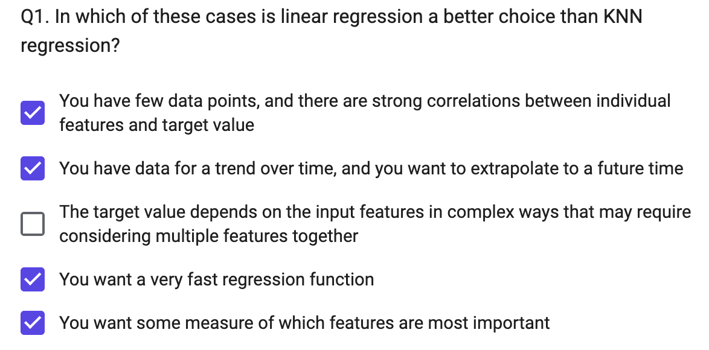

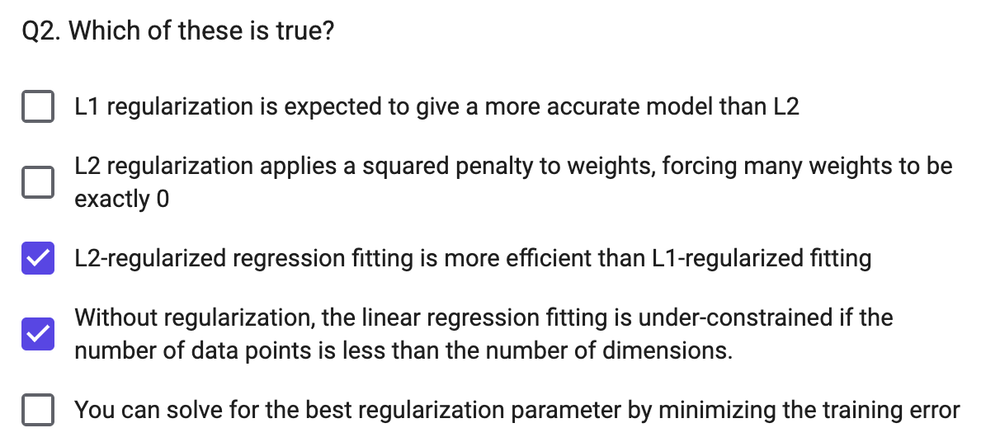

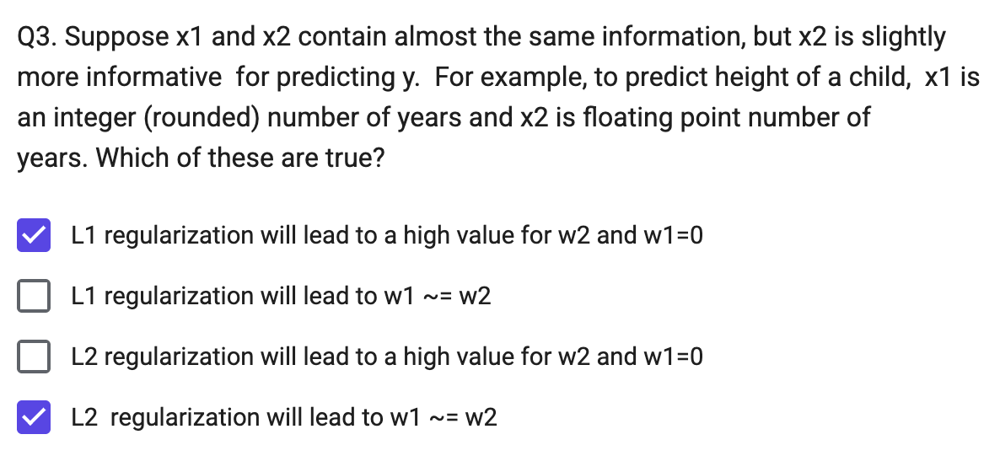

>   y ≈ w1·x1 + w2·x2 + b
>
>   -   w1 is the weight multiplying x1 (the integer/rounded number of years)
>   -   w2 is the weight multiplying x2 (the floating-point number of years)

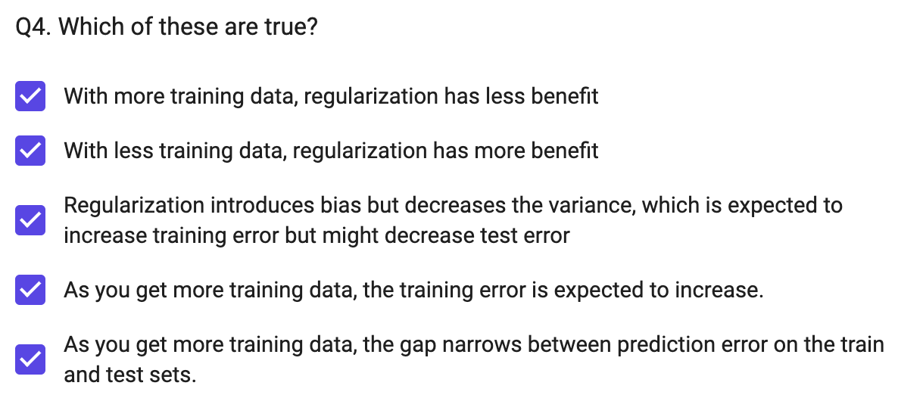

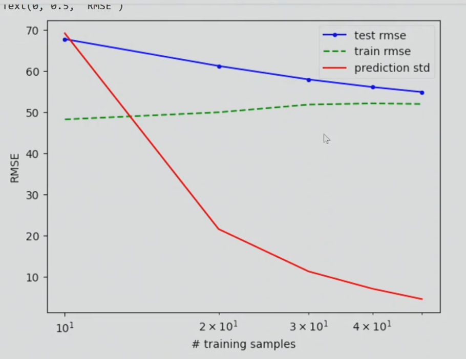

## Linear Classifiers: Logistic Regression and SVM

Linearly separable: a line (or hyperplane) in feature space can split the two labels

### Linear classifiers & separability

-   **Linear classifier**: $y=1$ if $\mathbf w^T\mathbf x+b>0$
-   In high dimensions, a lot more things are linearly separable — with $D$ dimensions, you can separate $D+1$ points with *any* arbitrary labeling
-   Different classifiers use different objectives to choose *which* separating line/hyperplane is "best"
-   Common principle: want training samples on the correct side of the line (low classification error) **by some margin** (high confidence) — a thick, well-margined boundary is a better classifier than one that barely separates the points

(Linear) Logistic Regression Model

-   Maximize the log probability of the true labels given the features, e.g. $\sum_n log P(y_n | x_n)$
-   Idea: regress probability by modeling the **log-odds ratio** with a linear function of the features: $\mathbf w^T\mathbf x+b\approx\log\dfrac{P(y=1|x)}{P(y=-1|x)}$ ("logit") — modeling the log-odds instead of the probability directly gives infinite range, with 0 = neutral prediction
-   **Logistic function**: $P(y=1|\mathbf x)=\dfrac{1}{1+\exp(-[\mathbf w^T\mathbf x+b])}$ (S-shaped curve, 0 to 1); consistent with the logit relation above via substitution + law of total probability ($P(y{=}1|x)+P(y{=}-1|x)=1$)
-   Also: $P(y=-1|\mathbf x)=\dfrac{1}{1+\exp([\mathbf w^T\mathbf x+b])}$, and compactly $P(y=\hat y|\mathbf x)=\dfrac{1}{1+\exp(-\hat y[\mathbf w^T\mathbf x+b])}$

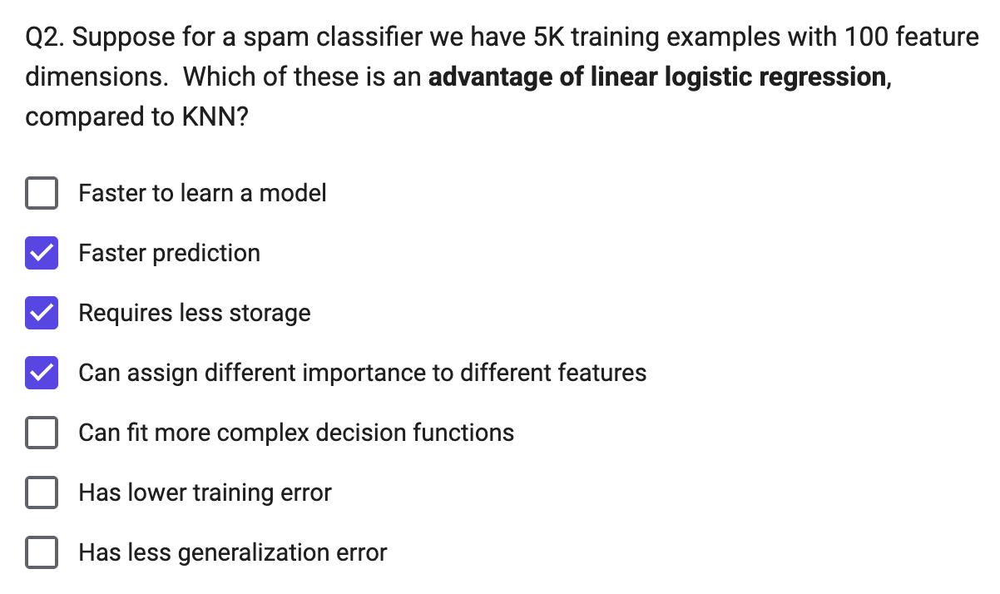

>   [!NOTE] 
>
>   Linear logistic regression is typically the *last layer of a classification neural network*

#### Deriving the loss of logistic regression

Maximize probability of the correct label given features of each data point (assuming data points are conditionally independent):

$$\mathbf w^*=\arg\max_{\mathbf w}\prod_n P(y=y_n|\mathbf x_n;\mathbf w) = \arg\max_{\mathbf w}\sum_n\log P(y=y_n|\mathbf x_n;\mathbf w)$$

(maximizing $\log f(x)$ = maximizing $f(x)$ since log is monotonic; log of a product = sum of logs.) By convention, turn into a minimization problem:

$$\mathbf w^*=\arg\min_{\mathbf w}; -\sum_n\log P(y=y_n|\mathbf x_n;\mathbf w)$$

#### Linear logistic regression algorithm

Training (adds regularization term $r(\mathbf w)$): $\mathbf w^*=\arg\min_{\mathbf w}-\sum_n\log P(y=y_n|\mathbf x_n;\mathbf w)+r(\mathbf w)$

Prediction: $y=1$ if $\mathbf w^T\mathbf x>0$

-   Binary case: $P(y=1|\mathbf x)=\dfrac1{1+\exp(-\mathbf w^T\mathbf x)}=\dfrac{\exp(\mathbf w^T\mathbf x)}{\exp(\mathbf w^T\mathbf x)+1}$
-   Multiclass case (one **w** per class, "softmax"): $P(y=k|\mathbf x)=\dfrac{\exp(\mathbf w_k^T\mathbf x)}{\sum_j\exp(\mathbf w_j^T\mathbf x)}$

L1,L2 regularization

-   L2: $r(\mathbf w)=\lambda\lVert\mathbf w\rVert_2^2=\lambda\sum_iw_i^2$; L1: $r(\mathbf w)=\lambda\lVert\mathbf w\rVert_1=\lambda\sum_i|w_i|$
-   L2 strongly penalizes really big weights; L1 penalizes increasing the magnitude of big and small weights the same → L1 leads to a **sparse** weight vector (many zeros), useful for feature selection
-   There are many optimizers for L1/L2 logistic regression — use a library rather than implementing from scratch
-   Example: for MNIST digit classification, the L2 weight images look like noisy/dense versions of the digit shape, while L1 weight images are sparse (mostly zero, only a few informative pixels highlighted)

#### Logistic Regression Summary

-   **Key assumption**: the log-odds ratio $\log\frac{P(y=k|x)}{P(y\neq k|x)}$ can be expressed as a linear combination of features
-   **Model parameters**: one coefficient per feature per class (plus bias term)
-   **Designs**: L1 / L2 / elastic regularization weight
-   **When to use**: many features (some possibly irrelevant/redundant); want a good estimate of label likelihood, not just a hard label
-   **When not to use**: features are low-dimensional (a linear function may not be expressive enough)

|                       | Linear Regression                     | Logistic Regression                                          |
| --------------------- | ------------------------------------- | ------------------------------------------------------------ |
| **Predicts**          | Continuous value                      | Probability / class label                                    |
| **Output range**      | $(-\infty, \infty)$                   | $(0, 1)$                                                     |
| **Core function**     | $\mathbf w^T\mathbf x + b$            | $\sigma(\mathbf w^T\mathbf x + b)$                           |
| **Loss function**     | Squared error                         | Log loss (cross-entropy)                                     |
| **Typical use**       | Predicting price, temperature, salary | Predicting spam/ham, disease/no disease                      |
| **Decision boundary** | N/A (not a classifier)                | Linear in feature space (where $\mathbf w^T\mathbf x+b=0$, i.e. $\hat y=0.5$) |

### SVM

**What is the best linear classifier?**

-   Logistic regression: maximizes expected likelihood of true labels given features — *every* example contributes to the loss
-   SVM: makes all examples at least minimally confident — bases the decision on a *minimal* set of examples

#### SVM terminology

-   Support Vector: an example that lies on the margin (circled points)
-   **Margin**: the distance of examples (in feature space) from the decision boundary: $m(\mathbf x)=\dfrac{y(\mathbf w^T\mathbf x+b)}{\lVert w\rVert}$, $y\in{-1,1}$
-   SVMs minimize $\mathbf w^T\mathbf w$ while preserving a margin of 1 — compared to logistic regression (which minimizes the sum of logistic error over *all* samples, so its boundary tends to sit further from dense regions), the SVM boundary depends only on the support vectors (circled)

Why SVMs achieve good generalization

-   Maximizing the margin — if all examples are far from the boundary, it's less likely a test sample ends up on the wrong side
    -   If classes are linearly separable, scores can be arbitrarily increased by scaling **w**, so optimization is expressed as minimizing $\mathbf w^T\mathbf w$ while preserving a margin of 1
-   Dependence on few training samples — most training points could be removed without changing the decision boundary, giving an upper bound on generalization error
-   E.g. expected test error $\le$ the smaller of: (a) % of training samples that are support vectors, (b) $D^2/m^2/N$ — diameter of the data compared to the margin, divided by # examples

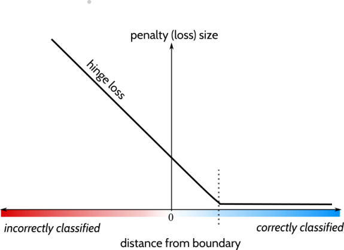

**SVM in the linearly separable case:** prediction $y_n=\text{sign}(\mathbf w^T\mathbf x_n+b)$; optimization $\mathbf w^*=\arg\min_{\mathbf w}\lVert\mathbf w\rVert^2$ subject to $y_n(\mathbf w^T\mathbf x_n+b)\ge1$ for all $n$

**SVM in the non-linearly-separable case (soft margin):**

$$\mathbf w^*=\arg\min_{\mathbf w}\left[\lVert\mathbf w\rVert^2+C\sum_n\max(0,,1-y_n(\mathbf w^T\mathbf x_n+b))\right]$$

-   The $\max(0,1-\cdot)$ term is the **hinge loss**: pays a penalty whenever the margin is less than 1 (zero penalty once correctly classified with margin $\ge1$, linear penalty otherwise)
-   $C$ controls how much slack is tolerated — an example that violates the margin pays a "slack" penalty

####  Representer theorem

Optimal weights for many L2-regularized classification/regression functions can be expressed as a weighted combination of training examples: $\mathbf w^*=\sum_n\alpha_ny_n\mathbf x_n$, with $\alpha_n\ge0,\ y_n\in{-1,1}$ (conditions apply — function must be regularized in a Reproducing Kernel Hilbert Space; does **not** apply to L1 weight regularization)

Linear SVM is a kind of weighted nearest neighbor with dot product similarity

**Primal vs. dual formulations of SVM:**

-   Primal (one parameter per **feature**): prediction $f(\mathbf x)=\mathbf w^T\mathbf x+b$, training objective $\mathbf w^*=\arg\min_{\mathbf w}\left[\lVert w\rVert^2+C\sum_n\max(0,1-y_n(\mathbf w^Tx_n+b))\right]$
-   Dual (one parameter per training **example**): prediction $f(\mathbf x)=\sum_n\alpha_ny_n(\mathbf x_n^T\mathbf x)+b$, training objective $\boldsymbol\alpha^*=\arg\max_{\boldsymbol\alpha}\left[\sum_i\alpha_i-\frac12\sum_{jk}\alpha_j\alpha_ky_jy_k(\mathbf x_j^T\mathbf x_k)\right]$ s.t. $0\le\alpha_i\le C\ \forall i$ and $\sum_i\alpha_iy_i=0$

For SVM, 𝛼 is sparse (most values are zero) — in the dual, $\alpha_i>0$ only for support vectors, $\alpha_i=0$ for all others

Non-linear SVMs use a different similarity measure, called a "kernel function", than dot product

-   Linear: $k(\mathbf x_i,\mathbf x_j)=\mathbf x_i^T\mathbf x_j$
-   Polynomial: $k(\mathbf x_i,\mathbf x_j)=(1+\mathbf x_i^T\mathbf x_j)^d$
-   Gaussian (RBF): $k(\mathbf x_i,\mathbf x_j)=\exp(-\lVert\mathbf x_i-\mathbf x_j\rVert^2/2\sigma^2)$

SVM classifier with a Gaussian kernel (Radial Basis Function / RBF SVM): $f(\mathbf x)=\sum_i\alpha_iy_ik(\mathbf x_i,\mathbf x)+b=\sum_i\alpha_iy_i\exp(-\lVert\mathbf x-\mathbf x_i\rVert^2/2\sigma^2)+b$

Decreasing sigma makes it more like nearest neighbor

####  Example application: Dalal-Triggs 2005 (HOG + linear SVM)

-   Pipeline: normalize gamma/color → compute gradients → weighted vote into spatial & orientation cells → contrast-normalize over overlapping blocks → collect HOG features over detection window → linear SVM → person/non-person
-   Detection by scanning window: resize image to multiple scales, extract overlapping windows, classify each as positive/negative
-   Very highly cited (40,000+) paper, mainly for the HOG descriptor; one of the best pedestrian detectors for several years

#### Using SVMs

-   Good, broadly applicable classifier: strong foundation in statistical learning theory, works well with many weak features
-   Requires tuning parameter $C$; a non-linear SVM additionally requires choosing a kernel, and has slower optimization/prediction
    -   RBF: related to neural networks / nearest neighbor (needs additional tuning of $\sigma$)
    -   Chi-squared, histogram intersection: good for histogram features (but slower, especially chi-squared)
    -   Can also learn a kernel function
-   Negatives: feature learning is not part of the framework (unlike trees and neural nets); slow training especially with kernels (until Pegasos-style solvers)

### Recap (NN / Logistic Regression / Linear Regression)

-   **Nearest neighbor** is widely used — super-power: can instantly learn new classes and predict from one or many examples
-   **Logistic regression** is widely used — super-power: effective prediction from high-dimensional features
-   **Linear regression** is widely used — super-power: can extrapolate, explain relationships, and predict continuous values from many variables
-   Almost all algorithms involve nearest neighbor, logistic regression, or linear regression — the main learning challenge is typically **feature learning**

Things to remember

-   Linear logistic regression and linear SVM are classification techniques that aim to split features between two classes with a linear model — both predict categorical values with confidence
-   Logistic regression maximizes confidence in the correct label, while SVM just tries to be confident *enough*
-   Non-linear versions of SVMs can also work well and were once popular (but almost entirely replaced by deep networks)
-   Nearest neighbor and linear models are the final predictors of most ML algorithms — the complexity lies in finding features that work well with NN or linear models


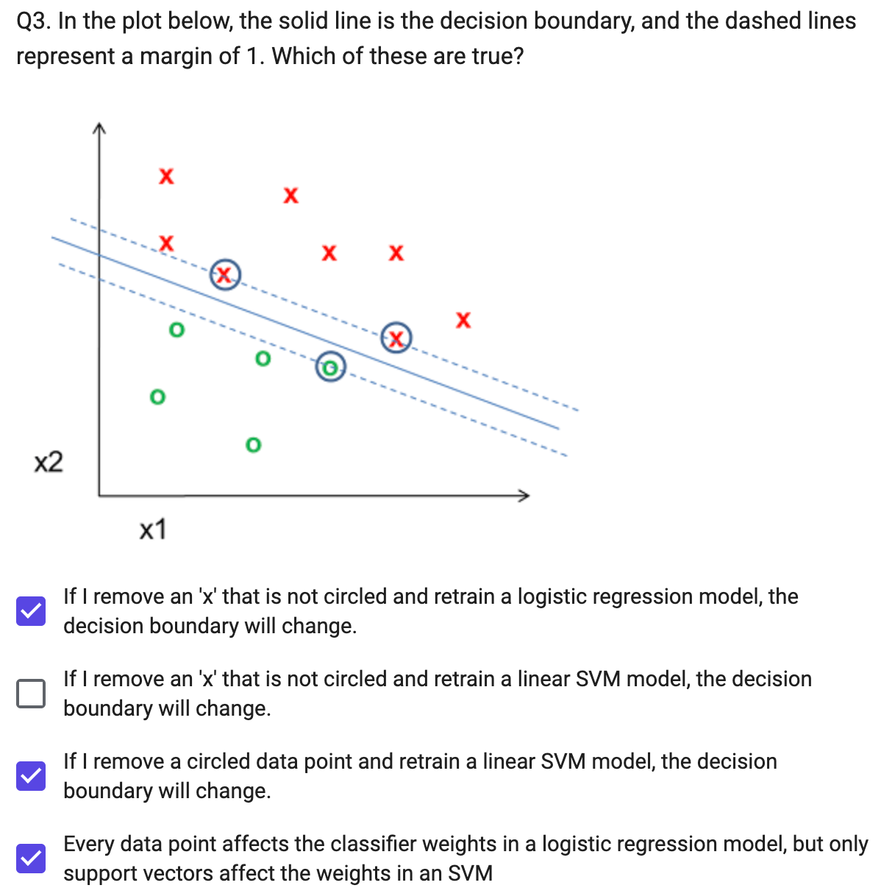

## Naïve Bayes Classifier

A **probability** is a belief/expectation given some information and assumption

### Joint and conditional probability

$$P(x,y)=P(x\mid y)P(y)=P(y\mid x)P(x)\\P(a,b,c)=P(a\mid b,c)P(b\mid c)P(c)$$

$$P(x\mid y)=\frac{P(x,y)}{P(y)}=\frac{P(y\mid x)P(x)}{P(y)}\quad\text{— Bayes Rule}$$

-   **Law of total probability:** $\sum_{v\in x}P(x=v)=1$
-   **Marginalization:** $\sum_{v\in x}P(x=v,y)=P(y)$
-   For continuous variables, replace the sum over possible values with an integral over the domain

**Independence:** A is independent of B iff $P(A,B)=P(A)P(B)$, equivalently $P(A\mid B)=P(A)$ and $P(B\mid A)=P(B)$

### Probabilistic model / prediction rule

$$y^*=\arg\max_y P(y\mid \mathbf x)=\arg\max_y P(\mathbf x\mid y)P(y)$$

since $\arg\max_y P(y\mid\mathbf x)=\arg\max_y P(y\mid\mathbf x)P(\mathbf x)=\arg\max_y P(y,\mathbf x)=\arg\max_y P(\mathbf x\mid y)P(y)$ ($P(\mathbf x)$ doesn't depend on $y$, so it can be dropped from the argmax).

**Notation:** $x_i$ = the $i$-th feature variable; $\mathbf x_n$ = the $n$-th feature vector; $y_n$ = the $n$-th label; $x_{ni}$ = the $i$-th feature of the $n$-th sample; $\delta(x_{ni}=v)$ = 1 if $x_{ni}=v$, else 0.

**argmax** 是"取最大值时对应的自变量"

### The "naïve" model

The *"naive"* part of Naive Bayes is the assumption that features $x_1,...,x_m$ are **conditionally independent** given the label $y$ (e.g. two features x1, x2 are independent given y). Then:

$$P(\mathbf x\mid y)=\prod_i P(x_i\mid y)\\ y^*=\arg\max_y\prod_i P(x_i\mid y)P(y)=\arg\max_y\Big[\log P(y)+\sum_i\log P(x_i\mid y)\Big]$$

**Spam example:** estimate $P(y=\text{spam})$, $P(y=\text{ham})$, and $P(\text{word}=j\mid\text{spam})$, $P(\text{word}=j\mid\text{ham})$ for each word $j$:

$$P(\text{"Ok lar...Joking wif u..."},\text{spam})=P(\text{spam})\,P(\text{"Ok"}\mid\text{spam})\,P(\text{"lar"}\mid\text{spam})\cdots$$

and similarly for ham; classify as spam if $P(\text{msg},\text{spam})>P(\text{msg},\text{ham})$.

### Estimating $P(x_i\mid y)$ from data

Two approaches:

1.  **MLE (maximum likelihood estimation):** choose the parameter maximizing the likelihood of the data 最大似然估计
2.  **MAP (maximum a priori):** choose the parameter maximizing the data likelihood *and* its own prior 最大后验估计

#### MLE

-   **Bernoulli** ($x$ binary, $y$ discrete): $P(x_i\mid y=k)=\theta_{ki}^{x_i}(1-\theta_{ki})^{1-x_i}$, with $\theta_{ki}=\dfrac{\sum_n\delta(x_{ni}=1,y_n=k)}{\sum_n\delta(y_n=k)}$

    `theta_ki[k,i] = np.sum((X[:,i]==1) & (y==k)) / np.sum(y==k)`

-   **Categorical** ($x$ has multiple discrete values, $y$ discrete): $\theta_{kiv}=\dfrac{\sum_n\delta(x_{ni}=v,y_n=k)}{\sum_n\delta(y_n=k)}$

    `theta_kiv[k,i,v] = np.sum((X[:,i]==v) & (y==k)) / (np.sum(y==k))`

#### MAP

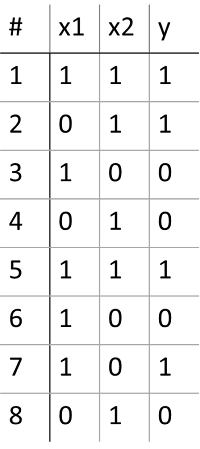

-   **General Laplace (additive) smoothing formula**: For a categorical variable that can take **k** possible values, if you're estimating the probability of outcome *i* from N observed samples: $$P(x = i) = \frac{\text{count}(x = i) + \alpha}{N + \alpha \cdot k}$$

Where:

-   **count(x = i)** = number of times outcome *i* actually appeared in your data
-   **N** = total number of observations
-   **α** (alpha) = smoothing strength — the number of "pretend" extra observations you add to *each* possible outcome (α=1 is called "Laplace smoothing" specifically; general α is called "Lidstone smoothing" or "additive smoothing")
-   **k** = number of possible distinct values the variable can take (for binary variables like your x1, x2, y, k=2)

**Why the denominator has α·k, not just α:**

Since you're adding α pretend counts to *every* one of the k possible outcomes (not just outcome i), the total number of pretend counts across all outcomes is α·k. This total must go into the denominator too, so that all the P(x=i) values still sum to 1 across all k outcomes.

**For a conditional probability** (like P(x1=1 | y=1), which is what you needed above), the same idea applies, but you restrict everything to the subset where the condition holds:

$$P(x = i \mid y = j) = \frac{\text{count}(x = i, y = j) + \alpha}{\text{count}(y = j) + \alpha \cdot k}$$

where k is the number of possible values of x (not y), since you're smoothing the distribution of x within that y=j slice of the data.

|                 | MLE                                 | MAP                                                 |
| --------------- | ----------------------------------- | --------------------------------------------------- |
| 只用数据？      | 是                                  | 否，数据 + 先验                                     |
| 公式            | $\dfrac{\text{count}}{\text{总数}}$ | $\dfrac{\alpha+\text{count}}{\alpha k+\text{总数}}$ |
| 小数据/极端情况 | 容易得到 0 或 1，不稳定             | 更平滑、更稳健                                      |
| 数据量很大时    | —                                   | 先验的影响会被数据"淹没"，MAP ≈ MLE                 |
| 特殊情况        | α=0 时的 MAP                        | 就是 MLE                                            |

### Continuous features

Naïve Bayes still works when $x$ is continuous — e.g. predicting sex from height and weight:

$$P(s=1\mid h,w)=\frac{P(s=1,h,w)}{P(h,w)},\quad P(s=1,h,w)=P(s=1)P(h\mid s=1)P(w\mid s=1)$$

and similarly for $s=0$; $P(h,w)=P(s=1,h,w)+P(s=0,h,w)$ (marginalization over $s$).

#### Gaussian $x_i$, discrete $y$

$$P(x_i\mid y=k)=\frac{1}{\sqrt{2\pi}\,\sigma_{ki}}\exp\!\left(-\frac12\frac{(x_i-\mu_{ki})^2}{\sigma_{ki}^2}\right)$$

$$\mu_{ki}=\frac{\sum_n[x_{ni}\cdot\delta(y_n=k)]}{\sum_n\delta(y_n=k)}\qquad \sigma_{ki}^2=\frac{\sum_n[(x_{ni}-\mu_{ki})^2\cdot\delta(y_n=k)]}{\sum_n\delta(y_n=k)}$$

`mu[k,i] = np.mean(X[y==k,i], axis=0)`
`sigma[k, i] = np.std(X[y==k,i], axis=0)`


**Categorical distribution**

-   A *fixed, finite set of discrete, unordered* labels

**Gaussian (Normal) distribution**

-   A *continuous, real-valued* variable 

### Summary of Naïve Bayes

Pros

-   Easy and fast to train
-   Fast inference
-   Can be used with continuous, discrete, or mixed features

Cons

-   Does not account for feature interactions
-   Does not provide good confidence estimate

Notes

-   Best when used with discrete variables, variables that are well fit by Gaussian, or kernel density estimation

### Things to remember

-   Probabilistic models are a large class of machine learning methods
-   Naïve Bayes assumes features are independent given the label — easy/fast to estimate parameters, less risk of overfitting when data is limited
-   You can look up how to estimate parameters for most common probability models, or take the partial derivative of total data/label likelihood w.r.t. the parameter
-   Prediction involves finding $y$ that maximizes $P(x,y)$, either by trying all $y$ or solving the partial derivative
-   Maximizing $\log P(x,y)$ is equivalent to maximizing $P(x,y)$ and is often much easier:

$$P(\mathbf x,y)=\prod_i P(x_i\mid y)P(y)\\ y^*=\arg\max_y\prod_i P(x_i\mid y)P(y)=\arg\max_y\Big[\sum_i\log P(x_i\mid y)+\log P(y)\Big]$$

## Lecture 9: EM Algorithm and Latent Variables

### Motivating problems

Three example problems, each with an unknown/hidden factor:

1.  **"Bad annotators" problem**: train a classifier to predict image attractiveness using crowdsourced (Mechanical Turk) ratings; some annotators give accurate ratings, others answer randomly. 
    Challenge: figure out who to trust and estimate the average rating from the accurate annotators.
2.  **Foreground/background segmentation**: given an image, assign each pixel foreground/background — without knowing in advance what the foreground looks like.
3.  **Topic models**: documents have a "topic" that's predictive of the words used (Documents *observed* → Topic *latent* → Words *observed*). 
    Challenge: we don't know what the topics are, or what distribution of words each has.

**What these have in common:**

1.  We think there is some underlying factor that is not known (whether annotator is good/bad, whether pixel is fg/bg, topic of a document)
2.  We have a model for the probability of the data *given* that underlying factor
3.  But we don't know the parameters of the model

→ These are **"missing data"** / **"latent variable"** problems: a critical piece of information is not observed.

Real-world EM applications mentioned: 

1. estimating true pixel color from multiple images with some pixels occluded — latent = which pixels are occluded
2. separating extracted sound signatures into music vs. background noise in an audio clip — latent = which source each signature is from

### The "Bad Annotator" problem — setup

You hire annotators to rate image attractiveness; some ("good") try their best, others ("bad") assign random scores. Goal: estimate the average score of *good* annotators for each image.

**Notation**: $s_{ia}\in[0,1]$ = score for image $i$ by annotator $a$; $z_a\in\{0,1\}$ = whether annotator $a$ is good; $\mu_i$ = true mean score for image $i$; $\sigma$ = std dev of true scores (same for every image); $\pi_z=P(z_a=1)$ = prior probability that an annotator is good

**Assumptions:**

1.  Bad annotators are always bad; good annotators are always good ($z_a$ fixed per annotator)
2.  For each image $i$, scores from good annotators follow a Gaussian: $s_{ia}\sim N(\mu_i,\sigma^2)$, i.e. $P(s_{ia}|z_a=1)=\dfrac1{\sqrt{2\pi}\sigma}\exp\!\left(-\dfrac12\dfrac{(s_{ia}-\mu_i)^2}{\sigma^2}\right)$
3.  Scores from bad annotators follow a *uniform distribution*: $P(s_{ia}|z_a=0)=1$ (scores range 0 to 1)

Challenge: figure out which annotators are good **and** estimate the true mean score per image, at the same time. Three sub-questions:

1.  If we *knew* which annotators were good, how would we estimate the score distribution for each image? → **MLE**
2.  Given the distribution parameters, how do we compute the likelihood that an annotator is good? → **probabilistic inference**
3.  How do we get annotator labels and score models *at once* (neither is known)? → **EM**

### Background: Maximum Likelihood Estimation (MLE)

Solve for parameters that maximize the data likelihood. For image $i$ with scores $S_i=\{s_{i0},...,s_{iM}\}$ from $M$ good annotators (scores independent of each other given the model):

$$\hat\theta=\arg\max_\theta P(S_i|\theta)=\arg\max_\theta\prod_aP(s_{ia}|\theta)$$

**Solving for the mean** — take the log of the product (easier to differentiate a sum of logs; $\log f(x)$ and $f(x)$ are maximized by the same $x$), set the partial derivative w.r.t. $\mu_i$ to 0:

$$\frac{\partial}{\partial\mu_i}\sum_a\left[\log\frac1{\sqrt{2\pi}}+\log\frac1\sigma-\frac12\frac{(s_{ia}-\mu_i)^2}{\sigma^2}\right]=0 \;\Rightarrow\; \hat\mu_i=\frac{\sum_as_{ia}}{M}$$

(just the sample mean of the $M$ good-annotator scores for that image)

**Solving for the standard deviation** — same trick, but now summing over all images *and* annotators since $\sigma$ is shared:

$$\hat\sigma^2=\frac{\sum_{i,a}(s_{ia}-\mu_i)^2}{M\cdot N}$$

(average squared deviation from the mean; $N$ = # images, $M$ = # good annotators)

```python
# initialize by assuming that all scores are good
score_mean = scores.mean(axis=1).reshape((len(scores), 1))   # mu_i
score_std = np.sqrt(np.sum((scores-score_mean)**2, axis=None)/N/M)  # sigma
```

Caveat: plugging in *all* annotators (including bad ones) gives a noisy/biased estimate; knowing which annotators are good gives a much better fit — this motivates the next step.

### Background: Probabilistic Inference

Given the distribution parameters, compute the likelihood that a particular sample belongs to a component/label — i.e. compute $p(z_n=m|x_n,\theta)$ ($z_n$ = unknown label of data point $x_n$).

**General strategy**: we know $p(x_n|z_n=0,\theta)$, $p(x_n|z_n=1,\theta)$, and $p(z_n=1|\theta)$; use probability rules to get to what we want:

$$p(z_n=m|x_n,\theta)=\frac{p(z_n=m,x_n|\theta_m)}{p(x_n|\theta)}\overset{\text{total prob.}}{=}\frac{p(z_n=m,x_n|\theta_m)}{\sum_kp(z_n=k,x_n|\theta_k)}\overset{\text{chain rule}}{=}\frac{p(x_n|z_n=m,\theta_m)\,p(z_n=m|\theta_m)}{\sum_kp(x_n|z_n=k,\theta_k)\,p(z_n=k|\theta_k)}$$

**Applied to annotators:**

$$p(z_a=1|\mathbf s_a,\theta)=\frac{p(\mathbf s_a|z_a=1,\theta)\,p(z_a=1,\theta)}{p(\mathbf s_a|z_a=1,\theta)\,p(z_a=1,\theta)+p(\mathbf s_a|z_a=0,\theta)\,p(z_a=0,\theta)}$$

where $p(\mathbf s_a|z_a=1,\theta)=\prod_iN(s_{ia};\mu_i,\sigma)$ (product of Gaussian pdfs over images), $p(\mathbf s_a|z_a=0,\theta)=\prod_i1$ (uniform), $p(z_a=1,\theta)=\pi_z$ (prior)

```python
p_good = np.zeros((5,1))       # w_a = P(z_a=1 | scores, theta_t)
for a in range(M):
    p_s_good = pz              # P(z_a=1)
    p_s_bad  = 1 - pz          # P(z_a=0)
    for i in range(N):
        p_s_good *= 1/np.sqrt(2*np.pi)/score_std * np.exp(-1/2*(scores[i,a]-score_mean[i])**2/score_std**2)
        p_s_bad  *= 1           # uniform on [0,1]
    p_good[a] = p_s_good / (p_s_good + p_s_bad)
```

### Known / latent / target variables and parameters — terminology

Example: modeling penguin height $h$, assuming 2 hidden groups (e.g. sex), each with its own Gaussian height distribution, but we've only recorded the heights.

| Type            | Definition                                                   | Example                                                |
| --------------- | ------------------------------------------------------------ | ------------------------------------------------------ |
| Known values    | provided as input                                            | $h$                                                    |
| Model           | designed function to model the data                          | $P(h\vert s)\sim N(\mu_s,\sigma_s)$                    |
| Latent variable | unknown, needed to use the model                             | $s$ (which group)                                      |
| Parameters      | estimated, needed for the model                              | $\theta_s,\mu_s,\sigma_s$ (prior, two means, two stds) |
| Target variable | given during training but not at test time (not present in this example) | $y$ (e.g. species)                                     |

### Putting it together: solving for parameters and latent labels at once

We want good-annotator labels **and** score-distribution parameters **simultaneously** — but each depends on the other (step 1 needs to know who's good; step 2 needs the parameters).

**Simple iterative solution:**

1.  Initialize parameters
2.  Compute the probability of each hidden variable given the current parameters
3.  Compute new parameters for each model, weighted by the likelihood of the hidden variables
4.  Repeat 2–3 until convergence

Applied to the annotator problem:

1.  Initialize: estimate $\mu_i,\sigma,\pi_z$ assuming all annotators are good
2.  Compute $w_a=p(z_a=1\mid\mathbf s_a,\mu,\sigma,\pi_z)$ for every annotator (as in the inference step above)
3.  Re-estimate parameters, weighting each annotator's contribution by $w_a$:

$$\hat\mu_i=\frac{\sum_aw_as_{ia}}{\sum_aw_a},\qquad \hat\sigma^2=\frac{\sum_{i,a}(s_{ia}-\mu_i)^2w_a}{\sum_{i,a}w_a},\qquad \hat\pi_z=\frac{\sum_aw_a}{M}$$

Repeat until estimates stop changing — this *is* the EM algorithm (on the demo data, this recovers the true "good annotators" and gives estimated scores that closely track the true underlying curve, much better than assuming all annotators are good).

### The Expectation-Maximization (EM) algorithm — general derivation

**Goal**: solve for parameters that maximize data likelihood: $\hat\theta=\arg\max_\theta p(\mathbf x|\theta)$

But we only know $p(\mathbf x|\mathbf z,\theta)$ for latent variables $\mathbf z$, not $p(\mathbf x|\theta)$ directly, so marginalize over $\mathbf z$:

$$\hat\theta=\arg\max_\theta\sum_{\mathbf z}p(\mathbf x,\mathbf z|\theta)$$

The joint probability involves an intractable product; taking the log gives a **log of a sum**, which is still intractable (can't push the log inside the sum):

$$\hat\theta=\arg\max_\theta\log\left(\sum_{\mathbf z}p(\mathbf x,\mathbf z|\theta)\right)$$

**Jensen's inequality**: for a concave function $f$ (such as $\log$), $f(E[X])\ge E[f(X)]$. So instead of maximizing $\log(\text{sum})$ directly, maximize the (tractable) lower bound built from $E[\log(\cdot)]$ — a *sum of logs* instead of a *log of sums*.

This gives the two EM steps:

1.  **E-step** (expectation): $\mathrm E_{\mathbf z\vert\mathbf x,\theta^{(t)}}\big[\log p(\mathbf x,\mathbf z|\theta)\big]=\sum_{\mathbf z}\log\big(p(\mathbf x,\mathbf z|\theta)\big)\,p(\mathbf z|\mathbf x,\theta^{(t)})$ — expectation of $\log p(x,z\vert\theta)$ over the current estimated $P(z)$ (using $\theta^{(t)}$, the current parameter estimate)
2.  **M-step** (maximization): $\theta^{(t+1)}=\arg\max_\theta\sum_{\mathbf z}\log\big(p(\mathbf x,\mathbf z|\theta)\big)\,p(\mathbf z|\mathbf x,\theta^{(t)})$

Repeat E/M, alternating between (**E**) estimating the distribution over latent variables given current parameters, and (**M**) re-estimating parameters to maximize the expected log-likelihood under that distribution.

### Full derivation for the annotator problem (worked example)

**E-step**: write down the expectation, expand the joint probability as a product over individual samples (log of product = sum of logs), rearrange the sum over $\mathbf z$ into a series of per-annotator sums, and note that summing over all $z$'s except $z_a$ marginalizes the others out (since each annotator's term only depends on its own $z_a$):

$$E_{\mathbf z|\mathbf s,\theta^{(t)}}\big[\log P(\mathbf s,\mathbf z|\theta)\big]=\sum_{i,a}\Big[\log P(s_{ia}|z_a,\theta)+\log P(z_a|\theta)\Big]\,P(z_a|\mathbf s,\hat\theta)$$

Plugging in the Gaussian/uniform score models and letting $w_a\equiv P(z_a=1|\mathbf s,\hat\theta)$ (computed via inference above):

$$=\sum_{i,a}\left[\Big(\log\tfrac1{\sqrt{2\pi}\sigma}-\tfrac12\tfrac{(s_{ia}-\mu_i)^2}{\sigma^2}+\log\pi_z\Big)w_a \;+\; \big(\log(1)+\log(1-\pi_z)\big)(1-w_a)\right]$$

**M-step**: take partial derivatives w.r.t. each parameter and set to 0 (very similar to the MLE derivation, but every term is now weighted by $w_a$):

$$\hat\mu_i=\frac{\sum_aw_as_{ia}}{\sum_aw_a},\qquad \hat\sigma^2=\frac{\sum_{i,a}(s_{ia}-\mu_i)^2w_a}{\sum_{i,a}w_a},\qquad \hat\pi_z=\frac{\sum_aw_a}{M}$$

(matches the "simple iterative solution" derived intuitively above — the formal EM derivation confirms it's correct)

### EM algorithm — key properties

-   Maximizes a **lower bound** on the data likelihood at each iteration (via Jensen's inequality)
-   Each step increases the data likelihood; converges to a **local maximum** (not guaranteed global) — like K-means, may want multiple random restarts
-   Common tricks in the derivation: find terms that sum/integrate to 1 (to simplify); use a Lagrange multiplier to handle constraints
-   Although the full derivation is long, the *application* always boils down to alternating:
    1.  Estimate likelihood of latent variables given current parameters (E-step)
    2.  Compute new parameter estimates weighted by those latent-variable likelihoods (M-step)
-   The EM algorithm is a method for MLE in the presence of missing or incomplete data.

### "Hard EM"

-   Same as EM, except in the E-step compute $z^*$ = the single most likely value for each hidden variable (a hard assignment), instead of a full probability distribution over it
-   **K-means is an example of hard EM** (each point is hard-assigned to its nearest cluster, rather than getting soft membership weights)
-   Advantages: simpler — can be applied even when full (soft) EM can't be derived; sometimes works better if you want hard predictions at the end
-   Disadvantage: generally, the resulting parameter (pdf) estimates are not as accurate as full EM

### Things to remember

-   EM is a widely applicable algorithm to solve for latent variables and parameters that make the observed data likely
-   While the derivation is long and somewhat complicated, the application is simple (alternate E-step / M-step)
-   We'll see other examples of EM in mixture-of-Gaussian models (next class)

## Lecture 10: PDF Estimation

We often want to estimate $p(x)$ for some observation $x$:

-   **For classification**, e.g. we may want $p(x\mid y)$
-   **For outlier/anomaly detection** 离群点/异常检测, e.g. we want to know if $p(x)$ is small
-   **For prediction**, we want to know which answer or action is most likely
-   **To model dependencies and mutual information**

For discrete variables this just involves counting, but continuous variables are trickier — this lecture covers models and methods for estimating $p(x)$.

### Basic rules of PDFs

PDF = probability density function

1.  $\int p(x)\,dx=1$ (but $p(x)$ itself **can** be greater than 1 — it's a density, not a probability)
2.  $p(x)\ge0\ \forall x$

A common implicit assumption is **smoothness**: $p(x+\epsilon)\approx p(x)$ for small $\epsilon$.

### From PDF to probability

To get an actual probability from a PDF, integrate over a range: $P(a<X<b)=\int_a^b p(x)\,dx$. Narrowing the range shrinks the probability (e.g. for a standard normal, $P(0.95<X<1)\approx0.012$, while widening the window around the peak gives $P(-0.05<X<0.05)\approx0.04$).

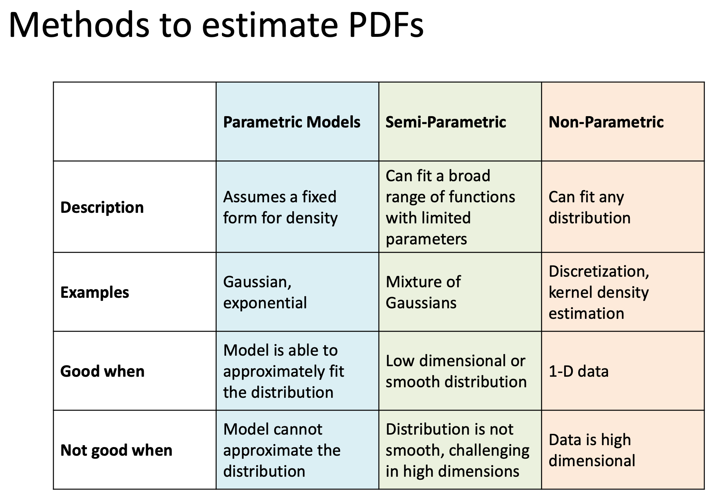

1D PDF examples: temperature, intensity, sensor readings, height of a person, count data — $x$ could be continuous, or discrete but with too many possible values to just count frequencies for each (e.g. how many people are in NYC on a given day of the year).


How to estimate PDFs from samples — three approaches

1.  **Fit parameters of a model** (e.g. fit a Gaussian: estimate $\mu,\sigma$)
2.  **Discretize and count** (histogram)
3.  **Kernel density estimation** (KDE)

#### Parametric vs. semi-parametric vs. non-parametric

|               | Parametric Models                                   | Semi-Parametric 半参数                                     | Non-Parametric                            |
| ------------- | --------------------------------------------------- | ---------------------------------------------------------- | ----------------------------------------- |
| Description   | Assumes a fixed form for density                    | Can fit a broad range of functions with limited parameters | Can fit any distribution                  |
| Examples      | Gaussian, exponential                               | Mixture of Gaussians                                       | Discretization, kernel density estimation |
| Good when     | Model is able to approximately fit the distribution | Low dimensional or smooth distribution                     | 1-D data                                  |
| Not good when | Model cannot approximate the distribution           | Distribution is not smooth, challenging in high dimensions | Data is high dimensional                  |

### Common parametric / semi-parametric distributions

#### Gaussian distribution

$$p(x_n\mid\mu,\sigma^2)=\frac1{\sqrt{2\pi\sigma^2}}\exp\left(-\frac{(x_n-\mu)^2}{2\sigma^2}\right)$$

-   Easy to estimate parameters (MLE = sample mean/variance)
-   Symmetric, unimodal 对称，单峰值
-   Products of Gaussian variables are Gaussian; sums of Gaussian random variables are Gaussian
-   The sum of *many* random variables (of almost any distribution) is approximately Gaussian — the **Central Limit Theorem** — so it's often used as a noise model
-   Light tail (values become small quickly away from the mean)
-   Examples of distributions fit well by Gaussian: heights of adult males, image intensity noise, weights of newborn babies

#### Exponential distribution

$$f(x;\lambda)=\begin{cases}\lambda e^{-\lambda x} & x\ge0\\0 & x<0\end{cases}$$

-   Mean = std = $1/\lambda$
-   Positive only
-   Heavy-tailed (significantly non-zero values far from the mean)
-   Examples: time to next event when events occur with uniform likelihood (e.g. radioactive decay, a customer entering a shop), frequency of words in a collection of documents, amount of money spent per customer at a supermarket

#### Beta distribution

$$f(x;\alpha,\beta)=\text{constant}\cdot x^{\alpha-1}(1-x)^{\beta-1}$$

-   Range is $[0,1]$
-   Lots of different shapes depending on parameters $\alpha,\beta$
-   Used when a variable has a finite range of possible values

Estimating the parameters of these models is usually computable in closed form — the MLE estimates (the parameter values that maximize data likelihood) are easy to look up (Lecture 9's MLE background)

#### Mixture of Gaussians (MoG)

A semi-parametric model: a sum of weighted Gaussian components, indexed by a hidden/latent variable $z_n$ (which component "generated" point $n$):

$$p(x_n\mid\boldsymbol\mu,\boldsymbol\sigma^2,\boldsymbol\pi)=\sum_m p(x_n,z_n=m\mid\mu_m,\sigma_m^2,\pi_m)$$

where, by the chain rule, each joint term factors into (component likelihood) × (component prior):

$$p(x_n,z_n=m\mid\mu_m,\sigma_m^2,\pi_m)=p(x_n\mid\mu_m,\sigma_m^2)\,p(z_n=m\mid\pi_m)=\frac1{\sqrt{2\pi\sigma_m^2}}\exp\left(-\frac{(x_n-\mu_m)^2}{2\sigma_m^2}\right)\cdot\pi_m$$

-   With enough components, MoG can represent essentially any PDF — widely used as a general-purpose density estimator
-   Biased toward smooth density functions

**Fitting MoG with EM** — directly reuses the EM framework from Lecture 9 (this is basically the "annotator" derivation again, but the latent variable is now "which Gaussian generated this point" instead of "is this annotator good"):

1.  Initialize parameters $\boldsymbol\mu,\boldsymbol\sigma^2,\boldsymbol\pi$
2.  **E-step**: compute the responsibility of each component for each point, given the current parameters: $\alpha_{nm}=p\!\left(z_n=m\mid x_n,\boldsymbol\mu^{(t)},\boldsymbol\sigma^{2(t)},\boldsymbol\pi^{(t)}\right)$
3.  **M-step**: re-estimate parameters for each component, weighted by those responsibilities:

$$\hat\mu_m^{(t+1)}=\frac{\sum_n\alpha_{nm}x_n}{\sum_n\alpha_{nm}},\qquad\hat\sigma_m^{2(t+1)}=\frac{\sum_n\alpha_{nm}(x_n-\hat\mu_m)^2}{\sum_n\alpha_{nm}},\qquad\hat\pi_m^{(t+1)}=\frac{\sum_n\alpha_{nm}}{N}$$

4.  Repeat steps 2–3 until convergence

Reference tutorial: https://courses.grainger.illinois.edu/CS441/fa2026/tutorials/gmm.html

### Non-parametric methods

#### Histograms ("normalized histograms", discretized functions)

1.  Convert a continuous value to discrete values:
    -   Divide into equal-sized bins ("equal width")
    -   Divide the data into equal-sized chunks and put bin boundaries around them ("equal count"/"equal data")
    -   Perform K-means to choose bin boundaries
2.  Count occurrence within each bin
3.  $p(x)=(\text{bin count})/(\text{total count})/(\text{bin size})$ — normalize so the histogram integrates to 1

**Guidelines for binning/discretizing 1-D data:**

-   Is the x-axis meaningfully interval-scaled (time, dollars, cm)? → **equal width**
-   Is the distribution very skewed/heavy-tailed and you're exploring tails/quantiles? → **equal count** (or log-transform + equal width)
-   Comparing multiple groups on one axis? → **equal width** (shared bin edges)
-   Tails important but equal width hides them? → show **both**: equal width for overall shape + equal count (or an ECDF) for tail detail

#### Kernel density estimation (KDE)

$p(x)$ is a weighted count of points near $x$, divided by the number of points:

$$\hat f_h(x)=\frac1n\sum_{i=1}^n K_h(x-x_i)=\frac1{nh}\sum_{i=1}^n K\!\left(\frac{x-x_i}{h}\right)$$

-   Like a histogram, but with potential for fine granularity and no defined bin boundaries
-   **Bandwidth** $h$ controls smoothness (too small → spiky/overfit; too large → oversmoothed)
-   Rule of thumb bandwidth for a Gaussian kernel: $h=\left(\dfrac{4\hat\sigma^5}{3n}\right)^{1/5}\approx1.06\,\hat\sigma\,n^{-1/5}$
-   Can be computed efficiently in combination with fine discretizations

### Estimating probability in more than 1 dimension

-   Estimate for each dimension separately and assume dimensions are independent: $P(x_1,x_2,x_3)=P(x_1)P(x_2)P(x_3)$
-   Use a genuinely multidimensional model: Gaussian, or Mixture of Gaussians
-   Project to a lower dimension/manifold first (e.g. PCA), then estimate
-   Non-linear compression, e.g. with an autoencoder (deep network: input → encoder → latent space → decoder → output), then estimate in the compressed space

### How to select parameters and evaluate

**Hyperparameters** for each method:

-   Histogram: number of bins
-   Kernel density: bandwidth
-   MoG: number of components
-   (Also may set priors on bin count or variance)

**To select hyperparameters:**

1.  Split data into a train and validation set
2.  For each candidate parameter value: fit to train, compute average log-likelihood on val, record the best
3.  Refit with the best parameter on train + val combined

**To compare different models** (e.g. histogram vs. KDE vs. MoG): evaluate average log-likelihood on a **held-out test set**.

| Estimation method(works best) | Guassian | Histogram-Equal width with bins | Histogram-Equal data with  bins | Kernel Density Estimation | Misture of Guassian |
| :---------------------------: | :------: | :-----------------------------: | :-----------------------------: | :-----------------------: | :-----------------: |
|     uniformly random data     |          |                1                |                                 |             1             |                     |
|       Gaussian-sampled        |    1     |                                 |                                 |             1             |          1          |
|     image intensity data      |          |                                 |                                 |             1             |          1          |
|          salary data          |          |                                 |                1                |             1             |                     |
|       exam scores data        |    1     |                                 |                                 |             1             |                     |
|  penguin culmen length data   |          |                                 |                                 |             1             |          1          |

Takeaway: KDE is the safe general-purpose choice (it shows up as a top performer almost everywhere); a Gaussian fit works well when the data genuinely looks Gaussian (exam scores, Gaussian-sampled data); histograms/MoG help pick up structure a single Gaussian misses (skew, multi-modality) — e.g. equal-width histograms are natural for uniform data, equal-data (equal-count) histograms handle skewed data like salaries better, and MoG captures the multi-modal structure in image intensities and penguin measurements.

### Things to remember

-   Estimating $p(x)$ for continuous $x$ is harder than for discrete variables (can't just count)
-   Three main strategies: fit a parametric model (Gaussian/exponential/Beta...), discretize + count (histogram), or kernel density estimation (KDE)
-   Mixture of Gaussians bridges parametric and non-parametric, and is fit with EM — the exact same E-step/M-step pattern from Lecture 9
-   Always choose hyperparameters (# bins, bandwidth, # components) using a train/val split, and compare different models using held-out **test**-set log-likelihood

## Lecture 11: Outliers and Robust Estimation

Outliers are common; Median is more robust

### Moving average

Moving average is robust to random additive noise

Noisy signal = clean signal + noise 

If noise has zero mean, then it gets averaged out

Moving average is not robust to outliers because these can pull the average far in one direction

### Moving median

return median within each window

robust filter towards outliers

### Detect outliers

#### PCA Reconstruction Error

-   Compress to 100 PCA coefficients
-   Reconstruct, and measure reconstruction error 
-   Show examples with highest reconstruction error


Identifying outliers based on density 

Based on neighborhood density

-   Compute average density based on some samples, e.g. inverse density is average distance to K neighbors; If point has much lower density than its neighbors, it is an outlier 

Based on a radius

-   Compute average number of points within some radius of another point; Any points that have much lower density than average are outliers 

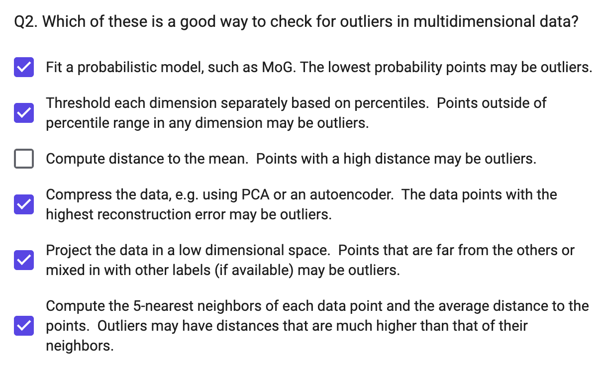

**Least squares**

-   Least squares line fit based on clean points
-   Least squares line fit based on all points, heavily influenced by outlier

**Iteratively Reweighted Least Squares (IRLS)** – outlier handling

-   IRLS keeps *all* points but **reweights** them each iteration based on how well the current model fits them

**Robust least squares**, aka M-estimation

-   Replaces the *squared* error with a loss function that grows more slowly for large residuals 

**RANSAC(RANdom SAmple Consensus)**

-   It explicitly tries to find the model that **explains as many points as possible within a threshold** — points outside the threshold are simply ignored, not down-weighted, they're *excluded entirely* from the winning fit.

1.   Sample (randomly) the number of points required to fit the model 
2.   Solve for model parameters using samples 
3.   Score by the fraction of inliers within a preset threshold of the model 
4.   Repeat 1-3 until the best model is found with high confidence

Number of samples N

-   Choose N so that, with probability p, at least one random sample is free from outliers (e.g. p=0.99) (outlier ratio: e )

Good

-   Robust to outliers
-   Advanced forms can automatically estimate thresholds and number of iterations

 Bad

-   Computational time grows quickly with fraction of outliers and number of parameters 


| Method               | Outlier handling                            | Best when...                                       |
| -------------------- | ------------------------------------------- | -------------------------------------------------- |
| Least squares        | None — full quadratic penalty on all points | Data is clean, no outliers                         |
| RANSAC               | Hard exclusion via threshold + voting       | Many outliers, low noise, clean threshold possible |
| IRLS                 | Smooth reweighting each iteration           | Moderate noise, fuzzy inlier/outlier boundary      |
| Robust least squares | Loss function that caps outlier influence   | Similar to IRLS — moderate noise, some outliers    |

