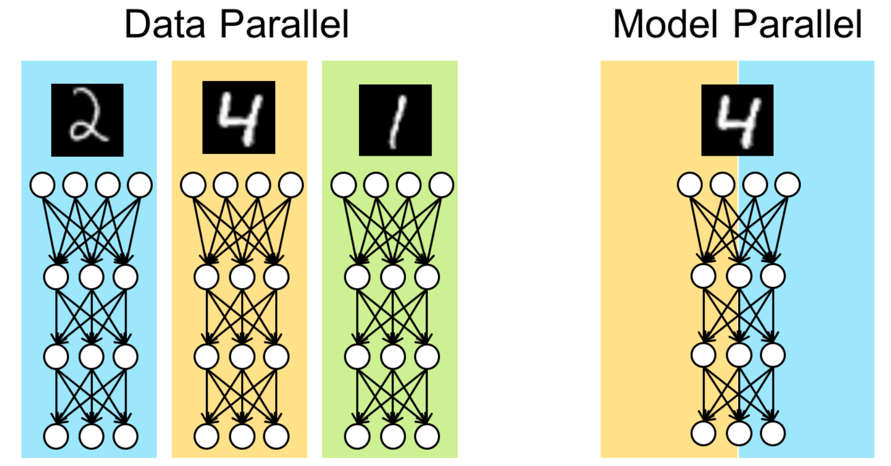
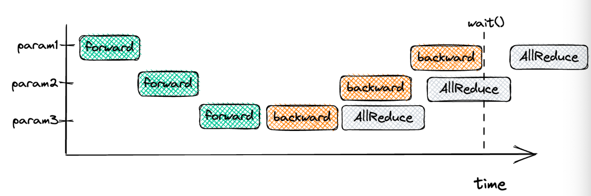
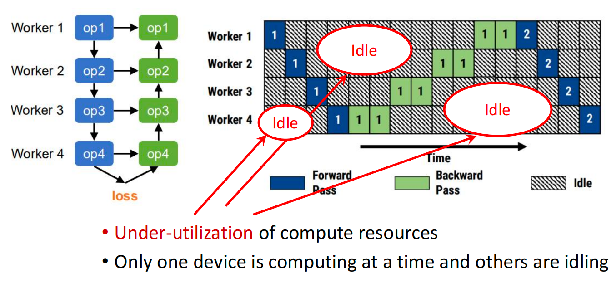
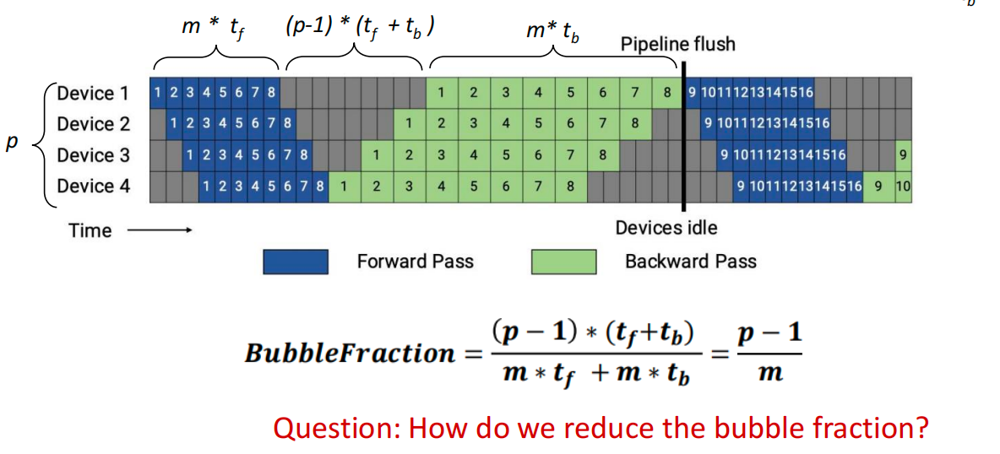
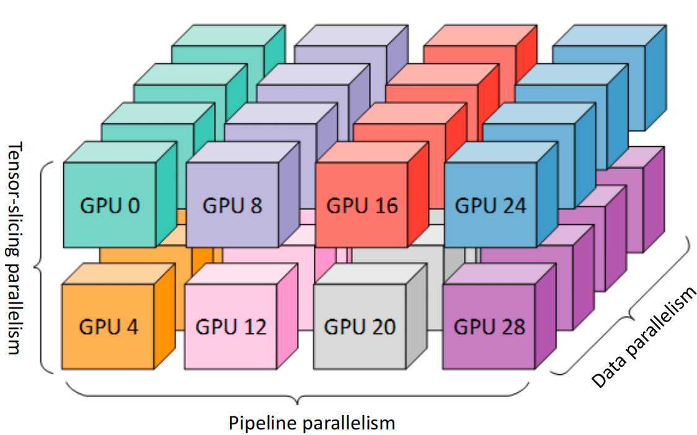

# CS 498 Machine Learning System

>   [!NOTE]
>
>   TA: 

DL computation

Transformer=attention+ MLPs

Recurrent Neural Networks

-   LSTM

Two Key Problems of RNNs

-   

Attention: 

GNN Architecture

MoE

Stochastic Gradient Descent (SGD)

These slides function as an introductory roadmap for a course on **Machine Learning Systems**. Since you are new to this, think of this field as the intersection of "math" (the models) and "computer engineering" (how to run that math efficiently on hardware).

The content is divided into three main pillars: **Models** (the workloads), **Optimization** (how they learn), and **Frameworks** (the software tools like PyTorch) .

## Deep Learning Workload

### The "Ingredients" of Deep Learning

1.  **Data:** The examples you teach the computer with (Images, Text, Audio, etc.).
2.  **Model:** The mathematical structure that learns patterns (CNNs, Transformers, etc.).
3.  **Compute:** The hardware that does the math (CPUs, GPUs).

**The Learning Process (Propagation 传播)** :

-   **Forward Propagation:** The data goes *into* the model, passes through layers, and the model makes a guess (e.g., "Is this a Cat or a dog?").
-   **Backward Propagation:** The system checks if the guess was wrong (Loss). It then sends a signal *backward* through the model to adjust the internal dials (parameters/weights) so it makes a better guess next time.

### Model Architectures

#### 1. Convolutional Neural Networks (CNNs)

-   **Best for:** Images (Computer Vision).
-   **How they work:** Imagine looking at a picture through a small square window (a filter) and sliding it across the image. This enables the model to identify local features, such as edges, corners, or textures.
-   **Key Models mentioned:**
    -   **ResNet:** Uses "identity connections" (shortcuts) to help train very deep networks without getting stuck.
    -   **U-Net:** Used for "segmentation"分割 (outlining exactly where an object is in an image).

#### 2. Recurrent Neural Networks (RNNs)

-   **Best for:** Sequences 序列 (Text, Audio) where order matters.
-   **How they work:** They process data one step at a time (like reading a sentence word-by-word), keeping an internal "memory" or state of what they have seen so far.
-   **The Problem:** They are *slow* because they can't do everything at once (lack of parallelizability), and they tend to forget things if the sequence is too long.
-   **Key Models:** **LSTM** and **GRU** were invented to help fix the "forgetting" problem. 解决遗忘问题

#### 3. Transformers

-   **Best for:** Modern Text processing 文本处理 (e.g., ChatGPT, BERT).
-   **The Big Idea ("Attention"):** Instead of reading word-by-word like an RNN, Transformers use **Attention**. This allows the model to look at *all* words in a sentence simultaneously and figure out which words relate to each other (e.g., connecting "it" to "the cat").
-   **System Benefit:** Because they look at everything at once, they are "massively parallelizable," meaning they run very fast on modern hardware (GPUs) compared to RNNs.

#### 4. Graph Neural Networks (GNNs)

-   **Best for:** Network data (Social networks, molecular structures).
-   **How they work:** They predict properties of a node (e.g., a person) by aggregating information from their neighbors (e.g., their friends).

#### 5. Mixture-of-Experts (MoE) 专家混合

-   **The Idea:** Instead of one giant model doing everything, you have many smaller "expert" models. For every input, a "Router" decides which experts are best suited to handle the problem.

### Optimization (How the Model Learns)

Optimization is the math used to minimize the model's errors (Loss).

**1. Gradient Descent (The Basic Way)**: Imagine you are standing on a misty mountain and want to get to the bottom. You look at the slope under your feet and take a step downhill. This is **Stochastic Gradient Descent (SGD)**. 随机梯度下降

-   **Problem:** If you use small batches of data, your path is "noisy" (jittery), and you might get stuck in small valleys (local minima).

**2. Momentum** 动量: To fix the jitter, you add "Momentum." Just like a heavy ball rolling down a hill builds up speed and isn't easily deflected by small bumps, this method remembers the direction it was going and keeps moving that way.

SGD+Momentum

**3. Adaptive Methods 自适应方法 (RMSProp & Adam)**

Sometimes you need to take big steps, and sometimes small steps.

-   **RMSProp:** Adapts the step size (learning rate) based on how steep the terrain is.
-   **Adam:** The "gold standard" today. It combines Momentum (velocity) and RMSProp (adaptive steps) to learn very efficiently. Adam is a kind of optimizer.

learning rate: decay over time

Dataflow graph representation

### Frameworks (The Software)

Finally, the slides discuss the tools we use to program these models, like **TensorFlow** and **PyTorch**.

**Computational Graphs**: Deep Learning frameworks represent your code as a "graph" where circles are math operations (add, multiply) and arrows are data flowing between them.

**TensorFlow vs. PyTorch**

-   **Symbolic 符号化 (TensorFlow v1):** You define the *entire* graph structure first, then run it. It's harder to debug but easier for the computer to optimize (make faster) .
-   **Imperative 命令式 (PyTorch):** You run the math line by line, just like Python. It is flexible and easy to debug, but historically harder to optimize automatically.

**The Modern Solution: Just-in-Time (JIT) Compilation,** New tools like `Torch. compile` (PyTorch 2.0), try to give you the best of both worlds: the ease of Python with the speed of optimized graphs.

## Transformers AI

### Architecture

**Tokenization & Embeddings:** The process starts by splitting text into individual pieces (tokens) and converting them into vector representations (embeddings) .

**Positional Encodings 位置编码:** Since Transformers process words in parallel rather than sequentially, they require "positional encodings" to understand word order.

-   The token embeddings and the absolute position embedding are added together element-wise.

-   **Absolute Positional Encoding:** The original method adds a fixed vector to the embedding to represent position.
-   **Relative Position Encoding:** A more modern approach that focuses on the distance between words (e.g., "my dog" matters more than where "dog" appears in the sentence).
-   **Rotary Position Embedding (RoPE):** A standard in recent large language models (LLMs) that uses rotation matrices to encode position.

### Self-Attention

**Query, Key, Value (Q, K, V):** The lecture uses a database analogy where a **Query** searches for information, **Keys** identify objects, and **Values** contain the actual content.

Self-Attention Steps:

-   Step 1: compute “key, value, query” embedding for each input token
-   Step 2: compute scores between pairs of tokens(dot product of Q and K)
-   Step 3: compute normalized attention scores(Softmax)
-   Step 4: get a new representation by the weighted sum of values

**Multi-Head Attention:** Running multiple attention calculations in parallel allows the model to capture different types of relationships between words simultaneously.

###  Encoder vs. Decoder

-   **Encoder:** Its goal is to "add context" to the input embeddings, transforming them into contextually rich representations.
-   **Decoder:** Used for generation (like translation or text completion). It uses masked attention to ensure it generates one token at a time without "cheating" by looking ahead.

### Arithmetic Intensity & Performance

A significant portion of the lecture focuses on analyzing the hardware efficiency of these models.

-   **Arithmetic Intensity (AI):** Defined as the ratio of floating-point operations (FLOPs) to memory operations (Bytes). It measures how much "work" the processor does for every byte of data it moves.
    -   Formula: $AI = \frac{\#ops\text{(compute)}}{\#bytes\text{(memory bandwidth)}}$.
-   **The Roofline Model:** A visual model used to identify if a program is **Compute-bound** (limited by processor speed) or **Memory Bandwidth-bound** (limited by data transfer speed) .
    -   High AI leads to compute-bound performance (good).
    -   Low AI leads to bandwidth-bound performance (bad, processor sits idle waiting for data).
-   **Optimization Example:** The slides demonstrate that "fusing" operations 融合运算 (combining addition and multiplication into one loop 加法乘法合并) increases Arithmetic Intensity by reducing the number of memory reads/writes required for the same amount of math.

### Transformer Performance Analysis

The lecture concludes by applying Arithmetic Intensity calculations specifically to Transformers.

-   **Memory vs. Compute:** Different layers (Linear vs. Attention) have different costs. For example, the Feed-Forward Network involves significantly more FLOPs ($16bsh^2$) compared to other operations.

    **Batch Size Impact:** Increasing batch size generally improves throughput (tokens/second) by moving the workload from being memory-bound to compute-bound . 批处理将内存受限转化为计算受限

Multi-query attention

MA/MQA/GQA

native sparse attention

-   better quality, compute and memory footprint
-   sparse matrix don't save memory(COO)

### Distributed Traning

Data Parallelism (DP)

Data Parallelism with All-Reduce

Data Parallelism assumes hosting the full model within a unit

Stragglers

Unbounded stalensess

DDP

In all-reduce, computation and communication can overlap

-   

Question: why do we have these data dependency edges?

collective

Ring All-Reduce

-   reduce scatter
-   all gather

p: GPU

n: Data

The Problem: Limitations of Data Parallelism

-   **Data Parallelism (DP):** In DP, the entire model is replicated on every GPU, and only the data (minibatch) is split.
-   **The Bottleneck:** This works well until the model itself is too large to fit into the memory of a single GPU. Large models (like GPT-2 or Llama) require massive memory for parameters, gradients, and optimizer states .
-   **The Solution:** We need **Model Parallelism**, specifically **Tensor Parallelism**, where individual layers are split across multiple devices .

### Tensor Slicing Model Parallelism

Inter-layer (Pipeline) parallelism

\- Split sets of layers across multiple devices

\- Layer 0, 1, 2 and layer 3, 4, 5 are on different devices

Intra-layer (Tensor) parallelism

\- Split individual layers across multiple devices

\- Both devices compute different parts of layer 0, 1, 2, 3, 4, 5

Tensor Parallel: Parallel GeMM

-   all reduce

#### Tensor Parallelism

The core concept is splitting the matrix multiplication operations ($Y = XA$) across GPUs. The slides present two ways to do this:

-   **Row Parallelism:** The weight matrix $A$ is split horizontally (by rows). The input $X$ must be split by columns.
    -   *Constraint:* This requires an **All-Reduce** operation (synchronization) immediately after the multiplication to sum the partial results ($Y_1 + Y_2$) .
-   **Column Parallelism:** The weight matrix $A$ is split vertically (by columns). The input $X$ is broadcast to all GPUs.
    -   *Advantage:* The output $Y$ is split by columns, so no immediate synchronization is needed .

Reduce communication cost is curcial as TP is communication-intensive

#### Megatron-LM Architecture

NVIDIA's Megatron-LM framework efficiently applies these concepts to Transformer models (like BERT and GPT) to minimize communication costs.

**Optimization Strategy:** Instead of synchronizing after every layer, Megatron-LM combines Column and Row parallelism to create a specific pattern that reduces communication :

-   **MLP Block:**

    1.  **First Layer (Column Parallel):** Splits the weight matrix column-wise. No sync needed.
    2.  **Activation (GeLU):** Performed locally on each GPU's partial data.
    3.  **Second Layer (Row Parallel):** Splits the weight matrix row-wise.
    4.  **Result:** Synchronization (All-Reduce) is only needed *after* the second layer .

-   **Self-Attention Block:**

    1.  **Q, K, V Projections (Column Parallel):** Each "Attention Head" is assigned to a specific GPU.
    2.  **Output Projection (Row Parallel):** The results are combined using a row-parallel linear layer.
    3.  **Result:** Similar to the MLP block, this requires only one All-Reduce at the end of the block .

    >   [!NOTE]
    >
    >   Question: What if we have more GPUs than the number 
    >
    >   of heads?

    

#### Communication Efficiency

The architecture is designed so that there are only **4 communication operations** (All-Reduce) per Transformer layer in a full training step (Forward + Backward pass):

-   **Forward Pass:** 2 All-Reduces (one after Attention, one after MLP).
-   **Backward Pass:** 2 All-Reduces (corresponding to the forward splits) .

5.   Performance & Experiments

-   **Scaling:** The approach demonstrates high efficiency (Weak Scaling), maintaining ~74-82% efficiency even when scaling up to 512 GPUs .

-   **Model Size:** This technique allowed for training very large models (e.g., 8.3B parameter GPT-2 and 3.9B parameter BERT) that were previously impossible with standard Data Parallelism .

-   **Stability:** The lecture notes that reordering LayerNorm (moving it to the input of the sub-blocks) is crucial for stabilizing the training of these massive models.

    

    ### Pipeline Parallelism

Question: How to achieve high training throughput through inter-layer model parallelism?

#### Inter-Layer Model Parallelism

#### Simple Inter-Layer Parallelism

DNN training involves a bi-directional execution

\- The forward pass for a minibatch starts at the input layer 

\- The backward pass ends at the input layer

>   How to improve the utilization and let multiple workers work simultaneously?
>
>   -   Divide a mini-batch into multiple smaller micro-batches

Question: Can we improve the pipeline schedule to reduce memory requirements?

#### Pipeline Parallelism with 1F1B Schedule

One-forward-one-bakend in steady state

-   Reduce memory footprint of pipeline parallelism
-   Doesn't reduce pipeline bubble

Reduce bubble time at the cost of increased communication

-   $bubblefraction=\frac{p-1}{m}$

interleaved

-   $bubblefraction=\frac1v\times\frac{p-1}{m}$

### Combined Parallesim

Model Parallelism=Tensor * pipeline

(p, t, d): pipeline-para size, tensor-model-para size, data-para size

n: Number of GPUs, ptd=n

n=p*t, t↑ pipeline bubble↓

B: batchsize, b: microbatch size

m=B/(d*b) number of microbatches per pipeline

**Takeaway #1**: Use tensor model parallelism within a server and pipeline modelparallelism to scale to multiple servers.

communication overhead

-   all reduce communicationf or tensor model para is expensive
-   Especially when cross servers

t > 8, expensive crossserver allreduce
t < 8, bubble fraction increase

#### Data Parallesim vs Tensor Parallesim

-   DP is less communication heavy than TP
-   All-reduce once per batch vs all-reduce once per microbatch
-   TP can lead to hardware underutilization

-   $\frac{p-1}{m}=\frac{n/d-1}{b'/d}=\frac{n-d}{b'(=B/b)}$

**Takeaway #2**: Decide tensor-parallel size and pipeline-parallel size based on theGPU memory size; data parallelism can be used to scale to more GPUs.

#### DP vs PP

The throughput (performance per GPU) 

-   decreases as the **Pipeline Parallel size increases** primarily due to the **Pipeline Bubble**
-   Decreases as tensor-parallel size increases

-   Larger batch size scale better

Summary

Use tp within a node and pp to scale to multiple nodes

Decide TP size and PP size based in GPU memory size

DP can be used to scale to more GPUs

