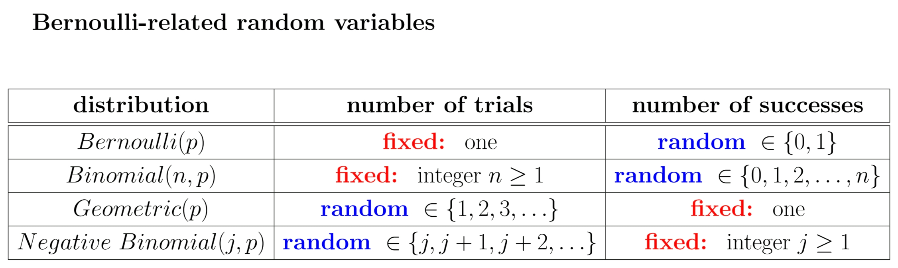

# ECE313 Probability with Engrg Applic

## Foundations

$$
P\{B|A\}=\frac{P\{AB\}}{P\{A\}}
$$

- 在A的情况下发生B事件的概率

## Discrete-type random variables

伯努利分布 (Bernoulli Distribution)、二项分布 (Binomial Distribution) 和泊松分布 (Poisson Distribution) 都是离散概率分布，它们用于描述随机事件发生的次数或结果的概率。它们之间存在密切联系，但适用于不同的场景和条件。

### 伯努利分布 (Bernoulli Distribution)

定义： 伯努利分布是单个伯努利试验（Bernoulli Trial）的概率分布。一个伯努利试验只有两种可能的结果：成功（通常记为1）或失败（通常记为0）。

参数： 只有一个参数 p，表示成功的概率。失败的概率是 1−p。

例子：抛一次硬币，出现正面的概率（成功）是 p，出现反面（失败）是 1−p。一次产品质量检测，产品合格（成功）或不合格（失败）。

特点： 它是最基本的离散概率分布，是二项分布的基础。

$E[X]期望=1*p+0(1-p)=p$

$Var(X)方差=(1-p)p$

### 二项分布 (Binomial Distribution)

定义： 二项分布描述了在固定数量 (n) 的独立伯努利试验中，成功次数 (k) 的概率。

参数：

- n：试验的总次数。
- p：每次试验成功的概率（在所有试验中保持不变）。

公式： $P(X=k)=C(n,k)∗p^k∗(1−p)^{n−k}$，其中 C(n,k) 是二项式系数，表示从 n 次试验中选择 k 次成功的方法数。

例子：抛10次硬币，出现5次正面的概率。在100个产品中，有5个不合格的概率（假设每个产品不合格的概率相同且独立）。

特点：

- 试验次数是固定的。
- 每次试验只有两个结果（成功或失败）。
- 每次试验的成功概率是常数。
- 试验之间是相互独立的。
- 伯努利分布是二项分布的一个特例，当 n=1 时，二项分布就变成了伯努利分布。

期望与方差:

- $E[X]期望=np$
- $Var(X)方差=np(1-p)$

### Negative Binomial Distribution

**定义：** 负二项分布描述了在一系列独立的伯努利试验中，达到预设的成功次数（r）之前，所经历的失败次数（k）的概率。另一种常见的定义是，为了取得 r 次成功，所需总试验次数（k+r）的概率。

**参数：**

- **r：** 预先设定的成功总次数 (r > 0)。
- **p：** 单次试验成功的概率（在所有试验中保持不变）。

**公式：** 负二项分布有两种常见的公式定义：

1. **定义失败次数 k 的概率：** $P(X=k) = C(k+r−1,k)⋅p^r⋅(1−p)^k$ 这里，X 代表在达到 r 次成功前，失败的次数。C(k+r−1,k) 是组合数，表示在总共 k+r-1 次试验中（不包括最后一次成功），选择 k 次失败的方法数。
2. **定义总试验次数 n 的概率：** $P(Y=n) = C(n−1,r−1)⋅p^r⋅(1−p)^{n−r}$ 这里，Y 代表为了达到 r 次成功，总共需要的试验次数 (n = k+r)。C(n−1,r−1) 表示在前 n-1 次试验中，选择 r-1 次成功的方法数（因为第 n 次必须是成功）。

**例子：**

- 投篮命中率是30%，连续投中5个球之前，总共投失了多少次的概率。
- 一个网站的转化率是5%，为了获得10个注册用户，需要向多少个用户展示广告的概率。

**特点：**

- 试验之间是相互独立的。
- 每次试验只有两个结果（成功或失败），且成功概率 p 保持不变。
- 试验会一直进行，直到达到一个预设的成功次数为止（试验次数不固定）。
- 几何分布 (Geometric Distribution) 是负二项分布的一个特例。当 r=1 时，负二项分布就变成了几何分布，即为了取得第一次成功需要进行多少次试验。

**期望与方差** (基于失败次数 k 的定义):

- $E[X] (期望) = \frac{r(1−p)}{p}$
- $Var(X) (方差) = \frac{r(1−p)}{p^2}$

### 几何分布（Geometric Distribution）

定义：离散型概率分布，在n次伯努利试验中，试验k次才得到第一次成功的机率，即前k-1次皆失败，第k次成功的概率。几何分布是帕斯卡分布当r=1时的特例。

$\mu_X=\frac{1}{p}$

$\sigma_x^2=\frac{1-p}{p^2}$

### 泊松分布 (Poisson Distribution)

定义： 泊松分布描述了在给定时间间隔或空间区域内，某个稀有事件发生次数的概率。它通常用于建模单位时间或空间内事件发生的频率。

参数： 只有一个参数 λ (lambda)，表示在给定时间间隔或空间区域内事件发生的平均次数（或平均速率）。

公式： $P(X=k)=\frac{λk∗e^{−λ}}{k!}$

例子：

- 某呼叫中心每小时接到的电话数量。
- 某本书中每页的印刷错误数量。
- 某路口每分钟通过的车辆数量。

特点：

- 事件是稀有的，即在很短的时间或很小的区域内，事件发生的概率非常小。
- 事件的发生是独立的。
- 平均发生率 λ 在整个时间或空间间隔内是恒定的。
- 事件可以在任何时间点或空间位置发生。
- 当二项分布中的 n 很大且 p 很小（通常 n≥20,p≤0.05 或 n≥100,np≤10），且 np 趋于一个有限值 λ 时，二项分布可以近似为泊松分布。

### Bayes rule

$P(B|A)=P(A|B)\frac{P(B)}{P(A)}$

Union bound

## Continuous-type random variables

### Cumulative distribution functions(CDFs)

### Probability density functions(PDFs)

Metrics for Evaluating a Classifier

