# ECE408/CS483 Applied Parallel Programming


> https://canvas.illinois.edu/courses/60979/assignments/syllabus 
>
> https://uiuc.chat/ECE408FA25/chat


## Introduction

CPU(central processing unit)

GPU(graphical processing unit)

### Post-Dennard technology pivot – parallelism and heterogeneity

**The Moore’s Law** (Imperative) drove feature sizes down, doubling the number of transistors/unit area every 18-24 months

- Exponential increase in clock speed

**Dennard Scaling** (based on physics) drove clock speeds up

- ended around 2005-2006

**multicore**: execution speed of sequential programs

**many-thread**: execution throughput of parallel applications

### CPU vs GPU

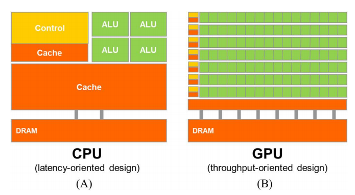

|                             CPU                              |                            GPU                             |
| :----------------------------------------------------------: | :--------------------------------------------------------: |
|        A few powerful **ALUs**(Arithmetic Logic Unit)        |                      Many small ALUs                       |
|                  Reduced operation latency                   |             **Long latency, high throughput**              |
|                       Large **caches**                       |          Heavily pipelined for further throughput          |
| Convert long latency memory accesses to short latency cache accesses |                      Small **caches**                      |
|                  Sophisticated **control**                   |             More area dedicated to computation             |
|         Branch prediction to reduce control hazards          |                     Simple **control**                     |
|            Data forwarding to reduce data hazards            |             More area dedicated to computation             |
|         Modest multithreading to hide short latency          | A massive number of threads to hide the very high latency! |
|                   **High clock frequency**                   |                  Moderate clock frequency                  |

CPUs for **sequential parts** where latency hurts

- CPUs can be 10+X faster than GPUs for sequential code

GPUs for **parallel parts** where throughput wins

- GPUs can be 10+X faster than CPUs for parallel code

### Parallel Programming Frameworks

> [!NOTE]
>
> Why GPUs?
>
> Why repurpose a graphics processing architecture instead of designing a throughput-oriented architecture from scratch?
>
> - Chips are expensive to build and require a large volume of sales to amortize the cost
> - This makes the chip market very difficult to penetrate
> - When parallel computing became mainstream, GPUs already had (and still have) a large installed base from the gaming sector

#### Parallel Computing Challenges

Massive Parallelism demands Regularity -> Load Balance

Global Memory Bandwidth -> Ideal vs. Reality

Conflicting Data Accesses Cause Serialization and Delays 

- Massively parallel execution cannot afford serialization
- Contentions in accessing critical data causes serialization

#### Parallel Computing Pitfall（陷阱）

Consider an application where:

1. The sequential execution time is 100s
2. The fraction of execution that is parallelizable is 90%
3. The speedup achieved on the parallelizable part is 1000×

What is the overall speedup of the application?
$$
t_{parallel}=(1-0.9)\times 100s +\frac{0.9 \times 100s}{1000}=10.09s\\
speedup=\frac{t_{sequential}}{t_{parallel}}=\frac{100s}{10.09s}=9.91\times \text{（9.91为倍数）}
$$

#### Amdahl's Law

**阿姆达尔定律**：[处理器](https://zh.wikipedia.org/wiki/中央處理器)[并行运算](https://zh.wikipedia.org/wiki/並行運算)之后效率提升的能力

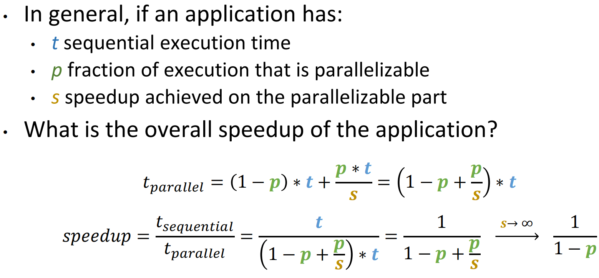

The maximum speedup of a parallel program is limited by the fraction of execution that is parallelizable, namely, $speedup<\frac{1}{1-p}$

## Introduction to CUDA C and Data Parallel Programming

### Types of Parallelism

|                       Task Parallelism                       |                       Data Parallelism                       |
| :----------------------------------------------------------: | :----------------------------------------------------------: |
|   Different operations performed on same or different data   |         Same operations performed on different data          |
| Usually, a modest number of tasks unleashing a modest amount of parallelism | Potentially massive amounts of data unleashing massive amounts of parallelism(Most suitable for GPUs) |
| 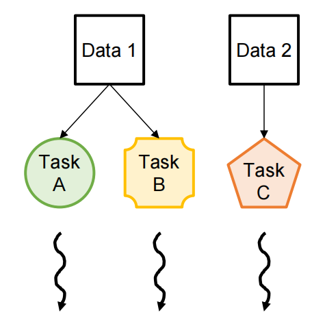 | 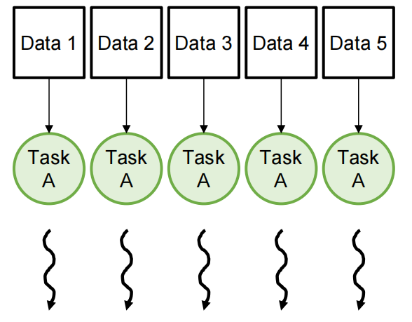 |

### CUDA/OpenCL Execution Mode

**Integrated Host +Device Application(C Program)**

1. The execution starts with *host code* (CPU serial code).
2. When a kernel function is called, a large number of *threads* are launched on a device to execute the kernel. All the threads that are launched by a kernel call are collectively called a **grid**. 
3. These threads are the primary vehicle of parallel execution in a CUDA platform
4. When all threads of a grid have completed their execution, the grid terminates, and the execution continues on the host until another grid is launched

- **Host Code (C):**Handles serial or modestly parallel tasks
- **Device Kernel (C,SPMD Model):**Executes highly parallel sections of the program

### Threads

A CUDA **kernel** is executed as a grid(array) of threads

- All threads in the same grid run the **same kernel**
- Single Program Multiple Data (SPMD model)
- Each thread has a **unique index** that it uses to compute memory addresses and make control decisions

Thread as a basic unit of computing

- Threads within a block cooperate via **shared memory, atomic operations** and **barrier synchronization**.  块内的线程通过**共享内存、原子操作**和**屏障同步**进行协作。
- Threads in different blocks cooperate less.

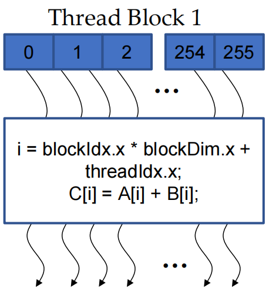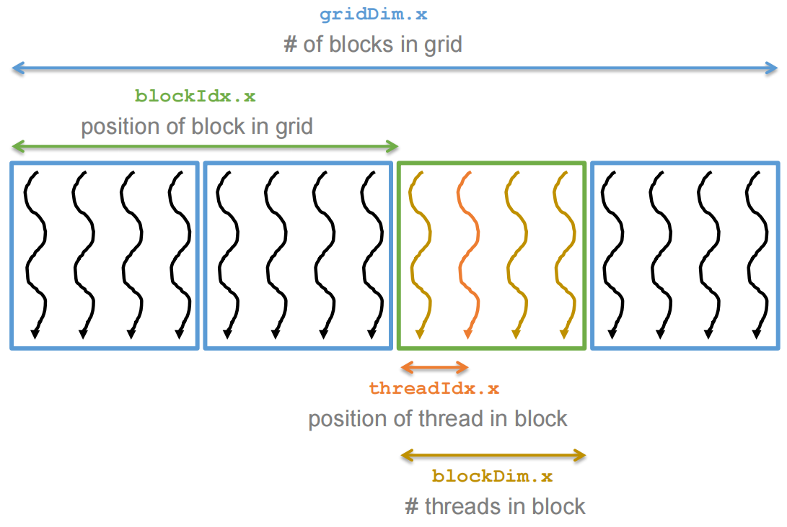

- Thread block and thread organization simplify memory addressing when processing multidimensional data
- `i = blockIdx.x * blockDim.x + threadIdx.x; C[i] = A[i] + B[i];`

### Vector Addition

We use vector addition to demonstrate the CUDA C program structure.

A simple traditional vector addition C code example.

```c
// Compute vector sum C = A+B
void vecAdd(float* A, float* B, float* C, int n) {
    for (i = 0, i < n, i++) {
        C[i] = A[i] + B[i];
    }
}
int main() {
    // Memory allocation for A_h, B_h, and C_h
    // I/O to read A_h and B_h, N elements...
    vecAdd(A_h, B_h, C_h, N);
}

```

主机的变量名称后缀为`_h`，使用设备的变量名称后缀为`_d`

#### System Organization

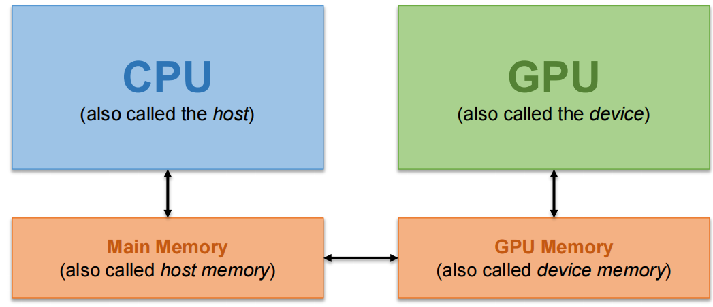

The CPU and GPU have **separate memories** and **cannot access** each others' memories

- Need to **transfer** data between them（下图五步操作）

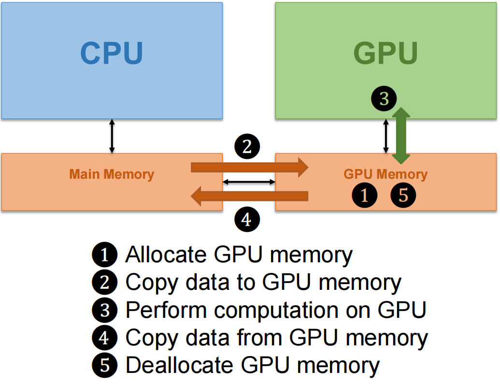

#### A vector addition kernel

Outline of a revised vecAdd function that moves the work to a device.

```c
#include <cuda.h>
void vecAdd(float* A, float* B, float* C, int n) {
int size = n* sizeof(float); 
float *A_d, *B_d, *C_d;
…
1. // Allocate device memory for A, B, and C
// copy A and B to device memory 
2. // Kernel launch code – to have the device
// to perform the actual vector addition
3. // copy C from the device memory
// Free device vectors
```

`vector A + B = vector C`

Device code can:

- R/W per-thread registers
- R/W per-grid global memory

Host code can transfer data to/from per grid global memory

### CUDA Device Memory Management API

#### API for managing device global memory

**Allocating memory**

```c
/*Allocating memory*/
cudaError_t cudaMalloc(void **devPtr, size_t size)
//devPtr: Pointer to pointer to allocated device memory
//size: Requested allocation size in byte
                             
/*VecAdd Host Code*/
//详见下面
```

**Deallocating memory**

```c
cudaError_t cudaFree(void *devPtr)
//devPtr: Pointer to device memory to free
```

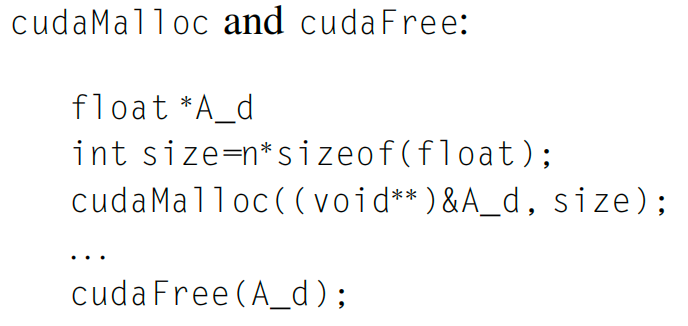

- 指向设备全局内存中对象的指针变量后缀为`_d`
- `A_d`, `B_d` 和 `C_d` 中的地址指向设备全局内存 device global memory 中的位置。这些地址不应在主机代码中间接引用。它们应该在调用 API 函数和内核函数时使用。

**Copying memory**

```c
cudaError_t cudaMemcpy(void *dst, const void *src, size_t count, enum cudaMemcpyKind kind)
  
//Example
cudaMemcpy(A_d, A_h, size, cudaMemcpyHostToDevice);
cudaMemcpy(B_d, B_h, size, cudaMemcpyHostToDevice);
. . . 
cudaMemcpy(C_h, C_d, size, cudaMemcpyDeviceToHost);
```

- `dst`: Destination memory address
- `src`: Source memory address
- `count`: Size in bytes to copy
- `kind`: Type of transfer
    - `cudaMemcpyHostToHost`
    - `cudaMemcpyHostToDevice`
    - `cudaMemcpyDeviceToHost`
    - `cudaMemcpyDeviceToDevice`

**Return type**: `cudaError_t`

- Helps with error checking (discussed later)

**vecAdd Host Code**

完整版本

```c
void vecAdd(float* A, float* B, float* C, int n) {
    int size = n * sizeof(float); 
    float *A_d, *B_d, *C_d;
    // Transfer A and B to device memory (error-checking omitted)
    cudaMalloc((void **) &A_d, size);
    cudaMemcpy(A_d, A, size, cudaMemcpyHostToDevice);
    cudaMalloc((void **) &B_d, size);
    cudaMemcpy(B_d, B, size, cudaMemcpyHostToDevice);
    // Allocate device memory for
    cudaMalloc((void **) &C_d, size);
    // Kernel invocation code – to be shown later
        …
          
    // Transfer C from device to host
    cudaMemcpy(C, C_d, size, cudaMemcpyDeviceToHost);
    // Free device memory for A, B, C
    cudaFree(A_d); 
		cudaFree(B_d); 
  	cudaFree(C_d);
}
```

Simple strategy of **Parallel Vector Addition**: assign one GPU **thread** per vector element

#### Launching a Grid

Threads in the same grid execute the same function known as a **kernel**

A grid can be launched by calling a kernel and configuring it with appropriate grid and block sizes:

```c
const unsigned int numThreadsPerBlock = 512;
const unsigned int numBlocks = n/numThreadsPerBlock;
vecAddKernel <<< numBlocks, numThreadsPerBlock >>> (A_d, B_d, C_d, n);
```

If n is not a multiple of `numThreadsPerBlock`, fewer threads will be launched than desired

- Solution: use the ceiling to launch extra threads then omit the threads after the boundary:

```c
vecAddKernel <<< ceil(n/256.0), 256 >>> (A_d, B_d, C_d, n);
```

**More Ways to Compute Grid Dimensions**

```c
// Example #1
dim3 DimGrid(n/numThreadsPerBlock, 1, 1);
if (0 != (n % numThreadsPerBlock)) { DimGrid.x++; }
dim3 DimBlock(numThreadsPerBlock, 1, 1);
vecAddKernel<<<DimGrid, DimBlock>>>(A_d, B_d, C_d, n);
// Example #2
const unsigned int numBlocks;
numBlocks = (n + numThreadsPerBlock – 1)/numThreadsPerBlock;

vecAddKernel<<<numBlocks, numThreadsPerBlock>>>(A_d, B_d, C_d, n);
```

#### Vector Addition Kernel

```c
// Compute vector sum C = A+B
// Each thread performs one pair-wise addition
__global__
    void vecAddKernel(float* A_d, float* B_d, float* C_d, int n)
{
    int i = blockIdx.x * blockDim.x + threadIdx.x;
    if (i<n) C_d[i] = A_d[i] + B_d[i];
}
int vecAdd(float* A, float* B, float* C, int n)
{
    // A_d, B_d, C_d allocations and copies omitted 
    // Run ceil(n/256) blocks of 256 threads each
    dim3 DimGrid(ceil(n/256), 1, 1);
    dim3 DimBlock(256, 1, 1);
    vecAddKernel<<<DimGrid,DimBlock>>>(A_d, B_d, C_d, n);
}
```

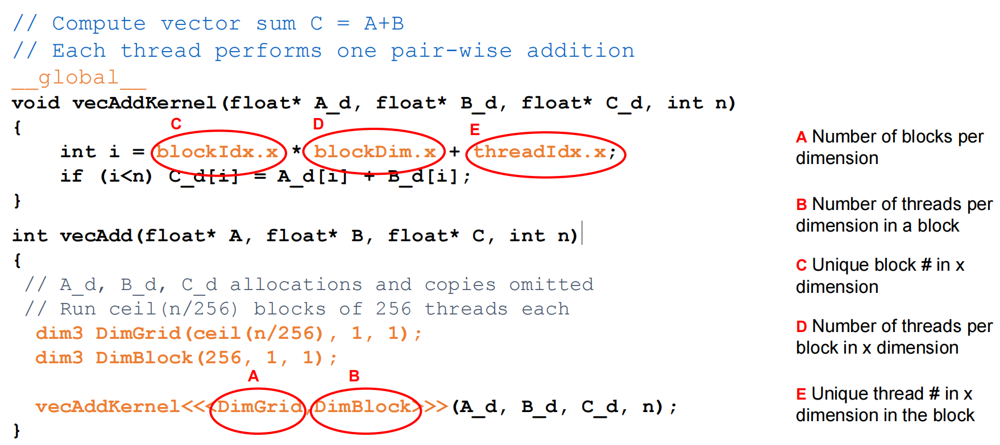

### Compiling A CUDA Program

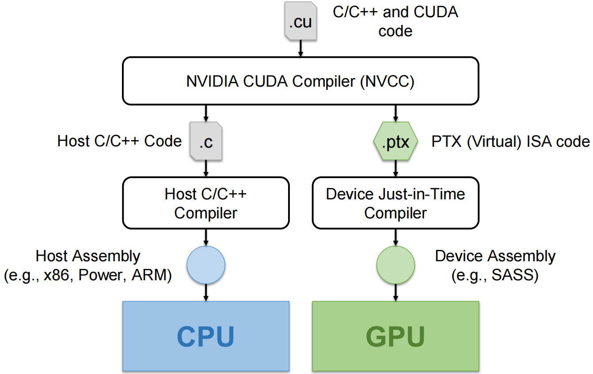

#### Function Declarations in CUDA

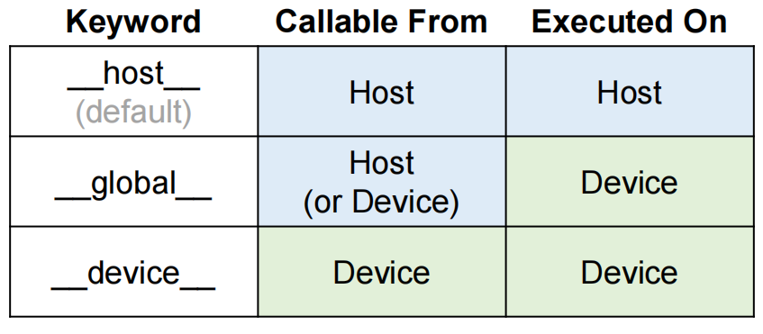

`__global__` defines a kernel function

`__device__` and `__host__` can be used together

#### More on Function Declarations

The keyword `__host__` is useful when needing to mark a function as executable on both the host and the device

```c
__host__ __device__ float f(float a, float b) {
    return a + b;
}
void vecadd(float* x, float* y, float* z, int N) {
    for(unsigned int i = 0; i < N; ++i) {
        z[i] = f(x[i], y[i]);
    }
}
__global__ void vecadd_kernel(float* x, float* y, float* z, int N) {
    int i = blockDim.x*blockIdx.x + threadIdx.x;
    if (i < N) {
        z[i] = f(x[i], y[i]);
    }
}
```

#### Asynchronous Kernel Calls

By default, kernel calls are **asynchronous** 异步

- Useful for overlapping GPU computations with CPU computations

Use the following API function to wait for the kernel to finish

```c
cudaError_t cudaDeviceSynchronize()
```

- Blocks until the device has completed all preceding requested tasks

#### Error Checking

All CUDA API calls return an error code `cudaError_t` that can be used to check if any errors occurred

```c
cudaError_t err = ...;
if (err != cudaSuccess) {
    printf("Error: %s\n"
           , cudaGetErrorString(err));
    exit(0);
}
```

For kernel calls, one can check the error returned by `cudaDeviceSynchronize()` or call the following API function:`cudaError_t cudaGetLastError()`

### Problems

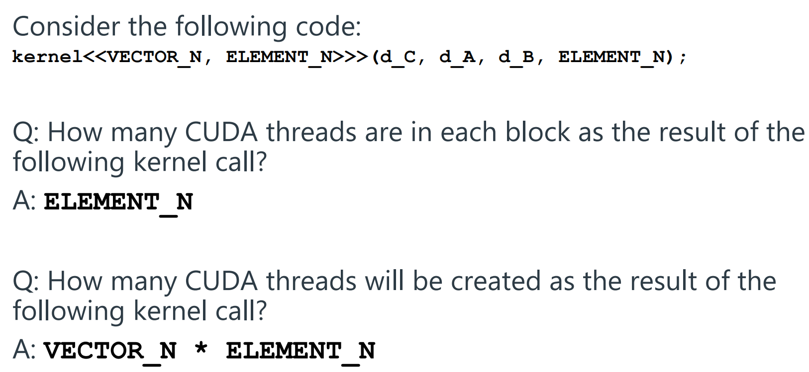

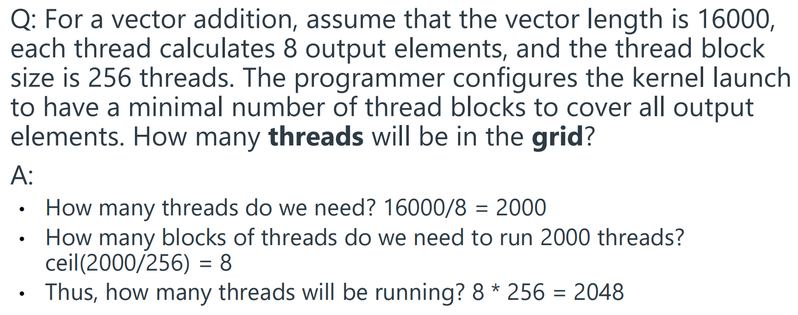

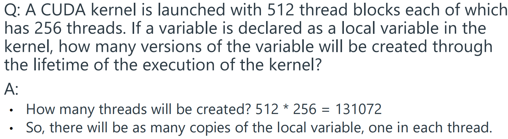

## CUDA Parallel Execution Model: Multidimensional Grids & Data

### CUDA Thread Grids are Multi-Dimensional

CUDA supports multidimensional grids (==up to 3D==)

Each CUDA kernel is executed by a grid,

- a 3D array of thread blocks, which are 3D arrays of threads.
- Each thread executes the same program on distinct data inputs, a **single-program, multiple-data (SPMD) model**

**Grid - block - thread**

- `gridDim` - `blockIdx` - `threadIdx`

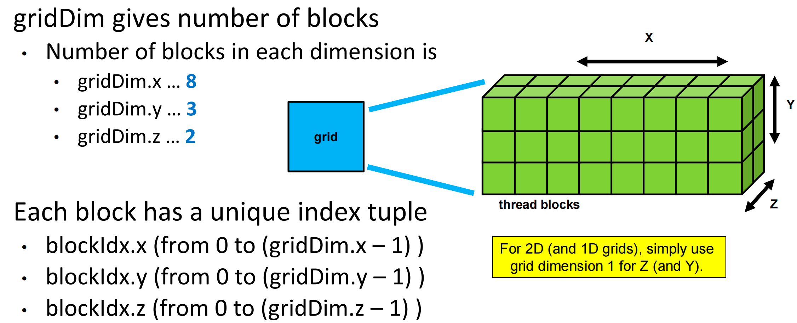

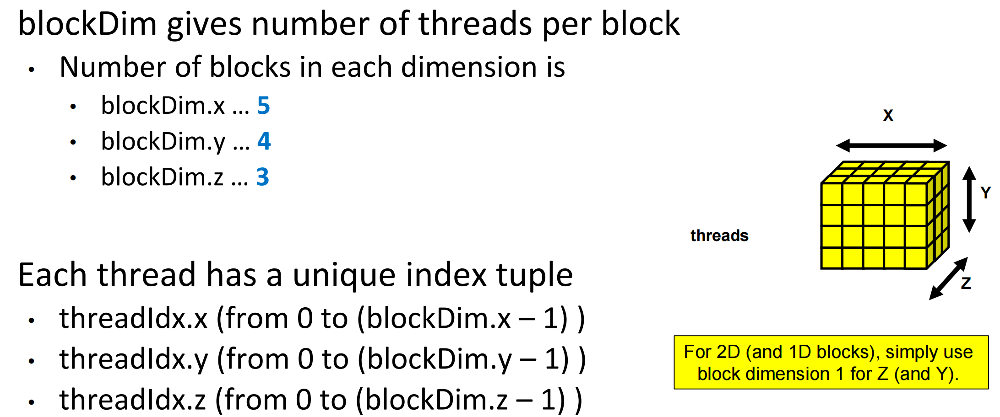

-   Thread block and thread organization **simplifies memory addressing** when processing multidimensional data

#### One Dimensional Indexing

Defining a working set for a thread

- `i = blockIdx.x * blockDim.x + threadIdx.x;`
- 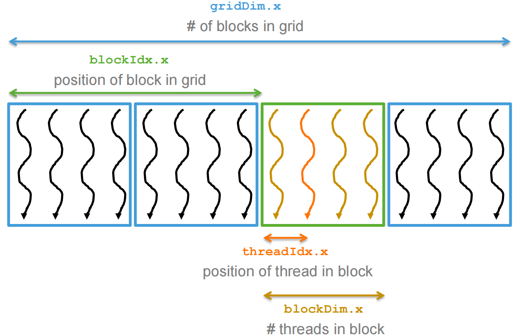

#### Multidimensional Indexing

Defining a working set for a thread

- `row = blockIdx.y * blockDim.y + threadIdx.y;`
- `col = blockIdx.x * blockDim.x + threadIdx.x;`
- 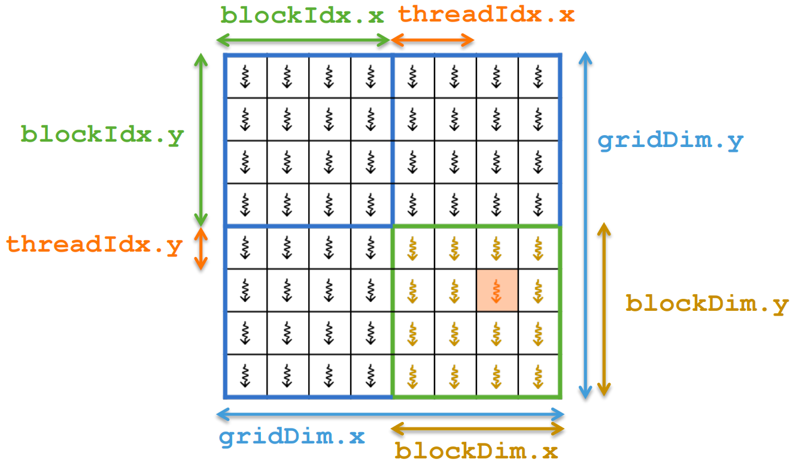

### Configuring Multidimensional Grids

#### Use built-in `dim3` type

```c
dim3 numThreadsPerBlock(32, 32); // 2D
dim3 numBlocks(
(width + numThreadsPerBlock.x - 1) / numThreadsPerBlock.x,
(height + numThreadsPerBlock.y - 1) / numThreadsPerBlock.y );

kernel <<< numBlocks, numThreadsPerBlock >>> (…kernel args…);
```

#### Layout of Multidimensional Data

- Convention is C is to store data in **row** major order
- Elements in the **same row** are **contiguous** in memory
- `index = row * width + col`

#### RGB to Gray-Scale Kernel Implementation

```c
__global__
  void rgb2gray_kernel(unsigned char* red, unsigned char* green, unsigned char* blue, unsigned char* gray, unsigned int width, unsigned int height) 
{
  unsigned int row = blockIdx.y*blockDim.y + threadIdx.y;
  unsigned int col = blockIdx.x*blockDim.x + threadIdx.x;
  
  // Convert the pixel
  if (row < height && col < width) {
    gray[row*width + col] = red[row*width + col]*3/10
      + green[row*width + col]*6/10 + blue[row*width + col]*1/10;}
}
```

#### Blur Kernel Implementation

Output pixel is the average of the corresponding input pixel and the pixels around it

**Parallelization approach**: assign one thread to each output pixel, and have it read multiple input pixels

- Given two N × N matrices, A and B, we can multiply A by B to compute a third N × N matrix, P: P = AB

```c
__global__ void blur_kernel(unsigned char* image, unsigned char* blurred, 
                            unsigned int width, unsigned int height) 
{
  int outRow = blockIdx.y*blockDim.y + threadIdx.y;
  int outCol = blockIdx.x*blockDim.x + threadIdx.x;
  if (outRow < height && outCol < width) 
  {
    unsigned int average = 0;
    for(int inRow = outRow - BLUR_SIZE; inRow < outRow + BLUR_SIZE + 1; ++inRow) {
      for(int inCol = outCol - BLUR_SIZE; inCol < outCol + BLUR_SIZE + 1; ++inCol) {
        if (inRow >= 0 && inRow < height && inCol >= 0 && inCol < width) { // add this to deal with boundary conditions
          
average += image[inRow*width + inCol];
				}
      }
    }
    blurred[outRow*width + outCol] =
      (unsigned char)(average/((2*BLUR_SIZE + 1)*(2*BLUR_SIZE + 1)));
  }
}
```

> [!NOTE]
>
> **Rule of thumb:** every memory access must have a corresponding guard that compares its indexes to the array dimensions

### Matrix-Matrix Multiplication

Given two N × N matrices, A and B, we can multiply A by B to compute a third N × N matrix, P: $P = AB$

- 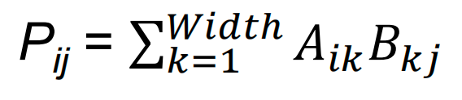矩阵相乘，一行✖️一列
- **Parallelization approach**: assign one thread to each element in the output matrix (C)

```c
__global__ void mm_kernel(float* A, float* B, float* C, unsigned int N) 
{
  unsigned int row = blockIdx.y*blockDim.y + threadIdx.y;
  unsigned int col = blockIdx.x*blockDim.x + threadIdx.x;
  float sum = 0.0f;
  for(unsigned int i = 0; i < N; ++i) {
    sum += A[row*N + i]*B[i*N + col];
  }
  C[row*N + col] = sum;
}
```


## Compute Architecture and Scheduling

### Executing Thread Blocks

Threads are assigned to **Streaming Multiprocessors** in block granularity 块粒度的流多处理器

-   Up to **32** blocks to each SM
-   SMs can take up to **2048** threads

Threads run concurrently 并行

-   SM maintains thread/block id #s
-   SM manages/schedules thread execution

#### GPU Architecture

A GPU consists of multiple Streaming Multiprocessor (SMs), each consisting of multiple cores with *shared control and memory*

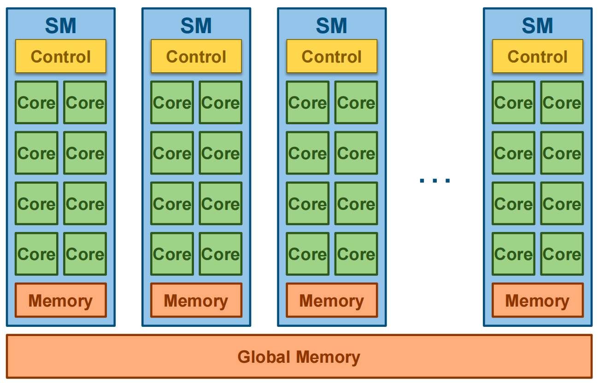

#### Assigning Blocks to SMs

Threads are assigned to SMs at block granularity

-   One/more thread to one SM
-   The remaining block wait for others to finish
-   **All threads in a block** are assigned to the **same** SM

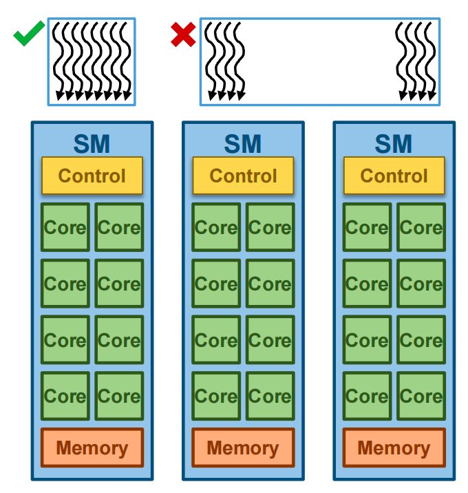

-   **All threads in a block** are assigned to an SM **simultaneously** 同时分配
    -   A block cannot be assigned to an SM until it secures enough resources for all its threads to execute; 
    -   Otherwise, if some threads reach a barrier and others cannot execute, the system could deadlock


Threads in the **same block** can **collaborate** in ways that threads in different blocks cannot:

-   Lightweight barrier synchronization: `__syncthreads()`
    -   Wait for all threads in the block to reach the barrier before any thread can proceed

-   Shared memory (discussed later)
    -   Access a fast memory that only threads in the same block can access

-   Others (discussed later)

#### Synchronization across Thread Blocks

If threads in different blocks **do not synchronize** with each other

-   Blocks can execute in any order
-   Blocks can execute both in parallel with each other or sequentially with respect to each other
-   Enables **transparent scalability** 透明的可拓展性
    -   Same code can run on different devices with different amounts of hardware parallelism
    -   Execute blocks sequentially if device has few SMs
    -   Execute blocks in parallel if device has many SMs


If threads in different blocks to **synchronize** with each other

-   Deadlock may occur if the synchronizing blocks are not scheduled simultaneously
-   **Cooperative groups** 合作组 (covered later) allows *barrier synchronization* across clusters of thread blocks, or across the entire grid by limiting the number of blocks to guarantee that all blocks are executing simultaneously

-   Other techniques (covered later) allow **unidirectional synchronization** 间接同步 by ensuring that the producer block is scheduled before the consumer block

### SM Scheduling

Blocks assigned to an SM are further divided into **warps** which are *the unit of scheduling*

-   The SM cores are organized into **processing blocks** 处理快, with each processing block having its own warp 
    scheduler to execute multiple warps concurrently

#### Warps

The size of warps is device-specific, but has always been 32 threads to date

Threads in a warp are scheduled together on a processing block and executed following the **SIMD** model

-   <u>S</u>ingle <u>I</u>nstruction, <u>M</u>ultiple <u>D</u>ata
-   One instruction is fetched and executed by all the threads in the warp, each processing different  data

#### Thread Scheduling

Each block is executed as **32-thread warps**

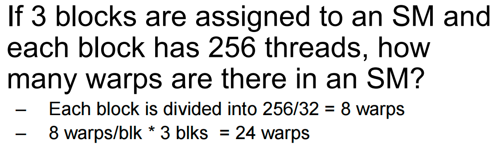

SM 实现零开销 Warp 调度

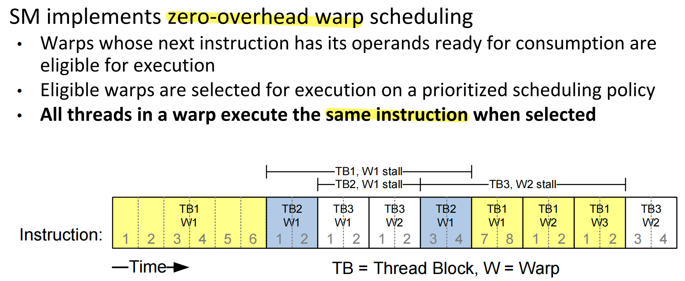

#### Why SIMD?

**Advantage**

-   Share the same instruction fetch/dispatch unit across multiple execution units (cores)

**Disadvantage**

-   Different threads taking different execution paths result in **control divergence**
    -   Warp does a pass over each unique execution path
    -   In each pass, threads taking the path execute while others are disabled

-   The percentage of threads/cores enabled during SIMD execution is called the **SIMD efficiency**


Control Divergence Example

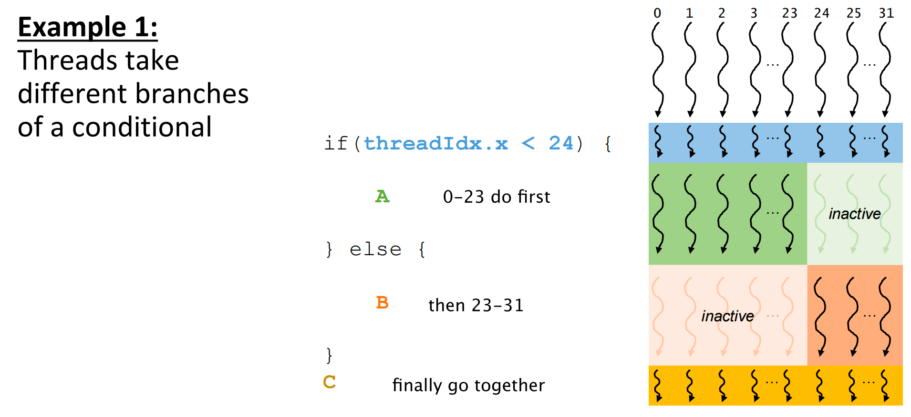

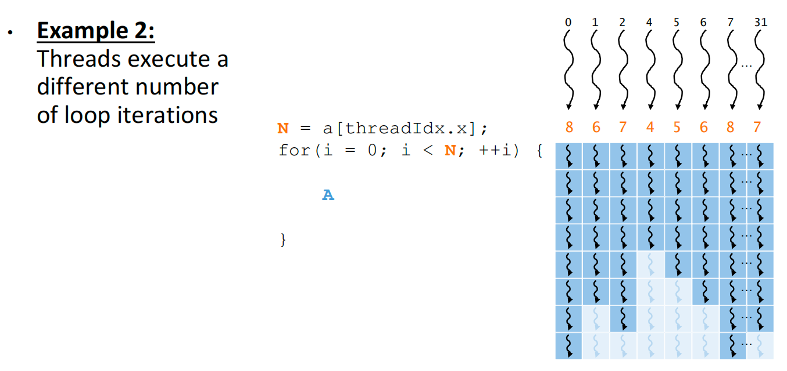

>   [!NOTE]
>
>   If条件中有`threadIdx`相关变量就会产生控制发散

#### Avoiding Branch Divergence

Try to **make branch granularity a multiple of warp size** (remember, it *may not always be 32*!)

```c
if (threadIdx.x / WARP_SIZE > 2) {
// THEN path (lots of lines)
} else {
// ELSE path (lots of lines)
}
```

-   Still has two control paths
-   But all threads in any warp follow only one path

#### Lantency hiding

延迟隐藏

When a warp needs to wait for a high latency operation, another warp that is ready is selected and scheduled for execution

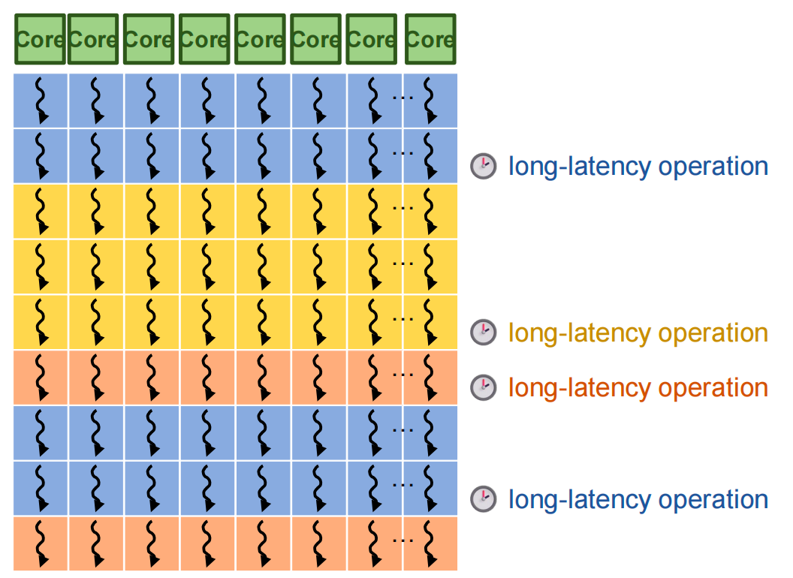

Many warps are needed so that there is sufficient work available to hide long latency operations, i.e., there is high chance of finding a warp that is ready

For this reason, *an SM typically supports many more threads than the number of cores* it has -- Max threads per SM is much higher than cores per SM

#### Occupancy

The **occupancy** 占用率 of an SM refers to the ratio of the warps or threads active on the SM to the maximum allowed

In general, maximizing occupancy is desirable because it improves latency hiding

-   Common case, but possible to have cases where lower occupancy is desirable

Occupancy Example

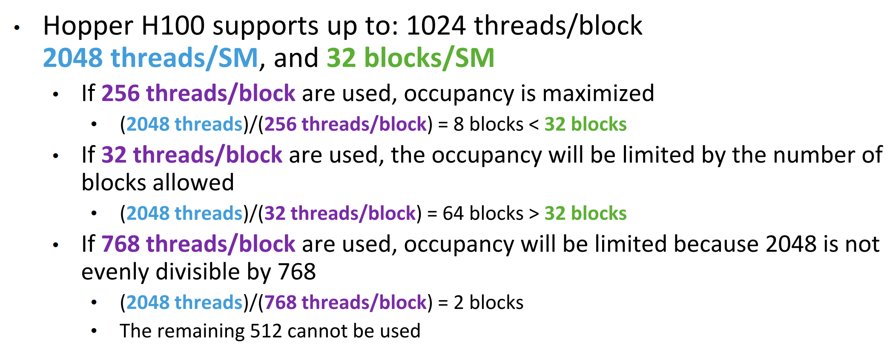

#### Block Granularity Considerations

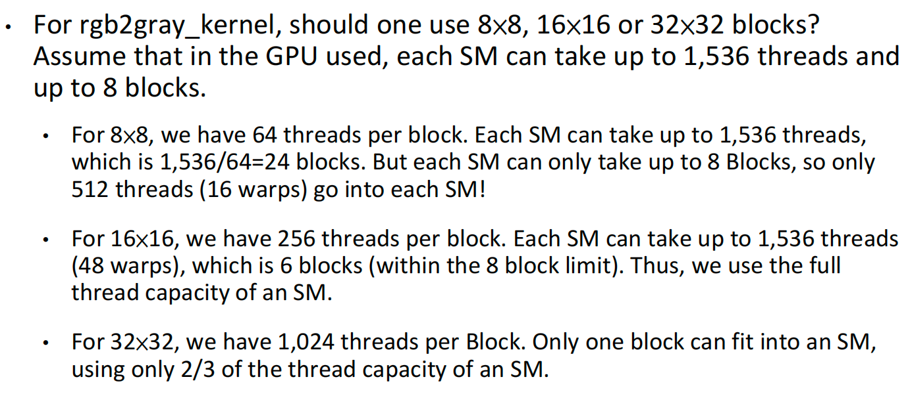

### Problem solving

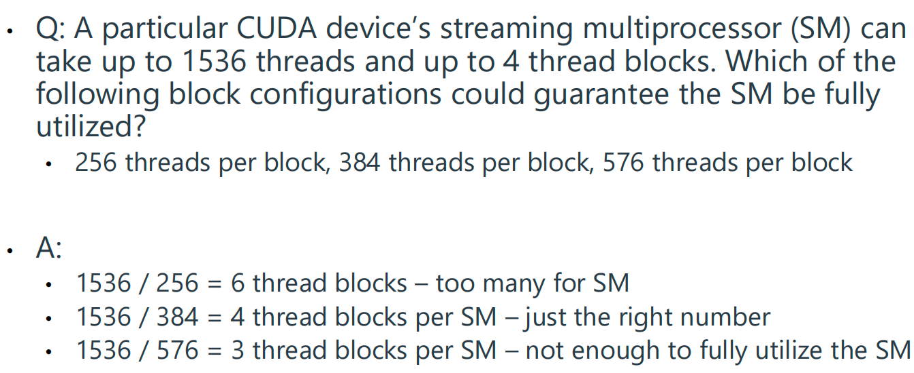

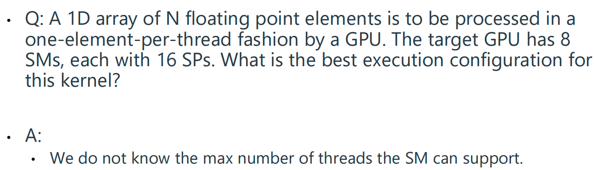

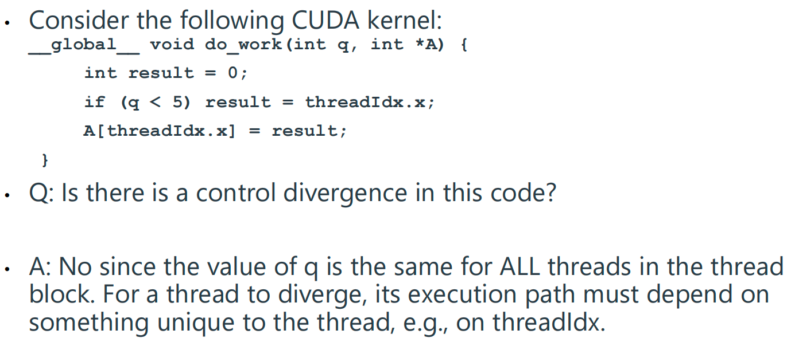

## CUDA Memory Model

#### The Von-Neumann Model

Processing Unit (PU)
• Performs all arithmetic and logical operations
• Includes the Register File, where data is temporarily stored for 
processing
• Memory
• Stores both program instructions and data
• Input/Output (I/O) Subsystem
• Handles communication between the computer and the external 
environment
• Control Unit (CU)
• Directs the execution of instructions by coordinating all components
• All operations are performed on data stored 
in registers within the Processing Unit. Before any 
calculation:
• Data must be fetched from Memory into registers, and
• Instructions must be loaded from Memory into 
the Instruction Register (IR)

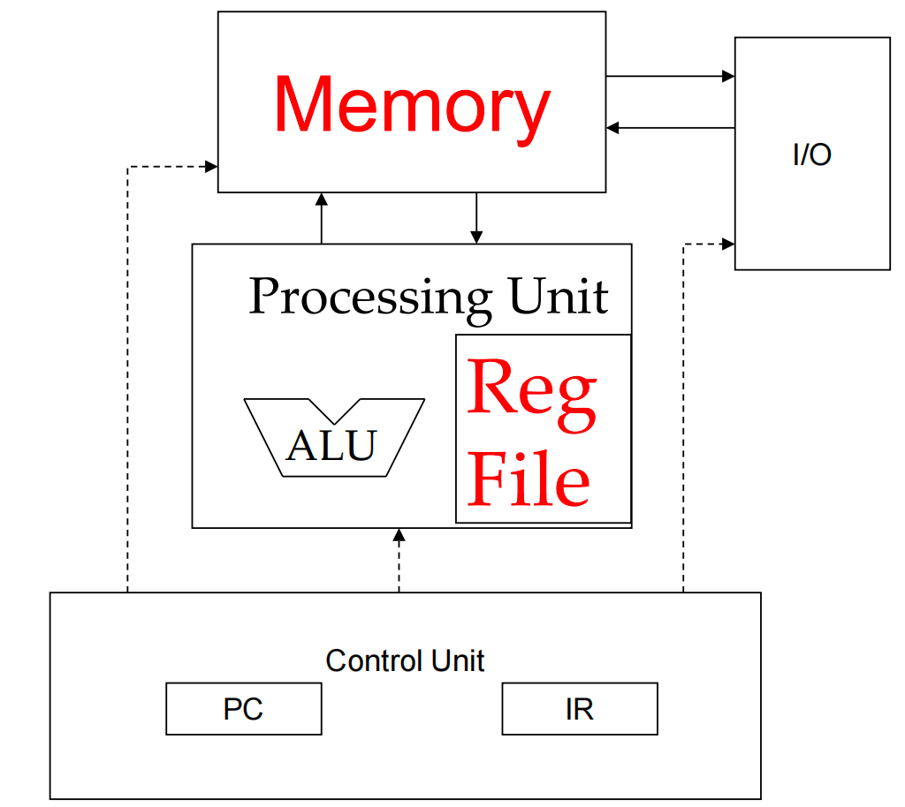

Instruction processing breaks into steps:

Fetch | Decode | Execute | Memory

ADD instruction

LOAD instruction


#### Registers vs Memory

Registers

Fast: 1 cycle; no memory access required

Few: hundreds for CPU, O(10k) for GPU SM

Memory

• Slow: hundreds of cycles

• Huge: GB or more


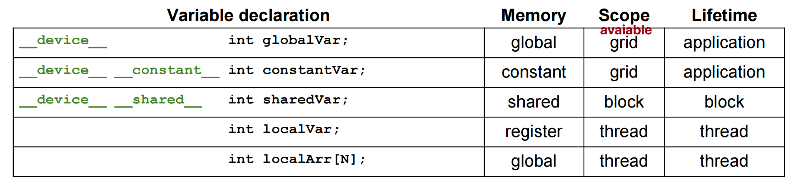


Matrix Multiplication

```c
// Matrix multiplication on the (CPU) host
void MatrixMul(float *M, float *N, float *P, int Width)
{ 
  for (int i = 0; i < Width; ++i)
    for (int j = 0; j < Width; ++j) 
    {
      float sum = 0;
      for (int k = 0; k < Width; ++k) 
      {
        float a = M[i * Width + k];
        float b = N[k * Width + j];
        sum += a * b;
      }
      P[i * Width + j] = sum;
    }
}
```

parallel 


#### Kernel Invocation (Host-side Code)

```c
// TILE_WIDTH is a #define constant
dim3 dimGrid(ceil((1.0*Width)/TILE_WIDTH), 
ceil((1.0*Width)/TILE_WIDTH), 1);
dim3 dimBlock(TILE_WIDTH, TILE_WIDTH, 1);
// Launch the device computation threads!
MatrixMulKernel<<<dimGrid, dimBlock>>>(Md, Nd, Pd, Width);
```

#### Kernel Function

```c
// Matrix multiplication kernel – per thread code
__global__ 
  void MatrixMulKernel(float* d_M, float* d_N, float* d_P, int Width)
{
  // Calculate the row index of the d_P element and d_M
  int Row = blockIdx.y * blockDim.y + threadIdx.y;
  // Calculate the column idenx of d_P and d_N
  int Col = blockIdx.x * blockDim.x + threadIdx.x;
  // Pvalue is used to store the element of the matrix
  // that is computed by the thread
  float Pvalue = 0;
		...
    ...
    d_P[ ] = Pvalue;
}
```

Matrix Multiplication Kernel

```c

```


Reuse Memory Accesses


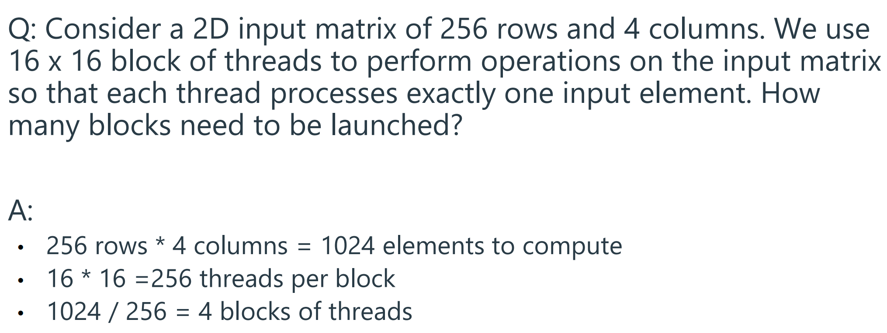

----------

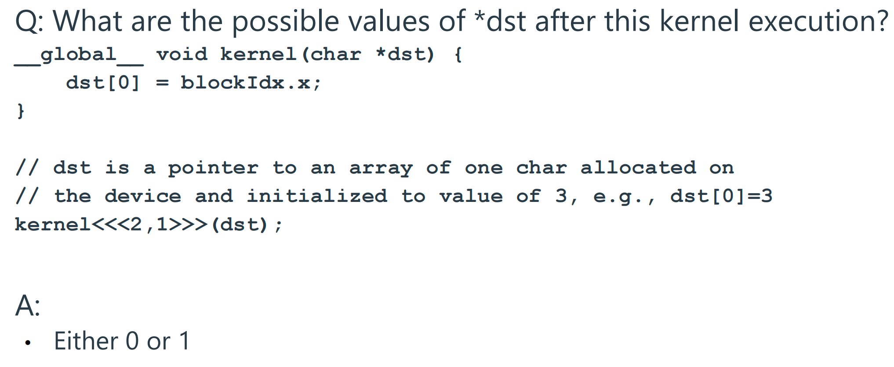

>   The answer is **Either 0 or 1** because of a **race condition**. 🏁
>
>   A race condition occurs when multiple threads try to access and modify the same memory location at the same time, and the final result depends on the unpredictable order in which they execute.
>
>   1.  **Kernel Launch:** The line `kernel<<<2,1>>>(dst);` launches the kernel with a grid of **2 blocks**, and each block contains **1 thread**.
>
>       -   This creates two blocks in total: Block 0 and Block 1.
>       -   For Block 0, the built-in variable `blockIdx.x` is **0**.
>       -   For Block 1, the built-in variable `blockIdx.x` is **1**.
>
>   2.  Conflicting Writes:
>
>       Both threads execute the same instruction, dst[0] = blockIdx.x;, but with different values for blockIdx.x:
>
>       -   The thread from Block 0 executes `dst[0] = 0;`.
>       -   The thread from Block 1 executes `dst[0] = 1;`.
>
>   3.  Unpredictable Order:
>
>       The CUDA programming model does not guarantee the execution order of different blocks. The GPU's scheduler might run Block 0 first, then Block 1, or vice-versa.
>
>       -   **Scenario 1:** Block 1's write is the last one to complete. The initial value at `dst[0]` is overwritten by `0` (from Block 0), and then finally overwritten by **`1`**.
>       -   **Scenario 2:** Block 0's write is the last one to complete. The initial value is overwritten by `1` (from Block 1), and then finally overwritten by **`0`**.
>
>   Since there's no way to know which block will "win" the race to write to `dst[0]` last, the final value stored in that location after the kernel finishes could be either 0 or 1.

## Data Locality and Tiled Matrix Multiply

### Performance Metrics

**FLOPS Rate**: floating point operations per second

-   How much computation a processor’s cores can do per unit time

**Memory Bandwidth**: bytes per second

-   How much data the memory can supply to the cores per unit time

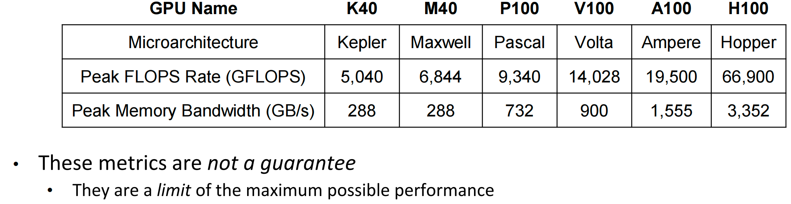

-   FLOPs rate(GLOPS/s)
-   Memory bandwidth(GB/s)

#### Performance Bound and the Roofline Model

A kernel can be:

-   **Compute-bound**: performance limited by the FLOPS rate
    -   The processor’s cores are fully utilized (always have work to do)
-   **Memory-bound**: performance limited by the memory bandwidth
    -   The processor’s cores are frequently idle because memory cannot supply data fast enough

The **roofline model** helps visualize a kernel’s performance bound based on the ratio of operations it 
performs and bytes it accesses from memory

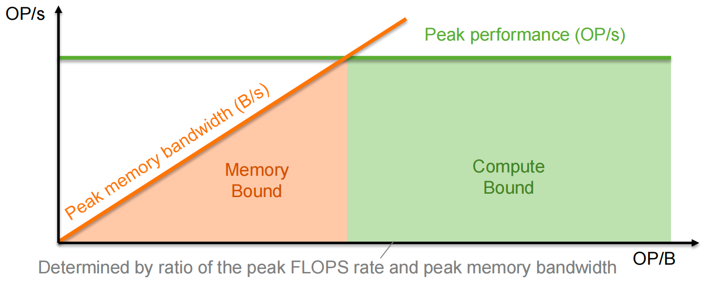

-   先受内存限制后受CPU限制
-   **OP/B ratio**: allows us to determine if a kernel is memory-bound or compute-bound on a specific hardware 根据比例判断类型 
-   *OP/B = operations / data*

Knowing the kernel’s bound allows us to determine the best possible performance 
achievable by the kernel (sometimes called **speed of light**)

#### Example

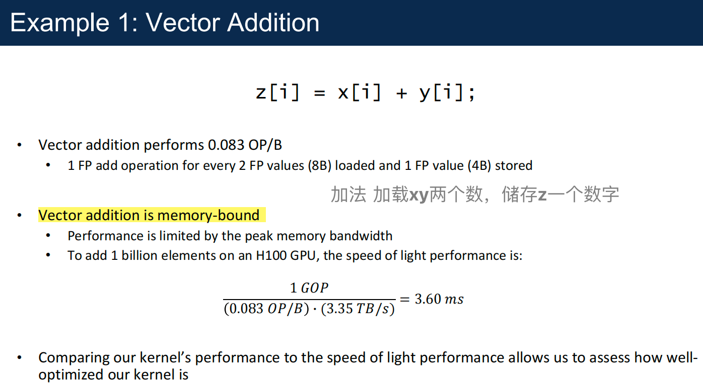

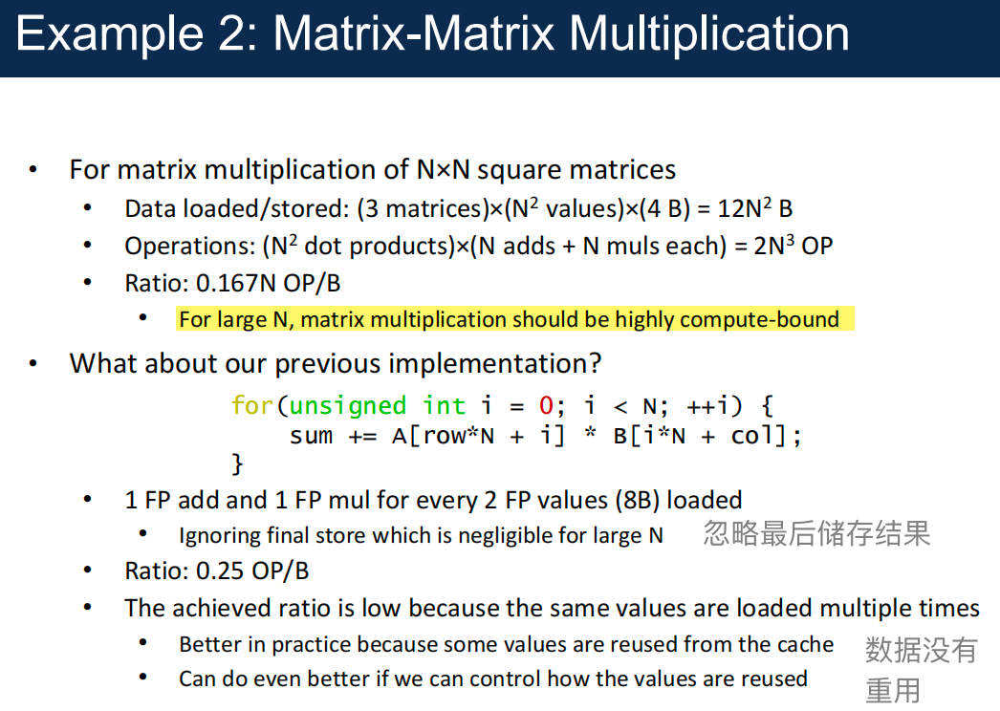

### A Common Programming Strategy

Global memory is implemented with DRAM – slow

Sometimes, we are lucky:

-   The thread finds the data in the L1 cache because it was recently loaded by another thread

Sometimes, we are not lucky:

-   The data gets evicted from the L1 cache before another thread tries to load it

To avoid a Global Memory bottleneck, **==tile the input data==** to take advantage of Shared Memory 将输入数据平铺以利用共享内存：

-   **Partition data into subsets** (*tiles*) that fit into the (smaller but faster) shared memory
-   **Handle each data subset with one thread block** by:
    -   Loading the subset from global memory to shared memory, *using multiple threads to exploit memory-level parallelism* 利用内存级并行性
    -   Performing the computation on the subset from shared memory, each thread can efficiently access 
        any data element
    -   Copying results from shared memory to global memory
-   Tiles are also called blocks in the literature

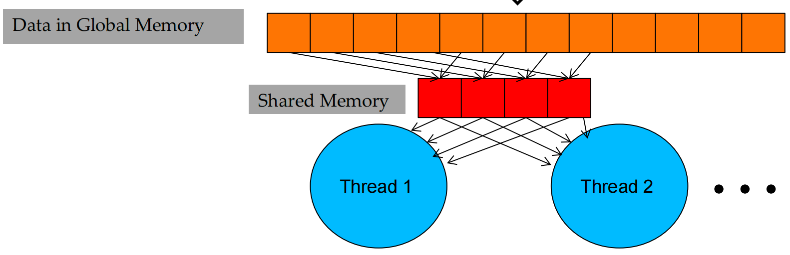


#### Tiled Multiply

平铺策略：Break up the execution of the kernel into phases so that the data accesses in each phase are focused on one tile of 
A and B

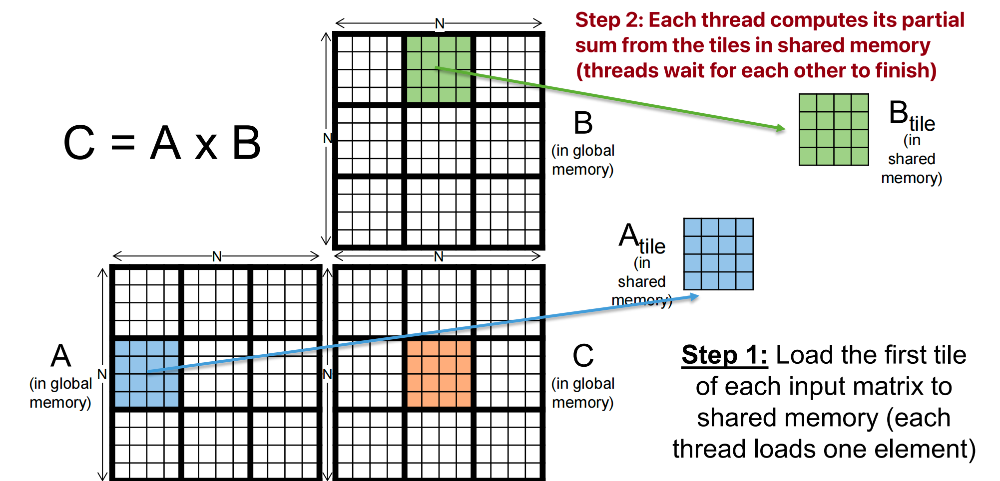

For each tile:

-   Phase 1: Load tiles of A & B into share memory

    -   Each thread loads one A element and one B element in basic tiling code

    -   ```c
        A[Row][1*TILE_WIDTH+tx]
        B[1*TILE_WIDTH+ty][Col]
          
        A[Row][q*TILE_WIDTH+tx]
        A[Row*Width + q*TILE_WIDTH + tx]
          
        B[q*TILE_WIDTH+ty][Col]
        B[(q*TILE_WIDTH+ty) * Width + Col]
        
        //A and B are dynamically allocated and can only use 1D indexing
        ```
        
        

-   Phase 2: Calculate partial dot product for tile of C

    -   ```c
        //To perform the kth step of the product within the tile
        subTileA[ty][k];
        subTileB[k][tx];
        ```

        


#### Tiled Matrix-Matrix Multiplication

```c
// declare arrays in shared memory
__shared__ float A_s[TILE_DIM][TILE_DIM];
__shared__ float B_s[TILE_DIM][TILE_DIM];
unsigned int row = blockIdx.y*blockDim.y + threadIdx.y;
unsigned int col = blockIdx.x*blockDim.x + threadIdx.x;
float sum = 0.0f;
for (unsigned int tile = 0; tile < N/TILE_DIM; ++tile) {
  // Load tile to shared memory
  A_s[threadIdx.y][threadIdx.x] = A[row*N + tile*TILE_DIM + threadIdx.x];
  B_s[threadIdx.y][threadIdx.x] = B[(tile*TILE_DIM + threadIdx.y)*N + col];
  // Compute with tile
  for (unsigned int i = 0; i < TILE_DIM; ++i) {
    sum += A_s[threadIdx.y][i]*B_s[i][threadIdx.x];
  }
}
C[row*N + col] = sum;
```

code inside the tunnel

>   [!IMPORTANT]
>
>   We need to **synchronize**!

### Leveraging Parallel Strategies

Bulk synchronous execution 同步: threads execute roughly in unison

1. Do some work
2. Wait for others to catch up
3. Repeat

Much easier programming model

-   Threads only parallel within a section
-   Debug lots of little programs
-   Instead of one large one

Dominates high-performance applications

#### Bulk Synchronous Steps Based on Barriers

How does it work?

-   Use a **barrier** to wait for thread to 
    ‘catch up.’

A barrier is a synchronization point:

-   each thread *calls a function* to enter the barrier;
-   threads *block* (sleep) in barrier 
    function until all threads have called;
-   *After the last thread* calls the function, all threads *continue* past the barrier.

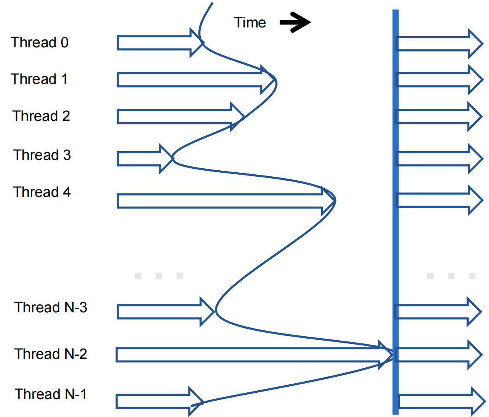


**API function**: `__syncthreads()`

All threads **in the same block** must reach the `__syncthreads()` before any can move on

-   To ensure that all elements of a tile are loaded
-   To ensure that certain computation on elements is complete

```c
// declare arrays in shared memory
__shared__ float A_s[TILE_DIM][TILE_DIM];
__shared__ float B_s[TILE_DIM][TILE_DIM];
unsigned int row = blockIdx.y*blockDim.y + threadIdx.y;
unsigned int col = blockIdx.x*blockDim.x + threadIdx.x;
float sum = 0.0f;
for (unsigned int tile = 0; tile < N/TILE_DIM; ++tile) {
  // Load tile to shared memory
  A_s[threadIdx.y][threadIdx.x] = A[row*N + tile*TILE_DIM + threadIdx.x];
  B_s[threadIdx.y][threadIdx.x] = B[(tile*TILE_DIM + threadIdx.y)*N + col];
  
  __syncthreads(); // Threads wait for each other to finish loading before computing
  
  // Compute with tile
  for (unsigned int i = 0; i < TILE_DIM; ++i) {
    sum += A_s[threadIdx.y][i]*B_s[i][threadIdx.x];
  }
  __syncthreads(); // Threads wait for each other to finish loading before computing
}
C[row*N + col] = sum;
```

#### Boundary Conditions

Different Matrix Dimensions

-   Solution: Write 0 for Missing Elements
    -   Is the target within input matrix?
        -   If yes, proceed to load. Otherwise, just write 0 to the shared memory
    -   Benefit
        -   No specialization during tile use!
        -   Multiplying by 0 guarantees that unwanted terms do not contribute to the inner product.

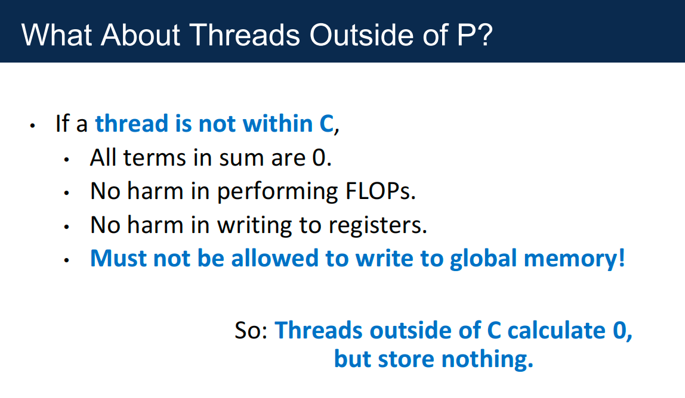

**Modifying the Tile Count**

-   For non-multiples 非整数倍 of `TILE_DIM`:
    -   quotient is unchanged;
    -   add one to round up
-   For multiples 整数倍 of `TILE_DIM`:
    -   quotient is now one smaller, but we add 1.

**Modifying the Tile Loading Code**

```c
// We had: Load tile to shared memory
A_s[threadIdx.y][threadIdx.x] = A[row*N + tile*TILE_DIM + threadIdx.x];
B_s[threadIdx.y][threadIdx.x] = B[(tile*TILE_DIM + threadIdx.y)*N + col];

//Note: the tests for A and B tiles are NOT the same.

if (row < N && tile*TILE_DIM+threadIdx.x < N) {
  // as before
  A_s[threadIdx.y][threadIdx.x] = A[row*N + tile*TILE_DIM + threadIdx.x];
} else {
  A_s[threadIdx.y][threadIdx.x] = 0;
}
```

**Modifying the Tile Use Code**

```c
// We had: Compute with tile
for (unsigned int i = 0; i < TILE_DIM; ++i) {
  sum += A_s[threadIdx.y][i] * B_s[i][threadIdx.x];
}
//Note: no changes are needed, but we might save a little energy (fewer floating-point ops)?

  if (row < N && col < N) {
    // as before
    for (unsigned int i = 0; i < TILE_DIM; ++i) {
      sum += A_s[threadIdx.y][i] * B_s[i][threadIdx.x];
    }
```

**Modifying the Write to C**

```c
// We had:
C[row*N + col] = sum;
//We must test for threads outside of C:
if (row < N && col < N) {
  // as before
  C[row*N + col] = sum;
}
```


>   [!IMPORTANT]
>
>   For each thread, conditions are different for 
>
>   -   Loading A element
>   -   Loading B element
>   -   Calculation/storing output elements
>
>   Branch divergence 
>
>   -   affects only blocks on boundaries, and should be small for large matrices

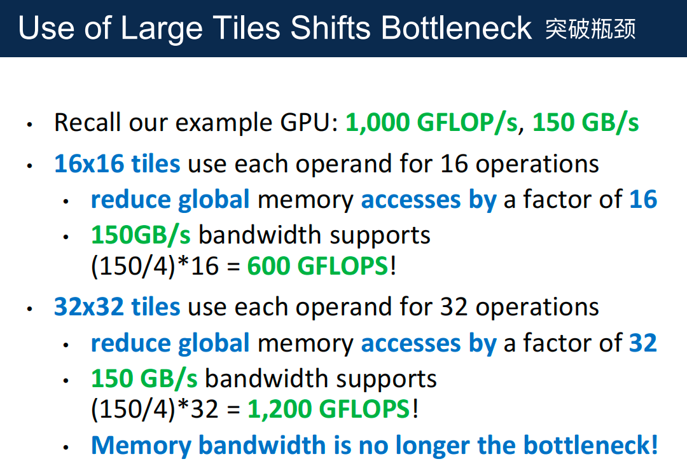

-   系统已经从**内存受限**转变为**计算受限**

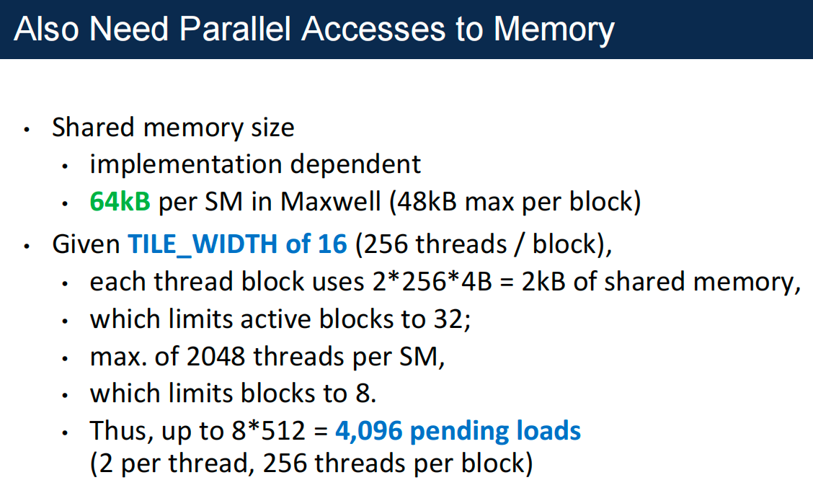

-   Memory per Block = 两个矩阵 16^2个线程 4个字节
-   Max Blocks (Memory) =  (Total SM Shared Memory) / (Memory per Block) = 64 kB / 2 kB = 32 blocks
-   Max Blocks (Threads) = (Max Threads on SM) / (Threads per Block) = 2048 / 256 = 8 blocks
-   Pending loads = maximum number of active blocks ✖️the number of loads per block

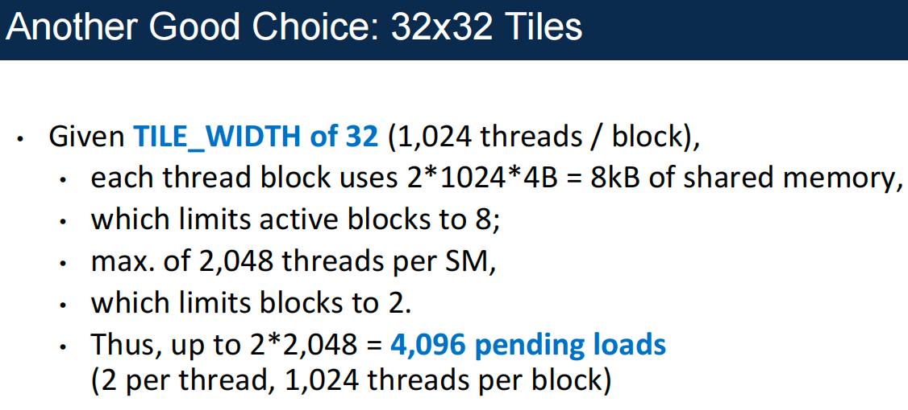

#### Memory and Occupancy

Register usage per thread, and shared memory usage per thread block constrain occupancy

#### Dynamic Shared Memory

动态分配共享内存

Declaration: `extern __shared__ A_s[];`

Configuration: `kernel <<< numBlocks, numThreadsPerBlock, smemPerBlock >>> (...)`

#### Tiling on CPU

Tiling also works for CPU

-   No scratchpad memory, but relies on caches 无需暂存器，但依赖缓存
-   Cache is sufficiently reliable because there are fewer threads running on the core and the cache is larger 缓存足够可靠，因为核心上运行的线程较少，而且缓存较大

```c
for (unsigned int rowTile = 0; rowTile < N/TILE_DIM; ++rowTile) {
  for (unsigned int colTile = 0; colTile < N/TILE_DIM; ++colTile) {
    for (unsigned int iTile = 0; iTile < N/TILE_DIM; ++iTile) {
      for (unsigned int row = rowTile*TILE_DIM; row < (rowTile + 1)*TILE_DIM; ++row) {
        for (unsigned int col = colTile*TILE_DIM; col < (colTile + 1)*TILE_DIM; ++col) {
          float sum = 0.0f;
          for (unsigned int i = iTile*TILE_DIM; i < (iTile + 1)*TILE_DIM; ++i) {
            sum += A[row*N + i]*B[i*N + col];
          }
          if (iTile == 0) C[row*N + col] = sum;
          else C[row*N + col] += sum;
        }
      }
    }
  }
```


## Quiz


[1*TILE_WIDTH+tx]:
