# CE408/CS483 Applied Parallel Programming


> https://canvas.illinois.edu/courses/60979/assignments/syllabus 
>
> https://uiuc.chat/ECE408FA25/chat


## 1 Introduction

CPU(central processing unit)

GPU(graphical processing unit)

### Post-Dennard technology pivot – parallelism and heterogeneity

**The Moore’s Law** (Imperative) drove feature sizes down, doubling the number of transistors/unit area every 18-24 months

- Exponential increase in clock speed

**Dennard Scaling** (based on physics) drove clock speeds up

- ended around 2005-2006

**multicore**: execution speed of sequential programs

**many-thread**: execution throughput of parallel applications

### CPU vs GPU


|                             CPU                              |                            GPU                             |
| :----------------------------------------------------------: | :--------------------------------------------------------: |
|        A few powerful **ALUs**(Arithmetic Logic Unit)        |                      Many small ALUs                       |
|                  Reduced operation latency                   |               Long latency, high throughput                |
|                       Large **caches**                       |          Heavily pipelined for further throughput          |
| Convert long latency memory accesses to short latency cache accesses |                      Small **caches**                      |
|                  Sophisticated **control**                   |             More area dedicated to computation             |
|         Branch prediction to reduce control hazards          |                     Simple **control**                     |
|            Data forwarding to reduce data hazards            |                                                            |
|         Modest multithreading to hide short latency          | A massive number of threads to hide the very high latency! |
|                   **High clock frequency**                   |                  Moderate clock frequency                  |
|                **latency-oriented** 延迟导向                 |             **throughput-oriented** 吞吐量导向             |

CPUs for **sequential parts** where latency hurts

- CPUs can be 10+X faster than GPUs for sequential code

GPUs for **parallel parts** where throughput wins

- GPUs can be 10+X faster than CPUs for parallel code

### Parallel Programming Frameworks

> [!NOTE]
>
> Why GPUs?
>
> Why repurpose a graphics processing architecture instead of designing a throughput-oriented architecture from scratch?
>
> - Chips are expensive to build and require a large volume of sales to amortize the cost
> - This makes the chip market very difficult to penetrate
> - When parallel computing became mainstream, GPUs already had (and still have) a large installed base from the gaming sector

#### Parallel Computing Challenges

Massive Parallelism demands Regularity -> Load Balance

Global Memory Bandwidth -> Ideal vs. Reality

Conflicting Data Accesses Cause Serialization and Delays 

- Massively parallel execution cannot afford serialization
- Contentions in accessing critical data causes serialization

#### Parallel Computing Pitfall（陷阱）

Consider an application where:

1. The sequential execution time is 100s
2. The fraction of execution that is parallelizable is 90%
3. The speedup achieved on the parallelizable part is 1000×

What is the overall speedup of the application?
$$
t_{parallel}=(1-0.9)\times 100s +\frac{0.9 \times 100s}{1000}=10.09s\\
speedup=\frac{t_{sequential}}{t_{parallel}}=\frac{100s}{10.09s}=9.91\times \text{（9.91为倍数）}
$$

#### Amdahl's Law

**阿姆达尔定律**：[处理器](https://zh.wikipedia.org/wiki/中央處理器)[并行运算](https://zh.wikipedia.org/wiki/並行運算)之后效率提升的能力


The maximum speedup of a parallel program is limited by the fraction of execution that is parallelizable, namely, $speedup<\frac{1}{1-p}$

## 2 Introduction to CUDA C and Data Parallel Programming

### Types of Parallelism

|                       Task Parallelism                       |                       Data Parallelism                       |
| :----------------------------------------------------------: | :----------------------------------------------------------: |
|   Different operations performed on same or different data   |         Same operations performed on different data          |
| Usually, a modest number of tasks unleashing a modest amount of parallelism | Potentially massive amounts of data unleashing massive amounts of parallelism(Most suitable for GPUs) |
|  |  |

### CUDA/OpenCL Execution Mode

**Integrated Host +Device Application(C Program)**

1. The execution starts with *host code* (CPU serial code). 主机代码在CPU上运行
2. When a kernel function is called, a large number of *threads* are launched on a device to execute the kernel. All the threads that are launched by a kernel call are collectively called a **grid**. 
3. These threads are the primary vehicle of parallel execution in a CUDA platform
4. When all threads of a grid have completed their execution, the grid terminates, and the execution continues on the host until another grid is launched

- **Host Code (C):** Handles serial or modestly parallel tasks
- **Device Kernel (C,SPMD Model):** Executes highly parallel sections of the program GPU上运行设备代码

### Threads

A CUDA **kernel** is executed as a grid(array) of threads

- All threads in the same grid run the **same kernel**
- Single Program Multiple Data (SPMD model)
- Each thread has a **unique index** that it uses to compute memory addresses and make control decisions

Thread as a basic unit of computing

- Threads within a block cooperate via **shared memory, atomic operations** and **barrier synchronization**.  块内的线程通过**共享内存、原子操作**和**屏障同步**进行协作。
- Threads in different blocks cooperate less.


- Thread block and thread organization simplify memory addressing when processing multidimensional data
- `i = blockIdx.x * blockDim.x + threadIdx.x; C[i] = A[i] + B[i];`

### Vector Addition

We use vector addition to demonstrate the CUDA C program structure.

A simple traditional vector addition C code example.

```c
// Compute vector sum C = A+B
void vecAdd(float* A, float* B, float* C, int n) {
    for (i = 0, i < n, i++) {
        C[i] = A[i] + B[i];
    }
}
int main() {
    // Memory allocation for A_h, B_h, and C_h
    // I/O to read A_h and B_h, N elements...
    vecAdd(A_h, B_h, C_h, N);
}

```

主机的变量名称后缀为`_h`，使用设备的变量名称后缀为`_d`

#### System Organization


The CPU and GPU have **separate memories** and **cannot access** each others' memories

- Need to **transfer** data between them（下图五步操作）


#### A vector addition kernel

Outline of a revised vecAdd function that moves the work to a device.

```c
#include <cuda.h>
void vecAdd(float* A, float* B, float* C, int n) {
int size = n* sizeof(float); 
float *A_d, *B_d, *C_d;
…
1. // Allocate device memory for A, B, and C
// copy A and B to device memory 
2. // Kernel launch code – to have the device
// to perform the actual vector addition
3. // copy C from the device memory
// Free device vectors
```

`vector A + B = vector C`

Device code can:

- R/W per-thread registers
- R/W per-grid global memory

Host code can transfer data to/from per grid global memory

### CUDA Device Memory Management API

#### API for managing device global memory

**Allocating memory**

```c
/*Allocating memory*/
cudaError_t cudaMalloc(void **devPtr, size_t size)
//devPtr: Pointer to pointer to allocated device memory
//size: Requested allocation size in byte
                             
/*VecAdd Host Code*/
//详见下面
```

**Deallocating memory**

```c
cudaError_t cudaFree(void *devPtr)
//devPtr: Pointer to device memory to free
```


- 指向设备全局内存中对象的指针变量后缀为`_d`
- `A_d`, `B_d` 和 `C_d` 中的地址指向设备全局内存 device global memory 中的位置。这些地址不应在主机代码中间接引用。它们应该在调用 API 函数和内核函数时使用。

**Copying memory**

```c
cudaError_t cudaMemcpy(void *dst, const void *src, size_t count, enum cudaMemcpyKind kind)
  
//Example
cudaMemcpy(A_d, A_h, size, cudaMemcpyHostToDevice);
cudaMemcpy(B_d, B_h, size, cudaMemcpyHostToDevice);
. . . 
cudaMemcpy(C_h, C_d, size, cudaMemcpyDeviceToHost);
```

- `dst`: Destination memory address
- `src`: Source memory address
- `count`: Size in bytes to copy
- `kind`: Type of transfer
    - `cudaMemcpyHostToHost`
    - `cudaMemcpyHostToDevice`
    - `cudaMemcpyDeviceToHost`
    - `cudaMemcpyDeviceToDevice`

**Return type**: `cudaError_t`

- Helps with error checking (discussed later)

**vecAdd Host Code**

完整版本

```c
void vecAdd(float* A, float* B, float* C, int n) {
    int size = n * sizeof(float); 
    float *A_d, *B_d, *C_d;
    // Transfer A and B to device memory (error-checking omitted)
    cudaMalloc((void **) &A_d, size);
    cudaMemcpy(A_d, A, size, cudaMemcpyHostToDevice);
    cudaMalloc((void **) &B_d, size);
    cudaMemcpy(B_d, B, size, cudaMemcpyHostToDevice);
    // Allocate device memory for
    cudaMalloc((void **) &C_d, size);
    // Kernel invocation code – to be shown later
        …
          
    // Transfer C from device to host
    cudaMemcpy(C, C_d, size, cudaMemcpyDeviceToHost);
    // Free device memory for A, B, C
    cudaFree(A_d); 
		cudaFree(B_d); 
  	cudaFree(C_d);
}
```

Simple strategy of **Parallel Vector Addition**: assign one GPU **thread** per vector element

#### Launching a Grid

Threads in the same grid execute the same function known as a **kernel**

A grid can be launched by calling a kernel and configuring it with appropriate grid and block sizes:

```c
const unsigned int numThreadsPerBlock = 512;
const unsigned int numBlocks = n/numThreadsPerBlock;
vecAddKernel <<< numBlocks, numThreadsPerBlock >>> (A_d, B_d, C_d, n);
```

If n is not a multiple of `numThreadsPerBlock`, fewer threads will be launched than desired

- Solution: use the ceiling to launch extra threads then omit the threads after the boundary:

```c
vecAddKernel <<< ceil(n/256.0), 256 >>> (A_d, B_d, C_d, n);
```

**More Ways to Compute Grid Dimensions**

```c
// Example #1
dim3 DimGrid(n/numThreadsPerBlock, 1, 1);
if (0 != (n % numThreadsPerBlock)) { DimGrid.x++; }
dim3 DimBlock(numThreadsPerBlock, 1, 1);
vecAddKernel<<<DimGrid, DimBlock>>>(A_d, B_d, C_d, n);

// Example #2
const unsigned int numBlocks;
numBlocks = (n + numThreadsPerBlock – 1)/numThreadsPerBlock;
vecAddKernel<<<numBlocks, numThreadsPerBlock>>>(A_d, B_d, C_d, n);
```

#### Vector Addition Kernel

```c
// Compute vector sum C = A+B
// Each thread performs one pair-wise addition
__global__
    void vecAddKernel(float* A_d, float* B_d, float* C_d, int n)
{
    int i = blockIdx.x * blockDim.x + threadIdx.x;
    if (i<n) C_d[i] = A_d[i] + B_d[i];
}
int vecAdd(float* A, float* B, float* C, int n)
{
    // A_d, B_d, C_d allocations and copies omitted 
    // Run ceil(n/256) blocks of 256 threads each
    dim3 DimGrid(ceil(n/256), 1, 1);
    dim3 DimBlock(256, 1, 1);
    vecAddKernel<<<DimGrid,DimBlock>>>(A_d, B_d, C_d, n);
}
```

-   `DimBlock`: number of threads in a block
-   `DimGrid`: number of blocks in a grid


### Compiling A CUDA Program


#### Function Declarations in CUDA


`__global__` defines a kernel function

`__device__` and `__host__` can be used together

#### More on Function Declarations

The keyword `__host__` is useful when needing to mark a function as executable on both the host and the device

```c
__host__ __device__ float f(float a, float b) {
    return a + b;
}
void vecadd(float* x, float* y, float* z, int N) {
    for(unsigned int i = 0; i < N; ++i) {
        z[i] = f(x[i], y[i]);
    }
}
__global__ void vecadd_kernel(float* x, float* y, float* z, int N) {
    int i = blockDim.x*blockIdx.x + threadIdx.x;
    if (i < N) {
        z[i] = f(x[i], y[i]);
    }
}
```

#### Asynchronous Kernel Calls

By default, kernel calls are **asynchronous** 异步

- Useful for overlapping GPU computations with CPU computations

Use the following API function to wait for the kernel to finish

```c
cudaError_t cudaDeviceSynchronize()
```

- Blocks until the device has completed all preceding requested tasks

#### Error Checking

All CUDA API calls return an error code `cudaError_t` that can be used to check if any errors occurred

```c
cudaError_t err = ...;
if (err != cudaSuccess) {
    printf("Error: %s\n"
           , cudaGetErrorString(err));
    exit(0);
}
```

For kernel calls, one can check the error returned by `cudaDeviceSynchronize()` or call the following API function:`cudaError_t cudaGetLastError()`

### Problems


## 3 CUDA Parallel Execution Model: Multidimensional Grids & Data

### CUDA Thread Grids are Multi-Dimensional

CUDA supports multidimensional grids (==up to 3D==)

Each CUDA kernel is executed by a grid,

- a 3D array of thread blocks, which are 3D arrays of threads.
- Each thread executes the same program on distinct data inputs, a **single-program, multiple-data (SPMD) model**

**大小关系：Grid - block - warp - thread**

- `gridDim` - `blockIdx` - `threadIdx`


-   Thread block and thread organization **simplifies memory addressing** when processing multidimensional data

#### One Dimensional Indexing

Defining a working set for a thread

- `i = blockIdx.x * blockDim.x + threadIdx.x;`
- 

#### Multidimensional Indexing

Defining a working set for a thread

- `row = blockIdx.y * blockDim.y + threadIdx.y;`
- `col = blockIdx.x * blockDim.x + threadIdx.x;`
- 

### Configuring Multidimensional Grids

#### Use built-in `dim3` type

```c
dim3 numThreadsPerBlock(32, 32); // 2D
dim3 numBlocks(
(width + numThreadsPerBlock.x - 1) / numThreadsPerBlock.x,
(height + numThreadsPerBlock.y - 1) / numThreadsPerBlock.y );

kernel <<< numBlocks, numThreadsPerBlock >>> (…kernel args…);
```

#### Layout of Multidimensional Data

- Convention is C is to store data in **row** major order
- Elements in the **same row** are **contiguous** in memory
- `index = row * width + col`

#### RGB to Gray-Scale Kernel Implementation

```c
__global__
  void rgb2gray_kernel(unsigned char* red, unsigned char* green, unsigned char* blue, unsigned char* gray, unsigned int width, unsigned int height) 
{
  unsigned int row = blockIdx.y*blockDim.y + threadIdx.y;
  unsigned int col = blockIdx.x*blockDim.x + threadIdx.x;
  
  // Convert the pixel
  if (row < height && col < width) {
    gray[row*width + col] = red[row*width + col]*3/10
      + green[row*width + col]*6/10 + blue[row*width + col]*1/10;}
}
```

#### Blur Kernel Implementation

Output pixel is the average of the corresponding input pixel and the pixels around it

**Parallelization approach**: assign one thread to each output pixel, and have it read multiple input pixels

- Given two N × N matrices, A and B, we can multiply A by B to compute a third N × N matrix, P: P = AB

```c
__global__ void blur_kernel(unsigned char* image, unsigned char* blurred, 
                            unsigned int width, unsigned int height) 
{
  int outRow = blockIdx.y*blockDim.y + threadIdx.y;
  int outCol = blockIdx.x*blockDim.x + threadIdx.x;
  if (outRow < height && outCol < width) 
  {
    unsigned int average = 0;
    for(int inRow = outRow - BLUR_SIZE; inRow < outRow + BLUR_SIZE + 1; ++inRow) {
      for(int inCol = outCol - BLUR_SIZE; inCol < outCol + BLUR_SIZE + 1; ++inCol) {
        if (inRow >= 0 && inRow < height && inCol >= 0 && inCol < width) { // add this to deal with boundary conditions
          
average += image[inRow*width + inCol];
				}
      }
    }
    blurred[outRow*width + outCol] =
      (unsigned char)(average/((2*BLUR_SIZE + 1)*(2*BLUR_SIZE + 1)));
  }
}
```

> [!NOTE]
>
> **Rule of thumb:** every memory access must have a corresponding guard that compares its indexes to the array dimensions

### Matrix-Matrix Multiplication

Given two N × N matrices, A and B, we can multiply A by B to compute a third N × N matrix, P: $P = AB$

- 矩阵相乘，一行✖️一列
- **Parallelization approach**: assign one thread to each element in the output matrix (C)

```c
__global__ void mm_kernel(float* A, float* B, float* C, unsigned int N) 
{
  unsigned int row = blockIdx.y*blockDim.y + threadIdx.y;
  unsigned int col = blockIdx.x*blockDim.x + threadIdx.x;
  float sum = 0.0f;
  for(unsigned int i = 0; i < N; ++i) {
    sum += A[row*N + i]*B[i*N + col];
  }
  C[row*N + col] = sum;
}
```


## 4 Compute Architecture and Scheduling

### Executing Thread Blocks

Threads are assigned to **Streaming Multiprocessors** in block granularity 块粒度的流多处理器

-   Up to **32** blocks to each SM
-   SMs can take up to **2048** threads

Threads run concurrently 并行

-   SM maintains thread/block id #s
-   SM manages/schedules thread execution

#### GPU Architecture

A GPU consists of **multiple Streaming Multiprocessor (SMs)**, each consisting of multiple cores with *shared control and memory*


#### Assigning Blocks to SMs

Threads are assigned to SMs at block granularity

-   One/more thread to one SM
-   The remaining block wait for others to finish
-   **All threads in a block** are assigned to the **same** SM


-   **All threads in a block** are assigned to an SM **simultaneously** 同时分配
    -   A block cannot be assigned to an SM until it secures enough resources for all its threads to execute ==> *ZERO-OVERHEAD*
    -   Otherwise, if some threads reach a barrier and others cannot execute, the system could deadlock


Threads in the **same block** can **collaborate** in ways that threads in different blocks cannot:

-   Lightweight barrier synchronization: `__syncthreads()`
    -   Wait for all threads in the block to reach the barrier before any thread can proceed

-   Shared memory (discussed later)
    -   Access a fast memory that **only threads in the same block can access**

-   Others (discussed later)

#### Synchronization across Thread Blocks

If threads in different blocks **do not synchronize** with each other

-   Blocks can execute in any order
-   Blocks can execute both in parallel with each other or sequentially with respect to each other
-   Enables **transparent scalability** 透明的可拓展性
    -   Same code can run on different devices with different amounts of hardware parallelism
    -   Execute blocks sequentially if device has few SMs
    -   Execute blocks in parallel if device has many SMs


If threads in different blocks to **synchronize** with each other

-   Deadlock may occur if the synchronizing blocks are not scheduled simultaneously
-   **Cooperative groups** 合作组 (covered later) allows *barrier synchronization* across clusters of thread blocks, or across the entire grid by limiting the number of blocks to guarantee that all blocks are executing simultaneously

-   Other techniques (covered later) allow **unidirectional synchronization** 间接同步 by ensuring that the producer block is scheduled before the consumer block

### SM Scheduling

Blocks assigned to an SM are further divided into **warps** which are *the unit of scheduling*

-   The SM cores are organized into **processing blocks** 处理快, with each processing block having its own warp scheduler to execute multiple warps concurrently

#### Warps

The size of warps is device-specific, but has always been 32 threads to date

Threads in a warp are scheduled together on a processing block and executed following the **SIMD model** 单指令多数据模型

-   <u>S</u>ingle <u>I</u>nstruction, <u>M</u>ultiple <u>D</u>ata
-   One instruction is fetched and executed by all the threads in the warp, each processing different data
-   All threads ina warp execute the same instruction

#### Thread Scheduling

Each block is executed as **32-thread warps**


SM 实现零开销 Warp 调度


Pitfalls: not divisible by 32, other threads idle

**Why SIMD?**

>   **Advantage**
>
>   -   Share the same instruction fetch/dispatch unit across multiple execution units (cores)
>
>   **Disadvantage**
>
>   -   Different threads taking different execution paths result in **control divergence**
>       -   Warp does a pass over each unique execution path
>       -   In each pass, threads taking the path execute while others are disabled
>
>   -   The percentage of threads/cores enabled during SIMD execution is called the **SIMD efficiency**

#### Control Divergence

Control Divergence Example


>   [!NOTE]
>
>   **What is Control Divergence?**
>
>   On a GPU, a **warp** (a group of 32 threads) is a fundamental execution unit. All 32 threads in a warp execute the same instruction at the same time.
>
>   **Control divergence** occurs when threads within a single warp encounter a conditional statement (like an `if-else` block) and disagree on which path to take. If条件中有`threadIdx`相关变量就可能会产生控制发散
>
>   -   Some threads evaluate the condition to `true`.
>   -   Others evaluate it to `false`.
>
>   The hardware handles this by running both paths sequentially: first, the `true` path is executed by the corresponding threads while the others are idle, and then the `false` path is executed by its threads while the first group is idle. This serialization is a performance penalty. 🤷‍♀️

#### Avoiding Branch Divergence

Try to **make branch granularity a multiple of warp size** (remember, it *may not always be 32*!)

```c
if (threadIdx.x / WARP_SIZE > 2) {
// THEN path (lots of lines)
} else {
// ELSE path (lots of lines)
}
```

-   Still has two control paths
-   But all threads in any warp follow only one path

#### Lantency hiding 延迟隐藏

When a warp needs to wait for a high latency operation, another warp that is ready is selected and scheduled for execution


Many warps are needed so that there is sufficient work available to hide long latency operations, i.e., there is high chance of finding a warp that is ready

For this reason, *an SM typically supports many more threads than the number of cores* it has -- Max threads per SM is much higher than cores per SM

#### Occupancy

The **occupancy** 占用率 of an SM refers to the ratio of the warps or threads active on the SM to the maximum allowed

In general, maximizing occupancy is desirable because it improves latency hiding

-   Common case, but possible to have cases where lower occupancy is desirable

Occupancy Example


#### Block Granularity Considerations


### Problem solving


## 5 CUDA Memory Model

### The Von-Neumann Model 冯诺依曼

Processing Unit (PU)

-   Performs all arithmetic and logical operations
-   Includes the **Register File**, where data is temporarily stored for processing

Memory

-   Stores both program instructions and data

Input/Output (I/O) Subsystem

-   Handles communication between the computer and the external environment

Control Unit (CU)

- Directs the execution of instructions by coordinating all components

All operations are performed on data stored in **registers** within the Processing Unit. Before any calculation:

-   Data must be fetched from Memory into registers, and Instructions must be loaded from Memory into the Instruction Register (IR)


Instruction processing breaks into steps: **Fetch | Decode | Execute | Memory**

Instructions come in three flavors: Operate, Data Transfer, and Control Flow

ADD instruction

LOAD instruction

### Programmer’s View of CUDA Memories

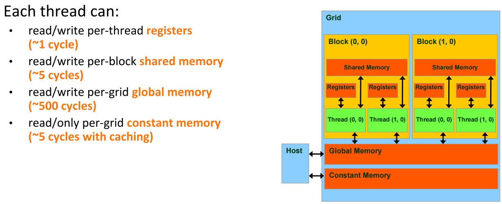

### Registers vs Memory

Registers

-   Fast: 1 cycle; no memory access required
-   Few: hundreds for CPU, O(10k) for GPU SM

Memory

-   Slow: hundreds of cycles
-   Huge: GB or more


Matrix Multiplication 矩阵乘法：A Simple Host Version in C

```c
// Matrix multiplication on the (CPU) host
void MatrixMul(float *M, float *N, float *P, int Width)
{ 
  for (int i = 0; i < Width; ++i)
    for (int j = 0; j < Width; ++j) 
    {
      float sum = 0;
      for (int k = 0; k < Width; ++k) 
      {
        float a = M[i * Width + k];
        float b = N[k * Width + j];
        sum += a * b;
      }
      P[i * Width + j] = sum;
    }
}
```

### Parallelize Elements of P

What can we parallelize?

-   start with the **two outer loops**
-   parallelize the **computation of elements of P**

#### Compute Using 2D Blocks in a 2D Grid

**P** is 2D, so organize threads in 2D as well:

Split the output **P** into square tiles of size `TILE_WIDTH × TILE_WIDTH`(a preprocessor constant)

**Each thread block produces one tile** of TILE_WIDTH^2 elements

Create **[ceil (Width / TILE_WIDTH)]^2** thread **blocks** to cover the output matrix

### Kernel Invocation (Host-side Code)

```c
// TILE_WIDTH is a #define constant
dim3 dimGrid(ceil((1.0*Width)/TILE_WIDTH), ceil((1.0*Width)/TILE_WIDTH), 1);
dim3 dimBlock(TILE_WIDTH, TILE_WIDTH, 1);
// Launch the device computation threads!
MatrixMulKernel<<<dimGrid, dimBlock>>>(Md, Nd, Pd, Width);
```

### Kernel Function

```c
// Matrix multiplication kernel – per thread code
__global__ 
  void MatrixMulKernel(float* d_M, float* d_N, float* d_P, int Width)
{
  // Calculate the row index of the d_P element and d_M
  int Row = blockIdx.y * blockDim.y + threadIdx.y;
  // Calculate the column idenx of d_P and d_N
  int Col = blockIdx.x * blockDim.x + threadIdx.x;
  // Pvalue is used to store the element of the matrix
  // that is computed by the thread
  float Pvalue = 0;
		...
    ...
    d_P[ ] = Pvalue;
}
```

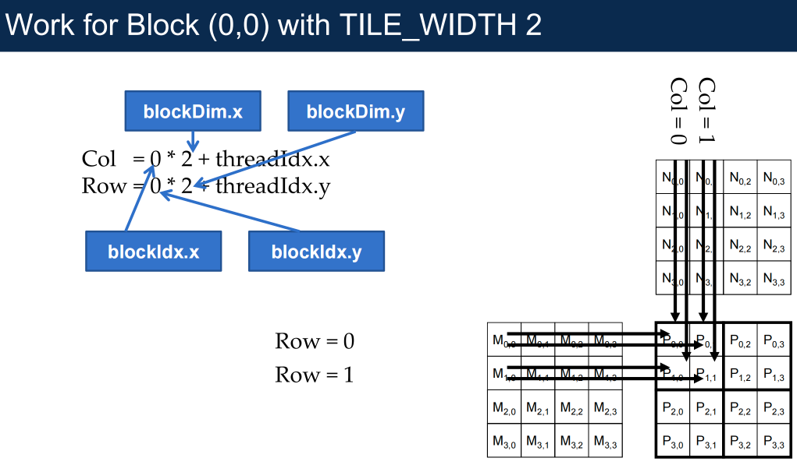

#### Matrix Multiplication Kernel

```c
__global__ 
  void MatrixMulKernel(float* d_M, float* d_N, float* d_P, int Width) 
{
  // Calculate the row index of the d_P element and d_M
  int Row = blockIdx.y*blockDim.y+threadIdx.y;
  // Calculate the column idenx of d_P and d_N
  int Col = blockIdx.x*blockDim.x+threadIdx.x;
  if ((Row < Width) && (Col < Width)) {
    float Pvalue = 0;
    // each thread computes one element of the block sub-matrix
    for (int k = 0; k < Width; ++k)
      Pvalue += d_M[Row*Width+k] * d_N[k*Width+Col];
    d_P[Row*Width+Col] = Pvalue;
  }
}
```

Memory Bandwidth is Overloaded!

That’s a **simple implementation**:

-   GPU kernel is the **CPU code** with the **outer loops replaced with** per-thread **index calculations**!

-   Unfortunately, performance is quite bad.

Why?

-   With the given approach, global **memory bandwidth** can’t supply enough data to **keep the SMs busy**!


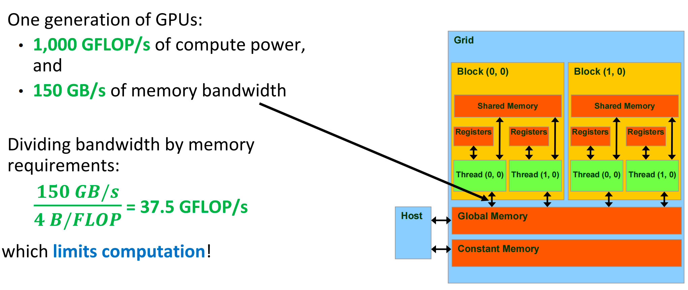

We should Reuse Memory Accesses

In an **actual execution**, memory is not busy all the time, and the code **runs at** about **25 GFLOPs**

To get closer to 1,000 GFLOPs,we **need to** drastically **cut down accesses to global memory** (next lecture)


### Problem Solving 


----------


>   The answer is **Either 0 or 1** because of a **race condition**. 🏁
>
>   A race condition occurs when multiple threads try to access and modify the same memory location at the same time, and the final result depends on the unpredictable order in which they execute.
>
>   1.  **Kernel Launch:** The line `kernel<<<2,1>>>(dst);` launches the kernel with a grid of **2 blocks**, and each block contains **1 thread**.
>
>       -   This creates two blocks in total: Block 0 and Block 1.
>       -   For Block 0, the built-in variable `blockIdx.x` is **0**.
>       -   For Block 1, the built-in variable `blockIdx.x` is **1**.
>
>   2.  Conflicting Writes:
>
>       Both threads execute the same instruction, dst[0] = blockIdx.x;, but with different values for blockIdx.x:
>
>       -   The thread from Block 0 executes `dst[0] = 0;`.
>       -   The thread from Block 1 executes `dst[0] = 1;`.
>
>   3.  Unpredictable Order:
>
>       The CUDA programming model does not guarantee the execution order of different blocks. The GPU's scheduler might run Block 0 first, then Block 1, or vice-versa.
>
>       -   **Scenario 1:** Block 1's write is the last one to complete. The initial value at `dst[0]` is overwritten by `0` (from Block 0), and then finally overwritten by **`1`**.
>       -   **Scenario 2:** Block 0's write is the last one to complete. The initial value is overwritten by `1` (from Block 1), and then finally overwritten by **`0`**.
>
>   Since there's no way to know which block will "win" the race to write to `dst[0]` last, the final value stored in that location after the kernel finishes could be either 0 or 1.

## 6 Data Locality and Tiled Matrix Multiply

### Performance Metrics

**FLOPS Rate**: floating point operations per second

-   How much computation a processor’s cores can do per unit time

**Memory Bandwidth**: bytes per second

-   How much data the memory can supply to the cores per unit time


-   FLOPs rate(GLOPS/s)
-   Memory bandwidth(GB/s)

#### Performance Bound and the Roofline Model

A kernel can be:

-   **Compute-bound** 计算受限: performance limited by the FLOPS rate
    -   The processor’s cores are fully utilized (always have work to do)
-   **Memory-bound** 内存受限: performance limited by the memory bandwidth
    -   The processor’s cores are frequently idle because memory cannot supply data fast enough

The **roofline model** helps visualize a kernel’s performance bound based on the ratio of operations it 
performs and bytes it accesses from memory


-   先受内存限制后受CPU限制
-   **OP/B ratio**: allows us to determine if a kernel is memory-bound or compute-bound on a specific hardware 根据比例判断类型 
-   *OP/B = operations / data*

Knowing the kernel’s bound allows us to determine the best possible performance achievable by the kernel (sometimes called the **speed of light**)

#### Example


### A Common Programming Strategy

**Global memory** is implemented with **DRAM**(Dynamic random-access memory) – slow

Sometimes, we are lucky:

-   The thread finds the data in the L1 cache because it was recently loaded by another thread

Sometimes, we are not lucky:

-   The data gets evicted from the L1 cache before another thread tries to load it

To avoid a Global Memory bottleneck, **==tile the input data==** to take advantage of Shared Memory 将输入数据平铺以利用共享内存：

-   **Partition data into subsets** (*tiles*) that fit into the (smaller but faster) shared memory
-   **Handle each data subset with one thread block** by:
    -   Loading the subset from global memory to shared memory, *using multiple threads to exploit memory-level parallelism* 利用内存级并行性
    -   Performing the computation on the subset from shared memory, each thread can efficiently access any data element
    -   Copying results from shared memory to global memory
-   Tiles are also called blocks in the literature


#### Tiled Multiply

平铺策略：Break up the execution of the kernel into phases so that the data accesses in each phase are focused on one tile of A and B


For each tile:

-   Phase 1: Load tiles of A & B into share memory

    -   Each thread loads one A element and one B element in basic tiling code

    -   ```c
        A[Row][1*TILE_WIDTH+tx]
        B[1*TILE_WIDTH+ty][Col]
          
        A[Row][q*TILE_WIDTH+tx]
        A[Row*Width + q*TILE_WIDTH + tx]
          
        B[q*TILE_WIDTH+ty][Col]
        B[(q*TILE_WIDTH+ty) * Width + Col]
        
        //A and B are dynamically allocated and can only use 1D indexing
        ```
        
    
-   Phase 2: Calculate partial dot product for tile of C

    -   ```c
        //To perform the kth step of the product within the tile
        subTileA[ty][k];
        subTileB[k][tx];
        ```

        


#### Tiled Matrix-Matrix Multiplication

```c
// declare arrays in shared memory
__shared__ float A_s[TILE_DIM][TILE_DIM];
__shared__ float B_s[TILE_DIM][TILE_DIM];
unsigned int row = blockIdx.y*blockDim.y + threadIdx.y;
unsigned int col = blockIdx.x*blockDim.x + threadIdx.x;
float sum = 0.0f;
for (unsigned int tile = 0; tile < N/TILE_DIM; ++tile) {
  // Load tile to shared memory
  A_s[threadIdx.y][threadIdx.x] = A[row*N + tile*TILE_DIM + threadIdx.x];
  B_s[threadIdx.y][threadIdx.x] = B[(tile*TILE_DIM + threadIdx.y)*N + col];
  // Compute with tile
  for (unsigned int i = 0; i < TILE_DIM; ++i) {
    sum += A_s[threadIdx.y][i]*B_s[i][threadIdx.x];
  }
}
C[row*N + col] = sum;
```

code inside the tunnel

>   [!IMPORTANT]
>
>   We need to **synchronize**! 同步

#### Bulk Synchronous Steps Based on Barriers

**Bulk synchronous execution**: threads execute roughly in unison

1. Do some work
2. Wait for others to catch up
3. Repeat

Much easier programming model

-   Threads only parallel within a section
-   Debug lots of little programs
-   Instead of one large one

Dominates high-performance applications

How does it work?

-   Use a **barrier** to wait for the thread to 'catch up.'

A barrier is a synchronization point:

-   each thread *calls a function* to enter the barrier;
-   threads *block* (sleep) in barrier function until all threads have called;
-   *After the last thread* calls the function, all threads *continue* past the barrier.


**API function**: `__syncthreads()`

All threads **in the same block** must reach the `__syncthreads()` before any can move on

-   To ensure that all elements of a tile are loaded
-   To ensure that certain computation on elements is complete

```c
// declare arrays in shared memory
__shared__ float A_s[TILE_DIM][TILE_DIM];
__shared__ float B_s[TILE_DIM][TILE_DIM];
unsigned int row = blockIdx.y*blockDim.y + threadIdx.y;
unsigned int col = blockIdx.x*blockDim.x + threadIdx.x;
float sum = 0.0f;
for (unsigned int tile = 0; tile < N/TILE_DIM; ++tile) {
  // Load tile to shared memory
  A_s[threadIdx.y][threadIdx.x] = A[row*N + tile*TILE_DIM + threadIdx.x];
  B_s[threadIdx.y][threadIdx.x] = B[(tile*TILE_DIM + threadIdx.y)*N + col];
  
  __syncthreads(); // Threads wait for each other to finish loading before computing
  
  // Compute with tile
  for (unsigned int i = 0; i < TILE_DIM; ++i) {
    sum += A_s[threadIdx.y][i]*B_s[i][threadIdx.x];
  }
  __syncthreads(); // Threads wait for each other to finish loading before computing
}
C[row*N + col] = sum;
```

#### Boundary Conditions

Different Matrix Dimensions

-   Solution: Write 0 for Missing Elements
    -   Is the target within input matrix?
        -   If yes, proceed to load. Otherwise, just write 0 to the shared memory
    -   Benefit
        -   No specialization during tile use!
        -   Multiplying by 0 guarantees that unwanted terms do not contribute to the inner product.


**Modifying the Tile Count**

```c
for (unsigned int tile = 0; tile < N/TILE_DIM; ++tile) {

//The bound for m implicitly assumes that Width is a multiple of TILE_WIDTH. We need to round up.
for (unsigned int tile = 0; tile < (N - 1)/TILE_DIM + 1; ++tile) {
```

-   For non-multiples 非整数倍 of `TILE_DIM`:
    -   quotient is unchanged;
    -   add one to round up
-   For multiples 整数倍 of `TILE_DIM`:
    -   quotient is now one smaller, but we add 1.

**Modifying the Tile Loading Code**

```c
// We had: Load tile to shared memory
A_s[threadIdx.y][threadIdx.x] = A[row*N + tile*TILE_DIM + threadIdx.x];
B_s[threadIdx.y][threadIdx.x] = B[(tile*TILE_DIM + threadIdx.y)*N + col];

//Note: the tests for A and B tiles are NOT the same.

if (row < N && tile*TILE_DIM+threadIdx.x < N) {
  // as before
  A_s[threadIdx.y][threadIdx.x] = A[row*N + tile*TILE_DIM + threadIdx.x];
} else {
  A_s[threadIdx.y][threadIdx.x] = 0;
}
if (tile*TILE_DIM+threadIdx.y < N && col < N ) {
  B_s[threadIdx.y][threadIdx.x] = B[(tile*TILE_DIM + threadIdx.y)*N + col];
} else {
  B_s[threadIdx.y][threadIdx.x] = 0;
}
```

**Modifying the Tile Use Code**

```c
// We had: Compute with tile
for (unsigned int i = 0; i < TILE_DIM; ++i) {
  sum += A_s[threadIdx.y][i] * B_s[i][threadIdx.x];
}

//Note: no changes are needed, but we might save a little energy (fewer floating-point ops)?
if (row < N && col < N) {
  // as before
  for (unsigned int i = 0; i < TILE_DIM; ++i) {
    sum += A_s[threadIdx.y][i] * B_s[i][threadIdx.x];
  }
}
```

**Modifying the Write to C**

```c
// We had:
C[row*N + col] = sum;

//We must test for threads outside of C:
if (row < N && col < N) {
  // as before
  C[row*N + col] = sum;
}
```

>   [!IMPORTANT]
>
>   For each thread, conditions are different for 
>
>   -   Loading A element
>   -   Loading B element
>   -   Calculation/storing output elements
>
>   Branch divergence 
>
>   -   affects only blocks on boundaries, and should be small for large matrices

### Bottleneck 瓶颈


-   系统已经从**内存受限**转变为**计算受限** memory-bound to compute-bound


-   Memory per Block = 两个矩阵, 16^2个线程,4个字节
-   Max Blocks (Memory) =  (Total SM Shared Memory) / (Memory per Block) = 64 kB / 2 kB = 32 blocks
-   Max Blocks (Threads) = (Max Threads on SM) / (Threads per Block) = 2048 / 256 = 8 blocks
-   Pending loads = maximum number of active blocks ✖️the number of loads per block


#### Memory and Occupancy

Register usage per thread, and shared memory usage per thread block constrain occupancy

#### Dynamic Shared Memory

动态分配共享内存

Declaration: `extern __shared__ A_s[];`

Configuration: `kernel <<< numBlocks, numThreadsPerBlock, smemPerBlock >>> (...)`

### Tiling on CPU

Tiling also works for CPU

-   No scratchpad memory, but relies on caches 无需暂存器，但依赖缓存
-   Cache is sufficiently reliable because there are fewer threads running on the core and the cache is larger 缓存足够可靠，因为核心上运行的线程较少，而且缓存较大

```c
for (unsigned int rowTile = 0; rowTile < N/TILE_DIM; ++rowTile) {
  for (unsigned int colTile = 0; colTile < N/TILE_DIM; ++colTile) {
    for (unsigned int iTile = 0; iTile < N/TILE_DIM; ++iTile) {
      for (unsigned int row = rowTile*TILE_DIM; row < (rowTile + 1)*TILE_DIM; ++row) {
        for (unsigned int col = colTile*TILE_DIM; col < (colTile + 1)*TILE_DIM; ++col) {
          float sum = 0.0f;
          for (unsigned int i = iTile*TILE_DIM; i < (iTile + 1)*TILE_DIM; ++i) {
            sum += A[row*N + i]*B[i*N + col];
          }
          if (iTile == 0) C[row*N + col] = sum;
          else C[row*N + col] += sum;
        }
      }
    }
  }
```


## 7 DRAM Bandwidth and other Performance Considerations

>   [!NOTE]
>
>   Performance optimizations covered so far
>   • Tuning resource usage to maximize occupancy to hide latency in cores
>   • Threads per block, shared memory per block, registers per thread
>   • Reducing control divergence to increase SIMD efficiency
>   • Shared memory and register tiling to reduce memory traffic
>   
>More optimizations to be covered today
>   • Memory coalescing
>   • Maximizing occupancy (again) to hide memory latency
>   • Thread coarsening
>   • Loop unrolling
>   • Double-buffering

###  DRAM

**Random Access Memory (RAM)**: same time needed to read/write any address

**DRAM(Dynamic RAM)** 

-   is Slow But Dense

-   Capacitance…
    • tiny for the BIT, but
    • huge for the *BIT LINE*
    • Use an amplifier for higher speed!
    • Still slow…
    • But only need *1 transistor per bit* 一位只要一个晶体管

**A DRAM bank** consists of a 2D array of DRAM cells activated one row at a time, and read at the column

-   *SELECT* lines connect to about 1,000 bit lines
-   Core DRAM array has about O(1M) bits
-   Use more address bits to choose bit line(s)

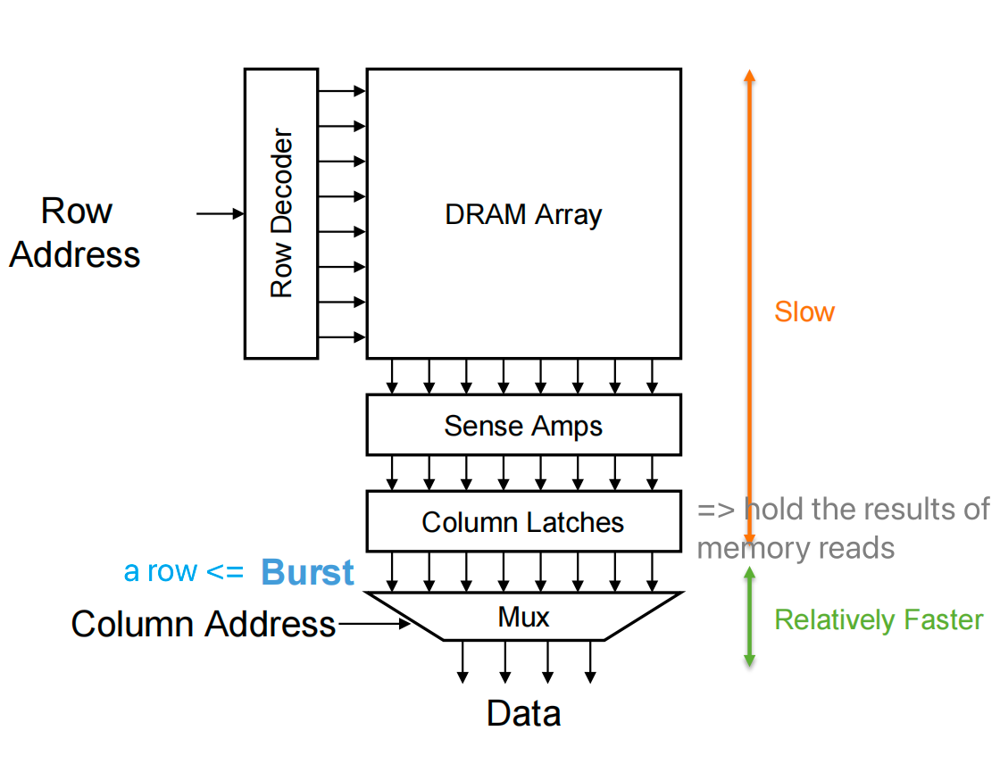

-   Accessing data in the same burst is faster than accessing data in different bursts

### Memory Coalescing 内存合并

When threads in the same warp access **consecutive memory locations** in the **same burst 爆发**, the accesses can be combined and served by one burst

-   One DRAM transaction is needed
-   Known as memory coalescing

If threads in the same warp access locations not in the same burst, accesses cannot be combined

-   Multiple transactions are needed

-   Takes longer to service data to the warp
-   Sometimes called memory divergence

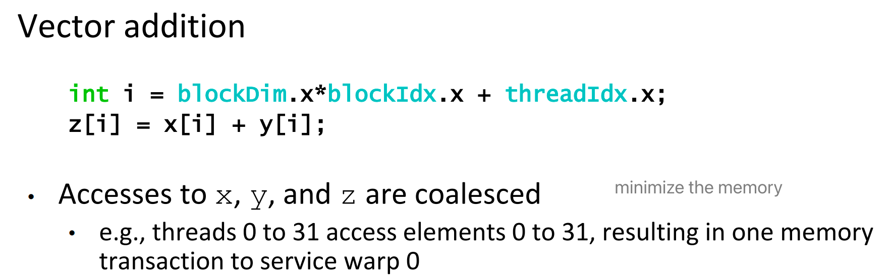

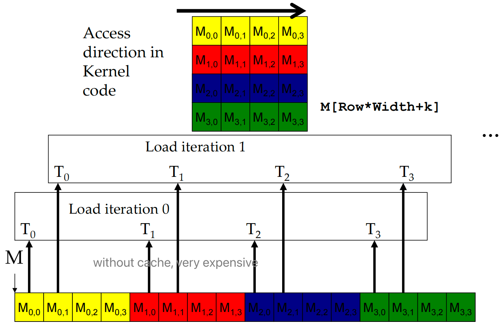

#### Matrix-matrix multiplication

```c
int row = blockDim.y*blockIdx.y + threadIdx.y;
int col = blockDim.x*blockIdx.x + threadIdx.x;
// Note: a warp contains consecutive threads in the x dimension followed by the y dimension
For (unsigned int k = 0; k < N; ++k) {
  sum += M[row*N + k] * N[k*N + col];
}
```

Accesses to M and N are coalesced 合并

-   e.g., threads 0 to 31 access element 0 of M on the first iteration, resulting in one memory transaction to service warp 0
-   e.g., threads 0 to 31 access elements 0 to 31 of N on the first iteration, resulting in one memory transaction to service warp 0

#### Use of Shared Memory Enables Coalescing

Tiled matrix-matrix multiplication

```c
unsigned int row = blockIdx.y*blockDim.y + threadIdx.y;
unsigned int col = blockIdx.x*blockDim.x + threadIdx.x;
For (unsigned int tile = 0; tile < N/TILE_DIM; ++tile) {
  M_s[threadIdx.y][threadIdx.x] = M[row*N + tile*TILE_DIM + threadIdx.x];
  N_s[threadIdx.y][threadIdx.x] = N[(tile*TILE_DIM + threadIdx.y)*N + col];
  ...
}
```


#### Latency Hiding with Multiple Banks

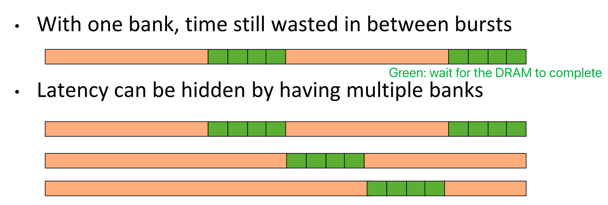

-   Need many threads to simultaneously access memory to keep all banks busy
-   Achieved with having high occupancy in SMs
-   Similar idea to hiding pipeline latency in the core

### Fine-Grain Thread Granularity

So far, parallelization approaches made threads as *fine-grain* 线程粒度细化 as possible

-   Assign smallest possible unit of parallelizable work per thread
    -   e.g., one vector element per thread in vector addition
    -   e.g., one output pixel per thread in RGB to gray and in blur
    -   e.g., one output matrix element per thread in matrix-matrix multiplication

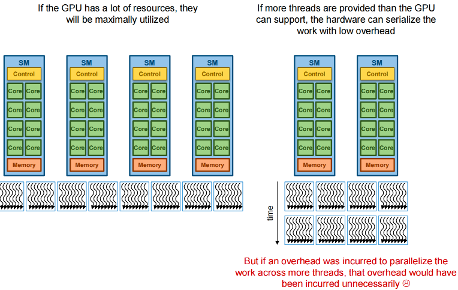

**Advantage**: provide hardware with as many threads as possible to fully utilize resources

-   If more threads are provided than the GPU can support, the hardware can serialize the work with low overhead
-   If future GPUs come out with more resources, more parallelism can be extracted without code being rewritten
    -   Recall: *transparent scalability*

**Disadvantage**: if there is an overhead for parallelizing work across more threads, that overhead is maximized

-   Okay if threads actually run in parallel
-   Suboptimal if threads are getting serialized by the hardware

#### Thread Coarsening 粗化

**Thread coarsening** is an optimization were a thread is assigned multiple units of parallelizable work

```c
unsigned int i = blockIdx.x*blockDim.x + threadIdx.x;
foo(i);

// => Thread coarsening

unsigned int iStart = 4*(blockIdx.x*blockDim.x + threadIdx.x);
for(unsigned int = 0; c < 4; ++c) {
  unsigned int i = iStart + c;
  foo(i);
}
```

**Advantages**

-   Reduces the overhead incurred for parallelization
-   Could be redundant 冗余 memory accesses
-   Could be redundant computations
-   Could be synchronization overhead or control divergence
-   We will see many examples throughout the course

**Disadvantages**

-   More resources(variables allocation memory) per thread which may affect occupancy
-   Underutilizes resources if coarsening factor is too high
-   Need to retune 调整 coarsening factor for each device

#### Loop unrolling 循环展开

Loop unrolling transforms a loop by replicating the body of the loop by some factor and reducing the number of loop iterations by the same factor 通过将循环主体复制某个因子并将循环迭代次数减少相同的因子来转换循环

-   Loop unrolling reduces stalls in two ways:
    -   Fewer loop iterations implies fewer branches
    -   Branches have long-latency in the absence of branch prediction
-   Exposes more independent instructions for instruction scheduling

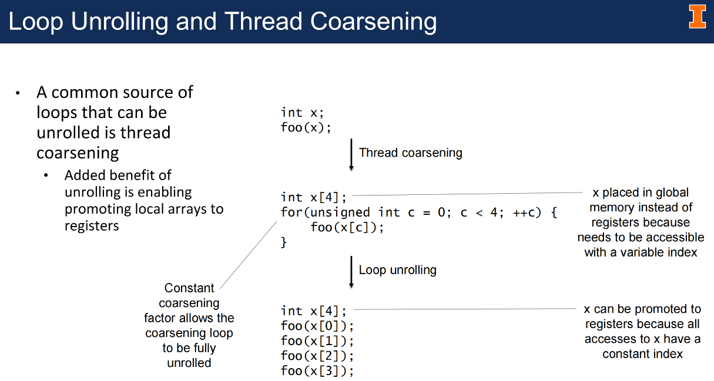

#### Instruction Scheduling 指令调度

**Instruction scheduling** reorders instructions to reduce stalling by placing instructions that depend on 

each other farther away from each other

通过重新排序指令，将相互依赖的指令放置得更远，从而减少停顿

#### Double Buffering 双缓冲

Double buffering eliminates false dependences by using a different memory buffer for writing data than the memory buffer containing the data being read 双缓冲通过使用不同的内存缓冲区来写入数据，而不是包含正在读取的数据的内存缓冲区，从而消除了错误的依赖关系

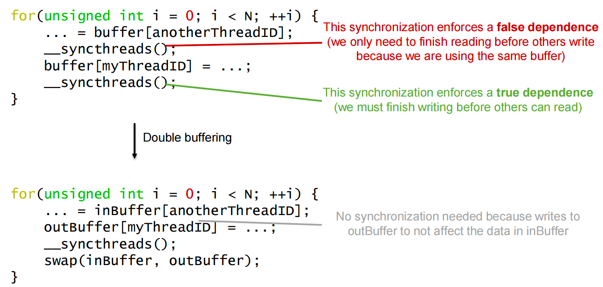


### Checklist of Common Optimizations

| Category                    | Optimization                             | Benefit to Compute Cores                                     | Benefit to Memory                                            | Strategies                                                   |
| --------------------------- | ---------------------------------------- | ------------------------------------------------------------ | ------------------------------------------------------------ | ------------------------------------------------------------ |
| **Compute utilization**     | Occupancy tuning                         | More work to hide pipeline latency                           | More parallel memory accesses to hide DRAM latency           | Tune the usage of SM resources such as threads per block, shared memory per block, and registers per thread |
| **Compute utilization**     | Loop unrolling                           | Fewer branch instructions and more independent instruction sequences with fewer stalls | May enable promoting local arrays to registers to reduce global memory traffic | Performed automatically by the compiler<br><br>Use loops with constant bounds where possible to facilitate the compiler's job |
| **Compute utilization**     | Reducing control divergence              | High SIMD efficiency (fewer idle cores during SIMD execution) | /                                                            | Rearrange the assignment of threads to work and/or data      |
| **Memory utilization**      | Using coalescable global memory accesses | Fewer pipeline stalls waiting for global memory accesses     | Less global memory traffic and better utilization of bursts/cache-lines | Rearranging the layout of the data<br>Rearranging the mapping of threads to data |
| **Memory utilization**      | Shared memory tiling                     | Fewer pipeline stalls waiting for global memory accesses     | Less global memory traffic                                   | Transfer data between global memory and shared memory in a coalescable manner and perform irregular accesses in shared memory (e.g., corner turning)<br>Place data that is reused within a block in shared memory so that it is transferred between global memory and the SM only once |
| **Memory utilization**      | Register tiling                          | Fewer pipeline stalls waiting for shared memory accesses     | Less shared memory traffic                                   | Place data that is reused within a warp or thread in registers so that it is transferred between shared memory and registers only once |
| **Synchronization latency** | Privatization                            | Fewer pipeline stalls waiting for atomic updates             | Less contention and serialization of atomic updates          | Apply partial updates to a private copy of the data then update the public copy when done |
| **Synchronization latency** | Warp-level primitives                    | Reduce block-wide barrier synchronizations                   | Less shared memory traffic                                   | Perform operations requiring barrier synchronization at the warp-level, then consolidate warp-level results at the block-level |
| **Synchronization latency** | Double buffering                         | Eliminates barriers that enforce false dependencies          | /                                                            | Eliminate false (write-after-read) dependencies by using different buffers for the writes and the preceding reads |
| **General**                 | Thread coarsening                        | Depends on the overhead of parallelization                   | Depends on the overhead of parallelization                   | Assign multiple units of parallelism to each thread in order to reduce the |

#### Trade-off Between Optimizations

Maximizing occupancy 最大化占有率

-   Maximizing occupancy hides pipeline latency, but threads may compete for resources (e.g., registers, shared memory, cache) 最大化占用率可以降低流水线延迟，但线程可能会竞争资源（例如寄存器、共享内存、缓存）

Shared memory tiling

- Using more shared memory enables more data reuse, but may limit occupancy 使用更多共享内存可以实现更多数据重用，但可能会限制占用率

Thread coarsening

-   Coarsening reduces parallelization overhead, but requires more resources per thread which may limit occupancy 粗化可以降低并行化开销，但每个线程需要更多资源，这可能会限制占用率

### Problem Solving

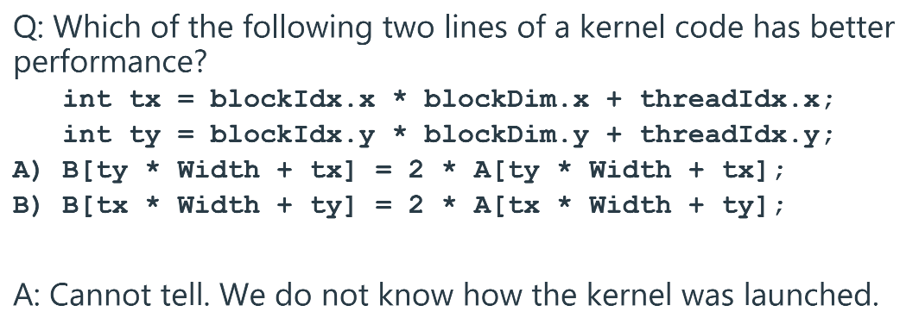

>   Performance hinges on a GPU's ability to perform **coalesced memory access**, and we can't know if access is coalesced without the kernel launch configuration(specifically, the `blockDim` values)
>
>   The performance is not an inherent property of the code line itself but of the interaction between the code and the thread hierarchy.

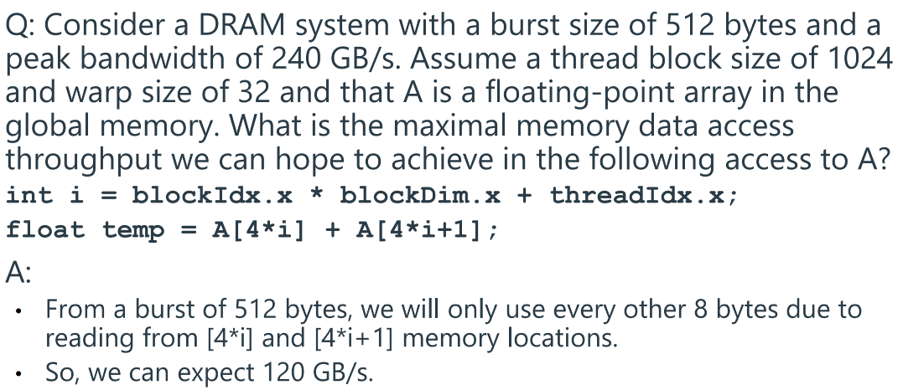

>   The **DRAM burst size** is the minimum amount of data the memory system will fetch in a single transaction, regardless of how little you ask for. 内存系统在单次事务中获取的最小数据量。即使一个线程只需要 8 个字节，内存控制器也会获取包含这 8 个字节的整个 512 字节块。
>
>   **Data Needed:** The 32 threads in the warp each need 8 bytes. The total *useful* data for the warp is `32 threads * 8 bytes/thread =` **256 bytes**.
>
>   **Data Fetched:** All the data needed by the warp (from `A[0]` up to `A[4*31 + 1] = A[125]`) fits within a single 512-byte memory block. Because of the DRAM burst rule, the system *must* fetch the entire **512-byte** chunk to satisfy these requests.
>
>   Efficiency=Total Fetched Data/Useful Data=256 bytes/512 bytes=0.5
>
>   Achieved Throughput=Peak Bandwidth×Efficiency=240GB/s × 0.5=120 GB/s

## 8 Convolution Concept; Constant Cache

### Convolution Applications

**Convolution compuation**: An array operation where each output data element is a weighted sum of a collection of neighboring input elements

The weights used in the weighted sum calculation are defined by an input mask array, commonly referred to as the *convolution kernel(convolution filter, or convolution masks)*.

#### 1D kernel convolution

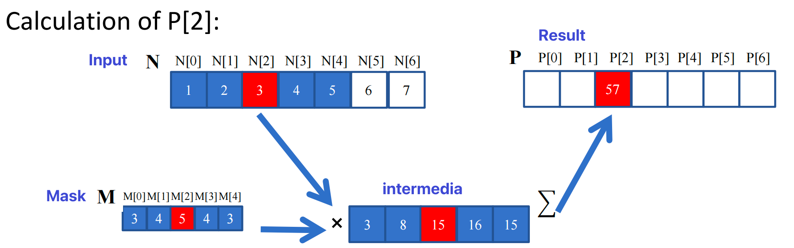

Boundary Handling 边界处理

-   This kernel forces all elements outside the valid range to **0**

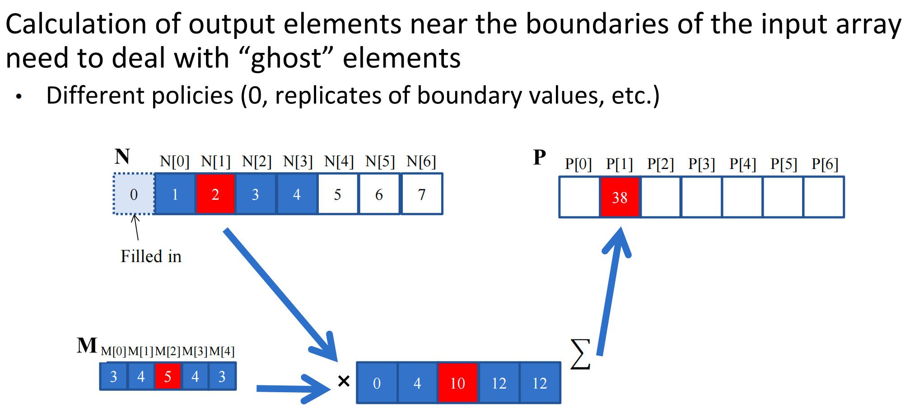

```c
__global__ void 
convolution_1D_basic_kernel(float *N, float *M, float *P, int Mask_Width, int Width)
{
  int i = blockIdx.x*blockDim.x + threadIdx.x;
  float Pvalue = 0;
  int N_start_point = i - (Mask_Width/2);
  for (int j = 0; j < Mask_Width; j++) {
    if (((N_start_point + j) >= 0) && ((N_start_point + j) < Width)) {
      Pvalue += N[N_start_point + j] * M[j];
    }
  }
  P[i] = Pvalue;
}
```

#### 2D Convolution with boundary condition handling

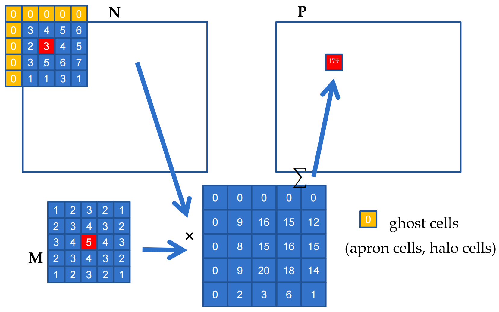

-   Boundry conditions also affect the efficiency of tiling

```c
__global__ void convolution_2D_basic_kernel(float *N，float *F，float *P,
	int r, int width,int height)
{
  int outCol=blockIdx.x*blockDim.x+ threadIdx.x;
  int outRow=blockIdx.y*blockDim.y +threadIdx.y;
  float Pvalue=0.0f;
	for(int fRow=0:fRow<2*r+1;fRow++){
    for (int fCol=0;fCol<2*r+1;fCol++){
      inRow =outRow+fRow;
      inCol=outCol-r+fCol;
      if(inRow>=0&& inRow<height && inCol >=0 && inCol < width){
        Pvalue += F[fRow][fCol]*N[inRow*width + inCol];
      }
    }
  }
	P[outRow][outCol]=Pvalue;
}
```

For global memory, you just `cudaMalloc()` and `cudaMemcpy()` like other arrays: 

```c
cudaMalloc(&d_F, filterSize * sizeof(float));
cudaMemcpy(d_F, h_F, filterSize * sizeof(float), cudaMemcpyHostToDevice);
```

What does this kernel accomplish?

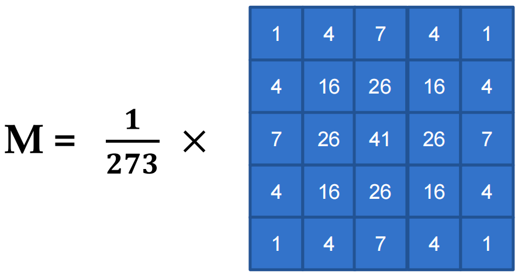

-   Elements of M are called **mask** (kernel, filter) **coefficients**(weights)
-   Calculation of all output P elements needs M
-   M is not changed during grid execution 
-   Bonus - M elements are accessed in the same order when calculating all P elements
-   M is a good candidate for **Constant Memory**

### Programmer View of CUDA Memories

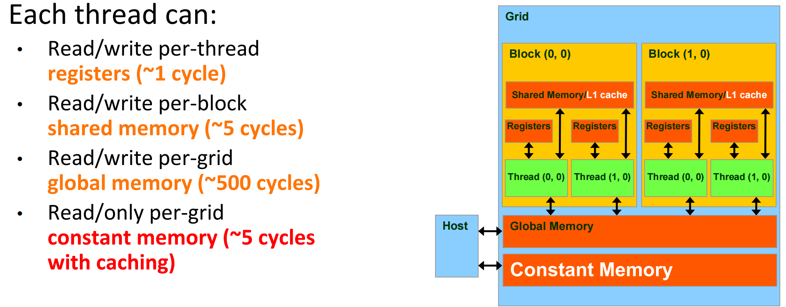

### Memory Hierarchies

>   **Review**: If we had to go to global memory to access data all the time, the execution speed of GPUs would be limited by the global memory bandwidth
>
>   -   We saw the use of shared memory in tiled matrix multiplication to reduce this limitation
>   -   Another important solution: Caches

#### A 2D convolution kernel using constant memory for F

```c
__constant__ float F[2*r+1][2*r+1]; // r is the radius of the filter

__global__ void convolution_2D_const_mem_kernel(float *N, float *P, int r,
                                                int width, int height) {
    int outCol = blockIdx.x * blockDim.x + threadIdx.x;
    int outRow = blockIdx.y * blockDim.y + threadIdx.y;
    float Pvalue = 0.0f;

    for (int fRow = 0; fRow < 2 * r + 1; fRow++) {
        for (int fCol = 0; fCol < 2 * r + 1; fCol++) {
            int inRow = outRow - r + fRow;
            int inCol = outCol - r + fCol;

            if (inRow >= 0 && inRow < height &&
                inCol >= 0 && inCol < width) {
                Pvalue += F[fRow][fCol] * N[inRow * width + inCol];
            }
        }
    }
    P[outRow * width + outCol] = Pvalue;
}
```

For constant memory, you must copy the filter to the GPU before launching the kernel 对于常量内存，您必须在启动内核之前将过滤器复制到 GPU：

```c
cudaMemcpyToSymbol(F_const, h_F, filterSize * sizeof(float));
```

### Cache

Recall: **memory bursts** 

-   contain around **1024 bits** (**128B**) fromconsecutive (linear) addresses
-   Let’s call a single burst a **line**

A **cache** is **an 'array' of cache lines**

-   A cache line can usually hold data from several consecutive memory addresses
-   When data is requested from the global memory, an entire cache line that includes the data being accessed is loaded into the cache, in an attempt to reduce global memory requests
-   The data in the cache is a **“copy” of the original data in global memory**
-   Additional hardware is used to remember the addresses of the data in the cache line

>   [!NOTE]
>
>   **Memory read** *produces* **a line**, **cache** *stores* **a copy of the line**, and **tag** *records* **the line’s memory address**

#### Caches and Locality

**Spatial locality 空间局部性**: when the data elements stored in consecutive memory locations are accessed consecutively

**Temporal locality 时间局部性**: when the same data element is accessed multiple times in a short period of time

-   Both spatial locality and temporal locality improve the performance of caches

An executing program loads and stores data from memory.

Consider **a sequence of addresses** accessed.

-   **Sequence** usually **shows** both types of **locality**:
    -   **spatial**: accessing **X implies** accessing **X+1** (and X+2, and so forth) **soon**
    -   *temporal**: accessing X** implies accessing **X again soon**
-   Caches improve performance for both types.

#### Caches Can’t Hold Everything

Caches are smaller than memory.

-   When the cache is full, it must make room for a new line, usually by **discarding the least recently used line**.

#### Shared Memory vs. Cache

Shared memory in CUDA is another type of temporary storage used to relieve main memory contention

-   In terms of distance from the SMs, shared memory is similar to L1 cache 
-   Unlike cache, shared memory doesn't necessarily hold a copy of data that is also in main memory 
-   Shared memory requires **explicit data transfer** instructions into locations in the shared memory, whereas cache doesn’t. 共享内存需要声明变量`__shared__`并显示地将全局内存变量的值复制到共享内存变量中；使用缓存时，程序会自动保存最近使用的变量并记住它们原始全局内存地址

Caches vs. shared memory

• Both on *chip*, with similar performance (As of Volta generation, both using the same physical resources, 

allocated dynamically!)

**Difference**

-   **Programmer controls shared memory** contents (called a scratchpad)
-   **Microarchitecture** automatically **determines the contents of the cache**. (**static RAM**, not DRAM)

#### Constant cache in GPUs

**Modification to cached data** needs to be (eventually) **reflected back** to the original data in global memory

-   Requires logic to track the modified status, etc.

**Constant cache** is a special cache for constant data that will **not be modified** during kernel execution by a grid

-   Data declared in the constant memory is not modified during kernel execution.
-   Constant cache can be accessed with higher throughput than L1 cache for some common patterns
-   L1 cache may write back, constant doesn't need to support writes

**To support writes** (modification of lines), **changes** must be **copied back to memory**, and cache must **track** modification **status.**

-   **L1 cache** in GPU (for global memory accesses) **supports writes**.
-   **Cache for constant** / texture **memory**

Special case: **lines are read-only**

-   Enables higher-throughput access than L1 for common GPU kernel access patterns

------

GPU L2/L1 Caches

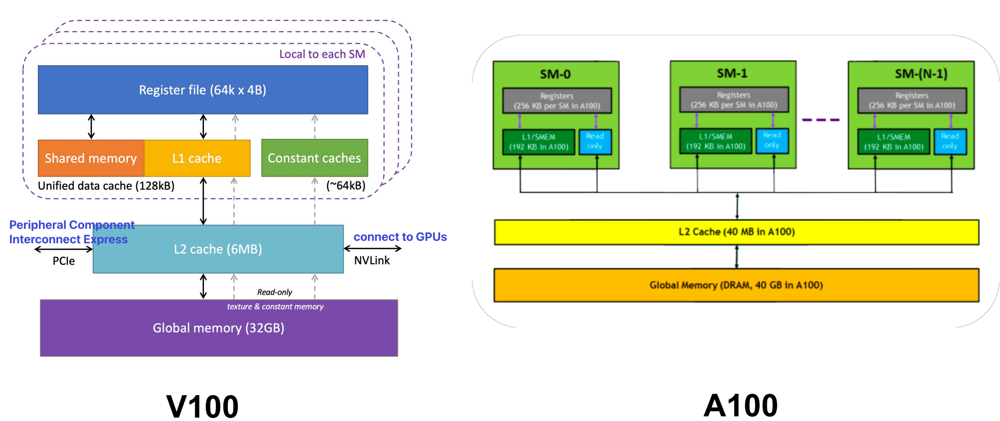

-   L1 的延迟和带宽速度都接近处理器的速度；L2 缓存更大，访问时间需要十几个时钟周期，通常在多个处理器核心之间共享
-   Global memory variables and constant memory variables are all in DRAM

#### Using Constant Memory

Declare constant memory array as global variable outside the CUDA kernel and any host function

-   `__constant__ float filter_c[FILTER_DIM];`

Must initialize constant memory from the host, and cannot modify it during execution

-   `cudaMemcpyToSymbol(filter_c, filter, FILTER_DIM * sizeof(float), offset = 0, kind = cudaMemcpyHostToDevice);`

General use: `cudaMemcpyToSymbol(dest, src, size)`

-   dest 指向常亮内存中目标位置的指针，src指向主机内存源数据，size要复制的字节数量

Can only allocate up to 64KB; Otherwise, input is also constant, but it is too large to put in constant memory

```c
/*Host Example*/
// MASK_WIDTH is the size of the mask
// global variable, outside any kernel/function
__constant__ float Mc[MASK_WIDTH];
// Initialize Mask
float Mask[MASK_WIDTH];
  for(unsigned int i = 0; i < MASK_WIDTH; i++) {
    Mask[i] = (rand() / (float)RAND_MAX);
    if(rand() % 2) Mask[i] = - Mask[i];
  }
cudaMemcpyToSymbol(Mc, Mask, MASK_WIDTH*sizeof(float));
ConvolutionKernel<<<dimGrid, dimBlock>>>(Nd, Pd, MASK_WIDTH, WIDTH);
```

We are **memory-limited** 内存受限

-   For the 1D case, every output element requires `2*MASK_WIDTH` loads (of M and N each) and `2*MASK_WIDTH` floating-point operations. 
-   For the 2D case, every output element requires `2*MASK_WIDTH^2` loads and `2*MASK_WIDTH^2` floating-point operations.

### Tiled convolution with halo cells

#### Tiled 1D Convolution Basic Idea

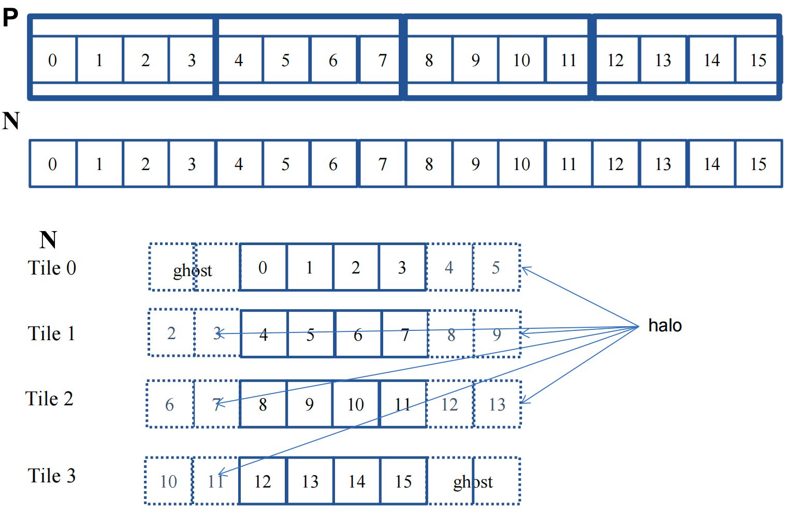

**Reuse data read from global memory(use shared memory)**

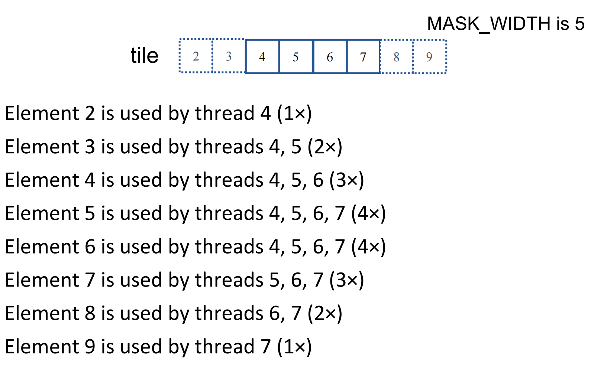

**What About the Halos? Do we also copy halos into shared memory?**

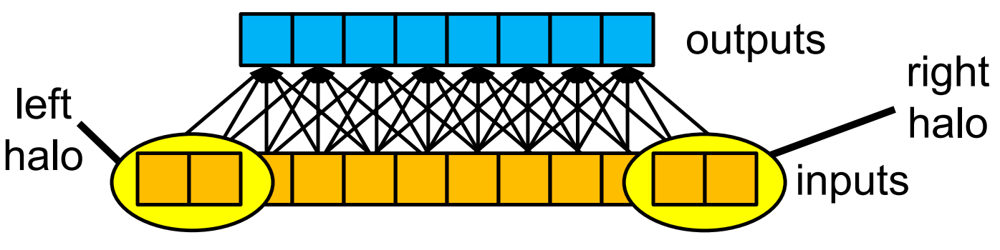

**Approach 1**: Can Access Halo from Global Memory

-   threads **read halo values** directly **from global memory**
-   Advantage: optimize reuse of shared memory(halo reuse is smaller).
-   Disadvantages:
    -   **Branch divergence**! (shared vs. global reads) 分支分歧
    -   Halo **too narrow to fill** a memory **burst**

**Approach 2**: Can Load Halo to Shared Memory

-   **load halos to shared memory**
-   Advantages: 
    -   Coalesce global memory accesses 合并全局内存访问
    -   **No branch divergence** during computation
-   Disadvantages:
    -   Some threads must do >1 load, so some branch divergence in reading data.
    -   Slightly more shared memory is needed.

#### Three Tiling Strategies

##### Strategy 1

Variable Meanings for a Block

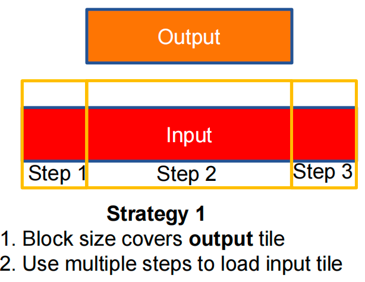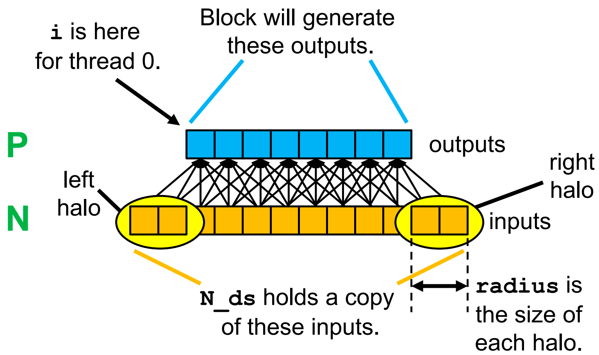

1.   Loading the Left Halo

     ```c
     int radius = Mask_Width / 2;
     int halo_index_left = (blockIdx.x - 1) * blockDim.x + threadIdx.x;
     if (threadIdx.x >= (blockDim.x - radius)) {
       N_ds[threadIdx.x - (blockDim.x - radius)] =
         (halo_index_left < 0) ? 0 : N[halo_index_left];
     }
     ```

2.   Loading the Right Halo

     ```c
     int index = blockIdx.x * blockDim.x + threadIdx.x;
     if ((blockIdx.x * blockDim.x + threadIdx.x) < Width) 
       N_ds[radius + threadIdx.x] = N[index];
     else
       N_ds[radius + threadIdx.x] = 0.0f;
     ```

3.   Loading the Internal Elements

     ```c
     int halo_index_right = (blockIdx.x + 1)*blockDim.x + threadIdx.x;
     if (threadIdx.x < radius) {
       N_ds[radius + blockDim.x + threadIdx.x] =
         (halo_index_right >= Width) ? 0 : N[halo_index_right];
     }
     ```

4.   Put it together

```c
// Load left halo 
// Load internal elements
// Load right halo 
// Compute and store results
__syncthreads();
float Pvalue = 0;
for(int j = 0; j < Mask_Width; j++) {
  Pvalue += N_ds[threadIdx.x + j] * Mc[j];
}
P[i] = Pvalue;
```

-----

**Alternative Implementation of Strategy 1**

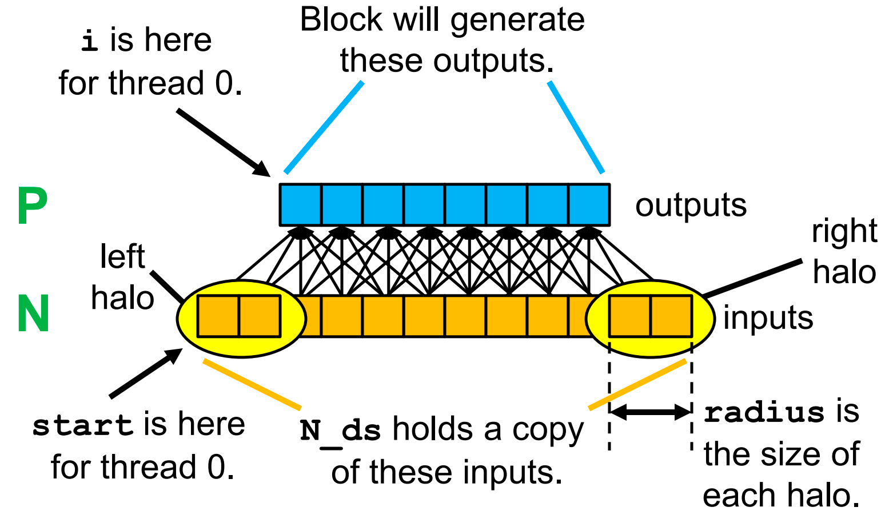

```c
//STEP1
int start = i – radius;
if (0 <= start && Width > start) { // all threads
  N_ds[threadIdx.x] = N[start];
} else {
  N_ds[threadIdx.x] = 0.0f;
}

//STEP2
if (MASK_WIDTH – 1 > threadIdx.x) { // some threads
  start += TILE_SIZE;
  if (Width > start) {
    N_ds[threadIdx.x + TILE_SIZE] = N[start];
  } else {
    N_ds[threadIdx.x + TILE_SIZE] = 0.0f;
  }
}
```

##### Strategy 2

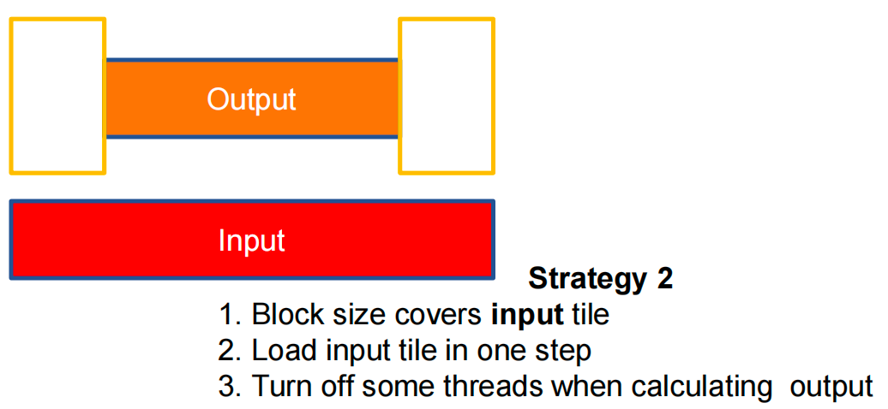

>   See in [next chapter](# Strategy 2: Parallelize Loading of a Tile)

##### Strategy 3

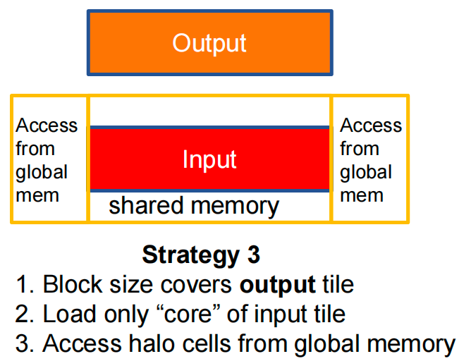

```c
// Loading data
int i = blockIdx.x * blockDim.x + threadIdx.x;
__shared__ float N_ds[TILE_WIDTH]; // variable initilization and shared memory declaration
// load from global to shared
N_ds[threadIdx.x] = N[i]; // boundary checking is missing here
__syncthreads();

//Computing
int radius = Mask_Width / 2;
int This_tile_start_point = blockIdx.x * blockDim.x;
int Next_tile_start_point = (blockIdx.x + 1) * blockDim.x;
int N_start_point = i - radius;
float Pvalue = 0;
for (int j = 0; j < Mask_Width; j ++) {
  int N_index = N_start_point + j;
  if (N_index >= 0 && N_index < Width) {
    if ((N_index >= This_tile_start_point) && 
        (N_index < Next_tile_start_point)) 
      Pvalue += N_ds[threadIdx.x-radius+j] * M[j];
    else 
      Pvalue += N[N_index] * Mc[j];
  }
}
P[i] = Pvalue;
```

>   [!CAUTION]
>
>   What Shall We Parallelize?
>
>   -   Strategies 1 and 3

## 9 2D Tiled Convolution Kernel; Reuse Analysis

### Stencil Algorithms

Numerical data processing algorithms which update array elements according to some fixed pattern, called a *stencil* 根据某种固定模式（称为模板）更新数组元素的数值数据处理算法

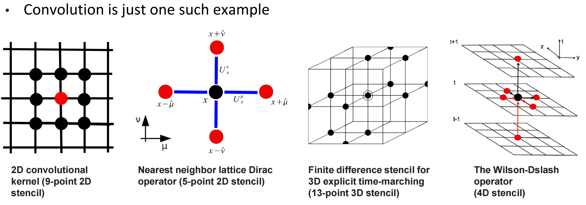

### Strategy 2: Parallelize Loading of a Tile


Alternately,

-   Thread block matches input tile size
-   Each thread loads one element of input tile
-   Some threads do not participate in calculating output

**Advantage**:

-   ==No branch divergence for load== (high latency).
-   **Avoid narrow global access** (2 × halo width).

**Disadvantage**:

-   Branch divergence for compute (low latency).

#### Parallelizing Tile Loading

Load a tile of N into shared memory

-   All threads participate in loading
-   A subset of threads then use each N element in shared memory
-   Output Tiles Still Cover the Output!
-   Input Tiles Need to be Larger than Output Tiles

#### Setting Block Dimensions

`dim3 dimBlock(TILE_WIDTH + 4,TILE_WIDTH + 4, 1);`

In general, **block width** (square blocks) should be `TILE_WIDTH + (MASK_WIDTH-1)`

`dim3 dimGrid(ceil(ceil(P.widthP.height/(1.0*TILE_WIDTH)),/(1.0*TILE_WIDTH)), 1)`

-   There need to be enough thread blocks to generate all P elements
-   There need to be enough threads to load entire tile of input

```c
/* Shifting From Output Coordinates To Input Coordinates */

int tx = threadIdx.x;
int ty = threadIdx.y;
int row_o = blockIdx.y * TILE_WIDTH + ty;
int col_o = blockIdx.x * TILE_WIDTH + tx;
int row_i = row_o - 2; // MASK_WIDTH / 2
int col_i = col_o - 2; // (radius in prev. code)
```

Threads That Loads Halos Outside N Should Return 0.0

```c
/*  Taking Care of Boundaries */

if ((row_i >= 0) && (row_i < Width) && (col_i >= 0) && (col_i < Width)) {
	tile[ty][tx] = N[row_i*Width + col_i];
} else {
	tile[ty][tx] = 0.0f;
}
__syncthreads (); // wait for tile
```

Not All Threads Calculate and Write Output

```c
float Pvalue = 0.0f;
if (ty < TILE_WIDTH && tx < TILE_WIDTH) {
  for(i = 0; i < 5; i++) {
    for(j = 0; j < 5; j++) {
      Pvalue += Mc[i][j] * tile[i+ty][j+tx];
    }
  }
  if (row_o < Width && col_o < Width) {
    P[row_o * Width + col_o] = Pvalue;
  }
}
```


### 2D Tiled Convolution Kernel (with constant memory)

```c
#define IN_TILE_DIM 32
#define OUT_TILE_DIM (IN_TILE_DIM - 2 * FILTER_RADIUS)
// Tile is split into input (IN_TILE_DIM) and output (OUT_TILE_DIM = IN_TILE_DIM − 2*r)

__constant__ float F_c[2 * FILTER_RADIUS + 1][2 * FILTER_RADIUS + 1]; // constant memeory

__global__ void convolution_tiled_2D_const_mem_kernel(
    const float *N, float *P, int width, int height)
{
    // Compute global indices of input elements (including halo)
  	// 全局输入坐标
    int col = blockIdx.x * OUT_TILE_DIM + threadIdx.x - FILTER_RADIUS;
    int row = blockIdx.y * OUT_TILE_DIM + threadIdx.y - FILTER_RADIUS;

    // Shared memory tile (input + halo)
    __shared__ float N_s[IN_TILE_DIM][IN_TILE_DIM];// 每个块有 IN_TILE_DIM × IN_TILE_DIM 线程

    // Load input tile from global memory into shared memory
    if (row >= 0 && row < height && col >= 0 && col < width)
        N_s[threadIdx.y][threadIdx.x] = N[row * width + col];
    else
        N_s[threadIdx.y][threadIdx.x] = 0.0f;

    __syncthreads();

    // Compute output element indices relative to tile
    int tileCol = threadIdx.x - FILTER_RADIUS;
    int tileRow = threadIdx.y - FILTER_RADIUS;

    // Check if this thread computes a valid output element
    if (tileCol >= 0 && tileCol < OUT_TILE_DIM &&
        tileRow >= 0 && tileRow < OUT_TILE_DIM &&
        row >= 0 && row < height && col >= 0 && col < width)
    {
        float Pvalue = 0.0f;

        // Convolution sum over the filter window
        for (int fRow = 0; fRow < 2 * FILTER_RADIUS + 1; fRow++) {
            for (int fCol = 0; fCol < 2 * FILTER_RADIUS + 1; fCol++) {
                Pvalue += F_c[fRow][fCol] *
                          N_s[tileRow + fRow][tileCol + fCol];
            }
        }
        // Write result to global memory
        P[row * width + col] = Pvalue;
    }
}
```

Host code

```c
#include <stdio.h>
#include <cuda_runtime.h>

#define TILE_WIDTH 16
#define MAX_FILTER_SIZE 49 // example

// Declare constant memory on the device
__constant__ float F_const[MAX_FILTER_SIZE * MAX_FILTER_SIZE];

// Kernel declaration
__global__ void convolution_2D_tiled_const_mem_kernel(float *N, float *P, 
                                                      int r, int width, int height);

int main() {
    int width = 512, height = 512;
    int r = 1;  // filter radius, e.g. 3x3 filter
    int filterWidth = 2 * r + 1;

    int imgSize = width * height * sizeof(float);
    int filterSize = filterWidth * filterWidth * sizeof(float);

    // Allocate host memory
    float *h_N = (float*)malloc(imgSize);
    float *h_P = (float*)malloc(imgSize);
    float *h_F = (float*)malloc(filterSize);

    // Initialize input and filter (example values, can be omitted)
    for (int i = 0; i < width * height; i++) h_N[i] = 1.0f;
    for (int i = 0; i < filterWidth * filterWidth; i++) h_F[i] = 1.0f / (filterWidth * filterWidth);

    // Allocate device memory
    float *d_N, *d_P;
    cudaMalloc(&d_N, imgSize);
    cudaMalloc(&d_P, imgSize);

    // Copy image data to device
    cudaMemcpy(d_N, h_N, imgSize, cudaMemcpyHostToDevice);

    // Copy filter to constant memory
    cudaMemcpyToSymbol(F_const, h_F, filterSize);

    // Configure grid and block
    dim3 dimBlock(TILE_WIDTH, TILE_WIDTH);
    dim3 dimGrid((width + TILE_WIDTH - 1) / TILE_WIDTH,
                 (height + TILE_WIDTH - 1) / TILE_WIDTH);

    // Launch kernel
    convolution_2D_tiled_const_mem_kernel<<<dimGrid, dimBlock>>>(d_N, d_P, r, width, height);

    // Copy result back to host
    cudaMemcpy(h_P, d_P, imgSize, cudaMemcpyDeviceToHost);

    // Cleanup
    cudaFree(d_N); cudaFree(d_P);
    free(h_N); free(h_P);free(h_F);

    return 0;
}
```

Kernel (using shared + constant memory)

```c
__global__ void convolution_2D_tiled_const_mem_kernel(float *N, float *P,
                                                      int r, int width, int height) {
    __shared__ float Ns[TILE_WIDTH + 2 * r][TILE_WIDTH + 2 * r]; // input with halo

    int tx = threadIdx.x;
    int ty = threadIdx.y;
    int row_o = blockIdx.y * TILE_WIDTH + ty; // 全局输出坐标
    int col_o = blockIdx.x * TILE_WIDTH + tx;
    int row_i = row_o - r; // 输入
    int col_i = col_o - r;

    // Load shared memory (with boundary check)
    if ((row_i >= 0) && (row_i < height) && (col_i >= 0) && (col_i < width))
        Ns[ty][tx] = N[row_i * width + col_i];
    else
        Ns[ty][tx] = 0.0f;

    __syncthreads();

    float Pvalue = 0.0f;
    if (ty < TILE_WIDTH && tx < TILE_WIDTH && row_o < height && col_o < width) {
        for (int i = 0; i < 2 * r + 1; i++)
            for (int j = 0; j < 2 * r + 1; j++)
                Pvalue += F_const[i * (2 * r + 1) + j] * Ns[ty + i][tx + j];

        P[row_o * width + col_o] = Pvalue;
    }
}
```

### Reuse Analysis

#### A Small 1D Convolution Example

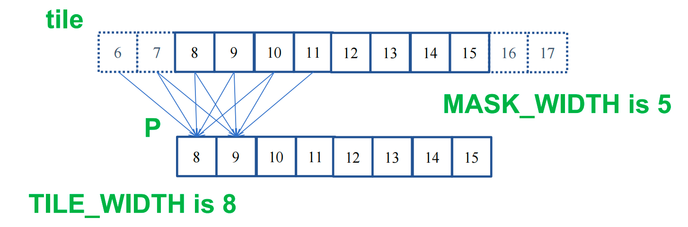

-   `8+(5-1) = 12` unique elements of input array N loaded
-   `8*5=40` global memory accesses potentially replaced by shared memory accesses
-   This gives a bandwidth reduction of **40/12=3.3**
-   This is independent of the size of `N`

>   [!IMPORTANT]
>
>   In General, for **1D Convolution Kernels**(inner tiles)
>
>   Load `(TILE_WIDTH + MASK_WIDTH – 1)` elements from global memory to shared memory
>
>   Replace `(TILE_WIDTH * MASK_WIDTH)` global memory accesses with shared memory accesses
>
>   -   **Bandwidth reduction** of `(TILE_SIZE * MASK_WIDTH) / (TILE_SIZE + MASK_WIDTH - 1)`

##### Boundary Tiles (Ghost Elements Change Ratios)

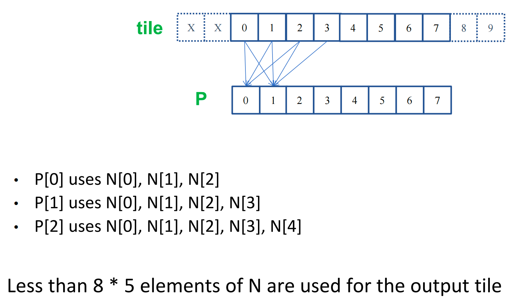

For a **boundary tile**, we load `TILE_WIDTH + (MASK_WIDTH-1)/2 elements`

-   `10` in our example of `TILE_WIDTH` of 8 and `MASK_WIDTH` of 5

Computing boundary elements do not access global memory for ghost cells

-   Total accesses is `6*5 + 4 + 3 = 37` accesses (when computing the P elements)

The reduction is **37/10 = 3.7**

#### Example of 2D Convolution Example

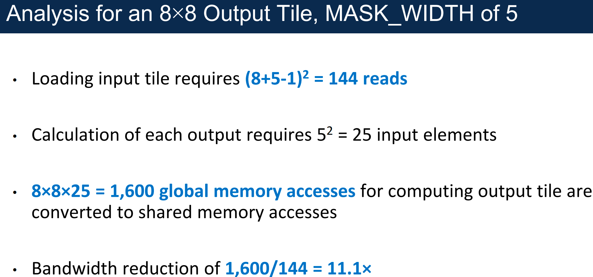

Global memory accesses/shared memory accesses

>   [!IMPORTANT]
>
>   In gerneral, for **2D Convolution Kernel**(*inner tiles*)
>
>   `(TILE_WIDTH+MASK_WIDTH-1)^2` elements need to be loaded from N into shared memory
>
>   -   The calculation of each P element needs to access `MASK_WIDTH^2` elements of N
>   -   `(TILE_WIDTH * MASK_WIDTH)^2` global memory accesses converted into shared 
>       memory accesses
>   -   **Bandwidth reduction** of `(TILE_WIDTH * MASK_WIDTH)^2 / (TILE_WIDTH + MASK_WIDTH - 1)^2`

##### Boundary Tiles (Ghost Elements Change Ratios)

For a **boundary tile**, we load `[TILE_WIDTH + (MASK_WIDTH-1)/2]^2 elements`

-   `100` in our example of `TILE_WIDTH` of 8 and `MASK_WIDTH` of 5

Computing boundary elements do not access global memory for ghost cells

-   Total accesses is `3^2 + (3*4)*2 + (3*5)*12 + 4^2 + (4*5)*12 + 5^2*36=1,369 ` accesses (when computing the P elements)

The reduction is **1369/100 = 13.69**

### 2B/FLOP for Untiled Convolution

**How much global memory per FLOP is in untiled convolution?**

-   In untiled convolution 无边界卷积, each value from **N** (*4B* from global memory) is multiplied by a value from **M**(**4B** from constant cache, *1 FLOP*), then added to a running sum (*1 FLOP*)
-   That gives *2B/FLOP*

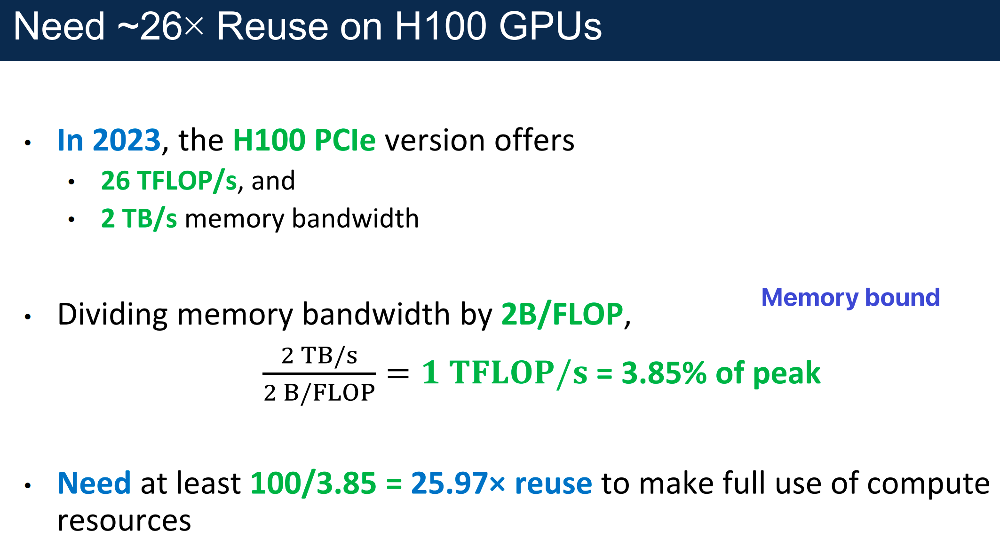

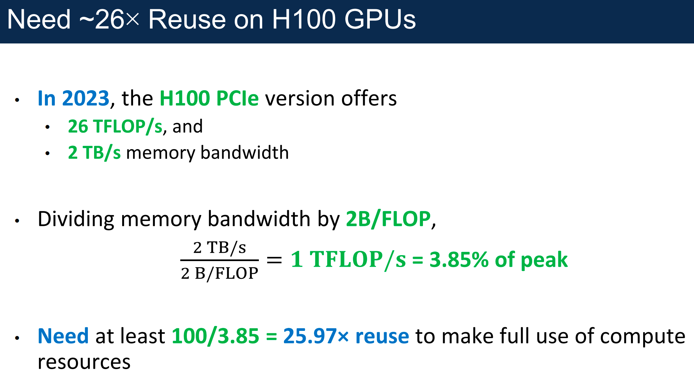

Shared memory --> better performance

-------

Ampere SM Memory Architecture

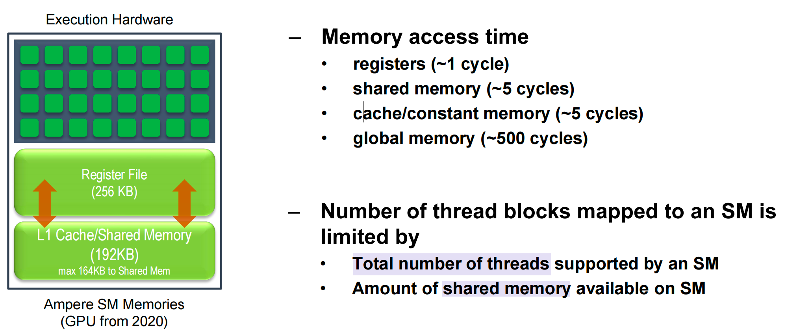

### Memory Hierarchy Considerations

Register file is highly banked 高度分组化, but we can have bank conflicts that cause pipeline stalls 流水线停顿

**Shared memory is highly banked**, but we can have bank conflicts that cause pipeline stalls

Global memory has multiple channels, banks, pages

-   Relies on bursting 依赖于突发
-   Coalescing is important. 合并
-   Need programmer involvement.

L1 Cache is non-coherent 非一致性的

### Problem Solving

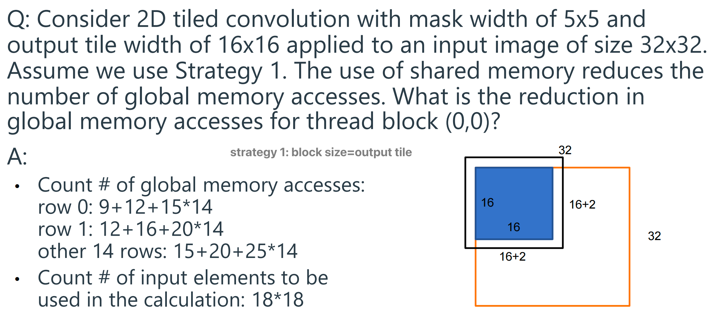

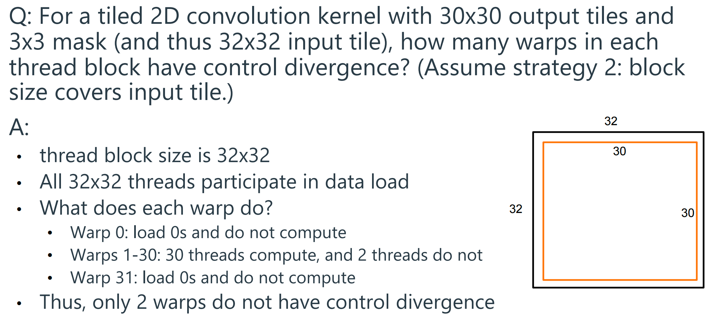

[Control Divergence](# Control Divergence)

Why It Happens in This Case

1.  **The Setup:** You have a 32×32 block of threads. The threads on the outermost border are only responsible for loading the "halo" or "apron" data. Only the inner 30×30 threads are responsible for calculating the final output pixels.

2.  **The `if` Statement:** To separate these roles, the kernel code must contain an `if` statement. Conceptually, it looks like this:

    C++

    ```c
    // thread_x and thread_y are the thread's coordinates (0-31)
    if (thread_x > 0 && thread_x < 31 && thread_y > 0 && thread_y < 31) {
        // I am an "inner" thread. Do the convolution calculation.
    } else {
        // I am a "border" thread. Do nothing.
    }
    ```

3.  **Analyzing a Middle Warp (Warps 1-30):** Let's consider Warp 16, which might handle the 17th row of the tile (where `thread_y = 16`). This warp consists of 32 threads with `thread_x` coordinates from 0 to 31.

    When this warp hits the `if` statement:

    -   **Thread 0** (`thread_x = 0`): The condition is `false`. It wants to take the `else` path.
    -   **Threads 1 through 30** (`thread_x` is 1-30): The condition is `true`. These **30 threads** want to take the `if` path and compute.
    -   **Thread 31** (`thread_x = 31`): The condition is `false`. It wants to take the `else` path.

    Because the 32 threads within this single warp disagree—30 go one way and 2 go the other—the warp experiences **control divergence**. This exact scenario happens for all the warps that handle rows 1 through 30.

By contrast, Warp 0 (handling row 0) and Warp 31 (handling row 31) have **no divergence** because all 32 threads within them uniformly fail the condition and take the `else` path together.

-----

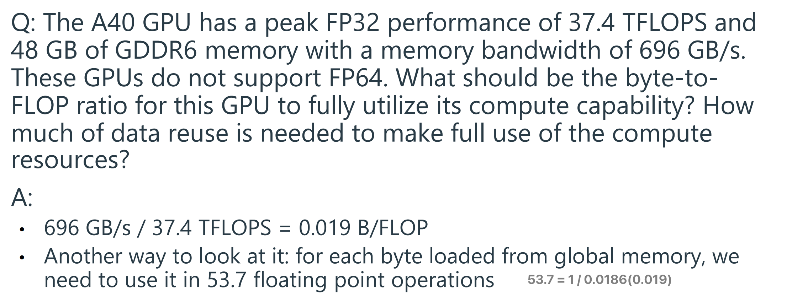

## 10 Introduction to ML; Inference and Training in DNNs

### Machine Learning

**Machine learning**: important method of building applications whose logic is not fully understood

Typically, by example:

-   **use labeled data** (matched input-output pairs)
-   **to represent** desired **relationship**

**Iteratively adjust program logic** to produce desired/approximate answers (called **training**)

Types of Learning Tasks

-   Classification, Regression <- structured data
-   Transcription, Translation <- unstructured data

ML now: computing power(GPU), data, needs

-   **Computing Power**: GPU computing hardware and programming interfaces such as CUDA has enabled very fast research cycle of deep neural net training
-   **Data**: Lots of cheap sensors, cloud storage, IoT, photo sharing, etc.
-   **Needs**: Autonomous Vehicles, Smart Devices, Security, Societal Comfort with Tech, Health Care

### Classification

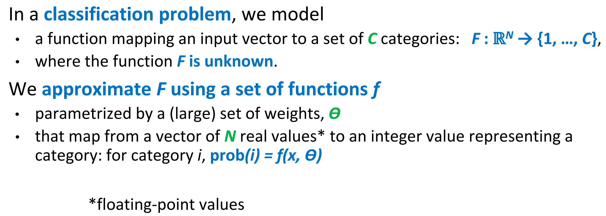

#### Linear Classification(perceptron感知器)

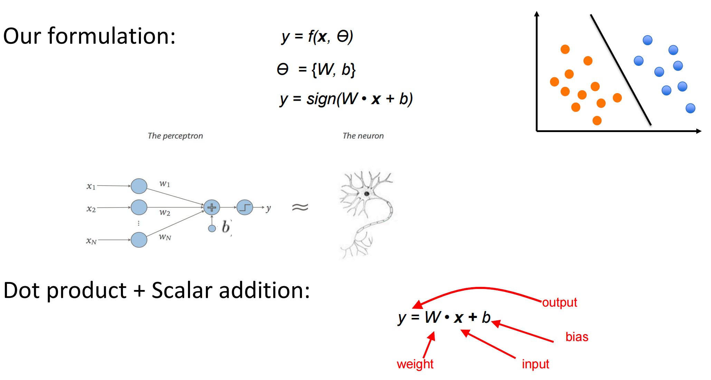

perceptron function: **y = sign (W∙x + b)** (-1, 0, 1)

### Multi-Layer Perceptron (MLP) for Digit Recognition

https://colab.research.google.com/drive/1Y7L_wFvp8ePwsTi7vu74Ni-X8VCANin1?usp=sharing#scrollTo=VgE1LB8I1NS3

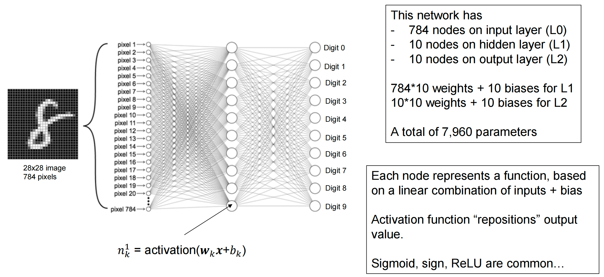

#### How Do We Determine the Weights?

First layer of perceptron:
• `784 (28^2)` inputs, 10 outputs, fully connected
• `[10×784]` weight matrix *W*
• `[10 x 1]` bias vector *b*

Use labeled training data to pick weights.

-   given enough labeled input data
-   we can approximate the input-output function.

#### Forward and Backward Propagation

**Forward (inference)**:

-   given input *x* (for example, an image)
-   use parameters *ϴ* (*W* and *b* for each layer)
-   to compute probabilities `k[i]` (ex: for each digit i).

**Backward (training)**:

-   given input *x*, parameters *ϴ*, and outputs `k[i]`,
-   compute error *E* based on target label *t*,
-   Then adjust *ϴ* proportionally to *E* to reduce error.

-----

**To propagate error** backwards 反向传播误差, we **use the chain rule** 链式法则 from calculus. **Smooth functions are useful.** 平滑函数

#### Sigmoid/Logistic Function

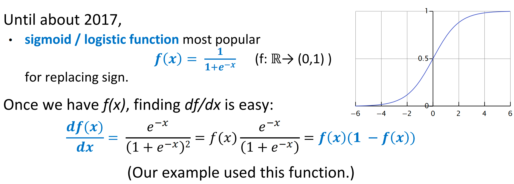

#### ReLU(Activation Functions)

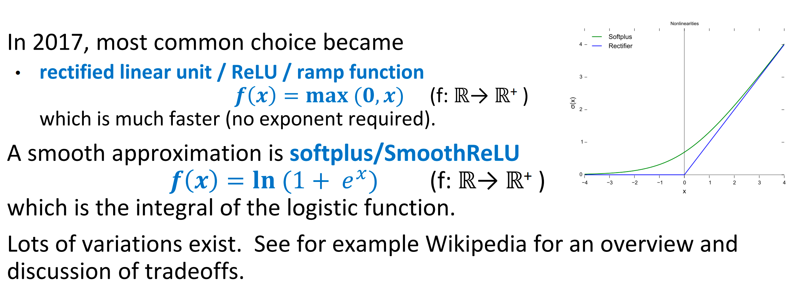

#### Use Softmax to Produce Probabilities

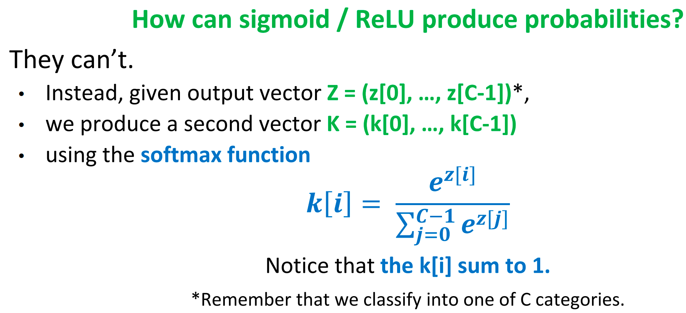

Softmax Derivatives


#### Error Function

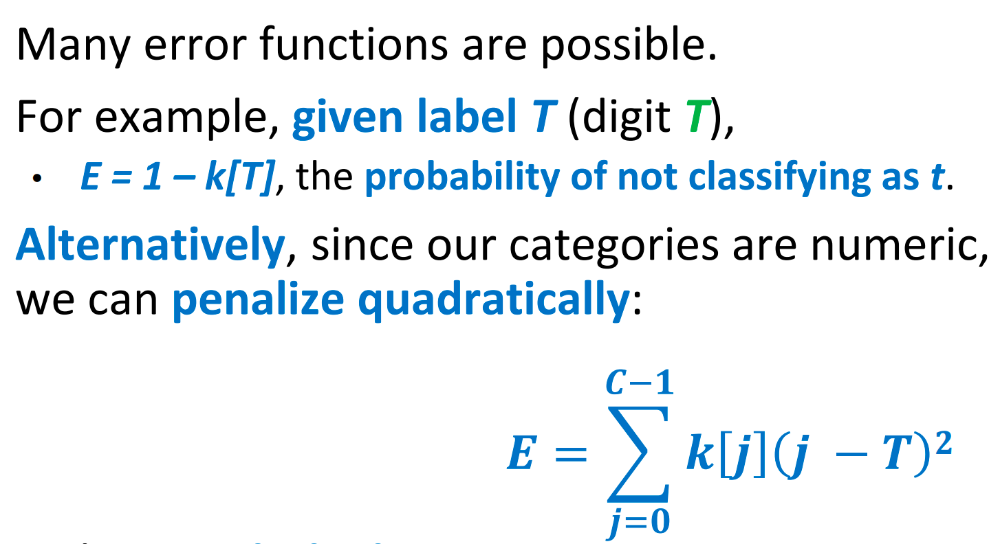

#### Stochastic Gradient Descent 随机梯度下降

**How do we calculate the weights?**

One common answer: **stochastic gradient descent**.

1.   Calculate the **derivative** of the sum of error *E* over all training inputs for all network parameters *ϴ*.

2. Change *ϴ* slightly in the opposite direction (to decrease error).

3. Repeat.

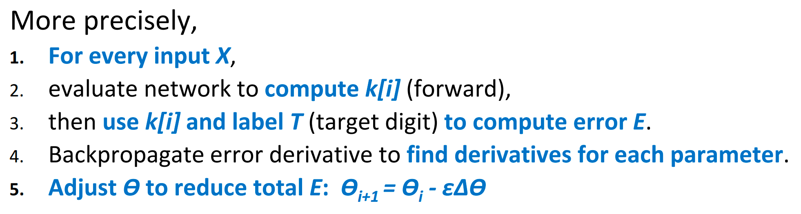

#### Example: Gradient Update with One Layer

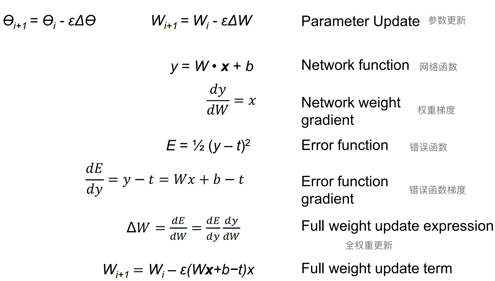

## 11 Computation in CNNs and Transformers

**Convolution Naturally Supports Varying Input Size**, while perceptron layers have fixed structure, so number of inputs / outputs is fixed.

### Example convolution Inputs

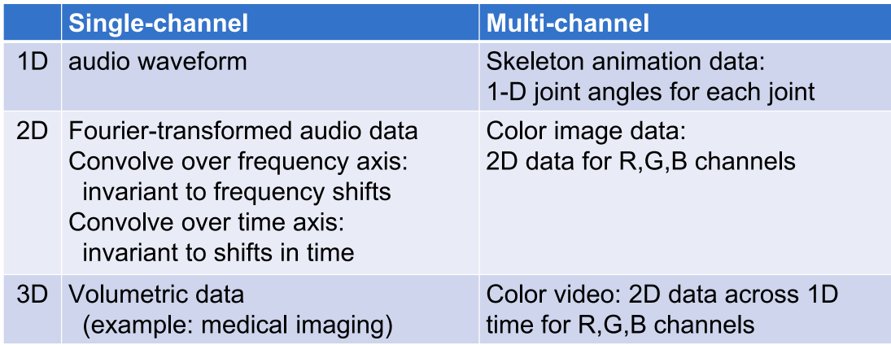

### Why Convolution

Sparse interactions

-   Meaningful features in small spatial regions
-   Need fewer parameters (less storage, better statistical characteristics, faster training)
-   Need multiple layers for wide receptive field

Parameter sharing

-   Kernel mask is applied repeatedly computing layer output

Equivariant Representations

-   If input is translated, output is similarly translated
-   Output is a map of where features appear in input


#### Convolution vs Multi-Layer Perceptron

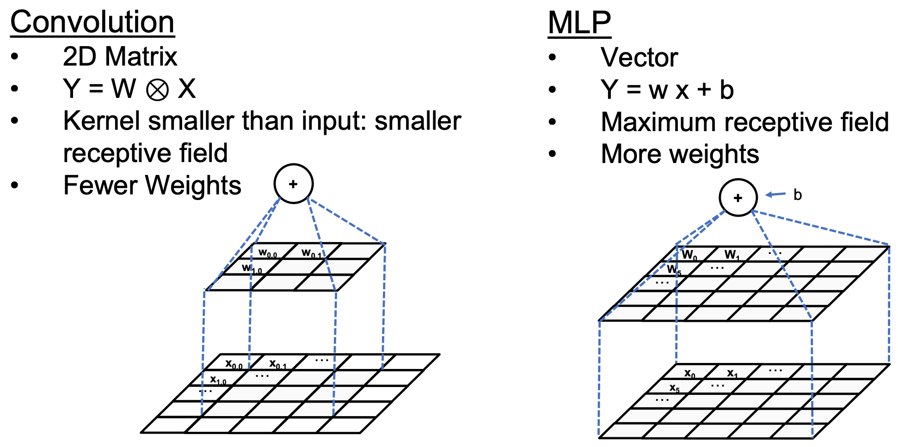

#### Anatomy of a Convolution Layer 卷积层剖析

Input features: A inputs each $N_1 × N_2$

Convolution Layer: B convolution kernels each $K_1 × K_2$

Output Features (total of B): A × B outputs each $(N_1 – K_1+1) × (N_2 – K_2+1)$

### 2-D Pooling (Subsampling)

A subsampling layer 子采样层

-   Sometimes with bias位置偏差 and non-linearity 非线性 built in

Common types

-   max, average, $L^2$ norm, weighted average

Helps make representation invariant to size scaling and small translations in the input

有助于使表示对输入中的尺寸缩放和小幅平移保持不变 


### Forward Propagation

Example of the Forward Path of a Convolution Layer

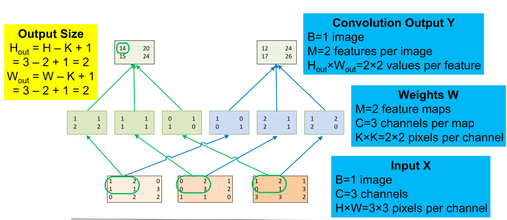

#### Sequential Code: Forward Pooling Layer

```c
void poolingLayer_forward(int B, int M, int H_out, int W_out, int N, float* Y, float* S)
{
  for (int b = 0; b < B; ++b) // for each image
    for (int m = 0; m < M; ++m) // for each output feature map
      for (int x = 0; x < H_out/N; ++x) // for each output value (two loops)
        for (int y = 0; y < W_out/N; ++y) {
          float acc = 0.0f // initialize sum to 0
            for (int p = 0; p < N; ++p) // loop over NxN block of Y (two loops)
              for (int q = 0; q < N; ++q)
                acc += Y[b, m, N*x + p, N*y + q];
          acc /= N * N; // calculate average over block
          S[b, m, x, y] = sigmoid(acc + bias[m]) // bias, non-linearity
        }
}
```

#### Host Code for a Basic Kernel: CUDA Grid

Consider an output feature map:

-   width is **W_out**, andheight is **H_out**.
-   Assume these are multiples of **TILE_WIDTH**.
-   Let **X_grid** be the number of blocks needed in X dim.
-   Let **Y_grid** be the number of blocks needed in Y dim

Assuming `W_out` and `H_out` are multiples of `TILE_WIDTH`

```c
#define TILE_WIDTH 16 // We will use 4 for small examples.
W_grid = W_out/TILE_WIDTH; // number of horizontal tiles per output map
H_grid = H_out/TILE_WIDTH; // number of vertical tiles per output map
Y = H_grid * W_grid;
dim3 blockDim(TILE_WIDTH, TILE_WIDTH, 1); // output tile for untiled code
dim3 gridDim(M, Y, 1);
ConvLayerForward_Kernel<<< gridDim, blockDim >>>(…);

```

#### Forward Convolutional Layer 卷积前向传播

CPU串行 Sequential Code

```c
void convLayer_forward(int B, int M, int C, int H, int W, int K,
                       float* X, float* W, float* Y)
{
  int H_out = H – K + 1; // calculate H_out, W_out
  int W_out = W – K + 1;
  for (int b = 0; b < B; ++b) // for each image
    for (int m = 0; m < M; m++) // for each output feature map
      for (int h = 0; h < H_out; h++) // for each output value (two loops)
        for (int w = 0; w < W_out; w++) {
          Y[b, m, h, w] = 0.0f; // initialize sum to 0
          for (int c = 0; c < C; c++) // sum over all input channels
            for (int p = 0; p < K; p++) // KxK filter
              for (int q = 0; q < K; q++)
                Y[b, m, h, w] += X[b, c, h + p, w + q] * W[m, c, p, q];
        }
}
```

-   最外侧4个循环是grid计算，里面4个循环是thread计算

GPU并行 Partial Kernel Code for a Convolution Layer

```c
__global__ void ConvLayerForward_Basic_Kernel
  (int C, int W_grid, int K, float* X, float* W, float* Y) // cuda内核函数
{
  int m = blockIdx.x; // 每个线程块（Block）负责计算一个输出特征图
  int h = (blockIdx.y / W_grid) * TILE_WIDTH + threadIdx.y;
  int w = (blockIdx.y % W_grid) * TILE_WIDTH + threadIdx.x;
  float acc = 0.0f;
  for (int c = 0; c < C; c++) { // sum over all input channels
    for (int p = 0; p < K; p++) // loop over KxK filter
      for (int q = 0; q < K; q++) 
        acc += X[c, h + p, w + q] * W[m, c, p, q];
  }
  Y[m, h, w] = acc;
}
```

-   Image batch is omitted

## 13  Atomic Operations and Histogramming

>   [!NOTE]
>
>   To understand atomic operations
>   • Read-modify-write in parallel computation
>   • A primitive form of “critical regions” in parallel programs
>   • Use of atomic operations in CUDA
>   • Why atomic operations reduce memory system throughput
>   • How to avoid atomic operations in some parallel algorithms
>
>   To learn practical histogram programming techniques
>   • Basic histogram algorithm using atomic operations
>   • Atomic operation throughput
>   • Privatization

A Common Collaboration Pattern 合作模式

银行每个人数一部分钱，计到总数上，但有些可能没记上

A Common Arbitration Pattern 仲裁模式

多个人单独买自己的机票，但可能最后同一个位置被重复预定


### Data Races

A **data race** occurs when multiple threads access the same memory location concurrently without ordering and at least one access is a write

-   Data races may result in unpredictable program output
-   To avoid data races, you should use atomic operations 原子操作


### Mutual Exclusion 互斥

To avoid data races, concurrent read-modify-write operations to the same memory location need to be made **mutually exclusive** to enforce ordering

One way to do this on CPUs is using **locks** (mutex)

Example:

```c
mutex_lock(lock);
++bins[b];
mutex_unlock(lock);
```

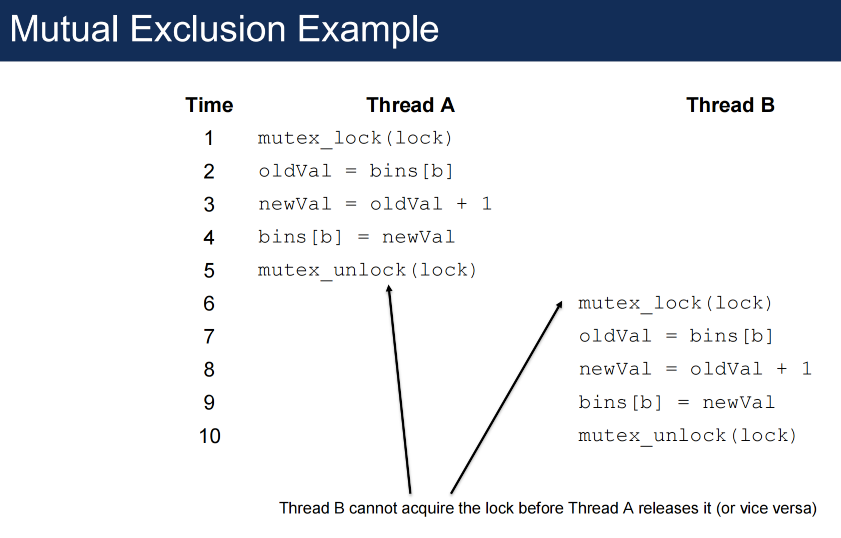


### Atomic Operations

**Atomic operations** perform read-modify-write with a single ISA instruction(Instruction Set Architecture 指令集架构)

The hardware guarantees that no other thread can access the memory location until the operation completes

Concurrent atomic operations to the same memory location are serialized by the hardware 对同一内存位置的并发原子操作由硬件序列化


When **two threads may write to** the **same memory** location, the program may **need atomic operations**.

-   Sharing is **not always easy to recognize**…
-   Do two insertions into a hash table share data?
-   What about two graph node updates based on all of the nodes’ neighbors?
-   What if nodes are on same side of bipartite graph?

Common failure mode:

-   **Programmer** **thinks** **operations** are **independent**.
-   Hasn’t considered input data for which they are not.
-   Or another programmer reuses code without understanding assumptions that imply independence.

Also: **atomicity does not constrain relative order**.


#### Implementing Atomic Operations

Many ISAs offer synchronization primitives, instructions with one (or more) address operands

that execute atomically with respect to one another when used on the same address.

Mostly read, modify, write operations

-   Bit test and set
-   Compare and swap / exchange
-   Swap / exchange
-   Fetch and increment / add

#### Atomicity Enforced by Microarchitecture

When synchronization primitives execute, **hardware ensures** that **no other** thread**accesses** the location **until** the operation is **complete**.

Other threads that access the locationare typically stalled or held in a queue until their turn.

**Threads perform atomic operations serially**. 串行

 

#### Atomic Compare and Swap (CAS)

CAS is an atomic instruction used in multithreading to achieve synchronization. CAS是多线程中用来实现同步的原子指令

It compares the contents of a memory location with a given value and, only if they are the same, modifies the contents of that memory location to a new given value. This is done as a single atomic operation.

```c
bool atomicCAS(int *address, int old, int new) {
  if (*address != old)
    return false;
  *address = new;
  return true;
}
```

### Atomic Operations in CUDA

The function performs the action `*address ← *address + value` atomically and returns the original value stored at address. 

There is no requirement that any sequence of operations is atomic except for atomicCAS. 除 atomicCAS 外，其他操作序列均不要求原子性。

```c
int atomicAdd(int* address, int value){
  bool done = false;
  while (!done) {
    old_v = *address;
    done = atomicCAS(address, old_v, old_v+value);
  }
  return old_v;
}
```

**`T atomicAdd(T* address, T val)`**

-   T can be int, unsigned int, float, double, etc.
-   Reads the value stored at `address`, adds `val` to it, stores the new value at address, and returns the old value originally stored
-   Function call translated to a single ISA instruction
-   Such special functions are called *intrinsics* 内在函数

#### Code with Atomic Operations


### Histogramming 直方图

A method for extracting notable features and patterns from large data sets

-   Feature extraction for object recognition in images
-   Fraud detection in credit card transactions
-   Correlating heavenly object movements in astrophysics

Basic histograms - for each element in the data set, use the value to identify a “bin” to increment

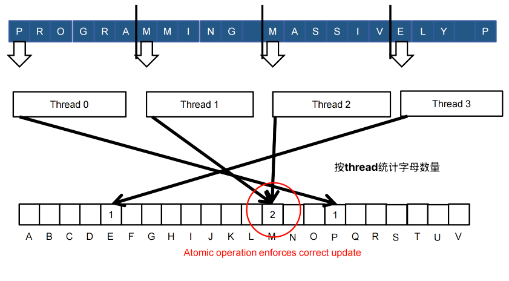

Problems: Reads from the input array are not coalesced

-   Assign inputs to each thread in a strided pattern
-   Adjacent threads process adjacent input letters

#### A Histogram Kernel

```c
__global__ void 
{
  histo_kernel(char *buf, long size, int *histo)
    int i = threadIdx.x + blockIdx.x * blockDim.x;
  // stride = total # of threads
  int stride = blockDim.x * gridDim.x; 
  // All threads in the grid collectively handle 
  // blockDim.x * gridDim.x consecutive elements
  while (i < size) {
    atomicAdd( &(histo[buf[i]]), 1); //ASCII value is the bin number
    i += stride;
  }
}
```


### Atomic Operations on DRAM


#### High Latency

Atomic operations on global memory have high latency

-   Need to **wait for both read and write** to complete
-   Need to wait if there are other threads accessing the same location (high probability of contention)


**Throughput of an atomic operation** 原子操作的吞吐量 is the rate at which the application can execute an atomic operation on a particular location.

The rate is limited by the total latency of the read-modify-write sequence, typically more than 1000 cycles for global memory (DRAM) locations.

This means that if many threads attempt to do atomic operation on the same location (contention), the memory bandwidth is reduced to < 1/1000!

该速率受读取-修改-写入序列的总延迟限制，对于全局内存 (DRAM) 位置，通常超过 1000 个周期。

这意味着，如果多个线程尝试在同一位置执行原子操作（争用），内存带宽将降低到 < 1/1000！


Latency 每个顾客先开始结账再回去购物

#### Hardware Improvements

Atomic operations on **L2 cache**

-   medium latency, but still serialized
-   Global to all blocks
-   “Free improvement” on Global Memory atomics

Atomic operations on **Shared Memory**

-   Very short latency, but still serialized
-   Private to each thread block
-   Need algorithm work by programmers (more later)

#### Privatizing the Histogram

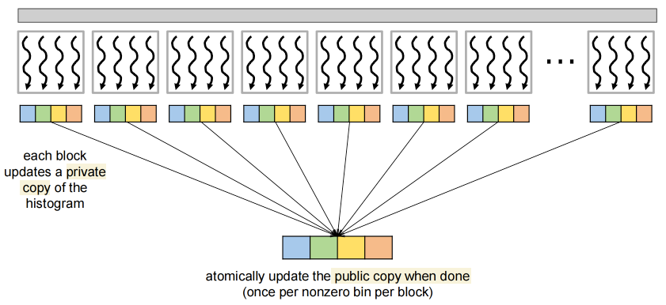

**Privatization** 私有化 is an optimization where multiple private copies of an output are maintained, then the public copy is updated on completion

-   Operations on the output must be associative and commutative because the order of updates has changed
-   Advantage: reduces contention on the public copy 减少了对公共副本的争用


Atomics in Shared Memory Requires Privatization

```c
__global__ void histo_kernel(unsigned char *buffer,
                             long size, unsigned int *histo) 
{
  __shared__ unsigned int histo_private[256];
  // warning: this will not work correctly if there are fewer than 256 threads!
  if (threadIdx.x < 256) 
    histo_private[threadIdx.x] = 0;
  __syncthreads();
```

-   Create private copies of the `histo[]` array for each thread block

Build Private Histogram

```c
int i = threadIdx.x + blockIdx.x * blockDim.x;
// stride is total number of threads
int stride = blockDim.x * gridDim.x;
while (i < size) {
  	atomicAdd( &(private_histo[buffer[i]), 1);
   	i += stride;
}
```

-   Use private copies of the `histo[]` array to compute

Build Final Histogram

```c
// wait for all other threads in the block to finish
__syncthreads();
if (threadIdx.x < 256) 
  atomicAdd( &(histo[threadIdx.x]), 
            private_histo[threadIdx.x] );
}
```

-   Copy from the `histo[]` arrays from each thread block to global memory


Privatization is a powerful and frequently used technique for parallelizing applications

-   The operation needs to be associative and commutative
-   The histogram add operation is associative and commutative
-   The histogram size needs to be small to fit into shared memory

What if the histogram is too large to privatize？

>   Part of in the shared memory; some threads to update a certain range of blocks; several runs, maybe control divergence


### Problem Solving


>   The total time taken by a thread for all operations, assuming all atomic operations are in L2 cache, is: 5 atomic  operations * 5ns/atomic operation + 100 floating-point operations * 1ns/floating-point operation = 25ns + 100ns = 125ns
>
>   Similarly, the total time taken by a thread for all operations, assuming all atomic operations are in DRAM, is: 5 atomic  operations * 120ns/atomic operation + 100 floating-point operations * 1ns/floating-point operation = 600ns + 100ns = 700ns
>
>   Let's denote the percentage of atomic operations that happened in DRAM as x. Therefore, operations that happened in L2 cache is 1 – *x* and the total execution time of a thread is: (1-*x*) * 125ns/thread + *x* * 700ns/thread
>
>   Given that the floating point taken for all operations is 0.2424 GFLOPS, we can calculate the total time in a thread (1 GFLOP = 1 billion floating-point operations): 0.2424 GFLOPS = 0.2424 * 1 billion floating-point operations/second = 242.4 million floating-point operations/second. 
>
>   Since every thread performs 100 floating 242.4 million threads/second = 242.4 million floating -point operations, the number of threads that can be executed per second is:  -point operations/second / 100 floating-point operations/thread = 2.424 million threads/second.
>
>   Therefore, the total time taken for all operations in a thread is: 1 / 2.424 million threads/second = 0.0000004125  seconds/thread = 412.5ns/thread.
>
>   • Thus: (1 – *x*) * 125ns/thread + *x* * 700ns/thread = 412.5ns/thread. Solving this for x gives us 50%.

## 14 Parallel Computation Patterns – Reduction Trees

### Reduction

A **reduction** operation reduces a set of input values to one value

-   e.g., sum, product, min, max

Reduction operations are:

-   Associative
-   Commutative
-   Have a well-define identity value


Sequential Reduction is $O(N)$

### Parallel Reduction in $\log(N)$ Steps

-   Approach: Every thread adds two elements in each step
-   Takes $\log(N)$ steps and half the threads drop out every step
-   Pattern is called a reduction tree


For **N** **input values**, the **number of operations** is $\frac12N+\frac14N+...+\frac1NN=(1-\frac1N)N=N-1$

The parallel algorithm shown is **work-efficient**: requires the **same amount of work as a sequential algorithm**(constant overheads, but nothing dependent on **N**).


In our **parallel reduction**, the **number of operations halves in every step**.

This kind of **narrowing parallelism is common** from combinational logic circuits to basic blocks to high-performance applications.

CUDA kernels allow only a fixed number of threads

### Segmented Reduction

Synchronize across threads in different blocks

Every thread block reduces a segment of the input and produces a partial sum

The partial sum is atomically added to the final sum


### Parallel Strategy for CUDA

**N** values in device global memory

Each **thread block** of **M** threads uses shared memory, to **reduce chunk of 2M** values to one value (2M << N to produce enough thread blocks).

Blocks operate **within shared memory** to reduce global memory traffic, and **write one value back** to global memory.

#### CUDA Reduction Algorithm

1.   **Read** block of **2M values** into shared memory
2.   For each of **log(2M)** steps, **combine two values** per thread in each step, **write result** to shared memory, and **halve** the number of **active threads**.
3.   **Write final result** back to global memory.

#### A Simple Mapping of Data to Threads

Each **thread** 

-   begins with two **adjacent locations** (**stride of 1**),
-   **even index (first)** and an odd index (second).

Thread 0 gets 0 and 1, Thread 1 gets 2 and 3, …

-   Write the **result** back **to** the **even index**.
-   After each step, **half of** active **threads** are **done**.
-   **Double the stride**.
-   At the end, the result is at **index 0**.


```c
unsigned int segment = 2*blockDim.x*blockIdx.x;
unsigned int i = segment + 2*threadIdx.x;
for(unsigned int stride = 1; stride <= BLOCK_DIM; stride *= 2) {
  if(threadIdx.x%stride == 0) {
    input[i] += input[i + stride];
  }
  __syncthreads();
}
```

Problems

-   Accesses to input are not coalesced
-   Control divergence

#### Control Divergence Reduced


```c
unsigned int segment = 2*blockDim.x*blockIdx.x;
unsigned int i = segment + threadIdx.x;
for(unsigned int stride = BLOCK_DIM; stride > 0; stride /= 2) {
  if(threadIdx.x < stride) {
    input[i] += input[i + stride];
  }
  __syncthreads();
}
```

#### Data Reuse

While specific data values are not reused, the same memory locations are repeatedly read and written

**Optimization**: load input to shared memory first and perform reduction tree on shared memory

Also avoids modifying the input if needed in the future

#### Using shared Memory

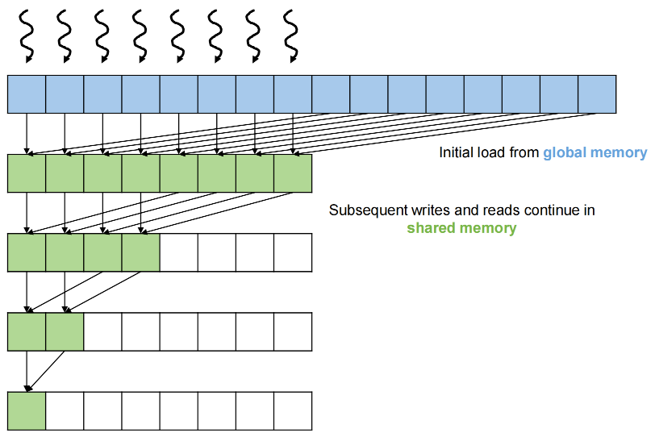

```c
unsigned int segment = 2*blockDim.x*blockIdx.x;
unsigned int i = segment + threadIdx.x;
// Load data to shared memory
__shared__ float input_s[BLOCK_DIM];
input_s[threadIdx.x] = input[i] + input[i + BLOCK_DIM];
__syncthreads();
// Reduction tree in shared memory
for(unsigned int stride = BLOCK_DIM/2; stride > 0; stride /= 2) {
  if(threadIdx.x < stride) {
    input_s[threadIdx.x] += input_s[threadIdx.x + stride];
  }
  __syncthreads();
}
```

###  Reducing Synchronization with Warp-level Primitives

During the last few iterations, only one warp is active

-   We can take advantage of the special relationship between threads in the same warp to synchronize between them quickly

Built-in **warp shuffle functions** enable threads to share data with other threads in the same warp

Faster than using shared memory and `__syncthreads()` to share across threads in the same block

```c
__shfl_sync() //Direct copy from indexed lane
__shfl_up_sync() //Copy from a lane with lower ID relative to caller
__shfl_down_sync() // Copy from a lane with higher ID relative to caller
__shfl_xor_sync() // Copy from a lane based on bitwise XOR of own lane ID
```

-   When one warp remains, use warp shuffle instructions to synchronize within the warp and share data from registers


#### Code for Reduction with Warp Shuffle

```c
__device__ __inline__ float warpReduce(float val) {
  float partialSum = val;
  for(unsigned int stride = WARP_SIZE/2; stride > 0; stride /= 2) {
    partialSum += __shfl_down_sync(0xffffffff, partialSum, stride); // move partialSum from lane index i + delta  to index i
  }
  return partialSum;
}
...
  // Reduction tree in shared memory
  for(unsigned int stride = BLOCK_DIM/2; stride > WARP_SIZE; stride /= 2) {
    if(threadIdx.x < stride) {
      input_s[threadIdx.x] += input_s[threadIdx.x + stride];
    }
    __syncthreads();
  }
if(threadIdx.x < WARP_SIZE) { // threads in the first warp
  // Reduction tree with shuffle instructions
  float partialSum = input_s[threadIdx.x]
    + input_s[threadIdx.x + WARP_SIZE]; // put values into registers
  partialSum = warpReduce(partialSum); // 32 threads
}
```

#### Warp-level Programming with Cooperative Groups

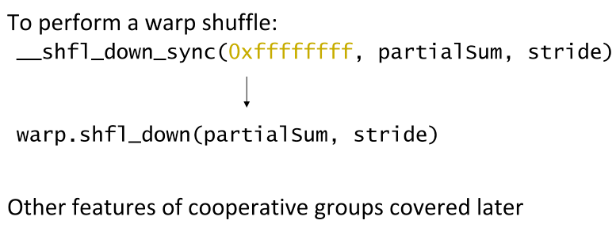

#### Reduction with Warp Shuffle Code using Cooperative Groups

```c
#include <cooperative_groups.h>
using namespace cooperative_groups;
__device__ __inline__ float warpReduce(float val) {
  thread_block_tile<32> warp = tiled_partition<32>(this_thread_block());
  float partialSum = val;
  for(unsigned int stride = warp.size()/2; stride > 0; stride /= 2) {
    partialSum += warp.shfl_down(partialSum, stride);
  }
  return partialSum;
}
```

Synchronization in Reduction with Warp Shuffle

-   Still incur block-wide synchronization overhead in the first half of the iterations

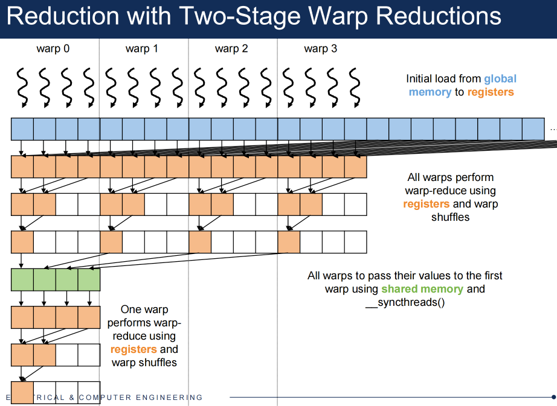

#### Code for Reduction with Two-Stage Warp Reductions

```c
unsigned int segment = 2*blockDim.x*blockIdx.x;
unsigned int i = segment + threadIdx.x;
// Load data to registers
float partialSum = input[i] + input[i + BLOCK_DIM];
// Reduction tree with shuffle instructions
partialSum = warpReduce(partialSum);
// Combine partial sums in shared memory
__shared__ float partialSums_s[BLOCK_DIM/WARP_SIZE];
if(threadIdx.x%WARP_SIZE == 0) {
  partialSums_s[threadIdx.x/WARP_SIZE] = partialSum;
}
__syncthreads();
if(threadIdx.x < WARP_SIZE) {// the first warp
  // Reduction tree with shuffle instructions
  float partialSum = partialSums_s[threadIdx.x];
  partialSum = warpReduce(partialSum);
}
```


#### Divergence in Reduction with Two-Stage Warp Reductions


#### Thread Coarsening

Cost of parallelization:

-   Synchronization every step
-   Control divergence in the final steps
-   Better to coarsen threads if there are many more blocks than resources available


Code for Reduction with Thread Coarsening

```c
unsigned int segment = COARSE_FACTOR*2*blockDim.x*blockIdx.x;
unsigned int i = segment + threadIdx.x;
// Load data to registers
float partialSum = 0.0f;
for(unsigned int tile = 0; tile < COARSE_FACTOR*2; ++tile) {
  partialSum += input[i + tile*BLOCK_DIM];
}
// Reduction tree with shuffle instructions
partialSum = warpReduce(partialSum);
// Combine partial sums in shared memory
__shared__ float partialSums_s[BLOCK_DIM/WARP_SIZE];
if(threadIdx.x%WARP_SIZE == 0) {
  partialSums_s[threadIdx.x/WARP_SIZE] = partialSum;
}
__syncthreads();
if(threadIdx.x < WARP_SIZE) {
  // Reduction tree with shuffle instructions
  float partialSum = partialSums_s[threadIdx.x];
  partialSum = warpReduce(partialSum);
}
```

#### Coarsening Benefits

Let *N* be the number of elements per original block

-   i.e., *N* = 2*blockDim.x

If blocks are all executed in parallel:

-   *log(N)* steps, *log(N)* synchronizations

If blocks serialized by the hardware by a factor of C:

-   *C\*log(N)* steps, *C\*log(N)* synchronizations

If blocks are coarsened by a factor of C:

-   *2\*(C – 1) + log(N)* steps, *log(N)* synchronizations

## 15 **Parallel Computation** Patterns – Parallel Scan (Prefix Sum)

>   [!NOTE]
>
>   To learn parallel scan (prefix sum) algorithms based on reductions
>
>   Kogge-Stone Parallel Scan
>
>   Brent-Kung Parallel Scan
>
>   Hierarchical algorithms
>
>   To learn the concept of double buffering
>
>   To understand tradeoffs between work efficiency and latency

### Scan

A **scan** operation:

Takes:

1.   An input array $[x_0, x_1, …, x_{n-1}]$ 
2.   An associative operator $⊕$ 某一种运算,  e.g., sum, product, min, max

Returns:

-   An output array $[y_0, y_1, …, y_{n-1}]$ where
    -   **Inclusive scan**: $y_i = x_0 ⊕ x_1 ⊕ ... ⊕ x_i$
    -   **Exclusive scan**: $y_i = x_0 ⊕ x_1 ⊕ ... ⊕ x_{i-1}$


#### Sequential scan


#### Segmented scan

Parallel scan requires synchronization across parallel workers

Approach: **segmented scan **分段扫描

-   Every thread block scans a segment

-   Synchronize across blocks 跨块同步 to consolidate the segments (covered later)

For now, we will focus on implementing a parallel scan in each block, double buffering 双缓冲


How do we consolidate the results of the different thread blocks?

-   Try the same strategy as the warp-level and thread-level decomposition
-   Scan partial sums, then add scanned partial sums
-   We can use three separate kernels

#### Thee-Kernel Scan


#### Using Global Memory Contents in CUDA

Data in registers and shared memory of one thread block are not visible to other blocks

To make data visible, the data has to be written into global memory

However, any data written to the global memory are not visible until a memory fence. This is typically done by terminating the kernel execution

Launch another kernel to continue the execution. The global memory writes done by the terminated kernels are visible to all thread blocks.

一个线程块的寄存器和共享内存中的数据对其他线程块不可见。

要使数据可见，必须将数据写入全局内存。

但是，任何写入全局内存的数据在内存栅栏之前都是不可见的。这通常是通过终止内核执行来实现的。

启动另一个内核以继续执行。终止的内核执行的全局内存写入操作对所有线程块都可见。

### Kogge-Stone Parallel (Inclusive) Scan

#### Parallel Inclusive Scan using Reduction Trees

-   Calculate each output element as the reduction of all previous elements
-   Some reduction partial sums will be shared among the calculation of output elements
-   Based on hardware added design by Peter Kogge and Harold Stone at IBM in the 1970s – Kogge-Stone Trees
-   Goal: low latency

#### Parallel (Inclusive) Scan

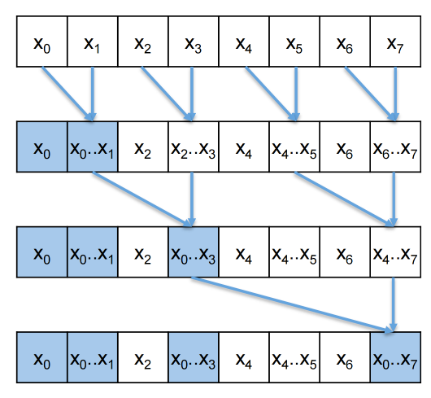

-   Another reduction tree gives us more elements
-   A parallel reduction tree for the last element gives some others as a byproduct 副产物
-   Overlap the trees and do them simultaneously

#### Kogge-Stone Parallel (Inclusive) Scan

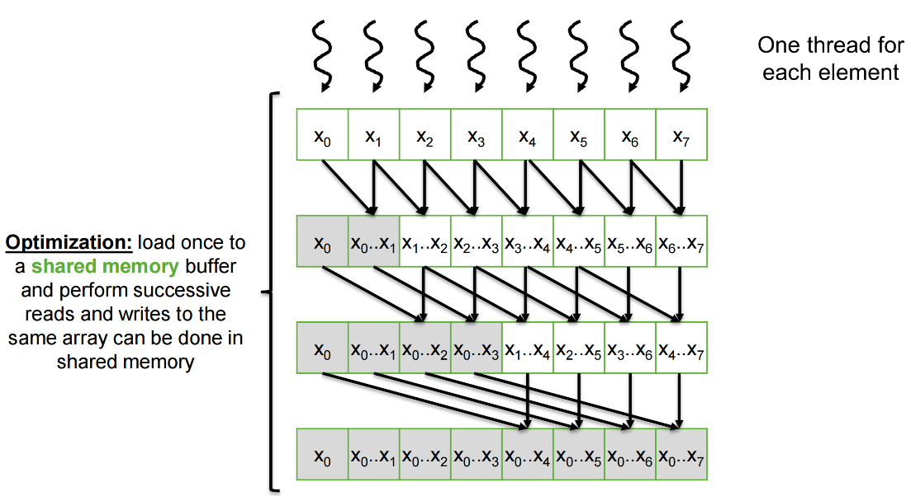

Incorrect code(without sync)

```c
unsigned int i = blockIdx.x*blockDim.x + threadIdx.x;
__shared__ float buffer_s[BLOCK_DIM];
buffer_s[threadIdx.x] = input[i];
__syncthreads();
for(unsigned int stride = 1; stride <= BLOCK_DIM/2; stride *= 2) {
  if(threadIdx.x >= stride) {
    buffer_s[threadIdx.x] += buffer_s[threadIdx.x - stride];
    // Incorrect!
    // Different threads are reading and writing the same data location without synchronizing
  }
  __syncthreads();
}
output[i] = buffer_s[threadIdx.x];
```

Correct

```c
unsigned int i = blockIdx.x*blockDim.x + threadIdx.x;
__shared__ float buffer_s[BLOCK_DIM];
buffer_s[threadIdx.x] = input[i];
__syncthreads();
for(unsigned int stride = 1; stride <= BLOCK_DIM/2; stride *= 2) {
  float v;
  if(threadIdx.x >= stride) {
    v = buffer_s[threadIdx.x - stride];
  }
  __syncthreads(); // Wait for everyone to read before writing
  // This synchronization enforces a false dependence (we only need to finish reading before others write because we are using the same buffer)
  
  if(threadIdx.x >= stride) {
    buffer_s[threadIdx.x] += v;
  }
  __syncthreads(); // This synchronization enforces a true dependence (we must finish writing before others can read)
}
output[i] = buffer_s[threadIdx.x];
```


### Double Buffering

**Optimization:** eliminate the synchronization that enforces a false dependence by using separate 

buffers for reading and writing, and alternate the buffers each iteration


#### Double Buffering Code

```c
unsigned int i = blockIdx.x*blockDim.x + threadIdx.x;
__shared__ float buffer1_s[BLOCK_DIM];
__shared__ float buffer2_s[BLOCK_DIM];
float* inBuffer_s = buffer1_s;
float* outBuffer_s = buffer2_s;
inBuffer_s[threadIdx.x] = input[i];
__syncthreads();
for(unsigned int stride = 1; stride <= BLOCK_DIM/2; stride *= 2) {
  if(threadIdx.x >= stride) {
    outBuffer_s[threadIdx.x] =
      inBuffer_s[threadIdx.x] + inBuffer_s[threadIdx.x - stride];
  } else {
    outBuffer_s[threadIdx.x] = inBuffer_s[threadIdx.x];
  }
  __syncthreads();
  float* tmp = inBuffer_s;
  inBuffer_s = outBuffer_s;
  outBuffer_s = tmp;
}
output[i] = inBuffer_s[threadIdx.x];
```


#### Code for Scan with Warp-level Primitives

```c
__global__ void scan_kernel(float* input, float* output, unsigned int N) {
  unsigned int i = blockIdx.x*blockDim.x + threadIdx.x;
  float val = input[i];
  val = blockScan(val);
  output[i] = val;
}
__device__ inline int laneIdx() { return threadIdx.x % WARP_SIZE; }
__device__ inline int warpIdx() { return threadIdx.x / WARP_SIZE; }
__device__ inline float warpScan(float val) {
  #pragma unroll
  for(unsigned int stride = 1; stride < WARP_SIZE; stride *= 2) {
    float leftVal = __shfl_up_sync(0xffffffff, val, stride);
    if(laneIdx() >= stride) {
      val += leftVal;
    }
  }
  return val;
}
```

#### Work Efficiency

A parallel algorithm is **work-efficient** if it performs the same amount of work as the corresponding sequential algorithm

Work efficiency of parallel scan

-   Sequential scan performs *N* additions
-   **Kogge-Stone parallel scan** performs:
    -   $\log(N)$ steps, $N - 2^{step}$  operations per step
    -   Total: $(N-1) + (N-2) + (N-4) + … + (N-N/2)\\ = N*\log(N) - (N-1) = O(N*\log(N))$ operations
    -   Algorithm is not work efficient
        -   A factor of $\log(n)$ hurts: 20x for 1,000,000 elements!
        -   Typically used within each block, where n ≤ 1,024

#### Improve Efficiency

A common parallel algorithm pattern: *Balanced Trees*

Build a balanced binary tree on the input data and sweep it to and from the root

Tree is not an actual data structure, but a conceptual pattern

For scan:

-   Traverse down from leaves to root building partial sums at internal nodes in the tree
    -   Root holds sum of all leaves
-   Traverse back up the tree building the scan from the partial sums

### Brent-Kung Parallel Scan Step

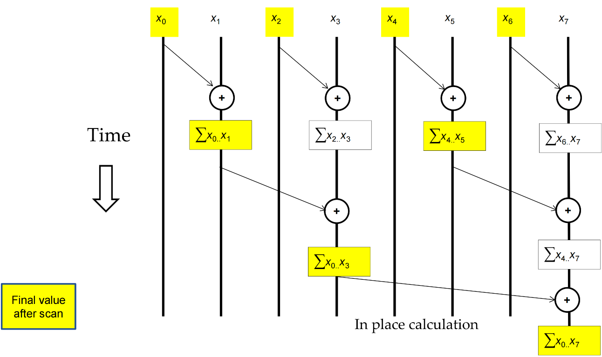

Inclusive Post-Scan Step 包含后扫描步骤


Reduction Step Kernel Code

```c
// float T[2*BLOCK_SIZE] is in shared memory
// for previous slide, BLOCK_SIZE is 8
int stride = 1;
while(stride < 2*BLOCK_SIZE) {
  __syncthreads();
  int index = (threadIdx.x+1)*stride*2 - 1;
  if(index < 2*BLOCK_SIZE && (index-stride) >= 0)
    T[index] += T[index-stride];
  stride = stride*2;
}
// In our example,
// threadIdx.x+1 = 1, 2, 3, 4, 5, 6, 7, 8
// stride = 1, index = 1, 3, 5, 7, 9, 11, 13, 15
```

Post Scan Step (Distribution Tree)

```c
int stride = BLOCK_SIZE/2;
  while(stride > 0) {
    __syncthreads();
    int index = (threadIdx.x+1)*stride*2 - 1;
    if ((index+stride) < 2*BLOCK_SIZE) 
      T[index+stride] += T[index];
    stride = stride / 2; 
  }
// In our example, 
// BLOCK_SIZE=8 stride=4, 2, 1
// for first iteration, active thread = 0 index = 7, stride = 11
```

#### Work Analysis

The parallel Scan executes $2*\log(n)$ parallel iterations

-   $\log(n)$ in reduction and $\log(n)$ in post scan

-   The iterations do $n/2, n/4,..1, (2-1), …., (n/4-1), (n/2-1)$ useful adds
-   In our example, n = 16, the number of useful adds is $16/2 + 16/4 + 16/8 + 16/16 + (16/8-1) + (16/4-1) + (16/2-1)$
-   Total adds: $(n-1) + (n-2) – (log(n) -1) = 2*(n-1) – log(n)$ ➡️  $O(n)$ work

The total number of adds is *no more than twice* of that done in the efficient sequential algorithm

The benefit of parallelism can easily overcome the 2× work when there is sufficient hardware

### Kogge-Stone vs. Brent-Kung

Brent-Kung uses *half* the number of *threads* compared to Kogge-Stone

-   Each thread should load two elements into the shared memory

Brent-Kung takes *twice* the number of *steps* compared to Kogge-Stone

-   Kogge-Stone is more popular for parallel scan with blocks in GPUs

### Overall Flow of Complete Scan


#### Scan of Arbitrary Length Input

1.   Build on the scan kernel that handles up to `2*blockDim.x` elements from Brent-Kung.(For Kogge-Stone, have each section of `blockDim.x` elements assigned to a block）
2.   Have each block write the sum of its section into a Sum array using its `blockIdx.x` as index
3.   Run parallel scan on the Sum array
4.   May need to break down Sum into multiple sections if it is too big for a block
5.   Add the scanned Sum array values to the elements of corresponding sections

基于 Brent-Kung 算法构建的扫描内核，最多可处理 2*blockDim.x 个元素。

（对于 Kogge-Stone 算法，将 blockDim.x 个元素的每个部分分配给一个块。

让每个块使用其 blockIdx.x 作为索引，将其部分的总和写入 Sum 数组。

对 Sum 数组进行并行扫描。

如果 Sum 数组对于一个块来说太大，可能需要将其拆分成多个部分。

将扫描到的 Sum 数组值添加到相应部分的元素中。

#### Memory Bandwidth Considerations

Scan is **memory bound**

-   Let’s analyze the number of memory accesses for scanning an array of *N* values

-   Ignore accesses to partial sums array which are much fewer for a large block size and coarsening factor


#### Single-Kernel Scan

How can we perform the inter-block scan inside the same kernel as the segmented scan?

>   One approach is to use **grid-wide barrier synchronizations**网格范围屏障同步 with cooperative groups and scan the partial sums with a single thread block
>
>   Limits the number of thread blocks that can execute, thereby the size of the array that can be scanned
>
>   Another approach is to use **unidirectional synchronization**单项同步 to pass the partial sums from earlier thread blocks to later thread blocks


### Problem solving


>   The key is to understand that the Brent-Kung parallel scan algorithm operates in two main phases within each block. The question asks for the total number of additions across both phases.
>
>   The number of elements processed per block is **n = 2048**.
>
>   **1. Phase 1: Reduction (or Up-Sweep)**
>
>   -   **Goal:** To calculate the sum of all `n` elements within the block.
>   -   **Process:** This phase works like a tournament. In each step, pairs of elements are added together, reducing the number of active elements by half until only a single element—the total sum of the block—remains.
>   -   **Calculation:** To sum `n` numbers, you need to perform exactly **n - 1** addition operations.
>   -   **Approximation:** For `n = 2048`, this is `2048 - 1 = 2047` additions. This is well approximated as **2048** operations.
>
>   **2. Phase 2: Post-Scan (or Down-Sweep)**
>
>   -   **Goal:** To use the block's total sum and the intermediate values calculated during the reduction phase to compute the final scan value for each element.
>   -   **Process:** This phase starts with the block sum and works its way "down the tree" that was conceptually built during the up-sweep. It distributes the partial sums to calculate the correct prefix sum for every element in the block.
>   -   **Calculation:** This phase also requires approximately **n - 1** addition operations in most efficient parallel implementations.
>   -   **Approximation:** For `n = 2048`, this is also approximated as **2048** operations.
>
>   The total number of floating-point add operations is the sum of the operations from both phases.
>
>   -   **Total Operations** = (Additions in Reduction) + (Additions in Post-Scan)
>   -   **Total Operations** ≈ $n + n = 2n$
>   -   **Total Operations** ≈ $2048 + 2048 = \textbf{2048 x 2}$
>
>   **Note:** The other information in the prompt, such as the total input size ($2^{42}$), threads per block (1024), and grid size (2048), is context for the overall hierarchical algorithm but is **not needed** to calculate the number of operations *within a single block*.

## 16 Advanced Optimizations for Projects


General (dense) matrix multiplication is both compute and memory intensive

### Where We Left Off: Basic Shared Memory Tiling


#### Parameter Tuning in Basic Shared Memory Tiling

Thread block (output tile) can be **non-square**

`S` (input tile shared dimension) can be flexible

But why?

-   Larger **T** and **U** allows for more reuse *(recall they each represent reuse in M and N)*
-   Larger **S** allows for less `__syncthreads()`

#### Basic Shared Memory Tiling Efficiency

Your block size `(UxT)` is **limited**, can’t increase much (32 x 32 = 1024). 

For the GPUs we use in delta (NVIDIA A40), biggest thread block is **32 x 32**

Each input loaded is used 32 times in shared memory

A40’s peak FP32 compute throughput is *37.4 TFLOPs* (*37400 GFLOPs*), but peak memory throughput is only *696 GB/s*, so *32x* reuse means *5568* GFLOPs, far less than the peak obtainable compute throughput. 

Basic shared memory tiling matmul **performs poorly** on modern GPUs without further optimizations

#### Better Than Shared Memory

**Registers** have low access latency and high throughput

Basic shared memory tiling makes little use of the register hardware

However, registers are also **local to each thread**, meaning they cannot be reused between different threads.

Thread Coarsening Comes to the Rescue

### Joint Register and Shared Memory Tiling

Either one of the 2 input tiles can be placed into registers.

Let’s just pick `M` (for no good reason*).

Each row of an `M` tile is loaded into a **single thread’s registers**

That thread then uses the registered values to compute an entire row of **U** output values. 

*Don’t make U too big, you don’t have an unlimited number of registers*

-   **U = 16** is a reasonable size.

The output tile height `T` is now the **number of threads in the block**, and you’ll probably want more than 4.

Remember **the dimension of the output tile decides how much reuse you get**.

However, don’t make it too big that you start to run out of registers; it's good to do some parameter sweeping.

We also need to load the input tile from `N` into shared memory.

Do this the old-fashioned way, each thread in a block loads **1** value of N into a shared memory tile.

>   *Pop Quiz*: Given **U** and **T**, what should **S** be then?
>
>   Since we have **T** threads, and there are **S**x**U** elements in an `N` tile, each thread loading **1** value would mean **S** x **U** = **T**
>
>   -   **S = T / U**
>   -   *You can also choose to load more than 1 input per thread, but it’s more complicated.*

After a tile of `M` and a tile of `N` is loaded, the actual computation is simple. 

Each thread uses the **row of `M` in its registers** and the **entire tile of `N` in shared memory** to multiply and accumulate to `U` different output values.

Then start over again, load the next tile of `M` and `N`, compute, add to the `U` different output values

You should probably have **registers for the output values** of each thread.

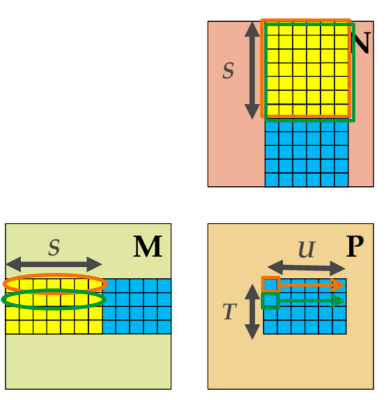

-   One of the tile is completely utilized by other threads

-------


>   [!CAUTION]
>
>   Does this algorithm have **coalesced loads** for `M` and `N`?
>
>   For loading `N` into **shared memory**, it’s easy to make sure loads are coalesced. 
>
>   But what about `M`?
>
>   Each thread loads a row of consecutive values from M…(At least 2 ways to make it coalesced.)
>
>   Consecutive threads load from other rows…


### Tensor cores——TF32

Tensor Cores are specialized matrix-matrix hardware compute units introduced in NVIDIA GPUs after their **Volta** generation.

This **hardware** addition significantly increases Matrix Multiplication efficiency

**TF32** is a special **floating-point format** used in NVIDIA Tensor Cores

TF32 stands for Tensor Float [*Not Quite*] 32-bit format

Less precision than FP32, but good enough for Deep Learning


**TF32** shares the same exponent format as FP32, and the mantissa format is simply a less precise version of FP32’s mantissa bits, so any TF32 value can also be stored in a float variable.

The CUDA intrinsic `__float_to_tf32` can be used to cast a float down to TF32.

### API

```c
fragment<>;

void load_matrix_sync();
void mma_sync();
void store_matrix_sync();

```

#### Spilt-K


#### Pointer Aliasing


#### Compiler Optimizations – The Restrict Keyword

The “*__restrict__*” keyword promises the compiler that any data **written** through that pointer is **not read** by any other pointer that <u>also has the restrict property</u>.


## 17 **Profiling on** Nvidia GPU Profiling

### Computation

A Grid/kernel is scheduled on an available GPU

A block is scheduled on an available Stream Multiprocessor

A group of 32 threads is scheduled on an available warp

### Cache

cache is


## 18 GPU Systems Architecture

### CUDA structurte

```c
Global variables declaration
• Kernel functions
• __global__ void kernelOne(…)
main () // host code
• allocate memory space on the device – cudaMalloc(&d_GlblVarPtr, bytes )
• transfer data from host to device – cudaMemcpy(d_GlblVarPtr, h_Gl…)
• execution configuration setup
• kernel call – kernelOne<<<execution configuration>>>( args… );
• transfer results from device to host – cudaMemcpy(h_GlblVarPtr,…)
  
• optional: compare against golden (host computed) solution
```


Classic (Historical) PC Architecture

(Original) PCI Bus Specification

### Peripheral Component Interconnect (PCI)

-   high latency protocol

-   PCI device registers are mapped into the CPU’s physical address space

    Accessed through loads/stores (kernel mode)

    Addresses are assigned to the PCI devices at boot time

    All devices listen for their addresses

PCI Express (PCIe)

-   switched, point-to-point connection
-   each card has dedicated “link” to the central switch, with no arbitration仲裁
-   packet switches: messages form virtual channel
-   prioritized packets for QoS (such as for real-time video streaming)

PCIe Generations

-   Within a generation, number of lanes in a link can be scaled using distinct physical channels (more bits / wider transfers) ×1, ×2, ×4, ×8, ×16, ×32, …

PCIe Gen 3 Links and Lanes

-   Each link consists of one or more lanes

-   Each lane is 1-bit wide (4 wires, each 2-wire pair can transmit 8Gb/s in one direction)

-   Each byte data is **128b/130b** encoded into 130 bits with equal number of 1’s and 0’s 

    Thus, the net data rates are 985 MB/s (x1), 1.97 GB/s (x2), 3.94 GB/s (x4), 7.9 GB/s (x8), 15.8 GB/s (x16), each way

Foundation: 8/10 bit encoding

Current: 128/130 bit encoding


SLI connector helps to syncronize GPUs sothat they render in the same speed.


### PCIe Data Transfer using DMA

DMA (Direct Memory Access) is used to fully utilize the bandwidth of an I/O bus

DMA uses physical address for source and destination

Transfers a number of bytes requested by OS

Needs pinned memory

### Pinned Memory

DMA uses physical addresses

The OS could accidentally page out the data that is being read or written by a DMA and page in another virtual page into the same location

Pinned memory cannot be paged out

If a source or destination of a cudaMemcpy in the host memory is not pinned, it needs to be first copied to a pinned memory – extra overhead

cudaMemcpy is much faster with pinned host memory source or destination


Allocate/Free Pinned Memory

```c
cudaHostAlloc();
cudaFreeHost();
```


NVIDIA Ampere GPUs: AI Accelerators


NVlink makes any GPU talk to other GPUs.

CPUs are interconnected.


IBM Power9 System

NO PCIe interconnect

#### Delta’s NVIDIA A40 GPUs

When profiling, make sure the CPU is not overloaded, have access to all GPUs(don't want other jobs on the host/system)

### Problem Solving


>   The goal is to find which kernel configuration (K1, K2, K3, or K4) achieves the maximum **occupancy**, which is defined as the ratio of active warps per SM to the maximum allowed warps per SM .
>
>   For a **Compute Capability (CC) 1.3** device, the key hardware limits per SM are :
>
>   -   **Max Warps per SM:** 32
>   -   **Max Blocks per SM:** 8
>   -   **Shared Memory per SM:** 16K
>   -   **Registers per SM:** 16K
>
>   We also use the standard CUDA definition of **1 warp = 32 threads**.
>
>   🧠 The Logic
>
>   To find the actual number of active warps, we first must find out how many **blocks** can run on a single SM at the same time. The number of concurrent blocks is limited by *all* of the SM's resources. A block can only be scheduled if it does not exceed *any* of the limits.
>
>   For each kernel, we must find the **limiting factor** by calculating the maximum number of blocks that can fit based on each resource limit.
>
>   1.  **Warps per Block:** First, we calculate how many warps are in each block(`blockDim`).
>       -   `Warps per Block = ceil(Threads per Block / 32)`
>   2.  **Find the Limiting Resource:** We find the maximum number of blocks allowed by each of the four SM limits.
>       -   **Limit 1 (Max Blocks):** `8` (this is a fixed limit)
>       -   **Limit 2 (Shared Memory):** `floor(Shared Memory per SM / Shared Memory per Block)`
>       -   **Limit 3 (Registers):** `floor(Registers per SM / Registers per Block)`
>       -   **Limit 4 (Warps):** `floor(Max Warps per SM / Warps per Block)`
>   3.  **Actual Blocks per SM:** The *actual* number of blocks that can run concurrently is the **minimum** of these four limits.
>       -   `Actual Blocks = min(Limit 1, Limit 2, Limit 3, Limit 4)`
>   4.  **Actual Warps per SM:** Once we know the actual number of blocks, we can find the total active warps.
>       -   `Actual Warps = Actual Blocks * Warps per Block`
>   5.  **Find the Max:** The kernel with the highest "Actual Warps per SM" has the maximum occupancy.
>
>   🧮 The Calculation
>
>   Let's apply this logic to each kernel using the data from the tables .
>
>   | **Kernel** | **Warps per Blockceil(Threads / 32)** | **Max Blocks(SM Limit)** | **Max Blocks(SMem Limit)** | **Max Blocks(Regs Limit)** | **Max Blocks(Warps Limit)** | **Actual Blocks per SM(Minimum of limits)** | **Actual Warps per SM(Actual Blocks \* Warps/Block)** |
>   | ---------- | ------------------------------------- | ------------------------ | -------------------------- | -------------------------- | --------------------------- | ------------------------------------------- | ----------------------------------------------------- |
>   | **K1**     | `ceil(160/32) = 5`                    | 8                        | `floor(16K/7K) = 2`        | `floor(16K/1K) = 16`       | `floor(32/5) = 6`           | `min(8, 2, 16, 6) = 2`                      | `2 * 5 = 10`                                          |
>   | **K2**     | `ceil(224/32) = 7`                    | 8                        | `floor(16K/8K) = 2`        | `floor(16K/6K) = 2`        | `floor(32/7) = 4`           | `min(8, 2, 2, 4) = 2`                       | `2 * 7 = 14`                                          |
>   | **K3**     | `ceil(288/32) = 9`                    | 8                        | `floor(16K/10K) = 1`       | `floor(16K/9K) = 1`        | `floor(32/9) = 3`           | `min(8, 1, 1, 3) = 1`                       | `1 * 9 = 9`                                           |
>   | **K4**     | `ceil(96/32) = 3`                     | 8                        | `floor(16K/4K) = 4`        | `floor(16K/2K) = 8`        | `floor(32/3) = 10`          | `min(8, 4, 8, 10) = 4`                      | `4 * 3 = 12`                                          |
>
>    ✅ Conclusion
>
>   By comparing the "Actual Warps per SM" for each kernel:
>
>   -   K1: 10 warps
>   -   **K2: 14 warps**
>   -   K3: 9 warps
>   -   K4: 12 warps
>
>   **K2** achieves the highest number of active warps (14), giving it the maximum occupancy (14/32 = 43.75%). This matches the provided answer .


## Quiz


>   A is correct
>

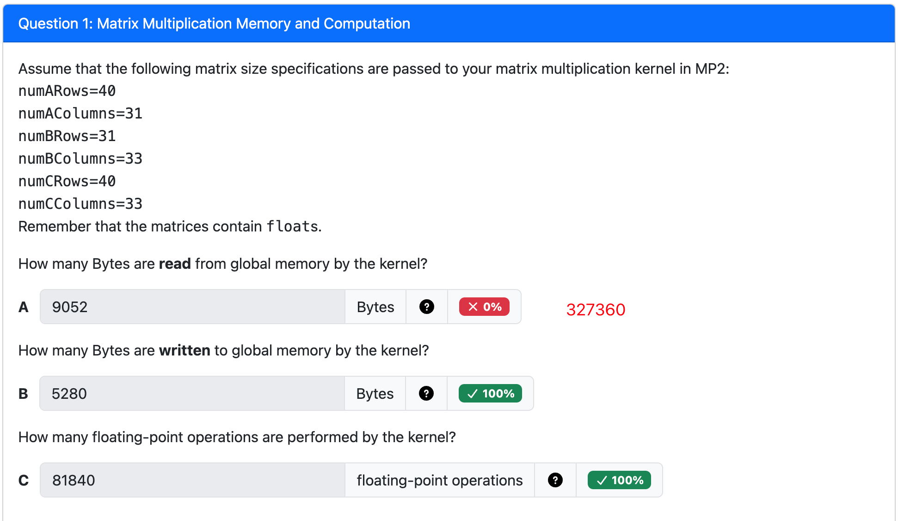

>   **A**
>
>   The kernel reads from matrix `A` and matrix `B` to compute the output. For each element in the output matrix `C`, the kernel performs a dot product. This involves reading a full row from `A` and a full row from `B` (conceptually, though access patterns might differ).
>
>   1.  **Elements in C:** The output matrix `C` has `numCRows` × `numCColumns` elements.
>       -   `40 * 33 = 1,320` elements.
>   2.  **Reads per C element:** To calculate one element of `C`, a dot product of length `numAColumns` is performed. This requires reading `numAColumns` floats from `A` and `numAColumns` floats from `B`.
>       -   Reads per element = `31 (from A) + 31 (from B) = 62` floats.
>   3.  **Total floats read:**
>       -   `1,320 elements * 62 floats/element = 81,840` floats.
>   4.  **Total bytes read:** Since each float is 4 bytes:
>       -   `81,840 floats * 4 bytes/float = 327,360` bytes.

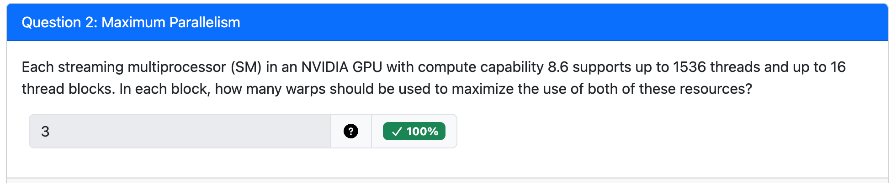

>   The goal is to choose a block size that allows the Streaming Multiprocessor (SM) to simultaneously reach its maximum thread count **and** its maximum block count.
>
>   1.  **Find the Ideal Threads per Block:** To saturate both limits, divide the total number of threads an SM can handle by the total number of blocks it can handle.
>    -   1536 total threads/16 total blocks=96 threads per block
>   2.  **Convert Threads to Warps:** A warp in an NVIDIA GPU always consists of 32 threads. Convert the ideal thread count into warps.
>       -   96 threads per block/32 threads per warp = 3 warps per block


Which of the following CUDA kernels could possibly have control divergence?

```c
__global__ void E(int[] io, int control) {
  unsigned int index = threadIdx.x + blockIdx.x * blockDim.x;
  if (control < 0) control = 1;
  if (control * threadIdx.x < 0) {
    if (io[index] == 0) io[index] = control;
  }
  io[index] *= control;
}
```

>   The number can't be negative for `control * threadIdx.x`, so no control divergence.

>   [!CAUTION]
>
>   

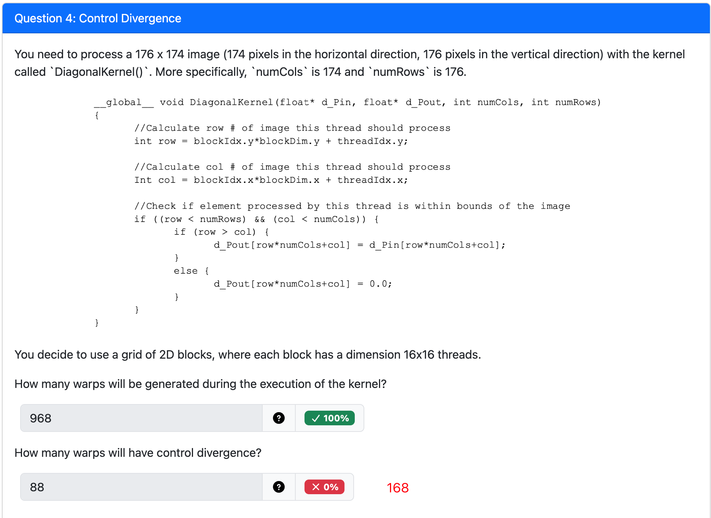

>   **How many warps will be generated?**
>
>   1.  **Calculate Grid Dimensions:**
>       -   The image has 176 rows and 174 columns.
>       -   Each block has 16 threads in the y-direction (height) and 16 threads in the x-direction (width).
>       -   Number of blocks in y-dimension: ceil(176/16)=ceil(11)=11 blocks.
>       -   Number of blocks in x-dimension: ceil(174/16)=ceil(10.875)=11 blocks.
>       -   This gives a grid of **11x11 = 121 blocks**.
>   2.  **Calculate Threads and Warps:**
>       -   Each block has **16x16 = 256 threads**.
>       -   A **warp** consists of 32 threads.
>       -   Warps per block: 256 threads/32 threads/warp=8 warps.
>   3.  **Calculate Total Warps:**
>       -   Total Warps = (Total Blocks) × (Warps per Block)
>       -   Total Warps = 121×8=968.
>
>   **Answer: `968`**
>
>   **How many warps will have control divergence?**
>   
>The answer is 168 because control divergence in this kernel originates from **two distinct sources**, and your original calculation of 88 only accounted for one of them. ==warp中既有row > col又有row≤col的会产生control divergence== 
>   
>1. The explicit `if (row > col)` check.
>   1. The implicit boundary check `if (... && (col < numCols))`.
>   
> **The `if (row > col)` Condition**
>   
>This is the most obvious source of divergence. A warp will diverge if some of its threads satisfy `row > col` while others don't. This happens in thread blocks that lie on the main diagonal of the image.
>   
>-   The grid of blocks is 11x11.
>   -   The blocks on the diagonal are those where `blockIdx.x == blockIdx.y`. There are **11** such blocks (from `(0,0)` to `(10,10)`).
>   -   Inside these blocks, every single one of the 8 warps will contain a mix of threads that are above and below the local diagonal (`threadIdx.y > threadIdx.x`), causing them all to diverge.
>   -   **Divergent Warps from this source:** 11 blocks×8 warps/block=88 warps.
>   
>**The Outer Boundary Check**
>   
>This is the subtle part you missed. The kernel launches a grid of threads that is slightly larger than the image itself.
>   
>-   **Grid Width:** The grid has 11 blocks of 16 threads each, for a total width of 11×16=176 threads.
>   -   **Image Width:** The image's `numCols` is only **174**.
>   
>Because of this mismatch, the outer `if` statement `if ((row < numRows) && (col < numCols))` will cause divergence for threads in the **last column of blocks** (where `blockIdx.x = 10`).
>   
>-   In these blocks, threads with a global column index `col < 174` will pass the check, while threads with `col >= 174` will fail it.
>   -   This boundary occurs within the warps of these blocks, causing all warps in that last column to diverge.
>   -   There are **11 blocks** in this last column (`blockIdx.x = 10`, while `blockIdx.y` ranges from 0 to 10).
>   -   **Divergent Warps from this source:** 11 blocks×8 warps/block=88 warps.
>   
>To get the total number of divergent warps, we add the warps from both sources and subtract the overlap (since the block at `(10,10)` is in both sets).
>   
>-   **Total = (Diagonal Warps 对角线) + (Boundary Warps 右边多出来的) - (Overlap Warps)**
>   -   The overlap is the single block `(10,10)`, which contains 8 warps.
>   -   Total = 88+88−8=168
>   
>So, there are 80 unique warps on the diagonal, 80 unique warps on the boundary, and 8 warps that are on both, leading to the final correct answer.

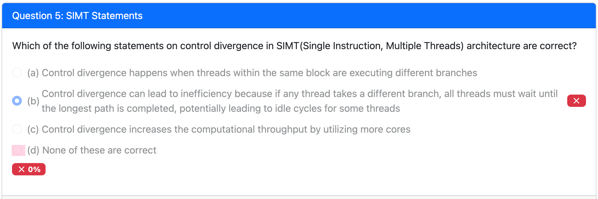

>   Control divergence is not "wait for the longest path"; it's even worse. It's basically going through all the paths sequentially. Suppose you have Path A and Path B that take 10ms/2ms to execute. Control divergence is basically saying you need to **sequentially execute** both path and the total execution time is 10+2=12ms. It has nothing to do with which path is longer since they're not parallel anymore.
>
>   'All threads must wait until the longest path is completed. '
>
>   This description usually fits *barrier synchronization* (we will talk about this concept soon), where multiple threads are running concurrently/in parallel and they synchronize at some point in the future. The threads that arrive first will wait for other threads. All threads won't continue until all threads have reached this synchronization point.

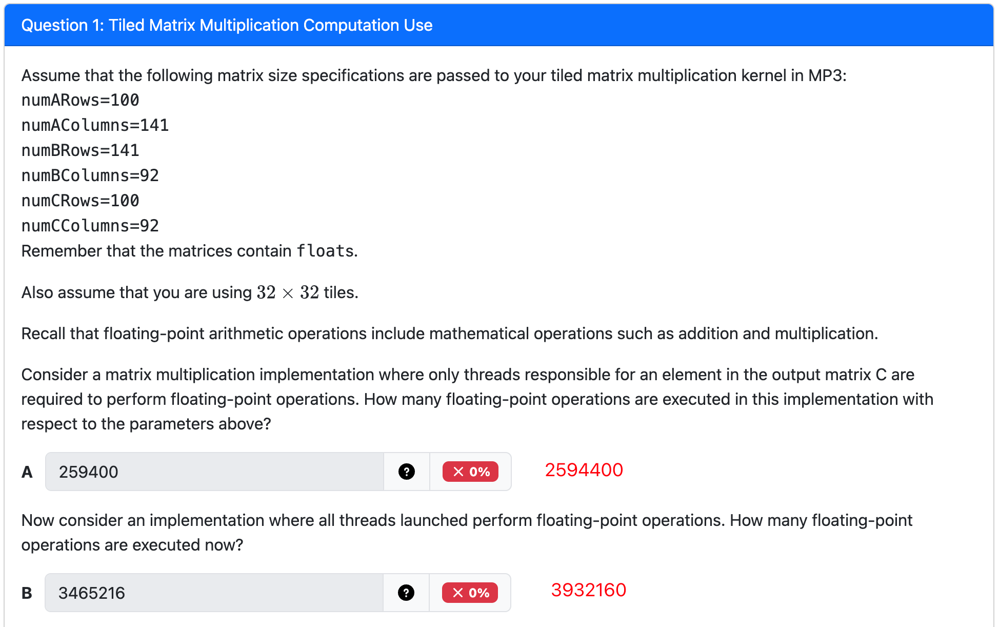

>   **A: Operations by Threads for C Elements**
>
>   This question asks for the number of floating-point operations (flops) required to calculate the final `C` matrix, ignoring any work done by threads outside the matrix's bounds.
>
>   1.  **Flops per Element:** To calculate a single element of the output matrix `C`, a dot product is performed. This involves iterating `numAColumns` (or `141`) times. Each iteration performs **one multiplication** and **one addition**.
>       -   Operations per element = 141×2=282 flops.
>   2.  **Total Elements in C:** The output matrix `C` has `numCRows` x `numCColumns` elements.
>       -   Total elements = 100×92=9,200 elements.
>   3.  **Total Operations:**
>       -   Total flops = (Total elements) × (Operations per element)
>       -   Total flops = 9,200×282=2,594,400.
>
>   **A: `2594400`**
>
>   ------
>
>   **B: Operations by All Launched Threads**
>
>   1.   Determine the Grid and Block Configuration
>
>        First, we determine how many threads are launched in total. This is based on covering the output matrix `C` (100x92) with 32x32 tiles, where each tile corresponds to a thread block.
>
>        -   **Grid Height:** ceil(numCRows/32)=ceil(100/32)=4 blocks
>        -   **Grid Width:** ceil(numCColumns/32)=ceil(92/32)=3 blocks
>        -   **Total Blocks:** 4×3=12 blocks
>        -   **Threads per Block:** 32×32=1,024 threads
>
>   2.   Determine the Number of Tile Iterations
>
>        For each thread block to compute its 32x32 output tile, it must loop over the tiles of the input matrices (`A` and `B`) along their common dimension, which is `numAColumns = 141`.
>
>        -   **Tile Loop Iterations:** ceil(numAColumns/32)=ceil(141/32)=5 iterations.
>
>   3.   Determine Operations per Iteration
>
>        In each of the 5 iterations, every thread in the block performs a series of multiplications and additions using the 32x32 tiles loaded into shared memory. Each thread performs **32 multiplications** and **32 additions** to contribute to its final output value.
>
>        -   **Flops per Thread per Iteration:** 32 multiplications+32 additions=64 floating-point operations.
>
>   4.   Calculate Total Floating-Point Operations
>
>        Finally, we combine these numbers to find the total work done by all threads across all loop iterations.
>
>        -   **Total Flops = (Total Blocks) × (Threads per Block) × (Tile Iterations) × (Flops per Iteration)**
>        -   Total Flops = 12×1,024×5×64  = 12,288×320 = **3,932,160**
>   
>   B: `3932160`

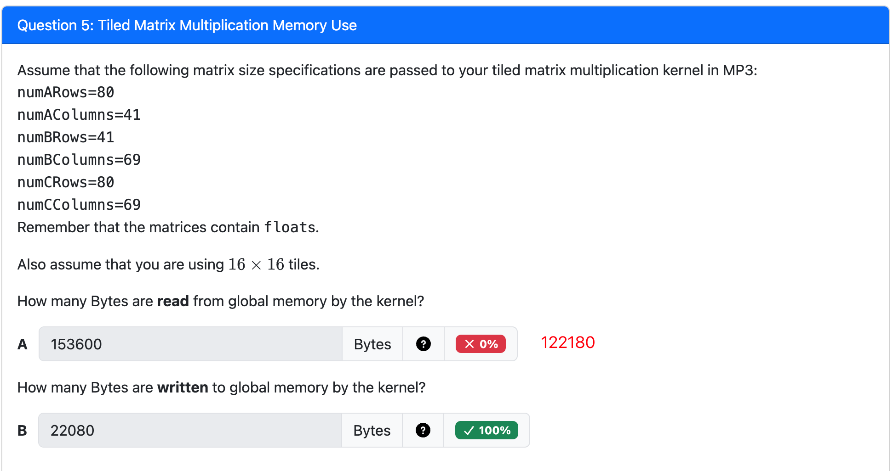

>   Standard way: in the tiled multiplication, the number of blocks that will read a given element `A[i][k]` is equal to the number of blocks in the x-direction of the grid (which is `ceil(numCColumns/tile_width)`) because for fixed row i, it is used in all columns j of C.
>
>   Similarly, an element `B[k][j]` is read by all blocks in the y-direction of the grid `ceil(numCRows/tile_height)`.
>
>   So:
>
>   -   Each element of A is read by (number of blocks in x-direction) = ceil(69/16)=5 times.
>   -   Each element of B is read by (number of blocks in y-direction) = ceil(80/16)=5 times.
>
>   Therefore:
>
>   Total elements read from A = (number of elements in A) * (number of blocks in x-dir) = (80*41) * 5 = 3280 * 5 = 16400.
>   Total elements read from B = (number of elements in B) * (number of blocks in y-dir) = (41*69) * 5 = 2829 * 5 = 14145.
>
>   So total elements read = 16400 + 14145 = 30545.
>   Then total bytes read = 30545 * 4 bytes = **122180** bytes.


>   If `MASK_WIDTH=3`, then you basically have 2 halo cells per block. In strategy 3, each of them are only read once. So basically it means that strategy 3 has the same number of global memory reads as strategy 1 and 2.
>
>   An increased number of global memory accesses is the primary reason why we don't want strategy 3 and want to reuse data. And now this downside is invalid for `MASK_WIDTH = 3`. 
>
>   Strategy 3 now enjoys 1G for each halo:
>
>   1.  Smaller shared memory & less number of threads per block => more blocks in an SM.
>   2.  No redundant read from shared memory (halo cells are directly read from global memory)
>
>   But Strategy 2 is 1G+1S for each halo

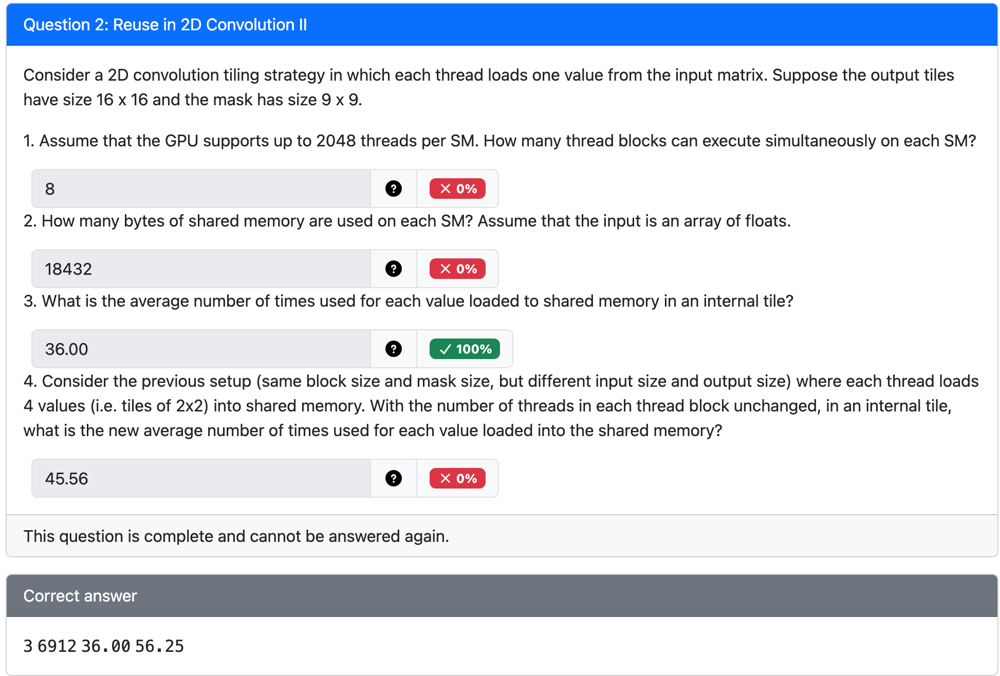

>   1.   Block width = 16+9-1=24, then 24^2 threads per block
>
>        2048/24^2=3.556 
>
>        **3** block/SM
>
>   2.   3 block/SM * 24^2 threads/block * 4 bytes/float = 6912
>
>        **6912** bytes
>
>   4.   Average uses per value (internal tile):
>         Total uses = outputs × mask_area = 16×16 × 9×9 = 256 × 81 = 20736.
>         Values loaded = 24×24 = 576.
>         Average = 20736 / 576 = **36.00** (4 significant figures).
>   5.   Now each thread loads 4 values (so loaded values per block = 576×4 = 2304).
>         With the same mask, choose the input tile such that loaded values = 2304 ⇒ input side = √2304 = 48.
>         Outputs = (input side − (mask−1))^2 = (48 − 8)^2 = 40×40 = 1600 outputs.
>         Total uses = 1600 × 81 = 129600. Average per loaded value = 129600 / 2304 = **56.25** (4 s.f.).

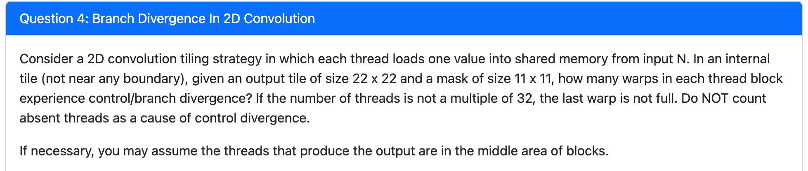

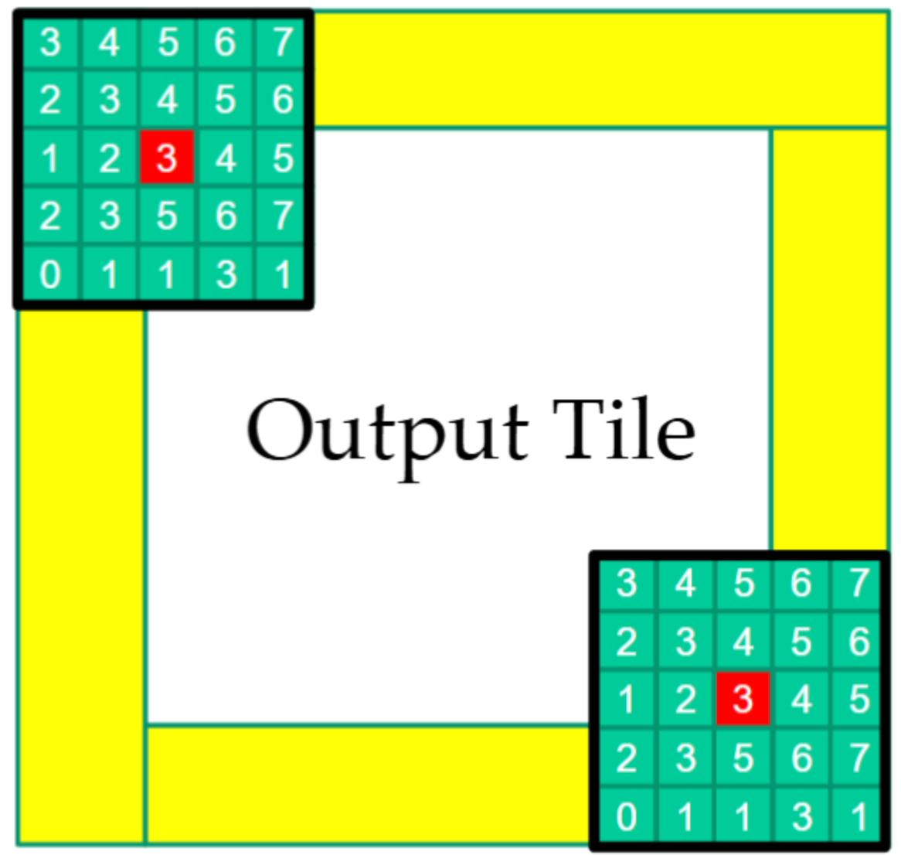

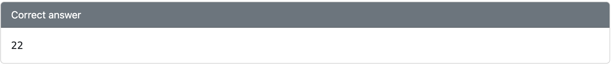

>   Strategy 2, no load control divergence but 22 in the calculation


## Midterm

### Cuda code for 2D convolution tiled matrix operation

A kernel computes `output = A * B + C` using a tiled approach with shared memory.

#### Host code

```c
#include <cuda_runtime.h>
#include <stdio.h>

// Tile width for shared memory implementation
#define TILE_WIDTH 32

// Forward declaration of a helper function to initialize matrices
void getData(float *A, float *B, float *C, int n);

// The provided host code starts here
#define n 128 // as an example
int main() {
    float *A, *B, *C, *output;
    A = (float *)malloc(n * n * sizeof(float));
    B = (float *)malloc(n * n * sizeof(float));
    C = (float *)malloc(n * n * sizeof(float));
    output = (float *)malloc(n * n * sizeof(float));
    getData(A, B, C, n); // this function fills in data for matrices A, B, and C

    // 1. Declare and allocate GPU memory
    float *d_A, *d_B, *d_C, *d_output;
    size_t matrix_size = n * n * sizeof(float);

    cudaMalloc((void **)&d_A, matrix_size);
    cudaMalloc((void **)&d_B, matrix_size);
    cudaMalloc((void **)&d_C, matrix_size);
    cudaMalloc((void **)&d_output, matrix_size);

    // 2. Copy input matrices from host to device
    cudaMemcpy(d_A, A, matrix_size, cudaMemcpyHostToDevice);
    cudaMemcpy(d_B, B, matrix_size, cudaMemcpyHostToDevice);
    cudaMemcpy(d_C, C, matrix_size, cudaMemcpyHostToDevice);

    // 3. Configure kernel launch parameters
    // Block dimensions are fixed as required
    dim3 dimBlock(32, 32, 1);

    // Grid dimensions are calculated to cover the entire output matrix with tiles
    int grid_dim = (n + TILE_WIDTH - 1) / TILE_WIDTH;
    dim3 dimGrid(grid_dim, grid_dim, 1);

    // 4. Launch the kernel on the device
    MAC<<<dimGrid, dimBlock>>>(d_A, d_B, d_C, d_output, n);

    // 5. Copy the result matrix from device back to host
    cudaMemcpy(output, d_output, matrix_size, cudaMemcpyDeviceToHost);

    // 6. Free all allocated memory
    cudaFree(d_A);
    cudaFree(d_B);
    cudaFree(d_C);
    cudaFree(d_output);

    free(A);
    free(B);
    free(C);
    free(output);

    return 0;
}

// Dummy implementation for getData to make the code runnable
void getData(float *A, float *B, float *C, int n) {
    for (int i = 0; i < n * n; ++i) {
        A[i] = 1.0f;
        B[i] = 2.0f;
        C[i] = 0.5f;
    }
}
```

#### Cuda kernel code

```c
#define TILE_WIDTH 32

__global__ void MAC(float *A, float *B, float *C, float *output, int n)
{
    // Shared memory to store tiles from A and B
    __shared__ float A_s[TILE_WIDTH][TILE_WIDTH];
    __shared__ float B_s[TILE_WIDTH][TILE_WIDTH];

    // Thread indices within the block (tx: 0-31, ty: 0-31)
    int tx = threadIdx.x;
    int ty = threadIdx.y;

    // Calculate the global row and column for the single output element this thread computes
    int row = blockIdx.y * TILE_WIDTH + ty;
    int col = blockIdx.x * TILE_WIDTH + tx;

    // Accumulator register for the single output element
    float acc = 0.0f;

    // Loop over all tiles needed to compute the dot product
    for (int i = 0; i < n; i += TILE_WIDTH) {
        // Load one element from global matrix A into shared memory A_s
        A_s[ty][tx] = (row < n && (i + tx) < n) ? A[row * n + i + tx] : 0.0f;

        // Load one element from global matrix B into shared memory B_s
        B_s[ty][tx] = ((i + ty) < n && col < n) ? B[(i + ty) * n + col] : 0.0f;

        // Synchronize to ensure all data is loaded into shared memory before proceeding
        __syncthreads();

        // Perform matrix multiplication for the current tiles from shared memory
        // Each thread calculates one partial dot product
        for (int j = 0; j < TILE_WIDTH; ++j) {
            acc += A_s[ty][j] * B_s[j][tx];
        }

        // Synchronize to ensure all calculations are done before loading the next tile
        __syncthreads();
    }

    // After the loops, add the element from C and write the final result
    // to the output matrix, guarded by a boundary check.
    if (row < n && col < n) {
        output[row * n + col] = acc + C[row * n + col];
    }
}
```

### 3D tiled matrix operation Convolution

```c
#define IN_TILE_DIM 32
#define OUT_TILE_DIM ((IN_TILE_DIM) - 2*(FILTER_RADIUS))

__constant__ float F_c[2*FILTER_RADIUS+1][2*FILTER_RADIUS+1][2*FILTER_RADIUS+1];

__global__ void convolution_tiled_3D_const_mem_kernel(
    const float *N, float *P,
    int width, int height, int depth)
{
    int x = blockIdx.x * OUT_TILE_DIM + threadIdx.x - FILTER_RADIUS;
    int y = blockIdx.y * OUT_TILE_DIM + threadIdx.y - FILTER_RADIUS;
    int z = blockIdx.z * OUT_TILE_DIM + threadIdx.z - FILTER_RADIUS;

    // Allocate 3D shared memory tile
    __shared__ float N_s[IN_TILE_DIM][IN_TILE_DIM][IN_TILE_DIM];

    // Load input tile (including halo)
    if (x >= 0 && x < width && y >= 0 && y < height && z >= 0 && z < depth)
        N_s[threadIdx.z][threadIdx.y][threadIdx.x] =
            N[z * width * height + y * width + x];
    else
        N_s[threadIdx.z][threadIdx.y][threadIdx.x] = 0.0f;

    __syncthreads();

    // Compute output tile indices
    int tileX = threadIdx.x - FILTER_RADIUS;
    int tileY = threadIdx.y - FILTER_RADIUS;
    int tileZ = threadIdx.z - FILTER_RADIUS;

    if (x >= 0 && x < width && y >= 0 && y < height && z >= 0 && z < depth) {
        if (tileX >= 0 && tileX < OUT_TILE_DIM &&
            tileY >= 0 && tileY < OUT_TILE_DIM &&
            tileZ >= 0 && tileZ < OUT_TILE_DIM) {

            float Pvalue = 0.0f;
            for (int fz = 0; fz < 2 * FILTER_RADIUS + 1; fz++) {
                for (int fy = 0; fy < 2 * FILTER_RADIUS + 1; fy++) {
                    for (int fx = 0; fx < 2 * FILTER_RADIUS + 1; fx++) {
                        Pvalue += F_c[fz][fy][fx] *
                                  N_s[tileZ + fz][tileY + fy][tileX + fx];
                    }
                }
            }
            P[z * width * height + y * width + x] = Pvalue;
        }
    }
}

```


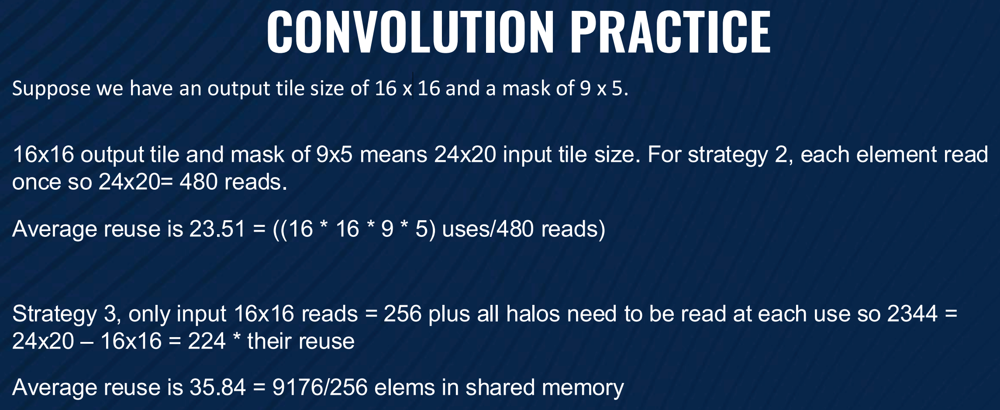

>   For Strategy 3
>
>   **Output Tile Size**: 16×16=256 pixels loaded into the shared memory tile
>
>   **Mask Size**: 9×5=45 elements
>
>   **Total Computational Reads**: 256×45=11,520
>
>   11,520(Total Reads)−9,176(Shared Reads)=2,344 halo loads.
>
>   **9176 / 256** represents the **average reuse of data within the shared memory tile**
>
>   **11520/2600** is the average reuse of **total computational reads to total global memory loads**.
>
>   ---------
>
>   How to get 9176:
>
>   1.   Height Dimension Calculation (Filter Height = 9)
>
>   We analyze how many times each of the **16** input rows in shared memory is accessed by the **9-element** tall filter. We can break the 16 rows into three regions.
>
>   -   **Top Edge (Rows 0-3):** These rows are too close to the edge to be used by the full height of the filter.
>       -   Row 0 is used **5** times.
>       -   Row 1 is used **6** times.
>       -   Row 2 is used **7** times.
>       -   Row 3 is used **8** times.
>       -   *Subtotal: 26*
>   -   **Middle (Rows 4-11):** These 8 rows are far from the edges, so each one is fully used by the filter **9** times.
>       -   8 rows×9 uses/row=72
>       -   *Subtotal: 72*
>   -   **Bottom Edge (Rows 12-15):** This is a mirror image of the top edge.
>       -   *Subtotal: 26*
>
>   The total number of vertical accesses is 26+72+26=124.
>
>   2.   Width Dimension Calculation (Filter Width = 5)
>
>   Next, we do the same for the width. We analyze how many times each of the **16** input columns in shared memory is accessed by the **5-element** wide filter.
>
>   -   **Left Edge (Columns 0-1):**
>       -   Column 0 is used **3** times.
>       -   Column 1 is used **4** times.
>       -   *Subtotal: 7*
>   -   **Middle (Columns 2-13):** These 12 columns are each fully used by the filter **5** times.
>       -   12 columns×5 uses/column=60
>       -   *Subtotal: 60*
>   -   **Right Edge (Columns 14-15):** This is a mirror image of the left edge.
>       -   *Subtotal: 7*
>
>   The total number of horizontal accesses is 7+60+7=74.
>
>   Combining the Dimensions: To get the total number of reads from the 2D shared memory tile, we multiply the totals from the height and width calculations.
>
>   Total Shared Reads=(Total Vertical Accesses)×(Total Horizontal Accesses)
>
>   Total Shared Reads=124×74=9,176


