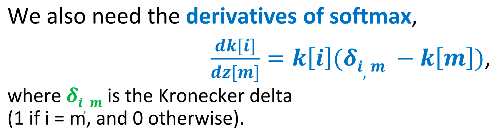

# ECE408/CS483 Applied Parallel Programming


> https://canvas.illinois.edu/courses/60979/assignments/syllabus 
>
> https://uiuc.chat/ECE408FA25/chat


## 1 Introduction

CPU(central processing unit)

GPU(graphical processing unit)

### Post-Dennard technology pivot – parallelism and heterogeneity

**The Moore’s Law** (Imperative) drove feature sizes down, doubling the number of transistors/unit area every 18-24 months

- Exponential increase in clock speed

**Dennard Scaling** (based on physics) drove clock speeds up

- ended around 2005-2006

**multicore**: execution speed of sequential programs

**many-thread**: execution throughput of parallel applications

### CPU vs GPU


|                             CPU                              |                            GPU                             |
| :----------------------------------------------------------: | :--------------------------------------------------------: |
|        A few powerful **ALUs**(Arithmetic Logic Unit)        |                      Many small ALUs                       |
|                  Reduced operation latency                   |             **Long latency, high throughput**              |
|                       Large **caches**                       |          Heavily pipelined for further throughput          |
| Convert long latency memory accesses to short latency cache accesses |                      Small **caches**                      |
|                  Sophisticated **control**                   |             More area dedicated to computation             |
|         Branch prediction to reduce control hazards          |                     Simple **control**                     |
|            Data forwarding to reduce data hazards            |             More area dedicated to computation             |
|         Modest multithreading to hide short latency          | A massive number of threads to hide the very high latency! |
|                   **High clock frequency**                   |                  Moderate clock frequency                  |

CPUs for **sequential parts** where latency hurts

- CPUs can be 10+X faster than GPUs for sequential code

GPUs for **parallel parts** where throughput wins

- GPUs can be 10+X faster than CPUs for parallel code

### Parallel Programming Frameworks

> [!NOTE]
>
> Why GPUs?
>
> Why repurpose a graphics processing architecture instead of designing a throughput-oriented architecture from scratch?
>
> - Chips are expensive to build and require a large volume of sales to amortize the cost
> - This makes the chip market very difficult to penetrate
> - When parallel computing became mainstream, GPUs already had (and still have) a large installed base from the gaming sector

#### Parallel Computing Challenges

Massive Parallelism demands Regularity -> Load Balance

Global Memory Bandwidth -> Ideal vs. Reality

Conflicting Data Accesses Cause Serialization and Delays 

- Massively parallel execution cannot afford serialization
- Contentions in accessing critical data causes serialization

#### Parallel Computing Pitfall（陷阱）

Consider an application where:

1. The sequential execution time is 100s
2. The fraction of execution that is parallelizable is 90%
3. The speedup achieved on the parallelizable part is 1000×

What is the overall speedup of the application?
$$
t_{parallel}=(1-0.9)\times 100s +\frac{0.9 \times 100s}{1000}=10.09s\\
speedup=\frac{t_{sequential}}{t_{parallel}}=\frac{100s}{10.09s}=9.91\times \text{（9.91为倍数）}
$$

#### Amdahl's Law

**阿姆达尔定律**：[处理器](https://zh.wikipedia.org/wiki/中央處理器)[并行运算](https://zh.wikipedia.org/wiki/並行運算)之后效率提升的能力


The maximum speedup of a parallel program is limited by the fraction of execution that is parallelizable, namely, $speedup<\frac{1}{1-p}$

## 2 Introduction to CUDA C and Data Parallel Programming

### Types of Parallelism

|                       Task Parallelism                       |                       Data Parallelism                       |
| :----------------------------------------------------------: | :----------------------------------------------------------: |
|   Different operations performed on same or different data   |         Same operations performed on different data          |
| Usually, a modest number of tasks unleashing a modest amount of parallelism | Potentially massive amounts of data unleashing massive amounts of parallelism(Most suitable for GPUs) |
|  |  |

### CUDA/OpenCL Execution Mode

**Integrated Host +Device Application(C Program)**

1. The execution starts with *host code* (CPU serial code).
2. When a kernel function is called, a large number of *threads* are launched on a device to execute the kernel. All the threads that are launched by a kernel call are collectively called a **grid**. 
3. These threads are the primary vehicle of parallel execution in a CUDA platform
4. When all threads of a grid have completed their execution, the grid terminates, and the execution continues on the host until another grid is launched

- **Host Code (C):**Handles serial or modestly parallel tasks
- **Device Kernel (C,SPMD Model):**Executes highly parallel sections of the program

### Threads

A CUDA **kernel** is executed as a grid(array) of threads

- All threads in the same grid run the **same kernel**
- Single Program Multiple Data (SPMD model)
- Each thread has a **unique index** that it uses to compute memory addresses and make control decisions

Thread as a basic unit of computing

- Threads within a block cooperate via **shared memory, atomic operations** and **barrier synchronization**.  块内的线程通过**共享内存、原子操作**和**屏障同步**进行协作。
- Threads in different blocks cooperate less.


- Thread block and thread organization simplify memory addressing when processing multidimensional data
- `i = blockIdx.x * blockDim.x + threadIdx.x; C[i] = A[i] + B[i];`

### Vector Addition

We use vector addition to demonstrate the CUDA C program structure.

A simple traditional vector addition C code example.

```c
// Compute vector sum C = A+B
void vecAdd(float* A, float* B, float* C, int n) {
    for (i = 0, i < n, i++) {
        C[i] = A[i] + B[i];
    }
}
int main() {
    // Memory allocation for A_h, B_h, and C_h
    // I/O to read A_h and B_h, N elements...
    vecAdd(A_h, B_h, C_h, N);
}

```

主机的变量名称后缀为`_h`，使用设备的变量名称后缀为`_d`

#### System Organization


The CPU and GPU have **separate memories** and **cannot access** each others' memories

- Need to **transfer** data between them（下图五步操作）


#### A vector addition kernel

Outline of a revised vecAdd function that moves the work to a device.

```c
#include <cuda.h>
void vecAdd(float* A, float* B, float* C, int n) {
int size = n* sizeof(float); 
float *A_d, *B_d, *C_d;
…
1. // Allocate device memory for A, B, and C
// copy A and B to device memory 
2. // Kernel launch code – to have the device
// to perform the actual vector addition
3. // copy C from the device memory
// Free device vectors
```

`vector A + B = vector C`

Device code can:

- R/W per-thread registers
- R/W per-grid global memory

Host code can transfer data to/from per grid global memory

### CUDA Device Memory Management API

#### API for managing device global memory

**Allocating memory**

```c
/*Allocating memory*/
cudaError_t cudaMalloc(void **devPtr, size_t size)
//devPtr: Pointer to pointer to allocated device memory
//size: Requested allocation size in byte
                             
/*VecAdd Host Code*/
//详见下面
```

**Deallocating memory**

```c
cudaError_t cudaFree(void *devPtr)
//devPtr: Pointer to device memory to free
```


- 指向设备全局内存中对象的指针变量后缀为`_d`
- `A_d`, `B_d` 和 `C_d` 中的地址指向设备全局内存 device global memory 中的位置。这些地址不应在主机代码中间接引用。它们应该在调用 API 函数和内核函数时使用。

**Copying memory**

```c
cudaError_t cudaMemcpy(void *dst, const void *src, size_t count, enum cudaMemcpyKind kind)
  
//Example
cudaMemcpy(A_d, A_h, size, cudaMemcpyHostToDevice);
cudaMemcpy(B_d, B_h, size, cudaMemcpyHostToDevice);
. . . 
cudaMemcpy(C_h, C_d, size, cudaMemcpyDeviceToHost);
```

- `dst`: Destination memory address
- `src`: Source memory address
- `count`: Size in bytes to copy
- `kind`: Type of transfer
    - `cudaMemcpyHostToHost`
    - `cudaMemcpyHostToDevice`
    - `cudaMemcpyDeviceToHost`
    - `cudaMemcpyDeviceToDevice`

**Return type**: `cudaError_t`

- Helps with error checking (discussed later)

**vecAdd Host Code**

完整版本

```c
void vecAdd(float* A, float* B, float* C, int n) {
    int size = n * sizeof(float); 
    float *A_d, *B_d, *C_d;
    // Transfer A and B to device memory (error-checking omitted)
    cudaMalloc((void **) &A_d, size);
    cudaMemcpy(A_d, A, size, cudaMemcpyHostToDevice);
    cudaMalloc((void **) &B_d, size);
    cudaMemcpy(B_d, B, size, cudaMemcpyHostToDevice);
    // Allocate device memory for
    cudaMalloc((void **) &C_d, size);
    // Kernel invocation code – to be shown later
        …
          
    // Transfer C from device to host
    cudaMemcpy(C, C_d, size, cudaMemcpyDeviceToHost);
    // Free device memory for A, B, C
    cudaFree(A_d); 
		cudaFree(B_d); 
  	cudaFree(C_d);
}
```

Simple strategy of **Parallel Vector Addition**: assign one GPU **thread** per vector element

#### Launching a Grid

Threads in the same grid execute the same function known as a **kernel**

A grid can be launched by calling a kernel and configuring it with appropriate grid and block sizes:

```c
const unsigned int numThreadsPerBlock = 512;
const unsigned int numBlocks = n/numThreadsPerBlock;
vecAddKernel <<< numBlocks, numThreadsPerBlock >>> (A_d, B_d, C_d, n);
```

If n is not a multiple of `numThreadsPerBlock`, fewer threads will be launched than desired

- Solution: use the ceiling to launch extra threads then omit the threads after the boundary:

```c
vecAddKernel <<< ceil(n/256.0), 256 >>> (A_d, B_d, C_d, n);
```

**More Ways to Compute Grid Dimensions**

```c
// Example #1
dim3 DimGrid(n/numThreadsPerBlock, 1, 1);
if (0 != (n % numThreadsPerBlock)) { DimGrid.x++; }
dim3 DimBlock(numThreadsPerBlock, 1, 1);
vecAddKernel<<<DimGrid, DimBlock>>>(A_d, B_d, C_d, n);
// Example #2
const unsigned int numBlocks;
numBlocks = (n + numThreadsPerBlock – 1)/numThreadsPerBlock;

vecAddKernel<<<numBlocks, numThreadsPerBlock>>>(A_d, B_d, C_d, n);
```

#### Vector Addition Kernel

```c
// Compute vector sum C = A+B
// Each thread performs one pair-wise addition
__global__
    void vecAddKernel(float* A_d, float* B_d, float* C_d, int n)
{
    int i = blockIdx.x * blockDim.x + threadIdx.x;
    if (i<n) C_d[i] = A_d[i] + B_d[i];
}
int vecAdd(float* A, float* B, float* C, int n)
{
    // A_d, B_d, C_d allocations and copies omitted 
    // Run ceil(n/256) blocks of 256 threads each
    dim3 DimGrid(ceil(n/256), 1, 1);
    dim3 DimBlock(256, 1, 1);
    vecAddKernel<<<DimGrid,DimBlock>>>(A_d, B_d, C_d, n);
}
```


### Compiling A CUDA Program


#### Function Declarations in CUDA


`__global__` defines a kernel function

`__device__` and `__host__` can be used together

#### More on Function Declarations

The keyword `__host__` is useful when needing to mark a function as executable on both the host and the device

```c
__host__ __device__ float f(float a, float b) {
    return a + b;
}
void vecadd(float* x, float* y, float* z, int N) {
    for(unsigned int i = 0; i < N; ++i) {
        z[i] = f(x[i], y[i]);
    }
}
__global__ void vecadd_kernel(float* x, float* y, float* z, int N) {
    int i = blockDim.x*blockIdx.x + threadIdx.x;
    if (i < N) {
        z[i] = f(x[i], y[i]);
    }
}
```

#### Asynchronous Kernel Calls

By default, kernel calls are **asynchronous** 异步

- Useful for overlapping GPU computations with CPU computations

Use the following API function to wait for the kernel to finish

```c
cudaError_t cudaDeviceSynchronize()
```

- Blocks until the device has completed all preceding requested tasks

#### Error Checking

All CUDA API calls return an error code `cudaError_t` that can be used to check if any errors occurred

```c
cudaError_t err = ...;
if (err != cudaSuccess) {
    printf("Error: %s\n"
           , cudaGetErrorString(err));
    exit(0);
}
```

For kernel calls, one can check the error returned by `cudaDeviceSynchronize()` or call the following API function:`cudaError_t cudaGetLastError()`

### Problems


## 3 CUDA Parallel Execution Model: Multidimensional Grids & Data

### CUDA Thread Grids are Multi-Dimensional

CUDA supports multidimensional grids (==up to 3D==)

Each CUDA kernel is executed by a grid,

- a 3D array of thread blocks, which are 3D arrays of threads.
- Each thread executes the same program on distinct data inputs, a **single-program, multiple-data (SPMD) model**

**大小关系：Grid - block - warp - thread**

- `gridDim` - `blockIdx` - `threadIdx`


-   Thread block and thread organization **simplifies memory addressing** when processing multidimensional data

#### One Dimensional Indexing

Defining a working set for a thread

- `i = blockIdx.x * blockDim.x + threadIdx.x;`
- 

#### Multidimensional Indexing

Defining a working set for a thread

- `row = blockIdx.y * blockDim.y + threadIdx.y;`
- `col = blockIdx.x * blockDim.x + threadIdx.x;`
- 

### Configuring Multidimensional Grids

#### Use built-in `dim3` type

```c
dim3 numThreadsPerBlock(32, 32); // 2D
dim3 numBlocks(
(width + numThreadsPerBlock.x - 1) / numThreadsPerBlock.x,
(height + numThreadsPerBlock.y - 1) / numThreadsPerBlock.y );

kernel <<< numBlocks, numThreadsPerBlock >>> (…kernel args…);
```

#### Layout of Multidimensional Data

- Convention is C is to store data in **row** major order
- Elements in the **same row** are **contiguous** in memory
- `index = row * width + col`

#### RGB to Gray-Scale Kernel Implementation

```c
__global__
  void rgb2gray_kernel(unsigned char* red, unsigned char* green, unsigned char* blue, unsigned char* gray, unsigned int width, unsigned int height) 
{
  unsigned int row = blockIdx.y*blockDim.y + threadIdx.y;
  unsigned int col = blockIdx.x*blockDim.x + threadIdx.x;
  
  // Convert the pixel
  if (row < height && col < width) {
    gray[row*width + col] = red[row*width + col]*3/10
      + green[row*width + col]*6/10 + blue[row*width + col]*1/10;}
}
```

#### Blur Kernel Implementation

Output pixel is the average of the corresponding input pixel and the pixels around it

**Parallelization approach**: assign one thread to each output pixel, and have it read multiple input pixels

- Given two N × N matrices, A and B, we can multiply A by B to compute a third N × N matrix, P: P = AB

```c
__global__ void blur_kernel(unsigned char* image, unsigned char* blurred, 
                            unsigned int width, unsigned int height) 
{
  int outRow = blockIdx.y*blockDim.y + threadIdx.y;
  int outCol = blockIdx.x*blockDim.x + threadIdx.x;
  if (outRow < height && outCol < width) 
  {
    unsigned int average = 0;
    for(int inRow = outRow - BLUR_SIZE; inRow < outRow + BLUR_SIZE + 1; ++inRow) {
      for(int inCol = outCol - BLUR_SIZE; inCol < outCol + BLUR_SIZE + 1; ++inCol) {
        if (inRow >= 0 && inRow < height && inCol >= 0 && inCol < width) { // add this to deal with boundary conditions
          
average += image[inRow*width + inCol];
				}
      }
    }
    blurred[outRow*width + outCol] =
      (unsigned char)(average/((2*BLUR_SIZE + 1)*(2*BLUR_SIZE + 1)));
  }
}
```

> [!NOTE]
>
> **Rule of thumb:** every memory access must have a corresponding guard that compares its indexes to the array dimensions

### Matrix-Matrix Multiplication

Given two N × N matrices, A and B, we can multiply A by B to compute a third N × N matrix, P: $P = AB$

- 矩阵相乘，一行✖️一列
- **Parallelization approach**: assign one thread to each element in the output matrix (C)

```c
__global__ void mm_kernel(float* A, float* B, float* C, unsigned int N) 
{
  unsigned int row = blockIdx.y*blockDim.y + threadIdx.y;
  unsigned int col = blockIdx.x*blockDim.x + threadIdx.x;
  float sum = 0.0f;
  for(unsigned int i = 0; i < N; ++i) {
    sum += A[row*N + i]*B[i*N + col];
  }
  C[row*N + col] = sum;
}
```


## 4 Compute Architecture and Scheduling

### Executing Thread Blocks

Threads are assigned to **Streaming Multiprocessors** in block granularity 块粒度的流多处理器

-   Up to **32** blocks to each SM
-   SMs can take up to **2048** threads

Threads run concurrently 并行

-   SM maintains thread/block id #s
-   SM manages/schedules thread execution

#### GPU Architecture

A GPU consists of multiple Streaming Multiprocessor (SMs), each consisting of multiple cores with *shared control and memory*


#### Assigning Blocks to SMs

Threads are assigned to SMs at block granularity

-   One/more thread to one SM
-   The remaining block wait for others to finish
-   **All threads in a block** are assigned to the **same** SM


-   **All threads in a block** are assigned to an SM **simultaneously** 同时分配
    -   A block cannot be assigned to an SM until it secures enough resources for all its threads to execute; 
    -   Otherwise, if some threads reach a barrier and others cannot execute, the system could deadlock


Threads in the **same block** can **collaborate** in ways that threads in different blocks cannot:

-   Lightweight barrier synchronization: `__syncthreads()`
    -   Wait for all threads in the block to reach the barrier before any thread can proceed

-   Shared memory (discussed later)
    -   Access a fast memory that only threads in the same block can access

-   Others (discussed later)

#### Synchronization across Thread Blocks

If threads in different blocks **do not synchronize** with each other

-   Blocks can execute in any order
-   Blocks can execute both in parallel with each other or sequentially with respect to each other
-   Enables **transparent scalability** 透明的可拓展性
    -   Same code can run on different devices with different amounts of hardware parallelism
    -   Execute blocks sequentially if device has few SMs
    -   Execute blocks in parallel if device has many SMs


If threads in different blocks to **synchronize** with each other

-   Deadlock may occur if the synchronizing blocks are not scheduled simultaneously
-   **Cooperative groups** 合作组 (covered later) allows *barrier synchronization* across clusters of thread blocks, or across the entire grid by limiting the number of blocks to guarantee that all blocks are executing simultaneously

-   Other techniques (covered later) allow **unidirectional synchronization** 间接同步 by ensuring that the producer block is scheduled before the consumer block

### SM Scheduling

Blocks assigned to an SM are further divided into **warps** which are *the unit of scheduling*

-   The SM cores are organized into **processing blocks** 处理快, with each processing block having its own warp 
    scheduler to execute multiple warps concurrently

#### Warps

The size of warps is device-specific, but has always been 32 threads to date

Threads in a warp are scheduled together on a processing block and executed following the **SIMD** model

-   <u>S</u>ingle <u>I</u>nstruction, <u>M</u>ultiple <u>D</u>ata
-   One instruction is fetched and executed by all the threads in the warp, each processing different  data

#### Thread Scheduling

Each block is executed as **32-thread warps**


SM 实现零开销 Warp 调度


**Why SIMD?**

>   **Advantage**
>
>   -   Share the same instruction fetch/dispatch unit across multiple execution units (cores)
>
>   **Disadvantage**
>
>   -   Different threads taking different execution paths result in **control divergence**
>       -   Warp does a pass over each unique execution path
>       -   In each pass, threads taking the path execute while others are disabled
>
>   -   The percentage of threads/cores enabled during SIMD execution is called the **SIMD efficiency**

#### Control Divergence

Control Divergence Example


>   [!NOTE]
>
>   **What is Control Divergence?**
>
>   On a GPU, a **warp** (a group of 32 threads) is a fundamental execution unit. All 32 threads in a warp execute the same instruction at the same time.
>
>   **Control divergence** occurs when threads within a single warp encounter a conditional statement (like an `if-else` block) and disagree on which path to take. If条件中有`threadIdx`相关变量就可能会产生控制发散
>
>   -   Some threads evaluate the condition to `true`.
>   -   Others evaluate it to `false`.
>
>   The hardware handles this by running both paths sequentially: first, the `true` path is executed by the corresponding threads while the others are idle, and then the `false` path is executed by its threads while the first group is idle. This serialization is a performance penalty. 🤷‍♀️

#### Avoiding Branch Divergence

Try to **make branch granularity a multiple of warp size** (remember, it *may not always be 32*!)

```c
if (threadIdx.x / WARP_SIZE > 2) {
// THEN path (lots of lines)
} else {
// ELSE path (lots of lines)
}
```

-   Still has two control paths
-   But all threads in any warp follow only one path

#### Lantency hiding

延迟隐藏

When a warp needs to wait for a high latency operation, another warp that is ready is selected and scheduled for execution


Many warps are needed so that there is sufficient work available to hide long latency operations, i.e., there is high chance of finding a warp that is ready

For this reason, *an SM typically supports many more threads than the number of cores* it has -- Max threads per SM is much higher than cores per SM

#### Occupancy

The **occupancy** 占用率 of an SM refers to the ratio of the warps or threads active on the SM to the maximum allowed

In general, maximizing occupancy is desirable because it improves latency hiding

-   Common case, but possible to have cases where lower occupancy is desirable

Occupancy Example


#### Block Granularity Considerations


### Problem solving


## 5 CUDA Memory Model

### The Von-Neumann Model

Processing Unit (PU)
• Performs all arithmetic and logical operations
• Includes the Register File, where data is temporarily stored for 
processing
• Memory
• Stores both program instructions and data
• Input/Output (I/O) Subsystem
• Handles communication between the computer and the external 
environment
• Control Unit (CU)
• Directs the execution of instructions by coordinating all components
• All operations are performed on data stored 
in registers within the Processing Unit. Before any 
calculation:
• Data must be fetched from Memory into registers, and
• Instructions must be loaded from Memory into 
the Instruction Register (IR)


Instruction processing breaks into steps:

Fetch | Decode | Execute | Memory

ADD instruction

LOAD instruction


### Registers vs Memory

Registers

Fast: 1 cycle; no memory access required

Few: hundreds for CPU, O(10k) for GPU SM

Memory

• Slow: hundreds of cycles

• Huge: GB or more


Matrix Multiplication

```c
// Matrix multiplication on the (CPU) host
void MatrixMul(float *M, float *N, float *P, int Width)
{ 
  for (int i = 0; i < Width; ++i)
    for (int j = 0; j < Width; ++j) 
    {
      float sum = 0;
      for (int k = 0; k < Width; ++k) 
      {
        float a = M[i * Width + k];
        float b = N[k * Width + j];
        sum += a * b;
      }
      P[i * Width + j] = sum;
    }
}
```

parallel 


### Kernel Invocation (Host-side Code)

```c
// TILE_WIDTH is a #define constant
dim3 dimGrid(ceil((1.0*Width)/TILE_WIDTH), 
ceil((1.0*Width)/TILE_WIDTH), 1);
dim3 dimBlock(TILE_WIDTH, TILE_WIDTH, 1);
// Launch the device computation threads!
MatrixMulKernel<<<dimGrid, dimBlock>>>(Md, Nd, Pd, Width);
```

### Kernel Function

```c
// Matrix multiplication kernel – per thread code
__global__ 
  void MatrixMulKernel(float* d_M, float* d_N, float* d_P, int Width)
{
  // Calculate the row index of the d_P element and d_M
  int Row = blockIdx.y * blockDim.y + threadIdx.y;
  // Calculate the column idenx of d_P and d_N
  int Col = blockIdx.x * blockDim.x + threadIdx.x;
  // Pvalue is used to store the element of the matrix
  // that is computed by the thread
  float Pvalue = 0;
		...
    ...
    d_P[ ] = Pvalue;
}
```

Matrix Multiplication Kernel

```c

```


Reuse Memory Accesses


----------


>   The answer is **Either 0 or 1** because of a **race condition**. 🏁
>
>   A race condition occurs when multiple threads try to access and modify the same memory location at the same time, and the final result depends on the unpredictable order in which they execute.
>
>   1.  **Kernel Launch:** The line `kernel<<<2,1>>>(dst);` launches the kernel with a grid of **2 blocks**, and each block contains **1 thread**.
>
>       -   This creates two blocks in total: Block 0 and Block 1.
>       -   For Block 0, the built-in variable `blockIdx.x` is **0**.
>       -   For Block 1, the built-in variable `blockIdx.x` is **1**.
>
>   2.  Conflicting Writes:
>
>       Both threads execute the same instruction, dst[0] = blockIdx.x;, but with different values for blockIdx.x:
>
>       -   The thread from Block 0 executes `dst[0] = 0;`.
>       -   The thread from Block 1 executes `dst[0] = 1;`.
>
>   3.  Unpredictable Order:
>
>       The CUDA programming model does not guarantee the execution order of different blocks. The GPU's scheduler might run Block 0 first, then Block 1, or vice-versa.
>
>       -   **Scenario 1:** Block 1's write is the last one to complete. The initial value at `dst[0]` is overwritten by `0` (from Block 0), and then finally overwritten by **`1`**.
>       -   **Scenario 2:** Block 0's write is the last one to complete. The initial value is overwritten by `1` (from Block 1), and then finally overwritten by **`0`**.
>
>   Since there's no way to know which block will "win" the race to write to `dst[0]` last, the final value stored in that location after the kernel finishes could be either 0 or 1.

## 6 Data Locality and Tiled Matrix Multiply

### Performance Metrics

**FLOPS Rate**: floating point operations per second

-   How much computation a processor’s cores can do per unit time

**Memory Bandwidth**: bytes per second

-   How much data the memory can supply to the cores per unit time


-   FLOPs rate(GLOPS/s)
-   Memory bandwidth(GB/s)

#### Performance Bound and the Roofline Model

A kernel can be:

-   **Compute-bound**: performance limited by the FLOPS rate
    -   The processor’s cores are fully utilized (always have work to do)
-   **Memory-bound**: performance limited by the memory bandwidth
    -   The processor’s cores are frequently idle because memory cannot supply data fast enough

The **roofline model** helps visualize a kernel’s performance bound based on the ratio of operations it 
performs and bytes it accesses from memory


-   先受内存限制后受CPU限制
-   **OP/B ratio**: allows us to determine if a kernel is memory-bound or compute-bound on a specific hardware 根据比例判断类型 
-   *OP/B = operations / data*

Knowing the kernel’s bound allows us to determine the best possible performance 
achievable by the kernel (sometimes called **speed of light**)

#### Example


### A Common Programming Strategy

Global memory is implemented with DRAM – slow

Sometimes, we are lucky:

-   The thread finds the data in the L1 cache because it was recently loaded by another thread

Sometimes, we are not lucky:

-   The data gets evicted from the L1 cache before another thread tries to load it

To avoid a Global Memory bottleneck, **==tile the input data==** to take advantage of Shared Memory 将输入数据平铺以利用共享内存：

-   **Partition data into subsets** (*tiles*) that fit into the (smaller but faster) shared memory
-   **Handle each data subset with one thread block** by:
    -   Loading the subset from global memory to shared memory, *using multiple threads to exploit memory-level parallelism* 利用内存级并行性
    -   Performing the computation on the subset from shared memory, each thread can efficiently access 
        any data element
    -   Copying results from shared memory to global memory
-   Tiles are also called blocks in the literature


#### Tiled Multiply

平铺策略：Break up the execution of the kernel into phases so that the data accesses in each phase are focused on one tile of 
A and B


For each tile:

-   Phase 1: Load tiles of A & B into share memory

    -   Each thread loads one A element and one B element in basic tiling code

    -   ```c
        A[Row][1*TILE_WIDTH+tx]
        B[1*TILE_WIDTH+ty][Col]
          
        A[Row][q*TILE_WIDTH+tx]
        A[Row*Width + q*TILE_WIDTH + tx]
          
        B[q*TILE_WIDTH+ty][Col]
        B[(q*TILE_WIDTH+ty) * Width + Col]
        
        //A and B are dynamically allocated and can only use 1D indexing
        ```
        
        

-   Phase 2: Calculate partial dot product for tile of C

    -   ```c
        //To perform the kth step of the product within the tile
        subTileA[ty][k];
        subTileB[k][tx];
        ```

        


#### Tiled Matrix-Matrix Multiplication

```c
// declare arrays in shared memory
__shared__ float A_s[TILE_DIM][TILE_DIM];
__shared__ float B_s[TILE_DIM][TILE_DIM];
unsigned int row = blockIdx.y*blockDim.y + threadIdx.y;
unsigned int col = blockIdx.x*blockDim.x + threadIdx.x;
float sum = 0.0f;
for (unsigned int tile = 0; tile < N/TILE_DIM; ++tile) {
  // Load tile to shared memory
  A_s[threadIdx.y][threadIdx.x] = A[row*N + tile*TILE_DIM + threadIdx.x];
  B_s[threadIdx.y][threadIdx.x] = B[(tile*TILE_DIM + threadIdx.y)*N + col];
  // Compute with tile
  for (unsigned int i = 0; i < TILE_DIM; ++i) {
    sum += A_s[threadIdx.y][i]*B_s[i][threadIdx.x];
  }
}
C[row*N + col] = sum;
```

code inside the tunnel

>   [!IMPORTANT]
>
>   We need to **synchronize**! 同步

#### Bulk Synchronous Steps Based on Barriers

**Bulk synchronous execution**: threads execute roughly in unison

1. Do some work
2. Wait for others to catch up
3. Repeat

Much easier programming model

-   Threads only parallel within a section
-   Debug lots of little programs
-   Instead of one large one

Dominates high-performance applications

How does it work?

-   Use a **barrier** to wait for the thread to 'catch up.'

A barrier is a synchronization point:

-   each thread *calls a function* to enter the barrier;
-   threads *block* (sleep) in barrier function until all threads have called;
-   *After the last thread* calls the function, all threads *continue* past the barrier.


**API function**: `__syncthreads()`

All threads **in the same block** must reach the `__syncthreads()` before any can move on

-   To ensure that all elements of a tile are loaded
-   To ensure that certain computation on elements is complete

```c
// declare arrays in shared memory
__shared__ float A_s[TILE_DIM][TILE_DIM];
__shared__ float B_s[TILE_DIM][TILE_DIM];
unsigned int row = blockIdx.y*blockDim.y + threadIdx.y;
unsigned int col = blockIdx.x*blockDim.x + threadIdx.x;
float sum = 0.0f;
for (unsigned int tile = 0; tile < N/TILE_DIM; ++tile) {
  // Load tile to shared memory
  A_s[threadIdx.y][threadIdx.x] = A[row*N + tile*TILE_DIM + threadIdx.x];
  B_s[threadIdx.y][threadIdx.x] = B[(tile*TILE_DIM + threadIdx.y)*N + col];
  
  __syncthreads(); // Threads wait for each other to finish loading before computing
  
  // Compute with tile
  for (unsigned int i = 0; i < TILE_DIM; ++i) {
    sum += A_s[threadIdx.y][i]*B_s[i][threadIdx.x];
  }
  __syncthreads(); // Threads wait for each other to finish loading before computing
}
C[row*N + col] = sum;
```

#### Boundary Conditions

Different Matrix Dimensions

-   Solution: Write 0 for Missing Elements
    -   Is the target within input matrix?
        -   If yes, proceed to load. Otherwise, just write 0 to the shared memory
    -   Benefit
        -   No specialization during tile use!
        -   Multiplying by 0 guarantees that unwanted terms do not contribute to the inner product.


**Modifying the Tile Count**

```c
for (unsigned int tile = 0; tile < N/TILE_DIM; ++tile) {

//The bound for m implicitly assumes that Width is a multiple of TILE_WIDTH. We need to round up.
for (unsigned int tile = 0; tile < (N - 1)/TILE_DIM + 1; ++tile) {
```

-   For non-multiples 非整数倍 of `TILE_DIM`:
    -   quotient is unchanged;
    -   add one to round up
-   For multiples 整数倍 of `TILE_DIM`:
    -   quotient is now one smaller, but we add 1.

**Modifying the Tile Loading Code**

```c
// We had: Load tile to shared memory
A_s[threadIdx.y][threadIdx.x] = A[row*N + tile*TILE_DIM + threadIdx.x];
B_s[threadIdx.y][threadIdx.x] = B[(tile*TILE_DIM + threadIdx.y)*N + col];

//Note: the tests for A and B tiles are NOT the same.

if (row < N && tile*TILE_DIM+threadIdx.x < N) {
  // as before
  A_s[threadIdx.y][threadIdx.x] = A[row*N + tile*TILE_DIM + threadIdx.x];
} else {
  A_s[threadIdx.y][threadIdx.x] = 0;
}
if (tile*TILE_DIM+threadIdx.y < N && col < N ) {
  B_s[threadIdx.y][threadIdx.x] = B[(tile*TILE_DIM + threadIdx.y)*N + col];
} else {
  B_s[threadIdx.y][threadIdx.x] = 0;
}
```

**Modifying the Tile Use Code**

```c
// We had: Compute with tile
for (unsigned int i = 0; i < TILE_DIM; ++i) {
  sum += A_s[threadIdx.y][i] * B_s[i][threadIdx.x];
}

//Note: no changes are needed, but we might save a little energy (fewer floating-point ops)?
if (row < N && col < N) {
  // as before
  for (unsigned int i = 0; i < TILE_DIM; ++i) {
    sum += A_s[threadIdx.y][i] * B_s[i][threadIdx.x];
  }
}
```

**Modifying the Write to C**

```c
// We had:
C[row*N + col] = sum;

//We must test for threads outside of C:
if (row < N && col < N) {
  // as before
  C[row*N + col] = sum;
}
```

>   [!IMPORTANT]
>
>   For each thread, conditions are different for 
>
>   -   Loading A element
>   -   Loading B element
>   -   Calculation/storing output elements
>
>   Branch divergence 
>
>   -   affects only blocks on boundaries, and should be small for large matrices

### Bottleneck


-   系统已经从**内存受限**转变为**计算受限**


-   Memory per Block = 两个矩阵 16^2个线程 4个字节
-   Max Blocks (Memory) =  (Total SM Shared Memory) / (Memory per Block) = 64 kB / 2 kB = 32 blocks
-   Max Blocks (Threads) = (Max Threads on SM) / (Threads per Block) = 2048 / 256 = 8 blocks
-   Pending loads = maximum number of active blocks ✖️the number of loads per block


#### Memory and Occupancy

Register usage per thread, and shared memory usage per thread block constrain occupancy

#### Dynamic Shared Memory

动态分配共享内存

Declaration: `extern __shared__ A_s[];`

Configuration: `kernel <<< numBlocks, numThreadsPerBlock, smemPerBlock >>> (...)`

### Tiling on CPU

Tiling also works for CPU

-   No scratchpad memory, but relies on caches 无需暂存器，但依赖缓存
-   Cache is sufficiently reliable because there are fewer threads running on the core and the cache is larger 缓存足够可靠，因为核心上运行的线程较少，而且缓存较大

```c
for (unsigned int rowTile = 0; rowTile < N/TILE_DIM; ++rowTile) {
  for (unsigned int colTile = 0; colTile < N/TILE_DIM; ++colTile) {
    for (unsigned int iTile = 0; iTile < N/TILE_DIM; ++iTile) {
      for (unsigned int row = rowTile*TILE_DIM; row < (rowTile + 1)*TILE_DIM; ++row) {
        for (unsigned int col = colTile*TILE_DIM; col < (colTile + 1)*TILE_DIM; ++col) {
          float sum = 0.0f;
          for (unsigned int i = iTile*TILE_DIM; i < (iTile + 1)*TILE_DIM; ++i) {
            sum += A[row*N + i]*B[i*N + col];
          }
          if (iTile == 0) C[row*N + col] = sum;
          else C[row*N + col] += sum;
        }
      }
    }
  }
```


## 7 DRAM Bandwidth and other Performance Considerations

>   [!NOTE]
>
>   Performance optimizations covered so far
>   • Tuning resource usage to maximize occupancy to hide latency in 
>   cores
>   • Threads per block, shared memory per block, registers per thread
>   • Reducing control divergence to increase SIMD efficiency
>   • Shared memory and register tiling to reduce memory traffic
>
>   More optimizations to be covered today
>   • Memory coalescing
>   • Maximizing occupancy (again) to hide memory latency
>   • Thread coarsening
>   • Loop unrolling
>   • Double-buffering

###  DRAM

DRAM is Slow But Dense

-   Capacitance…
    • tiny for the BIT, but
    • huge for the 
    BIT LINE
    • Use an amplifier for higher speed!
    • Still slow…
    • But only need 
    1 transistor per bit

A DRAM bank consists of a 2D array of DRAM cells activated one row at a time, and read at the column

-   SELECT lines connect to about 1,000 bit lines
-   Core DRAM array has about O(1M) bits
-   Use more address bits to choose bit line(s)


### Memory Coalescing 内存合并

When threads in the same warp access **consecutive memory locations** in the **same burst**, the accesses can be combined and served by one burst

-   One DRAM transaction is needed
-   Known as memory coalescing
-   If threads in the same warp access locations not in the same burst, accesses cannot be combined

Multiple transactions are needed

-   Takes longer to service data to the warp
-   Sometimes called memory divergence


#### Matrix-matrix multiplication

```c
int row = blockDim.y*blockIdx.y + threadIdx.y;
int col = blockDim.x*blockIdx.x + threadIdx.x;
// Note: a warp contains 
consecutive threads in 
the x dimension 
followed by the y 
dimension
For (unsigned int k = 0; k < N; ++k) {
  sum += M[row*N + k] * N[k*N + col];
}
```

Accesses to M and N are coalesced 合并

-   e.g., threads 0 to 31 access element 0 of M on the first iteration, resulting in one memory transaction to service warp 0
-   e.g., threads 0 to 31 access elements 0 to 31 of N on the first iteration, resulting in one memory transaction to service warp 0


### Fine-Grain Thread Granularity


### Thread Coarsening 粗化

**Thread coarsening** is an optimization were a thread is assigned multiple units of parallelizable work

```c
unsigned int i = blockIdx.x*blockDim.x + threadIdx.x;
foo(i);

// => Thread coarsening

unsigned int iStart = 4*(blockIdx.x*blockDim.x + threadIdx.x);
for(unsigned int = 0; c < 4; ++c) {
  unsigned int i = iStart + c;
  foo(i);
}
```

**Advantages**

-   Reduces the overhead incurred for parallelization
-   Could be redundant memory accesses
-   Could be redundant computations
-   Could be synchronization overhead or control divergence
-   We will see many examples throughout the course

**Disadvantages**

-   More resources(variables allocation memory) per thread which may affect occupancy
-   Underutilizes resources if coarsening factor is too high
-   Need to retune coarsening factor for each device

### Loop Unrolling

Loop unrolling transforms a loop by replicating the body of the loop by some factor and reducing the number of loop iterations by the same factor

-   Loop unrolling reduces stalls in two ways:
    -   Fewer loop iterations implies fewer branches
    -   Branches have long-latency in the absence of branch prediction
-   Exposes more independent instructions for instruction scheduling

Instruction Scheduling


#### Double Buffering

Double buffering eliminates false dependences by using a different memory buffer for writing data than the memory buffer containing the data being read


| Category                    | Optimization                             | Benefit to Compute Cores                                     | Benefit to Memory                                            | Strategies                                                   |
| --------------------------- | ---------------------------------------- | ------------------------------------------------------------ | ------------------------------------------------------------ | ------------------------------------------------------------ |
| **Compute utilization**     | Occupancy tuning                         | More work to hide pipeline latency                           | More parallel memory accesses to hide DRAM latency           | Tune the usage of SM resources such as threads per block, shared memory per block, and registers per thread |
| **Compute utilization**     | Loop unrolling                           | Fewer branch instructions and more independent instruction sequences with fewer stalls | May enable promoting local arrays to registers to reduce global memory traffic | Performed automatically by the compiler<br><br>Use loops with constant bounds where possible to facilitate the compiler's job |
| **Compute utilization**     | Reducing control divergence              | High SIMD efficiency (fewer idle cores during SIMD execution) | -                                                            | Rearrange the assignment of threads to work and/or data      |
| **Memory utilization**      | Using coalescable global memory accesses | Fewer pipeline stalls waiting for global memory accesses     | Less global memory traffic and better utilization of bursts/cache-lines | Rearranging the layout of the data<br>Rearranging the mapping of threads to data |
| **Memory utilization**      | Shared memory tiling                     | Fewer pipeline stalls waiting for global memory accesses     | Less global memory traffic                                   | Transfer data between global memory and shared memory in a coalescable manner and perform irregular accesses in shared memory (e.g., corner turning)<br>Place data that is reused within a block in shared memory so that it is transferred between global memory and the SM only once |
| **Memory utilization**      | Register tiling                          | Fewer pipeline stalls waiting for shared memory accesses     | Less shared memory traffic                                   | Place data that is reused within a warp or thread in registers so that it is transferred between shared memory and registers only once |
| **Synchronization latency** | Privatization                            | Fewer pipeline stalls waiting for atomic updates             | Less contention and serialization of atomic updates          | Apply partial updates to a private copy of the data then update the public copy when done |
| **Synchronization latency** | Warp-level primitives                    | Reduce block-wide barrier synchronizations                   | Less shared memory traffic                                   | Perform operations requiring barrier synchronization at the warp-level, then consolidate warp-level results at the block-level |
| **Synchronization latency** | Double buffering                         | Eliminates barriers that enforce false dependencies          | -                                                            | Eliminate false (write-after-read) dependencies by using different buffers for the writes and the preceding reads |

## 8 Convolution Concept; Constant Cache

### Convolution Applications

**Convolution compuation**: An array operation where each output data element is a weighted sum of a collection of neighboring input elements

The weights used in the weighted sum calculation are defined by an input mask array, commonly referred to as the *convolution kernel(convolution filter, or convolution masks)*.

#### 1D kernel convolution


Boundary Handling

-   This kernel forces all elements outside the valid range to **0**


```c
__global__ void 
convolution_1D_basic_kernel(float *N, float *M, float *P, int Mask_Width, int Width)
{
  int i = blockIdx.x*blockDim.x + threadIdx.x;
  float Pvalue = 0;
  int N_start_point = i - (Mask_Width/2);
  for (int j = 0; j < Mask_Width; j++) {
    if (((N_start_point + j) >= 0) && ((N_start_point + j) < Width)) {
      Pvalue += N[N_start_point + j] * M[j];
    }
  }
  P[i] = Pvalue;
}
```

#### 2D Convolution


-   Boundry conditions also affect the efficiency of tiling

```c
__global__ void convolution_2D_basic_kernel(float *N，float *F，float *P,
	int r, int width,int height)
{
  int outCol=blockIdx.x*blockDim.x+ threadIdx.x;
  int outRow=blockIdx.y*blockDim.y +threadIdx.y;
  float Pvalue=0.0f;
	for(int fRow=0:fRow<2*r+1;fRow++){
    for (int fCol=0;fCol<2*r+1;fCol++){
      inRow =outRow+fRow;
      inCol=outCol-r+fCol;
      if(inRow>=0&& inRow<height && inCol >=0 && inCol < width){
        Pvalue += F[fRow][fCol]*N[inRow*width + inCol];
      }
    }
  }
	P[outRow][outCol]=Pvalue;
}
```


What does this kernel accomplish?


-   Elements of M are called **mask** (kernel, filter) **coefficients**(weights)
-   Calculation of all output P elements needs M
-   M is not changed during grid execution 
-   Bonus - M elements are accessed in the same order when calculating all P elements
-   M is a good candidate for **Constant Memory**

### Programmer View of CUDA Memories


### Memory Hierarchies

>   **Review**: If we had to go to global memory to access data all the time, the execution speed of GPUs would be limited by the global memory bandwidth
>
>   -   We saw the use of shared memory in tiled matrix multiplication to reduce this limitation
>   -   Another important solution: Caches

### Cache

Recall: **memory bursts** 

-   contain around **1024 bits** (**128B**) fromconsecutive (linear) addresses
-   Let’s call a single burst a **line**

A **cache** is **an 'array' of cache lines**

-   A cache line can usually hold data from several consecutive memory addresses
-   When data is requested from the global memory, an entire cache line that includes the data being accessed is loaded into the cache, in an attempt to reduce global memory requests
-   The data in the cache is a **“copy” of the original data in global memory**
-   Additional hardware is used to remember the addresses of the data in the cache line

>   [!NOTE]
>
>   **Memory read** *produces* **a line**, **cache** *stores* **a copy of the line**, and **tag** *records* **the line’s memory address**

#### Caches and Locality

**Spatial locality 空间局部性**: when the data elements stored in consecutive memory locations are accessed consecutively

**Temporal locality 时间局部性**: when the same data element is accessed multiple times in a short period of time

-   Both spatial locality and temporal locality improve the performance of caches

An executing program loads and stores data from memory.

Consider **a sequence of addresses** accessed.

-   **Sequence** usually **shows** both types of **locality**:
    -   **spatial**: accessing **X implies** accessing **X+1** (and X+2, and so forth) **soon**
    -   *temporal**: accessing X** implies accessing **X again soon**
-   Caches improve performance for both types.

#### Caches Can’t Hold Everything

Caches are smaller than memory.

-   When the cache is full, it must make room for a new line, usually by **discarding the least recently used line**.

#### Shared Memory vs. Cache

Shared memory in CUDA is another type of temporary storage used to relieve main memory contention

-   In terms of distance from the SMs, shared memory is similar to L1 cache 
-   Unlike cache, shared memory doesn't necessarily hold a copy of data that is also in main memory 
-   Shared memory requires **explicit data transfer** instructions into locations in the shared memory, whereas cache doesn’t. 共享内存需要声明变量`__shared__`并显示地将全局内存变量的值复制到共享内存变量中；使用缓存时，程序会自动保存最近使用的变量并记住它们原始全局内存地址

Caches vs. shared memory

• Both on *chip*, with similar performance (As of Volta generation, both using the same physical resources, 

allocated dynamically!)

**Difference**

-   **Programmer controls shared memory** contents (called a scratchpad)
-   **Microarchitecture** automatically **determines the contents of the cache**. (**static RAM**, not DRAM)

#### Constant cache in GPUs

**Modification to cached data** needs to be (eventually) **reflected back** to the original data in global memory

-   Requires logic to track the modified status, etc.

**Constant cache** is a special cache for constant data that will **not be modified** during kernel execution by a grid

-   Data declared in the constant memory is not modified during kernel execution.
-   Constant cache can be accessed with higher throughput than L1 cache for some common patterns
-   L1 cache may write back, constant doesn't need to support writes

**To support writes** (modification of lines), **changes** must be **copied back to memory**, and cache must **track** modification **status.**

-   **L1 cache** in GPU (for global memory accesses) **supports writes**.
-   **Cache for constant** / texture **memory**

Special case: **lines are read-only**

-   Enables higher-throughput access than L1 for common GPU kernel access patterns

------

GPU L2/L1 Caches


-   L1 的延迟和带宽速度都接近处理器的速度；L2 缓存更大，访问时间需要十几个时钟周期，通常在多个处理器核心之间共享
-   Global memory variables and constant memory variables are all in DRAM

#### Using Constant Memory

Declare constant memory array as global variable outside the CUDA kernel and any host function

-   `__constant__ float filter_c[FILTER_DIM];`

Must initialize constant memory from the host, and cannot modify it during execution

-   `cudaMemcpyToSymbol(filter_c, filter, FILTER_DIM * sizeof(float), offset = 0, kind = cudaMemcpyHostToDevice);`

General use: `cudaMemcpyToSymbol(dest, src, size)`

-   dest 指向常亮内存中目标位置的指针，src指向主机内存源数据，size要复制的字节数量

Can only allocate up to 64KB; Otherwise, input is also constant, but it is too large to put in constant memory

```c
/*Host Example*/
// MASK_WIDTH is the size of the mask
// global variable, outside any kernel/function
__constant__ float Mc[MASK_WIDTH];
// Initialize Mask
float Mask[MASK_WIDTH];
  for(unsigned int i = 0; i < MASK_WIDTH; i++) {
    Mask[i] = (rand() / (float)RAND_MAX);
    if(rand() % 2) Mask[i] = - Mask[i];
  }
cudaMemcpyToSymbol(Mc, Mask, MASK_WIDTH*sizeof(float));
ConvolutionKernel<<<dimGrid, dimBlock>>>(Nd, Pd, MASK_WIDTH, WIDTH);
```

We are **memory-limited** 内存受限

-   For the 1D case, every output element requires `2*MASK_WIDTH` loads (of M and N each) and `2*MASK_WIDTH` floating-point operations. 
-   For the 2D case, every output element requires `2*MASK_WIDTH^2` loads and `2*MASK_WIDTH^2` floating-point operations.

### Tiled convolution with halo cells

#### Tiled 1D Convolution Basic Idea


**Reuse data read from global memory(use shared memory)**


**What About the Halos? Do we also copy halos into shared memory?**


**Approach 1**: Can Access Halo from Global Memory

-   threads **read halo values** directly **from global memory**
-   Advantage: optimize reuse of shared memory(halo reuse is smaller).
-   Disadvantages:
    -   **Branch divergence**! (shared vs. global reads) 分支分歧
    -   Halo **too narrow to fill** a memory **burst**

**Approach 2**: Can Load Halo to Shared Memory

-   **load halos to shared memory**
-   Advantages: 
    -   Coalesce global memory accesses 合并全局内存访问
    -   **No branch divergence** during computation
-   Disadvantages:
    -   Some threads must do >1 load, so some branch divergence in reading data.
    -   Slightly more shared memory is needed.

#### Three Tiling Strategies

##### Strategy 1

Variable Meanings for a Block


1.   Loading the Left Halo

     ```c
     int radius = Mask_Width / 2;
     int halo_index_left = (blockIdx.x - 1) * blockDim.x + threadIdx.x;
     if (threadIdx.x >= (blockDim.x - radius)) {
       N_ds[threadIdx.x - (blockDim.x - radius)] =
         (halo_index_left < 0) ? 0 : N[halo_index_left];
     }
     ```

2.   Loading the Right Halo

     ```c
     int index = blockIdx.x * blockDim.x + threadIdx.x;
     if ((blockIdx.x * blockDim.x + threadIdx.x) < Width) 
       N_ds[radius + threadIdx.x] = N[index];
     else
       N_ds[radius + threadIdx.x] = 0.0f;
     ```

3.   Loading the Internal Elements

     ```c
     int halo_index_right = (blockIdx.x + 1)*blockDim.x + threadIdx.x;
     if (threadIdx.x < radius) {
       N_ds[radius + blockDim.x + threadIdx.x] =
         (halo_index_right >= Width) ? 0 : N[halo_index_right];
     }
     ```

Put it together

```c
// Load left halo 
// Load internal elements
// Load right halo 
// Compute and store results
__syncthreads();
float Pvalue = 0;
for(int j = 0; j < Mask_Width; j++) {
  Pvalue += N_ds[threadIdx.x + j] * Mc[j];
}
P[i] = Pvalue;
```

-----

**Alternative Implementation of Strategy 1**


```c
//STEP1
int start = i – radius;
if (0 <= start && Width > start) { // all threads
  N_ds[threadIdx.x] = N[start];
} else {
  N_ds[threadIdx.x] = 0.0f;
}

//STEP2
if (MASK_WIDTH – 1 > threadIdx.x) { // some threads
  start += TILE_SIZE;
  if (Width > start) {
    N_ds[threadIdx.x + TILE_SIZE] = N[start];
  } else {
    N_ds[threadIdx.x + TILE_SIZE] = 0.0f;
  }
}
```

##### Strategy 2


>   See in [next chapter](# Strategy 2: Parallelize Loading of a Tile)

##### Strategy 3


```c
// Loading data
int i = blockIdx.x * blockDim.x + threadIdx.x;
__shared__ float N_ds[TILE_WIDTH];
N_ds[threadIdx.x] = N[i]; // boundary checking is missing here
__syncthreads();

//Computing
int radius = Mask_Width / 2;
int This_tile_start_point = blockIdx.x * blockDim.x;
int Next_tile_start_point = (blockIdx.x + 1) * blockDim.x;
int N_start_point = i - radius;
float Pvalue = 0;
for (int j = 0; j < Mask_Width; j ++) {
  int N_index = N_start_point + j;
  if (N_index >= 0 && N_index < Width) {
    if ((N_index >= This_tile_start_point) && 
        (N_index < Next_tile_start_point)) 
      Pvalue += N_ds[threadIdx.x-radius+j] * M[j];
    else 
      Pvalue += N[N_index] * Mc[j];
  }
}
P[i] = Pvalue;
```

>   [!CAUTION]
>
>   What Shall We Parallelize?
>
>   -   Strategies 1 and 3

## 9 2D Tiled Convolution Kernel; Reuse Analysis

### Stencil Algorithms

Numerical data processing algorithms which update array elements according to some fixed pattern, called a *stencil* 根据某种固定模式（称为模板）更新数组元素的数值数据处理算法


### Strategy 2: Parallelize Loading of a Tile


Alternately,

-   Thread block matches input tile size
-   Each thread loads one element of input tile
-   Some threads do not participate in calculating output

**Advantage**:

-   ==No branch divergence for load== (high latency).
-   **Avoid narrow global access** (2 × halo width).

**Disadvantage**:

-   Branch divergence for compute (low latency).

#### Parallelizing Tile Loading

Load a tile of N into shared memory

-   All threads participate in loading
-   A subset of threads then use each N element in shared memory
-   Output Tiles Still Cover the Output!
-   Input Tiles Need to be Larger than Output Tiles

#### Setting Block Dimensions

`dim3 dimBlock(TILE_WIDTH + 4,TILE_WIDTH + 4, 1);`

In general, block width (square blocks) should be `TILE_WIDTH + (MASK_WIDTH-1)`

`dim3 dimGrid(ceil(ceil(P.widthP.height/(1.0*TILE_WIDTH)),/(1.0*TILE_WIDTH)), 1)`

-   There need to be enough thread blocks to generate all P elements
-   There need to be enough threads to load entire tile of input

```c
/* Shifting From Output Coordinates To Input Coordinates */

int tx = threadIdx.x;
int ty = threadIdx.y;
int row_o = blockIdx.y * TILE_WIDTH + ty;
int col_o = blockIdx.x * TILE_WIDTH + tx;
int row_i = row_o - 2; // MASK_WIDTH / 2
int col_i = col_o - 2; // (radius in prev. code)
```

Threads That Loads Halos Outside N Should Return 0.0

```c
/*  Taking Care of Boundaries */

if ((row_i >= 0) && (row_i < Width) && (col_i >= 0) && (col_i < Width)) {
	tile[ty][tx] = N[row_i*Width + col_i];
} else {
	tile[ty][tx] = 0.0f;
}
__syncthreads (); // wait for tile
```

Not All Threads Calculate and Write Output

```c
float Pvalue = 0.0f;
if (ty < TILE_WIDTH && tx < TILE_WIDTH) {
  for(i = 0; i < 5; i++) {
    for(j = 0; j < 5; j++) {
      Pvalue += Mc[i][j] * tile[i+ty][j+tx];
    }
  }
  if (row_o < Width && col_o < Width) {
    P[row_o * Width + col_o] = Pvalue;
  }
}
```

### Reuse Analysis

#### A Small 1D Convolution Example


-   `8+(5-1) = 12` unique elements of input array N loaded
-   `8*5=40` global memory accesses potentially replaced by shared memory accesses
-   This gives a bandwidth reduction of **40/12=3.3**
-   This is independent of the size of `N`

>   [!IMPORTANT]
>
>   In General, for **1D Convolution Kernels**(inner tiles)
>
>   Load `(TILE_WIDTH + MASK_WIDTH – 1)` elements from global memory to shared memory
>
>   Replace `(TILE_WIDTH * MASK_WIDTH)` global memory accesses with shared memory accesses
>
>   -   **Bandwidth reduction** of `(TILE_SIZE * MASK_WIDTH) / (TILE_SIZE + MASK_WIDTH - 1)`

##### Boundary Tiles (Ghost Elements Change Ratios)


For a **boundary tile**, we load `TILE_WIDTH + (MASK_WIDTH-1)/2 elements`

-   `10` in our example of `TILE_WIDTH` of 8 and `MASK_WIDTH` of 5

Computing boundary elements do not access global memory for ghost cells

-   Total accesses is `6*5 + 4 + 3 = 37` accesses (when computing the P elements)

The reduction is **37/10 = 3.7**

#### Example of 2D Convolution Example


>   [!IMPORTANT]
>
>   In gerneral, for **2D Convolution Kernel**(*inner tiles*)
>
>   `(TILE_WIDTH+MASK_WIDTH-1)^2` elements need to be loaded from N into shared memory
>
>   -   The calculation of each P element needs to access `MASK_WIDTH^2` elements of N
>   -   `(TILE_WIDTH * MASK_WIDTH)^2` global memory accesses converted into shared 
>       memory accesses
>   -   **Bandwidth reduction** of `(TILE_WIDTH * MASK_WIDTH)^2 / (TILE_WIDTH + MASK_WIDTH - 1)^2`

##### Boundary Tiles (Ghost Elements Change Ratios)

For a **boundary tile**, we load `[TILE_WIDTH + (MASK_WIDTH-1)/2]^2 elements`

-   `100` in our example of `TILE_WIDTH` of 8 and `MASK_WIDTH` of 5

Computing boundary elements do not access global memory for ghost cells

-   Total accesses is `3^2 + (3*4)*2 + (3*5)*12 + 4^2 + (4*5)*12 + 5^2*36=1,369 ` accesses (when computing the P elements)

The reduction is **1369/100 = 13.69**

### 2B/FLOP for Untiled Convolution

**How much global memory per FLOP is in untiled convolution?**

-   In untiled convolution 无边界卷积, each value from **N** (*4B* from global memory) is multiplied by a value from **M**(**4B** from constant cache, *1 FLOP*), then added to a running sum (*1 FLOP*)
-   That gives *2B/FLOP*


Shared memory --> better performance

-------

Ampere SM Memory Architecture


### Memory Hierarchy Considerations

Register file is highly banked 高度分组化, but we can have bank conflicts that cause pipeline stalls 流水线停顿

Shared memory is highly banked, but we can have bank conflicts that cause pipeline stalls

Global memory has multiple channels, banks, pages

-   Relies on bursting 依赖于突发
-   Coalescing is important. 合并
-   Need programmer involvement.

L1 Cache is non-coherent 非一致性的

### Problem Solving


[Control Divergence](# Control Divergence)

Why It Happens in This Case

1.  **The Setup:** You have a 32×32 block of threads. The threads on the outermost border are only responsible for loading the "halo" or "apron" data. Only the inner 30×30 threads are responsible for calculating the final output pixels.

2.  **The `if` Statement:** To separate these roles, the kernel code must contain an `if` statement. Conceptually, it looks like this:

    C++

    ```c
    // thread_x and thread_y are the thread's coordinates (0-31)
    if (thread_x > 0 && thread_x < 31 && thread_y > 0 && thread_y < 31) {
        // I am an "inner" thread. Do the convolution calculation.
    } else {
        // I am a "border" thread. Do nothing.
    }
    ```

3.  **Analyzing a Middle Warp (Warps 1-30):** Let's consider Warp 16, which might handle the 17th row of the tile (where `thread_y = 16`). This warp consists of 32 threads with `thread_x` coordinates from 0 to 31.

    When this warp hits the `if` statement:

    -   **Thread 0** (`thread_x = 0`): The condition is `false`. It wants to take the `else` path.
    -   **Threads 1 through 30** (`thread_x` is 1-30): The condition is `true`. These **30 threads** want to take the `if` path and compute.
    -   **Thread 31** (`thread_x = 31`): The condition is `false`. It wants to take the `else` path.

    Because the 32 threads within this single warp disagree—30 go one way and 2 go the other—the warp experiences **control divergence**. This exact scenario happens for all the warps that handle rows 1 through 30.

By contrast, Warp 0 (handling row 0) and Warp 31 (handling row 31) have **no divergence** because all 32 threads within them uniformly fail the condition and take the `else` path together.

-----


## 10 Introduction to ML; Inference and Training in DNNs

### Machine Learning

**Machine learning**: important method of building applications whose logic is not fully understood

Typically, by example:

-   **use labeled data** (matched input-output pairs)
-   **to represent** desired **relationship**

**Iteratively adjust program logic** to produce desired/approximate answers (called **training**)

Types of Learning Tasks

-   Classification, Regression <- structured data
-   Transcription, Translation <- unstructured data

ML now: computing power(GPU), data, needs

-   **Computing Power**: GPU computing hardware and programming interfaces such as CUDA has enabled very fast research cycle of deep neural net training
-   **Data**: Lots of cheap sensors, cloud storage, IoT, photo sharing, etc.
-   **Needs**: Autonomous Vehicles, Smart Devices, Security, Societal Comfort with Tech, Health Care

### Classification


#### Linear Classification(perceptron感知器)


perceptron function: **y = sign (W∙x + b)** (-1, 0, 1)

### Multi-Layer Perceptron (MLP) for Digit Recognition

https://colab.research.google.com/drive/1Y7L_wFvp8ePwsTi7vu74Ni-X8VCANin1?usp=sharing#scrollTo=VgE1LB8I1NS3


#### How Do We Determine the Weights?

First layer of perceptron:
• `784 (28^2)` inputs, 10 outputs, fully connected
• `[10×784]` weight matrix *W*
• `[10 x 1]` bias vector *b*

Use labeled training data to pick weights.

-   given enough labeled input data
-   we can approximate the input-output function.

#### Forward and Backward Propagation

**Forward (inference)**:

-   given input *x* (for example, an image)
-   use parameters *ϴ* (*W* and *b* for each layer)
-   to compute probabilities `k[i]` (ex: for each digit i).

**Backward (training)**:

-   given input *x*, parameters *ϴ*, and outputs `k[i]`,
-   compute error *E* based on target label *t*,
-   Then adjust *ϴ* proportionally to *E* to reduce error.

-----

**To propagate error** backwards 反向传播误差, we **use the chain rule** 链式法则 from calculus. **Smooth functions are useful.** 平滑函数

#### Sigmoid/Logistic Function


#### ReLU(Activation Functions)


#### Use Softmax to Produce Probabilities


Softmax Derivatives



#### Error Function


#### Stochastic Gradient Descent 随机梯度下降

**How do we calculate the weights?**

One common answer: **stochastic gradient descent**.

1.   Calculate the **derivative** of the sum of error *E* over all training inputs for all network parameters *ϴ*.

2. Change *ϴ* slightly in the opposite direction (to decrease error).

3. Repeat.


#### Example: Gradient Update with One Layer


## Quiz


>   A is correct
>


>   **A**
>
>   The kernel reads from matrix `A` and matrix `B` to compute the output. For each element in the output matrix `C`, the kernel performs a dot product. This involves reading a full row from `A` and a full row from `B` (conceptually, though access patterns might differ).
>
>   1.  **Elements in C:** The output matrix `C` has `numCRows` × `numCColumns` elements.
>       -   `40 * 33 = 1,320` elements.
>   2.  **Reads per C element:** To calculate one element of `C`, a dot product of length `numAColumns` is performed. This requires reading `numAColumns` floats from `A` and `numAColumns` floats from `B`.
>       -   Reads per element = `31 (from A) + 31 (from B) = 62` floats.
>   3.  **Total floats read:**
>       -   `1,320 elements * 62 floats/element = 81,840` floats.
>   4.  **Total bytes read:** Since each float is 4 bytes:
>       -   `81,840 floats * 4 bytes/float = 327,360` bytes.


>   The goal is to choose a block size that allows the Streaming Multiprocessor (SM) to simultaneously reach its maximum thread count **and** its maximum block count.
>
>   1.  **Find the Ideal Threads per Block:** To saturate both limits, divide the total number of threads an SM can handle by the total number of blocks it can handle.
>    -   1536 total threads/16 total blocks=96 threads per block
>   2.  **Convert Threads to Warps:** A warp in an NVIDIA GPU always consists of 32 threads. Convert the ideal thread count into warps.
>       -   96 threads per block/32 threads per warp = 3 warps per block


Which of the following CUDA kernels could possibly have control divergence?

```c
__global__ void E(int[] io, int control) {
  unsigned int index = threadIdx.x + blockIdx.x * blockDim.x;
  if (control < 0) control = 1;
  if (control * threadIdx.x < 0) {
    if (io[index] == 0) io[index] = control;
  }
  io[index] *= control;
}
```

>   The number can't be negative for `control * threadIdx.x`, so no control divergence.
>


>   **How many warps will be generated?**
>
>   1.  **Calculate Grid Dimensions:**
>       -   The image has 176 rows and 174 columns.
>       -   Each block has 16 threads in the y-direction (height) and 16 threads in the x-direction (width).
>       -   Number of blocks in y-dimension: ceil(176/16)=ceil(11)=11 blocks.
>       -   Number of blocks in x-dimension: ceil(174/16)=ceil(10.875)=11 blocks.
>       -   This gives a grid of **11x11 = 121 blocks**.
>   2.  **Calculate Threads and Warps:**
>       -   Each block has **16x16 = 256 threads**.
>       -   A **warp** consists of 32 threads.
>       -   Warps per block: 256 threads/32 threads/warp=8 warps.
>   3.  **Calculate Total Warps:**
>       -   Total Warps = (Total Blocks) × (Warps per Block)
>       -   Total Warps = 121×8=968.
>
>   **Answer: `968`**
>
>   **How many warps will have control divergence?**
>   
>The answer is 168 because control divergence in this kernel originates from **two distinct sources**, and your original calculation of 88 only accounted for one of them. ==wrap中既有row > col又有row≤col的会产生control divergence== 
>   
>1. The explicit `if (row > col)` check.
>   1. The implicit boundary check `if (... && (col < numCols))`.
>   
> **The `if (row > col)` Condition**
>   
>This is the most obvious source of divergence. A warp will diverge if some of its threads satisfy `row > col` while others don't. This happens in thread blocks that lie on the main diagonal of the image.
>   
>-   The grid of blocks is 11x11.
>   -   The blocks on the diagonal are those where `blockIdx.x == blockIdx.y`. There are **11** such blocks (from `(0,0)` to `(10,10)`).
>   -   Inside these blocks, every single one of the 8 warps will contain a mix of threads that are above and below the local diagonal (`threadIdx.y > threadIdx.x`), causing them all to diverge.
>   -   **Divergent Warps from this source:** 11 blocks×8 warps/block=88 warps.
>   
>**The Outer Boundary Check**
>   
>This is the subtle part you missed. The kernel launches a grid of threads that is slightly larger than the image itself.
>   
>-   **Grid Width:** The grid has 11 blocks of 16 threads each, for a total width of 11×16=176 threads.
>   -   **Image Width:** The image's `numCols` is only **174**.
>   
>Because of this mismatch, the outer `if` statement `if ((row < numRows) && (col < numCols))` will cause divergence for threads in the **last column of blocks** (where `blockIdx.x = 10`).
>   
>-   In these blocks, threads with a global column index `col < 174` will pass the check, while threads with `col >= 174` will fail it.
>   -   This boundary occurs within the warps of these blocks, causing all warps in that last column to diverge.
>   -   There are **11 blocks** in this last column (`blockIdx.x = 10`, while `blockIdx.y` ranges from 0 to 10).
>   -   **Divergent Warps from this source:** 11 blocks×8 warps/block=88 warps.
>   
>To get the total number of divergent warps, we add the warps from both sources and subtract the overlap (since the block at `(10,10)` is in both sets).
>   
>-   **Total = (Diagonal Warps) + (Boundary Warps) - (Overlap Warps)**
>   -   The overlap is the single block `(10,10)`, which contains 8 warps.
>   -   Total = 88+88−8=168
>   
>So, there are 80 unique warps on the diagonal, 80 unique warps on the boundary, and 8 warps that are on both, leading to the final correct answer.


>   Control divergence is not "wait for the longest path"; it's even worse. It's basically going through all the paths sequentially. Suppose you have Path A and Path B that take 10ms/2ms to execute. Control divergence is basically saying you need to **sequentially execute** both path and the total execution time is 10+2=12ms. It has nothing to do with which path is longer since they're not parallel anymore.
>
>   'All threads must wait until the longest path is completed. '
>
>   This description usually fits *barrier synchronization* (we will talk about this concept soon), where multiple threads are running concurrently/in parallel and they synchronize at some point in the future. The threads that arrive first will wait for other threads. All threads won't continue until all threads have reached this synchronization point.


>   **A: Operations by Threads for C Elements**
>
>   This question asks for the number of floating-point operations (flops) required to calculate the final `C` matrix, ignoring any work done by threads outside the matrix's bounds.
>
>   1.  **Flops per Element:** To calculate a single element of the output matrix `C`, a dot product is performed. This involves iterating `numAColumns` (or `141`) times. Each iteration performs **one multiplication** and **one addition**.
>       -   Operations per element = 141×2=282 flops.
>   2.  **Total Elements in C:** The output matrix `C` has `numCRows` x `numCColumns` elements.
>       -   Total elements = 100×92=9,200 elements.
>   3.  **Total Operations:**
>       -   Total flops = (Total elements) × (Operations per element)
>       -   Total flops = 9,200×282=2,594,400.
>
>   **A: `2594400`**
>
>   ------
>
>   **B: Operations by All Launched Threads**
>
>   1.   Determine the Grid and Block Configuration
>
>        First, we determine how many threads are launched in total. This is based on covering the output matrix `C` (100x92) with 32x32 tiles, where each tile corresponds to a thread block.
>
>        -   **Grid Height:** ceil(numCRows/32)=ceil(100/32)=4 blocks
>        -   **Grid Width:** ceil(numCColumns/32)=ceil(92/32)=3 blocks
>        -   **Total Blocks:** 4×3=12 blocks
>        -   **Threads per Block:** 32×32=1,024 threads
>
>   2.   Determine the Number of Tile Iterations
>
>        For each thread block to compute its 32x32 output tile, it must loop over the tiles of the input matrices (`A` and `B`) along their common dimension, which is `numAColumns = 141`.
>
>        -   **Tile Loop Iterations:** ceil(numAColumns/32)=ceil(141/32)=5 iterations.
>
>   3.   Determine Operations per Iteration
>
>        In each of the 5 iterations, every thread in the block performs a series of multiplications and additions using the 32x32 tiles loaded into shared memory. Each thread performs **32 multiplications** and **32 additions** to contribute to its final output value.
>
>        -   **Flops per Thread per Iteration:** 32 multiplications+32 additions=64 floating-point operations.
>
>   4.   Calculate Total Floating-Point Operations
>
>        Finally, we combine these numbers to find the total work done by all threads across all loop iterations.
>
>        -   **Total Flops = (Total Blocks) × (Threads per Block) × (Tile Iterations) × (Flops per Iteration)**
>        -   Total Flops = 12×1,024×5×64
>        -   Total Flops = 12,288×320
>        -   Total Flops = **3,932,160**
>
>   B: `3932160`


>   Standard way: in the tiled multiplication, the number of blocks that will read a given element `A[i][k]` is equal to the number of blocks in the x-direction of the grid (which is `ceil(numCColumns/tile_width)`) because for fixed row i, it is used in all columns j of C.
>
>   Similarly, an element `B[k][j]` is read by all blocks in the y-direction of the grid `ceil(numCRows/tile_height)`.
>
>   So:
>
>   -   Each element of A is read by (number of blocks in x-direction) = ceil(69/16)=5 times.
>   -   Each element of B is read by (number of blocks in y-direction) = ceil(80/16)=5 times.
>
>   Therefore:
>
>   Total elements read from A = (number of elements in A) * (number of blocks in x-dir) = (80*41) * 5 = 3280 * 5 = 16400.
>   Total elements read from B = (number of elements in B) * (number of blocks in y-dir) = (41*69) * 5 = 2829 * 5 = 14145.
>
>   So total elements read = 16400 + 14145 = 30545.
>   Then total bytes read = 30545 * 4 bytes = 122180 bytes.


