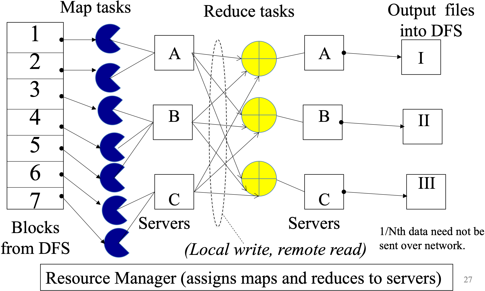
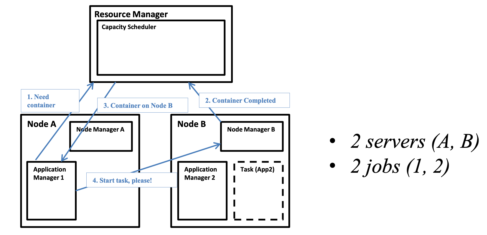
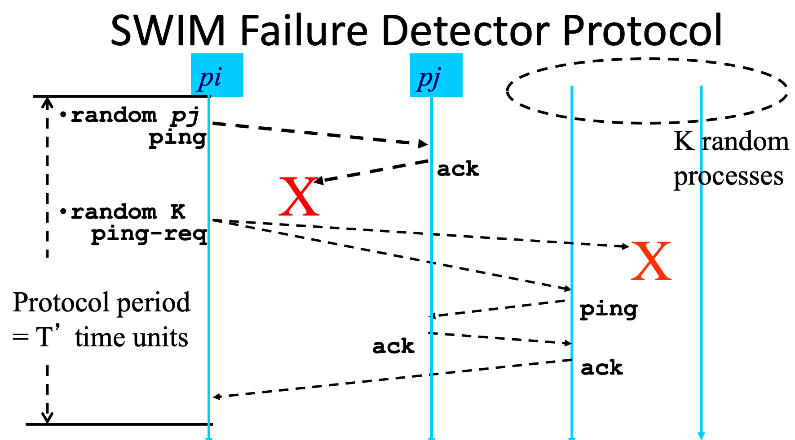
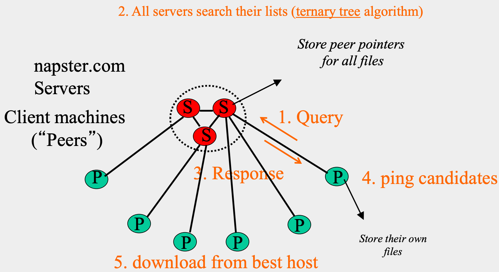

# CS 425 / ECE 428 Distributed Systems

## Lecture 1: Welcome, and Introduction

Operating System - The low-level software which handles peripheral hardware, schedules tasks, allocates storage, and presents a default interface to the user when no application program is running.


A distributed system is a collection of independent computers that appear to the users of the system as a single computer.

– Design and implementation

– Maintenance

– Algorithmics (“protocols” or “distributed algorithms”)


A distributed system is a collection of entities, each of which is *autonomous,* *programmable,* *asynchronous,* *and* *failure-prone*, and which communicate through an *unreliable communication medium.*

- Entity=a process on a device (PC, PDA/mobile device)

- Communication Medium = wired or wireless network

- Our interest in distributed systems involves – design and implementation, maintenance, algorithmics


**autonomous**——没有中央控制者,每个entity自己做决策。这直接决定了后面要学consensus、election这类"没有老大也要协调一致"的算法。

**programmable**——每个entity能跑任意逻辑,不是个哑巴中继器,这样才谈得上"distributed algorithm"。

**asynchronous**——没有全局时钟,没有消息延迟/处理速度的上界。

**failure-prone**——组件会挂,而且这是常态假设,不是边缘情况。

**unreliable communication medium**——消息会丢、会延迟、会乱序、会重复。


Firewall: prevents unauthorized messages from leaving/entering; implemented by filtering incoming and outgoing messages via firewall “rules” (configurable)


为什么HTTP是stateless的？

>   Protocols that maintain session “state” are complex!
>
>   -   past history (state) must be maintained and updated.
>   -   if server/client crashes, their views of “state” may be inconsistent, and hence must be reconciled.
>   -   RESTful protocols are stateless.

Lack of response may be due to either failure of a network component, network path being down, or a computer crash — challenging


## Lecture 2: Introduction to Cloud Computing

What is a Cloud?


Four Features New in Today’s Clouds

-   Massive scale
-   On-demand access
-   Data-intensive Computing
-   New Cloud Programming Paradigms

## Lecture 3: MapReduce and Hadoop

Map: Process a large number of individual records to generate intermediate key/value pairs **in parallel**

-   The same set of intermediate KV pairs, no matter how you parallelize it.
-   Map task invokes `map()` function **once per input key-value pair**

Reduce: Reduce processes and merge all intermediate values associated with each key

-   **Each key is assigned to one reducer**
-   Parallelly Processes and merges all intermediate values <u>by partitioning keys</u>
-   Reduce task invokes the `reduce()` function **once per unique intermediate key**

### Inside MapReduce

1.   Parallelize Map: easy! each map task is independent of the other!
     1.   **All Map output records with same key assigned to same Reduce** 
2.   Transfer data from Map to Reduce: 
     -   Called Shuffle data
     -   All Map output records with same key assigned to same Reduce task 
     -   use *partitioning function*, e.g., `hash(key)%number` of reducers ==> determine the number of reduce tasks
     -   Ensure <u>barrier</u> between the Map phase and Reduce phase
3.   Parallelize Reduce: easy! each reduce task is independent of the other!
4.   Implement Storage for Map input, Map output, Reduce input, and Reduce output
     -   **Map input**: from distributed file system
     -   Map output: to *local disk* (at Map node); uses local file systemReduce input: from (multiple) remote disks; uses local file systems
     -   Reduce output: to distributed file system(one output file per reduce task)
         -   local file system = Linux FS, etc.
         -   distributed file system = GFS (Google File System), HDFS (Hadoop Distributed File System)

Same set of machines store DFS file blocks, and can run map/reduce tasks




The YARN Scheduler

-   YARN = Yet Another Resource Negotiator
-   used in Hadoop MapReduce
-   Treats each server as a collection of containers
    -   Container = fixed CPU + fixed memory (think of Linux cgroups, but even more lightweight)
-   Has 3 main components
    -   Global Resource Manager (RM)
        -   Scheduling
    -   Per-server Node Manager (NM)
        -   Daemon and server-specific functions
    -   Per-application (job) Application Manager (AM)
        -   Container negotiation with RM and NMs
        -   Detecting task failures of that job


**Input → Map phase → barrier → Shuffle → Reduce phase → HDFS output**




How a job gets a container?

The **Resource Manager** only handles resource *allocation* — deciding which node has capacity and granting containers. It does **not** launch or monitor the actual tasks itself.

The **Application Manager** (one per running application/job) is responsible for negotiating containers with the Resource Manager, and then directly instructing the relevant **Node Manager** to actually start (and later monitor) the task inside that container.

The **Node Manager** on each machine is the local agent that manages containers on that specific node — launching, monitoring, and reporting resource usage/completion back to the Resource Manager.


### Fault Tolerance

Sever failure

Task failure

AM failure

RM failure

Why safe to restart failed map task? Reduce task? 

What if you wrongly detect and start another? Write to temporary file and rename at end.

### Slow tasks

Slow tasks are called **Stragglers**

Keep track of “progress” of each task (% done) 

Perform proactive backup (replicated) execution of straggler tasks 

-   A task done when its first replica complete (other replicas can be killed) 
-   Approach called Speculative Execution. 
-   Why is it safe? 
-   How will a restarted reduce task get inputs from the map task?


### Locality


### Hadoop Code

Map

```python

```

Reduce

```python

```

Driver

```python
// Tells Hadoop how to run your Map-Reduce job public static void main(String[] args) throws Exception { Configuration conf = new Configuration(); // The job. Job job = Job.getInstance(conf, "word count"); job.setJarByClass(WordCount.class); job.setMapperClass(TokenizerMapper.class); job.setReducerClass(IntSumReducer.class); // The keys are words job.setOutputKeyClass(Text.class); // The values are counts (ints) job.setOutputValueClass(IntWritable.class); for (int i = 0; i < otherArgs.length - 1; ++i) { FileInputFormat.addInputPath(job, new Path(otherArgs[i])); } FileOutputFormat.setOutputPath(job, new Path(otherArgs[otherArgs.length - 1])); System.exit(job.waitForCompletion(true) ? 0 
```


### Some Applications of MapReduce

1.   Word with maximum count 

Input: You are given a huge dataset 

Output: Word that appears the most in the dataset

Start with MR similar to WordCount:

Map – Process each word in a line and output `<word, 1>`

Multiple Reducers - Emits `<word, word_count>`	

-   Can't maintain maximum word count across all reduce function invocations: 
    -   Reduce invocations don't share state
    -   Even within one reducer, cross-invocation state is illegal by contract


2.   Sorting

Map task’s output is sorted (e.g., quicksort)

Reduce task’s input is sorted (e.g., mergesort)

Sort Input: Series of (key, value) pairs

Output: Sorted <value>s

Map – `<key, value> -> <value, _>`  (identity)

Reducer – `<key, value> -> <key, value>` (identity)

Partitioning function – Range partitioning


3.   For an asymmetrical social network, you are given a dataset D  where lines consist of (a,b) which means user a follows user b. Write a MapReduce program (Map and Reduce separately) that outputs the list of all users U who satisfy the following three conditions simultaneously: i) user U has at least 2 million followers, and ii) U follows fewer than 20 other users, and iii) all the users that U follows, also follow U back.

$A \rightarrow B$: `(A, (OUT, B))   # A follows B`

$B \rightarrow A$: `(B, (IN, A))    # B is followed by A`


##  Gossiping

### Topology-Aware Gossip

-   Network topology is hierarchical (subnets connected via routers).
-   **Problem**: naive random target selection → core routers see **O(N)** load.
-   **Fix**: in a subnet with `nᵢ` nodes, pick a target *within your own subnet* with probability `(1 − 1/nᵢ)` (i.e., mostly stay local, rarely cross the router).
    -   Result: **router load = O(1)**, while dissemination time stays **O(log N)**.


MapReduce contd(Inside MapReduce)

Quiz

Suppose the mappers produce: (cat, 1) (dog, 1) (cat, 1) (bird, 1) (dog, 1) Which of the following is guaranteed?

-   All 


Every intermediate key


Ensure that no Reduce starts before all Maps are finished. That is, ensure the barrier between the Map phase and Reduce phase


## Lecture 5-6: Failure Detection and Membership

mean time to failure (MTTF)

Fail-stop (crash) process failures

Fail-stop (crash) process failures


### Distributed Failure Detectors

Properties

-   **Completeness**: every real failure is eventually detected (no false negatives — you never miss a crash).
    -   more important than accuracy

-   **Accuracy**: nothing that hasn't failed gets flagged as failed (no false positives — you never falsely suspect a live process)
    -   Impossible completeness and accuracy together in lossy networks
-   **Speed**: Time to first detection of a failure
-   **Scale**
    -   Equal Load on each member
    -   Network Message Load


Heartbeating

-   Centralized Heartbeating
    -   If heartbeat not received from pi within timeout, mark pi as failed
-   Ring
    -   Unpredicatable on simultaneous multiple failures
-   All-to-All
    -   Complete but not accurate
    -   robust to multiple simultaneous failures
-   Gossip-style
    -   Complete (with very high probability, not deterministically), not Accurate.
    -   robust to multiple simultaneous failures
    -   Nodes periodically gossip their membership list: pick random nodes, send it list; On receipt, it is merged with local membership list; When an entry times out locally, member is marked as failed
    -   If the heartbeat has not increased for more than $T_{fail}$ seconds, the member is considered failed; And after a further $T_{cleanup}$ seconds, it will delete the member from the list


>   [!TIP]
>
>   1.   For ring heartbeating, assuming at most one process fails, which of the following best describes the failure detector? *Not accurate, but complete*
>
>   2.   Completeness of centralized heartbeating: what is the maximum number of process failures the failure detector can tolerate? *N-1*
>
>   3.   What happens if gossip period $T_{gossip}$ is decreased? *Bandwidth increases; false-positive rate decreases*
>
>   4.   If the failure timeout $T_{fail}$ is increased, while all other parameters are unchanged, what happens? *Bandwidth stays the same; false-positive rate decreases*
>
>        


| Scheme      | Messages/round | Completeness                                   | Accuracy     | Robust to multiple failures? | Load(L)   |
| ----------- | -------------- | ---------------------------------------------- | ------------ | ---------------------------- | --------- |
| Ring        | O(n)           | Complete (needs ≤1 failure)                    | Not accurate | No                           |           |
| All-to-all  | O(n²)          | Complete (deterministic)                       | Not accurate | Yes                          | L=N/T     |
| Centralized | O(n)           | **Not complete** (monitor is SPOF)             | Not accurate | N/A                          |           |
| Gossip      | O(n)           | Complete (**probabilistic**, high-probability) | Not accurate | Yes                          | L=NlogN/T |


Best/Optimal worst per-member load: $L∗=\frac {log(PM(T))}{log(p_{ml})}⋅\frac 1T$

-   $p_{ml}$: Independent Message Loss probability 消息独立丢失率
-   $PM(T)$: probability of accuracy
-   $L$: load L


All-to-all and gossip-based: sub-optimal

-   Optimal L is independent of N load应该和N组的大小无关
-   try to achieve simultaneous detection at **all** processes
-   fail to distinguish *Failure Detection* 失败检测 and *Dissemination* 消息扩散 components

### SWIM Failure Detector Protocol



不用heartbeat广播，而是让每个进程每个protocol period主动去**随机探测**一个目标，检测开销与N无关

#### 协议流程

每个period（Protocol period = T′）内，进程 $p_i$：

1.  从成员列表里随机挑一个 $p_j$，直接发送 **ping**，等待 **ack**
2.  如果在period内没能立刻收到ack（可能只是慢/暂时丢包，不代表真的挂了）→ 随机挑选 **K个** 其他进程，各自向它们发送 **ping-req**，请它们代为ping $p_j$（间接探测/indirect ping）
    -   这K个中继进程收到$p_j$的ack后，会把ack转发回$p_i$
3.  如果这一整个period结束时$p_i$仍未（直接或间接）收到任何ack → 怀疑/标记 $p_j$ 失败（结合下面的Suspicion机制，先suspect，不直接判死刑）

#### Detection Time

一个进程在一个protocol period内**被别人选中**作为ping目标的概率（$N-1$个其他成员里的任意一个都可能选中）：$T’=1-(1-\frac1N)^{N-1}=1-e^{-1}\approx 0.632$

对应的期望等待period数（几何分布）：$$E[T]=T'\cdot\frac{e}{e-1}\approx 1.58,T'$$

-   *这个期望检测时间是常数，与组大小N无关*

**Completeness**: Any alive member detects failure

-   Eventually
-   By using a trick: within worst case O(N) protocol periods

Time-bounded Completeness 优化

-   round-robin遍历
-   Random permutation of list after each traversal
-   Each failure is detected in worst case $2N-1$ (local) protocol periods 确定时间上界


### Group Membership Protocol

一个完整的group membership protocol由三部分组成：

-   I. 故障发生：$p_j$ crashed（本课程只考虑fail-stop failure）
-   II. Failure Detector：网络里某个进程（不必是全部）率先通过SWIM式的ping/ping-req机制发现$p_j$没有响应
-   III. Dissemination：把"$p_j$可能/已经失败"这个消息扩散给其余所有进程

三者都运行在一个unreliable communication network之上。

#### Dissemination Options

1.  Multicast（硬件层或IP层组播）——不可靠；而且多个进程同时发起multicast会互相冲突/造成额外开销
2.  Point-to-point（逐个用TCP/UDP发）——可靠，但**开销大**（每条消息都要发给所有人）
3.  Zero extra messages —— Piggyback on Failure Detector messages：把成员变更信息**捎带**在本来就要发的ping / ping-req / ack报文里一起发出去，完全不需要额外的消息 → 这就是 **Infection-style Dissemination**（感染式/流行病式传播，本质上是gossip的一种）

#### Infection-style Dissemination

-   传播速度是**指数级**的：经过 $\lambda\cdot\log N$ 个protocol period之后，还没收到某条更新的进程比例只有 $N^{-(2\lambda-2)}$——也就是说很快（对数级的period数）就能让几乎全网都知道
-   每个进程维护一个**缓冲区（buffer）**，记录最近join/被踢出的进程，piggyback时优先从这个buffer里挑**最新的更新**去发（"prefer recent updates"），这样更新能更快扩散
-   buffer里的元素在传播了足够久之后（约 $\lambda\log N$ periods，相当于已经"感染"了全网）会被**垃圾回收（GC）**——这就定义了系统的**弱一致性（weak consistency）**：不保证所有人瞬间一致，但保证很快、以高概率收敛到一致

#### Suspicion Mechanism

**问题**：直接ping失败就宣布"failed"太草率，会产生false positive，常见原因：

-   进程被"扰动"（perturbed，例如GC暂停、CPU被抢占）只是暂时没响应，其实还活着
-   单纯的网络拥塞导致丢包

并且间接ping（ping-req）也不能完全消除这个问题（中继和目标之间也可能拥塞/丢包）。

关键思路：**先怀疑（suspect），再宣判（declare failed）**——给一个缓冲期，让被怀疑的进程有机会自证清白。

状态机：

Alive --[FD: pi ping失败 → 发出 Dissmn(Suspect pj)]--> Suspected

Suspected --[FD: pi 之后ping成功 → 发出 Dissmn(Alive pj)]--> Alive  （反悔/自证清白）

Suspected --[等待超时 Timeout]--> Failed --[发出 Dissmn(Failed pj)]

每次状态转换都会触发对应的Dissemination消息（Suspect / Alive / Failed pj），这些消息同样是piggyback出去、零额外开销的。

**用Incarnation Number区分"多次怀疑"，并允许自证清白**：

-   每个进程 $p_i$ 维护自己的**incarnation number（版本号）**，**只有 $p_i$ 自己能递增它**——例如当$p_i$收到别人发的 (Suspect, $p_i$) 消息时，为了证明"我还活着"，就把自己的incarnation number+1，再广播一条 (Alive, 新inc#) 出去，用更高的版本号覆盖那条Suspect消息
-   这个思路和ad-hoc网络路由协议**DSDV**用序列号解决"陈旧信息覆盖新信息"的思路有点像
-   消息的**优先级规则**（谁能覆盖谁）：
    1.  **更高的 incarnation number 总是覆盖更低的**（无论状态是什么）
    2.  在**同一个**incarnation number内：(Suspect, inc#) 的优先级 **高于** (Alive, inc#)
    3.  **(Failed, inc#) 的优先级最高，覆盖其它任何消息**

#### SWIM in Industry

-   最早用在 **Oasis / CoralCDN**
-   Hashicorp 开源实现：**Serf**（之后发展成了 **Consul**）
-   现在：**Uber** 在其基础设施里用它做故障检测——见开源项目 **"ringpop"**

#### Wrap Up

-   Failures the norm, not the exception in datacenters
-   Every distributed system uses a failure detector
-   Many distributed systems use a membership service

-   Ring failure detection underlies
-   IBM SP2 and many other similar clusters/machines

-   Gossip-style failure detection underlies
-   Amazon EC2/S3 (rumored!)


## Lecture 7: Peer-to-peer Systems I

First distributed systems to seriously focus on scalability with respect to number of nodes

-   Massive scale
-   Anyone with a computer can run a process that joins the p2p system
-   Churn high – nodes joining and leaving 节点频繁变动（离开和加入）

P2P techniques abound in cloud computing systems

-   Key-value stores (e.g., Cassandra, Riak, Voldemort) use Chord p2p hashing

### Napster Structure



**结构**：napster.com上有若干中心目录服务器（Servers, S），客户端（Peers, P）连接到服务器。

-   服务器只存"目录"（directory）：`<filename, ip_address, portnum>` 三元组，**服务器本身不存任何文件**
-   Peer连接服务器后，上传自己愿意分享的文件列表；真正的文件始终存在peer自己本地


Napster Search Process

1.  Query：peer把关键词发给服务器
2.  All servers search their lists（用 ternary tree 算法，服务器之间也互相协作搜索）
3.  Response：服务器把候选的 `<ip, port>` 列表返回给peer
4.  ping candidates：peer去ping这些候选host，测传输速率
5.  download from best host：从速度最快的host直接下载（peer之间点对点传输，不经过服务器）

全部通信都用**TCP**（可靠有序）。加入系统时通过一个**introducer**（一个知名的、记录了最近加入节点的well-known server）来初始化自己的邻居/连接信息——这个"通过introducer加入"的套路是**任何p2p系统**通用的。

**Problems**

-   Centralized server a source of congestion
-   Centralized server single point of failure **单点故障**（SPOF）
    -   对比之下，YARN的RM或HDFS的NameNode为什么中心化设计反而work得好？因为它们管理的是**可信、受控**的集群内部资源分配，而不是海量互不信任、随时上下线的公网节点
-   No security: plaintext messages and passwds
-   napster.com declared to be responsible for users’ copyright violation
    -   “Indirect infringement” 间接侵权

>   [!TIP]
>
>   1.   In Napster, if one file suddenly is extremely popular, which resource is necessarily the bottleneck?
>   2.   What happens if the introducer node fails?  *Existing peers can continue searching, sharing, and adding files; New peers may be unable to join through that introducer*

### Gnutella

**核心思路：彻底去掉中心服务器**，客户端之间互相搜索、互相下载。每个客户端既是client也是server，称为 **servent**（server+client）。

Gnutella routes different messages within the overlay graph

Gnutella protocol has 5 main message types

-   Query (search)
-   QueryHit (response to query)
-   Push (used to initiate file transfer)
-   Ping (to probe network for other peers)
-   Pong (reply to ping, contains address of another peer)


每条消息有一个**Descriptor Header**：Descriptor ID（这次搜索事务的唯一标识）、Payload descriptor（消息类型，如0x80=Query, 0x81=QueryHit, 0x00=Ping, 0x01=Pong, 0x40=Push）、**TTL**（每跳递减，TTL=0时丢弃该消息，初始通常7~10）、**Hops**（每跳递增）、Payload length。


**Gnutella Search（洪泛式搜索 / Flooding）**

-   Query被**洪泛**（flood）到所有邻居，受TTL限制层层扩散，每条Query（按Descriptor ID区分）**只转发一次**
-   QueryHit（搜索命中的响应）Route back to peer from which it received query (same DescriptorID)，不需要知道原发起者的地址
-   **避免过度流量**：每个peer维护"最近收到的消息"列表去重；Query只转发给收到它的那个邻居**以外**的所有邻居；同一个Descriptor ID+同类型的重复消息直接丢弃；对没见过对应Query的QueryHit也直接丢弃

>   [!TIP]
>
>   1.   In Gnutella, if we increase TTL, which statement is most accurate? *Possibility increases, message overhead increases*
>
>   2.   Gnutella peer receives the same Query (same DescriptorID) from two different neighbors. What should it d when it receives the second copy? *Drop it.*

QueryHit的payload包含：命中数、responder的IP/端口/连接速度、`(fileindex, filename, fsize)`列表、以及servent_id（响应者的唯一标识，是其IP的某个函数）。


下载文件

请求方收到QueryHit后，直接向responder的ip+port发起**HTTP** GET请求（`GET /get/<File Index>/<File Name>/HTTP/1.0`），用HTTP是因为它标准、成熟、被广泛支持；GET里带`Range`字段是为了支持**断点续传/部分文件传输**。

**穿透防火墙（Push消息）**：如果responder在防火墙后面、无法接受入站连接，requestor就发一条**Push**消息（携带同样的servent_id、fileindex，以及requestor自己能接受入站连接的地址），responder收到后**主动**向requestor发起TCP连接，发送`GIV <File Index>:<Servent Identifier>/<File Name>`，requestor再照常发GET请求下载。如果requestor自己也在防火墙后面——Gnutella就无能为力了（这也是后续系统要解决的问题之一）。


Ping-Pong：维护邻居列表

Peer**周期性**主动发Ping；Ping像Query一样被洪泛出去，Pong沿反向路径像QueryHit一样送回；Pong的内容是`<port, ip_address, num files shared, num KB shared>`，用于持续刷新邻居集合，应对peer的加入/离开/失败。


**Summary**

-   无服务器；peer（servents）维护"邻居"关系构成overlay图；peer存储自己的文件；Query洪泛+TTL限制；QueryHit反向路径路由；支持穿墙下载；周期性Ping-Pong刷新邻居
-   邻居列表大小由用户自己设置——异质性导致图的度数服从**幂律分布（power law）**：$P(\#links=L)\sim L^{-k}$ 

**Problems**

-   Ping/Pong一度占了50%的流量（解法：多路复用、缓存、降低频率）
-   相同关键词重复搜索（解法：缓存Query/QueryHit结果）
-   拨号用户带宽不够转发Gnutella流量（解法：用中心服务器代理，或者下面的FastTrack方案）
-   大量**"白嫖党"（freeloader）**——2000年时70%用户只下载不上传；洪泛式搜索导致流量过大，本质问题是"没有关于peer的元信息来指导更智能的路由" → 引出**结构化P2P系统**（下节课的Chord）


### BitTorrent

针对"单一大文件被大量人同时下载"场景（不同于Napster/Gnutella那种"海量不同文件、各自小规模"的场景）设计。

#### 基本流程

1.  **Get tracker**：网站上的链接指向一个`.torrent`文件，里面写明了该文件对应的**tracker**地址
2.  **Get peers**：向tracker请求，tracker（每个文件一个tracker）记录一部分peer信息，接收各peer的心跳、加入/离开通知，返回一批peer地址给新节点
3.  **Get file blocks**：新节点（**leecher**，还没下完）向这些peer请求文件的**块（block）**；已经有完整文件的节点叫**seed**

节点角色随下载进度变化：`(new, leecher)` → `(leecher, has some blocks)` → `(seed)`。

#### 关键机制

-   **文件切块**：32KB~256KB一块。
    -   好处：可以从**多个不同的peer**并行下载不同的块（不必等一个源慢慢传整个文件），也让"稀有度"和"部分共享"变得可行
-   **Local Rarest First**：优先下载在自己邻居中**最稀有（复制份数最少）**的块——这样能让所有块尽快在网络里都有备份，避免某个块因为原始来源下线而"失传"；例外：新节点允许随机挑一个邻居的块优先下载，帮助冷启动（bootstrapping）
-   **Tit for tat（以牙还牙）带宽策略**：优先把带宽（上传）让给那些给**自己**提供了最好下载速度的邻居——激励每个节点都积极上传，seed也遵循同样的策略
-   **Choking（阻塞）**：每个节点把并发上传的邻居数限制在一个较小的数（如5个，即"最好的"那几个邻居），其余全部choke（拒绝上传）；这个"最佳邻居集合"会**周期性重新评估**（比如每10秒）
-   **Optimistic unchoke（乐观解锁）**：周期性地（比如每30秒）随机解锁一个本来被choke的邻居，给它一个证明自己的机会——避免"最佳集合"僵化、帮助新节点/新到的好节点被发现

## Lecture 8: Peer-to-peer Systems II

DHT=Distributed Hash Table

**哈希表**：支持按key插入/查找/删除对象。

**分布式**哈希表（DHT）：在分布式环境下做同样的事（这里"对象"就是文件）。

设计DHT时关心的性能指标：

-   **负载均衡（Load balancing）**
-   **容错性（Fault-tolerance）**
-   **查找/插入的效率（Efficiency of lookups and inserts）**
-   **局部性（Locality）**

Napster、Gnutella、FastTrack某种意义上也（勉强）算DHT；本节课要学的**Chord**是一个"结构化"（structured）的p2p系统，也是一种DHT。

#### 三种系统的对比（内存/查找延迟/单次查找的消息数）

|           | Memory               | Lookup Latency | #Messages for a lookup |
| --------- | -------------------- | -------------- | ---------------------- |
| Napster   | O(1)（服务器端O(N)） | O(1)           | O(1)                   |
| Gnutella  | O(N)                 | O(N)           | O(N)                   |
| **Chord** | **O(log N)**         | **O(log N)**   | **O(log N)**           |

Napster快是因为它有中心化的"作弊"手段（一次查询就问到服务器）；Gnutella纯洪泛所以是O(N)；**Chord的目标就是：既不需要中心服务器，又能做到O(log N)**——这正是它作为"结构化P2P"、"有可证明性质"的意义所在。

### Chord

开发者：I. Stoica, D. Karger, F. Kaashoek, H. Balakrishnan, R. Morris（Berkeley & MIT）。核心思想：**智能地选择邻居**，从而降低路由（lookup/insert）的延迟和消息开销。

#### 一致性哈希（Consistent Hashing）

-   用 **SHA-1**(ip_address, port) → 160位字符串，截断为 mm m 位，称为该peer的 **id**（0 到 2m−12^m-1 2m−1 之间的数）；id不保证绝对唯一，但冲突概率极低
-   把所有peer映射到一个逻辑上的**环（ring）**上的 2m2^m 2m 个位置之一——这就是"Ring of peers"

#### Peer pointers (1)：successor / predecessor

每个peer只需要知道自己在环上顺时针方向的下一个（**successor**）和逆时针方向的上一个（**predecessor**）节点，就已经足以支持查找了（每个peer把请求转给自己的successor，逐跳传递），**但这样一跳只能走一步，最坏要走O(N)跳**，效率很低。

#### Peer pointers (2)：finger table（提高效率的关键）

id为 nn n 的peer，其finger table的第 i 项（ i=0,…,m−1）指向：**环上第一个$id ≥ (n+2^i) \bmod 2^m$ 的peer**（即"$n+2^i$ 位置处、或顺时针方向最近的peer"）。

-   i=0项就是successor；随着 i 增大，指向的目标在环上**越跳越远**（指数级增长的步长: $2^0$,$2^1$,$2^2$,$\dots$ ）
-   这样一个finger table一共有 m 项，是关于N对数级O(log N)的大小（因为id空间大小 $2^m$，而实际peer数N使得有意义的finger数目是O(log N)）
-   如果某个理论位置上不存在真实节点（比如N112不存在），就取顺时针方向**第一个存在的peer**填入该项

#### 文件（key）的存储位置

文件名也用同一个一致性哈希函数：SHA-1(filename) → 160位key。**文件存储在"第一个id ≥ 该key（mod 2^m）"的peer上**——即和文件key顺时针最近的那个peer。

一致性哈希的好处：有K个key、N个peer时，平均每个peer只需存 O(K/N) 个key（准确说是 <$c\cdot K/N$，c为常数）——这就是**一致性哈希相对普通哈希的核心优势**：普通哈希在peer数变化时几乎所有key都要重新映射，一致性哈希只需局部调整。

#### 查找（Search / Lookup）

规则：在节点 n处，把对key k 的查询转发给自己的successor/finger表项中，**id ≤ k 里最大的那个**（即"顺/逆时针最靠近k、但不超过k"的已知节点，环形wrap-around）；如果没有这样的表项，就转给自己的successor。所有转发都通过**RPC（远程过程调用）**完成。

**分析：查找只需要O(log N)跳**

-   直觉：每一步，query位置和"存有目标文件的peer"之间的**环上距离至少缩小一半**（因为finger table的指数级跳跃覆盖了整个环）
-   经过 $\log N$步转发后，剩余距离最多是 $2^m/2^{\log N}=2^m/N$
-   而由SHA-1哈希的随机性（"Balls and Bins"分析），在这么小的一段id范围内，大概率（w.h.p.）只有$O(\log N)$ 个真实peer id，所以再用successor一个个找，最多也只需再 O(logN) 跳
-   这个O(log N)的时间界，对**routing这个操作本身**成立，可以作为insert/lookup/delete所有操作的**统一building block**
-   **前提**：finger表项和successor必须是**正确**的——一旦有节点失败，这个前提就可能被打破

#### 应对节点失败（Search under peer failures）

-   问题：如果某个finger/successor指向的节点已经挂了，查找会直接失败（比如N16不知道N45已经挂了，或者转发目标N45本身已死）
-   **解法1**：每个节点维护 rr r 个（而不是1个）连续的successor（**successor list**），一个挂了就用下一个
-   **解法2**：把文件/key**复制**到 rr r 个连续的successor和predecessor上（不只放在"理论上唯一"的那个节点）
-   取 $r=2\log N$即可保证在**50%节点同时失败**的极端情况下，lookup正确性仍然**高概率（w.h.p.）**成立：单个节点"至少一个successor存活"的概率是 $1-(\frac12)^{2\log N}=1-\frac1{N^2}$，对所有存活节点同时成立的概率约为 $e^{-1/2N}\approx1$

#### 应对动态变化（churn）：新节点加入

P2P系统的churn（节点加入/离开/失败的频率）很高——Overnet系统实测每小时**25%**，Gnutella高达**100%**！所以系统要**持续不断地**更新successor/finger并搬运key。

**新节点N40加入的流程**：

1.  N40通过某个**introducer**联系上环上一个随机的已有节点，被引导找到自己的successor（比如N45）
2.  N45的原predecessor（如N32）把自己的successor更新为N40
3.  N40把自己的successor初始化为N45，并以此为起点初始化自己的finger table
4.  N40周期性地和邻居交流，逐步修正/完善自己的finger table——这个持续运行的过程叫 **Stabilization Protocol**
5.  N40需要从原来"负责"这段id范围的节点（N45）那里**复制**一部分本该属于自己的文件/key（比如fileid在32~40之间的文件）

一个新节点加入平均会影响系统中 $O(\log N)$ 个其他节点的finger表项；每次加入的总消息数是$O(\log N \cdot \log N)$ 。节点离开的处理类似；处理**失败**（而非主动离开）还需要用到**failure detector**（前面学的SWIM等）来先发现节点挂了。

#### Stabilization Protocol（稳定化协议）

并发的加入/离开/失败可能导致指针出现**环路**（loopiness）或查找失败。Chord的每个节点**周期性**运行一个稳定化算法，检查并修正指针和key的归属，保证：**finger不成环、查找最终会成功、且高概率下仍是O(log N)跳**。每轮稳定化，单个节点的开销是常数条消息；但达到**强稳定性（strong stability）**需要 $O(N^2)$ 轮。

#### Churn 带来的额外问题 与 应对思路

-   高churn导致：不必要的过量key拷贝（因为key是被复制的）；stabilization算法需要消耗更多带宽才能跟上变化
-   核心矛盾：Chord把**整个文件的拷贝**都复制/搬运了，但其实往往只需要复制**"谁有这个文件"的元信息（指针）**就够了
-   两种改进思路：① 引入一层间接层，只存指向文件的指针（大多数p2p系统的做法）；② 更激进地复制元数据本身——这正是**Kelips**的做法（见下）

#### Virtual Nodes（虚拟节点）

问题：哈希函数不是完美均匀的，会导致**负载不均衡**（有的节点id区间大、存的key多）。

解法：把**每个物理节点当成多个独立的虚拟节点**，每个虚拟节点各自独立地以自己的身份加入环——**降低了负载不均衡的方差**（大数定律的思路：切得越碎，各物理节点分到的总量越接近平均值）。

#### Chord小结与应用

-   比Gnutella更**结构化**；对外表现为一个"黑盒"式的lookup算法
-   处理churn相对复杂
-   O(log N)的内存和查找开销——但O(log N)跳在实际系统里也可能不算小，能否进一步降低？（见下面的Kelips，用空间换时间做到O(1)跳）
-   Chord这套"**虚拟环 + 一致性哈希**"的思想被广泛用在Cassandra、Riak、Voldemort、DynamoDB等key-value store里；此外还有CFS/Ivy（构建在Chord上的文件系统）、基于Chord的DNS查找服务、UCB的Internet Indirection Infrastructure (I3)项目等后续研究

### Kelips —— 一种"1跳查找"的DHT

**核心思路：用空间（内存）换时间——把查找压到几乎1跳，代价是每个节点要多存一些东西。**

-   把所有节点划分成 kk k 个 **"亲和组"（affinity groups）**，$k\sim\sqrt N$；每个节点通过 `hash(id) mod k` 被分到一个组
-   每个节点的"邻居"由两部分组成：
    -   **本组内几乎所有其他节点**（组内是全连接式的了解）
    -   **每个"外组"各留一个联系人（contact node）**
    -   这些邻居关系通过**gossip式心跳**（前面学的gossip-style heartbeating）来维护

**文件与元数据**：

-   文件本身可以存在（少数几个）任意节点上；**文件的"位置信息"这一层和文件本身的存储/复制彻底解耦**——这是Kelips相对Chord的关键设计选择（Chord把整个文件复制到successor们那里，Kelips只复制"谁有这个文件"这条元信息）
-   文件名同样被哈希到某个**组**；该组里**所有**节点都会存一份 `<filename, who-has-file>` 的指针信息（通过组内gossip扩散），但这个组本身**不存文件内容**

**查找（Lookup）**：

1.  用文件名哈希算出它属于哪个affinity group
2.  找到自己在该组里的contact node，直接问它要结果
3.  如果这个contact联系不上，换该组另一个已知的contact试试

-   查找基本上是 **1跳**（或最多几跳，取contact失效重试的情况）
-   代价：**内存开销是$O(\sqrt N)$（因为要记住本组几乎所有人）——例如100K节点、1000万文件的规模下，每个节点大约需要**1.93MB内存，完全能放进今天普通工作站/笔记本的内存里（COTS机器）

**Soft State（软状态）**：

-   成员列表：组内、组间都靠gossip维护；扩散时间是$O(\log N)$ 
-   文件元数据：需要**从源节点周期性刷新**，否则会**超时过期**（这也是"soft state"的含义——信息不是永久写死的，靠周期性重新宣告来续期，过期自动失效，天然容错）

### Chord vs. Pastry vs. Kelips

三者体现了一系列**可取舍的权衡（tradeoffs）**：**内存 vs. 查找开销 vs. 维持邻居新鲜度所需的后台带宽**——Chord内存小（O(log N)）但查找跳数也是O(log N)；Kelips内存大（O(√N)）换来几乎O(1)的查找；总没有免费的午餐。

### （补充材料，不在考试范围）Pastry

设计者：Anthony Rowstron（微软研究院）与Peter Druschel（Rice University）。

-   和Chord一样，给节点分配id（同样基于一个虚拟环）
-   **Leaf Set**：每个节点知道自己前后若干个successor/predecessor（类似Chord的successor list）
-   **路由表基于"前缀匹配"（prefix matching）**：可以类比成一个**超立方体（hypercube）**结构。路由同样是 O(log⁡N)O(\log N) O(logN) 跳
    -   例如id为`01110100101`的节点，会维护分别匹配前缀 `*`、`0*`、`01*`、`011*`……直到`0111010010*`（只差最后一位不同）的邻居各一个
    -   路由到目标（如`0110111001`）时，每一跳都转发给**当前已知的、和目标前缀匹配长度最长**的邻居——这是"hypercube routing"
-   **局部性（Locality）优化**：对每个前缀，如果有多个候选邻居都匹配，Pastry选择其中**round-trip-time最短**的那个作为邻居——因为短前缀对应的候选池更大（分布在整个互联网上），所以短前缀邻居更容易选到"物理上近"的节点；结果是路由路径**前几跳短、后几跳长**，但相比直接走互联网路的"stretch"（拉伸比）依然保持很低
