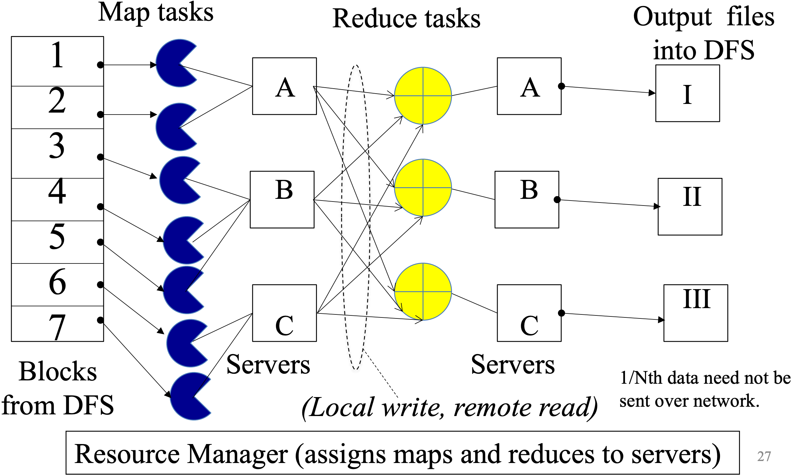
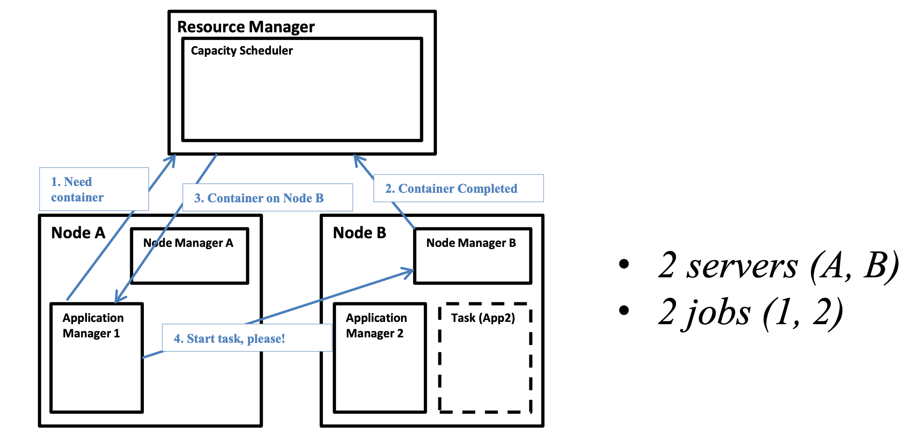
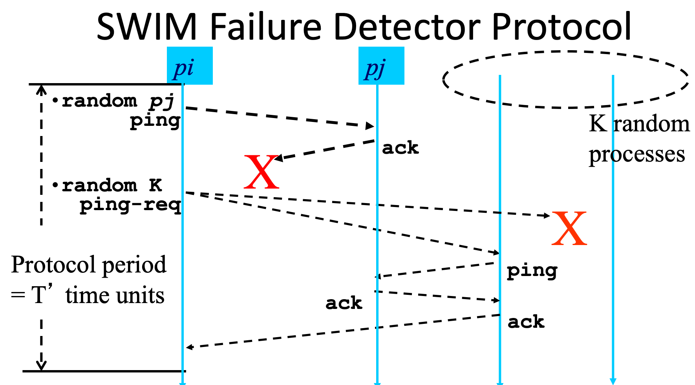
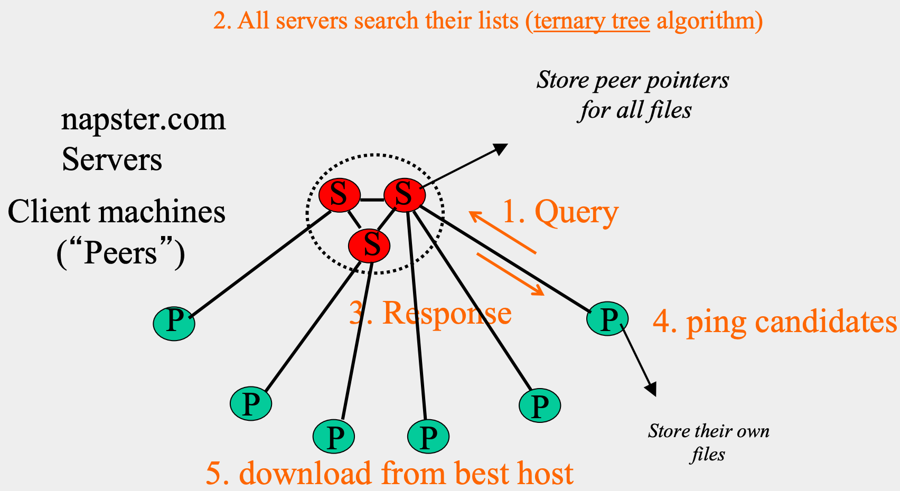
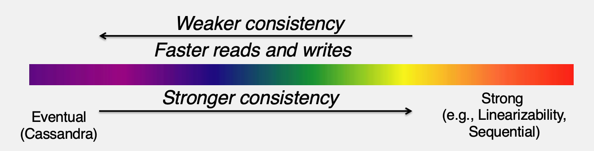
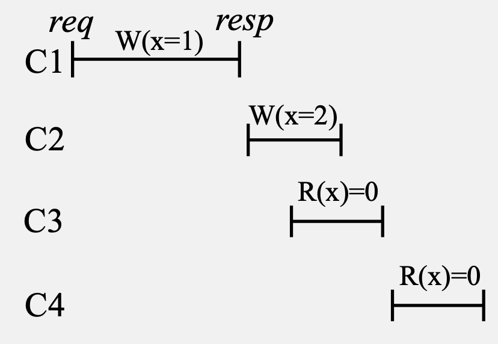
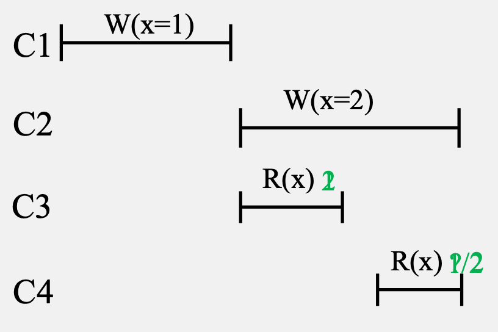
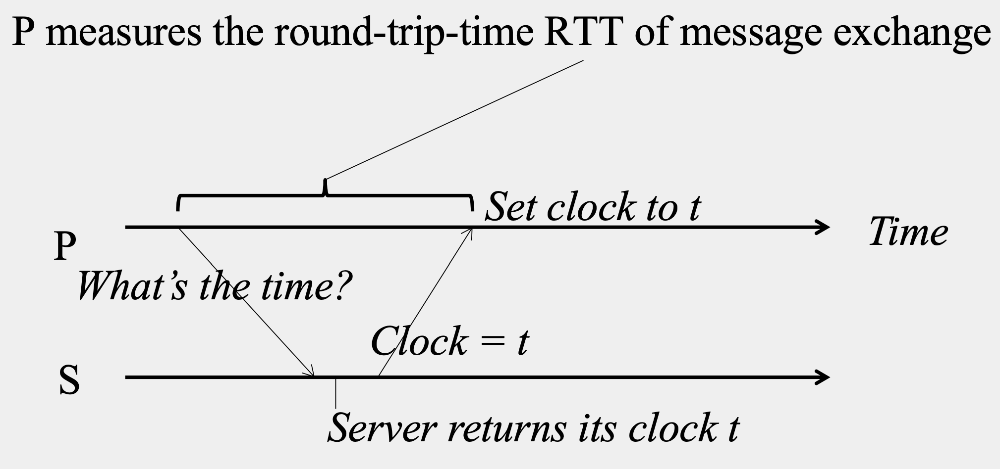

# CS 425 / ECE 428 Distributed Systems

## Lecture 1: Welcome, and Introduction

Operating System - The low-level software which handles peripheral hardware, schedules tasks, allocates storage, and presents a default interface to the user when no application program is running.


A distributed system is a collection of independent computers that appear to the users of the system as a single computer.

– Design and implementation

– Maintenance

– Algorithmics (“protocols” or “distributed algorithms”)


A distributed system is a collection of entities, each of which is *autonomous,* *programmable,* *asynchronous,* *and* *failure-prone*, and which communicate through an *unreliable communication medium.*

- Entity=a process on a device (PC, PDA/mobile device)

- Communication Medium = wired or wireless network

- Our interest in distributed systems involves – design and implementation, maintenance, algorithmics


**autonomous**——没有中央控制者,每个entity自己做决策。这直接决定了后面要学consensus、election这类"没有老大也要协调一致"的算法。

**programmable**——每个entity能跑任意逻辑，不是个哑巴中继器，这样才谈得上"distributed algorithm"。

**asynchronous**——没有全局时钟，没有消息延迟/处理速度的上界。

**failure-prone**——组件会挂，而且这是常态假设,不是边缘情况。

**unreliable communication medium**——消息会丢、会延迟、会乱序、会重复。


Firewall: prevents unauthorized messages from leaving/entering; implemented by filtering incoming and outgoing messages via firewall “rules” (configurable)


为什么HTTP是stateless的？

>   Protocols that maintain session “state” are complex!
>
>   -   past history (state) must be maintained and updated.
>   -   if server/client crashes, their views of “state” may be inconsistent, and hence must be reconciled.
>   -   RESTful protocols are stateless.

Lack of response may be due to either failure of a network component, network path being down, or a computer crash — challenging


## Lecture 2: Introduction to Cloud Computing

### What is a Cloud?

**Cloud = Lots of storage + compute cycles nearby**

A single-site cloud (aka **Datacenter**) consists of

-   Compute nodes (grouped into racks)
-   Switches, connecting the racks
-   A network topology, e.g., hierarchical
-   Storage (backend) nodes connected to the network
-   Front-end for submitting jobs and receiving client requests
-   Front-end + compute + storage 常被称为 **three-tier architecture**
-   Software Services

A geographically distributed cloud = multiple such sites, each site perhaps with a different structure and services

**Two Categories of Clouds**

-   **Private cloud**: accessible only to company employees
-   **Public cloud**: provides service to any paying customer
    -   Amazon S3 (Simple Storage Service): pay per GB-month stored
    -   Amazon EC2 (Elastic Compute Cloud): upload and run arbitrary OS images, pay per CPU hour used

Clouds build on previous generations of distributed systems (尤其是1960-70年代的 timesharing 和 data processing industry)

Trends: storage doubles every 12 mos, bandwidth 9 mos, CPU 18 mos (Moore's law)

### Four Features New in Today’s Clouds

1.   **Massive scale**: 几十万到上百万台机器（e.g., Google ~900K in 2011）
2.   **On-demand access**: Pay-as-you-go, no upfront commitment, anyone can access it
3.   **Data-intensive Nature**: MBs → TBs, PBs, XBs (daily logs, forensics, Web data)
4.   **New Cloud Programming Paradigms**: MapReduce/Hadoop, NoSQL/Cassandra/MongoDB — high in accessibility and ease of programmability

>   [!TIP]
>
>   判断一个问题是不是"新的云计算问题"：看它是否涉及这四个特征（Scale, On-demand, Data-intensive, New programming）之一或组合。否则可能已经有现成解法了

#### On-demand access: *aaS Classification

| 类型 | 你拿到什么 | 例子 |
| ---- | ---------- | ---- |
| **HaaS** (Hardware) | 裸机，随便用；有安全风险 | Your own cluster |
| **IaaS** (Infrastructure) | 灵活的计算和存储基础设施（VM/容器/cgroups），常被认为包含 HaaS | AWS EC2 & S3, OpenStack, Azure, Google Cloud |
| **PaaS** (Platform) | 基础设施 + 与之紧耦合的软件平台 | Google AppEngine |
| **SaaS** (Software) | 按需使用的软件服务，包含 SOA | Google Docs, Office 365 Online |
| **FaaS** (Function) | 按函数调用 | AWS Lambda, Azure Functions |

#### Data-intensive Computing

-   **Computation-intensive**: MPI-based, HPC, Grids, 通常跑在 supercomputer 上
-   **Data-intensive**: 数据存在 datacenter，用附近的 compute nodes 计算
-   In data-intensive computing, focus shifts from computation to the data: **CPU utilization no longer the most important resource metric, instead I/O is (disk and/or network)**

### Power

WUE = Annual Water Usage / IT Equipment Energy (L/kWh) – low is good

PUE = Total facility Power / IT Equipment Power – low is good (e.g., Google ~1.1; 理想值是1)

### Single-site Cloud: Outsource or Own?

例：128 servers (1024 cores), 524 TB，运行 M 个月（2009年价格: S3 \$0.12/GB-month, EC2 \$0.10/CPU-hour）

-   **Outsource (AWS) monthly**: Storage = 0.12 × 524 × 1000 ≈ \$62K；Total = \$62K + 0.10 × 1024 × 24 × 30 ≈ \$136K
-   **Own monthly**: Storage ≈ \$349K / M；Total ≈ \$1555K / M + 7.5K (含 1 sysadmin / 100 nodes)
-   **Breakeven**: 自己买更划算当
    -   \$349K / M < \$62K ⟹ **M > 5.55 months** (storage)
    -   \$1555K / M + 7.5K < \$136K ⟹ **M > 12 months** (overall)
-   结论：**Startups use clouds a lot**（短期用租的更便宜）；**Cloud providers benefit monetarily most from storage**（storage 的 breakeven 更短）

>   [!TIP]
>
>   算法：令 Own 的月成本 < Outsource 的月成本，解出 M。Own 的成本是一次性买入摊到 M 个月上，所以用得越久越划算

## Lecture 3: MapReduce and Hadoop

名字来自函数式语言（Lisp）：`(map square '(1 2 3 4))` → `(1 4 9 16)`（逐条独立处理）；`(reduce + '(1 4 9 16))` → `30`（批量合并）

WordCount 伪代码：

```python
map(key, value):      # key is empty, value is the line
    for each word in value:
        output(word, 1)

reduce(key, values):  # key is word, values is list of integers
    sum = 0
    for each v in values:
        sum += v
    output(key, sum)
```

**Map**: Process a large number of individual records to generate intermediate key/value pairs **in parallel**

-   The same set of intermediate KV pairs, no matter how you parallelize it.
-   Map task invokes `map()` function **once per input key-value pair**
-   每条输入记录独立处理，输出若干 `(key, value)`。每个 map task 对每条输入调用一次 map 函数，所以无论怎么并行，产生的中间 KV 都相同。

**Reduce**: Reduce processes and merge all intermediate values associated with each key

-   **Each key is assigned to one reducer**
-   Parallelly Processes and merges all intermediate values <u>by partitioning keys</u>
-   Reduce task invokes the `reduce()` function **once per unique intermediate key**
-   对每个 key 和它的 value 列表调用**恰好一次**。一个 reduce task 可以负责多个 key，分配方式通常是 `hash(key) % 并行 reduce 数`

### Inside MapReduce

#### Programming MapReduce

**Externally (for user)**: 写 Map 和 Reduce 程序；指定 Map/Reduce 数量（并行度）和 partitioning function；提交 job 等结果。几乎不需要懂分布式编程

**Internally (for paradigm & scheduler)**: Parallelize Map → Shuffle → Parallelize Reduce → 实现各阶段的 Storage，并保证 Map 和 Reduce 之间的 barrier

#### Shuffle

-   同 key 的记录进同一个 reduce task，分区用 hash 或 range。
-   Each map task creates **R partitions**（R = reduce task 数），每个 reduce task 从 **M 个 map task** 拉取并归并属于自己的那一份
-   map 输出先排序，reduce 输入再归并排序。
-   map 和 reduce 之间有 **barrier**：所有 map 完成后 reduce 才开始。原因是某个 key 的 value 可能来自任何一个 map task，不等 map 全部结束，reduce 就拿不到完整的 value 列表。

#### Process

1.   Parallelize Map: easy! each map task is independent of the other!
     
     **All Map output records with same key assigned to same Reduce**
2.   Transfer data from Map to Reduce: 
     -   Called Shuffle data
     -   All Map output records with same key assigned to same Reduce task 
     -   use *partitioning function*, e.g., `hash(key)%number` of reducers ==> determine the number of reduce tasks
     -   Ensure <u>barrier</u> between the Map phase and Reduce phase
3.   Parallelize Reduce: easy! each reduce task is independent of the other!
4.   Implement Storage for Map input, Map output, Reduce input, and Reduce output
     -   **Map input**: from distributed file system
     -   **Map output**: to *local disk* (at Map node); uses local file system
     -   **Reduce input**:  from (multiple) remote disks; uses local file systems（为什么写磁盘？中间数据可能很大放不下内存；而且 reduce 失败重启时可以重新拉取，不用重跑 map）
     -   **Reduce output**: to distributed file system(one output file per reduce task)
         -   local file system = Linux FS, etc.
         -   distributed file system = GFS (Google File System), HDFS (Hadoop Distributed File System)

Same set of machines store DFS file blocks, and can run map/reduce tasks（local write, remote read；1/N 的数据不需要走网络）




>   [!TIP]
>
>   **Quiz**: mappers 产生 (cat,1) (dog,1) (cat,1) (bird,1) (dog,1)，什么是有保证的？ *All (cat,1) records go to the same reduce task*（同理每个 key 的所有记录都去同一个 reduce task）
>
>   所有 `cat` 记录一定去同一个 reduce task，但一个 map task 的输出会分发给多个 reduce task。
>
>   输出是 (cat,1)×3、(dog,1)×2 时，reduce 被调用 **2 次**（按不同 key 数，不是按记录数，也不是按 reduce task 数）。
>
>   **为什么需要 barrier？** 某个 key 的 value 可能来自任何一个 map task，所以 no Reduce starts before all Maps are finished

#### The YARN Scheduler

-   YARN = Yet Another Resource Negotiator
-   used in Hadoop MapReduce
-   Treats each server as a collection of containers
    -   Container = fixed CPU + fixed memory (think of Linux cgroups, but even more lightweight)
-   Has 3 main components
    -   Global Resource Manager (RM)
        -   Scheduling
    -   Per-server Node Manager (NM)
        -   Daemon and server-specific functions
        -   Keep track of containers/tasks on that machine
    -   Per-application (job) Application Manager (AM)
        -   Container negotiation with RM and NMs
        -   Detecting task failures of that job

RM 负责全局调度，NM 是每台机器上的守护进程，AM 是每个 job 一个，负责向 RM 申请 container 和检测任务失败。

**Input → Map phase → barrier → Shuffle → Reduce phase → HDFS output**




How a job gets a container?

The **Resource Manager** only handles *resource allocation* — deciding which node has capacity and granting containers. It does **not** launch or monitor the actual tasks itself.

The **Application Manager** (one per running application/job) is responsible for *negotiating containers* with the Resource Manager, and then directly instructing the relevant **Node Manager** to actually start (and later monitor) the task inside that container.

The **Node Manager** on each machine is the local agent that manages containers on that specific node — launching, monitoring, and reporting resource usage/completion back to the Resource Manager.

流程（2 servers A/B, 2 jobs）：1. AM1 → RM: Need container；2. NM B → RM: Container completed（App2 的任务结束，B 上空出 container）；3. RM → AM1: Container on Node B；4. AM1 → NM B: Start task, please!

### Fault Tolerance

-   **Server failure**: NM heartbeats to RM → RM times out → RM lets all affected AMs know → AMs restart tasks on different machines
-   **Task failure**: NM keeps track of each task → if task fails while in-progress, mark the task as idle and restart it
-   **AM failure**: AM heartbeats to RM → on failure, RM restarts AM and syncs it up with its running tasks
-   **RM failure**: Use old checkpoints and bring up secondary RM
-   Heartbeats also used to **piggyback container requests** – avoids extra messages

Why safe to restart failed map task? Map 是确定性的、只读 DFS 输入、输出写本地，重跑结果完全一样

Reduce task? What if you wrongly detect and start another? Write to temporary file and rename at end（rename 是原子的，只有一份输出生效）

**服务器故障**：NM 向 RM 发心跳，超时则 RM 通知相关 AM，由 AM 在别的机器重启任务。

**任务故障**：任务标记为 idle 后重启。重启 map 安全，因为 map 只读输入、输出写本地，互相独立。重启 reduce 时，若误判失败而启动了第二份，两份会写同一个输出，所以要**先写临时文件，结束时再 rename**。

**AM 故障**：RM 重启它。

**RM 故障**：用 checkpoint 启动备用 RM。


### Slow tasks

Slow tasks are called **Stragglers**

Keep track of “progress” of each task (% done) 

Perform proactive backup 主动备份 (replicated) execution of straggler tasks 

-   A task done when its first replica complete (other replicas can be killed) 

最慢的任务会拖慢整个 job，因为有 barrier。办法是 **speculative execution**，给慢任务启动备份副本，谁先完成就用谁，其余杀掉。安全的原因和重启任务一样。

-   Why will a task be slow? 机器负载高、坏磁盘、网络慢、CPU 被抢占等
-   How will a restarted reduce task get inputs? map 输出存在 map 节点的本地磁盘上，重启的 reduce 直接重新远程读取即可

### Locality

For server-fault-tolerance, GFS/HDFS stores *3* replicas of each file chunk (e.g., 64 MB in size)

-   Since cloud has hierarchical topology (e.g., racks)
-   For **rack-fault-tolerance**, on different racks, e.g., 2 on a rack, 1 on a different rack

Locality 本地性

-   Mapreduce attempts to schedule a map task on a machine that contains a replica of corresponding input data, or failing that, 
-   on the same rack as a machine containing the input, or failing that,
-   Anywhere

调度 map task 时，优先放在有输入数据副本的机器上，其次同机架，最后才是任意机器。

Note: The 2-1 split of replicas is intended to **reduce bandwidth when writing file**（只有一份副本需要跨机架传输）

Hadoop 3.x over 2.x: Dockers instead of containers; **Erasure coding instead of 3-way replication**; Multiple Namenodes; GPU support; intra-node disk balancing; intra-queue preemption

### Hadoop Code

Map

```java
public static class TokenizerMapper
    extends Mapper<Object, Text, Text, IntWritable> {
  private final static IntWritable one = new IntWritable(1);
  private Text word = new Text();

  public void map(Object key, Text value, Context context
                  ) throws IOException, InterruptedException {
    // key is empty, value is the line; invoked for every line
    StringTokenizer itr = new StringTokenizer(value.toString());
    while (itr.hasMoreTokens()) {
      word.set(itr.nextToken());
      context.write(word, one);
    }
  }
}
```

Reduce

```java
public static class IntSumReducer
    extends Reducer<Text, IntWritable, Text, IntWritable> {
  private IntWritable result = new IntWritable();

  public void reduce(Text key, Iterable<IntWritable> values, Context context
                     ) throws IOException, InterruptedException {
    // key is word, values is a list of 1's; called exactly once for each key
    int sum = 0;
    for (IntWritable val : values) {
      sum += val.get();
    }
    result.set(sum);
    context.write(key, result);
  }
}
```

Driver

```java
// Tells Hadoop how to run your Map-Reduce job
public static void main(String[] args) throws Exception {
  Configuration conf = new Configuration();
  Job job = Job.getInstance(conf, "word count");
  job.setJarByClass(WordCount.class);
  job.setMapperClass(TokenizerMapper.class);
  job.setReducerClass(IntSumReducer.class);
  job.setOutputKeyClass(Text.class);          // The keys are words
  job.setOutputValueClass(IntWritable.class); // The values are counts (ints)
  for (int i = 0; i < otherArgs.length - 1; ++i) {
    FileInputFormat.addInputPath(job, new Path(otherArgs[i]));
  }
  FileOutputFormat.setOutputPath(job, new Path(otherArgs[otherArgs.length - 1]));
  System.exit(job.waitForCompletion(true) ? 0 : 1);
}
```

### Some Applications of MapReduce

1.   **Distributed Grep**

-   Input: large set of files；Output: lines that match pattern
-   Map – Emits a line if it matches the supplied pattern
-   Reduce – Copies the intermediate data to output (identity)

2.   **Reverse Web-Link Graph**

-   Input: tuples (a, b) where page a → page b；Output: for each page, list of pages that link to it
-   Map – for each `<source, target>`, output `<target, source>`
-   Reduce – emits `<target, list(source)>`

3.   **Word with maximum count**

-   Input: You are given a huge dataset 
-   Output: Word that appears the most in the dataset
-   Start with MR similar to WordCount:
-   Map – Process each word in a line and output `<word, 1>`
-   Multiple Reducers - Emits `<word, word_count>`	
    -   Can't maintain maximum word count across all reduce function invocations: 
        -   Reduce invocations don't share state
        -   Even within one reducer, cross-invocation state is illegal by contract

-   **解法：Chain another MR job**
    -   Map2 – `<word, word_count>` → `<1, (word, word_count)>`（所有记录用同一个 key）
    -   **1 Reducer** – 拿到全部 `(word, word_count)` 列表，找最大值
-   **Why not just one MR with first map emitting `<1, (word, 1)>`?** 那样所有原始记录都会被送到唯一的一个 reducer，失去并行性；chaining 之后第二个 job 只需处理"每个不同单词一条"的小得多的数据

4.   **Count of URL access frequency**（每个 URL 占总访问量的 %）

-   MR1: 同 WordCount，输出 `<URL, URL_count>`
-   MR2: Map – `<URL, URL_count>` → `<1, (URL, URL_count)>`；**1 Reducer does two passes**: 第一遍求和得到 overall_count，第二遍输出 `<URL, URL_count/overall_count>`

5.   **Sorting**

Map task’s output is sorted (e.g., quicksort)

Reduce task’s input is sorted (e.g., mergesort)

Sort Input: Series of (key, value) pairs

Output: Sorted <value>s

Map – `<key, value> -> <value, _>`  (identity)

Reducer – `<key, value> -> <key, value>` (identity)

Partitioning function – **Range partitioning (can't use hashing!)**，否则 reducer 之间的输出没有全局顺序；划分时要考虑数据分布以平衡各 reducer 负载

### MapReduce Exercises

**Exercise 1** (symmetric network, D = pairs (a,b) each appearing once): 找 first name 是 "Ye" 且至少 300 个好友的用户的 last name

```python
M1(a, b):
    if firstname(a) == "Ye": output(a, b)
    if firstname(b) == "Ye": output(b, a)   # NOT else-if: one call may emit 2 pairs
R1(x, V):
    if |V| >= 300: output(lastname(x), _)
```

**Exercise 2** (asymmetric network, (a,b) = a follows b): 找用户 U 满足 i) ≥ 2M followers, ii) follows < 20 users, iii) U follows 的人都 follow U back

```python
M1(a, b):
    output(a, (OUT, b))   # a follows b
    output(b, (IN, a))    # b is followed by a  -> exactly TWO KV pairs per call
R1(x, V):
    Sout = {b : (OUT, b) in V}
    Sin  = {a : (IN, a) in V}
    if |Sout| < 20 and |Sin| >= 2M and Sout ⊆ Sin:   # subset check via nested loops
        output(x, _)
```

**Exercise 3** (asymmetric): 找无重复的 pair (x,y)：x, y 各自 < 100M followers，互相 follow，且 followers 数之和 ≥ 100M —— 需要 **2 个 MR**

```python
M1(a, b): output(b, a)                     # key = followee
R1(x, V):                                  # V = x's followers
    if |V| < 100M:
        for a in V: 
          output(sorted_pair(x, a), |V|)
M2: identity
R2(key=(a, b), values):
    if |values| == 1: output nothing       # only one direction of following
    elif |values| == 2 and sum(values) >= 100M:   # follow each other
        output(a, b)
```

>   [!NOTE]
>
>   R1 对 (x, a) 输出的是 **x 的** follower 数。只有当 x 和 a 互相 follow 时，pair 才会在 R1(x) 和 R1(a) 里各出现一次，所以 R2 收到 2 个值正好是两人各自的 follower 数

**Exercise 4** (symmetric, two datasets D1 = (a,b) friendships, D2 = (address, full name)): 找 first name "Ye" 且 ≥ 300 好友的用户的 name 和 address —— 一个 map 不能读两个数据集，所以 **MR1 读 D1, MR2 读 D2, MR3 做 join**

```python
M1(a, b):                    # reads D1
    if firstname(a) == "Ye": output(a, b)
    if firstname(b) == "Ye": output(b, a)
R1(x, V):
    if |V| >= 300: output(x, ("USER_TAG", _))

M2(address, user):           # reads D2
    if firstname(user) == "Ye": output(user, ("ADDRESS_TAG", address))
R2: identity

M3: identity                 # input = outputs of MR1 and MR2
R3(user, values):
    if len(values) == 2:
        output(user, the address from the ADDRESS_TAG entry)
```


### Rules

Same map task cannot read two input datasets

-   Use two MR jobs to create inputs to 3rd MR job
-   MR job can take multiple input files (See exercise 4)

Reduce cannot read arbitrary input data or use a global variable

You cannot skip map or reduce phases

You cannot use intermediate data from a map in a subsequent MR phase in the chain

##  Lecture 4: Gossiping

### Multicast Problem

把一条消息发给组内所有进程。需求：**Reliability (Atomicity)** = 100% receipt；**Speed**；还要 fault-tolerance 和 scalability

-   **Centralized**: sender 逐个发给所有人 → O(N) 时间，sender 是瓶颈；sender 中途挂了就有人收不到
-   **Tree-based**: 在组内建 spanning tree 来传播，用 ACK 或 NAK 修复丢失
    -   **SRM** (Scalable Reliable Multicast): 用 **NAKs**，加随机延迟和 exponential backoff 避免 NAK storm
    -   **RMTP** (Reliable Multicast Transport Protocol): 用 **ACKs**，但 ACK 只发给 designated receivers，由它们重传
    -   问题：树节点挂了要重建；仍有 **O(N) ACK/NAK overhead**
-   **Gossip / Epidemic Multicast**（第三种方法）：每个 round（周期性），每个被感染的进程随机挑 **b** 个目标发送消息（b 是很小的常数，如 2）；用 UDP

### Push vs. Pull

-   **Push**: 收到 multicast 后就开始 gossip 它；多条消息时 gossip 随机子集、最近收到的、或高优先级的
-   **Pull**: 周期性地随机问几个进程"有没有我没收到的新消息"，有就拿过来
-   **Push-Pull**: 混合

### Push Gossip Analysis

来自流行病学 [Bailey 75]：n+1 个个体均匀混合，每对之间接触率 β，x = uninfected 数，y = infected 数，$x_0=n, y_0=1$，$x+y=n+1$

-   $\frac{dx}{dt}=-\beta xy$，解得 $y=\frac{n+1}{1+ne^{-\beta(n+1)t}}$
-   令 $\beta=\frac bn$，在 $t=c\log n$ 时，被感染数 $y\approx(n+1)-\frac{1}{n^{cb-2}}$

结论（c, b 是与 n 无关的小常数）：

-   **Low latency**: within $c\log(n)$ rounds
-   **Reliability**: all but $\frac{1}{n^{cb-2}}$ number of nodes receive the multicast
-   **Lightweight**: each node has transmitted no more than $cb\log(n)$ gossip messages

Why is log(N) low? 增长极慢：log₂(1000)≈10, log₂(1M)≈20, log₂(1B)≈30, all IPv4 = 32

### Fault-tolerance

-   **Packet loss**: 50% packet loss → 把 b 换成 b/2 来分析 → 达到同样 reliability 需要 **twice as many rounds**
-   **Node failure**: 50% nodes fail → 把 n 换成 n/2、b 换成 b/2 → 同上
-   Epidemic 会不会很快就灭绝？可能但概率极低：一旦有少数节点被感染，w.h.p. 不会灭绝

### Pull Gossip Analysis

-   所有形式的 gossip 都需要 **O(log N)** rounds 才能让约 N/2 个进程收到（这是传播的极限速度：常数 fanout 的 spanning tree 高度就是 O(log N)）
-   **之后 pull 比 push 快**：设 $p_i$ 为第 i 轮后未感染比例，每轮 k 次 pull，则 $p_{i+1}=p_i^{k+1}$（super-exponential）
-   Second half of pull gossip finishes in $O(\log(\log N))$

>   [!TIP]
>
>   直觉：后期大部分节点已被感染。Push 时被感染的节点随机推，很多推给了已感染节点，浪费；Pull 时每个**未感染**节点自己去拉，几乎一拉就中

### Topology-Aware Gossip

-   Network topology is hierarchical (subnets connected via routers).
-   **Problem**: naive random target selection → core routers see **O(N)** load.（两个 subnet 各 N/2 个节点，每轮约一半 gossip 要跨 router）
-   **Fix**: in a subnet with `nᵢ` nodes, pick a target *within your own subnet* with probability `(1 − 1/nᵢ)` (i.e., mostly stay local, rarely cross the router).
    -   Result: **router load = O(1)**, while dissemination time stays **O(log N)**.

### Implementations

Clearinghouse & Bayou (email/database), Bimodal Multicast, sensor networks, AWS EC2/S3 (rumored), **Cassandra uses gossip for maintaining membership lists**, Usenet NNTP

NNTP inter-server protocol: upstream server 发 `CHECK <Message IDs>` → downstream 回 `238 {Give me!}` → `TAKETHIS <Message>` → `239 OK`。Server 保留帖子一段时间，lazily 传输，之后删除

## Lecture 5-6: Failure Detection and Membership

**Failures are the Norm**: 单台机器平均 10 年（120 个月）坏一次

-   120 servers → mean time to failure (MTTF) of the next machine = 1 month
-   12,000 servers → MTTF ≈ **7.2 hours**（MTTF = 单机MTTF / 机器数，随规模线性变差）

Target settings: process 'group'-based systems (clouds, replicated servers, distributed DBs); **Fail-stop (crash) process failures** (not fail-recover)

**Group Membership Service** = 两个子协议：**Failure Detector** + **Dissemination**（传播 joins, leaves, failures），跑在 unreliable communication 上，给上层应用（gossip, DB, DHT）提供 membership list

-   Complete list all the time (Strongly consistent): Virtual synchrony
-   **Almost-Complete list (Weakly consistent): Gossip-style, SWIM** ← 本课重点
-   Partial-random list: SCAMP, T-MAN, Cyclon

### Distributed Failure Detectors

Properties

-   **Completeness**: every real failure is eventually detected (no false negatives — you never miss a crash).
    -   more important than accuracy
    -   Real FDs: **Guaranteed**

-   **Accuracy**: nothing that hasn't failed gets flagged as failed (no false positives — you never falsely suspect a live process)
    -   Real FDs: **Partial/Probabilistic guarantee**
-   **Impossible completeness and accuracy together in lossy networks** [Chandra and Toueg]：如果能同时做到，就能解决 consensus，而 consensus 在异步系统中被证明不可解
    -   100% complete FD 很简单：把所有人都标记为 failed；100% accurate FD 也很简单：永远不标记任何人
-   **Speed**: Time to first detection of a failure（time until **some** non-faulty process detects the failure）
-   **Scale**
    -   Equal Load on each member（no bottlenecks / single failure point）
    -   Network Message Load
-   以上都要 **in spite of arbitrary simultaneous process failures**


#### Heartbeating

-   Centralized Heartbeating
    -   所有人周期性地向中心进程 pj 发 heartbeat（带递增 seq #）
    -   If heartbeat not received from pi within timeout, mark pi as failed
    -   pj 是 **hotspot**；**cannot tolerate pj failing**（pj 挂了就没人检测了）
    -   pj 无法区分 pi 挂了还是消息丢了/延迟 → 为了 completeness 只能标记 failed → 不 accurate
-   Ring
    -   每个进程向环上邻居发 heartbeat
    -   Unpredictable on simultaneous multiple failures（相邻两个同时挂，可能没人发现）
-   All-to-All
    -   每个进程向所有其他进程发 heartbeat
    -   Equal load per member；Complete but not accurate（**single hb loss → false detection**）
    -   robust to multiple simultaneous failures
-   Gossip-style
    -   Complete (with very high probability, not deterministically), not Accurate, but **good accuracy properties**（一条 heartbeat 经多条路径传播，单条丢失不影响）
    -   robust to multiple simultaneous failures
    -   每个成员维护 `<address, heartbeat counter, local time>` 列表
    -   Nodes periodically gossip their membership list: pick random nodes, send it list; On receipt, it is merged with local membership list（对每个成员取**更大的** heartbeat counter，并把 local time 更新为当前本地时间）; When an entry times out locally, member is marked as failed
    -   If the heartbeat has not increased for more than $T_{fail}$ seconds, the member is considered failed; And after a further $T_{cleanup}$ seconds, it will delete the member from the list
    -   **Why an additional timeout ($T_{cleanup}$)? Why not delete right away?** 如果在 $T_{fail}$ 后立刻删除，别的节点还可能 gossip 过来这个失败节点的旧 entry，本地会把它当成**新成员重新加回来**。Fix: remember for another $T_{fail}$

>   [!TIP]
>
>   **例题**：node 2 在本地时间 70 merge 后的列表为 (1, 10120, 70), (2, 10110, 64), (3, 10098, 70), (4, 10111, 65)。若当前时间 80，timeout = 12，node 2 会标记谁 failed？
>
>   看 local time 列：80 − 70 = 10 ≤ 12（node 1, 3 正常）；80 − 65 = 15 > 12 → **node 4 被标记为 failed**（node 2 是自己，自己的 heartbeat 一直在递增）
>
>   注意：merge 规则只比较 **heartbeat counter**，时钟是异步的，local time 只用本地时钟

**Gossip-style Analysis**

-   A single heartbeat takes **O(log N)** time to propagate
-   N heartbeats take:
    -   O(log N) time, if bandwidth per node is O(N)
    -   O(N log N) time, if bandwidth per node is O(1)
    -   O(N log N / k) time, if bandwidth per node is O(k)
-   **Tradeoff: False positive rate vs. detection time vs. bandwidth**（改善其中两个，就要牺牲第三个）

关键关系：一条 heartbeat 传遍全网 ≈ O(log N) × $T_{gossip}$；检测时间 ≈ $T_{fail}$ + 传播时间

| 改动 | 检测时间 | False positive | Bandwidth | 原因 |
| --- | --- | --- | --- | --- |
| **$T_{gossip}$ ↓** | ↓ | ↓ | **↑** | 传播更快；heartbeat 更容易在 $T_{fail}$ 内到达；发送更频繁 |
| $T_{gossip}$ ↑ | ↑ | ↑ | ↓ | 反过来 |
| **$T_{fail}$ ↑** | **↑** | **↓** | 不变 | 等更久才判死，误判少，但真故障发现得慢；发送频率没变 |
| $T_{fail}$ ↓ | ↓ | ↑ | 不变 | $T_{fail}$ 小于传播时间时，活着的节点也会被大量误判 |
| $T_{cleanup}$ 太小 / 为 0 | 不变 | — | — | "诈尸"：删掉的 entry 被旧 gossip 当成新成员加回来 |
| $T_{cleanup}$ ↑ | 不变 | 不变 | 略 ↑ | 失败节点的 entry 留得更久，内存和消息体积稍大 |


>   [!TIP]
>
>   1.   For ring heartbeating, assuming at most one process fails, which of the following best describes the failure detector? *Not accurate, but complete*
>
>   2.   Completeness of centralized heartbeating: what is the maximum number of process failures the failure detector can tolerate? *N-1*
>
>   3.   What happens if gossip period $T_{gossip}$ is decreased? *Bandwidth increases; false-positive rate decreases*
>
>   4.   If the failure timeout $T_{fail}$ is increased, while all other parameters are unchanged, what happens? *Bandwidth stays the same; false-positive rate decreases*
>

| Scheme      | Messages/round | Completeness                                   | Accuracy     | Robust to multiple failures? | Load (L) per member |
| ----------- | -------------- | ---------------------------------------------- | ------------ | ---------------------------- | ------------------- |
| Centralized | O(n)           | Complete as long as monitor pj alive (tolerates N−1 others failing); **pj failure → nothing detected** | Not accurate | Only if pj survives | pj: O(N/T) hotspot; others: O(1/T) |
| Ring        | O(n)           | Complete (needs ≤1 failure)                    | Not accurate | No                           | O(1/T)              |
| All-to-all  | O(n²)          | Complete (deterministic)                       | Not accurate | Yes                          | L=N/T               |
| Gossip      | O(n) msgs, each O(n) size | Complete (**probabilistic**, high-probability) | Not accurate | Yes                          | L=NlogN/T           |

Gossip load 推导：每 $t_g$（gossip period）发一个 O(N) 大小的消息 → $L=N/t_g$；检测时间 $T=\log N\cdot t_g$ → $L=\frac{N\log N}{T}$


**Application-defined requirements**: Completeness 必须 always guarantee；Accuracy 用 probability of mistake $PM(T)$ 表示；Speed 用 T time units 表示；比较各协议的 N*L

Best/Optimal worst per-member load: $L^*=\frac {\log(PM(T))}{\log(p_{ml})}⋅\frac 1T$

-   $p_{ml}$: Independent Message Loss probability 消息独立丢失率
-   $PM(T)$: probability of a mistake (false positive) within time T
-   $L$: load L (messages per second)


All-to-all and gossip-based: sub-optimal All-to-All 不是最优解

-   Optimal L is independent of N load应该和N组的大小无关
-   try to achieve simultaneous detection at **all** processes
-   fail to distinguish *Failure Detection* 失败检测 and *Dissemination* 消息扩散 components
-   **Key**: separate the two components, and use a non-heartbeat-based Failure Detection component → SWIM 采用非心跳机制的故障检测

### SWIM Failure Detector Protocol



不用heartbeat广播，而是让每个进程每个protocol period主动去**随机探测**一个目标，检测开销与N无关

#### 协议流程

每个period（Protocol period = T′）内，进程 $p_i$：

1.  从成员列表里随机挑一个 $p_j$，直接发送 **ping**，等待 **ack**
2.  如果在period内没能立刻收到ack（可能只是慢/暂时丢包，不代表真的挂了）→ 随机挑选 **K个** 其他进程，各自向它们发送 **ping-req**，请它们代为ping $p_j$（间接探测/indirect ping）
    -   这K个中继进程收到$p_j$的ack后，会把ack转发回$p_i$
3.  如果这一整个period结束时$p_i$仍未（直接或间接）收到任何ack → 怀疑/标记 $p_j$ 失败（结合下面的Suspicion机制，先suspect，不直接判死刑）

#### Detection Time

一个进程在一个protocol period内**被别人选中**作为ping目标的概率（$N-1$个其他成员里的任意一个都可能选中）：$P=1-(1-\frac1N)^{N-1}\approx1-e^{-1}\approx 0.632$

对应的期望检测时间（几何分布，期望 1/P 个 period）：$$E[T]=T'\cdot\frac{e}{e-1}\approx 1.58\,T'$$

-   *这个期望检测时间是常数，与组大小N无关*

**Accuracy, Load**

-   $PM(T)$ is exponential in $-K$（K 越大误判越少）；also depends on $p_{ml}$ (and $p_f$)
-   for up to 15% loss rates: $\frac{L}{L^*}<28$，$\frac{E[L]}{L^*}<8$

| Parameter | SWIM |
| --- | --- |
| First Detection Time | Expected $\frac{e}{e-1}$ periods; **Constant** (independent of group size) |
| Process Load | **Constant** per period; < 8 L* for 15% loss |
| False Positive Rate | **Tunable (via K)**; falls exponentially as load is scaled |
| Completeness | Deterministic time-bounded; within O(log N) periods w.h.p. |

SWIM vs. Heartbeating（固定 false positive rate 和 message loss rate 时）：SWIM 的 process load 和 first detection time **都是常数**；heartbeating 要么 load 是 O(N)，要么 detection time 是 O(N)

**Completeness**: Any alive member detects failure

-   Eventually
-   By using a trick: within worst case O(N) protocol periods

Time-bounded Completeness 优化

-   round-robin遍历
-   Random permutation of list after each traversal
-   Each failure is detected in worst case $2N-1$ (local) protocol periods 确定时间上界

### Group Membership Protocol

一个完整的group membership protocol由三部分组成：

-   I. 故障发生：$p_j$ crashed（本课程只考虑fail-stop failure）
-   II. Failure Detector：网络里某个进程（不必是全部）率先通过SWIM式的ping/ping-req机制发现$p_j$没有响应
-   III. Dissemination：把"$p_j$可能/已经失败"这个消息扩散给其余所有进程

三者都运行在一个unreliable communication network之上。

#### Dissemination Options

1.  Multicast（硬件层或IP层组播）——不可靠；而且多个进程同时发起multicast会互相冲突/造成额外开销
2.  Point-to-point（逐个用TCP/UDP发）——可靠，但**开销大**（每条消息都要发给所有人）
3.  Zero extra messages —— Piggyback on Failure Detector messages：把成员变更信息**捎带**在本来就要发的ping / ping-req / ack报文里一起发出去，完全不需要额外的消息 → 这就是 **Infection-style Dissemination**（感染式/流行病式传播，本质上是gossip的一种）

#### Infection-style Dissemination

-   传播速度是**指数级**的：经过 $\lambda\cdot\log N$ 个protocol period之后，还没收到某条更新的进程比例只有 $N^{-(2\lambda-2)}$——也就是说很快（对数级的period数）就能让几乎全网都知道
-   每个进程维护一个**缓冲区（buffer）**，记录最近join/被踢出的进程，piggyback时优先从这个buffer里挑**最新的更新**去发（"prefer recent updates"），这样更新能更快扩散
-   buffer里的元素在传播了足够久之后（约 $\lambda\log N$ periods，相当于已经"感染"了全网）会被**垃圾回收（GC）**——这就定义了系统的**弱一致性（weak consistency）**：不保证所有人瞬间一致，但保证很快、以高概率收敛到一致

#### Suspicion Mechanism

**问题**：直接ping失败就宣布"failed"太草率，会产生false positive，常见原因：

-   进程被"扰动"（perturbed，例如GC暂停、CPU被抢占）只是暂时没响应，其实还活着
-   单纯的网络拥塞导致丢包

并且间接ping（ping-req）也不能完全消除这个问题（中继和目标之间也可能拥塞/丢包）。

关键思路：**先怀疑（suspect），再宣判（declare failed）**——给一个缓冲期，让被怀疑的进程有机会自证清白。

状态机：

Alive --[FD: pi ping失败 → 发出 Dissmn(Suspect pj)]--> Suspected

Suspected --[FD: pi 之后ping成功 → 发出 Dissmn(Alive pj)]--> Alive  （反悔/自证清白）

Suspected --[等待超时 Timeout]--> Failed --[发出 Dissmn(Failed pj)]

每次状态转换都会触发对应的Dissemination消息（Suspect / Alive / Failed pj），这些消息同样是piggyback出去、零额外开销的。

**用Incarnation Number区分"多次怀疑"，并允许自证清白**：

-   每个进程 $p_i$ 维护自己的**incarnation number（版本号）**，**只有 $p_i$ 自己能递增它**——例如当$p_i$收到别人发的 (Suspect, $p_i$) 消息时，为了证明"我还活着"，就把自己的incarnation number+1，再广播一条 (Alive, 新inc#) 出去，用更高的版本号覆盖那条Suspect消息
-   这个思路和ad-hoc网络路由协议**DSDV**用序列号解决"陈旧信息覆盖新信息"的思路有点像
-   消息的**优先级规则**（谁能覆盖谁）：
    1.  **更高的 incarnation number 总是覆盖更低的**（无论状态是什么）
    2.  在**同一个**incarnation number内：(Suspect, inc#) 的优先级 **高于** (Alive, inc#)
    3.  **(Failed, inc#) 的优先级最高，覆盖其它任何消息**

#### SWIM What-ifs

| 改动 | 检测时间 | False positive | Load | 原因 |
| --- | --- | --- | --- | --- |
| **K ↑** | **不变** | **指数级 ↓** | ↑（只在直接 ping 失败时） | 多了 K 条独立的间接路径，全部丢包的概率随 K 指数下降；检测时间由"被选中当 ping 目标"决定，与 K 无关 |
| K = 0 | 不变 | 高 | 最低 | 只剩直接 ping，一次丢包或拥塞就可能误判 |
| **T' ↓** | ↓ | 基本不变 | ↑ | period 变短，检测更快，但每秒消息更多 |
| **Suspicion timeout ↑** | 宣判 failed 更慢 | ↓ | 不变 | 被怀疑的节点有更多时间递增 incarnation # 自证清白 |
| 去掉 suspicion | 更快 | ↑ | 不变 | 被扰动的进程（GC 停顿、拥塞）会被直接踢出 |
| 纯随机选目标 → **round-robin + 每轮 shuffle** | 最坏 **2N−1** 个 period | 不变 | 不变 | 纯随机时某个节点可能一直不被选中，没有最坏情况上界 |

>   [!TIP]
>
>   **为什么 SWIM 的 load 是常数，而 all-to-all 是 O(N)？** SWIM 把 failure detection 和 dissemination 分开：检测只 ping 一个目标；dissemination 捎带在 ping/ack 上，零额外消息

#### SWIM in Industry

-   最早用在 **Oasis / CoralCDN**
-   Hashicorp 开源实现：**Serf**（之后发展成了 **Consul**）
-   现在：**Uber** 在其基础设施里用它做故障检测——见开源项目 **"ringpop"**

#### Wrap Up

-   Failures the norm, not the exception in datacenters
-   Every distributed system uses a failure detector
-   Many distributed systems use a membership service
-   Ring failure detection underlies
-   IBM SP2 and many other similar clusters/machines
-   Gossip-style failure detection underlies

### Grids (L6.b, video lecture)

-   Grid computing focuses on **computation-intensive computing (HPC)**，比如物理学家的应用：多个 job 组成 DAG（Job 0 的输出是 Job 2 的输入），每个 job 运行数小时/天，数据 GB 级
-   一个 job 的 stages: Init → Stage in → Execute → Stage out → Publish
-   **2-level Scheduling Infrastructure**
    -   **Intra-site protocol**: e.g., **HTCondor**（站内分配调度、监控、文件分发）
        -   "**Cycle-scavenging**" system（同类：SETI@Home, Folding@Home）：工作站空闲时向中心服务器要任务；用户一按键盘/鼠标就停止任务（kill 或让服务器重新调度）
    -   **Inter-site protocol**: **Globus**（跨站点的外部分配调度、文件 stage in/out）；各站点内部结构对 Globus 不可见
-   **Globus Toolkit**: GridFTP (wide-area bulk data transfer)；GRAM5 (submit/locate/cancel/manage jobs，**不是 scheduler**，它和 HTCondor/PBS 这类站内调度器通信)；RLS (Replica Location Service, naming)；XIO；GSI (Grid Security Infrastructure)
-   **Security** 在 Grid 中重要，因为是 **federated**（没有单一实体控制全部）：single sign-on、映射到各站点的本地安全机制（Kerberos/Unix）、delegation（子计算继承凭证）、community authorization
-   Clouds 通常由中心控制，所以重点在 failures, scale, on-demand 而不是安全联邦

## Lecture 7: Peer-to-peer Systems I

First distributed systems to seriously focus on scalability with respect to number of nodes

-   Massive scale
-   Anyone with a computer can run a process that joins the p2p system
-   Churn high – nodes joining and leaving 节点频繁变动（离开和加入）

P2P techniques abound in cloud computing systems

-   Key-value stores (e.g., Cassandra, Riak, Voldemort) use Chord p2p hashing

### Napster Structure



**结构**：napster.com上有若干中心目录服务器（Servers, S），客户端（Peers, P）连接到服务器。

-   服务器只存"目录"（directory）：`<filename, ip_address, portnum>` 三元组，**服务器本身不存任何文件**
-   Peer连接服务器后，上传自己愿意分享的文件列表；真正的文件始终存在peer自己本地

#### Napster Search Process

1.  Query：peer把关键词发给服务器
2.  All servers search their lists（用 ternary tree 算法，服务器之间也互相协作搜索）
3.  Response：服务器把候选的 `<ip, port>` 列表返回给peer
4.  ping candidates：peer去ping这些候选host，测传输速率
5.  download from best host：从速度最快的host直接下载（peer之间点对点传输，不经过服务器）

全部通信都用**TCP**（可靠有序）。加入系统时通过一个**introducer**（一个知名的、记录了最近加入节点的well-known server）来初始化自己的邻居/连接信息——这个"通过introducer加入"的套路是**任何p2p系统**通用的。

**Problems**

-   Centralized server a source of congestion
-   Centralized server single point of failure **单点故障**（SPOF）
    -   对比之下，YARN的RM或HDFS的NameNode为什么中心化设计反而work得好？因为它们管理的是**可信、受控**的集群内部资源分配，而不是海量互不信任、随时上下线的公网节点
-   No security: plaintext messages and passwds
-   napster.com declared to be responsible for users’ copyright violation
    -   “Indirect infringement” 间接侵权

>   [!TIP]
>
>   1.   In Napster, if one file suddenly is extremely popular, which resource is necessarily the bottleneck? *The upload bandwidth of the peers that host the file*（文件是 peer 之间直接下载的，服务器只处理搜索请求，不传文件）
>   2.   What happens if the introducer node fails?  *Existing peers can continue searching, sharing, and adding files; New peers may be unable to join through that introducer*

### Gnutella

**核心思路：彻底去掉中心服务器**，客户端之间互相搜索、互相下载。每个客户端既是client也是server，称为 **servent**（server+client）。

Gnutella routes different messages within the overlay graph

Gnutella protocol has 5 main message types

-   Query (search)
-   QueryHit (response to query)
-   Push (used to initiate file transfer)
-   Ping (to probe network for other peers)
-   Pong (reply to ping, contains address of another peer)

每条消息有一个**Descriptor Header**：Descriptor ID（这次搜索事务的唯一标识）、Payload descriptor（消息类型，如0x80=Query, 0x81=QueryHit, 0x00=Ping, 0x01=Pong, 0x40=Push）、**TTL**（每跳递减，TTL=0时丢弃该消息，初始通常7~10）、**Hops**（每跳递增）、Payload length。

**Gnutella Search（洪泛式搜索 / Flooding）**

-   Query被**洪泛**（flood）到所有邻居，受TTL限制层层扩散，每条Query（按Descriptor ID区分）**只转发一次**
-   **QueryHit**（搜索命中的响应）: Route back to peer from which it received query (same DescriptorID)，不需要知道原发起者的地址
-   **避免过度流量**：每个peer维护"最近收到的消息"列表去重；Query只转发给收到它的那个邻居**以外**的所有邻居；同一个Descriptor ID+同类型的重复消息直接丢弃；对没见过对应Query的QueryHit也直接丢弃

>   [!TIP]
>
>   1.   In Gnutella, if we increase TTL, which statement is most accurate? *Possibility increases, message overhead increases*
>
>   2.   Gnutella peer receives the same Query (same DescriptorID) from two different neighbors. What should it d when it receives the second copy? *Drop it.*

QueryHit的payload包含：命中数、responder的IP/端口/连接速度、`(fileindex, filename, fsize)`列表、以及servent_id（响应者的唯一标识，是其IP的某个函数）。

**下载文件**：请求方收到QueryHit后，直接向responder的ip+port发起**HTTP** GET请求（`GET /get/<File Index>/<File Name>/HTTP/1.0`），用HTTP是因为它标准、成熟、被广泛支持；GET里带`Range`字段是为了支持**断点续传/部分文件传输**。

**穿透防火墙（Push消息）**：如果responder在防火墙后面、无法接受入站连接，requestor就发一条**Push**消息（携带同样的servent_id、fileindex，以及requestor自己能接受入站连接的地址），responder收到后**主动**向requestor发起TCP连接，发送`GIV <File Index>:<Servent Identifier>/<File Name>`，requestor再照常发GET请求下载。如果requestor自己也在防火墙后面——Gnutella就无能为力了（这也是后续系统要解决的问题之一）。

**Ping-Pong：维护邻居列表**

Peer**周期性**主动发Ping；Ping像Query一样被洪泛出去，Pong沿反向路径像QueryHit一样送回；Pong的内容是`<port, ip_address, num files shared, num KB shared>`，用于持续刷新邻居集合，应对peer的加入/离开/失败。

**Summary**

-   无服务器；peer（servents）维护"邻居"关系构成overlay图；peer存储自己的文件；Query洪泛+TTL限制；QueryHit反向路径路由；支持穿墙下载；周期性Ping-Pong刷新邻居
-   邻居列表大小由用户自己设置——异质性导致图的度数服从**幂律分布（power law）**：$P(\#links=L)\sim L^{-k}$ 

**Problems**

-   Ping/Pong一度占了50%的流量（解法：多路复用、缓存、降低频率）
-   相同关键词重复搜索（解法：缓存Query/QueryHit结果）
-   拨号用户带宽不够转发Gnutella流量（解法：用中心服务器代理，或者下面的FastTrack方案）
-   大量**"白嫖党"（freeloader）**——2000年时70%用户只下载不上传；洪泛式搜索导致流量过大，本质问题是"没有关于peer的元信息来指导更智能的路由" → 引出**结构化P2P系统**（下节课的Chord）

### BitTorrent

针对"单一大文件被大量人同时下载"场景（不同于Napster/Gnutella那种"海量不同文件、各自小规模"的场景）设计。

#### 基本流程

1.  **Get tracker**：网站上的链接指向一个`.torrent`文件，里面写明了该文件对应的**tracker**地址
2.  **Get peers**：向tracker请求，tracker（每个文件一个tracker）记录一部分peer信息，接收各peer的心跳、加入/离开通知，返回一批peer地址给新节点
3.  **Get file blocks**：新节点（**leecher**，还没下完）向这些peer请求文件的**块（block）**；已经有完整文件的节点叫**seed**

节点角色随下载进度变化：`(new, leecher)` → `(leecher, has some blocks)` → `(seed)`。

#### 关键机制

-   **文件切块**：32KB~256KB一块。
    -   好处：可以从**多个不同的peer**并行下载不同的块（不必等一个源慢慢传整个文件），也让"稀有度"和"部分共享"变得可行
-   **Local Rarest First**：优先下载在自己邻居中**最稀有（复制份数最少）**的块——这样能让所有块尽快在网络里都有备份，避免某个块因为原始来源下线而"失传"；例外：新节点允许随机挑一个邻居的块优先下载，帮助冷启动（bootstrapping）
-   **Tit for tat（以牙还牙）带宽策略**：优先把带宽（上传）让给那些给**自己**提供了最好下载速度的邻居——激励每个节点都积极上传，seed也遵循同样的策略
-   **Choking（阻塞）**：每个节点把并发上传的邻居数限制在一个较小的数（如5个，即"最好的"那几个邻居），其余全部choke（拒绝上传）；这个"最佳邻居集合"会**周期性重新评估**（比如每10秒）
-   **Optimistic unchoke（乐观解锁）**：周期性地（比如每30秒）随机解锁一个本来被choke的邻居，给它一个证明自己的机会——避免"最佳集合"僵化、帮助新节点/新到的好节点被发现

## Lecture 8: Peer-to-peer Systems II

DHT=Distributed Hash Table

**哈希表**：支持按key插入/查找/删除对象。

**分布式**哈希表（DHT）：在分布式环境下做同样的事（这里"对象"就是文件）。

设计DHT时关心的性能指标：

-   **负载均衡（Load balancing）**
-   **容错性（Fault-tolerance）**
-   **查找/插入的效率（Efficiency of lookups and inserts）**
-   **局部性（Locality）**

Napster、Gnutella、FastTrack某种意义上也（勉强）算DHT；**Chord**是一个"结构化"（structured）的p2p系统，也是一种DHT

#### 三种系统的对比（内存/查找延迟/单次查找的消息数）

|           | Memory               | Lookup Latency | #Messages for a lookup |
| --------- | -------------------- | -------------- | ---------------------- |
| Napster   | O(1)（服务器端O(N)） | O(1)           | O(1)                   |
| Gnutella  | O(N)                 | O(N)           | O(N)                   |
| **Chord** | **O(log N)**         | **O(log N)**   | **O(log N)**           |

Napster快是因为它有中心化的"作弊"手段（一次查询就问到服务器）；Gnutella纯洪泛所以是O(N)；**Chord的目标就是：既不需要中心服务器，又能做到O(log N)**——这正是它作为"结构化P2P"、"有可证明性质"的意义所在。

### Chord

核心思想：**智能地选择邻居**，从而降低路由（lookup/insert）的延迟和消息开销。

#### 一致性哈希（Consistent Hashing）

-   用 **SHA-1**(ip_address, port) → 160位字符串，截断为m 位，称为该peer的 **id**（0 到 $2^m-1$ 之间的数）；id不保证绝对唯一，但冲突概率极低
-   把所有peer映射到一个逻辑上的**环（ring）**上的 $2^m$ 个位置之一——这就是"Ring of peers"

#### Peer pointers (1)：successor / predecessor

每个peer只需要知道自己在环上顺时针方向的下一个（**successor**）和逆时针方向的上一个（**predecessor**）节点，就已经足以支持查找了（每个peer把请求转给自己的successor，逐跳传递），**但这样一跳只能走一步，最坏要走O(N)跳**，效率很低。

#### Peer pointers (2)：finger table（提高效率的关键）

id为 n 的peer，其finger table的第 i 项（ i=0,…,m−1）指向：**环上第一个$id ≥ (n+2^i) \bmod 2^m$ 的peer**（即"$n+2^i$ 位置处、或顺时针方向最近的peer"）。

-   i=0项就是successor；随着 i 增大，指向的目标在环上**越跳越远**（指数级增长的步长: $2^0$,$2^1$,$2^2$,$\dots$ ）
-   这样一个finger table一共有 m 项，是关于N对数级O(log N)的大小（因为id空间大小 $2^m$，而实际peer数N使得有意义的finger数目是O(log N)）
-   如果某个理论位置上不存在真实节点（比如N112不存在），就取顺时针方向**第一个存在的peer**填入该项
-   How to update fingertable entries?
    -    Route a query to $(n+2^i) \bmod 2^m$

#### 文件（key）的存储位置

文件名也用同一个一致性哈希函数：SHA-1(filename) → 160位key。**文件存储在“第一个id ≥ 该key（mod 2^m）”的peer上**——即和文件key顺时针最近的那个peer。

一致性哈希的好处：有K个key、N个peer时，平均每个peer只需存 O(K/N) 个key（准确说是 <$c\cdot K/N$，c为常数）——这就是**一致性哈希相对普通哈希的核心优势**：普通哈希在peer数变化时几乎所有key都要重新映射，一致性哈希只需局部调整。

#### Search / Lookup

Route rule：在节点 n处，把对key k 的查询转发给自己的successor/finger表项中，**id ≤ k 里最大的那个**（即"顺/逆时针最靠近k、但不超过k"的已知节点，环形wrap-around）；如果没有这样的表项，就转给自己的successor。所有转发都通过**RPC（远程过程调用）**完成。

**分析：O(log N)** search time

-   直觉：每一步，query位置和"存有目标文件的peer"之间的**环上距离至少缩小一半**（因为finger table的指数级跳跃覆盖了整个环）
-   经过 $\log N$步转发后，剩余距离最多是 $2^m/2^{\log N}=2^m/N$
-   而由SHA-1哈希的随机性（"Balls and Bins"分析），在这么小的一段id范围内，大概率（w.h.p.）只有$O(\log N)$ 个真实peer id，所以再用successor一个个找，最多也只需再 O(logN) 跳
-   这个$O(log N)$的时间界，对**routing这个操作本身**成立，可以作为insert/lookup/delete所有操作的**统一building block**
-   **前提**：finger表项和successor必须是**正确**的——一旦有节点失败，这个前提就可能被打破

>   [!TIP]
>
>   After log(N) forwardings, distance to key is at most number of node identifiers in that range is O(log(N)) with high probability (why? SHA-1! and “Balls and Bins”)
>
>   So, using successors in that range will be ok, using another O(log(N)) hops

#### Search under peer failures

-   问题：如果某个finger/successor指向的节点已经挂了，查找会直接失败（比如N16不知道N45已经挂了，或者转发目标N45本身已死）
-   **解法1**：每个节点维护 r个（而不是1个）连续的successor（**successor list**），一个挂了就用下一个
-   **解法2**：把文件/key**复制**到 r 个连续的successor和predecessor上（不只放在"理论上唯一"的那个节点）
-   取 $r=2\log N$即可保证在**50%节点同时失败**的极端情况下，lookup正确性仍然**高概率（w.h.p.）**
    -   成立：单个节点"至少一个successor存活"的概率是 $1-(\frac12)^{2\log N}=1-\frac1{N^2}$
    -   对所有存活节点同时成立的概率约为 $e^{-1/2N}\approx1$

#### Chord What-ifs

| 改动 | Lookup 正确性 | 跳数 | 内存/维护 | 原因 |
| --- | --- | --- | --- | --- |
| **只用 successor，不用 finger** | ✓（只要 successor 正确） | **O(N)** | O(1) | 一跳只走一步，绕环一圈 |
| finger + successor（标准） | ✓ | **O(log N)** | O(log N) | 每跳把到 key 的距离至少缩小一半 |
| finger 用更大的底（如 $n+4^i$） | ✓ | 更少 | 更多 | 用空间换跳数 |
| **finger 指向的节点挂了** | 可能失败 | — | — | 需要 failure detector 先发现，再退回 successor list |
| **successor list r = 1** | 一个节点挂了，环就断 | — | 最少 | 没有备份 |
| **r = 2 log N** | 50% 节点同时失败仍 w.h.p. 正确 | — | ↑ | 见上面推导 |
| key 复制到 r 个 successor | 数据可用性 ↑ | — | 存储 ↑，churn 时搬运数据的开销 ↑ | 高 churn 下会产生大量拷贝 |
| Stabilization 运行更频繁 | 指针更快被修正 | — | bandwidth ↑ | 要赶上 churn |
| Virtual nodes | — | — | 状态 ↑ | 负载更均衡（方差变小） |

>   [!TIP]
>
>   Chord 的 O(log N) 依赖**指针正确**这个前提。what-if 问到"有节点失败时"，要答 successor list 加上 failure detector

#### Stabilization Protocol

并发的加入/离开/失败可能导致指针出现**环路**（loopiness）或查找失败。

Chord的每个节点**周期性**运行一个稳定化算法，检查并修正指针和key的归属，保证：**finger不成环、查找最终会成功、且高概率下仍是O(log N)跳**。每轮稳定化，单个节点的开销是常数条消息；但达到**强稳定性（strong stability）**需要 $O(N^2)$ 轮

#### New peers joining

P2P系统的churn（节点加入/离开/失败的频率）很高——Overnet系统实测每小时**25%**，Gnutella高达**100%**！所以系统要**持续不断地**更新successor/finger并搬运key。

**新节点N40加入的流程**：

1.  N40通过某个**introducer**联系上环上一个随机的已有节点，被引导找到自己的successor（比如N45）
2.  N45的原predecessor（如N32）把自己的successor更新为N40
3.  N40把自己的successor初始化为N45，并以此为起点初始化自己的finger table
4.  N40周期性地和邻居交流，逐步修正/完善自己的finger table——这个持续运行的过程叫 **Stabilization Protocol**
5.  N40需要从原来"负责"这段id范围的节点（N45）那里**复制**一部分本该属于自己的文件/key（比如fileid在32~40之间的文件）

A new peer affects O(log(N)) other finger entries in the system, on average 

-   Number of messages per peer join= $O(\log N \cdot \log N)$

处理**失败**（而非主动离开）还需要用到**failure detector**（前面学的SWIM等）来先发现节点挂了

#### Virtual Nodes

问题：哈希函数不是完美均匀的，会导致**负载不均衡**（有的节点id区间大、存的key多）。

解法：把**每个物理节点当成多个独立的虚拟节点** (typically O(log N))，每个虚拟节点各自独立地以自己的身份加入环——**降低了负载不均衡的方差**（大数定律的思路：切得越碎，各物理节点分到的总量越接近平均值）

#### Problems

-   高churn导致：不必要的过量key拷贝（因为key是被复制的）；stabilization算法需要消耗更多带宽才能跟上变化
-   核心矛盾：Chord把**整个文件的拷贝**都复制/搬运了，但其实往往只需要复制**"谁有这个文件"的元信息（指针）**就够了
-   两种改进思路：① 引入一层间接层，只存指向文件的指针（大多数p2p系统的做法）② 更激进地复制元数据本身——这正是**Kelips**的做法（见下）

#### Chord小结与应用

-   比Gnutella更**结构化**；对外表现为一个"黑盒"式的lookup算法
-   处理churn相对复杂
-   O(log N)的内存和查找开销——但O(log N)跳在实际系统里也可能不算小，能否进一步降低？（见下面的Kelips，用空间换时间做到O(1)跳）
-   Chord这套"**虚拟环 + 一致性哈希**"的思想被广泛用在Cassandra、Riak、Voldemort、DynamoDB等key-value store里；此外还有CFS/Ivy（构建在Chord上的文件系统）、基于Chord的DNS查找服务、UCB的Internet Indirection Infrastructure (I3)项目等后续研究

### Kelips —— 一种"1跳查找"的DHT

**核心思路：用空间（内存）换时间——把查找压到几乎1跳，代价是每个节点要多存一些东西。**

-   把所有节点划分成 k 个 **"亲和组"（affinity groups）**，$k\sim\sqrt N$；每个节点通过 `hash(id) mod k` 被分到一个组
-   每个节点的"邻居"由两部分组成：
    -   **本组内几乎所有其他节点**（组内是全连接式的了解）
    -   **每个"外组"各留一个联系人（contact node）**
    -   这些邻居关系通过**gossip式心跳**（前面学的gossip-style heartbeating）来维护

Kelips Files and Metadata

-   文件本身可以存在（少数几个）任意节点上；**文件的"位置信息"这一层和文件本身的存储/复制彻底解耦**——这是Kelips相对Chord的关键设计选择（Chord把整个文件复制到successor们那里，Kelips只复制"谁有这个文件"这条元信息）
-   文件名同样被哈希到某个**组**；该组里**所有**节点都会存一份 `<filename, who-has-file>` 的指针信息（通过组内gossip扩散），但这个组本身**不存文件内容**

**Lookup**：

1.  用文件名哈希算出它属于哪个affinity group
2.  找到自己在该组里的contact node，直接问它要结果
3.  如果这个contact联系不上，换该组另一个已知的contact试试

-   查找基本上是 **1跳**（或最多几跳，取contact失效重试的情况）
-   代价：**内存开销是$O(\sqrt N)$（因为要记住本组几乎所有人）——例如100K节点、1000万文件的规模下，每个节点大约需要**1.93MB内存，完全能放进今天普通工作站/笔记本的内存里（COTS机器）

**Soft State**：

-   成员列表：组内、组间都靠gossip维护；扩散时间是$O(\log N)$ 
-   文件元数据：需要**从源节点周期性刷新**，否则会**超时过期**（这也是"soft state"的含义——信息不是永久写死的，靠周期性重新宣告来续期，过期自动失效，天然容错）

**为什么 k ≈ √N？** 每个节点的内存 = 本组成员 N/k + 每个外组一个 contact (k) + 本组负责的文件元数据 F/k；N/k + k 在 **k = √N** 时最小，得到 **O(√N)**

| 改动 | 内存 | Lookup | 其他 |
| --- | --- | --- | --- |
| **k 固定为小常数（如 10）** | **O(N)**（每组 N/10 人）+ O(F) 元数据 | **O(1)** | Practice midterm 5c |
| k = 1（全网一个组） | O(N) + O(F) | O(1) | 退化为人人知道一切 |
| k = N（每组 1 人） | O(N) 个 contact | O(1) | 元数据没有组内副本，节点一挂就丢 |
| 每个外组多留几个 contact | ↑ | 仍是 O(1)，更健壮 | contact 挂了可以换下一个 |
| 元数据刷新周期 ↑ | — | — | bandwidth ↓，但过期信息留得更久 |

### Chord vs. Pastry vs. Kelips

三者体现了一系列**可取舍的权衡（tradeoffs）**：**内存 vs. 查找开销 vs. 维持邻居新鲜度所需的后台带宽**——Chord内存小$O(log N)$但查找跳数也是$O(log N)$；Kelips内存大$O( \sqrt N)$换来几乎$O(1)$的查找

### Pastry(Not covered in the exam)

设计者：Anthony Rowstron（微软研究院）与Peter Druschel（Rice University）。

-   和Chord一样，给节点分配id（同样基于一个虚拟环）
-   **Leaf Set**：每个节点知道自己前后若干个successor/predecessor（类似Chord的successor list）
-   **路由表基于"前缀匹配"（prefix matching）**：可以类比成一个**超立方体（hypercube）**结构。路由同样是 O(log⁡N)O(\log N) O(logN) 跳
    -   例如id为`01110100101`的节点，会维护分别匹配前缀 `*`、`0*`、`01*`、`011*`……直到`0111010010*`（只差最后一位不同）的邻居各一个
    -   路由到目标（如`0110111001`）时，每一跳都转发给**当前已知的、和目标前缀匹配长度最长**的邻居——这是"hypercube routing"
-   **局部性（Locality）优化**：对每个前缀，如果有多个候选邻居都匹配，Pastry选择其中**round-trip-time最短**的那个作为邻居——因为短前缀对应的候选池更大（分布在整个互联网上），所以短前缀邻居更容易选到"物理上近"的节点；结果是路由路径**前几跳短、后几跳长**，但相比直接走互联网路的"stretch"（拉伸比）依然保持很低

## Lecture 9-10: Key-Value/NoSQL Stores

**The Key-value Abstraction**: (Business) Key → Value，例如 tweet id → tweet 信息，flight number → 航班信息

-   本质是一个 dictionary（insert, lookup, delete by key），但是**分布式**的 → 大量复用 DHT 的技术

**RDBMS（关系型数据库）**: e.g., MySQL

-   Schema-based (structured tables)；每行有唯一的 **primary key**；用 SQL 查询；支持 **joins**（通过 foreign keys）

**Mismatch with today's workloads**: Data large and unstructured；lots of random reads and writes；sometimes write-heavy；foreign keys rarely needed；joins infrequent

**Needs of today's workloads**: Speed；Avoid SPoF；Low TCO (Total cost of operation)；Fewer sysadmins；Incremental Scalability；**Scale out, not up**

Scale out, not Scale up

-   Scale out = incrementally grow your cluster capacity by adding more COTS machines (Components Off the Shelf)
    -   Cheaper；over a long duration, phase in newer machines as you phase out older ones；used by most companies today
-   Scale up = grow your cluster capacity by replacing with more powerful machines
    -   Traditional approach；not cost-effective (buying above the sweet spot on the price curve)；need to replace machines often

NoSQL = “Not Only SQL”

-   核心API退化为最简单的 `get(key)` / `put(key, value)`，加一些扩展操作（e.g., Cassandra 的 CQL）
-   Tables: "Column families" in Cassandra, "Table" in HBase, "Collection" in MongoDB
-   May be **unstructured**: no schema imposed；some columns may be missing from some rows；don't always support joins or have foreign keys；can have index tables

### Cassandra

A distributed key-value store

Intended to run in a datacenter (and also across DCs)

Originally designed at Facebook (influenced by Amazon Dynamo)；Netflix 用它记录你看视频的进度

Cassandra uses a Ring-based DHT but *without finger tables*；**One ring per DC**

Each node has the *full membership list*

-   任何一个节点收到请求后可以**直接**算出目标节点并转发（或直接告诉客户端去问谁）
    -   代价：每个节点要维护全体成员的信息（内存开销更大），换来的是**路由更简单、跳数更少**（client → coordinator → replicas，$O(1)$ hops）
-   **Why okay to store full list at all nodes in Cassandra but not Chord?** Cassandra 跑在 datacenter 里，节点数（几百到几千）有限、churn 低；Chord 面向互联网上百万级、频繁上下线的 peer，全量列表既存不下也维护不过来


**容错能力**：写最多容忍 **N − W** 个副本挂掉，读最多容忍 **N − R** 个。

| 组合（N=3 为例）       | 一致性                    | 写延迟/可用性           | 读延迟/可用性       | 适合                            |
| ---------------------- | ------------------------- | ----------------------- | ------------------- | ------------------------------- |
| W=1, R=1               | ✗ 弱                      | 最快，挂 2 个也能写     | 最快                | 读写都很少                      |
| **W=3, R=1**           | ✓                         | 慢，**挂 1 个就写不了** | 最快                | read-heavy                      |
| **W=2, R=2**（QUORUM） | ✓                         | 挂 1 个仍可写           | 挂 1 个仍可读       | 最常用的折中，write-heavy       |
| W=1, R=3               | 只在单写者时 ✓（W ≤ N/2） | 最快                    | 慢，挂 1 个就读不了 | 每个 key 基本只有一个 client 写 |

**网络分区时**：

-   QUORUM：多数派一侧可用，少数派一侧不可用，所以**选 C**
-   ALL / W=N：任何副本被隔开就写不了，所以**选 C**
-   ANY / ONE：两边都能读写，但可能读到旧值，所以**选 A**

#### Data Placement Strategies

-   **Replication Factor $r$**：一个key除了存在"主"负责节点（primary）之外，还会复制到环上后续 $r$ 个successor节点——这一整套（1个primary + r个successor）叫这个key的**replica set**
-   **SimpleStrategy**（单DC内怎么选这 $r+1$ 个节点）：
    -   **RandomPartitioner**：用类似Chord的哈希（如MD5/随机哈希）决定位置——分布均匀，但**不支持范围查询（range query）**，因为哈希后key的顺序和原始key顺序无关
    -   **ByteOrderedPartitioner**：直接按key的字节顺序在环上排列——**支持range query**（相邻的key物理上也相邻），但容易导致**负载不均衡**（如果原始key本身分布不均匀，比如按时间戳或字母开头）
-   **NetworkTopologyStrategy**（多DC/多机架场景）：通过 **snitches**（"告密者"，一种把IP地址映射到"机架（rack）/数据中心（DC）"的组件）来感知物理拓扑，从而保证副本被**分散**放置到不同机架/不同DC，避免"一个机架断电=丢失所有副本"这种情况
    -   E.g., two replicas per DC
    -   Per DC: first replica placed according to Partitioner, **then go clockwise around ring until you hit a different rack**

#### Writes

-   客户端的写请求由一个**coordinator**节点负责协调——coordinator可以是**per-key**（这个key的primary节点）、**per-client**（客户端固定连一个coordinator）或**per-query**（每次请求随机选）；通常是 key 在环上的 successor
    -   **Per-key coordinator ensures writes for the key are ordered**
-   每条写请求带一个**timestamp**（coordinator 的当前时间，或由 client 提供；用于后续解决冲突：谁的时间戳新谁赢）
-   coordinator把写请求**发给该key所有N个副本**（不是只发一个再链式转发）
-   **写的ack策略**：不需要等所有副本都确认——只要**前X个**副本确认了，就可以给客户端返回成功（X由一致性级别决定，见下文consistency levels）
-   同一个 key 可以同时有多个写在进行中

### Eventual consistency

两者都是 Cassandra 实现 **eventual consistency** 的机制：前者在**写路径**上，后者在**读路径**上。

#### Hinted Handoff（提示转交）

如果某个副本节点当时**down了**，coordinator会：① 把写正常发给其它健康的副本，② 同时在本地**保留一个"hint"**（记录"这条写本该发给X，但X挂了，等它恢复了我再补发"）

如果**所有**该key的副本都down了，写请求会被**缓冲（buffer）几个小时**（等某个副本恢复上线后再补发）——这是一种在极端情况下依然保持**可用性（availability）**优先的设计选择

-   好处：**"always writable"**，提高写可用性
-   代价：coordinator 要占用额外存储
-   风险：coordinator 在补发前挂了，hint 就丢了，那个副本会一直是旧值，直到被 read repair 修好
-   用 **ANY** 级别时，一次写可能只落在 hint 上就被确认，之后读不一定读得到。这就是 ANY 最弱的原因

#### Reads and Read Repair

coordinator**联系X个副本**（X同样由一致性级别决定），从它们返回的多个版本中，**取时间戳最新的那个值**返回给客户端
-   可以发给过去响应最快的副本（e.g., 同机架），或发给全部 N 个、等最先回复的 X 个

**Read repair**: 收到 X 个响应后，coordinator 在**后台**继续向其余副本取值、检查一致性；若有任何两个值不同，就发起 read repair，把最新值装到旧副本上 → 让所有副本最终都更新（eventual consistency 的机制之一）

-   好处：经常被读的 key 收敛得很快
-   代价：额外的读流量和 bandwidth
-   局限：**从来没被读过的 key 永远不会被修复**

| What-if             | 后果                                                         |
| ------------------- | ------------------------------------------------------------ |
| 去掉 hinted handoff | 写给挂掉副本的数据丢失，直到下次 read repair 才修好；用 W=ALL 时写直接失败 |
| 去掉 read repair    | 收敛变慢；用 R=1 时会更长时间读到旧值                        |
| 两者都去掉          | 副本可能永远不一致，eventual consistency 被破坏              |

**跨章节的陷阱**（很适合出题）：两种机制都是 **"latest timestamp wins"**，而 timestamp 来自 coordinator 或 client 的物理时钟。如果时钟有 skew，一个**真正更晚**的写可能因为 timestamp 更小而被覆盖丢失。

#### Membership

-   Any server could be the coordinator；every server maintains a full list of all others（随 join/leave/fail 自动更新）
-   **Gossip-based cluster membership**
-   One ring per DC；**per-DC leader elected via Zookeeper**（运行 Paxos 变体）来和其他 DC 协调；leader 告诉新节点它负责哪些 key range

#### Failure detection

成员关系（谁在环上、谁挂了）通过**Gossip协议**维护

Use heartbeat-style Failure Detector (uses Φ Accrual detector累积式失败检测器) 

Adaptively sets timeout based on underlying network behavior 

Entry not deleted on failure (unlike fail-stop model) 

Cassandra uses **fail-recover model** and so nodes just marked down/up

### CAP theorem

Proposed by Eric Brewer (Berkeley), proved by Gilbert and Lynch. In a distributed system you can satisfy **at most 2 out of the 3** guarantees:

-   Availability=Reads/writes complete reliably and quickly. 
    -   Amazon: 100 ms 延迟增加 → 1% 销售下降；SLAs 主要关于延迟
-   Consistency=all nodes see same data at any time, or reads return latest written value by any client.
    -   银行账户在多个设备上访问、订机票时都需要
-   Partition-Tolerance = the system continues to work in spite of network partitions
    -   跨 DC（路由器故障、海底光缆被切、DNS 故障）或 DC 内（rack switch outage）都可能发生

If **partition-tolerance** is a musthave, a system has to choose between **consistency** and **availability**

**CAP三角**：

-   **C-P边**（放弃可用性）：HBase、HyperTable、BigTable、Spanner
-   **C-A边**（不可分区容忍，通常是单机/非复制的传统数据库）：普通（non-replicated）RDBMS
-   **P-A边**（放弃强一致性）：Cassandra、Riak、Dynamo、Voldemort

-   **ACID（传统RDBMS） vs. BASE（Key-Value store）**：
    -   ACID = Atomicity, Consistency, Isolation, Durability
    -   **BASE** = **B**asically **A**vailable, **S**oft-state, **E**ventual consistency——"基本可用、状态是软状态（会过期/需要刷新）、最终一致"
-   **Eventual Consistency（最终一致性）**：直观理解为一个"收敛的波浪（moving wave）"——只要不再有新的写入，所有副本最终都会收敛到同一个值，但**在此之前**，不同副本、不同时刻读到的值可能不一样
    -   如果写持续进行，系统一直在努力收敛；在写入少的时期收敛很快
    -   **Cassandra 中帮助最终收敛的机制**：Hinted handoff、Read repair（以及 gossip membership）

Cassandra Eventual (weak) consistency, Availability, Partition-tolerance 

Traditional RDBMSs Strong consistency over availability under a partition

### Cassandra Consistency Levels and Quorum

| 一致性级别       | 含义                                                 |
| ---------------- | ---------------------------------------------------- |
| **ANY**          | 任意一个 server（可以不是 replica）——coordinator 缓存写后就回复，最弱，最快 |
| **ONE**          | 至少一个副本确认，比 ALL 快                          |
| **QUORUM**       | quorum across all replicas in **all DCs**——全局一致，但仍然较快 |
| **LOCAL_QUORUM** | quorum in **coordinator's DC**（只等 client 联系的第一个 DC） |
| **EACH_QUORUM**  | quorum in **every DC**，各 DC 自行达成 quorum，支持层级回复 |
| **ALL**          | 所有副本都要确认——强一致，最慢，可用性最低           |

客户端可以**对每个操作（read/write）单独选择**一致性级别

-   从快到慢：**ANY < ONE < LOCAL_QUORUM < QUORUM < EACH_QUORUM < ALL**，越往右一致性越强、延迟越高、可用性越低
-   **LOCAL_QUORUM 的坑**：只保证本 DC 内有 quorum，跨 DC 读可能读到旧值
-   N ↑ 而保持 QUORUM：能容忍 (N−1)/2 个故障，但存储和延迟 ↑

Quorums 法定人数

Quorum = majority  > 50% nodes

-   Any two quorums intersect no matter how you select the quorums
-   Client 1 does a write in red quorum; Then client 2 does read in blue quorum; At least one server in blue quorum returns latest write

-   Quorums faster than ALL, but still ensure strong consistency

**Quorums in Detail**（N = total number of replicas of a key）

-   **Reads**: client 指定 R (≤ N)；coordinator 等 R 个副本回复后返回 latest-timestamped value；**后台**检查其余 N−R 个副本，必要时 read repair
-   **Writes**: client 指定 W (≤ N)；coordinator **blocks until W replicas perform the write**
-   **Two necessary conditions for (strong) consistency**:
    1.   **W + R > N**（读集合和写集合一定相交 → 读到最新写）
    2.   **W > N/2**（任意两个写集合相交 → 两个并发写不会各自"成功"在不相交的副本上）
-   **不同$(W,R)$组合对应不同的workload偏好**：
    -   $(W=1,R=1)$：very few writes and reads
    -   $(W=N,R=1)$：读非常快，但写要等所有副本——great for **read-heavy** workloads
    -   $(W=N/2+1,R=N/2+1)$：great for **write-heavy** workloads
    -   $(W=1,R=N)$：great for write-heavy workloads **with mostly one client writing per key**（因为 W=1 不满足 W > N/2，只有单写者时才安全）

N ↑ 而保持 QUORUM 不变：能容忍更多故障（(N−1)/2 个），但存储和延迟 ↑

>   [!TIP]
>
>   **Does the system choose consistency or availability upon partitions?**
>
>   1.   W=N, R=1 → **Consistency**（任何副本被隔开，写就无法完成）
>   2.   W=R=QUORUM → **Consistency**（少数派一侧无法凑够 quorum，不可用）
>   3.   W=R=ANY → **Availability**（任何节点都能接受读写，但可能读到旧值）

> [!NOTE] 
>
> Quorum的intersect性质是理解为什么W+R>N就能保证读到最新写"的核心：把所有副本看成一个集合，W个副本的写集合和R个副本的读集合，只要两者大小之和超过N，就**不可能完全不相交**（鸽笼原理），读集合里至少有一个副本参与了最近一次写。

### LSM-Tree（Log-Structured Merge Tree）

-   **Write**：
    1.  先把写操作**顺序追加**写入磁盘上的 **commit log**（也叫write-ahead log，纯粹为了故障恢复——万一进程崩溃，重启后重放这个log就能恢复内存状态）
    2.  同时更新内存中的 **Memtable**（一个按key组织、支持快速查找的内存数据结构，本质是一个**write-back cache**，不是write-through）
-   当Memtable**满了或者太旧**了，就把它整个**刷（flush）到磁盘**，变成一个**不可变（immutable）**的文件：
    -   **SSTable（Sorted String Table）**：按key排好序的一系列key-value对
    -   配套一个 **Index文件**：记录 key → 在SSTable文件里的偏移位置，加速查找
    -   配套一个 **Bloom Filter**：用于快速判断"这个key有没有可能在这个SSTable里"（见下面详解）
-   **Compaction（合并压实）**：随着时间推移，磁盘上会堆积越来越多的SSTable（同一个key在不同SSTable里可能有多个过时版本），**Compaction周期性地在后台合并多个SSTable**，去掉过时/被删除的版本，减少SSTable数量、节省空间、加速未来的读
-   **读路径**：一次读请求要按顺序检查：**Memtable（最新数据）→ SSTable L0 → L1 → ... → Ln**（从新到旧）
    -   对每个SSTable：先看这个key的范围是否落在该SSTable的key区间内 → 查Bloom Filter判断key是否可能存在 → 如果可能存在，再查Index文件定位到具体偏移 → 最后真正读取数据
    -   **正因为可能要挨个检查多个SSTable，读通常比写慢很多**——这是LSM-Tree这种"写优化"数据结构的典型代价（写是顺序追加，非常快；读要多处查找，相对慢）
-   **删除（Deletes）**：删除操作**不会立即物理删除数据**，而是写一个特殊标记——**tombstone（墓碑）**；真正的物理删除要等到之后某次**compaction**扫到这个tombstone时才发生
-   **实测性能对比（MySQL vs. Cassandra，数据量>50GB时）**：
    -   写：MySQL约300ms，Cassandra约0.12ms
    -   读：MySQL约350ms，Cassandra约15ms
    -   （差距如此悬殊的原因正是：MySQL这类传统B-tree存储引擎为了维护索引结构，写入时需要随机磁盘I/O；而LSM-Tree的写永远是顺序追加，代价被转移到了读和后台compaction上）
    -   **What's the catch? What did we lose?** 强一致性（只有 eventual consistency）、ACID transactions、joins/foreign keys、schema
-   Local writes need to be **lock-free and fast (no reads or disk seeks)**。Disk seek vs DRAM 慢多少？约 **50000x**（ms 级 vs 100ns 级）
-   **Which is faster in Cassandra – reads or writes?** **Writes**（一行可能分散在多个 SSTable，读要碰多个文件）
-   **What if the false positive rate of Bloom filter is too high?** 很多 SSTable 会被白白查 Index → 读变慢；可以用更大的 bit map / 调整哈希函数个数来降低

### HBase

-   Google's BigTable was first "blob-based" storage system → Yahoo! open-sourced it as HBase
-   API: `Get/Put(row)`, `Scan(row range, filter)` (range queries), `MultiPut`
-   在CAP权衡中选择了Consistency而不是Availability（unlike Cassandra）
-   **Storage hierarchy**: HBase Table 被切成多个 **regions**（replicated across servers）；**ColumnFamily** = 查询模式相似的一组列；**One Store per (ColumnFamily, region)**；每个 Store 有一个 MemStore（满了 flush 到磁盘）和若干 StoreFiles（HFile）；底层存在 HDFS 上
-   **架构层次**：
    -   **Zookeeper**（用 **Zab** 共识协议，一种Paxos变体）负责协调一小撮"管理节点"
    -   **HMaster**：管理层面的master（负责region分配等元数据管理，不直接处理读写数据请求）
    -   **HRegionServer**：真正对外服务读写的节点，每个server管理若干个 **HRegion**
        -   HRegion内部按 **ColumnFamily** 划分成多个 **Store**
        -   每个Store有一个内存里的 **MemStore**（类似Cassandra的Memtable）+ 若干磁盘上的 **StoreFile**（格式是 **HFile**，本质上就是一种SSTable，直接继承自BigTable设计）
-   **HFile格式**：一个类似SSTable的文件，其中每条记录（"HBase Key"）包含：Key length、Value length、Row（行键）、Column Family、Column Qualifier、Timestamp、Key type（比如是put还是delete/tombstone）、Value——文件末尾还有Metadata、file info、indices和trailer
-   **Write-Ahead Log（WAL）的写入顺序**：**先写HLog，再更新MemStore**——这个顺序至关重要：一旦节点故障重启，可以靠**重放（replay）HLog**（利用log里的timestamp判断数据库当前到底恢复到了哪个点，避免重复应用已经生效的操作）来恢复丢失的内存状态，这就是HBase"consistency over availability"的具体体现之一——宁可写入时多一次磁盘IO延迟，也要保证故障后数据不丢
-   **跨数据中心复制（Cross-Datacenter Replication）**：
    -   采用**单Leader（Master）+ 多Follower（Slave）集群**的架构（不是Cassandra那种多DC对等的环）
    -   Leader集群**同步地**把HLog发送给Follower集群（保证Follower不落后太多，服务于HBase强一致的定位）
    -   协调信息通过Zookeeper以类似文件系统路径的方式存储：`/hbase/replication/state`（复制状态）、`/hbase/replication/peers/<peer cluster number>`（对端集群列表）、`/hbase/replication/rs/<hlog>`（每个region server对应的HLog复制进度）
-   **Log Replay（日志重放）**：在HRegionServer/HMaster从故障恢复、或重新启动时触发；**利用日志里的timestamp判断数据库当前相对于日志"落后"到哪个点**，然后把落后的那部分edits重新应用（replay）到MemStore里，追平状态

## Lecture 11: KV Stores & Consistency Models



### Consistency Models

**Consistency model = contract between distributed system and application**：规定了在多个客户端并发读写副本时，系统**允许返回哪些结果**

-   System developer: design/optimize system to meet contract
-   Application developer: understand what contract means for application correctness

Spectrum（从弱到强）：**Eventual → Causal → Sequential → Linearizable**；越往左读写越快，越往右一致性越强

#### Spectrum Ends: Eventual Consistency

Originally from Amazon's Dynamo and LinkedIn's Voldemort



If writes to a key stop, all replicas of key will converge 如果对某个key的写**停止**了，所有副本最终会**收敛**到同一个值

Reads might see any previous write weak guarantee 

More *performant* – allows concurrent writes 

More *availability* – disconnected operation 

Need to resolve conflicts between multiple object versions **需要解决多版本冲突**

-   Cassandra – latest timestamp wins 策略**最新时间戳**获胜

#### Spectrum Ends: Strong Consistency



-   Linearizability 线性一致性
-   Intuitively, each operation by a client is visible instantaneously to other clients in real time


>   [!TIP]
>
>   1.   As an application developer, given two distributed systems--one that guarantees linearizability and another that provides eventual consistency--which one is easier to code to? *linearizability*
>
>   2.   As a system developer, given two distributed systems--one that guarantees linearizability and another that provides eventual consistency--which one is easier to build? *eventual consistency*

-   直观理解：**每个客户端的操作，效果对其他所有客户端都是"瞬间"（instantaneously）可见的，且这个"瞬间"是按真实时间（real time）来算的**
-   所有操作被安排成一个**全序（total order）**，且这个全序**必须尊重真实时间的顺序**：如果操作A在操作B**开始之前就已经完成**，那么全序里A必须排在B前面
    -   如果A和B是**并发的**（时间上有重叠），可以按任意顺序排，只要排出来的这个顺序**本身是一个合法的顺序执行（sequential）结果**即可
-   效果上看起来就像**只有一台机器**在处理所有请求（"one-copy semantics"）
-   代价：**牺牲性能和可用性**（因为要保证真实时间顺序，往往需要更多协调/等待）

#### Sequential Consistency [Lamport]

-   "...the result of any execution is the same as if the operations of all the processors were executed in **some sequential order**, and the operations of each individual processor appear in this sequence **in the order specified by its program**."
-   After the fact, find a "reasonable" ordering of the operations (can re-order operations) that obeys sanity at all clients and across clients
-   **和 Linearizability 的区别**：Sequential 只要求存在一个全序且**尊重每个客户端自己的程序顺序**，**不要求尊重真实时间**；Linearizability 额外要求：A 在 B 开始前完成，则 A 必须排在 B 前

>   [!TIP]
>
>   例：C1 写 W(x=1) 已完成，之后 C2 才开始 R(x) 并读到 0。Linearizable ✗（违反真实时间顺序）；Sequential ✓（可以排成 R(x)=0, W(x=1)，每个客户端各自的顺序都没被打乱）

Linearizability is easy to program against, but can lead to low performance/availability

Eventual consistency is performant and leads to high availability, but hard to program against. 

There are a variety of options in between.

#### Causal Consistency 因果一致性

-   No total order of operations
-   Avoids many inconsistencies that happen with eventual
-   Operations must respect partial order based on information flow or causality 

**同一个客户端发出的操作天然因果相关**（有顺序）

**如果客户端C1做了一次写，客户端C2的一次读"看到"了这次写的效果，那么这次写和这次读就是因果相关的**（C2后续的操作也就因果依赖于这次写）

这种因果关系是**可传递的（transitive）**

**Causality, not messages**：看的是信息流（谁读到了谁的写），不是网络消息

#### Session-based Consistency Models [Terry et al. 1994]

**Monotonic reads (MR)** – intuitively, reads cannot go back in time if a client issues read R1 and then R2, R2 must at least observe the state as of R1 

**Monotonic writes (MW)** – if a client issues write W1 and then W2, clients must see W1 before W2 

**Read my writes (RMW)** – if a client issues W1 and then R1, R1 must see the effects of W1

>   [!TIP]
>
>   **Does causal imply MR?** *Yes*。同一客户端的操作天然因果相关，所以 causal consistency 蕴含 MR、MW、RMW 三者；在 spectrum 上它们都位于 eventual 和 causal 之间

#### Newer Consistency Models

Striving towards strong consistency while still trying to maintain high availability and partition-tolerance

-   **Per-key sequential**: per key, all operations have a global order
-   **CRDTs (Commutative Replicated Data Types)**: 写操作可交换（commutative）的数据结构，任意顺序应用结果相同
    -   E.g., value == int, and only op allowed is +1
    -   Guaranteed to eventually converge；servers don't need to worry about consistency and conflict resolution
-   **Red-blue Consistency**: rewrite client transactions to separate ops into red vs. blue
    -   **Blue ops** can be executed (commutated) in any order across DCs → eventually consistent
    -   **Red ops** need to be executed in the same order at each DC → strongly consistent
-   **Probabilistic** consistency


**Which Consistency Model should you use?**

-   Use the *lowest consistency* (to the left) consistency model that is “correct” for your application
-   Gets you fastest availability
-   越弱的一致性模型，通常意味着**越快的可用性/响应速度**

### Log Structured Merge-tree (LSM-tree)

Why? Storage 顺序写远快于随机写；cloud-scale 文件系统演变为 **append-only files, immutable once closed**，但 workload 会在整个 key space 上随机 insert/modify/delete → 需要一种能吸收随机写的数据结构

**On receiving a write**

1.   Record it on a write-ahead-log, aka WAL (for failure recovery) 
2.   Update Memtable
     1.   In-memory data structure to store many key-value pairs
     2.   Easily searched by key
     3.   Write-back cache (as opposed to write-through) 
3.   Eventually written to persistent storage
     1.   After which the log can be discarded
     2.   As new files with a specific format (e.g. SSTables) 

Used by many distributed systems: Cassandra, Hbase, Spanner, etc.

#### Bloom Filter

$$FP \approx \left(1-e^{-kn/m}\right)^k$$, FP（false positive rate），k 个哈希函数，m 个 bit，n 个元素

-   一种**紧凑（compact）**表示"一个集合"的数据结构，判断"某元素是否在集合里"的**查询代价很低**
-   用 $k$ 个不同的**哈希函数**把一个key映射到一个大**位图（bit map）**上的 $k$ 个位置；**插入**时把这些位置全部置1；**查询**时如果这$k$个位置**全部**为1，就返回"可能存在（true）"，否则一定不存在
-   存在**假阳性（false positive）**的可能——一个实际不在集合里的元素，也可能因为"凑巧"这几个位置都被别的元素置过1了，而被误判为"存在"
-   **绝对没有假阴性（never false negatives）**——如果Bloom filter说"不存在"，那就一定不存在，可以放心跳过这个SSTable
-   假阳性率可以调节，例：$k=4$个哈希函数、100个元素、3200个bit → 假阳性率仅**0.02%**
-   **Compaction**：SSTable数量会随时间累积，占用存储、且很多key的值已经过时（有更新的值写在了后来的SSTable里）；Compaction**合并数据文件**，减少每个key对应的版本数量，**周期性地在每台server本地运行**

-   **Reads at a Replica（完整流程）**：
    1.  先查Memtable
    2.  然后依次查数据文件：L0, L1, ..., Ln
    3.  对每个候选SSTable：检查其key范围是否包含目标key → 若包含则查Bloom Filter → 若Bloom Filter说不存在，换下一层SSTable继续；若说存在，则查Index定位到具体位置 → 若Index也没找到（说明是bloom filter的假阳性），继续换下一层；若找到，才真正读取该key-value对
    4.  读请求还可以指定一个**timestamp**：返回"某个timestamp之前，最新（youngest）的那个版本"
-   **Deletes（补充）**：删除不会立刻物理删除，而是插入一个**tombstone**（形如`<Key:Tombstone:timestamp>`），等到之后某次compaction合并遇到这个tombstone时，才会真正把该key删除

| 改动                       | FP   | 代价                                 | 原因                                                         |
| -------------------------- | ---- | ------------------------------------ | ------------------------------------------------------------ |
| **bit 数 m ↑**             | ↓    | 内存 ↑                               | 位图更稀疏                                                   |
| 元素数 n ↑（SSTable 更大） | ↑    | —                                    | 位图被填满                                                   |
| 哈希函数 k 太少            | ↑    | —                                    | 每个 key 的"指纹"太短                                        |
| 哈希函数 k 太多            | ↑    | CPU ↑                                | 位图很快被填满；最优值 k = (m/n)·ln2                         |
| **FP 太高的后果**          | —    | 读变慢                               | 白查 index，甚至白读磁盘。**不影响正确性**，因为没有 false negative |
| **换成精确的 key 列表**    | 0    | 内存大很多，可能放不进内存；查找更慢 | 优点：没有 false positive，不会白查 SSTable 的 index<br />缺点：占用空间大得多，可能放不进内存；查找也比 m 次哈希慢 |
| **完全不用 Bloom filter**  | —    | 每个 SSTable 都要查 index            | 读很慢                                                       |
| Compaction 更频繁          | —    | 后台 I/O ↑                           | SSTable 变少，要查的 filter 也变少，读更快                   |

>   [!TIP]
>
>   **为什么 Bloom filter 不支持删除也没关系？** 把某些 bit 清零会产生 false negative；而 SSTable 本来就是 immutable 的，删除是用 tombstone 加 compaction 完成的

>   [!TIP]
>
>   **多个 Bloom filter 组合**（各 filter 哈希函数不同 → 看作独立，每个 FP 为 $p_i$；插入时写进所有 filter，所以都没有 false negative）
>
>   -   **all**（全部说在才返回 true，AND）：$FP=\prod p_i$，比单个低
>   -   **any**（任一说在就返回 true，OR）：$FP=1-\prod(1-p_i)$，比单个高
>
>   例：单个 B（1024 bits, 4 hashes）vs 4 个 Bᵢ（各 256 bits, 1 hash），每个 $p=1-e^{-n/256}$
>
>   -   $FP_B=(1-e^{-4n/1024})^4=(1-e^{-n/256})^4$
>   -   $FP_{all}=p^4=(1-e^{-n/256})^4$ → **和 B 相同**（本质是把 B 切成 4 段，每段 1 个哈希）
>   -   $FP_{any}=1-(e^{-n/256})^4=1-e^{-n/64}$ → **最差**
>

## Lecture 12: Time and Ordering

### Synchronization

Time synchronization is required for both **Correctness** and **Fairness**

Synchronization In The Cloud

Challenging

-   Processes in Internet-based systems follow an asynchronous system model

#### Definination

An (asynchronous) distributed system comprises **many processes**

-   Each process has a *state* (values of variables).
-   Each process *takes actions* to change its state, which may be an instruction or a communication action (send, receive). 
-   An *event* is an action's occurrence.
-   Each process has a local clock
    -   events within a process can be assigned *timestamps* and thus ordered linearly.
    -   But in a distributed system, we also need to know the *time order of events* <u>across</u> different processes

**Clock Skew** = Relative Difference in clock values of two processes 读数相对差

**Clock Drift** = Relative Difference in clock frequencies (rates) of two processes 频率相对差

-   **skew ≠ 0** ⟹  clocks are **not synchronized**
-   **drift ≠ 0** ⟹  **skew to increase** (eventually).
    -   快的车在前面 → 它会越甩越远
    -   快的车在后面 → 先追上，然后超过去再越甩越远

>   [!NOTE]
>
>   skew看"位置"（读数差），drift看"速度"（走时快慢差）。drift是**因**，skew增长是**果**——所以光同步一次是不够的，还得**周期性**重新同步。

#### How often to Synchronize?

-   **Maximum Drift Rate (MDR)** of a clock：相对于 UTC（"correct" time）定义
-   Max drift rate between two clocks with similar MDR is **2 * MDR**（一个最快、一个最慢）
-   Given a maximum acceptable skew $M$ between any pair of clocks, need to synchronize at least once every: $M / (2 * MDR)$ time units（同步后 skew 从 0 开始以 2·MDR 的速率增长，到 M 之前必须再同步）
-   MDR of a process depends on the environment.

#### External vs Internal Synchronization

**External Synchronization**

-   Each process C(i)’s clock is within a bound D of a well-known clock S external to the group
-    $|C(i) – S| < D$ at all times
-   External clock may be connected to UTC (Universal Coordinated Time) or an atomic clock
-   E.g., Cristian’s algorithm, NTP

**Internal Synchronization**

-   Every pair of processes in group have clocks within bound D
-   $|C(i) – C(j)| < D$ at all times and for all processes i, j
-   E.g., Berkeley algorithm (not discussed in course)

>   [!TIP]
>
>   1.   If a group of processes' clocks are internally synchronized such that the skew between clocks of any 2 processes <= D, then are they also externally synchronized? *No, it says nothing about how any of them relate to real/UTC time.*
>
>   So external sync is the stronger condition — it's a sufficient condition for internal sync, but internal sync alone is not sufficient for external sync.
>
>   2.   **External Synchronization with D ⟹ Internal Synchronization with 2D**（三角不等式：$|C(i)-C(j)|\le|C(i)-S|+|S-C(j)|<2D$）。反之不成立：整个系统可能一起 drift away from S

### Cristian’s Algorithm

-   External Synchronization

**基本设定**：所有进程 P 和一个**时间服务器 S** 同步。

-   最朴素的做法：P 问 S 现在几点？"，S 返回它的时钟值 $t$，P 直接把自己的时钟设成 $t$
-   **问题**：P 收到响应时，真实时间早已往前走了；P 设成 $t$ 的误差是 **S→P 这条消息延迟**的函数，而这个延迟**每个P都不同、而且没有上界**——所以**任意两个进程时钟之间的skew没有上界**



P measures the **round-trip-time RTT** of message exchange

-   Suppose we know the minimum P→S latency $min1$
-   And the minimum S→P latency $min2 – min1$ and $min2$ depend on Operating System overhead to buffer messages, TCP time to queue messages, network distance, etc

-   The actual time at P when it receives response is between $[t+min2, t+RTT-min1]$ 
-   P sets its time to halfway through this interval: $t + (RTT+min2-min1)/2$
-   Error is at most $(RTT-min2-min1)/2$ – Bounded!  误差有正负
-   **Why not measure one-way latency?** 测单向延迟需要两端时钟已经同步——这正是我们要解决的问题（循环依赖）
-   **What if min1 and min2 are unknown?** 取 min1 = min2 = 0 → 设为 $t+RTT/2$，误差至多 $RTT/2$

| 改动                                        | 误差    | 原因       |
| ------------------------------------------- | ------- | ---------- |
| RTT ↑（网络拥塞、距离远）                   | ↑       | 区间变宽   |
| 已知的 min1、min2 ↑                         | ↓       | 区间变窄   |
| min1、min2 未知（当作 0）                   | ≤ RTT/2 | 最坏情况   |
| 多次测量，取 **RTT 最小**的那次（或取平均） | ↓       | 最窄的区间 |

#### Gotchas 陷阱与注意事项

-   Allowed to **increase clock value** but should never decrease clock value – May violate ordering of events within the same process
-   Allowed to increase or decrease speed of clock
-   If error is too high, take multiple readings and average them


Cristian’s algorithm **drawbacks**

-   Allows for clock to be set backwards (may violate ordering of events within the same process)
-   Doesn’t scale -- time server can become a bottleneck

### NTP = Network Time Protocol

Increases or decreases speed of clock

Uses a hierarchy of time servers

Used in 95% of installed systems; milli-sec level accuracy over wide networks

（对比 **PTP** = Precision Time Protocol：sub-microsec accuracy on local networks，用 switch 和 NIC 上的硬件时钟）

-   NTP服务器组织成**层级结构（像一棵树）**：Primary servers（根，直连权威时钟）→ Secondary servers → Tertiary servers → ……
    -   为什么用树？——**可扩展**：根服务器不可能直接服务全世界所有客户端，让每一层只服务下一层，负载被摊开
    -   No bottleneck
-   Clients talks to leaves of the tree
-   Each node synchronizes with its parent

#### TP协议（Child 与 Parent 之间的两条消息）

交换过程：

1.  Child 发起："Let's start protocol"
2.  Parent 在**自己的时钟** $ts_1$ 发出 **Message 1**；Child 在**自己的时钟** $tr_1$ 收到
3.  Child 在**自己的时钟** $ts_2$ 发出 **Message 2**；Parent 在**自己的时钟** $tr_2$ 收到
4.  Parent 把 $ts_1, tr_2$ 回传给 Child

| 符号   | 含义               | 用的是谁的时钟 |
| ------ | ------------------ | -------------- |
| $ts_1$ | Message 1 发送时间 | Parent         |
| $tr_1$ | Message 1 接收时间 | Child          |
| $ts_2$ | Message 2 发送时间 | Child          |
| $tr_2$ | Message 2 接收时间 | Parent         |

Child 计算自己和 Parent 时钟之间的 **offset（偏移）**: $$o=\frac{(tr_1-tr_2)+(ts_2-ts_1)}{2}$$

#### 为什么是这个公式？（误差分析）

设**真实偏移**为 $o_{real}$（Child 比 Parent **快** $o_{real}$）

设 Message 1 的单向延迟为 $L_1$，Message 2 的为 $L_2$——**没人知道** $L_1, L_2$

则：$$tr_1=ts_1+L_1+o_{real},\qquad tr_2=ts_2+L_2-o_{real}$$

两式相减，整理得：

$$o_{real}=\underbrace{\frac{tr_1-tr_2+ts_2-ts_1}{2}}_{o}+\frac{L_2-L_1}{2} \Rightarrow\ |o_{real}-o|=\left|\frac{L_2-L_1}{2}\right|<\left|\frac{L_2+L_1}{2}\right|=\frac{\text{RTT}}{2}$$

-   **结论：误差被RTT界住**（和Cristian's算法同一个本质：误差是RTT的函数）。当 $L_1=L_2$（两个方向延迟对称）时误差恰好为0

#### Clock Sync What-ifs

| 改动 | 误差 | 原因 |
| --- | --- | --- |
| RTT ↑（网络拥塞、距离远） | ↑ | Cristian 的区间变宽；NTP 上界 RTT/2 变大 |
| 已知的 min1、min2 ↑ | ↓ | 区间 [t+min2, t+RTT−min1] 变窄 |
| min1、min2 未知（当作 0） | ≤ RTT/2 | 最坏情况 |
| 多次测量，取 **RTT 最小**的那次（或平均） | ↓ | 最窄的区间 |
| NTP 两个方向延迟越**不对称** | ↑ | 误差 = \|L2 − L1\|/2 |
| NTP 层级更深 | ↑ | 每一层都叠加自己的误差 |
| MDR ↑ 或允许的 skew M ↓ | — | 要更频繁同步（每 M/(2·MDR)） |

-   即使用了Cristian/NTP，**仍然有非零误差**——因为消息延迟**非零且不可预测**，我们"无论如何也去不掉误差"
-   于是引出核心问题：**能不能干脆不同步时钟，同样能给事件排序？** → 逻辑时间戳（Logical Timestamps）

### Lamport Timestamps（逻辑时间）

**核心想法**：给事件分配的时间戳**不必是绝对时间**，只要它们**遵守因果关系（causality）**就够了：

> 如果事件 A 因果上发生在事件 B **之前**，那么 timestamp(A) < timestamp(B)。

人类经常用因果推理：我先开锁才能进屋；你要先收到信，我得先寄出信。

-   Leslie Lamport 在1970年代提出；之后几乎所有分布式系统都在用——**几乎所有云计算系统都用了某种形式的逻辑事件排序**

#### Happens-Before 关系 →

三条规则：

1.  **同一进程内**：若 $time(a)<time(b)$（用本地时钟），则 $a\to b$
2.  **消息**：若 p1 向 p2 发送消息 $m$，则 $send(m)\to receive(m)$
3.  **传递性（Transitivity）**：若 $a\to b$ 且 $b\to c$，则 $a\to c$

-   这构成事件之间的一个**偏序（partial order）**——**不是所有事件对**都能通过 → 关联起来

**例子**（P1上有A,B,C,D,E；P2上有E',F,G；P3上有H,I,J；消息：B→F，H→E'，G→D，E→J）：

-   $A\to B$（同进程）、$B\to F$（消息）、$A\to F$（传递）
-   $H\to G$、$F\to J$（$F\to G\to D\to E\to J$）、$H\to J$、$C\to J$
-   **F 和 C？**——两者之间没有因果路径 → **并发（concurrent）**

#### Lamport Timestamps 的实际算法

**目标**：给事件分配逻辑（Lamport）时间戳，使其**遵守因果**。

规则：

-   每个进程有一个**整数计数器（本地时钟）**，**初始值为0**
-   当进程发生一次 **send 或 instruction** 事件时，计数器 **+1**，并把计数器的值作为该事件的时间戳
-   **send 事件**把自己的时间戳**随消息一起带上**
-   对 **receive 事件**，计数器更新为：

$$\text{counter}=\max(\text{local clock},\ \text{message timestamp})+1$$

**例子**：

| 进程 | 事件                 | 时间戳 | 计算        |
| ---- | -------------------- | ------ | ----------- |
| P1   | A（指令）            | 1      | 0+1         |
| P1   | B（send）            | 2      | 1+1         |
| P1   | C（指令）            | 3      | 2+1         |
| P1   | D（receive，来自G）  | 5      | max(3, 4)+1 |
| P1   | E（send）            | 6      | 5+1         |
| P2   | E'（receive，来自H） | 2      | max(0, 1)+1 |
| P2   | F（receive，来自B）  | 3      | max(2, 2)+1 |
| P2   | G（send）            | 4      | 3+1         |
| P3   | H（send）            | 1      | 0+1         |
| P3   | I（指令）            | 2      | 1+1         |
| P3   | J（receive，来自E）  | 7      | max(2, 6)+1 |

> [!TIP]
>
> **Why Max？** 取 max 保证接收事件的时间戳**一定大于**发送事件的时间戳（因为 send→receive 必须满足 ts(send)<ts(receive)）。如果接收方只自己 +1，而它的本地计数器比消息里的时间戳还小，就会出现"收到消息的时间戳比发送时间戳还小"的违反因果的情况。再 **+1** 是为了严格小于。

**遵守因果（Obeying Causality）**：

-   $A\to B$：1<2 ✓；$B\to F$：2<3 ✓；$A\to F$：1<3 ✓
-   $H\to G$：1<4 ✓；$F\to J$：3<7 ✓；$H\to J$：1<7 ✓；$C\to J$：3<7 ✓

#### Lamport Timestamps 的局限：**不一定能反推因果**

-   例：**C 和 F**：时间戳 3 = 3，**H 和 C**：1 < 3——但它们其实是**并发事件（concurrent）**，没有因果关系
-   **并发事件**：两个事件之间**没有因果路径**（任意方向都没有）
-   **Lamport时间戳对并发事件不保证有序，也不保证不相等**——没关系，因为并发事件本来就没有因果关系，谁先谁后无所谓

**必须记住的方向性**：

$$E_1\to E_2\ \Longrightarrow\ \text{timestamp}(E_1)<\text{timestamp}(E_2)$$

$$\text{但}\quad \text{timestamp}(E_1)<\text{timestamp}(E_2)\ \Longrightarrow\ \{E_1\to E_2\}\ \text{OR}\ \{E_1\ \text{和}\ E_2\ \text{并发}\}$$

> [!TIP]
>
> **Quiz：如果 TS(e1) < TS(e2)，你能确定什么？** 只能确定 **e2 不可能因果先于 e1**（即 $e_2\not\to e_1$）；不能确定 e1 一定因果先于 e2——也可能二者并发。反过来，如果 $TS(e_1)\ge TS(e_2)$，则可以**确定 $e_1\not\to e_2$**。

### Vector Timestamps（向量时间戳）

**动机**：能不能有逻辑时间戳，让我们**能判断**两个事件是并发还是有因果关系？——可以，代价是**更多空间**。

-   用在 Riak、Dynamo 等 key-value store 里（这就是上一讲 Causal Consistency / 冲突检测的底层工具）
-   设组里有 **N 个进程** $1\dots N$，每个进程维护一个**N 维整数向量** $V_i[1\dots N]$
-   $V_i[j]$ = 进程 $i$ **所知道的**进程 $j$ 上最新事件的计数（"i 对 j 的了解程度"）

#### 向量时间戳的分配规则

每个进程初始向量全为 0

1.  进程 $i$ 上发生 **指令或send事件**时，**只把自己那一维 $V_i[i]$ +1**
2.  每条消息携带其 **send 事件的向量时间戳** $V_{message}[1\dots N]$
3.  进程 $i$ **收到消息**时：
    -   $V_i[i]=V_i[i]+1$
    -   对所有 $j\neq i$：$V_i[j]=\max(V_{message}[j],\ V_i[j])$

**例子（向量顺序为 (P1, P2, P3)）**：

| 进程 | 事件                              | 向量时间戳 |
| ---- | --------------------------------- | ---------- |
| P1   | A                                 | (1,0,0)    |
| P1   | B（send）                         | (2,0,0)    |
| P1   | C                                 | (3,0,0)    |
| P1   | D（receive，来自G，消息(2,3,1)）  | (4,3,1)    |
| P1   | E（send）                         | (5,3,1)    |
| P2   | E'（receive，来自H，消息(0,0,1)） | (0,1,1)    |
| P2   | F（receive，来自B，消息(2,0,0)）  | (2,2,1)    |
| P2   | G（send）                         | (2,3,1)    |
| P3   | H（send）                         | (0,0,1)    |
| P3   | I                                 | (0,0,2)    |
| P3   | J（receive，来自E，消息(5,3,1)）  | (5,3,3)    |

以F为例：本地 (0,1,1)，自己那一维 +1 → 第2维变2；其他维取max：第1维 max(0,2)=2，第3维 max(1,0)=1 → **(2,2,1)**。

#### 用向量时间戳判断因果 / 并发

-   $VT_1=VT_2$ ⟺ 对所有 $i=1,\dots,N$：$VT_1[i]=VT_2[i]$
-   $VT_1\le VT_2$ ⟺ 对所有 $i$：$VT_1[i]\le VT_2[i]$
-   **两个事件有因果关系** ⟺ $VT_1<VT_2$，即：

$$VT_1\le VT_2\ \ \text{且存在至少一个}\ j\ (1\le j\le N)\ \text{使得}\ VT_1[j]<VT_2[j]$$

-   **两个事件并发** ⟺ **既不是** $VT_1\le VT_2$，**也不是** $VT_2\le VT_1$，记作 $VT_1\ |||\ VT_2$

**验证（遵守因果）**：

-   $A\to B$：(1,0,0)<(2,0,0) ✓；$B\to F$：(2,0,0)<(2,2,1) ✓；$A\to F$：(1,0,0)<(2,2,1) ✓
-   $H\to G$：(0,0,1)<(2,3,1) ✓；$F\to J$：(2,2,1)<(5,3,3) ✓；$H\to J$：(0,0,1)<(5,3,3) ✓；$C\to J$：(3,0,0)<(5,3,3) ✓

**识别并发事件**：

-   **C 和 F**：(**3**,0,0) ||| (2,2,**1**)——C的第1维更大(3>2)，而F的第3维更大(1>0)，**互不≤** → 并发
-   **H 和 C**：(0,0,**1**) ||| (**3**,0,0) → 并发
-   这正是Lamport时间戳**做不到**的：Lamport里 C(3) 和 F(3) 看上去"相等"、H(1)<C(3) 看上去"H在C前"，没法区分是因果还是并发；向量时间戳一眼就能看出

### 本讲小结

**Logical Timestamps**

|                                                | Lamport timestamps   | Vector timestamps       |
| ---------------------------------------------- | -------------------- | ----------------------- |
| Form                                           | 每个事件一个**整数** | 每个事件一个**N维向量** |
| Causality（$E_1\to E_2\Rightarrow TS_1<TS_2$） | ✓                    | ✓                       |
| Detect concurrency                             | ✗                    | ✓                       |
| Space                                          | O(1)                 | O(N)                    |

**Time and Ordering 全讲总结**

-   异步分布式系统里**时钟是不同步的**，但我们**需要对跨进程的事件排序**
-   **时间同步**：Cristian's algorithm、NTP、（Berkeley algorithm——不在考试范围）；但**误差始终是RTT的函数**，去不掉
-   **可以完全绕开时间同步**：给事件分配**逻辑时间戳**（Lamport / Vector），只要它们遵守因果就够用

## Lecture 13: Snapshots

Distributed Snapshot

In the cloud: application/service is running on multiple servers • Servers handle concurrent events and interact with each other • The ability to obtain a “global picture” of the system is important • Some uses of having a global picture of the system

**Global Snapshot** = Global State = Individual state of each process in the distributed system + Individual state of each communication channel in the distributed system

-   Capture the *instantaneous* state of <u>each</u> process
-   And the *instantaneous* state 瞬时 of <u>each</u> communication channel, i.e., messages in transit on the channels

### System Model

Global Snapshot calculated by Chandy-Lamport algorithm is **causally correct**

>   [!TIP]
>
>   Which **system property** is required for the Chandy-Lamport algorithm to work correctly？ *Communication channels must guarantee FIFO message delivery.*

### Cut

**Cut** = time frontier at each process and at each channel

Events at the process/channel that happen before the cut are “in the cut”; And happening after the cut are “out of the cut”

**Consistent Cut**: a cut that obeys *causality*

Chandy-Lamport Global Snapshot algorithm creates a consistent cut.

Let ei and ej be events occurring at Pi and Pj, respectively such that: ei -> ej (ei happens before ej ) 

The snapshot algorithm ensures that if ej is in the cut then ei is also in the cut.

That is: if ej -><Pj records its state> , then – it must be true that ei -><Pi records its state>.

**Liveness** = guarantee that something good will happen, eventually

-   Eventually == does not imply a time bound, but if you let the system run long enough, then …

**Safety** = guarantee that something bad will never happen


