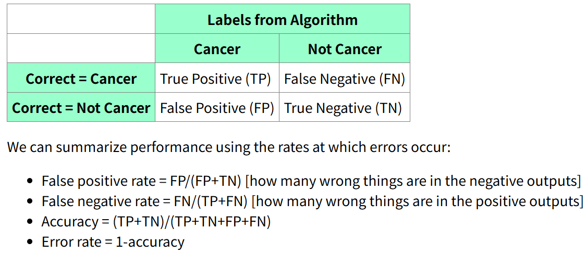
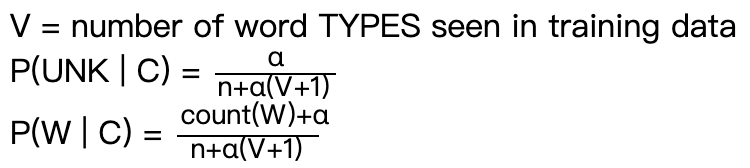
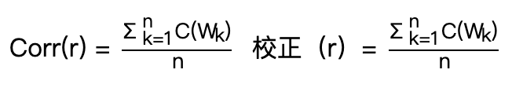

# ECE448/CS440 Artificial Intelligence

[CS 440 Artificial Intelligence](https://courses.grainger.illinois.edu/cs440/fa2025/)

https://github.com/illinois-cs-coursework

https://courses.grainger.illinois.edu/cs440/fa2025/readings.html

> [!IMPORTANT]
>
> https://courses.grainger.illinois.edu/cs440/fa2025/lectures/probability-review.html
>

## Introduction

> https://courses.grainger.illinois.edu/cs440/fa2025/lectures/intro.html

### Historical and other trivia

We've seen a lot of trivia, most of it not worth memorizing. The following items are the exceptions. Be able to explain (very briefly) what they are and (approximately) what time period they come from.

- **McCulloch and Pitts**
    - **Time Period:** 1940s
    - **Contribution:** They introduced the *first mathematical model of a neural network*. Their work was foundational, proposing that networks of simple computational units (neurons) could perform complex logical operations. These were *theoretical models on paper*, as the hardware to implement them didn't exist yet.

- **Fred Jelinek**
    -   **Time Period:** 1980s - 1990s
    -   **Contribution:** A key figure in *speech recognition*. He pioneered the use of statistical models, specifically *n-gram language models* and Hidden Markov Models (HMMs), which dramatically improved the accuracy and utility of speech recognition systems.
- **Pantel and Lin (SpamCop)**
    -   **Time Period:** Late 1990s
    -   **Contribution:** They were pioneers in using *Naive Bayes classifiers for spam detection*. Their work showed that this statistical approach was highly effective for classifying emails, forming the basis of many modern spam filters.
        -   朴素贝叶斯垃圾邮件分类器
- **Boulis and Ostendorf**
    -   **Time Period:** Mid 2000s
    -   **Contribution:** They conducted research comparing the performance of Naive Bayes versus Support Vector Machine (SVM) classifiers for gender classification based on transcribed telephone conversations.
    -   [A Quantitative Analysis of Lexical Differences Between Genders in Telephone Conversations](http://www.aclweb.org/anthology/P05-1054), ACL 2005
- **The Plato System**
    -   **Time Period:** Started in the 1960s
    -   **Contribution:** An early and influential *computer-assisted instruction system* developed at the University of Illinois. It was a precursor to modern *e-learning platforms and online communities*.
- **The Golem of Prague**
    -   **Time Period:** 16th-century Jewish folklore
    -   **Contribution:** An early myth or story related to artificial intelligence. It tells of an artificial humanoid creature created from clay to protect the Jewish community. It represents an ancient human desire to create intelligent, autonomous beings.

### Probability

> https://courses.grainger.illinois.edu/cs440/fa2025/lectures/probability-review.html

**Random variables, axioms of probability:**

-   A **random variable** is a variable whose value is a numerical outcome of a random phenomenon.
-   The **axioms of probability** (**Kolmogorov's axioms of probability** 柯尔莫哥洛夫概率公理) are fundamental rules:
    1.  The probability of any event is non-negative.
    2.  The probability of the entire sample space (a certain event) is 1.
    3.  The probability of the union of mutually exclusive events is the sum of their individual probabilities. 

$$
0 ≤P(A)\\
P(True) = 1\\
P(A|B) = P(A) + P(B), \text{if A and B are mutually exclusive events}
$$
-   **Joint, marginal, conditional probability:**
    -   **Joint Probability** 联合概率 $P(A,B)$: The probability of two events occurring together
    -   **Marginal Probability** 边际概率 $P(A)$: The probability of a single event occurring, irrespective of other events. It can be calculated by summing the joint probabilities over all outcomes of the other variable: $P(A)=∑_BP(A,B)$
    -   **Conditional Probability** 条件概率 $P(A∣B)$: The probability of event A occurring *given* that event B has already occurred. It is calculated as $P(A | B) = \frac{P(A,B)}{P(B)}$

### **Modelling Text Data**

**Word types vs. word tokens:**
-   **Tokens:** The total number of words in a document (e.g., "the cat sat on the mat" has 6 tokens). 单词总数
-   **Types:** The number of *unique* words in a document (e.g., "the cat sat on the mat" has 5 types: "the", "cat", "sat", "on", "mat"). 词典条目，唯一的单词数

**The Bag of Words model:** We can use the *individual words as features*. A bag-of-words model determines the class of a document based on the *frequency* of occurrence of each word. It ignores the order in which words occur, which ones occur together, etc. So it will miss some details, e.g. the difference between "poisonous" and "not poisonous." 忽略语法甚至词序但保持多样性

**Bigrams, ngrams:**
-   **N-grams** are contiguous sequences of *n* items (e.g., words, letters) from a given sample of text.
    -   **N-gram** 是来自给定文本样本的 *n 个*项目（例如单词、字母）的连续序列。
-   A **bigram** is a specific n-gram where n=2 (a two-word sequence). For example, in "the cat sat", the bigrams are "the cat" and "cat sat".
    -   特定的 n-gram，其中 n=2（即两个单词的序列）。例如，在“the cat sat”中，二元语法是“the cat”和“cat sat”。

**Data cleaning:**
-   **Tokenization:** The process of splitting a stream of text into words, phrases, symbols, or other meaningful elements called tokens.
    -   **标记化：** 将文本流拆分为单词、短语、符号或其他有意义的元素（称为标记）的过程。定义单词得到 a clean string of words
    -   divide at whitespace  在空白处划分
    -   normalize punctuation, html tags, capitalization, etc 规范标点符号、html 标签、大写字母等
    -   perhaps use a stemmer to remove word endings 使用词干分析器来删除单词结尾
-   **Stemming 分词:** The process of reducing inflected (or sometimes derived) words to their word stem, base or root form. **Julie Lovins** (1968) created one of the first stemming algorithms, and **Martin Porter** (1980) developed the Porter Stemmer, which is one of the most widely used.
    -   **词干提取：** 将词形变化的词简化为词干、基词或词根形式的过程。Julie Lovins 创建了最早的词干提取算法之一， Martin Porter 开发了 Porter 词干提取器，它是目前使用最广泛的算法之一。
-   **Making units of useful size:** This involves either breaking long words into smaller pieces (common in languages like German) or grouping characters into words (necessary for languages without spaces, like Chinese).
    -   将长单词分成更小的部分，特别是中文（没有空格）

**Special types of words:**
-   **Stop words:** Very common words (e.g., "the", "a", "is") that are often removed before processing because they carry little semantic weight.
    -   非常常见的词：function words, fillers, backchannel
-   **Rare words:** Words that appear very infrequently. They can be problematic for statistical models and are sometimes removed or replaced with a generic "UNK" (unknown) token.
    -   生僻词：出现频率极低的词，删除一部分或都用UNK标记（视为一个单独的项目）
-   **Hapax legomena:** Words that occur only once in a corpus. They are an extreme case of rare words.
    -   罕见词的极端情况，只出现一次
-   **Filler:** Words or sounds used to pause in a conversation (e.g., "um," "uh," "like").
    -   填充词
-   **Backchannel:** Signals from a listener that indicate they are paying attention (e.g., "uh-huh," "yeah," "I see").
    -   听众发出的信号词
-   **Function vs. content words:** *Content words* (nouns, main verbs, adjectives) carry the primary meaning. *Function words* (prepositions, articles, conjunctions) provide grammatical structure.
    -   **实词** （名词、主要动词、形容词）承载主要含义
    -   **功能词** （介词、冠词、连词）提供语法结构

### **Testing**

**Roles of training, development, test datasets:**

-   **Training set 训练集:** The data used to train the model and learn its parameters.
-   **Development set (or validation set) 验证集:** The data used to tune the model's hyperparameters and make design choices. It helps prevent overfitting to the training set. 防止过度拟合
-   **Test set 测试集:** The data held back until the very end to provide an unbiased, final evaluation of the model's performance. 保留到最后的数据，以对模型的性能提供公正的最终评估。

**Evaluation metrics for classification:**



| Confusion Matrix 混淆矩阵 | Labels from Algorithm |                     |
| ------------------------- | --------------------- | ------------------- |
| /                         | happen                | Not happen          |
| Correct = happen          | True Positive (TP)    | False Negative (FN) |
| Correct = not happen      | False Positive (FP)   | True Negative (TN)  |

- **False positive rate** = $FP/(FP+TN)$ [how many wrong things are in the negative outputs]
- **False negative rate** = $FN/(TP+FN)$ [how many wrong things are in the positive outputs]
- **Accuracy** = $(TP+TN)/(TP+TN+FP+FN)$
    - The fraction of predictions the model got righ
- **Error rate** = $1-accuracy$
- **precision (p)** = $TP/(TP+FP)$ [how many of our outputs were correct?]
- **recall (r)** = $TP/(TP+FN)$ 
    - True Positive [how many of the correct answers did we find?]
- **F1** = $2pr/(p+r)$
    - F1 is the harmonic mean of precision and recall. Both recall and precision need to be good to get a high F1 value.

-   **Confusion Matrix:** A table that visualizes the performance of a classifier, showing the counts of true positives, true negatives, false positives, and false negatives.

## Naive Bayes

>   https://courses.grainger.illinois.edu/cs440/fa2025/lectures/bayes.html

### Basic definitions and mathematical model

-   $P(A | C)$ is the probability of A in a context where C is true

    - Definition of conditional probability: $P(A | C) = \frac{P(A,C)}{P(C)}$
        - $P(A)=∑P(A|Z) p(Z,\theta)$
    - $P(A,C) = P(A) \times P(C | A) = P(C,A)=P(C) \times P(A | C)$
    - **Bayes Rule**: $P(C|A)=\frac{P(A|C)\times P(C)}{P(A)}$
        - $P(cause|evidence)=\frac{P(evidence|cause)P(cause)}{P(evidence)}$
        - posterior likelihood prior normalization

-   **Likelihood:** $P(evidence∣cause)$ 概率
-   **Prior:** $P(cause)$ 先验
-   **Posterior:** $P(cause∣evidence)$ 后验
-   **argmax operator:** Returns the input value that maximizes a function. In classification, we use it to find the class with the highest posterior probability.
    -   表示返回使函数最大化的输入值的符号，用来找到后验概率最高的类
-   **Independence vs. Conditional Independence:** Naive Bayes makes a "naive" assumption of *conditional independence* of features: features are independent of each other *given the class*. This is a stronger assumption than simple independence.
    -   **Independence** 独立性
        - Two events A and B are independent **iff** $P(A,B) = P(A) \times P(B)$
    -   **Conditional Independence** 条件独立性
        -   Definition ：$P(A, B | C) = P(A|C) \times P(B|C)$, 等价于 $P(A | B) = P(A), P(B | A) = P(B)$
    -   独立性很少成立；条件独立性是在特定的上下文中，两个变量是否独立，近似合理。
-   **MAP vs. ML estimate**
    -   **Maximum Likelihood (ML)** chooses the parameters that maximize the likelihood of the data.  概率最大化
    -   **Maximum a Posteriori (MAP)** incorporates a prior probability, choosing parameters that maximize the posterior probability. The prior acts as a regularizer. 后验概率最大化
-   **Combining evidence:** Under the conditional independence assumption, the likelihood of all evidence is simply the product of the likelihoods of each individual piece of evidence:
    -    $P(evidence_1,…,evidencen∣cause)=∏_iP(evidence_i∣cause)$.
-   **Model size:** Naive Bayes dramatically reduces the number of parameters needed compared to a full joint distribution table, making it computationally feasible and less prone to overfitting on small datasets.

### Applying Naive Bayes to text classification

-   **equations:** You estimate the prior probability of a class by its frequency in the training data, and the likelihood of a word given a class by its frequency within documents of that class.

    -   估计方程，通过训练数据中某个类别的频率来估计该类别的先验概率

-   **Avoiding underflow:** Since you are multiplying many small probabilities, the result can become too small for a computer to store (underflow). To fix this, you work with the sum of log probabilities instead: $log(A⋅B)=log(A)+log(B)$.

    -   对数防止乘以太小的数字影响准确性（计算精度），将朴素贝叶斯算法最大化

-   **Avoiding overfitting (Smoothing)** 平滑处理

    -   **Why it's important:** If a word never appears in the training data for a certain class, its probability will be zero, causing the entire posterior probability for that class to become zero. 过度拟合，0会破坏朴素贝叶斯算法

    -   **Laplace smoothing:** Adds a small constant (usually 1) to every count, ensuring no probability is ever zero.

        -   拉普拉斯平滑：

        -   $n$ = number of words in our Class C training data
            $count(W)$ = number of times W appeared in Class C training data

            $\alpha$: a constant positive number
            $V$ = number of word **types** seen in training data

    -   **Deleted estimation 删除估计:** A cross-validation technique used to find optimal smoothing parameters.

        -   对于每个观测到的计数 r，我们将计算一个校正后的计数 $Corr(r)$。假设 $W1,...,Wn$是在数据集前半部分出现 r 次的单词。对于此集合中的每个单词 $W_k$，求出它在数据集后半部分出现的计数 $C(W_k)$ 。我们将这些计数取平均值，得到校正后的计数：
        -   Corr(r) 预测训练数据中出现 r 次的单词的未来计数
        -   删除估计已被证明比拉普拉斯平滑更准确
        
    -   **N-gram smoothing:** Refers to more advanced techniques (like Good-Turing, Kneser-Ney) used for n-gram models to handle unseen n-grams by redistributing probability mass from seen n-grams. The high-level idea is to "borrow" probability from more frequent events to assign to rare or unseen events.
    
        -   对于一元模型，我们需要估计 n 个概率，而对于二元模型，我们需要估计 $n^2$ 个概率，但我们仍然拥有相同的 m 个单词作为训练数据
        -   Idea 1: If we haven't seen an ngram, guess its probability from the probabilites of its *prefix* (e.g. "the angry") and the *last word* ("armadillo").
        -   Idea 2: Guess that an unseen word is more likely in contexts where we've seen many different words.

----

## Search

Search is the process of finding a sequence of actions (a **path**) to get from a starting point to a goal.

### Example tasks

-   **Roadmap Search:** Finding the best route from Champaign to Chicago on Google Maps.
-   **Maze Search:** Finding a path from the entrance to the exit of a maze.
-   **8-Puzzle:** Sliding numbered tiles in a 3x3 grid to get them into a sorted order. Each move (sliding a tile) creates a new state.
-   **Edit Distance:** Finding the minimum number of edits (insert, delete, substitute) to change one word into another, like "cat" to "car."
-   **Speech Recognition:** The AI toy from the article has to "search" through a massive library of sounds, words, and phrases to find the most probable interpretation of what a child said.
-   [Missionaries and Cannibals puzzle](https://en.wikipedia.org/wiki/Missionaries_and_cannibals_problem): A classic logic puzzle. You have 3 missionaries and 3 cannibals who need to cross a river in a boat that holds 2 people. If cannibals ever outnumber missionaries on either bank, they get eaten. The goal is to find a sequence of boat trips that gets everyone across safely.
-   **Adventure Game**: Each state in a search problem must contain all the information about the world that is relevant to defining and reaching the goal.

#### Basic search methods

-   **State Space:** The set of all possible configurations in the problem (e.g., every possible arrangement of tiles in an 8-puzzle, every possible location in a maze).
-   **Initial State:** Where you begin.
-   **Actions:** The set of possible moves you can make from a given state (e.g., slide tile up, down, left, right).
-   **Transition Model:** The rule that tells you what state you get to if you perform an action in another state. `Result(state, action) -> new_state`
-   **Goal State(s):** The state(s) you want to reach. 目标状态
-   **Path Cost:** A function that assigns a cost to a path (e.g., distance in miles, number of moves). In uniform cost search, we want the path with the **lowest cost**. In other searches, we want the **shortest path** (fewest steps).

#### Outline for search algorithms

Most search algorithms follow this general pattern:

1.  Initialize a **frontier** (a data structure like a queue or stack) with the initial state.
2.  Initialize a **visited states** set (or table) to keep track of where you've already been, to avoid loops.
3.  Loop until the frontier is empty or the goal is found: 
    1.  **Pop** a node from the frontier. 
    2.  If this node is the **goal**, you're done! You can reconstruct the path back using **backpointers** (pointers from each node to the node that discovered it). 
    3.  Mark the current node as **visited**. 
    4.  **Expand** the node: find all its neighbors (the states you can reach with one action). 
    5.  For each neighbor, if it's not in the visited set and not already in the frontier, add it to the frontier.

----

**State graph** representations 状态图

A state graph has the following key parts:

-   states (graph nodes)  状态（图节点）
-   actions (graph edges, with costs)
-   start state  起始状态
-   goal states (explicit list, or a goal condition to test) 目标状态（明确列表，或要测试的目标条件）

#### Key Search Algorithms

-   **Breadth-First Search (BFS):** Explores level by level. It finds the **shortest path** in terms of the number of steps. *从一个节点开始，首先遍历其所有邻接节点。访问完所有邻接节点后，再遍历其邻接节点*
-   **Uniform-Cost Search (UCS):** Explores by path cost. It's like BFS but always expands the node with the lowest total path cost so far. It's guaranteed to find the **cheapest path**. 从起始状态开始，我们将*访问相邻状态并选择成本最低的状态*，然后从所有未访问且与已访问状态相邻的状态中选择下一个成本最低的状态，以此方式尝试到达目标状态（注意，我们不会继续沿着目标状态继续前行）。即使到达目标状态，我们也会继续搜索其他可能的路径（如果有多个目标）。我们将维护一个*优先级队列*，该队列将从所有与已访问状态相邻的状态中，选择成本最低的下一个状态。
-   **Depth-First Search (DFS):** Dives as deep as it can down one path before backtracking. It's fast and memory-efficient but can get stuck in infinite loops and doesn't guarantee the shortest or cheapest path. 我们会逐个遍历所有相邻顶点。当遍历一个相邻顶点时，我们会完整地*遍历通过该相邻顶点可到达的所有顶点*。这类似于[深度优先树的遍历 ](https://www.geeksforgeeks.org/dsa/dfs-traversal-of-a-tree-using-recursion/)，我们首先完整地遍历左子树，然后再移至右子树。关键区别在于，与树不同，图可能包含循环（一个节点可能被访问多次）。为了避免多次处理一个节点，我们使用一个*布尔型的 visited 数组*。
-   **Iterative Deepening Search(IDS):** A hybrid. It does a DFS with a limited depth (e.g., depth 1, then depth 2, etc.). It combines the optimality of BFS with the memory efficiency of DFS. IDDFS 结合了深度优先搜索的空间效率和广度优先搜索的快速搜索（针对更接近根的节点）。IDDFS 会从一个初始值开始，针对不同的深度调用 DFS。每次调用时，DFS 都会被限制不能超出给定的深度。所以，我们基本上是*以 BFS 的方式进行 DFS 的*。

### A* Search

A* (pronounced "A-star") is the go-to search algorithm. It's a smarter version of Uniform Cost Search.

A* 搜索算法是路径查找和图形遍历中使用的最好和最流行的技术之一。

A* balances the cost to get to a node with an *estimate* of the cost to get from that node to the goal. It evaluates nodes using the formula:

$f(n)=g(n)+h(n)$

-   $g(n)$ = the **actual cost** of the path from the start node to node n. 实际成本
-   $h(n)$ = the **heuristic** (estimated) cost from node n to the goal. 启发式成本

#### Heuristics

A heuristic is a "rule of thumb" or an educated guess.

-   **Manhattan vs. Straight-Line Distance:**
    -   **Straight-Line (Euclidean) Distance 欧几里得距离:** The "as the crow flies" distance. This is a good heuristic for finding a driving route.
    -   **Manhattan Distance 曼哈顿距离:** The distance if you can only move on a grid (like the streets of Manhattan). You sum the absolute differences of the x and y coordinates: $∣x_1−x_2∣+∣y_1−y_2∣$. This is a perfect heuristic for the 8-puzzle.
-   **Admissible and Consistent Heuristics:**
    -   **Admissible 可接受:** An admissible heuristic **never overestimates** the true cost. It's always optimistic. `h(n) <= true_cost`. Straight-line distance is admissible because you can never get somewhere faster than a straight line. A* is **guaranteed to find the optimal path** if its heuristic is admissible.
    -   **Consistent 一致性:** A stronger property. A heuristic is consistent if, for any node n and its successor n′, the estimated cost from n is less than or equal to the cost of stepping to n′ plus the estimated cost from n′. This basically means the heuristic gets more accurate as you get closer to the goal. `h(n) <= cost(n, n') + h(n')`. *All consistent heuristics are also admissible*. Consistency is useful because it guarantees that when A* selects a node to expand, it has already found the optimal path to that node.
-   **What is a good heuristic?** A good heuristic is as close to the true cost as possible without ever going over. A heuristic $h_2(n)$ is **better** than $h_1(n)$ if $h_2(n)>h_1(n)$ for all nodes, because it provides more information and helps A* explore more directly towards the goal, reducing the number of nodes it needs to check.

>   [!NOTE]
>
>   In practice, **admissible heuristics are typically consistent**. For example, the straight-line distance is consistent because of the triangle inequality. Uniform cost search is A∗ with a heuristic function that always returns zero. That heuristic is consistent. However, if you are writing general-purpose search code, it's best to use a method that will still work if the heuristic isn't consistent, such as pushing a duplicate copy of the state onto the queue.
>
>   Admissibility guarantees that the output solution is optimal. Here's a sketch of the proof:
>   可接纳性保证了输出解是最优的。以下是证明的概要：
>
>   Search stops when the goal state becomes the top option in the frontier (not when the goal is first discovered). Suppose we have found a goal with path P and cost C. Consider a partial path X in the frontier. Its estimated cost (heuristic cost) must be ≥C. Since our heuristic is admissible, the true cost of extending X to reach the goal must also be ≥C. So extending X can't give us a better path than P.
>   当目标状态成为边界中的最优选项时（而不是目标首次被发现时），搜索停止。假设我们已经找到了路径为 P、成本为 C 的目标。考虑边界中的部分路径 X。它的估计成本h必定为 ≥C 。由于我们的启发式方法可行，因此扩展 X 以达到目标的真实成本也必定为 ≥C 。因此，扩展 X 不可能提供比 P 更好的路径。

#### Suboptimal Search 次优搜索

-   **Non-admissible heuristics:** Sometimes you don't need the *best* path, you just need a *good enough* path, fast. Using a non-admissible (overestimating) heuristic can make A* run much faster, but it forfeits the guarantee of finding the optimal path.
-   **Beam Search 集束搜索:** A memory-optimized version of search. At each level of the search tree, it only keeps the best `k` nodes (the "beam width"). It's fast but can easily miss the optimal solution if it falls outside the beam.

### Details for Each Algorithm

| Algorithm | Frontier Management                                          | Loop Prevention                                      | When a shorter path is found...                              | Termination                      | When to use                                                  |
| --------- | ------------------------------------------------------------ | ---------------------------------------------------- | ------------------------------------------------------------ | -------------------------------- | ------------------------------------------------------------ |
| **BFS**   | **FIFO Queue**. Explores the oldest nodes first.             | Uses a **visited set**. Won't re-add a visited node. | The first time a node is found is guaranteed to be the shortest path to it. | Finds goal or frontier is empty. | When you need the **shortest path** (i.e., the fewest steps), and step costs are uniform. |
| **DFS**   | **LIFO Stack** (or recursion). Explores the newest nodes first. | Uses a **visited set**.                              | Can find a suboptimal path first. Needs modification to update. | Finds goal or frontier is empty. | When memory is tight, you think the solution is deep, and optimality isn't required. |
| **UCS**   | **Priority Queue** ordered by path cost $g(n)$.              | Uses a **visited set**.                              | If it finds a shorter path to a node already in the frontier, it **updates the path cost** of that node. | Finds goal or frontier is empty. | When you need the **cheapest path**, and step costs are not uniform. |
| **A\***   | **Priority Queue** ordered by $f(n)=g(n)+h(n)$               | Uses a **visited set**.                              | Same as *UCS*: if it finds a shorter path to a node in the frontier, it **updates its cost**. | Finds goal or frontier is empty. | When you need the **cheapest path** and have a good heuristic to speed things up. It's usually the best choice. |

### More Search

**Iterative deepening A∗**: Like iterative deepening, but using A∗ rather than DFS. If the current bound is k, the search stops when the estimated total cost f(s) is larger than k. 类似于迭代加深，但使用 A∗ 而不是 DFS。如果当前边界为 k，则当估计总成本 f(s) 大于 k 时，搜索停止。

**Pattern databases 模式数据库**: A pattern database is a database of partial problems, together with the cost to solve the partial problem. The true solution cost for a search state must be at least as high as the cost for any pattern it contains. 模式数据库是包含部分问题及其求解成本的数据库。搜索状态的真实求解成本必须至少与其包含的任何模式的求解成本相同。

**Backwards and bidirectional search 向后搜索和双向搜索** : Basically what they sound like. Backwards search is like forwards search except that you start from the goal. In bidirectional search, you run two parallel searches, starting from start and goal states, in hopes that they will connect at a shared state. These approaches are useful only in very specific situations. 顾名思义，向后搜索类似于向前搜索，只不过是从目标开始。双向搜索则运行两个并行搜索，分别从起始状态和目标状态开始，希望它们能够在一个共享状态下连接起来。这些方法仅在非常特殊的情况下有用。

-   Backwards search makes sense when you have relatively few goal states, known at the start. This often fails, e.g. chess has a huge number of winning board configurations. Also, actions must be easy to run backwards (often true).
    当目标状态相对较少且一开始已知时，反向搜索是有意义的。但这通常会失败，例如国际象棋中存在大量的制胜棋盘配置。此外，动作必须易于反向执行（通常如此）。

-   Example: James Bond is driving his Lexus in central Boston and wants to get to Dr. Evil's lair in Hawley, MA (population 337). There's a vast number of ways to get out of Boston but only one road of significant size going through Hawley. In that situation, working backwards from the goal might be much better than working forwards from the starting state.
    例如：詹姆斯·邦德驾驶着他的雷克萨斯在波士顿市中心行驶，想要前往位于马萨诸塞州霍利（人口 337）的邪恶博士老巢。离开波士顿的方法有很多，但只有一条相当长的道路穿过霍利。在这种情况下，从目标位置倒推可能比从起始位置正推要好得多。

## Robotics and Configuration Space

### History

Shakey and Blocks world (1966-72)

-   Shakey was the **first mobile robot to reason about its own actions**. It lived in a controlled environment called "Blocks World," which was just a room with several large blocks. Shakey could be given commands like "push the block from Room A to Room B." To do this, it had to perceive its environment, break the problem down into smaller steps (e.g., *find the block, move to the block, push it, navigate doorways*), and execute them. It was a landmark project in robotics, planning, and computer vision.

-   Boston Dynamics(Founded 1992, prominent from 2005-present)
    -   famous for creating incredibly agile and dynamic robots like **BigDog**, **Atlas** (the humanoid one that does parkour), and **Spot** (the dog-like one)
    -   Legged robots (Marc Raibert and Boston Dynamics): [early ones](https://www.youtube.com/watch?v=Bd5iEke6UlE) and [newish humanoid one](https://www.youtube.com/watch?v=vjSohj-Iclc) (audio is mechanical noises)
-   Google self-driving bike(April 1, 2016) 
    -   Fake: highlights the gap between public perception and actual AI capabilities.
-   [Coning a self-driving car](https://www.youtube.com/watch?v=8MfyIsPWhTk) (2023-Present)
    -   an **adversarial attack** on an AI system

Motion planning is a type of search problem, but for physical objects.

-   **Configuration Space 配置空间 (C-Space):** An abstract space where each *point* represents a complete specification of the robot's position and orientation. The goal is to transform a motion problem with a complex robot and obstacles into a path-finding problem for a single point in C-space.
    -   **Circular Robot:** If a circular robot is moving among obstacles, its C-space is found by "growing" the obstacles by the robot's radius. The robot itself can then be treated as a point.
    -   **N-Link Arm N 连杆机械臂:** For a robotic arm with N joints, the C-space is N-dimensional. For a 2-link arm, the configuration is defined by two angles (θ1,θ2), so its C-space can be visualized as a 2D square.
    -   **Rectangular Robot:** If it can't rotate, its C-space is just like the circular robot's. If it *can* rotate, you add another dimension for its orientation, making the C-space 3D $(x,y,θ)$.

### General Knowledge

-   **Types of Robots:** Arms (industrial robots), mobile carts (like in a warehouse), snakes (for pipe inspection), humanoids (like Atlas).
-   **Links, Joints, Degrees of Freedom (DOF):** Links are the rigid parts of a robot, and joints connect them. **DOF 自由度** is the number of independent parameters you need to define the robot's configuration (e.g., a 3-link arm moving in a 2D plane has 3 DOF; an object moving in 3D has 6 degrees of freedom: (x,y,z) position and three ways to change its orientation (roll, pitch, yaw)).
-   **Ideal Robot Path:** The best path is not just **short**, but also **safe** (far from obstacles) and **smooth** (no jerky movements).
-   **Graph-Based Planning:** Methods to simplify the world into a graph that can be searched.
    -   **Visibility Graphs 可见性图表:** Nodes are the start, goal, and corners of obstacles. Edges connect nodes that have a line of sight. Guarantees the shortest path.
        -   It produces paths of minimal length. However, these paths aren't very safe because they skim the edges of obstacles. It's risky to get too close to obstacles. 
    -   **Skeletonization 骨架化**
        -   **Roadmap** converts freespace into a skeleton that goes through the middle of regions. Paths via the skeleton stay far from obstacles, so they tend to be safe but perhaps overly long.
        -   **Generalized Voronoi diagrams** places the skeleton along curves that are equidistant from two or more obstacles. The waypoints are the places where these curves intersect.
    -   **Cell Decompositions 单元分解:** The free space is divided into simple cells. A path is found by searching for a sequence of adjacent cells.
    -   **Probabilistic Roadmaps 概率路线图 (PRM):** Random points are scattered in the free space and connected if a simple path exists between them. Great for high-dimensional C-spaces.
-   **Challenges:**
    -   **Big Open Areas:** Can be computationally expensive because there are so many possible paths.
    -   **Narrow Passages:** These are "bottlenecks" that are hard for planners (especially random ones like PRM) to find.
    -   **High DOF:** As the degrees of freedom increase, the volume of the C-space explodes (the "curse of dimensionality"), making it exponentially harder to search.


## Natural Language

### Natural Language and HMM History

This section covers key people, systems, and algorithms that were milestones in the history of Natural Language Processing (NLP) and related fields.

-   **Julie Lovins (1968):** An American linguist who developed one of the earliest *stemming algorithms* 词干提取算法, the Lovins Stemmer. Stemming is the process of reducing a word to its root or base form (e.g., "connecting," "connected" -> "connect").
-   **SHRDLU (1970):** An early *NLP program* created by Terry Winograd at MIT. It operated in a simulated "blocks world" and could understand and execute commands in natural English like "pick up the big red block and put it on the green one." It was a landmark example of "deep" understanding within a very limited domain.
-   **Zork transcript (late 1970s):** A classic *text-based adventure game*. It was notable for its relatively sophisticated text parser that could understand more complex commands than its contemporaries, making the game feel more interactive and intelligent.
-   **Pattern Playback (1950s):** A device developed at Haskins Laboratories that *converted visual patterns of speech (spectrograms) back into sound* 将声谱图转换回声音. It was crucial for discovering the acoustic cues that humans use to perceive speech sounds.
-   **John Kelly and Louis Gerstman (1961):** Researchers at Bell Labs who programmed an IBM 704 computer to *synthesize speech* 合成语音. They famously made it sing the song "Daisy Bell," which later inspired the iconic scene in *2001: A Space Odyssey*.
-   **Parsey McParseface (2016):** *An open-source English language parser* 开源英语语言解释器 released by Google. It was noteworthy for its high accuracy, achieved using a deep learning model (SyntaxNet).
-   **Baum-Welch algorithm (c. 1970):** An algorithm used to **train** a Hidden Markov Model (HMM). It's an unsupervised learning algorithm, meaning it can determine the transition and emission probabilities of an HMM when you only have the observed sequences (e.g., words) but not the hidden states (e.g., POS tags). It's a specific instance of the Expectation-Maximization (EM) algorithm. 训练HMM的算法
-   **Viterbi algorithm (1967):** A dynamic programming algorithm used for **decoding** in an HMM. 在HMM中进行解码的动态规划算法. Given a sequence of observations (like words), it finds the single **most likely** sequence of hidden states (like POS tags) that could have produced them. 
-   **GPT-3 (2020):** A massive language model developed by OpenAI. As a transformer-based model with 175 billion parameters, it demonstrated a remarkable ability to generate fluent, human-like text and perform a wide variety of NLP tasks with little to no specific training ("few-shot" learning).
-   **ILEX system (late 1990s):** *An intelligent labeling system for a museum* 博物馆的智能标签系统. It generated dynamic descriptions of exhibits (in this case, jewelry) that were tailored to the individual user, taking into account what they had already seen to provide context and comparisons.

### Outline

The area of natural language and speech processing covers algorithms for three types of tasks: 

-   convert text/speech into structured information usable by an AI reasoning system
    将文本/语音转换为人工智能推理系统可用的结构化信息
-   generate fluent text/speech from structured information
    从结构化信息生成流畅的文本/语音
-   translate directly between two types of text/speech (e.g. between two languages, simple types of question answering)
    直接在两种类型的文本/语音之间进行翻译（例如两种语言之间、简单类型的问答）

Natural language processing has roughly four layers 自然语言处理大致有四层：

-   Semantics (meaning, dialog structure) 语义（含义、对话结构）
-   Mid-level processing (e.g. part of speech, parsing) 中级处理（例如词性、解析）
-   Low-level text processing (e.g. forming words, finding morphemes) 低级文本处理（例如，形成单词、查找词素）
-   Speech  演讲

### Types of systems

-   **Sample tasks 自然语言处理的任务:** Common goals in NLP include:
    
    -   **Translation:** Converting text from one language to another.
    -   **Question Answering:** Providing a direct answer to a question posed in natural language.
    -   **Summarization:** Creating a short, coherent summary of a longer text.
    -   **Sentiment Analysis:** Determining the emotional tone (positive, negative, neutral) of a piece of text.
    -   **Information Extraction:** Pulling structured information from unstructured text (e.g., finding dates, names, and locations in a news article).
    
-   **Deep vs. shallow:** This describes the level of linguistic understanding a system aims for.
    -   **Shallow Systems 浅层:** Operate on surface-level text features. They use statistics, pattern matching (like regular expressions), and simple rules without building a full representation of meaning.
        -   *Examples:* Keyword-based search engines, spam filters looking for specific phrases, most sentiment analysis tools, spelling correction.
    -   **Deep Systems 深层:** Attempt to understand the syntactic and semantic structure（句法和语义结构） of the language. They build an internal representation of meaning to perform their task.
        -   *Examples:* SHRDLU (in its limited world), advanced question-answering systems, modern LLMs like GPT-3.
    
-   **Danger of seeming too fluent and the "uncanny valley" 恐怖谷效应:** The uncanny valley is a phenomenon where a system that is *almost* perfectly human-like is perceived as eerie or unsettling. A chatbot that is 99% fluent but makes one bizarre logical error can be more disturbing than a simple, obviously robotic bot because it violates our expectations of a seemingly intelligent agent.

    恐怖谷效应是指一个几乎完美模仿人类的系统，却会让人感觉怪异或不安。一个聊天机器人即使能达到 99% 的流利程度，却犯了一个奇怪的逻辑错误，可能比一个简单、明显是机器人的机器人更令人不安，因为它违背了我们对看似智能的代理的预期。


### Processing pipeline

A classic test is a **circular translation**: X to Y and then back to X. 

This is a typical sequence of steps to process raw text.

1.  **Speech:** Raw audio is processed to understand its components.
    -   **Waveform 波形:** The raw audio signal, representing air pressure changes over time.
    -   **Spectrogram 声谱图:** A visual representation showing the intensity of different frequencies in the sound over time. It's how we "see" sound.
    -   **Formants 共振峰:** The resonant frequency peaks in the spectrogram, which are characteristic of vowel 元音 sounds. They are the key acoustic features that let us distinguish 'ee' from 'oo'.
    -   **Phones 音素:** The smallest distinct units of sound in a language (e.g., the sounds [b], [æ], [t] in "bat").
    -   **Synthesis 合成:** Creating artificial speech. **Formant synthesis** generates sounds electronically based on formant frequencies, while **concatenative synthesis** stitches together pre-recorded snippets of human speech.
2.  **Dividing into words (Tokenization):** Splitting a stream of text into individual words or tokens.
3.  **Normalizing words (Stemming/Lemmatization):** Reducing words to their base form (e.g., "running" -> "run").
4.  **Finding morphemes 词素:** Breaking words into their smallest meaningful units (e.g., `un-systematic-ally`).
    -   Morpheme: smallest meaningful chunk
5.  **Part of speech (POS) tagging:** Assigning a grammatical category (noun, verb, etc.) to each word.
6.  **Parsing:** Analyzing the grammatical structure of a sentence.
    -   **Constituency 选区 vs. dependency trees:** Two ways to represent sentence structure.
        -   A **constituency tree** breaks a sentence down into nested phrases (Noun Phrase, Verb Phrase).
        -   A **dependency tree** shows how words are related to each other through directed links (e.g., an adjective modifying a noun, a subject related to a verb).
    -   **Shallow parsers 浅层解析器 (Chunking):** These parsers don't build a full, detailed tree. Instead, they just identify the main, non-nested phrases (chunks) like noun phrases and verb phrases.
    -   **Unlexicalized, class-based, Lexicalized:** These refer to the information used by a statistical parser. **Unlexicalized** parsers use only POS tags. **Class-based** parsers use semantic classes (e.g., "city," "person"). **Lexicalized** parsers use rules tied to specific words, making them more powerful but data-hungry.
7.  **Semantics:** Understanding the meaning of the text.
    -   **Shallow semantics 浅层语义:** Extracting limited, specific meaning without full understanding.
        -   word classes 词类
        -   word sense disambiguation 词义消歧
        -   semantic role labelling: we know that a noun phrase X relates to a verb Y. Is X the subject/actor? the object that the action was done to? a tool used to help with the action?
        -   co-reference resolution (see below)
    -   **Sentiment analysis:** Identifying positive/negative opinions.
    -   **Semantic Role Labeling (SRL) 语义角色标记:** Figuring out "who did what to whom" (e.g., identifying the agent, patient, and instrument of an action).
    -   **Co-reference resolution 指代相同:** Determining which words refer to the same entity (e.g., in "Sue said **she** was tired," resolving "**she**" to "Sue").
    -   **Dialog coherency:** Analyzing how well sentences in a conversation logically follow one another.

### POS Tagging

Part-of-Speech tagging 词性标注 is a fundamental NLP task.

-   **Common POS tags 标签集:** You should be familiar with the basics like **Noun** (NN), **Proper Noun** (NNP), **Verb** (VB), **Adjective** (JJ), **Determiner** (DT, e.g., "the", "a"), and **Preposition** (IN).
-   **Size of typical POS tag sets:** Tag sets vary. Simple ones might have ~12-15 universal tags, while more detailed ones like the **Penn Treebank tag set** (very common in English NLP) have around 45 tags.
-   **Single word with multiple possible tags:** Many words are ambiguous. For example, "book" can be a noun ("read the book") or a verb ("book a flight"). The context determines the correct tag.
-   **Baseline tagging algorithm 基线算法:** The simplest possible method with an acuuracy about 91%. For each word in the test set, assign it the tag that it was most frequently associated with in the training data. For a word that was never seen in training, you might just default to the most common tag overall (like Noun).

## HMMs

**Hidden Markov Models(隐马尔可夫模型)** are a statistical tool perfect for sequence labeling tasks like POS tagging. 类似贝叶斯网络

$W$ is the imput word sequence and $T$ is an input tag sequence.

**Goal**: maximize $P(T|W)$

-   **Markov assumptions:** An HMM is based on two simplifying assumptions:

    1.  **Transition Assumption 转移:** The probability of the current state (tag) depends **only on the previous state** (tag). $P(t_i∣t_{i−1},t_{i−2},...,t_1)≈P(t_i∣t_{i−1})$.
    2.  **Emission Assumption 排放:** The probability of the current observation (word) depends **only on the current state** (tag). $P(w_i∣w_1,t_1,...,w_{i−1},t_{i−1},t_i)≈P(w_i∣t_i)$.

-   **Graphical model picture:** An HMM has a sequence of hidden states (tags) on top and a sequence of observed states (words) on the bottom. There are **transition** arrows between adjacent hidden states and **emission** arrows from each hidden state down to its corresponding observed state.

-   **Component probabilities:**

    -   **Initial:** $P(t_1)$ - The probability that a sentence starts with a certain tag.
    -   **Emission:** $P(w_i∣t_i)$ - The probability of seeing word $w_i$ given that its tag is $t_i$.
    -   **Transition:** $P(t_i∣t_{i−1})$ - The probability that tag $t_i$ will follow tag $t_{i−1}$.

-   Equations for computing probability: The probability of a given word sequence W and a given tag sequence T is calculated by multiplying all the relevant probabilities together:
    $$
    P(W,T)=∏_{i=1}^{n}P(w_i∣t_i)\\
    P(T)=P(t_1|START)∗∏_{i=1}^{n}P(t_k∣t_{k−1})\\
    \text{where } P(t_1|START)\text{ is the probability of tag t1 at the start of a sentence.}
    $$

-   Bayes: $P(T | W) =P(W∣T)∗P(T)/P(W)$, then 
    $$
    P(T∣W)∝P(W∣T)\times P(T)\\
    =∏_{i=1}^nP(w_i∣t_i) \times P(t_1∣START) ∗ ∏_{k=2}^nP(t_k∣t_{k−1})
    $$
    
-   **Tag transition as a finite-state automaton(FSA) 有限状态机:** You can view the tags as states in an automaton. 每条弧上的数字表发生转换发生的概率
    The transition probabilities $P(t_i∣t_{i−1})$ are the probabilities on the arcs connecting the states.

-   **When does an HMM need smoothing 光滑?** Smoothing is required whenever you encounter a **zero-count event** in your training data. This happens for:

    -   **Emission probabilities:** A word that appeared in training is seen with a new, valid tag in the test data. $P_E(w_i|t_i)$ 排放概率
    -   **Transition probabilities**: A sequence of two tags that is possible but never occurred in the training data. $P_T(t_k|t_{k−1})$ 转移概率
        -   Without smoothing (like Add-1 smoothing), these events would be assigned a probability of 0, making the entire sequence probability 0. 防止概率为0
    -   It's essential to smooth, i.e. reserve some of each tag's probability for new words and familiar words seen with a new tag

-   **Estimating probability of unseen phenomena:**

    -   **Unseen words:** Words that were not in the training data at all. A common technique is to replace all rare words (e.g., **hapax** words that appear only once) in the training data with a special `<UNK>` (unknown) token. You can then learn emission probabilities for `<UNK>`, which you apply to any new word you encounter.
    -   **Open-class 实词 vs. closed-class 功能词 words:** This helps with unknown words. **Closed-class** words (like determiners, prepositions) form a fixed set. An unknown word is very unlikely to be one of these. **Open-class** words (nouns, verbs, adjectives) frequently get new members. Therefore, an unknown word is most likely an open-class word, often a proper noun.

### Viterbi (trellis 棚架) decoding algorithm 维特比算法

This is the workhorse algorithm for finding the best tag sequence in an HMM.

The basic data structure is an n by m array (v), where n is the length of the input word sequence and m is the number of different (unique) tags. Each cell (k,t) in the array contains the probability v(k,t) of the best sequence of tags for w1…wk that ends with tag t. We also store b(k,t), which is the previous tag in that best sequence. This data structure is called a "trellis."

基本数据结构是一个 $n \times m$ 的数组 (v)，其中 n 是输入词序列的长度，m 是不同（唯一）标签的数量。数组中的每个单元格 (k,t) 包含 w1…wk 中以标签 t 结尾的最佳标签序列的概率 v(k,t)。我们还存储了 b(k,t)，它是该最佳序列中的前一个标签。这种数据结构称为“网格”。

A path ending in some specific tag at time k might continue to any one of the possible tags at time k+1. So each cell in column k is connected to all cells in column k+1. The name "trellis" comes from this dense pattern of connections between each timestep and the next.
在时间 k 处以某个特定标签结尾的路径，可能会在时间 k+1 处延伸至任意一个可能的标签。因此，第 k 列中的每个单元格都与第 k+1 列中的所有单元格相连。“网格”这一名称源于每个时间步与下一个时间步之间这种密集的连接模式。

-   **Building the trellis:** The trellis is a chart where columns represent the words in the sentence and rows represent all possible tags.
    1.  **Initialization (First Column):** For the first word, each cell (tag) is filled with $v(1,t) = P_S(tag_1)×P_E(word_1∣tag_1)$.
    
    2.  **Recursion (Subsequent Columns):** To calculate the value for a cell at word `i` and tag `j`, you look at all the cells in the previous column (`i-1`). For each previous tag `k`, you calculate the probability of the path coming from it: `prev_prob(k) * transition_prob(k -> j) * emission_prob(word_i | tag_j)`.
    
        For each tag tagB,
        $$
        v(k+1,tagB)=max_{tag_A} v(k,tagA)∗P_T(tagB∣tagA)∗P_E(w_{k+1}∣tagB)\\
        b(k+1,tagB)=argmax_{tag_A} v(k,tagA)∗P_T(tagB∣tagA)∗P_E(w_{k+1}∣tagB)
        $$
        也就是说，我们为所有可能的标签 tagA 计算 v(k,tagA)∗PT(tagB∣tagA)∗PE(wk+1∣tagB) 。最大值存入网格单元 v(k+1,tagB) ，而 tagA 的对应值则存储在 b(k+1,tagB) 中。
    
    3.  The value for the cell `(i, j)` is the **maximum** of these calculated path probabilities. You also store a **backpointer** indicating which previous cell (`k`) gave you this maximum value.
        当我们填满整个网格后，在最后一列（时间=n）中选取最佳标签（v 值最高）T。使用 b 中的值，从 T 反向追溯，生成输出标签序列。
    
-   **Extracting the output:** After filling the whole trellis, find the cell with the highest probability in the very last column. This is the end of the most likely path. Then, follow the backpointers from that cell backward to the beginning of the sentence to reconstruct the most probable sequence of tags.

-   **Big-O running time:** If you have T words and N possible tags, the complexity is $O(T×N^2)$. For each word (T), you calculate values for each tag (N), and each of those calculations involves looking at all previous tags (N).

-   **Extensions:**
    -   **Bigram:** The standard HMM uses a bigram model for tags $P(t_i∣t_{i−1})$. You can extend this to a **trigram** model $P(t_i∣t_{i−2},t_{i−1})$ for more accuracy, but this squares the number of states (from N to $N^2$) and increases runtime to $O(T×N^3)$.
    -   **Guessing from word form:** To handle unknown words, you can supplement the HMM with a guesser based on morphology 形态学. If an unknown word is capitalized, it's likely a Proper Noun. If it ends in "-ly," it's likely an Adverb. This significantly improves performance on real-world text.

## Computer Vision

Sampling

### Applications of Computer Vision

Computer vision can used for four basic types of tasks:

-   Obstacle avoidance
-   Classification
-   3D reconstruction
-   Image generation
-   Making predictions

## Classifiers


## Readings

### Quiz 1

#### An algorithm for suffix stripping 后缀剥离

The main goal of the paper is to introduce a simple, fast, and effective algorithm for **suffix stripping** (also known as **stemming**). This process removes common endings from words to get to their root form, or "stem."

##### Why is Stemming Important? 🤔

-   The primary use is in **Information Retrieval (IR)**, like search engines. 
-   It groups related words together. For example, **"connect," "connected," "connecting,"** and **"connection"** all get reduced to the single stem **"connect."** 
-   This **improves search results** because a search for "connecting" will also find documents that only mention "connection." 
-   It also reduces the total number of unique words a system has to store, making the system smaller and more efficient.

##### How the Algorithm Works ⚙️

The algorithm's cleverness lies in its simplicity. It doesn't use a dictionary. Instead, it uses a set of rules based on the structure of the word itself.

##### The "Measure" of a Word

The core concept is the **measure (m)** of a stem, which roughly corresponds to the number of vowel-consonant sequences it contains. 

A word is first broken down into a sequence of vowel groups (V) and consonant groups (C). The form of any word can be represented as:

```
[C](VC)^m[V]
```

-   `C`: one or more consonants
-   `V`: one or more vowels
-   `m`: the **measure**, or how many times the `(VC)` group repeats.

Here are some examples:

-   **TR, EE, TREE** →m=0
-   **TROUBLE, OATS** →m=1
-   **TROUBLES, PRIVATE** →m=2

This measure (m) is used to prevent the algorithm from stripping suffixes from words that are already very short. 10For example, it will remove `-ATE` from "ACTIVATE" (stem `ACTIV` has m>1) but not from "RELATE" (stem `REL` has m=1).

##### The 5 Steps of the Algorithm

The algorithm removes suffixes sequentially in five steps. A word goes through each step in order. 

-   **Step 1:** Deals with plurals and past participles. It changes suffixes like 

    `-SSES` to `-SS` (e.g., `caresses` → `caress`), `-IES` to `-I` (e.g., `ponies` → `poni`), and removes `-ED` or `-ING` if the stem meets certain conditions.

-   **Step 2:** Handles other common suffixes. If the stem's measure (

    m) is greater than 0, it will change suffixes like `-ATIONAL` to `-ATE` (e.g., `relational` → `relate`) or `-IZATION` to `-IZE` (e.g., `vietnamization` → `vietnamize`).

-   **Step 3:** Continues with another set of suffixes for stems where m>0. It changes 

    `-ICAL` to `-IC` (e.g., `electrical` → `electric`) or removes `-NESS` (e.g., `goodness` → `good`).

-   **Step 4:** Removes a final set of suffixes like `-ANT`, `-ENCE`, `-ER`, and `-IVE`, but only if the stem is long enough (m>1). 16161616This is the step that would turn `GENERALIZE` into `GENERAL`.

-   **Step 5:** This is a final cleanup step. It removes a trailing 

    `-E` if the measure is large enough (e.g., `probate` → `probat`) and reduces a double `L` at the end of a word (e.g., `controll` → `control`).

##### Key Takeaways ✅

-   **It's Pragmatic, Not Perfect:** The algorithm is designed for IR performance, not perfect linguistics. It will make errors, such as conflating "WAND" and "WANDER," but these errors are acceptable because the overall benefit is positive.
-   **Simple is Better:** Despite its simplicity, it performed slightly *better* in tests than a much more complex stemming system.
-   **Effective:** In a test with 10,000 words, the algorithm reduced the number of unique stems to 6,370, a reduction of about one-third.

#### The Psychological Functions of Function Words

The central argument of the paper is that **function words**—small, common words like pronouns (I, you, we), prepositions (to, for), and articles (a, the)—are powerful indicators of our psychological state, personality, and social dynamics. Because we use these words unconsciously, they provide an unfiltered look into how we think and relate to others.

##### Function Words vs. Content Words

-   **Content words** are nouns and regular verbs that carry the primary meaning or topic of what we're saying (e.g., "family," "health," "money").
-   **Function words** are the "cement" that holds language together4. They don't have much meaning on their own but show *how* we are expressing ourselves.
-   Though there are fewer than 400 function words in English, they account for over **50% of the words we use** in daily life5.
-   We have very little conscious control over or memory of using them, which makes them a great tool for psychological analysis.

##### Key Findings from Word Analysis 🧑‍🔬

The authors used a computer program called **LIWC (Linguistic Inquiry and Word Count)** to analyze millions of words from blogs, speeches, emails, and experiments7. Here are their most important findings:

1.   Depression and Self-Focus

-   A higher frequency of **first-person singular pronouns** ("I," "me," "my") is strongly linked to depression and negative emotions8. In fact, pronoun use is a better marker of depression than the use of negative emotion words like "sad" or "angry".
-   Poets who committed suicide used "I" at significantly higher rates than non-suicidal poets, suggesting greater self-focus and less social integration.

2. Reactions to Stress

-   **Individual Stress:** When facing personal crises (divorce, cancer diagnosis), Mayor Rudy Giuliani's use of "I" words shot up from about 2% to over 7%. This shows that personal distress often leads to an intense focus on the self.
-   **Shared Stress:** After the 9/11 attacks, the opposite happened. People's use of "I" words *dropped*, while their use of **first-person plural pronouns** ("we," "us") increased. This suggests that a shared tragedy causes people to focus less on themselves and more on their community and social connections.

3. Honesty and Deception

-   When people are **telling the truth**, they tend to use more **first-person singular pronouns** ("I") and more **exclusive words** (e.g., "but," "except," "without").
-   This suggests that truthful accounts are more personal and cognitively complex, while lies are simpler and more detached.

4. Social Status

-   In a conversation, the person with **higher status** consistently uses **fewer "I" words**.
-   For example, in his conversations, President Nixon used "I" far less when speaking to his subordinates John Dean and John Erlichman than they did when speaking to him16. The lower-status person focuses on their own perspective, while the higher-status person focuses on the broader picture.

5. Demographics (Sex and Age)

-   **Sex:** Females tend to use "I" words more than males. Males use more articles ("a," "the") and nouns, which is associated with concrete, categorical thinking18. Females use more verbs, which reflects a more relational focus.
-   **Age:** As people get older, they use "I" less and "we" more20. They also use more future-tense verbs and fewer past-tense verbs, suggesting their focus shifts over the lifespan.

6. Culture

-   Counterintuitively, translated Japanese texts used "I" *more* than American texts. The authors suggest this may be because collectivist values (like harmony and self-criticism) require a high degree of self-focus.
-   American texts used more articles ("a," "the"), which supports the idea that Western thought is more categorical.

##### Conclusion: Words as Reflections

The way we use function words is a **reflection** of our underlying psychological state, not a cause of it25. The authors tried to change people's feelings by forcing them to use different pronouns in experiments, but it didn't work26. This means you can't just say "we" more to feel more connected; rather, feeling connected causes you to naturally say "we" more.

In short, these tiny "junk words" are a window into our minds, revealing everything from our emotional state and social status to how honest we're being.

### Quiz 2

#### "Banned In Germany, Kids' Doll Is Labeled An 'Espionage Device'" (NPR)ew

This article discusses the "My Friend Cayla" doll, which was banned by German regulators. The key issues were:

-   **Espionage 间谍Concerns:** The doll was classified as an "illegal espionage apparatus" because its insecure Bluetooth connection allowed anyone within range to potentially listen in on and even speak to the child playing with it.
-   **Data Privacy:** The doll recorded children's conversations and sent them to a U.S.-based company that specializes in voice recognition. This was done without clear disclosure or parental consent, raising significant privacy concerns.
-   **Hidden Marketing:** The doll was pre-programmed with phrases that endorsed Disney products, essentially acting as a hidden marketing tool aimed at children.
-   **Lack of Security:** The fundamental design of the toy lacked basic security measures, making it vulnerable to hacking and unauthorized access.

#### "‘I love you too!’ My family’s creepy, unsettling week with an AI toy" (The Guardian)

This article provides a more recent, personal perspective on living with a modern AI-powered toy. The important points include:

-   **Emotional Attachment:** The child in the article quickly formed a strong emotional bond with the AI toy, "Grem," telling it "I love you" and treating it as a constant companion. The toy's reciprocal and effusive declarations of love were unsettling for the parents.
-   **Constant Surveillance:** The toy is "always listening" unless manually turned off, creating a sense of constant surveillance within the home and raising privacy concerns for the family.
-   **Influence on Behavior:** The article touches on how the AI toy's personality—designed to be agreeable and complimentary—could potentially shape a child's expectations and interactions in the real world.
-   **The Digital Divide and Developmental Impact:** The author and other experts raise broader questions about the impact of such toys on child development, social skills, and the disparity between children who have access to these "educational" AI companions and those who do not.

In summary, both articles highlight the potential dangers and ethical dilemmas presented by internet-connected and AI-powered toys, ranging from concrete security and privacy violations to more subtle concerns about their impact on children's emotional development and family life.


### Quiz 3

#### Summary of "Automatic Labeling of Semantic Roles"

This paper presents a statistical system for automatically identifying and labeling semantic roles of sentence constituents within a semantic frame. 🧠

**Key Points:**

-   The system is trained on the **FrameNet database**, which contains roughly **50,000 hand-labeled sentences**.
-   The task is broken down into two subtasks: identifying the boundaries of frame elements and then labeling them with the correct semantic role.
-   The system uses various features derived from parse trees, including **phrase type**, **grammatical function**, **position**, **voice**, and **head word**.
-   The final system achieved an accuracy of **80.4%** on the development set and **76.9%** on the test set, a significant improvement over the **40.9%** baseline.
-   **Lexical statistics** based on head words were found to be the most important feature. The distribution P(r|h,t) was correct in **86.7%** of the cases where data was available, which was for **56.0%** of the data.
-   When automatically identifying frame element boundaries, the system correctly identified constituents with **exactly matching boundaries 66%** of the time.


#### Summary of "Open source AI models show gender bias in hiring"

A recent study reveals that open-source AI models exhibit gender bias in job recommendations, particularly for high-paying positions. This highlights the ongoing challenge of bias in AI as it becomes more integrated into hiring processes. 🤖

**Key Points:**

-   Researchers analyzed several mid-sized open-source large language models (LLMs) for gender bias using a dataset of **332,044 real job ads**.
-   There was significant variation in callback recommendations across different models, with female callback rates ranging from as low as **1.4%** for Ministral to as high as **87.3%** for Gemma.
-   The most balanced model was **Llama-3.1**, with a female callback rate of **41%**, and it was also the most likely to refuse to consider gender, doing so in **6%** of cases.
-   When models were adjusted for callback parity, jobs with female callbacks tended to have lower pay. The wage gap varied from approximately **9 log points** for Granite and Llama-3.1 to about **84 log points** for Ministral.
-   Interestingly, the **Llama-3** model showed a wage premium for women of about **15 log points**.
-   Simulating historical figures as "personas" influenced the models' outputs. For example, using women's rights advocates like Mary Wollstonecraft and Margaret Sanger resulted in female callback rates exceeding **95%**.


