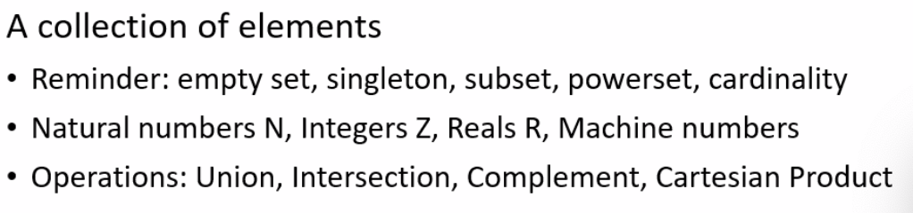
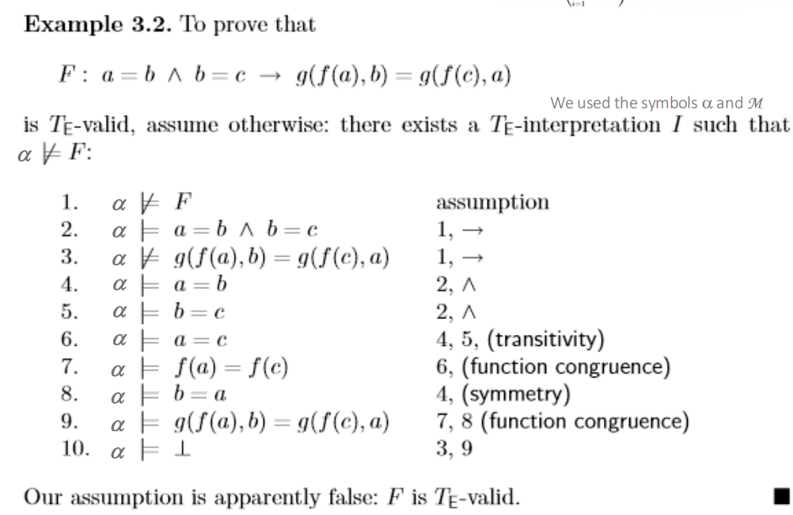

# Formal Software Development Methods


[Rice's theorem](https://en.wikipedia.org/wiki/Rice's_theorem) states that **no algorithm can determine all non-trivial properties about the language recognized by a Turing machine** **(or any [Turing-complete program](https://www.google.com/search?q=Turing-complete+program&rlz=1C5BAPC_enUS1177US1177&oq=rice+ther&gs_lcrp=EgZjaHJvbWUqCwgBEAAYChgLGIAEMgYIABBFGDkyCwgBEAAYChgLGIAEMhEIAhAuGAoYCxivARjHARiABDIHCAMQABiABDILCAQQABgKGAsYgAQyBwgFEAAYgAQyCwgGEAAYChgLGIAEMgcIBxAAGIAEMgsICBAAGAoYCxiABDIGCAkQABge0gEJNTE3MWowajE1qAIIsAIB8QXoRuU48kLmmg&sourceid=chrome&ie=UTF-8&ved=2ahUKEwiErczb8JqSAxVOw8kDHZ2VJ5IQgK4QegYIAQgAEAc))**, meaning it's impossible to know for any given program if it possesses an interesting behavioral characteristic, like whether it halts or accepts specific inputs, without running it (which might not even finish)


### Set



**Cartesian product** 笛卡尔积

-   If $C = \{1, 5, 7\}$, $B = \{2, 3, 5, 7\}$, then $$C \times B = \{(1, 2), (1, 3), (1, 5), (1, 7), (5, 2), (5, 3), (5, 5), (5, 7), (7, 2), (7, 3), (7, 5), (7, 7)\}$$

**Difference**

-   $A \setminus C$ consists of all elements that are in $A$ but not in $C$.

**Powerset**

-   If $A = \{1, 2, 4, 7\}$, $C = \{1, 5, 7\}$, then the powerset of $$A \cap C$$ denoted as $2^{A∩C}$ is $$\mathcal{P}(A \cap C) = \left\{ \emptyset, \{1\}, \{7\}, \{1, 7\} \right\}$$

### Relation

| Property      | Definition                                                  |
| ------------- | ----------------------------------------------------------- |
| Reflexive     | If for every $x \in \mathbb{Z}$, $(x, x) \in R$             |
| Symmetric     | If $(x, y) \in R$ implies $(y, x) \in R$                    |
| Transitive    | If $(x, y) \in R$ and $(y, z) \in R$ implies $(x, z) \in R$ |
| Antisymmetric | If $(x, y) \in R$ and $(y, x) \in R$, then $x = y$.         |

-   **Equivalence**: reflexive+symetric+transitive
-   **Partial order**: reflexive+antisymmetric+transitive
-   **Preorder**: reflexive+transitive

Binary Relation


### Function

A particular input has a single output

Computations not a function?

### Language

Alphabet, language, words

Regular expression

syntax+semantics

#### Simple imperative Programming language

### Syntax->Graph

Graph(V, E)

Parse tree

Flow graph

DAG(Directed A~ Graph)

**CFG(control flow graph)**

-   A CFG is *a conservative approximation of the control flow* 
    -   The CFG is built using **static analysis**, meaning it only looks at the code's structure (syntax) without actually running it. It cannot always determine the actual values of variables during execution (semantics). It guarantees that no real execution path is ever missing, at the cost of including "fake" paths.


Basic Block

-   Statements execute in sequence

Dynamic semantics


Binary Relations


## Small step semantics

### Interpreter

$[node, {var ↦ value}] → ⟨edge⟩ → [node, {var ↦ value}]$

The `{parameter↦value}` part represents the **current state** of the program variables at a specific node.

`(C, m)` represents a "configuration" or "machine state," where `C` is the code remaining to be executed, and `m` is the current memory state.

The arrow `-->` represents exactly one step of computation. The program transforms from one state `(C1, m1)` to the next `(C2, m2)` until it reaches `skip` (which means "done"), leaving only the final memory `m`.

`-->*`: the **transitive closure** of the single-step arrow

-   It is the "smallest transitive relation" connecting a starting state to any future state.


Example:`if x > 5 then y := 2 + 3 else y := 3 + 4 fi`

-   Initial Memory ($m$): `{x -> 7}`

1.  **Evaluate Condition:** The interpreter looks at `x > 5`. It looks up `x` in memory (which is 7) and evaluates `7 > 5` to `true`.
    -   *Transition:* The code rewrites itself to: `if true then ...`
2.  **Branch Selection:** Since the condition is `true`, the `if` rule selects the first command (the "then" branch).
    -   *Transition:* The code rewrites itself to just: `y := 2 + 3`
3.  **Evaluate Expression:** The assignment needs a value, not math. It calculates `2 + 3`.
    -   *Transition:* The code rewrites itself to: `y := 5`
4.  **Update Memory:** Now that we have a simple assignment `y := 5`, we update the memory.
    -   *Transition:* The code becomes `skip` (finished), and the memory becomes `{x -> 7, y -> 5}`.


### Big steps

Arithmetic Expressions ($\langle a, \sigma \rangle \Downarrow v$ )

Commands ($\langle c, \sigma \rangle \Downarrow \sigma'$) 

-   Assignment: $${\langle x := a, \sigma \rangle \Downarrow \sigma}$$
-   Sequence:$${\langle c_1; c_2, \sigma \rangle \Downarrow \sigma}$$
-   If/while: $$\langle \textbf{if } b \textbf{ then } c_1 \textbf{ else } c_2, \sigma \rangle$$


#### Par并行机制

The `par` (parallel) command allows two threads to run at the same time. The semantics rules state that at any step, the scheduler can essentially flip a coin to decide which side gets to run next. 两个线程可同时运行

**Example1:** $$((Y := 1) \ \mathbf{par} \ (\text{while } Y = 0 \text{ do } X := X + 1), \ \{X \to 0, Y \to 0\})$$

-   Initial x=0, y=0

-   Outcome A: The "Stop" Button works immediately

    1.  Left side runs: `Y:= 1` executes immediately. $Y$ becomes 1.
    2.  Right side runs: The loop checks `while Y == 0`. Since $Y$ is now 1, the condition fails. The loop terminates.
    3.  Final State: $X = 0, Y = 1$.

-   Outcome B: The "Loop" sneaks in a run

    1.  Right side runs: The loop checks `while Y == 0`. It is true. The body `X:= X + 1` runs. $X$ becomes 1.
    2.  Left side runs: `Y:= 1` executes. $Y$ becomes 1.
    3.  Right side runs: The loop checks `while Y == 0`. False. Terminate.
    4.  Final State: $X = 1, Y = 1$.

-   Outcome C: The "Loop" runs forever (or for a long time)

    Because there is no rule forcing the Left side to run, the Right side could theoretically keep winning the "coin flip" 100 times, 1,000 times, or forever.

    -   Final State: $X = \text{any integer } n \ge 0$.


**Example2:** Thread A: `(await true protect l := 1 ; l := k + 1 end)` **par** Thread B: `(await true protect k := 2 ; k := l + 1 end)`

**How it executes:** Since the condition is `true` for both, neither thread has to wait. However, the `protect` keyword forces **Mutual Exclusion**.

-   **Scenario A:** If Thread A starts first, it **must finish** both `l := 1` and `l := k + 1` before Thread B is allowed to touch anything.
-   **Scenario B:** If Thread B starts first, it **must finish** both `k := 2` and `k := l + 1` before Thread A is allowed to start.

**Comparison to previous slide:** Without `protect`, the scheduler could interleave the lines like:

1.  `l := 1` (Thread A)
2.  `k := 2` (Thread B)
3.  `l := k + 1` (Thread A)
4.  `k := l + 1` (Thread B)

With `protect`, this "mixing" is impossible. You only get "All of A then All of B" or "All of B then All of A." This prevents the unpredictable variables states we saw in the "Race Condition" example.

-----

The Mechanism `await B protect C end`: $\frac{(B, m) ⇓ (true, m1) (C, m1) ⇓ m′}{\text{(await B protect C end, m)} ⇓ m}$

-   **Wait (Synchronization):** It halts execution until condition `B` becomes `true`.

    **Protect (Atomicity):** Once `B` is true, it executes the command `C` **as a single, uninterrupted block**.

    -   It uses the $\Downarrow$ symbol (Big-Step semantics) for the body `C`. This means `C` runs from start to finish in one go, without the scheduler switching to another thread in the middle. 一次完成从头到尾运行，调度器不会切换到中间的另一个线程


Nondeterministic

-   nondeterministic assignment `k := E1 [] E2`
-   Nondeterministically assigns one of the two evaluated values to x


S assert


## Propositional logic


**Implication ($\Rightarrow$):** Only False if the first part is True and the second part is False (the "broken promise" rule).


Syntax

semantic argument


boolean satisfiability


DPLL

-   Core – Backtracking


Free and bound variables


Structures

Assignment


Interpretation Example

With quantifiers


Tautology


**Coincidence Lemma** (or the Principle of Local Determination)**巧合引理** （或局部确定原则）

In simple terms, it says: **"If a variable isn't used in a formula, its value doesn't matter."**
简单来说，它说 **：“如果某个变量不被用于公式，它的值就无关紧要。”**

Here is a breakdown of the notation and the two main rules:
以下是记谱法的解析和两条主要规则：

1.   The Setup 1. 设定

-   **$a$ and $b$ (Assignments):** Think of these as two different memory states or "snapshots." They map variables to values (e.g., in state $a$, $x=5$; in state $b$, $x=10$).
     **$a$ 以及 $b$ （编制）：** 可以把它们看作两种不同的记忆状态或“快照”。它们将变量映射到值（例如，状态 $a$ ， ; $x=5$ 状态 $b$ ， $x=10$ ）。
-   **$fv(t)$ or $fv(\psi)$:** This stands for **Free Variables**. These are the variables that are actually "active" or "visible" in the term or formula (not bound by a quantifier like "for all" or "there exists").
     **$fv(t)$ 或： $fv(\psi)$**  这代表**自由变量** 。这些变量实际上是“活跃”或“可见”的（不受“对所有”或“存在”等量词限制）。

2.   The Two Rules 2. 两条规则

**Rule 1: For Terms (Mathematical Expressions) 规则1：关于术语（数学表达式）**

$$\text{If } a(x) = b(x) \text{ for all } x \in fv(t), \text{ then } T_a(t) = T_b(t)$$

-   **Translation:** If two memory states ($a$ and $b$) agree on the variables that actually appear in the math expression $t$, then the result of that expression will be the same in both states.
    **翻译：** 如果两个内存状态（ $a$ 和 $b$ ）在数学表达式 $t$ 中实际出现的变量一致，那么该表达式的结果在两个状态下将相同。
-   **Example: 示例：**
    -   **Term ($t$):** `x + y` (Free variables are `x` and `y`)
        **项 （ $t$ ：**`x + y`）（自由变量为 `x` 和 `y`）
    -   **State $a$:** `x=1, y=2, z=100`
        **状态 $a$ ：**`x=1，y=2，z=100`
    -   **State $b$:** `x=1, y=2, z=500`
        **状态 $b$ ：**`x=1，y=2，z=500`
    -   **Result:** Even though `z` is different, the result of `x + y` is `3` in both cases. The value of `z` is irrelevant because it is not a free variable in $t$.
        **结果：** 尽管 `z` 不同，` 但 x+y` 的结果在两种情况下都是 `3`。`z` 的值无关紧要，因为它不是自由变量。 $t$ 

**Rule 2: For Formulae (Logical Statements) 规则2：对于公式（逻辑语句）**

$$\text{If } a(x) = b(x) \text{ for all } x \in fv(\psi), \text{ then } M_a(\psi) = M_b(\psi)$$

-   **Translation:** This is the same logic, but for True/False statements. If the memory states agree on the relevant variables, the truth value of the statement remains the same.
    **翻译：** 这也是同样的逻辑，但适用于真/假陈述。如果内存状态在相关变量上一致，则该陈述的真值保持不变。
-   **Example: 示例：**
    -   **Formula ($\psi$):** `x > 10`
        **公式 （ $\psi$ ：**`x > 10`
    -   Since `y` and `z` are not in the formula, changing them won't change whether `x > 10` is true or false.
        由于 `y` 和 `z` 不在公式中，改变它们不会改变 `x > 10` 是真还是假。

Why is this important? 这为什么重要？

This principle is critical for **Modular Reasoning**. It allows a program verification tool to say: "I am analyzing this specific function that only uses variables `x` and `y`. I can safely ignore the millions of other variables in the system (`z`, `k`, `temp`, etc.) because changing them won't affect my calculation."
这一原则对**模块化推理**至关重要。它允许程序验证工具说：“我正在分析这个只使用变量 `x` 和 `y` 的特定函数。我可以放心忽略系统中数百万个其他变量（`z`、`k`、` 温度`等），因为更改它们不会影响我的计算。”

## First Order Logic

### Example



Based on the image provided, this is a formal proof using **Semantic Tableaux** (or a similar refutation-based method) within the **Theory of Equality ($T_E$)**.

**The Symbols**

-   **$\alpha$ (Alpha):** This represents a specific **assignment** or "world." Think of it as a snapshot of memory where every variable ($a, b, c$) has a specific value.
-   **$\models$ (Double Turnstile):** This means **"satisfies"** or **"models."**
    -   $\alpha \models F$ means "In world $\alpha$, the statement $F$ is **TRUE**."
-   **$\not\models$ (Crossed Double Turnstile):** This means **"does not satisfy."**
    -   $\alpha \not\models F$ means "In world $\alpha$, the statement $F$ is **FALSE**."
-   **$T_E$ (Theory of Equality):** This refers to the standard rules of math regarding the equals sign ($=$). It allows you to use rules like:
    -   *Transitivity:* If $a=b$ and $b=c$, then $a=c$.
    -   *Symmetry:* If $a=b$, then $b=a$.
    -   *Congruence:* If inputs are equal ($x=y$), then outputs of a function are equal ($f(x) = f(y)$).

**The Strategy**: Proof by Contradiction

The goal is to prove that the formula $F$ is **valid** (always true).

The method used here is **Proof by Contradiction** (also called Refutation).

**The Logic:**

1.  **Assume the opposite:** Assume there is *some* case ($\alpha$) where the formula $F$ is **FALSE**.
2.  **Analyze the consequences:** Break down what *must* be true for $F$ to be false.
3.  **Find a conflict:** Show that these consequences lead to a logical impossibility (e.g., saying $X$ is True and $X$ is False at the same time).
4.  **Conclusion:** Since assuming "F is False" led to a crash, $F$ must be True.


Step-by-Step Walkthrough

**The Formula $F$:**

$$a = b \wedge b = c \rightarrow g(f(a), b) = g(f(c), a)$$

**Step 1: The Assumption**

>   $1. \ \alpha \not\models F \quad (\text{assumption})$

-   **Meaning:** "Let's assume the entire formula is FALSE."

**Steps 2 & 3: Breaking the Arrow ($\rightarrow$)**

An implication ($A \rightarrow B$) is only false if **$A$ is True** and **$B$ is False**.

>   $2. \ \alpha \models a = b \wedge b = c$

-   **Meaning:** The left side (hypothesis) must be **TRUE**.

>   $3. \ \alpha \not\models g(f(a), b) = g(f(c), a)$

-   **Meaning:** The right side (conclusion) must be **FALSE**. (We will eventually prove this line is wrong, which creates the contradiction).

**Steps 4 & 5: Breaking the AND ($\wedge$)**

From Step 2, if "A and B" is true, then both pieces must be true.

>   $4. \ \alpha \models a = b$
>
>   $5. \ \alpha \models b = c$

**Step 6: Using Transitivity**

>   $6. \ \alpha \models a = c \quad (4, 5, \text{transitivity})$

-   **Logic:** Since $a=b$ (Step 4) and $b=c$ (Step 5), then $a$ must equal $c$.

**Step 7: Using Function Congruence (on $f$)**

>   $7. \ \alpha \models f(a) = f(c) \quad (6, \text{function congruence})$

-   **Logic:** Since $a=c$ (Step 6), the function $f$ applied to $a$ must give the same result as $f$ applied to $c$.

**Step 8: Using Symmetry**

>   $8. \ \alpha \models b = a \quad (4, \text{symmetry})$

-   **Logic:** Since $a=b$ (Step 4), then $b=a$. (We need this to swap the second argument in the function $g$).

**Step 9: Using Function Congruence (on $g$)**

>   $9. \ \alpha \models g(f(a), b) = g(f(c), a) \quad (7, 8, \text{function congruence})$

-   **Logic:**
    -   Argument 1: $f(a)$ is the same as $f(c)$ (from Step 7).
    -   Argument 2: $b$ is the same as $a$ (from Step 8).
    -   Therefore, $g(\dots)$ with the first inputs must equal $g(\dots)$ with the second inputs.

The Final Conclusion

Look at **Step 3** and **Step 9**.

-   **Step 3 says:** "The equation is **FALSE**."
-   **Step 9 says:** "The equation is **TRUE**."

This is a **Contradiction**. You cannot have a statement be both true and false in the same assignment $\alpha$. Therefore, the assumption in Step 1 was impossible. **The formula $F$ is valid.**


**Free Variables ($FV$):** Variables occurring in a formula that are not within the scope of a quantifier.

**Bound Variables ($BV$):** Variables that appear within the scope of a quantifier that binds them.


#### alpha equivalent

Two formulae are $\alpha$-equivalent if one can be transformed into the other by **renaming bound variables**. The key constraint is that the new variable name must be "fresh"—it cannot already appear as a free variable in the subformula, as this would cause "variable capture".
如果两个公式可以通过重命名界限变量将其中一个变换为另一个，则称该公式为 $\alpha$ -等价。关键限制是新变量名必须是“新鲜”的——它不能已经作为子公式中的空闲变量出现，否则会导致“变量捕获”。

#### Theory of lists


This slide introduces the concept of **Reachability**, which is the foundational first step for formally reasoning about what a program does (like proving it is safe or correct).
本幻灯片介绍了可**达**性概念，这是正式推理程序功能（如证明其安全或正确性）的基础第一步。

Instead of just looking at how a program executes step-by-step, this slide asks: *"If I start here, where could I possibly end up?"*
这张幻灯片不仅仅是看程序如何一步步执行，而是问：“ *如果我从这里开始，我可能最终会去到哪里？”*

Here is a breakdown of the two main concepts and the handwritten example:
以下是两个主要概念和手写示例的解析：

### 1. Reachability from a Single State 1. 从单一状态可达性

$$S(P, m) = \{m' \mid (P,m) \rightarrow^* m'\}$$

-   **What it means:** $S(P,m)$ represents the set of all possible **end-states** ($m'$) you can reach if you run program $P$ starting from one specific, exact initial memory state $m$.
    **它的含义：** $S(P,m)$ 表示如果你从一个特定且精确的初始内存状态 $m$ 开始运行程序 $P$ ，可以达到的所有**可能的终点状态** （ $m'$ ）集合。
-   **The Notation:** It uses the $\rightarrow^*$ (transitive closure) you learned about earlier. It means the program takes zero or more small steps to eventually halt at state $m'$.
    **记谱法：** 它使用了你之前学过的 $\rightarrow^*$ （传递闭包）。这意味着程序会采取零步或多步，最终在状态 $m'$ 停止。
-   *Note:* For deterministic programs, this set usually contains exactly one final state. For parallel or non-deterministic programs (like the "Race Condition" example earlier), this set will contain multiple possible final states.
    *注：* 对于确定性程序，该集合通常恰好包含一个最终状态。对于并行或非确定性程序（如前面的“竞赛条件”示例），该集合将包含多个可能的最终状态。

### 2. Reachability from a Set of States 2. 从一组状态实现的可达性

$$S(P, M) = \{m' \mid \exists m_0 \in M . (P,m_0) \rightarrow^* m'\}$$

*(Note: The slide has a slight typo in the formula, writing $(P,m)$ instead of $(P,m_0)$ at the end, but the handwritten red circles and logic imply $m_0$.)*
*（注：幻灯片公式中有些拼写错误，写 $(P,m)$  $(P,m_0)$ 成了结尾，但手写的红色圆圈和逻辑暗示了 $m_0$ 这一点。）*

-   **Why we need this:** In the real world, you rarely know the exact starting state of a program because of **user input**. If a user inputs a number, the starting state could be $x=1$, $x=2$, $x=500$, etc. So, $M$ represents a **set** of possible starting states.
    **我们为什么需要这个：** 在现实世界中，由于**用户输入** ，你很少知道程序的确切起始状态。如果用户输入一个数字，起始状态可能是 $x=1$ 、 $x=2$ 、 $x=500$ ，等等。因此，表示 $M$  **一组可能**的起始状态。
-   **What it means:** The total set of possible end-states is formed by taking *every* valid starting state $m_0$ from your set $M$, running the program $P$, and collecting all the resulting end-states $m'$.
    **含义：** 所有可能的终点状态集合由取*每个*有效的起始状态 m 构成 0 ​ 从你的集合 $M$ ，运行程序 $P$ ，收集所有结果的终态 $m'$ 。

### 3. The Handwritten Example

```
1      x = 0;
2  =>  while x <= 6;
3  =>    x++;
4  =>  return x;
```

If you apply the reachability concepts to this code:

-   No matter what your starting memory state $m$ is (even if `x` was previously 100), Line 1 immediately overrides it to `x = 0`.
    无论你的初始内存状态 $m$ 是什么（即使 `x` 之前是 100），第 1 行会立即将其覆盖为 `x = 0`。
-   The loop increments `x` as long as it is less than or equal to 6.
    只要 `x` 小于或等于 6，循环就增加。
-   The loop breaks when `x` reaches 7.
    当 `x` 达到 7 时，循环会中断。
-   Therefore, the reachable end-state $S(P, m)$ for this specific program will always feature `x = 7`.
    因此，该程序的可达终端状态 $S(P, m)$ 总是包含 `x = 7`。

### Arithmetic and relational expression

This slide explains how to evaluate **Arithmetic** and **Relational** expressions using **Big-Step Semantics** (also known as Natural Semantics).
本幻灯片解释如何使用**大步语义**学（也称为自然语义学）来评估**算术**和**关系**表达式。

You can tell it is Big-Step semantics because of the $\Downarrow$ symbol, which means "evaluates all the way down to a final value."
你可以从符号 $\Downarrow$ 判断出这是 Big-Step 语义，意思是“从一个最终值开始评估”。

Here is a breakdown of the two rules shown on the slide:
以下是幻灯片上显示的两条规则的详细说明：

### 1. The Top Rule: Arithmetic Expressions 1. 最高规则：算术表达式

This rule explains how to compute an expression that uses a standard math operator (represented by `op`, such as `+`, `-`, or `*`).
该规则解释了如何计算使用标准数学算符（用`作`表示，如 `+`、`-` 或 `*`）的表达式。

$$\frac{(P, E1, \Sigma) \Downarrow Aexp1' \quad (P, E2, \Sigma) \Downarrow Aexp2'}{(P, E1 \text{ op } E2, \Sigma) \Downarrow Aexp1' \text{ op } Aexp2'}$$

-   **The Notation:** * $P$ is the program context.
    **符号：*** $P$ 是程序上下文。
    -   $E1$ and $E2$ are the expressions (like `x` or `3 * 4`).
         $E1$ 和 $E2$ 是表达式（如 `x` 或 `3 * 4`）。
    -   $\Sigma$ (Sigma) is the current memory state (the values of all variables).
         $\Sigma$ （Sigma）是当前的内存状态（所有变量的值）。
    -   $Aexp1'$ and $Aexp2'$ are the final calculated number values.
         $Aexp1'$ 和 $Aexp2'$ 是最终计算出的数值。
-   **The Logic:** To evaluate a combined expression like `E1 + E2`, you must first evaluate the left side ($E1$) to get a number ($Aexp1'$), then evaluate the right side ($E2$) to get a number ($Aexp2'$). Finally, you just apply the math operator to those two numbers.
    **逻辑：** 要计算像 `E1 + E2` 这样的组合表达式，你必须先计算左侧（ $E1$ ）以得到一个数字（）， $Aexp1'$ 然后再计算右侧（ $E2$ ）以得到一个数字（ $Aexp2'$ ）。最后，你只需对这两个数字应用数学算符。

### 2. The Bottom Rule: Relational Expressions 2. 底层规则：关系表达

This rule explains how to evaluate an expression that compares two things (using a relational operator `rop`, such as `<`, `>`, or `==`).
该规则解释了如何评估比较两件事的表达式（使用关系算子 `rop`，如 `<`、`>` 或 `==`）。

$$\frac{(P, E1, \Sigma) \Downarrow Aexp1' \quad (P, E2, \Sigma) \Downarrow Aexp2' \quad R = Aexp1' \text{ rop } Aexp2'}{(P, E \text{ rop } E', \Sigma) \Downarrow R}$$

*(Note: The slide has a slight typo in the bottom line, using $E$ and $E'$ instead of $E1$ and $E2$, but the meaning remains the same).*
*（注：幻灯片底部有轻微的拼写错误，使用 $E$ 了 and $E'$ $E1$ 代替 $E2$ ，但含义保持不变。）*

-   **The Logic:** Just like the arithmetic rule, you first evaluate both the left and right expressions down to their final number values ($Aexp1'$ and $Aexp2'$).
    **逻辑：** 就像算术规则一样，你首先将左右表达式都计算到它们的最终数值（ $Aexp1'$ 和 $Aexp2'$ ）。
-   **The Difference:** Instead of combining them into a new number, you compare them using the relational operator (`rop`). This results in a final boolean value $R$ (True or False).
    **区别：** 你不是把它们合并成一个新数字，而是用关系算子（`rop`）进行比较。这最终得到一个布尔值 $R$ （真或假）。

#### Summary 摘要

Both rules follow a strict "bottom-up" evaluation strategy: you cannot solve the main expression on the bottom line until you have completely solved the sub-expressions on the top line.
这两条规则都遵循严格的“自下而上”评估策略：在完全解出顶行子表达式之前，无法解底线的主表达式。


Symbolic execution of loops


## Static analysis


upper bounds


