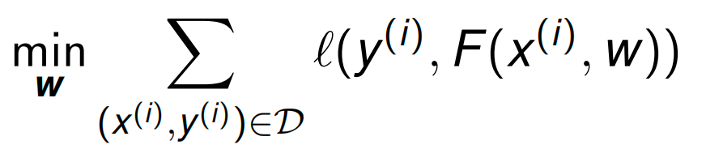
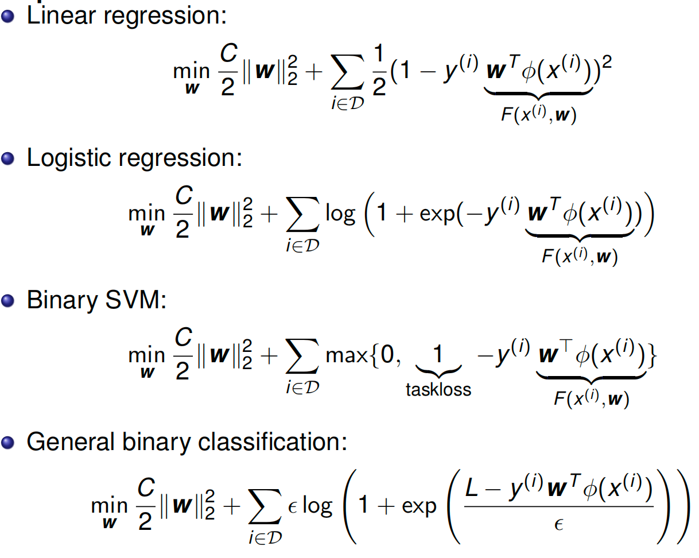
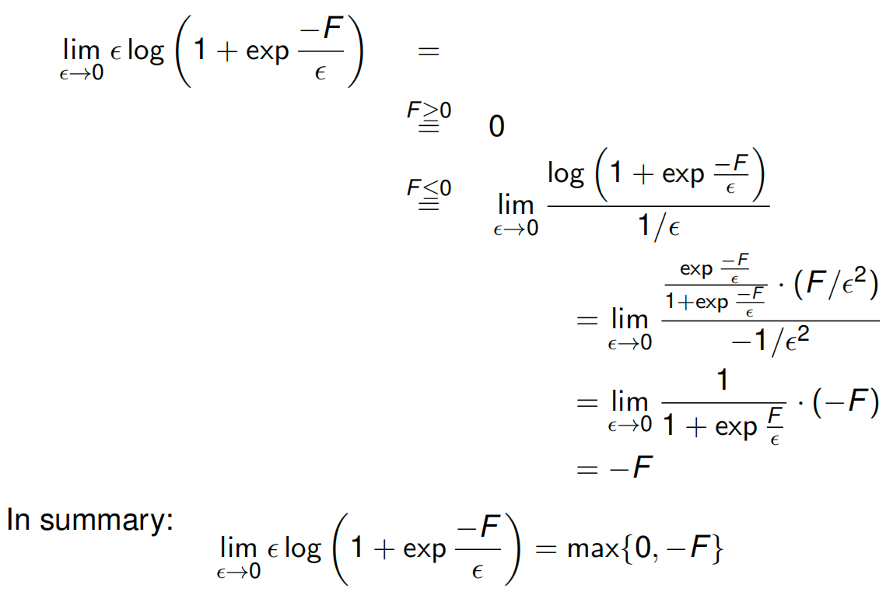

# ECE 544 Pattern Recognition

## Pattern Recognition

Pattern recoginition

-   input data: x
-   Label/output: y
-   x^(i)^ -> model/algorithm -> y^(i)^ ---inference/prediction
-   y=y^(k)^ where k= arg min || x(i)-x||^2=argmin d(x(i)-x)

`argmin` (argument of the minimum) finds the input value(s) that produce the minimum output of a function, rather than the minimum output itself

K Nearest Neighbor

## Linear Regression

线性回归

norm

transpose

Expectation: $E_{p(y)[f(y)]}=\sum_{y_i}p(y)f(y)$

arg min

Model: y=w_1\times x+w_2

Error: vertical lines

Set the derivative to zero

Regularization

$$\mathbf{X}\mathbf{X}^T \mathbf{w} + C\mathbf{w} - \mathbf{X}\mathbf{Y} = 0$$

w ∗ = XX ⊤ + CI *−*1 XY

Higher Po

Maximize the likelihood of the given dataset $D = \{(x(i) , y(i) )\}$ assuming

samples to be drawn independently from an identical distribution

(i.i.d.).

IID? independent identical d

Joint distribution = product of individual distributions

-   not good for classification

## Logistic Regression

empirical risk minimization

Log(1)

Edge/Boundary detection

>   [!NOTE]
>
>   Which loss is used for logistic regression?
>
>   What is the difference between logistic and linear regression?
>
>   How to optimize linear and logistic regression?

## Optimization Primal

When can we find the optimum?

-   Least squares, linear, and convex programs can be solved

    efficiently and reliably

Convex set: A set is convex if for any two points w1, w2 in the set, the line segment $λw_1 + (1 − λ)w_2$ for λ ∈ [0, 1] also lies in the set.

Convex function
A function f is convex if its domain is a convex set, and for any points w1, w2 in the domain and any λ ∈ [0, 1]
$f((1 − λ)w1 + λw2) ≤ (1 − λ)f(w1) + λf(w2)$

Show that $log(1 + e^x)$ is convex for x ∈ R

convex optimization

Gradient descent

>   [!NOTE]
>
>   Stepsize/Learning rate rules?
>
>   Descent directions?
>
>   Properties of convex functions?
>
>   Convergence rates?
>
>   Improvements?

**Important topics of this lecture**

Convex optimization basics

Algorithm choices

Rates

### Optimization Dual

**Lagrangian**

**Recipe for computing dual program:**

-   Bring primal program into standard form

-   Assign Lagrange multipliers to a suitable set of constraints
-   Subsume all other constrains in *W*
-   Write down the Lagrangian *L*
-   Minimize Lagrangian w.r.t. primal variables s.t. *w ∈ W*

Karush-Kuhn-Tucker (KKT) conditions

-   

The Relationship: Primal vs. Dual

The relationship is built on the inequality you saw earlier:

$$\min_{\mathbf{w}} L(\mathbf{w}, \lambda) \le f_0(\mathbf{w}^*)$$

-   **The Primal Program** minimizes the cost directly (finding the lowest valley).
-   **The Dual Function** $g(\lambda)$ finds a **lower bound** for that cost (finding the highest possible "floor" beneath the valley).
-   **The Dual Program** is simply the search for the **best (highest) lower bound**. It asks: *"What is the largest possible value for this floor?"*

Walkthrough: The Linear Program Example

Let's trace the steps in the slide to see how we get from the Primal to the Dual.

Step 1: The Primal Problem

We start with a standard linear minimization:

$$\min_{\mathbf{w}} \mathbf{c}^T \mathbf{w} \quad \text{s.t.} \quad \mathbf{A}\mathbf{w} \le \mathbf{b}$$

Step 2: The Lagrangian

We add the constraint to the objective using a Lagrange multiplier $\lambda$ (where $\lambda \ge 0$).

$$L(\mathbf{w}, \lambda) = \mathbf{c}^T \mathbf{w} + \lambda^T (\mathbf{A}\mathbf{w} - \mathbf{b})$$

Step 3: Regroup terms by $\mathbf{w}$

To find the minimum with respect to $\mathbf{w}$, we need to group all terms containing $\mathbf{w}$ together.

$$L(\mathbf{w}, \lambda) = (\mathbf{c} + \mathbf{A}^T \lambda)^T \mathbf{w} - \mathbf{b}^T \lambda$$

-   Here, $(\mathbf{c} + \mathbf{A}^T \lambda)$ acts like the **slope** of a line.
-   $-\mathbf{b}^T \lambda$ acts like the **intercept** (constant with respect to $\mathbf{w}$).

Step 4: Minimize $L$ to find $g(\lambda)$

We need to find $\min_{\mathbf{w}} L(\mathbf{w}, \lambda)$. This is the tricky part shown in the middle of the slide.

Think of this as minimizing a simple line $y = mx + b$.

-   **Case A:** If the slope $m$ is **not zero** (i.e., $\mathbf{c} + \mathbf{A}^T \lambda \neq 0$), we can choose $\mathbf{w}$ to be huge and negative (or positive), making the total value go to $-\infty$.
-   **Case B:** If the slope $m$ **is zero** (i.e., $\mathbf{c} + \mathbf{A}^T \lambda = 0$), the $\mathbf{w}$ term disappears completely. The value is just the intercept: $-\mathbf{b}^T \lambda$.

So, the dual function $g(\lambda)$ is:

$$g(\lambda) = \begin{cases} -\mathbf{b}^T \lambda & \text{if } \mathbf{A}^T \lambda + \mathbf{c} = 0 \\ -\infty & \text{otherwise} \end{cases}$$

Step 5: The Dual Program

The Dual Program tries to **maximize** $g(\lambda)$.

Since we want to maximize something, we can ignore the case where it equals $-\infty$ (that's definitely not the maximum!). We only care about the case where the slope is zero.

Thus, the Dual Program becomes:

$$\max_{\lambda \ge 0} -\mathbf{b}^T \lambda \quad \text{subject to} \quad \mathbf{A}^T \lambda + \mathbf{c} = 0$$

Summary

The Lagrangian allowed us to convert a minimization problem over $\mathbf{w}$ (Primal) into a maximization problem over $\lambda$ (Dual).

-   **Primal:** Constraints were on $\mathbf{w}$ ($\mathbf{Aw} \le \mathbf{b}$).
-   **Dual:** Constraints are on the "slope" being zero ($\mathbf{A}^T \lambda + \mathbf{c} = 0$).

>   [!NOTE]
>
>   What to do before computing the Lagrangian?
>
>   How to obtain the dual program?
>
>   Why duality

## Support Vector Machines

SVMs

**SVM:** Finds the **optimal** line (hyperplane) that separates the classes with the **maximum margin**.

$$y_i(\mathbf{w}^T \mathbf{x}_i + b) \ge 1$$

The graph shows data points from two classes (crosses $\times$ and circles $\circ$) in a 2D feature space ($\phi_1, \phi_2$).

-   **The Solid Line ($\mathbf{w}^T \phi = 0$):** This is the **Decision Boundary**. It effectively separates the two classes.
-   **The Dashed Lines ($\mathbf{w}^T \phi = 1$ and $-1$):** These represent the edges of the "street" (or margin). The SVM requires all data points to be *outside* these lines.
-   **The Support Vectors:** Notice that only a few points (two crosses and one circle) actually touch the dashed lines. These are the "Support Vectors" that define the model.
-   **The Margin Width ($\frac{2}{\|\mathbf{w}\|}$):** The diagram labels the distance between the two dashed lines as $\frac{2}{\|\mathbf{w}\|}$. This is the "safety gap" between the classes.

The Mathematical Goal

The goal of SVM is to make this safety gap (margin) as **wide** as possible.

-   **Maximize Margin:** We want to maximize $\frac{2}{\|\mathbf{w}\|}$.

-   **Minimize Norm:** Mathematically, maximizing $\frac{2}{\|\mathbf{w}\|}$ is the same as minimizing $\|\mathbf{w}\|$ (the length of the weight vector).

-   **The Formula:** To make the calculus easier, we square it and add a fraction. So, the objective becomes:

    $$\min_{\mathbf{w}} \frac{1}{2} \|\mathbf{w}\|_2^2$$

    This is what you see in the "Maximize margin" section of the slide.

The Constraints (The Rules)

We can't just minimize $\|\mathbf{w}\|$ to zero (which would make the margin infinite but classify nothing). We must respect the data.

$$y^{(i)} \mathbf{w}^T \phi(x^{(i)}) \ge 1$$

This inequality (labeled "Taskloss: $L$") enforces two things:

1.  **Correct Classification:** The prediction must have the same sign as the label $y$.
2.  **Safety Distance:** The prediction value must be at least **1** (or $-1$). This ensures points don't just "barely" cross the line, but stay completely off the "street."

>   [!NOTE]
>
>   **"Issue: what if data not linearly separable?"**.
>
>   -   The model shown here (Hard Margin SVM) *crashes* if you have a single data point in the wrong crowd (e.g., a blue circle in the middle of the black crosses).
>   -   This hints at the next topic in your course: **Soft Margin SVM**, which introduces "slack variables" to allow for some errors.

Slack

Maximum and constraints

Dual variables $α (i) ≥ 0$ for each inequality constraint

Step 1: Minimize w.r.t. the Weights ($\mathbf{w}$) 第一步：减少权重 $\mathbf{w}$

We want to find the $\mathbf{w}$ that minimizes $L$. We take the derivative with respect to $\mathbf{w}$ and set it to zero.
我们想找到 $\mathbf{w}$ 使 $L$ 最小化的 。我们取导数， $\mathbf{w}$ 并将其设为零。

-   **Lagrangian terms with $\mathbf{w}$:** $\frac{C}{2}\|\mathbf{w}\|_2^2 - \mathbf{w}^T \sum_i \alpha^{(i)} y^{(i)} \phi(x^{(i)})$
    **拉格朗日项为 $\mathbf{w}$ ：** $\frac{C}{2}\|\mathbf{w}\|_2^2 - \mathbf{w}^T \sum_i \alpha^{(i)} y^{(i)} \phi(x^{(i)})$ 

-   **Derivative: 衍生品：**

    $$\frac{\partial L}{\partial \mathbf{w}} = C\mathbf{w} - \sum_{i} \alpha^{(i)} y^{(i)} \phi(x^{(i)}) = 0$$

-   **Result (Solution for $\mathbf{w}$):
    结果（解 ）： $\mathbf{w}$** 

    $$\mathbf{w} = \frac{1}{C} \sum_{i} \alpha^{(i)} y^{(i)} \phi(x^{(i)})$$

    *(This tells us that the weight vector is just a linear combination of the data points.)
    （这告诉我们权重矢量只是数据点的线性组合。）*

Step 2: Minimize w.r.t. the Slack Variables ($\xi$) 步骤 2：最小化松弛变量 $\xi$ 

Now we look at the terms involving $\xi^{(i)}$.
现在我们来看涉及 $\xi^{(i)}$ 的项。

-   **Lagrangian term:** $\sum_i \xi^{(i)} (1 - \alpha^{(i)})$
    **拉格朗日项：** $\sum_i \xi^{(i)} (1 - \alpha^{(i)})$ 

-   **Analysis:** Since $\xi^{(i)} \ge 0$ (from the primal constraints), we need to be careful.
    **分析：** 由于 $\xi^{(i)} \ge 0$ （从原始约束中），我们需要谨慎。

    -   If the coefficient $(1 - \alpha^{(i)})$ is negative, we could make $\xi^{(i)}$ huge and drive $L$ to $-\infty$. Since we want a valid minimum, this is not allowed.
        如果系数 $(1 - \alpha^{(i)})$ 为负，我们可以将 变 $\xi^{(i)}$ 为巨大并驱动 $L$ 到 $-\infty$ 。因为我们想要一个有效的最低值，所以这是不允许的。

    -   Therefore, we get a **constraint** on $\alpha$:
        因此，我们得到 的 $\alpha$ **约束** ：

        $$1 - \alpha^{(i)} \ge 0 \implies \alpha^{(i)} \le 1$$

    -   Combined with $\alpha^{(i)} \ge 0$ (standard dual constraint), we get the "Box Constraint": **$0 \le \alpha^{(i)} \le 1$**.
        结合 $\alpha^{(i)} \ge 0$ （标准对偶约束），我们得到“盒子约束”：  **$0 \le \alpha^{(i)} \le 1$** 。

    -   At the optimal point, this term $\xi^{(i)}(1-\alpha^{(i)})$ will vanish (be zero).
        在最优点，该项 $\xi^{(i)}(1-\alpha^{(i)})$ 将消失（为零）。

Step 3: Substitute Back (The "Dual Objective") 第三步：回归替代（“双重目标”）

Now, plug the solution for $\mathbf{w}$ (from Step 1) back into the Lagrangian equation to eliminate $\mathbf{w}$.
现在，将（步骤 1 中的）解 $\mathbf{w}$ 代入拉格朗日方程以消除 $\mathbf{w}$ 。

$$\begin{aligned} g(\alpha) &= \underbrace{\frac{C}{2} \left\| \frac{1}{C} \sum \alpha y \phi \right\|^2}_{\text{First term}} - \underbrace{\left( \frac{1}{C} \sum \alpha y \phi \right)^T \sum \alpha y \phi}_{\text{Second term}} + \sum \alpha^{(i)} \\ &= \frac{1}{2C} \sum_{i,j} \alpha^{(i)}\alpha^{(j)}y^{(i)}y^{(j)}\phi(x^{(i)})^T\phi(x^{(j)}) - \frac{1}{C} \sum_{i,j} \alpha^{(i)}\alpha^{(j)}y^{(i)}y^{(j)}\phi(x^{(i)})^T\phi(x^{(j)}) + \sum \alpha^{(i)} \end{aligned}$$

Combine the squared terms ($\frac{1}{2C} - \frac{1}{C} = -\frac{1}{2C}$):
将平方项（2C）组合 1 ​ − C 1 ​ =− 2C 1 ​ ):

$$\text{Dual Objective:} \sum_{i} \alpha^{(i)} - \frac{1}{2C} \sum_{i,j} \alpha^{(i)} \alpha^{(j)} y^{(i)} y^{(j)} \underbrace{\phi(x^{(i)})^T \phi(x^{(j)})}_{\text{Kernel } K(x^{(i)}, x^{(j)})}$$

Final Result 最终结果

The problem reduces to maximizing this new formula solely with respect to $\alpha$:
问题简化为仅对 最大化 $\alpha$ 该新公式：

$$\max_{\alpha} \sum_{i} \alpha^{(i)} - \frac{1}{2C} \sum_{i,j} \alpha^{(i)} \alpha^{(j)} y^{(i)} y^{(j)} K(x^{(i)}, x^{(j)})$$

**Subject to: 受限于：**

1.  $0 \le \alpha^{(i)} \le 1$
2.  $\sum \alpha^{(i)} y^{(i)} = 0$ (This usually comes from optimizing the bias $b$, though implicit in your specific slide formulation).
     $\sum \alpha^{(i)} y^{(i)} = 0$ （这通常通过优化偏置 $b$ ，尽管在你的具体幻灯片表述中隐含了这一点。）

>   [!NOTE]
>
>   What are convenient properties of the SVM dual program?
>
>   Relationship between logistic regression and binary SVM?
>
>   How to extend all discussed formulations to more than two classes?

SVM as 0-temperature limit of logistic regression

### Multiclass Classification and Kernel Methods

**Multiclass classification**: How to classify between *K* classes?

1.   **1 vs all** or **1 vs rest** classifier: Use *K − 1* classifiers, each solving a two class problem whichseparates a point in class *k* from point not in this class ==> more than one good answer or no good answer
2.   **1 vs 1** classifier: Use *K(K − 1)/2* two-way classifiers, one for each possible pair of classes ==> two-way preferences need not be transitive

**Tie-breaking** is difficult, neither of the methods are good

3.   Use a multinomial distribution over y ∈ {0, 1, . . . , K − 1}. Use K weight vectors w(y)

     $p(y=k|x^{(i)})=\frac{exp(w^{T}_{(k)}\sigma(x^{(i)}))}{\sum_{j ∈ {0, 1, . . . , K − 1}}exp(w^{T}_{(j)}\sigma(x^{(i)}))}$

>   flow matching on MNIST
>
>   Discrete flow matching
>
>   Binary logistic regression class 0 and 1 with guassian mean -2 and 2

SVM: support vector machine

#### Multiclass SVM

linear decision boundary
$$
\min_{\mathbf{w}} \frac{C}{2} \|\mathbf{w}\|_2^2 + \sum_{i \in \mathcal{D}} \epsilon \ln \sum_{\hat{y}} \exp \left( \frac{L(y^{(i)}, \hat{y}) + \mathbf{w}^T \psi(x^{(i)}, \hat{y})}{\epsilon} \right) - \mathbf{w}^T \psi(x^{(i)}, y^{(i)})
$$
$\mathbf{w}$：权重向量。

$C$：正则化参数。

$\mathcal{D}$：数据集。

$\epsilon$：温度参数 (Temperature)。

$L(y^{(i)}, \hat{y})$：损失函数（Task Loss）

$\psi(x, y)$：特征映射函数

1.   公式的核心：Softmax 平滑近似

公式中最复杂的那一部分（$\epsilon \ln \sum \exp \dots$）其实是一个数学上非常有名的函数，叫做 **Log-Sum-Exp**。

$$f(x) = \epsilon \ln \left( \sum \exp(x_i / \epsilon) \right)$$

在物理学和机器学习中，$\epsilon$ 被称为**温度 (Temperature)**。它的作用是控制函数的“硬度”：

-   **当 $\epsilon \to 0$（温度趋近于 0）时**：Log-Sum-Exp 会变成 **Max (最大值)** 函数。
    -   就好比水结冰了，变成了硬邦邦的固体（Hard Max）。
-   **当 $\epsilon = 1$（温度较高）时**：它保持平滑，保留了所有可能性的概率分布（Soft Max）。

------

2.   推导一：变身成 SVM ($\epsilon \to 0$)

让我们看看当温度 $\epsilon$ 变得非常非常小（趋近于 0）时，公式会发生什么。

-   **原理**：$\lim_{\epsilon \to 0} \epsilon \ln \sum \exp(\frac{A}{\epsilon}) \approx \max(A)$。

-   **代入公式**：

    $$\epsilon \ln \sum_{\hat{y}} \exp \frac{L + \mathbf{w}^T \psi}{\epsilon} \quad \xrightarrow{\epsilon \to 0} \quad \max_{\hat{y}} (L(y, \hat{y}) + \mathbf{w}^T \psi(x, \hat{y}))$$

-   **结果**：这正好就是 PPT 上半部分写的 **Multi-class SVM** 的公式（Hinge Loss）！

    -   这里的 $L(y, \hat{y})$ 通常就是那个 $1$（Margin），代表如果预测错了要惩罚多少。
    -   **结论**：SVM 其实就是“低温”极限下的逻辑回归。它只关心那个**最大**的得分（最硬的边界），忽略其他的。

------

3. 推导二：变身成逻辑回归 ($\epsilon = 1$)

让我们看看当温度 $\epsilon = 1$ 时，公式会发生什么。我们假设这是标准的逻辑回归（没有额外的边界惩罚 $L=0$）。

-   **代入公式**：

    $$1 \cdot \ln \sum_{\hat{y}} \exp \left( \frac{0 + \mathbf{w}^T \psi(x, \hat{y})}{1} \right) - \mathbf{w}^T \psi(x, y)$$

    $$= \ln \left( \sum_{\hat{y}} \exp(\mathbf{w}^T \psi(x, \hat{y})) \right) - \mathbf{w}^T \psi(x, y)$$

-   **这是什么？** 这正是 **负对数似然函数 (Negative Log-Likelihood)**，也就是逻辑回归用来优化的 **交叉熵损失 (Cross-Entropy Loss)**。

    -   第一项是配分函数（归一化项，$Z$）的对数。
    -   第二项是正确类别的得分。
    -   **结论**：逻辑回归是“常温”下的模型。它考虑了所有类别的得分，计算出一个概率分布。

这个公式建立了一个**连续的光谱**：

-   **光谱的一端 ($\epsilon \to 0$)** 是 **SVM**：它是“硬”的，只在乎最强的那个对手（Support Vectors），计算的是几何间隔。
-   **光谱的另一端 ($\epsilon = 1$)** 是 **逻辑回归**：它是“软”的，考虑全局的概率分布，计算的是概率似然。

**一句话概括：** SVM 只是逻辑回归在温度冷却到 0 度时的特例。

Binary logistic regression/SVM is convex 凸的

$\phi$

### Kernels

------

第一部分：那四个公式是怎么来的？

这四个公式分为两组：**训练用的（Dual）\**和\**预测用的（Prediction）**。它们的核心来源都是我们在前面提到的 **拉格朗日乘数法**。

#### 1. 预测公式 (Prediction with dual variables)

$$\mathbf{w}^T \phi(x) = \frac{1}{C} \sum \alpha^{(i)} y^{(i)} \phi(x^{(i)})^T \phi(x)$$

-   **这是什么？** 这是告诉你，一旦模型训练好了，怎么用它来预测新数据。

-   **怎么推导的？**

    还记得在求拉格朗日极值时，我们对 $\mathbf{w}$ 求导并令其为 0 吗？

    $$\frac{\partial L}{\partial \mathbf{w}} = 0 \implies \mathbf{w} = \sum \alpha_i y_i \phi(x_i)$$

    这个式子被称为 **表示定理 (Representer Theorem)**。它告诉我们：**最佳的权重向量 $\mathbf{w}$ 其实就是所有训练数据点 $\phi(x_i)$ 的线性组合（加权和）。**

    所以，当我们预测新数据 $\phi(x)$ 时，原本是计算 $\mathbf{w}^T \phi(x)$，现在把 $\mathbf{w}$ 替换掉，就变成了公式里的样子：**新数据与所有旧数据的内积的加权和**。

#### 2. 对偶问题公式 (Dual of SVM / Logistic)

$$\max g(\alpha) := \frac{-1}{2C} \| \sum \dots \|^2 + \sum \alpha$$

-   **这是什么？** 这是训练阶段真正要解的数学题。

-   **怎么推导的？**

    这就是我们在前几张 PPT 里做的“代回”步骤。

    既然我们知道 $\mathbf{w}$ 可以用 $\alpha$（或 $\lambda$）表示，我们就把 $\mathbf{w}$ 的表达式代回到原本的拉格朗日函数 $L$ 中。

    这样一来，式子里就没有 $\mathbf{w}$ 了，**只剩下**对偶变量 $\alpha$ 和数据点之间的内积。

-   **观察点：**

    你会发现 Logistic Regression 和 SVM 的对偶公式长得**非常像**。它们都依赖于数据点的内积。区别仅在于约束条件和具体的系数（因为它们的 Loss Function 不同，一个是 Log Loss，一个是 Hinge Loss）。

------

第二部分：后面的 Kernel 相关是在干什么？

既然我们有了上面的四个公式，数学家们发现了一个惊人的**“漏洞”**（或者说捷径），这就是 **核技巧 (Kernel Trick)**。

#### 1. 观察到的现象 (Observation)

请看上一张图的四个公式，不管是训练（Dual）还是预测（Prediction），所有的计算都**只**涉及数据向量之间的**内积**：

$$\phi(x^{(i)})^T \phi(x^{(j)})$$

也就是说，我们根本不需要单独知道 $\phi(x)$ 长什么样，我们只需要知道两个数据点“乘起来”是多少。

#### 2. 为什么要用 Kernel？

假设我们的数据在低维空间不可分，我们需要把它映射到高维空间（比如 100万维）才能分开。

-   **笨办法（不用 Kernel）：**

    1.  先把 $x$ 映射成 100万维的向量 $\phi(x)$。（计算量爆炸）
    2.  再计算这两个 100万维向量的内积。（计算量再次爆炸）

-   **聪明办法（Kernel Trick）：**

    我们发现有一个函数 $K(x, z)$，它在**低维**直接算出来的结果，**刚好等于**那个高维内积的结果。

    $$K(x, z) = \phi(x)^T \phi(z)$$

    这样我们就可以**不用**去计算那个复杂的 $\phi(x)$，直接在低维算个 $K$ 就行了。

#### 3. 总结

-   **Kernel 是什么？** 它是一个计算捷径。
-   **Advantage (优势)：** 不需要显式地构建特征向量 $\phi(x)$。省内存、省时间，还能解决非线性问题。
-   **But (但是)：** 不是随便找个函数都能当 Kernel，它必须满足数学条件（Mercer's Theorem），保证它对应某个特征空间里的内积。

**一句话总结这两张图的逻辑：**

第一张图推导出公式，证明了“只要算出内积就能训练和预测”；第二张图接着说“既然只要内积，那我们就用 Kernel 函数来偷懒，直接算出内积，从而轻松实现高维映射”。

Linear kernel:

Squared exponential (Gaussian) kernel:

Sigmoid kernel:

New kernels:

>   [!NOTE]
>
>   How to extend binary classification to multiple classes?
>
>   What are kernels good for?

## Deep Nets

Deep Learning

AlexNet

Decreasing spatial resolution and the increasing number of channels

### Fully connected layer

One particular output is influenced by all the other inputs: wx+b

>   What’s an issue with fully connected layers?
>
>   How to share weights?

