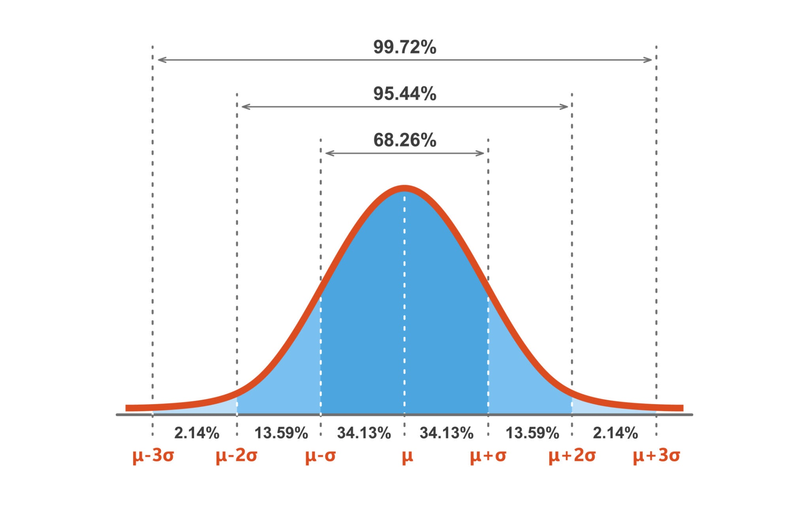
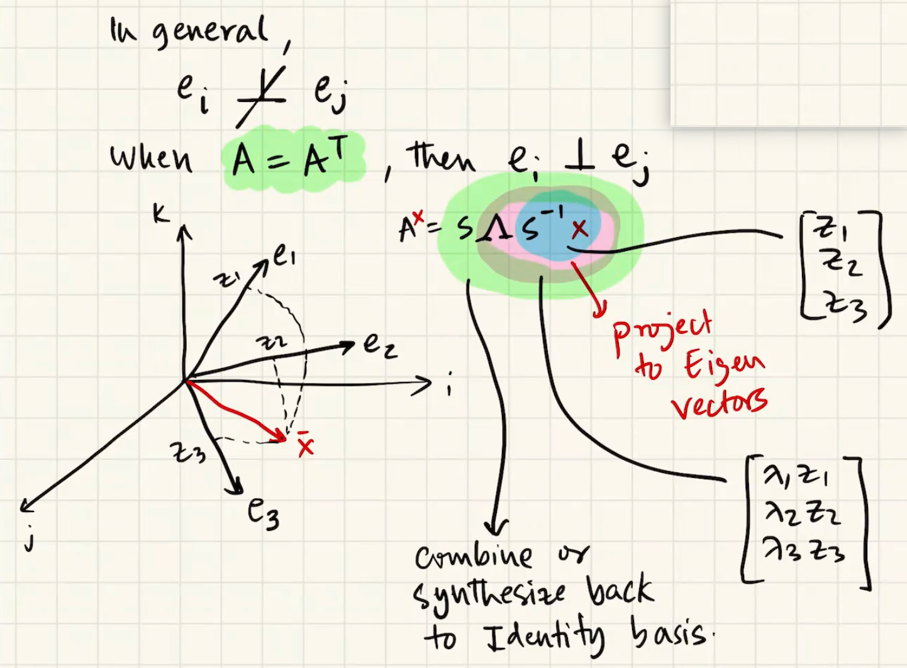
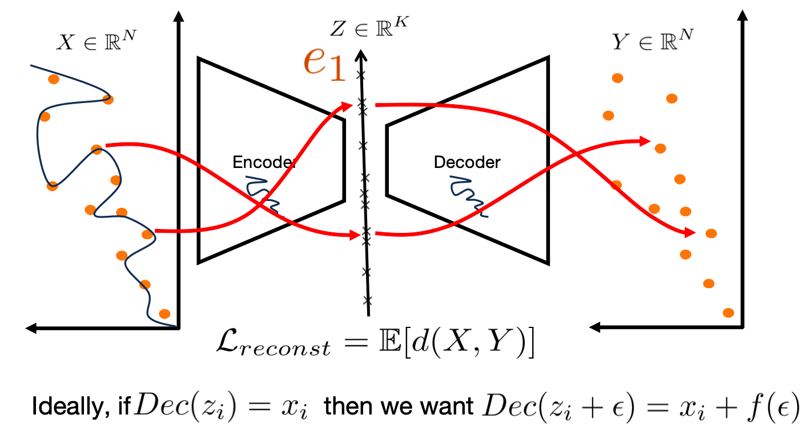
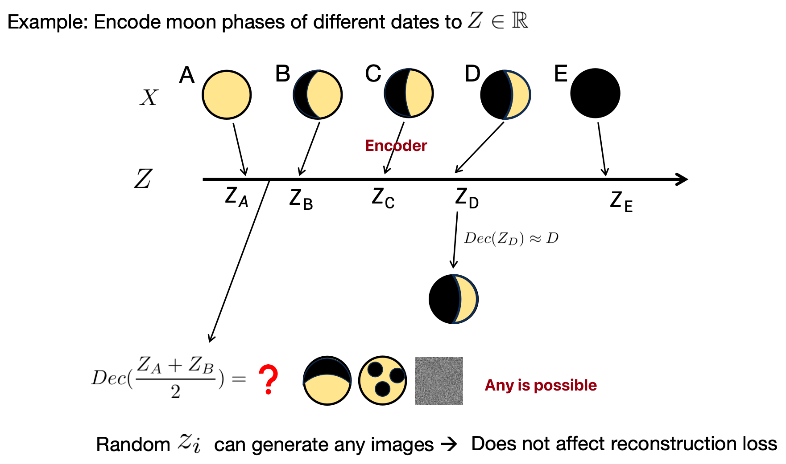
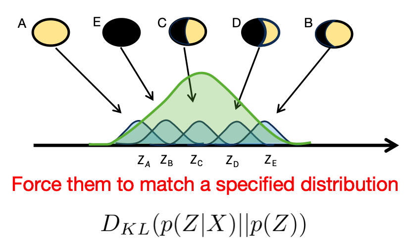
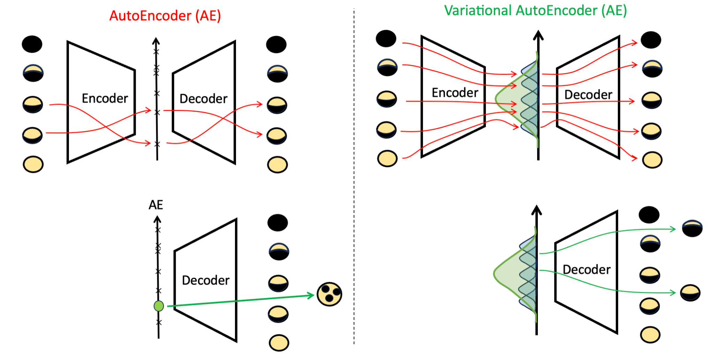
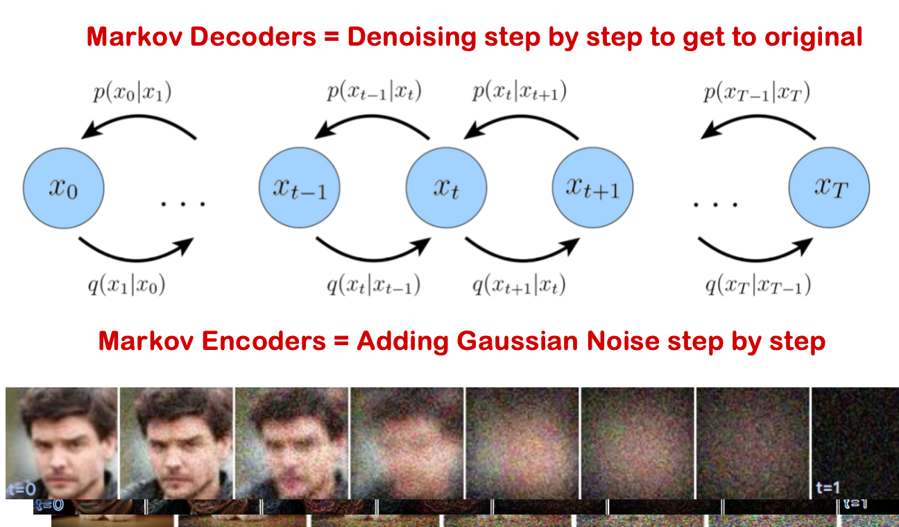

# ECE498/598 Deep Generative Models

## Overview

VAE(Variational Autoencoder)/Latent space models

- 智能的压缩与解压 (Encoding & Decoding) 变分自编码器
- All images have a latent set of rules $z∈R^K$,$k≤N$ from which they are generated.
- Learning the distribution of the rules $q_{\alpha}(z)$ is all we need.
  - z is the hidden rule 编码要有规律，尽可能地像一个标准的高斯分布,
  - We can sample from that distribution $q_{\alpha}(z)$ and generate images based on those sampled rules.
- Conditional distribution: $q_{\alpha}(z=\text{rules}|x=\text{chess board images})$ decode rules into images
- Encoder: rule generator

GANs

- 博弈与对抗 (Adversarial Game)
- Learn transformation from white noise to real images. Instead, train model A to synthesize real-looking images
- Train model B to discriminate that model A is generating fake images. Train both models A and B jointly.

Diffusion

- 先污染，后治理 (Denoising Process)
- Let’s transform given data points progressively to Gaussian noise
- Then, learn how to remove the noise to get back to the data points. Once trained, this model will be able to transform samples from Gaussian to samples of data.

Flows

- 可逆的数学变换 (Invertible Transformation)
- No need to make noise and then denoise 
- Think of the problem through the lens of ODE / SDE. We want to learn a vector field so that initial points (from a Gaussian) …will follow a trajectory and end up at points on the data distribution.

| 特征维度   | VAE (变分自编码器)                 | GANs (生成对抗网络)                     | Diffusion (扩散模型)           | Flows (流模型)                           |
| ---------- | ---------------------------------- | --------------------------------------- | ------------------------------ | ---------------------------------------- |
| 核心机制   | 编码-解码，学习潜在空间的概率分布  | 对抗博弈，生成器与判别器相互竞争        | 迭代去噪，从噪声中逐步恢复图像 | 可逆变换，学习简单与复杂分布间的精确映射 |
| 生成速度   | 快 (一次前向传播)                  | 快 (一次前向传播)                       | 非常慢 (需要成百上千次迭代)    | 快 (一次前向传播)                        |
| 图像质量   | 一般，偏模糊                       | 高，图像锐利                            | 极高，当前最佳                 | 中等，数学上优美但效果常有限制           |
| 训练稳定性 | 非常稳定                           | 不稳定，需要小心调参                    | 稳定                           | 稳定                                     |
| 潜在空间   | 结构性好，平滑连续，适合插值和编辑 | 结构性不明确，需要额外技术 (如StyleGAN) | 潜在表示与噪声水平相关         | 结构性好，与简单分布一一对应             |

## Probability Review

### Fundemetal

**Likelihood**: you know this distribution, so easy to calculate

**Posterior**: the opposite is a known distribution, but this is a bit harder

|            |                                            |                                 |
| ---------- | ------------------------------------------ | ------------------------------- |
| Likelihood | p(data    \| distribution parameters    )  | Tractable, well defined         |
| Posterior  | p (distribution parameters    \| data    ) | Typical goal, tricky, try Bayes |
| Prior      | p( distribution parameters   )             | Domain knowledge                |
| Evidence   | p(data)                                    | Approximate with large data     |

### Bayes

**Bayes Rule**: $P(C|A)=\frac{P(A|C)\times P(C)}{P(A)}$

- $P(cause|evidence)=\frac{P(evidence|cause)P(cause)}{P(evidence)}$
- posterior likelihood prior normalization

### Maximum likelihood Estimation(MLE)

- Slide the bell curve towards the position that maximizes the probability of all data points.
- 为了求解 $argmax_{\theta} L(θ)$, 我们需要解方程: $\frac{δL(θ)}{δθ}=0$，导数等于0的点即为最大值的点

### Expectation Maximization (EM)

The Expectation-Maximization (EM) algorithm is an iterative statistical method used to find maximum likelihood estimates for model parameters when the data has missing or hidden values, known as **latent variables**. In essence, EM provides a way to estimate the parameters of a statistical model in situations where not all of the relevant data is observed.

1. Expectation Step (E-step)

In this step, the algorithm makes its best guess for the missing or latent variables based on the observed data and the current estimates of the model parameters. It calculates the expected value of the log-likelihood function, effectively creating a probabilistic assignment of the unobserved data.

2. Maximization Step (M-step)

Using the "completed" data from the E-step (which includes the estimated values for the latent variables), the M-step re-estimates the model parameters to maximize the expected log-likelihood. These new parameter estimates are then used in the next E-step.

This two-step process is repeated, with each iteration guaranteed to increase the log-likelihood of the observed data, until the parameter estimates no longer change significantly.

---------

Here, $x$ is observed and $c$ is the latent data. 

-   Goal: We need to estimate $\theta$ to maximize the likeihood of observed data.

$$
L(\theta)=\log p(x|\theta)=\log ∫_cp(x,c|\theta)dc=\log∫_cp(c,\theta)\\
\text{c is the complete data contains missing and original data}\\
=\log∫_c\frac{p(c|\theta)}{p(c|x,\hat\theta^{(t)})}p(c|x,\hat\theta^{(t)})dc\\
\text{a quantity times a probability is the expected value of the quantity}\\
=\log E_{c|x,\hat\theta^(t)}[\frac{p(c|\theta)}{p(c|x,\hat\theta^{(t)})}]\\
≥E_{c|x,\hat\theta^(t)}[\log \frac{p(c|\theta)}{p(c|x,\hat\theta^{(t)})}]\quad \text{by Jensen's equality}\\
=E_{c|x,\hat\theta^(t)}[\log {p(c|\theta)}] + E_{c|x,\hat\theta^(t)}[-\log p(c|x,\hat\theta^{(t)})]\\
=Q(\theta|\hat \theta^{(t)}) + h(c,x, \hat\theta^{(t)})
$$

So, improve Q means improve L
$$
L(\theta)≥ Q(\theta|\hat \theta^{(t)}) + h(c,x, \hat\theta^{(t)})
\text{ , if }\theta = \hat \theta^{(t)}\text{ Q function equals Likelihood function}
$$
$\theta$ is the unknown varibale, so we only care the Q function:
$$
Q(\theta|\hat \theta^{(t)})=E_{c|x,\hat\theta^(t)}[\log {p(c|\theta)}]\\
$$
${p(c|\theta)}$  is the distribution function, eg, $E_{c|x,\hat\theta^(t)}[\sum_{i=1}^4\log {\theta^{x_i}\times(1-\theta)^{10-x_i}}]$

>   [!CAUTION]
>
>   See ECE313 for more 

### Guassian/Normal distribution 正太分布

In probability theory and statistics, a **normal distribution** or Gaussian distribution is a type of continuous probability distribution for a real-valued random variable. The general form of its probability density function is
$$
f(x)=\frac{1}{\sqrt{2\pi\sigma^2}}e^{-\frac{(x-\mu)^2}{2\sigma^2}}
$$
- $\text{Notation: }{\displaystyle {\mathcal {N}}(\mu ,\sigma ^{2})}\\$
- $f(x)=\text{probability density function}\\$
- $\sigma	=\text{standard deviation}\\$
- $\mu	=\text{mean}$

正太分布是一维高斯分布

Here’s a breakdown of each component of the notation:

- **x**: This represents the **random variable**. It's a variable whose value is a numerical outcome of a random phenomenon, like the height of a randomly selected person or the result of a measurement.

- **~**: This symbol is shorthand for "**is distributed as**" or "**follows the distribution of**." It connects the random variable to the specific probability distribution that describes its behavior.

- **N**: This stands for the **Normal distribution**, also known as the **Gaussian distribution**. It's arguably the most important probability distribution in statistics. Its probability density function creates a perfectly symmetric, bell-shaped curve.

- **μ (mu)**: This is the **mean** of the distribution. For a normal distribution, the mean represents:
  - The **center** or central tendency of the data.
  - The **peak** of the bell curve.
  - The **expected value** or average of the random variable x.

- **σ^2 (sigma-squared)**: This is the **variance** of the distribution. The variance measures the **spread** or **dispersion** of the data around the mean μ.

  - A **small variance** means the data points are tightly clustered around the mean, resulting in a tall and narrow bell curve.
  - A **large variance** means the data points are spread out, resulting in a short and wide bell curve.
  - The square root of the variance, **σ**, is called the **standard deviation**. It's often easier to interpret because it's in the same units as the mean.

### Multivariate Gaussian Distribution 多元高斯分布

**Multivariate Gaussian distribution/joint normal distribution**
$$
p(x)=\frac1{\sqrt{(2π)^k∣Σ∣}}exp(−\frac12(x−μ)^⊤Σ^{−1}(x−μ))
$$
这个公式是**多元正态分布（也叫高斯分布）的概率密度函数 (Probability Density Function, PDF)**

 $\mathbf {X} \ \sim \ {\mathcal {N}}_{k}({\boldsymbol {\mu }},\,{\boldsymbol {\Sigma }})$

- $p(x)$: represents the probability density of the occurrence of data point x 概率密度
- $μ$: the mean vector of the distribution均值向量, representing the center of the distribution
- $Σ$: the covariance matrix of the distribution 协方差矩阵, representing the degree of dispersion of the data and the correlation between different dimensions
- $|Σ|$: the determinant of the covariance matrix 协方差矩阵的行列式
- $Σ^{−1}$: the inverse of the covariance matrix 协方差矩阵的逆矩阵
- exp(⋅): the natural exponential function e(⋅) 自然指数函数

### Uniform probability distribution 均值分布

$U(0,θ)$ means that a random variable can take on any value between **0** and **θ** with **equal probability**. For any value outside of this range, the probability is zero. Unlike a Normal distribution's bell curve, the graph of a Uniform distribution's probability is a simple rectangle.

- **U**: Stands for **Uniform**.
- **0**: The **minimum** possible value the variable can take.
- **θ**: The **maximum** possible value the variable can take.
- **Probability function**: $$ L(θ∣x)=\begin{cases} \left( \frac{1}{\theta} \right)^n, & \text{if } \theta \geq \max(x_i) \\ 0, & \text{otherwise} \end{cases}$$

### LOTUS (law of the unconscious statistician)

**LOTUS 无意识统计定律**: expresses the [expected value](https://en.wikipedia.org/wiki/Expected_value) of a [function](https://en.wikipedia.org/wiki/Function_(mathematics)) *g(X)* of a [random variable](https://en.wikipedia.org/wiki/Random_variable) *X* in terms of *g* and the [probability distribution](https://en.wikipedia.org/wiki/Probability_distribution) of *X*

1.   离散+概率质量函数PMF

If the distribution of *X* is [discrete](https://en.wikipedia.org/wiki/Discrete_probability_distribution) and one knows its [probability mass function](https://en.wikipedia.org/wiki/Probability_mass_function) *pX*, then the expected value of $g(X)$ is
$$
{\displaystyle \operatorname {E} [g(X)]=\sum _{x}g(x)p_{X}(x),\,}
$$
The sum is over all possible values *x* of *X*. 

2.   连续+概率密度函数

If instead the distribution of *X* is [continuous](https://en.wikipedia.org/wiki/Continuous_probability_distribution) with [probability density function](https://en.wikipedia.org/wiki/Probability_density_function) $f_X$, then the expected value of *g*(*X*) is
$$
{\displaystyle \operatorname {E} [g(X)]=\int _{-\infty }^{\infty }g(x)f_{X}(x)\,\mathrm {d} x}
$$
Both of these special cases can be expressed in terms of the [cumulative probability distribution function](https://en.wikipedia.org/wiki/Cumulative_probability_distribution_function) $F_X$ of *X* 累积分布函数, with the expected value of *g*(*X*) now given by the [Lebesgue–Stieltjes integral](https://en.wikipedia.org/wiki/Lebesgue–Stieltjes_integral).
$$
{\displaystyle \operatorname {E} [g(X)]=\int _{-\infty }^{\infty }g(x)\,\mathrm {d} F_{X}(x)}
$$

## EM, Eigenvectors

### EM & VAE

The Core Idea: Maximizing Data Likelihood with Latent Variables

Both VAEs and the EM algorithm are designed to find the best parameters for a model that has **latent variables**—hidden variables that we can't directly observe.2 The ultimate goal for both is to maximize the likelihood of the observed data.3

To achieve this, they both work with a lower bound on the data's log-likelihood, often called the **Evidence Lower Bound (ELBO)**. By maximizing this lower bound, they indirectly push the true data likelihood higher.

#### The Two-Step Process

The way they maximize this lower bound is where the parallels become clear:

-   **EM Algorithm:**
    -   **E-Step (Expectation):** Computes the posterior distribution of the latent variables given the data and the current model parameters.5 This is like figuring out the most likely values for the hidden variables.
    -   **M-Step (Maximization):** Updates the model parameters to maximize the expected log-likelihood, using the posterior distribution calculated in the E-step.
-   **VAE:**
    -   **"E-like" Step (Encoder):** The **encoder** network in a VAE learns to approximate the posterior distribution of the latent variables. Given a data point, it outputs the parameters (like the mean and variance) of a distribution that likely produced that data point's latent representation.7 This is analogous to the E-step, but instead of calculating the exact posterior, it learns a function to approximate it.
    -   **"M-like" Step (Decoder & Loss Function):** The **decoder** network takes a sample from the latent distribution (provided by the encoder) and tries to reconstruct the original data.8 The VAE's loss function has two main parts:
        1.  **Reconstruction Loss:** This is similar to the M-step. It encourages the decoder to generate data that is close to the original data, effectively maximizing the likelihood of the data given the latent variables.
        2.  **KL Divergence:** This part of the loss function regularizes the latent space, pushing the distribution learned by the encoder to be close to a predefined prior distribution (usually a standard normal distribution).

#### Key Differences

While the core concepts are similar, there are some important distinctions:

-   **Intractability:** The EM algorithm assumes that the posterior distribution in the E-step can be calculated exactly. VAEs are designed for situations where this is not possible (it's "intractable"). The encoder in a VAE learns an *approximation* to this posterior.
-   **Optimization:** The EM algorithm typically uses an iterative process to find the optimal parameters. VAEs, being neural networks, use stochastic gradient descent and backpropagation to optimize their parameters (the weights of the encoder and decoder).
-   **Flexibility:** VAEs, with their neural network architecture, can model much more complex and high-dimensional data compared to the typical applications of the EM algorithm (like Gaussian Mixture Models).

In essence, a VAE can be seen as a continuous and amortized version of the EM algorithm, where the E-step is performed by the encoder and the M-step is guided by the reconstruction loss of the decoder.

## Probability and Linear Algebra Review

### EM continued

### Eigen-decomposition

### Principal Component Analysis (PCA)

Goal: Which basis B will make the data uncorrelated?

-   The coviance matrix(in new basis) needs to be a diagonal matrix because uncorrelated means $cov(x,y)=0$, x≠y
-   Data item $d_i=\begin{bmatrix} x_i\\ y_i \\z_i \end{bmatrix}$, $d_i$ maps to $z_i$ in new basis B
-   $Cov(\bar d) = \mathbb E[dd^T]$

### SVD(singular value decomposition)

A decompostion of a matrix into $\begin{bmatrix} \sigma\\ u \\v \end{bmatrix}$

Eigen-decompostion: $A=S \Lambda S^{-1}$

-   $S$ is a matrix of all the eigenvectors $e_1$, $e_2$, ...

-   $\Lambda$ is diagonal matrix with $\lambda_1$, $\lambda_2$, ...

-   

    

orthogonality principle 正交原理

$$
\text{Cov}(A) = AA^T_{3\times 3}=
\begin{bmatrix}
x_1 & x_2 & x_3 \\
y_1 & y_2 & y_3 \\
z_1 & z_2 & z_3
\end{bmatrix}
\times
\begin{bmatrix}
x_1 & y_1 & z_1 \\
x_2 & y_2 & z_2 \\
x_3 & y_3 & z_3
\end{bmatrix}
\\
=\begin{bmatrix}
var(x) & Cov(xy) & Cov(xz) \\
Cov(yx) & var(y) & Cov(yz) \\
Cov(zx) & Cov(zy) & var(z)
\end{bmatrix}
$$

## AE and VAE

### AutoEncoders (AE)

Data compression: High dimension to low dimension 

-   if by PCA(linear operations)

-   Encoder / Decoder learns a low dimensional manifold Z and maps data to Z
-   But AE can map x to z any way it wants to minimize reconstruction loss => Not useful for generation.

What we want is **semantic continuity** 语义连续性 => Motivation for **Variational Auto Encoder (VAE)**

### Variational AutoEncoders (VAE)

Key idea: 

(1) For each X, let encoder learn a distribution and let decoder decode samples from this distribution.

(2) Across all X, let the distributions overlap with each other.

Learning the distribution is not enough. We want the distribution to be overlapped for semantic continuity.

>   

Q: How to overlap(encoder do this)?

A: 

### Loss function

## Formalizing VAE, Problems with VAE, VQ-VAE

Big Picture(AE vs. VAE)

EM算法中的下界构造（M步骤）

在EM中，目标是最大化对数似然 \(\log p(x|\theta)\)，其中 \(c\) 是隐变量（完整数据）：
\[
L(\theta) = \log p(x|\theta) = \log \int p(x, c|\theta) dc.
\]
引入变分分布 \(q(c) = p(c|x, \hat{\theta}^{(t)})\)（即后验分布，用于E步），然后应用Jensen不等式：
\[
\log \int \frac{p(c|\theta)}{q(c)} q(c) dc \geq \int q(c) \log \frac{p(c|\theta)}{q(c)} dc = E_{q(c)}[\log p(c|\theta)] - E_{q(c)}[\log q(c)].
\]
这可以写为：
\[
L(\theta) \geq Q(\theta | \hat{\theta}^{(t)}) + H(q),
\]
其中 \(Q(\theta | \hat{\theta}^{(t)}) = E_{q(c)}[\log p(c|\theta)]\)（期望完整数据对数似然），而 \(H(q)\) 是分布 \(q\) 的熵（与 \(\theta\) 无关）。因此最大化下界等价于最大化 \(Q(\theta | \hat{\theta}^{(t)})\)（即M步）。

---

VAE中的变分下界（ELBO）*

在VAE中，目标是最大化对数似然 \(\log p(x)\)（生成模型），其中 \(z\) 是隐变量：
\[
\log p(x) = \log \int p(x, z) dz = \log \int p(x|z) p(z) dz.
\]
引入变分分布 \(q(z|x)\)（近似后验，由编码器输出），然后应用Jensen不等式：
\[
\log \int \frac{p(x|z)p(z)}{q(z|x)} q(z|x) dz \geq \int q(z|x) \log \frac{p(x|z)p(z)}{q(z|x)} dz = E_{q(z|x)}[\log p(x|z)] - D_{KL}(q(z|x) \| p(z)).
\]
这就是VAE的ELBO（证据下界）：
\[
\log p(x) \geq E_{q(z|x)}[\log p(x|z)] - D_{KL}(q(z|x) \| p(z)).
\]

---

## 3. **EM与VAE的对比与转化**
- **共同点**：
  - 两者都引入变分分布（\(q(c)\) 或 \(q(z|x)\)）来构造下界。
  - 都使用Jensen不等式将对数移入积分。
  - 目标都是最大化对数似然（\(\log p(x|\theta)\) 或 \(\log p(x)\)）。

- **差异**：
  - **EM**：用于参数估计（\(\theta\)），其中变分分布取真实后验 \(p(c|x, \hat{\theta}^{(t)})\)（E步），然后下界在M步被最大化（更新 \(\theta\)）。
  - **VAE**：用于生成模型，变分分布 \(q(z|x)\) 是近似后验（由神经网络参数化），下界（ELBO）同时优化生成模型 \(p(x|z)\) 和推断模型 \(q(z|x)\)。

- **转化理解**：
  实际上，VAE可以视为一种“神经网络化”的EM算法：
  - VAE的ELBO与EM的下界形式一致，但VAE中的变分分布 \(q(z|x)\) 是学习的（而不是真实后验），且生成模型 \(p(x|z)\) 和推断模型 \(q(z|x)\) 同时优化（类似于E步和M步交替，但通过梯度下降联合训练）。

  具体地，将EM中的符号对应到VAE：
  - 隐变量 \(c\) 对应 \(z\)。
  - 参数 \(\theta\) 对应生成模型参数（解码器）和推断模型参数（编码器）。
  - EM的E步（计算后验）在VAE中由编码器 \(q(z|x)\) 近似。
  - EM的M步（更新 \(\theta\)）在VAE中通过最大化ELBO（即梯度下降）同时更新生成和推断参数。

因此，VAE的ELBO推导可以看作EM下界在深度生成模型中的扩展，其中变分分布被参数化并学习（而不是精确计算后验）。

- **EM下界**：
  \[
  \log p(x|\theta) \geq E_{q(c)}[\log p(c|\theta)] + H(q) \quad \text{其中} \quad q(c)=p(c|x,\hat{\theta}^{(t)}).
  \]
- **VAE的ELBO**：
  \[
  \log p(x) \geq E_{q(z|x)}[\log p(x|z)] - D_{KL}(q(z|x) \| p(z)).
  \]
  注意：\(E_{q(z|x)}[\log p(z)] + H(q(z|x)) = -D_{KL}(q(z|x)\|p(z))\)（当 \(p(z)\) 是先验时），所以两者形式一致。

x ~ p_d(x): x sample from p_d(x)

x|z x given z decoder

z|x z given x encoder

q fai z given x is a distribution

Fai encoder

q agg z : i Gaussian

Encoder learn q far agg z

## Diffusion

VAE is basically a transformation from a (lower-dimensional) Gaussian distribution to an image manifold. Why go through the latent space? Why not learn to transform directly from a Gaussian in R^n to images in the same $R^n$ space?

>   Why the Latent Space is Crucial?
>
>   The "bottleneck" created by the lower-dimensional latent space forces the VAE to learn the most important, underlying features of the data.2 Instead of just memorizing the input, it must learn an efficient code to represent it. Here are the key advantages of this approach:
>
>   -   **Learning a Meaningful Representation**: The latent space isn't just a random collection of numbers; it's an organized, continuous space where similar data points are located near each other.3 This structure allows you to perform powerful operations, like interpolating between two images by simply moving between their corresponding points in the latent space.4
>   -   **Generating New Data**: Because the latent space is structured and continuous, you can sample a random point from the Gaussian distribution it was trained on, pass it through the decoder, and generate a completely new, realistic image. This is the generative power of a VAE.
>   -   **Dealing with the Curse of Dimensionality**: Image space is incredibly high-dimensional. A direct mapping from a high-dimensional Gaussian to the image space would be extremely difficult to learn. The model would have to navigate a vast, mostly empty space to find the tiny region that contains realistic images. The latent space provides a much smaller, more manageable space for the model to work in.
>   -   **Encouraging Disentanglement**: A well-trained VAE can learn a "disentangled" latent space, where different dimensions of the latent vector correspond to distinct, interpretable features of the image.5 For example, in a VAE trained on faces, one dimension might control smile, another might control the angle of the head, and a third could control hair color.6 This makes the model more interpretable and controllable.
>
>   In short, the latent space is not just a detour; it's a fundamental component that allows VAEs to be powerful generative models. It forces the network to learn the essence of the data rather than just its superficial appearance.

Intuition: Thermodynamics

Add noise to destroy structure of the image <=> Learn to undo the noisification process

-   in latent space

**VAE vs. Diffusion** 

-   3 main differences 
    1.   Latent dimension same as data
    2.   Encoding process is not learnt
    3.   The final state is white noise
-   Markov Encoders = Adding Gaussian Noise step by step
-   Markov Decoders = Denoising step by step to get to original

增加噪声，blur扩大就变成了distribution

$x_{t+1}=$

梯度下降到达山顶⛰️

如何确定一个函数是分布？曲线下面积为1

