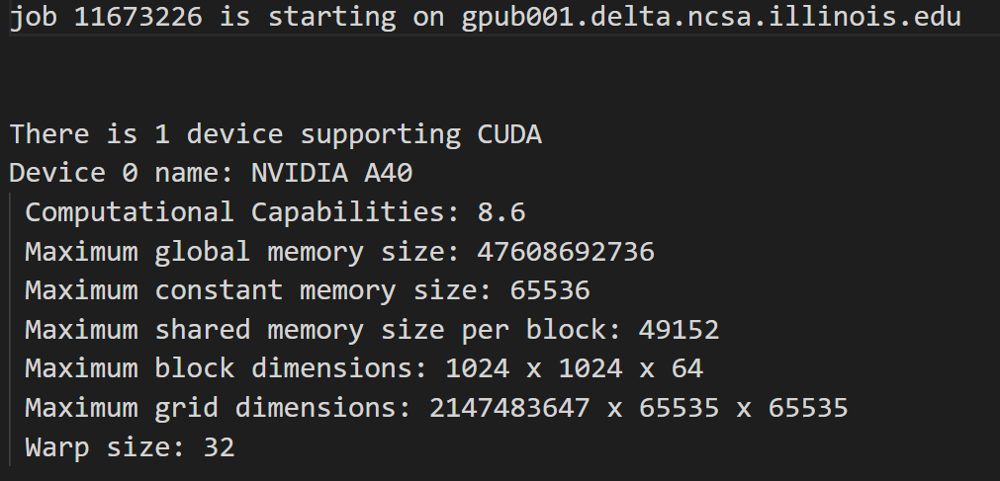

# ECE408

## LAB0

> [!NOTE]
>
> ```bash
> git fetch release
> git merge release/main -m "fetch lab0" --allow-unrelated-histories
> 
> make all
> sbatch job.slurm
> 
> squeue -u xzhou12 # 显示作业状态
> scancel  <your job id> # 取消作业
> 
> git add -u
> git commit -m "REPLACE THIS WITH YOUR COMMIT MESSAGE"
> git push origin main
> ```

