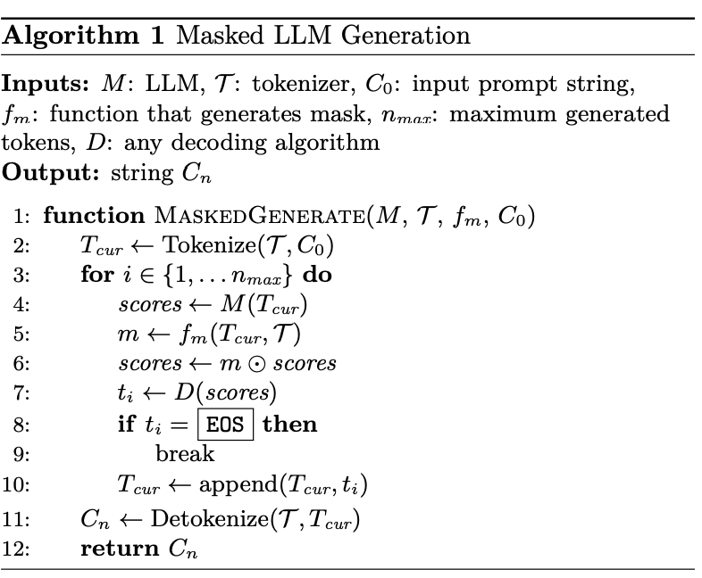

## Transformers

https://poloclub.github.io/transformer-explainer/

### Process

1.   **Embedding(Translation):** text -> tokends and vectors
     -   Decoder 一本巨大的字典，字典里每一个词都对应一串数字（向量）
2.   **Transformer Blocks (Thinking)**: model uses Self-Attention to look at all the words at once and figure out relationships (e.g., knowing that "bank" means a river bank, not a bank for money, based on context).
     -   Encoder 左顾右盼连接上下文
         -   Multi-Head Attention（多头注意力机制）——“开会讨论”
             -   $$\text{Attention}(Q, K, V) = \text{softmax}\left(\frac{QK^T}{\sqrt{d_k}}\right)V$$ ==> context vector
         -   Feed Forward（前馈神经网络）——“独立思考” ==>**MLP (Multi-Layer Perceptron)**
         -   Add & Norm（残差连接与归一化）
             -   Context vector 和 dictionary里的词的特征向量做一次匹配得到logits分数表之后，用softmax算概率，在sampling/selection部分syncode介入
     -   
3.   **Output Probabilities(The choice):** a ranked list of words the model *wants* to say next (a **Temperature** slider can make the model choose riskier, more creative words)
     -   温度低（冷）：它只敢选第一名，说话很严谨，但也无聊
     -   温度高（热）：它敢选第二、第三名的词，说话会变更有创意，或者……开始胡说八道

Q： **“Transformer 里的 MLP 是怎么运作的？”**

💡 回答：“它作用在每一个词（Token）上。在 Attention 搞清楚词与词的关系后，MLP **单独处理每一个词**，对它进行非线性的特征提取和转换。就像开完会后，每个人都要独立消化一下会议内容，把信息变成自己的知识。”

## Syncode

[Improving LLM Code Generation with Grammar Augmentation](https://ar5iv.labs.arxiv.org/html/2403.01632?_immersive_translate_auto_translate=1)

We implement our approach in a tool, SynCode, that can easily work with any programming language using a user-provided **context-free grammar (CFG)**. 保证语法Syntax正确

上下文无关文法提供了一种简单且数学上精确的机制，用于描述某些自然语言中短语如何由更小的块构建而成，从而自然地捕捉句子的“块结构”。

**Syncode Whole Working Structure**

1.  user prompt
    -   用户说：“给我写个 Python 函数。”
2.  llm generation
    -   LLM 想输出下一个词。比如它想输出 `def`（定义函数），概率很高
    -   
3.  Incremental Parser
    1.  **检查现状**：看看前面已经写了啥？（比如刚写了个空行）。
    2.  **预测未来（Accept Sequences）**：根据语法书，告诉系统：“接下来**必须**是 `def` 或者 `class` 或者 `import`，其他的都不行！”
4.  DFA Mask Store Lookup
    1.  拿着刚才预测的“合法路径”，去那个预先算好的大表里一查。
    2.  表里立刻返回一个**掩码（Mask）**：“在字典里第 5、10、300 号单词是合法的，其他全封杀。”
5.  Logits Masking
    -   把这个掩码盖在 LLM 的嘴上。LLM 原本想乱说的词都被堵回去了，只能乖乖吐出 `def`
6.  loop
    -   生成了 `def` 后，Parser 记下来，然后进入下一轮：“好了，现在写了 `def`，下一个词必须是函数名……”

| **(Term)**                               | Definition                                                   | **What to say**                                              |
| ---------------------------------------- | ------------------------------------------------------------ | ------------------------------------------------------------ |
| **CFG** (Context-Free Grammar)           | **语法规则书**。定义了什么是“正确的代码”。比如“括号必须成对出现”。 | “就是编程语言的**基本语法规则**，Syncode 必须遵守的法律。”   |
| **Terminal** (终结符)                    | **最小单位的词**。比如 `if`, `+`, `123`, `print`。不能再拆分了。 | “就是代码里的**具体单词或符号**，是语法树的叶子”             |
| **Non-terminal** (非终结符)              | **概念/占位符**。比如“表达式”、“语句”、“函数体”。它里面包含很多终结符。 | “代表一个**语法结构**，比如‘这里应该放一个函数定义’”         |
| **DFA** (Deterministic Finite Automaton) | **迷宫地图**。用来快速判断一个词符不符合规则的数学模型。     | “把复杂的语法规则转换成的**状态机图**，用来做快速匹配。”     |
| **Incremental Parser** (增量解析器)      | **记性好的监工** (inspector)。它不需要每次都重读全文，只读新加进来的词。 | “为了**速度**！它只解析新生成的 Token，不用从头跑，省时间。” |
| **DFA Mask Store**                       | **离线计算好的小抄**。这是 Syncode 的核心创新。              | “这是预先计算（Pre-computed）好的查找表，把复杂的语法检查变成了简单的查表操作，所以 Syncode **推理速度很快**。” |
| **Remainder** (残余部分)                 | **没写完的半个词**。比如想写 `print`，现在只写了 `pr`，`pr` 就是 Remainder。 | “就是**未完成的 Token**，需要留到下一步继续匹配，处理 Token 不对齐的问题。” |


```python
# 1. 导入工具
from syncode import Syncode

# 2. 载入模型（告诉它你要用什么语法，比如 'json' 或 'python'）
# 这里的重点是 grammar='json'，这就是给 AI 戴上的紧箍咒
model = Syncode(model="microsoft/phi-2", grammar='json', parse_output_only=True)

# 3. 问问题（Inference）
prompt = "请生成一个描述印度的 JSON"
output = model.infer(prompt)[0]

# 4. 打印结果
print(output)
```

[GitHub - structuredllm/syncode: Efficient and general syntactical decoding for Large Language Models](https://github.com/structuredllm/syncode)

Example:

1.  Define the grammar
2.  Load the Huggingface models

```python
syn_llm = Syncode(model=model_name, grammar='json', max_new_tokens=400)
# parse_output_only=True 只输出结果，没有结果前的提示，如你可以这么做。。。
# other paramters: log_level, max_new_token
messages = [
    {"role": "system", "content": "You are a chatbot who always returns a JSON object."},
    {"role": "user", "content": "can you give me a JSON object describing University of Illinois at Urbana-Champaign?"},
]
syn_llm.infer(messages)
```

Basic mathematical expressions

加减乘除数学公式解析

```txt
grammar = """
    ?start: expr

    // Level 1: Addition and Subtraction (Lowest Priority)
    // We refer to 'term' here, meaning "Go solve any multiplication first"
    ?expr: term
         | expr "+" term
         | expr "-" term

    // Level 2: Multiplication and Division (Higher Priority)
    // We refer to 'atom' here, meaning "Go get the numbers first"
    ?term: atom
         | term "*" atom
         | term "/" atom

    // Level 3: Atoms (Highest Priority)
    // This is the bottom of the tree
    ?atom: DEC_NUMBER
         | "(" expr ")"

    DEC_NUMBER: /0|[1-9]\\d*/i
    %ignore " "
"""
```

Date

```txt
grammar = """ start: month " " day 
              
              day: /[1-9]/ | /[1-2][0-9]/ | /3[0-1]/
              
              month: "January" | "February" | "March" | "April" | "May" | "June" | "July" | "August" | "September" | "October" | "November" | "December"
"""
```

| **Feature 特征**    | **Code 1 (Syncode class)**                                   | **Code 2 (SyncodeLogitsProcessor)**                          |
| ------------------- | ------------------------------------------------------------ | ------------------------------------------------------------ |
| **Complexity 复杂** | Low (3-4 lines of setup)                                     | Medium (Requires model/tokenizer setup)中等难度（需要设置模型/分词器） |
| **Control 控制**    | Limited to Syncode's arguments 参数                          | Full control over Model & Generation对模型拥有完全控制权     |
| **Input 输入**      | Raw Strings                                                  | Tokenized Tensors (`input_ids`)分词张量                      |
| **Output 输出**     | Decoded Strings 解码后的字符串                               | Raw Token IDs (requires `tokenizer.decode`)原始令牌 ID       |
| **Use Case 用例**   | Quick demos, simple apps, standalone usage快速演示、简易应用、独立使用 | integrating into existing AI pipelines, custom generation loops 集成到现有 AI 流程中，自定义生成循环 |

**“SynCode 既然要查语法，会不会让推理速度变慢很多？”**

>   💡 **回答：** “老师，这正是 SynCode 的精髓！它虽然要做语法检查，但它用了一个**取巧**的办法。 它把最耗时的计算（构建 DFA 地图）都**提前在离线阶段做完了**（Offline Pre-computation）。 在 AI 真正写代码的时候（Inference time），它只需要**查表**（Lookup），这非常快。 所以，它几乎不怎么拖慢速度，甚至因为避免了 AI 乱写废话，有时候反而更快！”

**“什么是 Token Misalignment（Token 对齐问题）？这是个难点吗？”**

>   💡 **回答：** “是个大难点。简单说就是 AI 的‘单词’（Tokens）和编程语言的‘单词’（Terminals）经常对不上号。 比如 Python 里的 ` return`（带缩进的返回），在 AI 眼里可能是一个 Token，但在语法书里是‘缩进’+‘关键字’两个东西。 SynCode 通过特殊的算法解决了这个问题，让它们能完美匹配，保证不会因为切词切错了而误报错误。”


## IterGen

[IterGen: Iterative Structured LLM Generation](https://ar5iv.labs.arxiv.org/html/2410.07295?_immersive_translate_auto_translate=1)

Users specify a context-free grammar in BNF for the target output language, guiding the LLM to adhere to the grammar's syntax.

In a code generation task, the IterGen program can move forward and backward by a *statement* or *expression*, rather than by a specific number of LLM tokens, and selectively resample fragments of the generation if they contain any semantic violation.

------

保证 semantic correct

Based on Syncode, add 3 more modules:

-   Symbol Position Map 符号位置映射图
    -   储存了 LR Parser 增量解析器的映射关系（什么token组成立一个什么单词）

-   Decoding Trace
-   KV Cache Management
    -   储存前文Transformer计算出的<特征标签, 内容>


Process

1.  user set goal
2.  forward 生成到下一个特定的语法节点
3.  view 检查语义
    1.  forward
    2.  backtrack 回退
4.  loop

| **专有名词 (Term)**                           | **简单解释 (Definition)**                    | **你的回答话术 (What to say)**                               |
| --------------------------------------------- | -------------------------------------------- | ------------------------------------------------------------ |
| **Iterative Generation** (迭代生成)           | **走走停停的生成方式**。                     | “不是一次生成到底，而是分步骤生成，每一步都可以检查和修正。” |
| **Backtracking** (回溯)                       | **倒车/撤销**。                              | “当发现生成的代码有逻辑错误（比如表名不存在）时，让 AI 回退到错误发生前，重新尝试。” |
| **Symbol-to-Position Mapping** (符号位置映射) | **翻译官**。把“语法概念”翻译成“Token 位置”。 | “解决了 Token Misalignment 问题。让我们能按‘语句’或‘变量’来回退，而不是按‘字符’回退。” |
| **Forward()**                                 | **前进指令**。                               | “IterGen 的 API，让 AI 生成直到遇到下一个特定的语法符号（比如生成完一个完整的 SQL 语句）。” |
| **Backward()**                                | **后退指令**。                               | “IterGen 的 API，让 AI 回退指定数量的语法符号（比如回退到上一个 WHERE 条件）。” |
| **Semantic Constraints** (语义约束)           | **逻辑规则**。                               | “SynCode 只能管语法（形式对不对），IterGen 可以管语义（内容对不对，比如变量有没有定义、隐私有没有泄露）。” |


IterGen 的作用： IterGen 就像给 AI 装了一个 “Ctrl+Z (撤销键)” 和 “方向盘”。 它允许我们在生成过程中，暂停一下，检查刚才写的内容对不对（比如查查数据库里有没有这张表）。如果不对，就倒车（Backtrack） 回去重写那一部分。


**Q1: "IterGen 和 SynCode 有什么区别？"**

**你的回答：** “**SynCode 是保镖**，只管语法（Syntax），保证代码不报错；**IterGen 是编辑**，管语义（Semantics），保证代码逻辑是对的。而且 IterGen 最大的特点是支持**回溯（Backtracking）**，写错了能改。” 


**Q2: "你提到了 Privacy Leak（隐私泄露），IterGen 怎么防止隐私泄露？"**

**你的回答：** “我们在生成过程中用 `view()` 函数实时检查。如果 AI 生成了一个像邮箱地址的东西，IterGen 会立刻拿去和敏感数据库比对。如果发现是真实用户的邮箱，就立刻调用 `backward()` 回退，逼着 AI 重写一个假的邮箱。” 


**Q3: "它怎么知道回退到哪里？"**

**你的回答：** 靠 **Symbol Position Map**。它动态记录了每个语法符号（比如‘Table Name’）对应的是哪一段 Token。所以我们可以精准地切掉错误的那一段。”


**Q4: "KVCache 在 IterGen 里有什么特殊作用？（读档）"**

“KV Cache 存储的是 Transformer 注意力层中**前序 Token 的 Key 和 Value 向量**。 它的作用是**以空间换时间**，避免在每一步生成时重复计算历史 Token 的注意力特征。 在 IterGen 中，通过对 KV Cache 的**切片管理（Cropping）**，实现了低成本的生成回溯，无需重新处理整个上下文。”


