# 计算机网络 Computer Network

> [!WARNING]
>
> ➢ 平时成绩 50% = 课程作业 7-8 次 + 课程实验 6 次 + 出勤+quiz 3-4 次
> ➢ 期末考试 50% (闭卷) 试卷为英文

> [!TIP]
>
> <https://zjucomp.net/docs/terms> 术语中英对照表

## 引言

> [!IMPORTANT]
>
> 本章目标
>
> 

### 初识互联网

网络的基本功能：传递信息

服务用什么区分？

- 功能、延迟、带宽、丢失率
- 端节点数目、服务接口
- 可靠性、实时/非实时等外特性

### 网络实例

计算机网络拓扑结构主要取决于它的通信子网

#### 网络分类（按地域规模）

- 个域网 PAN（ Personal Area Network ）：能在便携式消费电器与通信设备之间进行短距离通信的网络；覆盖范围一般在 10 米半径以内，如蓝牙耳机等
- 局域网 LAN（Local Area Network）：局部地区形成的区域网络，如企业网络；分布地区范围有限，可大可小，大到一栋建筑、小到办公室内的组网；电脑 WLAN 接入，打印机共享等等
- 城域网 MAN（Metropolitan Area Network ）：范围覆盖一个城市的网络
- 广域网 WAN（Wide Area Network）：覆盖很大地理区域，乃至覆盖地区和国家

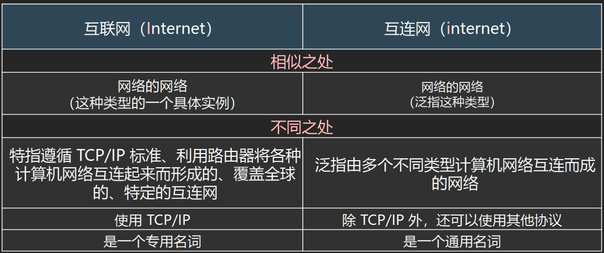

ISP：Internet 服务商

IXP 或 IX：互联网交换点

#### 网络组成

> [!NOTE]
>
> 计算机网络从逻辑功能上可划为通信子网和资源子网
>
> - 通信子网包括物理层、数据链路层和网络层，主要负责数据通信
> - 资源子网是 OSI 参考模型的上三层，传输层的主要任务是向高层用户屏蔽下面通信子网的细节(如网络拓扑、路由协议等)。

##### 网络边缘

**端系统**：位于互联网边缘与互联网相连的计算机和其他设备

- 端系统由各类主机(host)构成：桌面计算机、移动计算机、服务器、其他智能终端设备

##### 网络核心

由互联端系统的分组交换设备和通信链路构成的网状网络（网络+路由器）

**接入网**

- 接入网的目标是将主机连接到边缘路由器上
- 边缘路由器是端系统 Host 去往任何其他远程端系统的路径上的第一台路由器

*各种异构网络通过边缘路由器接入*

- 光纤到户 FTTH：Firber to the home
- 数字用户线 DSL：Digital Subscriber Line
- 同轴电缆：Cable
- 无线接入
  - 无线局域网 WLAN
  - 广域蜂窝接入网

传输单位：bit

> [!WARNING]
>
> 存储常用字节 Byte K/M/G 层级为 2^10 进制
> 传输常用比特 BitK /M/G 层级为 10^3 进制
>
> 1B = 8b （注意大小写）

**物理媒介**

- 是指发射机和接收机之间的具体链路介质
- 引导型介质：信号在固体介质中传播，例如铜、光纤、同轴电缆
- 非引导型介质：信号自由传播，包括无线电（陆地无线电、卫星无线电信道）、无线链路类型（无线局域网（WiFi）、广域（如 3/4/5G 蜂窝）蓝牙、地面微波、卫星）

**网络核心两大功能**


#### 数据交换方式

##### 分组交换（也称包交换 packet switching）

- 主机将数据分成分组，发送到网络，通信双方以分组为单位、使用**存储-转发**机制，实现数据交互的通信方式
- 网络将数据分组从一个路由器转发到下一个路由器，通过从源到目标的路径上的链路，逐跳传输抵达目的地
- 每个分组在互联网中独立的选择传输路径
- 支持灵活的统计多路复用 multiplexing
- 到达包的顺序和发送顺序可能不一致
- 附加信息开销大

##### 电路交换（circuit switching）

- 通信、传输时延小
- 资源预留，不会被抢占 -> 有序、性能有保障
- 容错性低（无法应对互联网中广泛存在的“突发”（Burst）流量）
- 资源利用不够充分

##### 存储转发的报文交换（Message switching）

- 路由器需要接收到完整的整个数据报文后，才能开始向下一跳发送
- 有传输延迟，不适合实时通信！
- 同一报文的不同分组可以经过不同的传输路径通过通信子网


总结：**分组交换在实际应用率最高**

### 协议和分层结构

分层协议 layered protocol

协议由语法、语义、同步三方面组成

协议是指在 **不同结点对等实体** 之间进行通信的规则或约定

#### 协议设计目的

- 可靠性、资源分配、拥塞问题、自适应性、安全问题

##### 统一标准

- 明晰简化，便于分析学习
- 各层独立，加速技术演进
- 统一接口，确保技术互通（interoperable）

##### 模块独立

##### 分层结构

不同机器上的同一层称为对等层，同一层的实体称为对等实体


发送端：层层封装；接收端：层层解封装

不同层对应协议数据单元（PDU Protocol Data Unit）


从顶层到底层，每一层 Header 往前加，后面（前一层的 header 等）都是数据

#### 服务原语

服务原语 Service Primitives：请求 request、指示 indication、响应 response、证实 confirmation

- 面向连接（电话系统）/无连接（邮政系统）


#### 服务与协议的关系

==协议是“水平”的，服务是“垂直”的==

➢ 实体使用协议来实现其定义的服务

➢ 上层实体通过接口使用下层实体的服务

### 参考模型

#### OSI 参考模型

OSI：Open Systems Interconnection

**7 层模型：从下到上，物理层、数据链路层、网络层、传输层、会话层、表示层、应用层**

服务、接口、协议

##### 物理层（Physical Layer）

定义如何在信道上 **传输比特** 0、1：Bits on the wire

处理信号通过介质的传输

##### 数据链路层 (Data Link Layer)

数据链路层的传输单位是帧；点到点通信

实现相邻（Neighboring）网络实体间的数据传输，保证数据正确的顺序与完整性

成帧（Framing）：从物理层的比特流中提取出完整的帧

物理地址（MAC address）：48 位，理论上唯一网络标识，烧录在网卡，不便更改

- 网卡实现的功能主要在物理层和数据链路层

*流量控制*，避免“淹没”（overwhelming）: 当快速的发送端遇上慢速的接收端，接收端缓存溢出

共享信道上的访问控制（MAC）：同一个信道，同时传输信号。

数据链路层协议有：SDLC、HDLC、PPP、STP

##### 网络层 (Network Layer)

网络层的传输单位是 **数据报**

将数据包跨越网络从源设备发送到目的设备（host to host）

路由（Routing）：在网络中选取从源端到目的端转发路径，常常会根据网络可达性动态选取最佳路径，也可以使用静态路由

服务质量（QoS）控制：处理网络拥塞、负载均衡、准入控制、保障延迟

- 提供面向连接的通信，支持无连接

网络层的控制主要面向运营商

> [!NOTE]
>
> 为什么除了 MAC 地址外，还有 IP 地址？不能用 MAC（网卡地址）寻址，路由器不知道网卡在哪；？？面向运营商（第一节课）

网络层的协议有：IP、IPX、ICMP、IGMP、ARP、RARP、RIP、OSPF 等

##### 传输层 (Transport Layer)

将数据从源端口发送到目的端口（**进程** 到进程）

传输层为终端用户提供 **端到端的数据传输控制**

- 提供面向连接的通信

两类模式：可靠的传输模式，或不可靠传输模式

- 可靠传输：可靠的端到端数据传输，适合于对通信质量有要求的应用场景，如文件传输等
- 不可靠传输：更快捷、更轻量的端到端数据传输，适合于对通信质量要求不高，对通信响应速度要求高的应用场景，如语音对话、视频会议等

传输层的协议有：TCP、UDP

##### 会话层 (Session Layer)

利用传输层提供的服务，在应用程序之间建立和维持会话，并能使会话获得同步

- 设置检验点，使通信双方在通信失效时可从检验点恢复通信

##### 表示层（Presentation Layer）

关注所传递信息的语法和语义，管理数据的表示方法，传输的数据结构

- 数据解密与加密、压缩、格式转换等

##### 应用层（Application Layer）

通过应用层协议，提供应用程序便捷的网络服务调用

提供用户和网络的接口

#### TCP/IP 参考模型

##### 链路层/网络接口层（Link Layer）

- 类似 OSI 的物理层和数据链路层，描述了为满足无连接的互联网络层需求，链路必须具备的功能

##### 互联网层/网际层（Internet Layer）

- 允许主机将数据包注入网络，让这些数据包独立的传输至目的地，并定义了数据包格式和协议（IPv4 协议和 IPv6 协议）
- 无连接的通信
- 主要功能有：路由选择

##### 传输层（Transport Layer）

- 允许源主机与目标主机上的对等实体，进行 **端到端的数据传输**：TCP，UDP
  - TCP：可靠、面向连接的协议
  - UDP：无连接，不保证可靠


##### 应用层（Application Layer）

- 传输层之上的所有高层协议：DNS、HTTP、FTP、SMTP

> [!NOTE]
>
> 先有 TCP/IP 协议栈，然后有 TCP/IP 参考模型
>
> 参考模型只是用来描述协议栈的
>
> ARPNET 最终采用 TCP 和 IP 为主要协议

#### OSI 模型 TCP/IP 模型对比

7 层模型与 4 层模型

- TCP/IP 模型的网络接口层定义主机与传输线路之间的接口，描述了链路为无连接的互联网层必须提供的基本功能

- TCP/IP 模型的互联网层、传输层与 OSI 模型的网络层、传输层大致对应

- TCP/IP 模型的应用层包含了 OSI 模型的表示层与会话层

➢ 基本设计思想：通用性与实用性

- OSI：先有模型后设计协议，不局限于特定协议，明确了服务、协议、接口等概念，更具通用性

- TCP/IP 模型：仅仅是对已有协议的描述

➢ 无连接与面向连接

- OSI 模型网络层能够支持无连接和面向连接通信
- TCP/IP 模型的网络层仅支持无连接通信（IP） 


> [!IMPORTANT]
>
> 本课程采用 5 层模型：物理层、数据链路层、网络层、传输层、应用层

#### 模型与网络实例


Host 上每个层都有

交换机不解析 IP 地址，只处理 MAC 地址

路由器处理网络地址（IP 地址） 

### 计算机网络度量单位

#### 速率/比特率(bit rate)

- 主机在数字信道上传送数据的速率，也称数据率
- 比特率的单位是 b/s(比特每秒)，也可以写为 bps，(bit per second)，或 kbit/s、Mbit/s、 Gbit/s 等

#### 波特率(baud rate)

- 码元传输速率，表示单位时间内数字通信系统所传输的码元数/每秒可能发送的信号变化次数（也称调制速率或符号速率 Symbol rate）
- 单位是波特 Baud，1 波特表示每秒传输 1 码元，若 1 码元携带 *n* 比特信息量，则波特率 *M* Baud 对应的比特率为 *Mn* b/s，表示该码元所需的不同离散值为 V = 2^n^个

#### 带宽(bandwidth)

- 网络中某通道传送数据的能力，即单位时间内网络中的某信道所能通过的“**最高数据率**”
- 单位是 bit/s，即 “比特每秒”
- $\text{带宽}=发送数据大小/传播时延$

#### 包转发率(PPS)

- 全称是 Packet Per Second(包/秒)，表示交换机或路由器等网络设备以包为单位的转发速率
- 线速转发（line speed）：交换机端口在满负载的情况下，对帧进行转发时能够达到该端口线路的最高速度

> [!NOTE]
>
> 在交换机上：大包和小包，哪个更容易实现线速？
>
> - 小的

#### 时延(Delay)

时延 (delay 或 latency) 是指数据（一个报文或分组）从网络（或链路）的一端传送到另一端所需的时间，也称为延迟

- **传输时延/发送时延(transmission delay)**：数据从结点进入到传输媒体所需要的时间

$$
\text{发送时延}=\text{分组长度}/\text{发送速率}
$$

- **传播时延(propagation delay)**：电磁波在信道中需要传播一定距离而花费的时间

$$
\text{传播时延}=\text{信道长度}/\text{电磁波在信道上的传播速率}
$$

- **处理时延(processing delay)**：主机或路由器在收到分组时，为处理分组（例如分析首部、提取数据、差错检验或查找路由）所花费的时间
- **排队时延(queueing delay)**：分组在路由器输入输出队列中排队等待处理所经历的时延 -> queue 不长不短最好

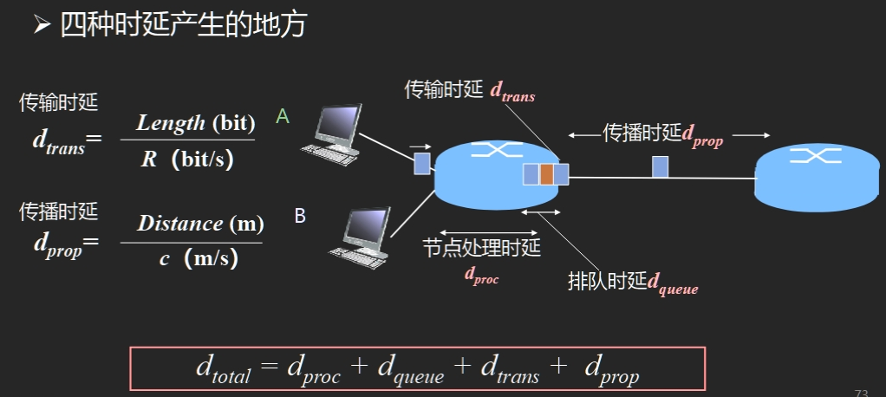

#### 往返时延 RTT(Round-Trip Time)

- 从发送方发送数据开始，到发送方收到来自接收方的确认，经历的总时间
- 可用于判断网络的通断性、测试网络时延、计算数据包丢失率等

#### 时延带宽积

$时延带宽积 = 传播时延 \times 带宽$，即按比特计数的链路长度

EG: 传播时延为 20ms，带宽为 10Mb/s，则：时延带宽积 = 20/1000 × 10×106 = 2 × 105 bit

吞吐量 throughput

有效吞吐量 goodput

信道利用率 Channel Utilization

丢包率

传输 m 个分组所需时间：$$T=(路由器数量+1)\times r + (m-1)\times r$$​，r = 分组大小/传输速率

----------------------------

EG1：

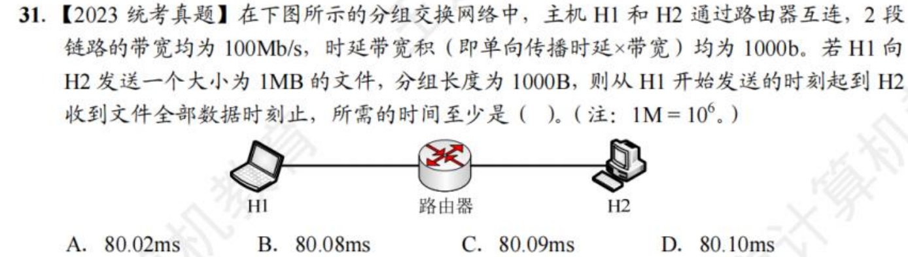


EG2：


 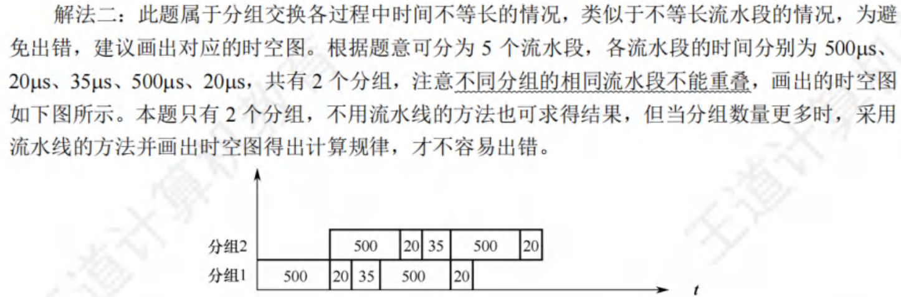

### 网络安全威胁

恶意软件、病毒、蠕虫

#### 拒绝服务攻击(Denial-of-Service (DoS) attack)

攻击者通过制造大量虚假流量占用资源

使合法流量无法使用资源(服务、带宽

#### 僵尸网络 （Botnet）

采用一种或多种传播手段，将大量主机感染 bot 程序（僵尸程序）病毒，从而在控制者和被感染主机之间所形成的一个可一对多控制的网络
➢ 分布式 DoS 攻击的发起者，往往通过僵尸网络发起攻击，从而躲避追查

#### 如何防御

➢ 身份验证：证明你就是你！
➢ 保密：加密技术
➢ 完整性检查：数字签名检测/防止篡改
➢ 访问限制：受密码保护的 VPN
➢ 防火墙：接入网络和核心网络中的专用“安全卫士”

### 标准化组织

ISO、ITO、IEEE、WFA、IETF、IRTF(Interent research of )

- RFC(request for comments)标准

### 互联网发展史与启示

1983 ARPANET 采用 TCP/IP——标志互联网诞生

### 其他

主机 A 给主机 B 发送数据的理论最高速率取决于链路带宽、主机 A/B 网卡速率的最小者

## 物理层

### 物理层基本概念

#### 物理层功能

**位置**：物理层是网络体系结构中的最低层

> [!WARNING]
>
> 不是连接计算机的具体物理设备，不是负责信号传输的具体物理媒体

**功能**：如何在连接各计算机的传输媒体上 *传输数据比特流*

**作用**：尽可能地 *屏蔽掉不同传输媒体和通信手段的差异*

#### 物理层特性

##### 物理层机械特性

涉及接口的物理结构，通常采用接线器来实现机械上的连接

**定义** 接线器的 **形状和尺寸、引线数目和排列、固定和锁定装置** 等

##### 物理层电气特性

规定了多条信号线的电气连接及有关电路特性

- 发送器和接收器的电路特性、负载要求、传输速率和连接距离等
- 如发送信号电平、发送器和接收器的输出阻抗、平衡特性等

##### 物理层功能特性

描述接口执行的功能，定义接线器的每一引脚(针，Pin)的作用

##### 物理层过程特性

指明对于不同功能的各种可能事件的出现顺序

#### 物理层标准及示例

**点对点通信线路** 用于直接连接两个结点

广播通信线路

### 数据通信基础

#### 数据通信基础理论

##### 傅里叶分析

任何一个周期为 T 的有理周期性函数 g(t) 可分解为若干项（可能无限多
项）正弦和余弦函数之和
$$
g(t)= c+\sum_{n = 1}^∞{a_nsin(2Πnft)}+\sum_{n = 1}^∞{b_ncos(2Πnft)}
$$
f = 1/T 基本频率，a~n~, b~n~ 为 n 次谐波项的正弦和余弦振幅值

##### 有限带宽信号

信号在信道上传输时的特性

- 对不同傅立叶分量的衰减不同，引起输出失真
- 信道有 **截止频率 fc** , 0 ~ fc 的振幅衰减较弱， fc 以上的振幅衰减厉害，这主要由信道的物理特性决定， **0 ~ fc 是信道的有限带宽**
- 实际使用时，可以接入滤波器，限制用户的带宽
- 通过信道的 **谐波次数 N 越多，信号越逼真**
EG：

#### 信道的最大数据传输速率

##### 奈魁斯特定理 Nyquist

**无噪声** 有限带宽信道的最大数据传输率公式

- 最大数据传输率 = $2Hlog_2V$​ (bps)
- 任意信号通过一个 *带宽为 Ｈ* 的低通滤波器，则 *每秒采样 2H 次（频率 Hz）* 就能完整地重现该信号（无损！），*信号电平分为 V 级*

--------------------------------------

EG：无噪声理想信道带宽 4MHz，QAM 调制，信道最大数据传输速率为 48Mb/s，则 QAM 调制方案是？

> $2Hlog_2V=48Mb/s$，H = 4MHz，算得 V = 64 ==> QAM-64

> [!NOTE]
>
> [Symbol rate vs. Data rate](# 波特率(baud rate))
>
> symbol 代表若干个比特，symbol rate 又叫波特率 baud rate
>
> data rate = symbol rate * bits per symbol 比特率 = 波特率 $\times$ 每码元所含的比特数
>
> **The modulation technique determines the number of bits/symbol**
>
> 调制技术决定了比特/符号的数量，提高传输速率 => 每个码元携带更多 bit => 多元调制

##### 信噪比

随机噪声出现的大小用 **信噪比**（**信号功率 S** 与 **噪声功率 N** 之比）来衡量

- 信噪比 $SNR$ = $10log_{10}S/N$​，单位：分贝 db
- 或 信噪比 $SNR$ = $S/N$ 没有单位

##### 香农定理 Shannon

带宽为 *H 赫兹*，*信噪比为 S/N* 的任意信道的 **最大数据传输率** 为：$$Hlog_2(1 + S/N)$$ (bps)

- 此式是利用信息论得出的，具有普遍意义
- 与信号电平级数、采样速度无关
- 此式仅是上限，难以达到

##### 信息量

一条消息包含信息的多少称为信息量

- 信息量的大小与消息所描述事件的出现概率有关
- 一条消息所荷载的 **信息量** 等于它所表示的事件发生的 **概率 p** 的倒数的对数 $I=log_a{\frac{1}{p}}=-log_ap$
  - a 表示进制，a = 2 时，I 的单位为比特；a = 自然数 e，I 的单位为奈特，通常用 **比特** 作为信息量的单位

#### 数据通信系统模型

信号是消息的载体

##### 传输方式

- 串行、并行
- 点到点/点到多点
- 交互方式：
  - 单工/单向（sender—> receiver，方向指定），需要一个信道
  - 半双工（双向但不能同时），需要两个信道，每个方向一个
  - 全双工（双向可同时），需要两个信道，每个方向一个

- 基带传输、频带传输

##### 数据编码技术/调制 digital modulation

1. **不归零制码**（NRZ：Non-Return to Zero）
   - 原理：用两种不同的电平分别表示二进制信息“0”和“1”，低电平表示“0”，高电平表示“1”
   - 缺点：难以分辨一位的结束和另一位的开始；发送方和接收方必须有时钟同步；若信号中“0”或“1”连续出现，信号直流分量将累加
   - 结论：容易产生传播错误
2. **曼彻斯特码**（Manchester），也称相位编码
   - 原理：每一位中间都有一个跳变，从低跳到高表示“0”，从高跳到低表示“1”
   - 优点：克服了 NRZ 码的不足。每位中间的跳变即可作为数据，又可作为时钟，能够自同步
   - 每个比特需要两个信号周期，信号率（波特率）是数据率的两倍，编码效率是 50%
3. **差分曼彻斯特码**（Differential Manchester）
   - 原理：每一位中间都有一个跳变，每位开始时有跳变表示“0”，无跳变表示“1”。位中间跳变表示时钟，位前跳变表示数据
   - 优点：时钟、数据分离，便于提取


- 曼彻斯特编码和差分曼彻斯特编码在每个码元的中间都发生电平跳变，相当于将一个码元一分为二，编码速率是码元速率的 2 倍，二者所占的频带宽度是原始基带宽度的 2 倍。

- 标准以太网使用的就是曼彻斯特编码，而差分曼彻斯特编码则被广泛用于宽带高速网中

#### 频带传输

**三种调制技术**：载波 Asin(ωt + φ)的三个特性 **幅度、频率、相位**

> 调制是把数字数据变成模拟信号

- 幅移键控法（调幅） Amplitude-shift keying (**ASK**)，幅移就是把频率、相位作为常量，而把振幅作为变量
- 频移键控法 （调频）Frequency-shift keying (**FSK**)，频移就是把振幅、相位作为常量，而把频率作为变量
- 相移键控法（调相） Phase-shift keying (**PSK**)，相移就是把振幅、频率作为常量，而把相位作为变量

PSK 又称 BPSK：使用了基准的正弦波和相位反转的波浪，使一方为 0，另一方为 1，从而可以同时传送接受 2 值(1 比特)的信息

QPSK：一种四进制相位调，制采用移相方式 QPSK，每个点 2 比特信息，具有良好的抗噪特性和频带利用率通信业

QAM（Quadrature Amplitude Modulation）：正交幅度调制是是一种数字调制方式，产生的方法有正交调幅法和复合相移，16QAM 是指包含 16 种符号的 QAM 调制方式（用 4 个 symbol）

- 在频率相同的前提下，将 AM 与 PM 结合起来，形成叠加信号。
- 设波特率为 B ，采用 m 个相位，每个相位有 n 种振幅，则该 QAM 的数据传输速率 R 为 $R =Blog_2( mn )$
  （单位为 b/s )

### 传输介质

#### 分类

##### 导引性介质 guided transmission media

指电磁波被导向沿着某一媒体传播，包括双绞线、同轴电缆、电力线和光纤等

**磁介质 magnetic tape**

- 顺序读写

- Bandwidth 带宽 = 800GB/tape × 1000 tapes/box / (24×60×60s) = 70+Gbps

- Cost = (800GB/tape × 1000tapes/box) / 5000\$ = 160GB/$

> Never underestimate the bandwidth of station wagon full of tapes hurtling down the highway. 带宽很大，但延迟多

**双绞线 twisted pair（网线）**

- 绞合密度、扭绞方向和绝缘材料等因素影响双绞线的特性阻抗、衰减和近端串扰
- 适用于模拟传输或数据传输，通信距离一般为几到几十公里
- 便宜、常见
- 局域网多采用双绞线作为传输介质
- Eg，UTP无屏蔽双绞线、FTP屏蔽双绞线、SFTP屏蔽金属箔双绞线、STP屏蔽双绞线

**同轴电缆 coaxial cable**

- 寿命长、容量大、传输稳定、外界干扰小、维护方便等优点
- 同轴电缆带宽高得益于它的高屏蔽性相比于双绞线

**光纤 fiber**

- 双层或多层同心园柱体（类似同轴电缆），由纤芯、包层和护套组成
- 三种实用光纤
  - 单模 纤芯直径很小，折射率分布属于突变型；带宽极大，适用于大容量远距离通信
    - 若光纤的直径减小到光一个波长的大小，则光沿直线传播
  - 多模突变 带宽较窄，适用于小容量短距离通信
  - 多模渐变 纤带宽较宽，适用于中容量中距离通信
    - 多模光纤传输信号的原理：光的全发射特性

- 光纤损耗和波长有关系，三个窗口

- 光纤损耗分为

  - 固有损耗指光纤材料的性质和微观结构引起的吸收损耗和瑞利散射损耗

  - 非固有损耗指杂质吸收、结构不规则引起的散射和弯曲幅射损耗等

- 优点：通信容量大、传输损耗小、抗干扰性好、保密性好、体积小、重量轻

**电力载波**

电力载波是电力系统特有的通信方式

- 利用现有电力线，通过载波方式将模拟或数字信号进行高速传输

- 交流电信号+信号 = 调制信号

优点：投资少、连接方便、传输速率高、安全性好和使用范围广

缺点：无法提供高质量的数据传输业务，如家庭电器产生的电磁波干扰等

##### 非导引性介质

指电磁波在大气层、外层空间或海洋中进行的无线传播，包括短波传输、地面微波、卫星微波、光波传输等

**短波传输（无线电波）**

100m～10m 波长长-> 绕射能力强-> 传播距离远

多径传播：短波电波通过若干条路径或者不同的传播模式由发信点到达收信点的长度不同，而引起由发信点到达收信点的时间不同的现象

多径时散：指不同路径的时延差；与路径长度、工作频率、昼夜、季节等因素有关

- 多径时散对数据通信的影响主要体现在码间干扰
- 为了保证传输质量，往往采用限制数据传输速率的措施

散射传输：利用大气层中传输媒体的不均匀性对无线电波的散射作用进行的超视距通信

**微波**

- 1m～1mm
- 多路复用、射频工作和中继接力是地面微波传输的三个最基本的工作特点
- 波长 m * 频率 Hz = 速度 m/s

**光波**

- 3×10^2^～60×10^4^μm

- 分类

  - 按照光源特性的不同，分为激光通信和非激光通信

  - 按照传输媒体的不同，分为大气激光通信和光纤通信

  - 按照传输波段的不同，光波通信分为可见光通信、红外线（光）通信和紫外线（光）通信


大气激光通信可传输语音、数据、图像等信息

- 具有抗干扰性好、设备轻便、保密性强、机动性

- 但使用时收、发天线相互对准较为困难，通信距离限于视距范围

- 易受气候影响，尤其在恶劣气候条件下会造成通信中断

**红外线**

不可见光，其波长范围 760nm~4.0*10^5^nm

### 无线与卫星通信

#### 无线

**无线传输：** 可以在自由空间利用电磁波发送和接收信号进行通信

**无线电波**：指在自由空间（包括空气和真空）传播的射频频段的电磁波


#### 卫星通信（不做很高的要求）

利用人造地球卫星作为中继站，转发或反射无线电波，在两个或多个地球站之间进行的通信

特点

- 传播时延长，从一个地球站经卫星到另一个地球站的电波传播传播时间约需 240～280ms（可取 270ms） 
- 传播损耗大，达 200dB 左右
- 受大气层的影响大
- “面覆盖”式的传播信道

卫星通信的缺点

- 传输时延大：500 毫秒~800 毫秒的时延

- 高纬度地区难以实现卫星通信

- 为了避免各卫星通信系统之间的相互干扰，同步轨道的星位是有一点限度的，不能无限制地增加卫星数量

- 太空中的日凌现象和星食现象会中断和影响卫星通信

**移动卫星通信**

静止轨道~

中轨道~

低轨道~(LEO)

- 信号传输时延小
- 地面终端设备简单、造价低，是手持式终端的最佳方式
- 卫星造价低、发射容易

### 中继器

中继器可以用来连接不同介质的局域网（速率、协议要相同）

中继器原理：信号再生

中继器作用：加强基带信号（用于传输的数字信号）

分层中继系统

- 物理层
  - 转发器
  - 集线器 Hub：多端口、半双工，所有端口属于一个冲突域
- 数据链路层
  - [网桥或交换机](# 链路层交换机)
- 网络层
  - [路由器](# 工作原理)
- 网络层以上
  - 网关

### 其他

两个网段在物理层进行互连时要求：数据传输速率必须相同

**冲突域** 是同一时间内只能有一台设备发送信息的范围，**广播域** 是能接收收到广播信号的设备范围。

## 数据链路层

> [!NOTE]
>
> （一）数据链路层的功能
>
> （二）组帧
>
> （三）差错控制
>
> - 检错编码；纠错编码
>
> （四）流量控制与靠传输机制
>
> - 流量控制、可靠传输与滑动窗口机制；停止 ﹣ 等待协议；
> - 后退 N 帧协议（ GBN )；选择重传协议（ SR )
>
> （五）介质访问控制
>
> 1. 划分：频分复用、时分复用、波分复用、码分复用
> 2. 随机访问： ALOHA 协议； CSMA 协议； CSMA / CD 协议； CSMA / CA 协议 3． 轮询访问：令牌传递协议
>
> （六）局域网
>
> - 局域网的基本概念与体系结构；
> - 以太网与 IEEE 802.3; IEEE802.11 无线局域网； 
> - VLAN 的基本概念与基本原理
>
> （七）广域网
>
> - 广域网的基本概念； PPP 协议
>
> （八）数据链路层设备
>
> - 以太网交换机及其工作原理

> [!IMPORTANT]
>
> 本章目标
>
> 


### 数据链路层的设计问题

#### 数据链路层在协议栈中的位置

向下：利用物理层提供的位流服务

向上：向网络层提供明确的 (well-defined) 服务接口


#### 数据链路层的功能

**成帧（Framing）**

- 将比特流划分成“帧”的主要目的是为了检测和纠正物理层在比特传输中可能出现的错误，数据链路层功能需借助“帧”的各个域来实现

**差错控制（Error Control）** 

- 处理传输中出现的差错，如位错误、丢失等

流量控制（Flow Control） （重点前两个）

- 确保发送方的发送速率，不大于接收方的处理速率
- 避免接收缓冲区溢出

#### 数据链路层提供的服务

**无确认无连接**（ Unacknowledged connectionless ） 

- 接收方不对收到的帧进行确认

- 适用场景：误码率低的可靠信道；实时通信（延迟低）

- 网络实例：以太网

**有确认无连接**（ Acknowledged connectionless ） 

- 每一帧都得到单独的确认

- 适用场景：不可靠的信道（无线通信）

- 网络实例：802.11

**有确认有连接**（ Acknowledged connection-oriented ） 

- 适用场景：长延迟的不可靠信道，例如卫星通信

> [!NOTE]
>
> 有连接就一定要有确认，即不存在无确认有连接的服务

#### 成帧 framing

在数据前后都添加首部和尾部，构成帧，帧是数据链路层的传输单元


**定界符** 标识一个帧的开始

- **字节计数法**（ Byte count ） ：无差错传输的情形，现实中很少用（多米诺骨牌式错误

  - 

- **带字节填充的定界符法**（ **Flag bytes** with **byte stuffing**）

  - 定界符：一个特殊的字节，比如 01111110，即 0x7E，用于区分前后两个不同的帧
  - 发送发将数据（有效载荷）中加入 *转义字符* 加以区分
    
  - 接收方逐个检查收到的每一个字节
    - 收到 ESC，则后一字节无条件成为有效载荷，不予检查
    - 收到 FLAG，则为帧的边界

  > 不足：overhead 开销大、效率低

- **带比特填充的定界符法**（ **Flag bits** with **bit stuffing** ）

  - 定界符：两个 0 比特之间，连续 6 个 1 比特，即 01111110，0x7E
  - 发送方在数据（有效载荷）中出现连续 5 个 1 比特，则直接插入 1 个 0 比特 --> *数据中不会出现定界符*
  - 接收方若出现连续 5 个 1 比特
    - 若下一比特为 0，则为有效载荷，直接丢弃 0 比特
    - 若下一比特为 1，则连同后一比特的 0，构成定界符，一帧结束

- **物理层编码违例**（ Physical layer coding violations ）

  - 核心思想：选择的定界符不会在数据部分出现
  - 和曼彻斯特编码有关联 ？？


#### 差错控制

链路层存在的一个问题：信道的噪声导致数据传输问题

- 差错（ incorrect ）：数据发生错误

- 丢失（ lost ）：接收方未收到

- 乱序（out of order）：先发后到，后发先到

- 重复（repeatedly delivery）：一次发送，多次接收

✋🏻 解决方案：差错检测与纠正、确认重传

- 确认：接收方校验数据（差错校验），并给发送方应答，防止差错

- 定时器：发送方启动定时器，防止丢失

- 顺序号：接收方检查序号，防止乱序递交、重复递交

#### 流量控制

链路层存在的另一个问题：接收方的处理速率

- 接收方的接收缓冲区溢出

✋🏻 解决方案

- 基于反馈 (feedback-based) 的流量控制

- 接收方反馈，发送方调整发送速率

- 基于速率 (rate-based) 的流量控制

- 发送方根据内建机制，自行限速

### 差错检测和纠正

通常采用增加冗余信息（或称校验信息）的策略

- 示例：每个比特传三份，如果每比特的三份中有一位出错，可以纠正

#### 检错码（error-detecting code） 

在被发送的数据块中，包含一些冗余信息，但这些信息只能使接收方推断是否发生错误，但不能推断哪位发生错误，接收方可以请求发送方重传数据

- 主要用在 **高可靠、误码率较低** 的信道上，例如光纤链路
- 偶尔发生的差错，可以通过重传解决差错问题

#### 纠错码（error-correcting code)

发送方在每个数据块中加入足够的冗余信息，使得接收方能够判断接收到的数据是否有错，并能纠正错误（*定位出错的位置*） 

- 主要用于 **错误发生比较频繁** 的信道上，如无线链路
- 也经常用于物理层，以及更高层（例如，实时流媒体应用和内容分发）
- 使用纠错码的技术通常称为 *前向纠错*（FEC，Forward Error Correction)

**码字 (code word)**：一个包含 m 个数据位和 r 个校验位的 n 位单元，描述为 (n, m) 码，n = m+r

**码率 (code rate)**：码字中不含冗余部分所占的比例，可以用 m/n 表示

#### 海明距离 (Hamming distance)

给定 m 的条件下，纠正单个错误所需校验位数的下限：$m+r+1≤2^r$

- m 为消息位个数，r 为校验位个数

**两个码字的海明距离**：两个码字之间不同对应比特的数目

- 例：0000000000 与 0000011111 的海明距离为 5 
- 如果两个码字的海明距离为 d，则需要 d 个单比特错就可以把一个码字转换成另一个码字 

**一种编码方案（code）的海明距离**

- 该编码方案中 **任意** 两个 **合法** 码字的 **最小** 海明距离

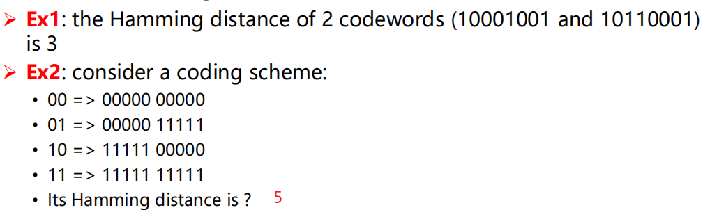

==The error-detection and error-correcting properties of a code depend on its Hamming distance.== 代码的错误检测和纠错特性取决于其海明距离


To use Hamming distance to correct *d* errors: you need *2d*+1 Hamming distance code. 用海明距离 **纠正 d 个错误需要 2d+1 个距离码**

-----------------


图 3-6 纠正 1 位错误的海明码：海明距离为 3，可以纠正 1 个错误或者检测两个错误

#### 典型检错码

常用的检错码包括：

- 奇偶检验 (Parity Check)：1 位奇偶校验是最简单、最基础的检错码
- 校验和 (Checksum)：主要用于 TCP/IP 体系中的网络层和传输层
- 循环冗余校验 (Cyclic Redundancy Check，CRC)：数据链路层广泛使用的校验方法，crc 只能检错不能纠错


##### 奇偶校验

1 位奇偶校验：增加 1 位校验位，**可以检查奇数位错误** --> 1 个 bit 的错误

- n-1 个信息位+1 位检验位
- 偶校验：保证 n 个码字中 1 的个数为偶数个
- 奇校验：保证 n 个码字中 1 的个数为奇数个

##### 校验和

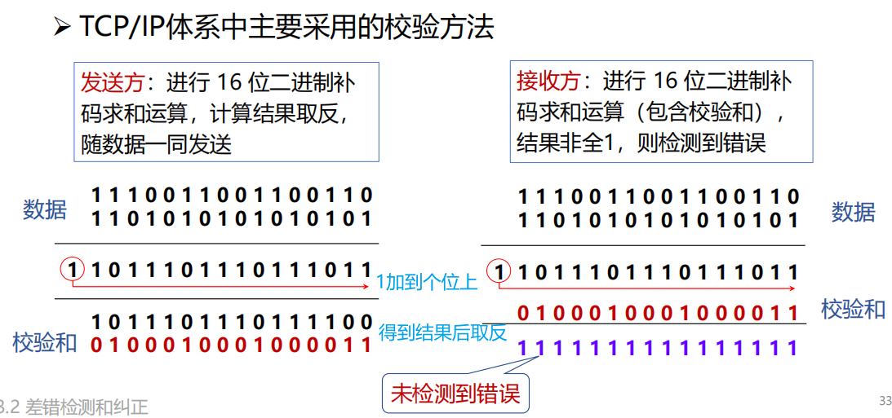

对首部的每个 16bit 按反码运算求和再取反码

##### 循环冗余校验 CRC

cyclic redundancy code


余数 R，作为 FCS

CRC 有纠错功能，但是数据链路层只用了它的检错功能

> [!NOTE]
>
> 

#### 海明码 hamming code

有效信息 n 位，检验位 k 位，满足：$n+k≤2^k-1$​

纠错 1 位


纠正

 


按列发，每行最多错一位，可以纠正

[最通俗易懂的海明码校验纠错讲解_海明码纠错-CSDN 博客](https://blog.csdn.net/hamster204/article/details/90748043)


#### 卷积码 Convolutional Code

​						

#### Trellis diagram

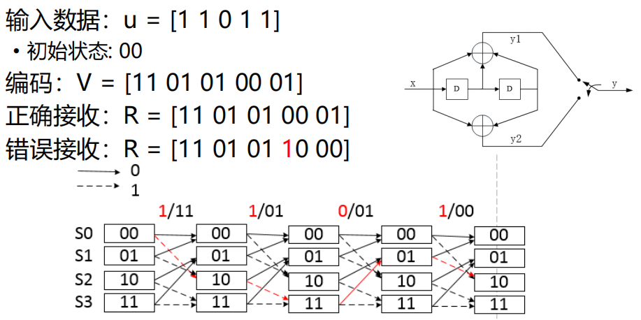

> 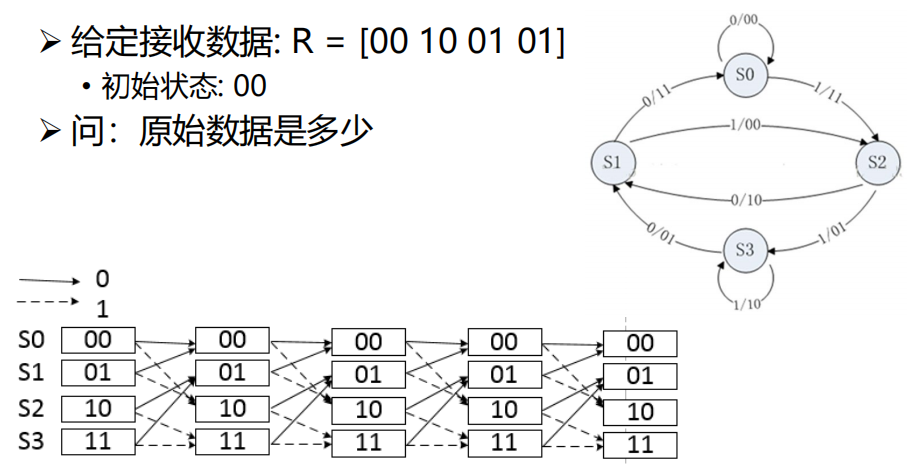
>
> S0-> S2-> S3-> S1 输出 state 00 11 01 01 原始数据：0 1 1 0

### 基本的数据链路层协议

#### 关键假设

✋🏻 分层进程独立假设

- 网络层、数据链路层、物理层为独立的进程

- 进程间通过传递消息实现通信

✋🏻 提供可靠服务假设

- 提供可靠的、面向连接的服务

- 数据链路层发送的数据随时可向网络层获得

✋🏻 只处理通信错误假设

- 仅处理通信错误

- 假设机器不会崩溃，不考虑断电、重启等引起的问题

#### 基本的协议定义


#### 乌托邦式单工协议

假设

- 单工（Simplex）协议：数据单向传输

- 完美信道：帧不会丢失或受损

- 始终就绪：发送方/接收方的网络层始终处于就绪状态

- 瞬间完成：发送方/接收方能够生成/处理无穷多的数据

✋🏻 乌托邦：完美但不现实的协议

- 不处理任何流量控制或纠错工作

- 接近于无确认的无连接服务，必须依赖更高层次解决上述问题


#### 无错信道单工停止-等待协议

不再假设

- 接收方能够处理以无限高速进来的数据

- 发送方以高于接收方能处理到达帧的速度发送帧，导致接收方被“淹

没”(overwhelming)

✋🏻 仍然假设

- 通信信道不会出错（Error-Free） 

- 数据传输保持单向, 但是需要双向传输链路（半双工物理信道）


#### 有错信道单工停止-等待协议

➡️ 假设

- 通信信道可能会出错，导致：

− 帧在传输过程中可能会被损坏，接收方能够检测出来

− 帧在传输过程中可能会丢失 ，永远不可能到达接收方

➡️ 一个简单的解决方案

- 发送方增加一个 *计时器(timer)*，如果经过一段时间没有收到确认，发送方将超时，于是再次发送该帧

stop and wait


**效率的评估**

F = frame size (bits) 
R = channel capacity (Bandwidth in bits/second)
I = propagation delay + processor service time (second)

- 每帧发送时间 (Time to transmit a single frame) = F/R

- 总延迟 (Total Delay) = D = 2I

- 停止等待协议的发送工作时间是 F/C，空闲时间是 D 

当 F < D 时：==信道利用率 (line utilization)= $\frac{F}{F+R·D}$ < 50%==

#### 停等协议的性能问题

✋🏻 停止-等待机制降低了信道利用率

- 设数据速率记为 R，帧长度记为 F，往返延迟记为 D，则采用停-等协议的线路效率为：F/(F+R·D)

- 假如将链路看成是一根管道，数据是管道中流动的水，那么在传输延迟较长的信道上，停-等协议无法使数据充满管道，因而信道利用率很低

✋🏻 解决办法

- 流水线协议或管道协议：允许发送方在没收到确认前连续发送多个帧

### 滑动窗口协议

用于流量控制

#### 滑动窗口协议

窗口机制：发送方和接收方都具有一定容量的缓冲区（即窗口），发送端在收到确认之前可以发送多个帧

目的：

- 对可以连续发出的最多帧数（已发出但未确认的帧）作限制

✋🏻 序号使用

- 循环重复使用有限的帧序号

✋🏻 流量控制：接收窗口驱动发送窗口的转动

- 发送窗口：其大小记作 W~T~，表示在收到对方确认的信息之前，可以连续发出的最多数据帧数

- 接收窗口：其大小记作 W~R~ ，为可以连续接收的最多数据帧数

对于窗口大小为 n 的滑动窗口，其发送窗口的大小最大为 n-1，即最多有 n-1 帧已发送但没有被确认

✋🏻 **累计确认**：不必对收到的分组逐个发送确认，而是对按序到达的最后一个分组发送确认

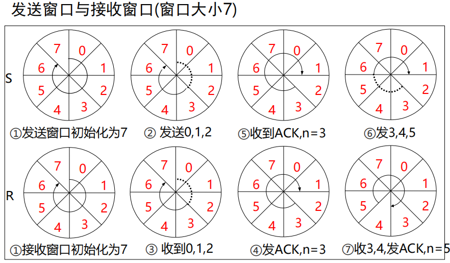

收到，前窗口后移，后窗口不动；发出确认后，后窗口才后移

#### 停止-等待协议

发送方每次只能发一个帧，当发送方收到接收方的确认帧之后，才能发生下一个帧

从滑动窗口角度看，停止-等待协议的发送窗口和接收窗口大小均为 1

- 超时重传

- 信道利用率 U 很低

$$
U =\frac{T_D}{T_D+RTT+T_A}
$$
发送时延 T~D~，接收时延 T~A~，往返时延 RTT

#### 回退 N 协议(GBN)（协议 5）

##### 协议原理分析

出错全部重发

- 当接收端收到一个出错帧或乱序帧时，丢弃所有的后继帧，并且不为这些帧发送确认

- 发送端超时后，重传所有未被确认的帧

- 一般有累计确认的机制

✋🏻 适用场景

- 该策略对应接收窗口为 1 的情况，即只能 **按顺序接收帧**

✋🏻 优缺点

- 优点：连续发送提高了信道利用率

- 缺点：按序接收，出错后即便有正确帧到达也丢弃重传


##### 协议的实现分析


#### 选择重传协议 select and repeat(SR)（协议 6）

若发送方发出连续的若干帧后，收到对其中某一帧的否认帧，或某一帧的定时器超时，则 **只重传该出错帧或计时器超时的数据帧**

该策略对应接收窗口大于 1 的情况，即暂存接收窗口中序号在出错帧之后的数据帧

- 优点：避免重传已正确传送的帧
- 缺点：在接收端需要占用一定容量的缓存

##### 基本原理

- 在发送过程中，如果一个数据帧计时器 **超时**，就认为该帧丢失或者被破坏；**接收端只把出错的的帧丢弃，其后面的数据帧保存在缓存中**，并向发送端回复 NAK；发送端接收到 NAK 时，**只重传出错的帧**

- 如果 **落在窗口内的帧** 从未接受过，那么存储起来，等比它序列号小的所有帧都正确接收后，按次序交付给网络层

- 接收端收到的数据包的顺序可能和发送的数据包顺序不一样，因此在数据包里必须含有 **顺序号** 来帮助接收端进行排序。

- **没有累计确认的机制**

滑动窗口长度

- 发送窗口的尺寸：$$W^T ≤2^{n-1}$$​​, 发送窗口应等于或小于序号空间的一半
- 接收窗口小于等于发送窗口 $$W^R ≤2^{n-1}$$

##### 协议实现分析

发送方必须响应的三件事

- 上层的调用：检测有没有可以使用的序号，如果有就发送
- 收到 ACK：如果收到的是最小序号的 ACK，窗口滑动。如果收到其他序号的 ACK，进行标记
- 超时事件：每个 PDU 都有定时器，哪个超时重传哪个


- 超时重传时间 RTO应略大于加权平均往返时间 RTT~S~
  - 新的 RTT~S~  =(1- α) ×(旧的 RTT~S~)  + α× (新的 RTT 样本) ，α =0.125（推荐值）

### 数据链路协议实例

#### 点到点链路层协议 PPP（Point to Point Protocol）

PPP 协议是目前使用最多的数据链路层协议之一

能够在不同的链路上运行；能够承载不同的网络层分组

特点：简单、灵活

##### PPP 协议实现的功能

PPP 协议无须使用 CSMA/CD 协议，没有最短帧长的限制，信息段占 0\~1500 字节，而不是 46\~1500 字节

- PPP 不使用序号和确认机制，只保证无差错接收（ CRC 检验），因此是 **不可靠服务**
- PPP 只支持全双工的点对点链路，不支持多点线路
- PPP 的两端可以运行不同的网络层协议，但仍可使用同一个 PPP 进行通信
- PPP 是面向字节的，所有 PPP 帧的长度都是整数个字节

##### PPP 协议未实现的功能

帧数据的纠错功能

- 数据链路层的 PPP 协议 **只进行检错**，PPP 协议是**不可靠**传输协议

流量控制功能

- PPP 协议未实现点到点的流量控制

可靠传输功能

- PPP 为 **不可靠协议**，不使用帧的序号。不可靠网络中可能使用有序号的工作方式

多点连接功能

- PPP 协议不支持多点线路，**只支持点对点** 的链路通信

单工和半双工链路

- PPP 协议支持全双工链路

##### PPP 协议的构成


封装 (Encapsulation)

- 提供在同一链路上支持不同的网络层协议
- PPP 既支持异步链路（无奇偶检验的 8 比特数据），也支持面向比特的同步链路
- IP 数据包在 PPP 帧中是其信息部分，其长度受到 MTU 的限制

链路控制协议 LCP (Link Control Protocol)。 

- 用来建立、配置和测试数据链路的链路控制协议，通信双方可协商一些选项

网络控制协议 NCP (Network Control Protocol)。 

- 其中每个协议支持一种不同的网络层协议，如 IP、OSI 的网络层、DECnet、AppleTalk 等

##### PPP 协议的帧格式

PPP协议中的透明传输

- 当 PPP 用在异步传输时，使用一种特殊的字符填充法
- 当 PPP 用在同步传输链路时，协议规定采用硬件来完成比特填充（与HDLC 的做法类似）

1.字节填充

避免在信息字段中出现和 **标志字段** 一样的比特组合（FLAG 为 0X7E） 

当 PPP 使用 **异步传输** 时，定义 **转义字符** 0X7D，并使用字节填充（ESC 为 0X7D）

- 将信息字段中出现的 0x7E 字节转变成为 2 字节序列(0x7D, 0x5E)

2.零比特填充

PPP 协议用在 SONET/SDH 链路时，使用 **同步传输**（一连串的比特连续传送），不是异步传输（逐个字符地传送）

> 异步传输是面向字符的传输，而同步传输是面向比特的传输

#### PPPoE

Ethernet 优点：原理简单，应用非常广，设备成本低

Ethernet 缺点：安全性较低、不宜管理：使用广播信道，造成了安全性较低，无认证功能

PPP 优点：

- 原理简单
- 安全性高：点对点信道，提供认证机制
- 提供良好的访问控制和计费功能

==> 结合变成 PPPoE(Point-to-Point Protocol over Ethernet)

- 提供在以太网链路上的 PPP 连接
- 实现了传统以太网不能提供的身份验证、加密，以及压缩等功能
- 实现基于用户的访问控制、计费、业务类型分类等，运营商广泛支持
- PPPoE 使用 Client/Server 模型，服务器通常是接入服务器


## 介质访问子层 MAC

> [!IMPORTANT]
>
> 本章目标
>
> 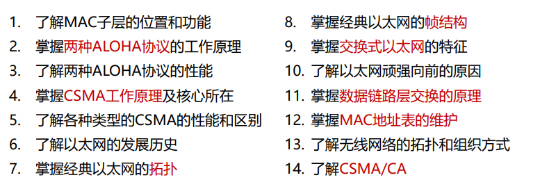


> 介质访问子层在数据链路层的下面

### 信道分配问题


#### 子信道的平均延迟


**信道 N 等分后每个子信道平均延迟时间会增加**（有害，增加 N 倍

#### 静态分配的特点

问题：资源分配不合理


### 多路复用技术

**复用 (multiplexing)** 技术的目的是：允许用户使用一个共享信道进行通信，避免相互干扰，降低成本，提高利用率。

#### 频分复用(FDM)

频分复用（Frequency-division multiplexing），是一种将多路基带信号调制到不同频率载波上，再进行叠加形成一个复合信号的多路复用技术

- 适合传输模拟信号

频分复用的所有用户在同样的时间 *占用不同的带宽资源*（请注意，这里的“带宽”是 **频率带宽** 而不是数据的 **发送速率**）

#### 正交频分复用(OFDM) （细节不用掌握）

正交频分复用（Orthogonal Frequency Division Multiplexing，OFDM)

- 将信道分成若干正交子信道
- 将高速数据信号转换成并行的低速子数据流，调制到在每个子信道上进行传输

问题：

Wideband (e.g., 10MHz) ==> short symbol time (e.g., 0.1µs) 

- Delay spread caused by multipath transmission: about 1µs ==> 0.1µs << 1µs ==> severe inter-symbol interference (ISI)

解决方法：

Divide the wideband into many narrow bands, each with a carrier (i.e., subcarrier)宽带变窄带

For example：10MHz --> 100 subcarriers --> symbol time 10µs --> 10µs >> delay spread (1µs) --> smaller ISI

- Multi-carrier modulation 

#### 时分复用(TDM)与统计时分复用(STDM)

**时分复用** (Time Division Multiplexing) 是将时间划分为一段段等长的时分复用帧

- 每一个时分复用的用户在每一个 TDM 帧中占用固定序号的时
- 每一个用户所占用的时隙是周期性地出现（其周期就是 TDM 帧的长度）的。
- TDM 信号也称为等时 (isochronous) 信号。
- 时分复用的所有用户在 *不同的时间* 占用 **同样的频带宽度**
- 适合传输数字信号
- 必须满足的要求
  - 介质的位速率（每秒传输的二进制位数）＞ 单个信号的位速率
  - 介质的带宽（所能传输的最高频率与最低频率之差）＞ 结合信号的带宽（所有信号经过调制后形成的复合信号的带宽）

- **存在的不足：** 使用时分复用系统传送计算机数据时，由于计算机数据的突发性质，用户对分配到的子信道的利用率一般是不高的

---------------------

**统计时分复用**（STDM，statistical time division multiplexing）是指动态地按需分配共用信道的时隙，只将需要传送数据的终端接入共用信道，以提高信道利用率的多路复用技术

#### 波分复用(WDM)

**波分复用**（Wavelength Division Multiplexing，WDM）是利用 *多个* 激光器在 *单条* 光纤上同时发送 *多束不同波长激光* 的技术，频分复用的一种形式

#### 码分复用(CDMA)

又称 码分多址 (Code Division Multiple Access，CDMA)是指利用码序列相关性实现的多址通信 , 基本思想是靠 **不同的地址码** 来区分的地址

- 各用户使用经过特殊挑选的不同码型，因此彼此不会造成干扰
- 这种系统发送的信号有很强的抗干扰能力，其频谱类似于白噪声，不易被敌人发现


**码片序列的正交关系**

正交就是向量 S 和 T 的规格化内积 (inner product) 等于 0


**码片序列实现了扩频(spread spectrum)**

假定 S 站要发送信息的数据率为 *b* bit/s。由于每一个比特要转换成 *m* 个比特的码片，因此 S 站实际上发送的数据率提高到 *mb* bit/s，同时 S 站所占用的频带宽度也提高到原来数值的 *m* 倍


#### 空分复用


### 多路访问协议

#### 随机访问协议

##### ALOHA 协议

**纯 ALOHA**

原理：想发就发

特点：随时可能冲突，冲突就要重发

帧时：发送一个标准帧需要的时间

S 吞吐量：在发送时间 T 内发送成功的平均帧数，0 < S < 1

生成帧均值：2G (G：网络负载)

冲突危险期：2D (D：单向传播延迟)

$P_0$​ 成功传输概率：连续两个时间 T 内都没有生成其它帧的概率

$P_0=e^{-2G}$

纯 ALOHA 协议的性能较低：（吞吐率最大）18.4%

--------------------

**分隙 ALOHA(slotted ALOHA)**

原理：每个时隙开始时才能发送帧，发送一帧的时间 ≤ 时隙的长度

冲突危险期：D

分隙 ALOHA 协议的性能：（吞吐率最大）36.8%


##### 载波侦听多路访问协议(CSMA)

CSMA：Carrier Sense Multiple Access

特点：“先听后发” -> 改进 ALOHA 的侦听/发送策略分类

---------------------------

**非持续式 CSMA**

特点：

① 经侦听，如果介质空闲，开始发送

② 如果介质忙，则等待一个随机分布的时间，然后重复步骤 ①

- 好处：等待一个随机时间可以减少再次碰撞冲突的可能性

- 缺点：等待时间内介质上如果没有数据传送，这段时间是浪费的

---------------------

**持续式 CSMA**

特点：

① 经侦听，如介质空闲，则发送

② 如介质忙，持续侦听，一旦空闲立即发送

③ 如果发生冲突，等待一个随机分布的时间再重复步骤 ①

- 好处：持续式的延迟时间要少于非持续式
- 缺点：如果两个以上的站等待发送，一旦介质空闲就一定会发生冲突

-------------------

**p-持续式 CSMA**

特点：

① 经侦听，如介质空闲，那么以 p 的概率发送，以 **(1–p)的概率** 延迟一个时间单元发送

② 如介质忙，持续侦听，一旦空闲重复 ①

③ 如果发送已推迟一个时间单元，再重复步骤 ①

> [!NOTE]
>
> 冲突窗口


##### CSMA/CD

载波监听多路访问/冲突检测（CSMA/CD）是 CSMA 协议的改进方案

工作流程：先听后发，边听边发，冲突停发，随机重发

- 采用 CSMA/CD 协议的以太网只能进行**半双工**通信

- 采用 [截断二进制指数退避算法](# 二进制指数后退( Binary exponential backoff ) 的 CSMA/CD)

- 广泛用于无线局域网的 CSMA/CD 协议修改了冲突检测部分，使用 [冲突避免](# CSMA/CA)（CA，collision avoidance）——降低冲突发生的概率

- 争用期：以太网端到端往返传输时间

- **最短帧长 = 总线传播时延 ✖ 数据传输速率 ×2 = W × RTT(往返时延，也是争用期)**
  - 数据传输速率 ↑，发送帧时间缩短，通过增加最短帧长，增加发送帧时间，或者缩短电缆长度，减少争用期时间，以达到 发送帧时间 ≥ 争用期时间

- 题目

  

  

#### 受控访问协议

无冲突协议

##### 位图协议（预留协议）

竞争期：在自己的时槽内发送竞争比特

- 举手示意
- 资源预留

传输期：按序发送

- 明确的使用权，避免了冲突


##### 信道利用率分析

假设

- 有 N 个用户，需 N 个时隙，每帧 d 比特

信道利用率

- 在低负荷条件下：d/(d+N) （N 越大，站点越多，利用率越低）
- 在高负荷条件下：d/(d+1)，接近 100%

缺点

- 位图协议无法考虑优先级

##### 令牌

令牌环（Token Ring，IEEE802.5）

令牌：发送权限

令牌的运行：发送工作站去抓取，获得发送权

• 除了环，令牌也可以运行在其它拓扑上，如令牌总线

发送的帧需要目的站或发送站将其从共享信道上去除；防止无限循环

令牌环网络中，当一个站点收到自己发出去的数据帧后，它将不再转发该帧，并重新产生一个令牌

- 优点：令牌环网络各站轮流使用令牌发送数据，无论网络负载如何，都无冲突产生
- 缺点：令牌的维护代价


##### 二进制倒计数协议

站点：编序号，序号长度相同

竞争期：有数据发送的站点从高序号到低序号排队，高者得到发送权

特点：==高序号站点优先==


> **防止低序号站点一直抢不到发送权，可以怎样办？**
>
> 换编号 overhead

##### 信道效率分析

N 个站的二进制编码所需位数是 $$log_2N$$ 位 

信道的利用率为：$$d/(d+log_2N)$$

如果规定每个帧的帧头为发送地址，即竞争的同时也在发送。则效率为 100%


#### 有限竞争协议

##### 自适应树搜索协议(Adaptive Tree Walk Protocol)


#### 无线 LAN 协议

MACA

### 以太网

> [!IMPORTANT]
>
> 以太网参考模型一般只包括 物理层和数据链路层，提供无连接不可靠的服务

#### 经典以太网

##### 经典以太网的物理层

最高速率 10Mbps

✋🏻 使用曼彻斯特编码

✋🏻 使用同轴电缆和中继器连接

任意两个收发器之间距离不得超过 2.5km（和 CSMA/CD 的 delay 有关

且任意两个收发器之间经过的中继器不能超过 4 个以保证 MAC 协议正常工作

##### MAC 子层协议

<span style="color:#CC0000;"> 介质访问控制（MAC 子层）的主要功能是控制和协调所有站点对共享介质的访问 </span> <span style="color:#FF0000;"> </span>

主机运行 CSMA/CD 协议

常用的以太网 MAC 帧格式有两种标准 ： 

- DIX Ethernet V2 标准（最常用的）

- IEEE 的 802.3 标准

- 数据字段长度必须在 46~1500 字节之间，＜46 需要填充，否则不用


##### 二进制指数后退( Binary exponential backoff )的 CSMA/CD

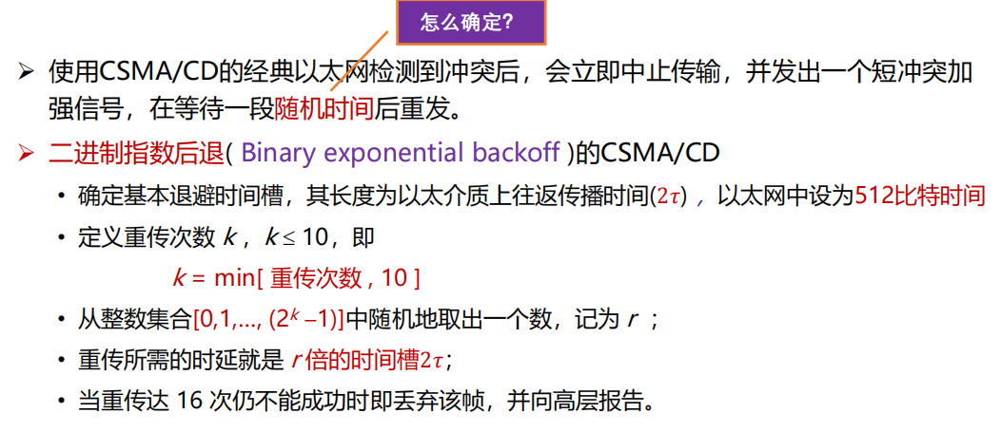

- 这一算法考虑了网络负载对冲突的影响

- 数字 r 小的优先（先发送）

$$
P = F/B\text{，F 为帧长，B 为带宽}\\
信道效率 = \frac{P}{P + 2𝜏/A}
\text{，传送一帧平均需要 P 秒，某个站获得信道的概率为 A，2𝜏 为时间槽}\\
信道效率 =\frac{1}{1 + 2BLe/cF}
\text{，L 为电缆长度，c 为信号传播速度；假设每帧 e 个竞争时间槽}
$$

电缆越长，𝜏 越大，任何两个站之间的最大电缆距离会影响性能

在给定帧长的情况下，增加带宽或距离会降低网络效率


？？

#### 交换式以太网


#### 快速以太网

**Fast Ethernet**( IEEE 802.3u, 1995 )

带宽：10Mbps -> 100Mbps

比特时间：100ns -> 10ns （电缆的最大长度降低到十分之一）

保留原来的工作方式（帧格式、接口、过程规则）

> [!NOTE]
>
> 名称中 100Base-T 意味着 100Mbps 的以太网， T 是双绞线，Base 是基带传输

##### 千兆以太网

**Gigabit Ethernet**( IEEE 802.3ab, 1998 )

100Mbps -> 1000Mbps( 1Gbps )

保留原来的工作方式（帧格式、接口、过程规则）

**全双工和半双工** 两种方式工作

- 在半双工方式下使用 CSMA/CD （*为了向后兼容*），增加 **载波扩充** 和 **帧突发**
- 全双工方式不需要使用 CSMA/CD（*缺省方式*）

##### 万兆以太网

**10-Gigabit Ethernet**( IEEE 802.3ae, 2002 )

1Gbps -> 10Gbps

**只支持全双工，不再使用 CSMA/CD**

保持兼容性

重点是超高速的物理层

#### 以太网的未来

优势：灵活性、简单性、兼容性、廉价、可靠、易维护、易扩展

### 数据链路层交换

#### 数据链路层交换原理

物理层设备扩充网络 => 扩大了冲突域，性能降低，安全隐患!

数据链路层设备扩充网络

- **网桥或交换机**
- 网桥/交换机分隔了冲突域，但不隔离广播域；集线器都不隔离


----------------------

理想的网桥是透明的。

- 即插即用，无需任何配置
- 网络中的站点无需感知网桥的存在与否

##### MAC 地址表的构建-逆向学习源地地址

主机向外发送数据时，其 MAC 地址就会被学习

- 记录帧的源 MAC 地址与该帧进入交换机的接口号


MAC 地址表的构建

- 增加表项：帧的源地址对应的项不在表中

- 删除表项：**老化时间** 到期，默认 300s

- 更新表项：帧的源地址在表中，更新时间戳

> [!NOTE]
>
> **MAC 地址表会满而溢出吗？是不是存在安全隐患？**
>
> 会，是，因为可以伪造 MAC 地址，真正有效的站点没办法被转发，被导向到别的站点

##### 网桥对于入境帧的处理过程（forwarding、filtering、flooding）

1. **Forwarding（转发）**


2. **Filtering（过滤）**


3. **Flooding（泛洪）**


两种目的地址的帧，**需要泛洪**：

- **广播帧**：目的地址为 `FF-FF-FF-FF-FF-FF` 的数据帧
- **未知单播帧**：目的地址不在 MAC 地址转发表中的单播数据帧

##### 总结

逆向学习

- 根据帧的 **源地址** 在 MAC 地址表查找匹配表项，
- 如果没有，则 **增加** 一个新表项（源地址、入境端口、帧到达时间），
- 如果有，则 **更新** 原表项的帧到达时间，重置老化时间。

网桥对入境帧的转发过程（三选一），查帧的 **目的地址** 是否在 MAC 地址表中

- 如果有，且入境端口 ≠ 出境端口，则从对应的出境端口 **转发帧**； 
- 如果有，且入境端口 = 出境端口，则丢弃帧（即 **过滤帧**）；
- 如果没有，则向除入境端口以外的其它所有端口 **泛洪帧**。

#### 链路层交换机

##### 交换方式

###### 从带宽的角度

- 对称交换：出和入的带宽相同
- 非对称交换：出和入的带宽不同

###### 从转发时机的角度

**存储转发模式**（Store and Forward） 

- 特点：转发前必须接收 **整个帧**、执行 CRC 校验
- 缺点：延迟大
- 优点：不转发出错帧、支持非对称交换


**直通模式**（Cut-through）

- 特点：一旦接收到 **帧的目的地址**，就开始转发
- 缺点：可能转发错误帧、不支持非对称交换
- 优点：延迟非常小，可以边入边出


**无碎片模式**（Fragment-free）

- 特点：接收到帧的 **前 64 字节**，即开始转发
- 缺点：仍可能转发错误帧，不支持非对称交换
- 优点：过滤了冲突碎片，延迟和转发错帧介于存储转发和直通交换之间


> [!NOTE]
>
> 小于 64 字节的帧一定是以太网中冲突导致的


#### 生成树协议

可靠传输：冗余拓扑

付出的代价：导致物理环路

##### 物理环路引发的问题

1. **广播风暴**：交换机（网桥）在物理环路上无休止地泛洪广播流量，无限循环，迅速消耗网络资源
2. **重复帧**：X 发送到环路的单播帧，造成目的设备 Y 收到重复的帧（假设所有交换机的 MAC 地址表中均没有路由器 Y 的 MAC 地址）
3. **MAC 地址表不稳定**：当一个帧的多个副本到达不同端口时，交换机会不断修改同一 MAC 地址对应的端口

##### 生成树网桥

参与的交换机（网桥）：收发桥协议数据单元 BPDU


**生成树的三个选举过程**：

(1) 选举 **根桥**(Root Bridge)


> [!NOTE]
>
> **如何比较桥 ID 大小？**
>
> - 首先比较优先级，优先级数值最小的交换机胜出成为根桥。
>
> - 如果优先级数值相等，MAC 地址最小的交换机成为根桥。

(2) 为每个非根桥选出一个 **根端口**（Root Port）


根路径开销


(3) 为每个网段确定一个 **指定端口**（Designated Port）


**重构生成树**


重新构建生成树太慢了，怎么办？

- **快速生成树协议（Rapid Spanning Tree Protocol, RSTP）** 
- RSTP 是 STP 的优化版，在 IEEE802.1W 中定义；

#### 虚拟局域网（VLAN）

**广播域（Broadcasting Domain）** 

- 广播域是广播帧能够到达的范围；
- 缺省情况下，交换机所有端口同属于一个广播域，无法隔离广播域； 
- 广播帧在广播域中传播，占用资源，降低性能，且具有安全隐患


--------------------

交换机可以分隔广播域吗？

- 可以！支持 VLAN 的交换机
- 一个 VLAN（Virtual LAN）是一个独立的广播域
- **交换机/路由器通过划分 VLAN，来分隔广播域**

**VLAN** 是一个在物理网络上根据用途，工作组、应用等来 *逻辑划分* 的局域网络，*与用户的物理位置没有关系*。

虚拟局域网是通过软件方式实现逻辑分组和管理。

- 不同 VLAN 的成员不能直接进行二层通信
- 不同 VLAN 的成员通信需要通过三层设备

##### 基于端口的 VLAN（最常见） 


##### 基于 MAC 地址的 VLAN


##### 基于协议的 VLAN

通常需要服务器的参与

##### 基于子网的 VLAN

一个子网就是一个 VLAN

---------------------

如何区分不同 VLAN 的数据帧？

- 在数据帧中携带 VLAN 标记；
- VLAN 标记由交换机添加/剥除，对终端站点透明

**标记帧（Tagged Frame）** 


##### VLAN 优点

有效控制广播域范围：广播流量被限制在一个 VLAN 内；

增强网络的安全性：VLAN 间相互隔离, 无法进行二层通信, 不同 VLAN 需通过三层设备通信；

灵活构建虚拟工作组：同一工作组的用户不必局限于同一物理范围；

提高网络的可管理性：将不同的业务规划到不同 VLAN 便于管理

##### Access 链路类型端口

##### Trunk 链路类型端口与 Trunk 链路


### 无线局域网 WLAN

#### 无线局域网概述

**无线局域网（Wireless Local Area Network，WLAN)**：指以无线信道作为传输介质的计算机局域网

- 所有站点共享较高的带宽
- 较低的时延和较低的误码率
- 可广播可多播

#### 无线局域网组网模式

##### 无线局域网体系结构

基础架构模式（有固定基础设施）

- 分布式系统（DS） 
- **访问点（AP）** 
- 站点（STA） 
- **基本服务集（BSS）** 
- 扩展服务集（ESS） 
- 站点之间通信通过 AP 转发

**自组织模式（Ad hoc）** 无固定基础设施

- 站点（STA）
- 独立基本服务集（IBSS）
- 站点之间直接通信
- 共享同一无线信道

##### 802.11 物理层


#### 802.11 介质访问控制

传输范围..？


##### CSMA/CA

带有冲突避免的 CSMA **Carrier Sense Multiple Access with Collision Avoid**

- 当信道空闲时间大于 IFS（帧间隙），立即传输
- 当信道忙时，延迟直到当前传输结束+IFS 时间
- 开始随机退后过程
  - 从（0，CWindow）中选择一个随机数作为退后计数器（backoff counter） 
  - 通过侦听确定每个时间槽是否活动
  - 如果没有活动，则减少退后时间（计数器--）
  - 退后计数器为 0，则发送整个帧并等待确认
- ==退后过程中如果信道忙，则挂起退后过程==（解决站点之间的公平问题） 
- 在当前帧传输结束后恢复退后过程

> [!NOTE]
>
> **使用退后过程延迟发送的目的**：避免多个站点同时传输引起的冲突
>
> **CWindow**：竞争窗口

WIFI 采用停等机制


- 越短的帧间隙，越能抢到信道

##### RTS-CTS 机制（可选机制） 

目的：**通过信道预约，避免长帧冲突**

- 发送端发送 RTS（request to send） 

- 接收端回送 CTS（clear to send） 
- RTS 和 CTS 中的持续时间（Duration）中指明传输所需时间（数据+控制）
- 其他相关站点能够收到 RTS 或（和）CTS，维护 NAV(Network Allocation Vector)，静默期
- 虚拟载波侦听（Virtual Carrier Sense） 
- RTS 和 CTS 帧很短，即使产生冲突，信道浪费较少

采用 PTS-CTS 会使网络通信效率有所下降，但与数据帧相比开销不算大

-------------------------------------

如何应对无线链路较高的出错率 **？** 

- 解决方法：采用 **较小的帧**（将用户数据帧分段的机制对用户透明）


#### 802.11 帧结构


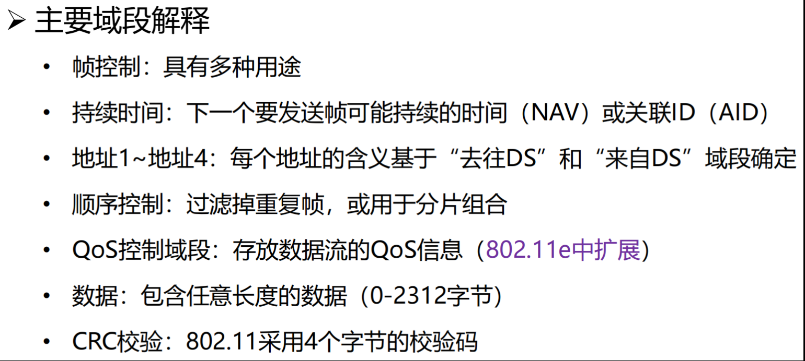

802.11 帧首部地址


#### 无线局域网的构建与管理

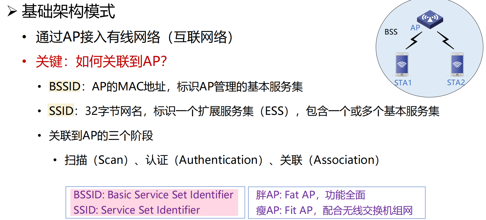

**被动扫描**

- AP 周期性发送 Beacon 帧，站点在每个可用的通道上扫描 Beacon 帧

**主动扫描**

- 站点依次在每个可用的通道上发出包含 SSID 的 Probe Request 帧，具有被请求 SSID 的 AP 返回 Probe Response 帧 


**关联过程**

- 身份认证获得通过后， 进入关联阶段
- 站点向 AP 发送关联请求（Association Request） 
  - 包含：Capability, Listen Interval, SSID, Supported Rates
- AP 向站点返回关联响应（Association Response） 
  - 包含：Capability, Status Code, Station ID, Supported Rates
- AP 维护站点关联表，并记录站点的能力（如能够支持的速率等）


**站点睡眠管理**

- 目的：延长电池的续航时间

#### Wi-Fi6 核心技术概览

Wi-Fi 6 (*802.11ax*) 核心目标：解决网络容量和传输效率问题、降低传输时延，相对于 Wi-Fi 5，在高密部署场景中将用户平均吞吐量提升 4 倍以上，并发用户数提升 3 倍以上


### 广域网 WAN

Wide Area Network

广域网和局域网所使用的协议不同

广域网所使用的传输方式是存储转发式

- 网状结构
- 与局域网的互联通过路由器实现


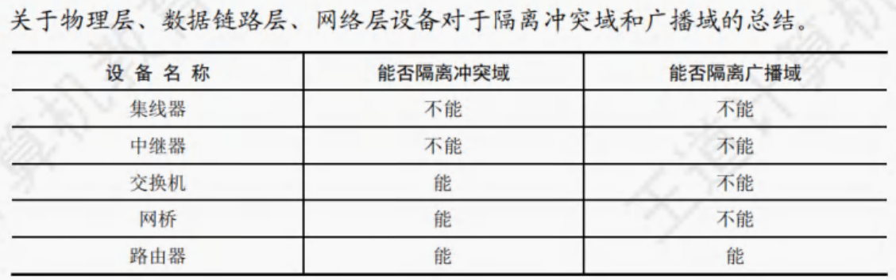

## 网络层 🔥

> [!IMPORTANT]
>
> 本章目标
>
> 

### 网络层服务

#### 网络层服务概述


网络层实现端系统间的 **多跳传输**

网络层功能存在每台主机和路由器中

- 发送端：将传输层数据单元封装在数据包中
- 接收端：解析接收的数据包中，取出传输层数据单元，交付给传输层
- 路由器：检查数据包首部，转发数据包

#### 网络层的关键功能

##### 路由（控制面）

选择数据从源端到接收端

- 核心：<span style="color:#CC0000;"> 路由算法与协议 </span>

##### 转发（数据面）

将数据报从路由器的输入接口传送到正确的输出接口


#### 提供给传输层的服务

> [!NOTE]
>
> **网络层** 提供可靠性，**面向连接**（虚电路）
>
> **端系统** 提供可靠性，**面向无连接**（数据报）

##### 面向连接的虚电路

面向连接服务：如打电话，面向连接也 **不一定能保证数据传输的可靠性**

- 通信之间 **先建立逻辑连接**：在此过程中，如有需要，可以预留网络资源

- 结合使用可靠传输的网络协议，保证所发送的分组无差错按序到达终点
  - 可靠 ==> 本身就可实现差错控制


**虚电路**(virtual circuit)是逻辑连接

- 虚电路表示这只是一条 **逻辑上的连接**，分组都沿着这条逻辑连接按照 **存储转发** 方式传送，而并不是真正建立了一条物理连接
- 注意，电路交换的电话通信是先建立了一条真正的连接， 因此 *分组交换的虚连接和电路交换的连接只是类似，但并不完全相同*
- 不是临时性的，可以有永久性虚电路

虚电路的 **转发策略**：虚电路转发决策基于分组标签，即虚电路号

面向连接的服务：1. 建立连接 2. 发送数据 3. 释放连接

- 当网络中某个结点/链路出现故障，所有经过该节点/链路的虚电路都将遭到破坏

##### 无连接的数据报

数据报（datagram）：无连接的方法

无连接的方法允许分组有选择不同路径的可能性，但这样可能会导致接收数据的失序；需要说明的是，为避免增加额外的开销进行数据排序，网络并不会完全随意地发送数据，在大多数情况下，仍然是会尽量沿着某一条路径发送

无连接服务：如寄信，不需要提前建立连接如寄信

**数据报服务**

- 网络层向上只提供 **简单灵活无连接** 的、**尽最大努力交付** 的数据报服务
- 发送分组时不需要先建立连接，每个分组独立发送
- 数据报独立转发，相同源-目的的数据报可能经过不同的路径
- 网络层 **不提供服务质量** 的承诺

尽力而为交付

- 传输网络 **不提供端到端的可靠传输服务**：丢包、乱序、错误
- 优点：网络的 **造价大大降低，运行方式灵活**，能够适应多种应用

数据报 **转发策略**：数据报转发决策基于分组的目的地址

- 对故障适应力强：当网络中某个结点/链路出现故障，可相应地更新转发表，寻找另一条路径转发分组
- 收发双方不独占某条链路，资源利用率较高

#### 虚电路和数据报网络的比较


##### 性能角度

EG，假设总带宽 100Mbps，有 2 个数据源共享带宽

1. 如果每个数据源按 50Mbps 的恒定速率发送数据，使用 *虚电路服务*，结果如何？

   > 带宽不浪费，每个数据源发送数据的带宽都可被保证

2. 如果每个数据源都是突发流量，且最高可达 70Mbps，使用 *虚电路服务*，结果如何？

   > 不能满足！
   >
   > 只能选择丢掉一部分数据 或者 按预留带宽提供服务，若频繁流量突发，必定导致频繁过载

3. 如果每个数据源都是 **突发流量**，且最高可达 70Mbps，使用 *数据报服务*，结果如何？

   > 性能完全不受影响，也不会过载

##### 效率角度


EG，假设不考虑 A 的发送时延和链路传播时延，在上图 3 个转接节点的情况下，链路上的数据传输速率 $B$ bps，每个分组的长度 $P$ bit，每个分组的开销 $H$ bit，虚电路分组交换的呼叫建立时间 $S$ s，每个转接点的转接延迟时间 $D$​ s，则：

- 虚电路分组交换总时延 $T=S+3[D+(P+H)/B]$

- 数据报分组交换总时延  $T=3[D+(P+H)/B]$​

  

### Internet 网际协议(IP)

#### IPv4

提供的是**不可靠无连接**的服务

##### 报文格式

每个字段的含义必须知道


1. **版本**：占 4 位。指 IP 的版本，IPv4 数据报中该字段值是 4。
2. **首部长度**：占 4 位。以 4B 为单位，最大可表示的首部长度为 60B(15x4B)。最常用的首部长度是 $20B$(5x4B)，该字段值是 5，此时不使用任何可选字段。
3. **区分服务**Differentiated services 字段（8 bit）
4. **总长度**：占 16 位。指首部和数据之和的长度，单位为字节，因此数据报的最大长度为 2^16^-1 = 65535B。**以太网帧的最大传送单元（ MTU ）为 1500B**，因此当一个 IP 数据报封装成帧时，数据报的总长度（首部加数据）一定不能超过下面的数据链路层的 MTU 值。
5. **标识**：占 16 位。它是一个计数器，每产生一个数据报就加 1，并赋值给标识字段。但它并不是 "序号"（因为 IP 是无连接服务）。当一个数据报的长度超过网络的 MTU 时，必须分片，此时每个数据报片都 **复制一次标识号**，以便能正确地重装成原来的数据报。
6. **标志**（ Flag )：占 3 位。标志字段的最低位为 MF , MF = 1 表示后面还有分片， MF = 0 表示最后一个分片。标志字段中间的一位是 DF ，只有当 DF = 0 时才允许分片。
7. **片偏移**：占 13 位。它指出较长的数据报在分片后，某片在原数据报中的相对位置，片偏移以 8B 为偏移单位。除最后一个分片外，每个分片的长度一定是 8B 的整数倍。
8. **生存时间**（ TTL )：占 8 位。数据报在网络中可通过的路由器数的最大值，标识数据报在网络中的寿命，以确保数据报不会永远在网络中循环。路由器在转发数据报前，先将 TTL 减 1。若 TTL 被减为 0，则该数据报必须丢弃。
9. **协议**：占 8 位。指出此数据报携带的数据使用何种协议，即数据报的数据部分应上交给哪个协议进行处理，如 TCP 、 UDP 等。其中值为 6 表示 TCP ，值为 17 表示 UDP 。
10. **首部检验和**。占 16 位。它只检验数据报的首部，但不包括数据部分。这是因为数据报每经过一个路由器，都要重新计算首部检验和（有些字段，如生存时间、总长度、标志、片偏移、源 ／ 目的地址都可能发生变化）。不检验数据部分可减少计算的工作量。[校验和的计算方式](# 校验和)
11. **源地址字段**：占 4B，标识发送方的 IP 地址。
12. **目的地址字段**：占 4B，标识接收方的 IP 地址。


##### 数据包分片

**MTU**（Maximum Transmission Unit）：最大传输单元，链路层数据帧能承载的最大数据量

**分片策略**

- 允许途中分片：根据下一跳链路的 MTU 实施分片

- 不允许途中分片：发出的数据报长度小于路径 MTU（路径 MTU 发现机制）

**重组策略**

- 途中重组，实施难度太大

- **目的端重组**（互联网采用的策略）

- 重组所需信息：原始数据报编号、分片偏移量、是否收集所有分片


DF（Don't Fragment），MF（More Fragment）

- DF = 0，该 IP 数据报才可以被分片
- MF = 1，相应原始数据包还有后续的片；MF = 0，最后一个片


##### IP 地址

IP 地址，网络上的每一台主机（或路由器）的每一个接口都会分

配一个全球唯一的 32 位的标识符

✋🏻 将 IP 地址划分为固定的类，每一类都由两个字段组成

✋🏻 网络号相同的这块连续 IP 地址空间称为地址的前缀，或网络前缀

IP 地址::={<网络号>, <主机号>}

唯一标识

**特殊地址**


- C 类网络最多有 $2^8-2(\text{主机位全0和全1两种情况})=254$ 台主机/路由器，同理 A 类 B 类

##### 子网划分

**子网划分(subnetting)**，在网络内部将一个网络块进行划分以供多个内部网络使用，对外仍是一个网络

**子网(subnet)**，一个网络进行子网划分后得到的一系列结果网络称为子网

**子网掩码(subnet mask)**，与 IP 地址一一对应，是 32 bit 的二进制数，**置 1 表示网络位，置 0 表示主机位**

- 子网划分减少了 IP 地址的浪费、网络的组织更加灵活、便于维护和管理
- 子网减少了广播域的大小


主机 IP 和子网掩码逐位进行 AND 得到子网的网络地址

- 点对点链路，意味着主机号只要两位（两个主机 IP+网络地址+广播地址）

##### 无分类编址 CIDR

无分类域间路由选择（Classless Inter-Domain Routing）

- 将 32 位的 IP 地址划分为前后两个部分，并采用 **斜线记法**，即在 IP 地址后加上“/”，然后再写上网络前缀所占位数
- 与传统分类 IP 地址的最大区别是网络前缀的位数不固定


> **Question**
>
> 
>
> 1. **Organization A:** 1024 addresses → 2^10^
>    - Subnet size: /22 (1024 addresses)
>    - Starting IP: **202.101.0.0/22**
>      - Range: 202.101.0.0 to 202.101.3.255
> 2. **Organization B:** 2000 addresses → 2^11^
>    - Subnet size: /21 (2048 addresses)
>    - Starting IP: **202.101.4.0/21**
>      - Range: 202.101.4.0 to 202.101.11.255
> 3. **Organization C:** 2000 addresses → 2^11^
>    - Subnet size: /21 (2048 addresses)
>    - Starting IP: **202.101.12.0/21**
>      - Range: 202.101.12.0 to 202.101.19.255
> 4. **Organization D:** 4096 addresses → 2^12^
>    - Subnet size: /20 (4096 addresses)
>    - Starting IP: **202.101.20.0/20**
>      - Range: 202.101.20.0 to 202.101.35.255
> 5. **Organization E:** 512 addresses → 2^9^
>    - Subnet size: /23 (512 addresses)
>    - Starting IP: **202.101.36.0/23**
>      - Range: 202.101.36.0 to 202.101.37.255
>
> Summary
>
> - **Organization A:** 202.101.0.0/22 (1024 addresses)
> - **Organization B:** 202.101.4.0/21 (2048 addresses)
> - **Organization C:** 202.101.12.0/21 (2048 addresses)
> - **Organization D:** 202.101.20.0/20 (4096 addresses)
> - **Organization E:** 202.101.36.0/23 (512 addresses)

##### 最长前缀匹配

最长前缀匹配（Longest prefix match） 

✋🏻 CIDR 可变长子网掩码以及路由聚合，需要最长前缀匹配来实现最精确匹配

✋🏻 IP 地址与 IP 前缀匹配时，总是选取 ==子网掩码最长的匹配项==

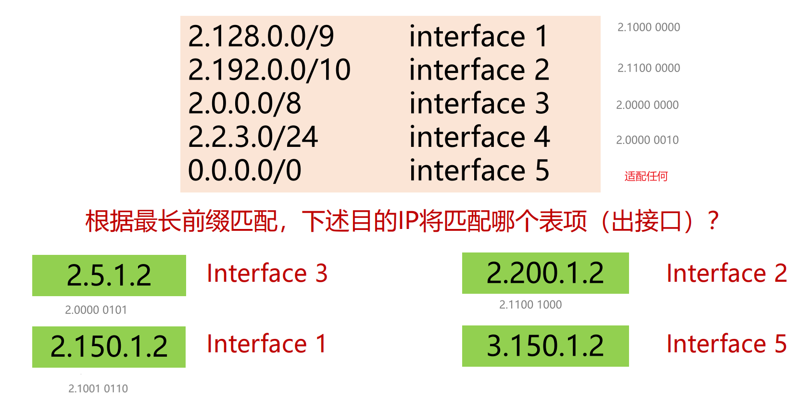


##### IPv4 地址如何获取

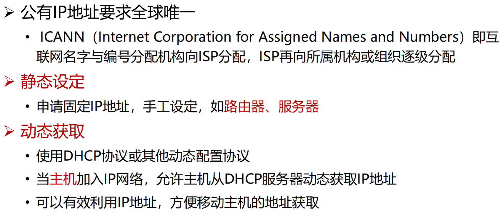

#### DHCP 动态主机配置协议

DHCP（Dynamic Host Configuration Protocol）：**动态主机配置协议**

- 当主机加入 IP 网络，允许主机从 DHCP 服务器动态获取 IP 地址
- 可以有效利用 IP 地址，方便移动主机的地址获取

工作模式：**客服/服务器模式（C/S）** 

- **基于 UDP 工作**，服务器运行在 67 号端口，客户端运行在 68 号端口


1. DHCP 客户从 UDP **端口 68** 以 **广播** 形式向服务器发送发现报文（`DHCPDISCOVER`） 

2. DHCP 服务器 **单播** 发出提供报文（`DHCPOFFER`） 

3. DHCP 客户从多个 DHCP 服务器中选择一个，并向其以 **广播** 形式发送 DHCP 请求报文（`DHCPREQUEST`） 
4. 被选择的 DHCP 服务器单播发送确认报文（`DHCPACK`）


#### IP 与 MAC 地址

IP 数据报经过不同链路时，IP 数据报中封装的 IP 地址不发生改变，而 Mac 帧中的硬件地址是发生改变的

IP 地址是网络层以及网络层之上使用的地址，硬件地址 MAC 是数据链路层使用的地址

由于路由器的隔离，IP 网络中无法通过广播 MAC 地址来完成跨网络的寻址，所以在网络层中只使用 IP 地址完成寻址

#### ARP 地址解析协议（Address Resolution Protocol） 

ARP 完成 IP 地址到 MAC 地址的映射，动态的

##### 工作流程

A 已知 B 的 IP 地址，需要获得 B 的 MAC 地址（物理地址）

- 如果 A 的 ARP 表中缓存有 B 的 IP 地址与 MAC 地址的映射关系，则直接从 ARP 表获取
- 如果 A 的 ARP 表中未缓存有 B 的 IP 地址与 MAC 地址的映射关系，则 A **广播** 包含 B 的 IP 地址的 ARP query 分组
  - 在局域网上的所有节点都可以接收到 ARP query
- B 接收到 ARP query 分组后，将自己的 MAC 地址发送给 A（**单播**）
- A 在 ARP 表中缓存 B 的 IP 地址和 MAC 地址的映射关系
  - 超时时删除

##### IP 包转发

直接交付：与目的主机在同一个 IP 子网内


#### NAT(Network Address Translation)

网络地址转换(NAT)用于解决 IPv4 地址不足的问题，是一种将私有（保留）地址转化为公有 IP 地址的转换技术

内网地址可以重复（在不同内网都是指不同的地址），到外网由 NAT 边界路由器进行 IP 地址转换

**私有 IP 地址（内网地址）**：

- A 类地址：10.0.0.0--10.255.255.255

- B 类地址：172.16.0.0--172.31.255.555

- C 类地址：192.168.0.0--192.168.255.255

##### NAT 工作机制

普通路由器在转发 IP 分组时，其源 IP 地址和目的 IP 地址都不会改变。而 NAT 路由器在转发 IP 分组时，一定要 **更换其 IP 地址**（转换源 IP 地址或目的 IP 地址)。普通路由器仅工作在网络层，而 NAT 路由器转发数据报时需要查看和转换传输层的端口号。

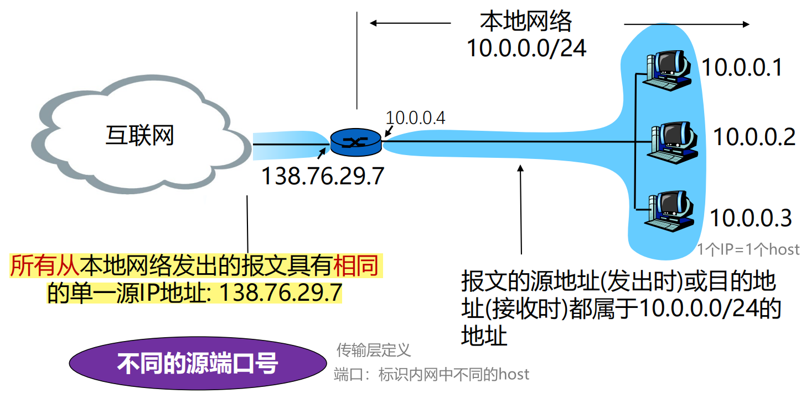


> [!NOTE]
>
> **同一主机不同应用，或者不同主机的同一端口，NAT 转换如何处理？** 换端口（区分到每台主机的不同应用）

**出数据报**：外出数据报用 NAT IP 地址(全局), 新 port # 替代 源 IP 地址(私有), port #

**NAT 转换表**：每个 (源 IP 地址, port #)到(NAT IP 地址, 新 port #) 映射项

**入数据报**：对每个入数据报的地址字段用存储在 NAT 表中的(源 IP 地址, port #)替代对应的 (NAT IP 地址, 新 port #)

端口号由两个字节（16bit）表示

##### NAT 优缺点

NAT 的优势

- 节省合法地址，减少地址冲突
- 灵活连接 Internet
- 保护局域网的私密性

问题或缺点

- 违反了 IP 的结构模型，路由器处理传输层协议（三层的路由器看四层的端口）
- 违反了端到端的原则
- 违反了最基本的协议分层规则
- 不能处理 IP 报头加密
- 新型网络应用的设计者必须要考虑 NAT 场景，如 P2P 应用程序

外网的 client 要连内网的 host？relaying


#### ICMP（Internet 控制报文协议）

ICMP(Internet Control Message Protocol): 互联网控制报文协议

- ICMP 报文封装在 IP 数据报发送错误

ICMP 报文类型（报文字段不做要求）

- **ICMP 差错报告报文**（5 种）
  - 终点不可达：不可达主机、不可达网络，无效端口、协议

  - 源点抑制：拥塞

  - 时间超时

  - 参数问题

  - 改变路由（重定向）

- **ICMP 询问报文**
  - 回送请求/回答 (PING 使用)


##### PING (Packet InterNet Groper) 

PING ：分组网间探测

-  PING 用来测试两个主机之间的连通性
- PING 使用了 ICMP 回送请求与回送回答报文
- 可以知道 连通性、往返时延、单向转发跳数
- PING 工作在应用层，直接使用网络层的 ICMP

##### Traceroute

如何知道整个路径上路由器的地址？ 使用 TraceRT 命令

这个方法不精确：互联网上的路由是独立的

- Tracert 工作在网络层

### 路由算法

路由算法须满足的特性：

- 正确性、简单性、鲁棒性、稳定性、公平性、有效性

根据路由算法是否随网络的通信量或拓扑自适应划分

- **静态路由** 选择策略（**非自适应** 路由选择）
- **动态路由** 选择策略（**自适应** 路由选择）

#### 优化原则

汇集树(Sink Tree)

- 所有的源节点到一个指定目标节点的最优路径的集合构成一棵以目标节点为根的树
- 一棵路由器 B 的汇集树（距离度量单位：步长数）

**汇集树不是唯一的**

#### 距离向量路由算法 Distance vector

Bellman-Ford 方程

假设 $D_x(y)$ 是 从 x 到 y 最小代价路径的代价值；其中 $m$ 为 $x$ 的邻居, $c(x, m)$ 为 $m$ 到 $x$ 的距离
$$
D_x(y) = min \{c(x, m) + D_m(y) \}
$$
**距离向量（Distance Vector）** 算法基本思想: 

- 每个节点周期性地向邻居发送它自己到某些节点的距离向量；
- 当节点 x 接收到来自邻居的新 DV 估计，它使用 B-F 方程更新其自己的 DV :

上述过程迭代执行，Dx (y)收敛为实际最小费用 dx(y)

距离向量算法 **特点**：迭代的、分布式的

**缺点** 

- It reacts rapidly to good news, but leisurely to bad news. 对好消息反应快，坏消息反应慢 
- It is known as the count-to-infinity problem

Attempts to solve **Count-to-infinity** problem —— **Poisoned reverse** (毒性逆转, RFC 1058) --> 但不能完全解决这个问题

#### 链路状态路由算法

链路状态（Link State）路由可分为五个部分：

1. 发现邻居，了解他们的网络地址；

2. 设置到每个邻居的成本度量；

3. 构造一个分组，分组中包含刚收到的所有信息；

4. 将此分组发送给其他的路由器；

5. 计算到其他路由器的最短路径（Dijkstra 最短路径算法）。

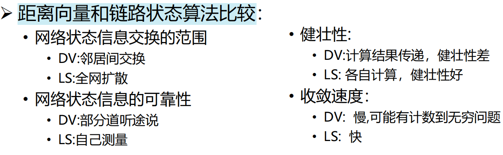

#### 层次路由

产生原因：

- 过于庞大的路由表存储、查找困难，路由信息交互开销高
- 为提高路由器查表速度，减少路由表存储空间，需要缩减路由条目
- 可以通过地址聚合进一步缩减路由条目

基本思路：**互联网由大量不同的网络互连，每个管理机构控制的网络是自治的**

**自治系统**（AS，Autonomous System） 

- 一个管理机构控制之下的网络
- 一个 AS 内部通常使用相同的路由算法/路由协议，使用统一的路由度量（跳数、带宽、时延 …） 
- 不同的 AS 可以使用不同的路由算法/路由协议
- 每个 AS 有一个全球唯一的 ID 号：AS ID
- 自治系统内的还可以进一步划分层次：私有自治系统或区域

自治系统内部使用 **内部网关路由协议 Interior Gateway Protocols (IGP)**

自治系统之间之间使 **用外部网关路由协议 Exterior Gateway Protocols (EGP)**


#### 广播路由 Broadcasting

广播（Broadcasting）：源主机同时给全部目标地址发送同一个数据包

方法 1：给每个主机单独发送一个数据包

- 效率低、浪费带宽

- Server 需要知道每个目的地址

方法 2：多目标路由（multidestination routing）：在需要转发的路由器线路复制一次该数据报

- 网络利用率高

- Server 依然需要知道所有的目的地址

方法 3：**泛洪（flooding）**

- 一种将数据包发送到所有网络节点的简单方法

- 将每个进入数据包发送到除了进入线路外的每条出去线路

- 用途

  - 保证性：一种有效广播手段，可确保数据包被传送到网络中每个节点
  - 鲁棒性：即使大量路由器被损坏，也能找到一条路径（如果存在）
  - 简单性：仅需知道自己的邻居

- 无控制的泛洪：*环路* 可能导致广播风暴

- 解决方法：受控制的泛洪（每个路由器进行有选择的泛洪）

  - 序号控制泛洪（sequence-number-controlled flooding） 
    - 记录每个来源的广播序号
    - 
  - 逆向路径转发（reverse path forwarding, RPF） 
    - 

  

方法 4：**生成树（spanning tree）**

- 源节点向所有属于该生成树的特定链路发送分组
- 改进了逆向路径转发
- 没有环路
- 最佳使用带宽
- 最少副本，消除了冗余分组
- 一个路由器可以不必知道整颗树，只需要知道在一颗树中的邻居即可

#### 组播路由 multicasting

组播/多播（multicasting）：源主机给网络中的一部分目标用户发送数据包

目的：更好地支持**一对多通信**

组播实现的两个步骤：

1. 确定组成员
2. 生成树——路由器与路由器之间的协议

- 最佳生成树的使用取决于组的密度分布

  - 密集分布，基于源点树（source-based trees） 

    

    - 存在的问题：
      - 大型网络中，组播源很多时，路由器需生成多颗棵树，工作量巨大
      - 路由器需要大量空间来存储多颗树

  - 稀疏分布，基于核心树（core-based trees） 

    

    - 基于核心树（core-based trees）存在的问题：
      - 可能无法达到最优
      - 如果只有一个发送者，将发送者作为核心是最优的

**IGMP (Internet Group Management Protocol)**：路由器获悉该网段的组播组成员

常用组播地址段（D类地址）：224.0.0.0/24（即 224.0.0.0~239.255.255.255）


#### 选播路由 Anycast

选播（Anycast） 

- 将数据包传送给最近的一个组成员
- 在有多个服务器的情况下，用户希望快速获得正确信息，而不在乎从哪个服务器获得


选播的典型应用：DNS

- 在没有指定 DNS 服务器的情况下，用户将始终连接到“最接近”(从路由协议角度来看) 服务器，可以减少延迟，并提供一定程度的负载平衡

### Internet 路由协议 🔥

默认网关可以理解为到当前主机最近的路由器的端口地址

> [!NOTE]
>
> 路由协议：
>
> 内部网关协议 IGP： 有 RIP 和、OSPF、ISIS 等多种具体的协议
>
> 外部网关协议 EGP：目前使用的协议就是 BGP
>
> 三种路由协议的比较：
>
> 

#### OPSF 开放路径优先协议(IGP)

**OSPF（Open Shortest Path First）开放最短路径优先**：采用 **分布式的链路状态** 算法

- 网络层协议，直接用 IP 数据报传送
- 内部网关路由协议
- 使用了 Dijkstra 提出的最短路径算法 SPF

OSPF 协议的基本思想

- 向本 *自治系统* 中 **所有路由器洪泛** 信息
- 发送的信息就是与本路由器相邻的所有路由器的 **链路状态**
- 只有当 *链路状态* 发生变化时路由器才用**洪泛**法发送此信息

OSPF 的五种分组类型

- 问候 (Hello) 分组
- 数据库描述 (Database Description) 分组
- 链路状态请求 (Link State Request) 分组
- 链路状态更新 (Link State Update) 分组
- 链路状态确认 (Link State Acknowledgment)分组

##### OSPF-工作流程

1. 确定邻站可达

2. 同步链路状态数据库

3. 更新链路状态

   - “链路状态”就是说明本路由器都和哪些路由器相邻，以及该链路的“度量”(metric)

   - OSPF 度量值一般包括费用、距离、时延、带宽等


所有的路由器最终都能建立一个 *链路状态数据库 LSDB*


链路状态更新（LSU, Link State Update）

##### OSPF-区域的概念

OSPF 支持将一组网段组合在一起，称为一个区域

使用层次结构的区域划分，上层的区域叫做 **主干区域(backbone area)**，其他区域都必须与主干区域相连

非主干区域之间不允许直接发布区域间路由信息

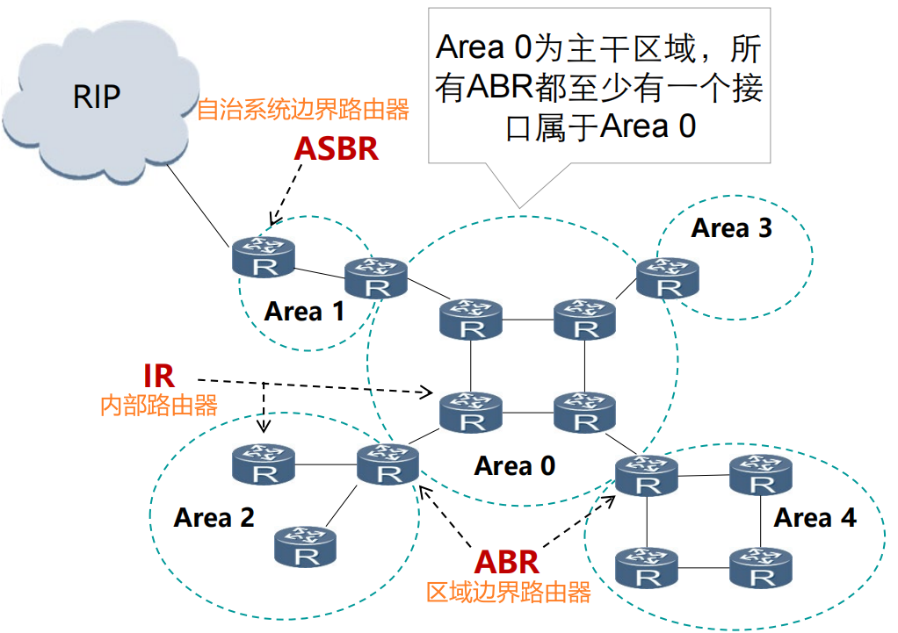

有三类路由器：ASBR 自治系统边界路由器，IR 内部路由器，ABR 区域边界路由器


##### 小结


“路由收敛”是指网络设备路由表和网络拓扑结构保持一致

##### 题目


#### RIP 路由选择协议(IGP)

**路由选择协议 RIP（ Routing Information Protocol）** 是基于 [距离矢量算法](# 距离向量路由) 的协议

- 应用层协议，在传输层使用 UDP
- 继承距离矢量算法的缺点
- 内部网关路由协议

使用 **跳数**（Hop count） 衡量到达目的网络的距离

- RIP 认为一个好的路由就是它通过的 **路由器的数目少**，即“距离短” （时间不一定短）
- RIP 允许一条路径最多只能包含 15 个路由器（16 表示不可达）

RIP 协议的基本思想

- 仅和 **相邻** 路由器交换信息（交换 DV）

- 发现有更优的路由，更新自己的路由表，向相邻路由器广播自己的新路由

- 路由器交换的内容是自己的路由表

  - 路由表：`<目的网络N，距离d，下一跳路由器地址X>`

- 周期性更新：30s

  

**小结**


#### BGP 边界网关协议(EGP)

**边界网关协议 BGP (Border Gateway Protocol)** ：目前互联网中唯一实际运行的自治域 AS 间的路由协议

- 应用层协议，基于 TCP
- 外部网关路由协议

BGP 功能

- eBGP：从相邻的 AS 获得网络可达信息
- iBGP： 将网络可达信息传播给 AS 内的路由器
- 基于网络可达信息和策略决定到其他网络的“最优”路由


**BGP 会话**: 两个 BGP 路由器通过 TCP 连接交换 BGP 报文

- 通告到不同网络前缀的路径，即 **路径向量** (path vector)协议

**BGP 路径通告**：完整路径通报给 AS

- 路由 = [前缀, AS-PATH, NEXT-HOP]


路由器可能会学到多条到目的网络的路径

由策略，AS1 路由器 1c 可能选择路径 AS3, X, 并在 AS1 中通过 iBGP 通告路径

##### BGP 协议的特点

BGP 协议交换路由信息的结点数量级是自治系统数的量级

每一个自治系统边界路由器的数目是很少的

在 BGP 刚刚运行时，BGP 的邻站是交换整个的 BGP 路由表；以后只需要在发生变化时更新有变化的部分（到达某个网络所经过的路径）

##### BGP 报文

BGP 通过 TCP 的 179 端口交换报文

##### BGP 路由策略

路由器使用策略决定接受或拒绝接收到的路由通告

路由器也会基于策略决定是否向其他相邻 AS 通告路径信息

#### 标签交换和 MPLS

**MPLS (MultiProtocol Label Switching) 多协议标签交换**

- 多协议表示在 MPLS 的上层可以采用多种协议，例如：IP，IPv6、IPX
- 标签是指每个分组被分配一个标签，路由器根据该标签对分组进行转发
- 交换是指标签的交换，MPLS 报文交换和转发是基于标签的

MPLS 设计初衷为了 *提升查找速度*，是一种 **IP 增强技术**

MPLS 主要有以下三个方面的应用

- 面向连接的服务质量管理
- 流量工程，平衡网络负载
- 虚拟专用网 VPN

**标签交换路由器 LSR**

- 支持 MPLS 的路由器
- 具备标签交换、路由选择两种功能

MPLS 域 

- 所有相邻的支持 MPLS 技术的路由器构成的区域

标签分配协议 LDP

- 用来在 LSR 之间建立 LDP 会话并交换 Label/FEC 映射信息

**工作过程**：


### 路由器

#### 概述

路由器是互联网最主要的网络设备，包含 2 个核心功能

- 控制层：运行各种路由协议：BGP、OSPF、RIP，学习去往不同目的的转发路径：路由表

- 数据层：根据上述路由表，将收到的 IP 分组转发到正确的下一跳链路


> [!NOTE]
>
> 由路由器互联的多个局域网的结构中，要求每个局域网 *物理层、数据层、网络层协议可以不同而网络层以上的高层协议必须相同*

路由器的路由表通常包含 *目的网络和到达该目的网络路径上的下一个路由器的 IP 地址*，即 `（目的网络地址，下一跳地址）`

- 路由器能划分冲突域，隔离广播域
  - 路由器不会转发广播帧
- 在多个逻辑网络（广播域）互连时必须使用路由器
- 路由器是网络层设备，实现了物理层、数据链路层和网络层的功能
- 路由表中默认路由的目的地址和子网掩码都是 `0.0.0.0`。


**路由选择** 分为直接交付和间接交付，当发送站与目的站在同一网段内时，就使用直接交付，反之使用间接交付

判断一个 IP 分组的交付方式是 **直接交付还是间接交付**，路由器需要根据分组的目的 IP 地址和该路由器接收端口的 IP 地址是否属于同一个子网来进行判断。具体来说，将该分组的源 IP 地址和目的 IP 地址分别与子网掩码进行“与”操作，若得到的子网地址相同，则该分组就采用直接交付方式，否则采用间接交付方式。

路由器是网络层设备，在路由器上实现了物理层、数据链路层和网络层的功能，所以相比交换机、网桥、集线器，路由器的传输延迟时间最长。

#### 控制层

路由器可同时运行多个路由协议

路由器也可不运行任何路由协议，只使用静态路由和直连路由

路由管理根据路由优先级，选择最佳路由，形成核心路由表

控制层将核心路由表下发到数据层，形成转发表（FIB）

- 若存在多个“去往同一目的 IP 前缀”的不同类型路由，路由器根据优先级选择最佳路由
  - 优先级数值越小，优先级越高
  - 

#### 数据层


### 拥塞控制算法

> [!TIP]
>
> 具体见下一章 [TCP 拥塞控制](# TCP 拥塞控制)

#### 拥塞控制概述

拥塞：网络中存在太多的数据包导致数据包传输延迟或丢失，从而导致网络吞吐量下降

拥塞控制（congestion control）：需要确保通信子网能够承载用户提交的通信量，是一个全局性问题，涉及主机、路由器等多种因素

产生拥塞的原因：

- 主机发送到网络的数据包数量过多，超过了网络的承载能力
- 突发的流量填满了路由器的缓冲区，造成某些数据包会被丢弃

拥塞可以在网络层解决，但实际上大多在传输层解决

#### 流量感知路由


#### 流量调节

显式拥塞通告（ECN，Explicit Congestion Notification）

#### 随机早期检测

### 服务质量

> [!TIP]
>
> 不是很重要

**网络服务质量（QoS）**

**区分服务（DiffServ：Differentiated services）**

### 三层交换与 VPN

#### 三层交换


#### VPN 技术

**虚拟专用网 VPN (Virtual Private Network)**：利用公用网络架设专用网络的远程访问技术

- 专用网络的经济、可靠、灵活的解决方案
- 利用安全隧道技术(tunneling)将专用网络在公共网络上扩展

VPN 的设计原则

- 安全性、隧道与加密、数据验证、用户验证、防火墙与攻击检测

##### VPN 的原理

通过隧道技术在公共网络上模拟出一条点到点的逻辑专线，从而达到安全数据传输的目的

### IPv6 技术（需要掌握）

初始动机：应付“32-bit 地址空间耗尽”问题（CIDR 和 NAT 都无法从根本上解决地址短缺问题），增加地址空间


#### IPV6 头部


**IPv6 头部字段分析**


- IPv6 不允许分片

#### IPv6 扩展头


#### 邻居发现

不展开

#### IPv6 地址及配置


#### IPv4 到 IPv6 迁移及过渡技术

主流过渡技术：双栈技术、翻译技术、隧道技术

##### 隧道技术

隧道技术（2 个同构网络的系统，跨越中间异构网络进行通信）：

- 将 A 协议数据包封装在 B 协议中传输


##### 翻译技术

破坏互联网端到端原则

## 传输层​🔥​

> [!IMPORTANT]
>
> 


### 概述和传输层服务

#### 传输层的位置

传输层位于应用层和网络层之间

“端到端”设计原则：应用程序只运行在终端上，进程 -- 进程

传输层应提供进程之间本地通信的抽象

#### 不同终端上的进程如何通信？

应用程序和网络之间存在一扇“门”：这扇“门”称为 **套接字（socket）**，是应用层和传输层的接口，也是应用程序和网络之间的 API

#### 传输层提供什么服务？

**网络层** 提供“尽力而为”的服务 Best effort

- 不保证交付，不保证按序交付，不保证数据完整，不保证延迟，不保证带宽等

**传输层** 的 **有所为**、**有所不为**

- 传输层可以通过差错恢复、重排序等手段提供 **可靠、按序** 的交付服务
- 但传输层无法提供延迟保证、带宽保证等服务


### 套接字编程

#### 网络应用

应用程序体系结构：**客户-服务器体系结构（C/S） client-server**

客户只与服务器通信，客户之间不通信

#### 进程如何标识自己

进程标识包括： 

- 主机地址

- 主机上与该进程关联的端口号 port number

#### 应用编程接口：socket API

应用需 **显式地** 创建、使用和释放套接字

采用客户-服务器模式：客户总是主动发起通信的一方，服务器始终在等待客户的服务请求到来

应用可以通过 socket API 调用两种传输服务: 

- 不可靠的数据报服务：由 UDP 协议实现
- 可靠的字节流服务：由 TCP 协议实现

#### 创建套接字：socket()


#### 套接字描述符


#### 使用 UDP 套接字实现回音服务

客户或服务器调用 sendto()发送数据

客户或服务器调用 recvfrom()接收数据

##### 通信流程


```c
// UDP服务端代码
int main(int argc, char **argv){
    char mesg[MAXLINE];
    int sockfd, n, len;
    struct sockaddr_in cliaddr, servaddr;
    
    sockfd = socket(AF_INET, SOCK_DGRAM, 0);
    bzero(&servaddr, sizeof(servaddr));
    servaddr.sin_family = AF_INET;
    servaddr.sin_addr.s_addr = htonl(INADDR_ANY);
    servaddr.sin_port = htons(SERV_PORT);
    
    bind(sockfd, (struct sockaddr *) &servaddr, sizeof(servaddr));
    
    for ( ; ; ) {
        len = sizeof(cliaddr);
        n = recvfrom(sockfd, mesg, MAXLINE, 0, cliaddr, &len);
        sendto(sockfd, mesg, n, 0, cliaddr, len); 
    }
}

// UDP 回音 客户端代码
int main(int argc, char **argv){
    int sockfd, n;
    struct sockaddr_in servaddr;
    char sendline[MAXLINE], recvline[MAXLINE + 1]; 
    if (argc != 2){
        fprintf(stderr, %s\n, "usage: echoCli <IPaddress>");
        exit(EXIT_FAILURE);
    }
    sockfd = socket(AF_INET, SOCK_DGRAM, 0);
    bzero(&servaddr, sizeof(servaddr));
    servaddr.sin_family = AF_INET; 
    inet_pton(AF_INET, argv[1], &servaddr.sin_addr);
    servaddr.sin_port = htons(SERV_PORT);
    while (fgets(sendline, MAXLINE, stdin) != NULL) { 
        sendto(sockfd, sendline, strlen(sendline), 0, 
               (struct sockaddr *)servaddr, sizeof(servaddr));
        n = recvfrom(sockfd, recvline, MAXLINE, 0, NULL, NULL);
        recvline[n] = 0;
        fputs(recvline, stdout);
    } 
    exit(0);
}
```

#### 使用 TCP 套接字实现回音服务

TCP 服务器监听套接字：listen() -- 服务端

TCP 套接字系统调用：accept() -- 服务端

TCP 套接字系统调用：connect() -- 客户端

服务端在 SERV_PORT（9999）监听

##### 服务器使用多个套接字服务客户

1. 服务器进程在 **监听套接字** 上等待客户的连接请求
2. 客户进程创建一个 *本地套接字*，与服务器的监听套接字通信： 在此过程中，客户 TCP 向服务器 TCP 发送连接请求
3. 收到连接请求后，服务器进程创建一个 **临时套接字（连接套接字）** 和一个新的服务器进程，与客户进程通信
4. 服务器进程回到监听套接字上继续等待：此举允许服务器同时服务多个客户
5. 客户服务结束后，服务器销毁进程，关闭连接套接字

##### 基于 TCP 的套接字通信流程

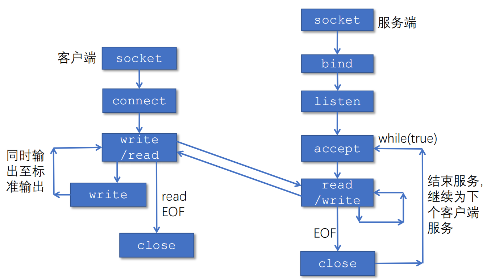

```c
// TCP回音服务端
int main(int argc, char **argv){
    int listenfd, connfd;
    socklen_t clilen;
    struct sockaddr_in cliaddr, servaddr;
    
    listenfd = socket(AF_INET, SOCK_STREAM, 0);
    bzero(&servaddr, sizeof(servaddr));
    servaddr.sin_family = AF_INET;
    servaddr.sin_addr.s_addr = htonl(INADDR_ANY);
    servaddr.sin_port = htons(SERV_PORT);
    bind(listenfd, (struct sockaddr *) &servaddr, sizeof(servaddr));
    listen(listenfd, LISTENQ);
    
    for ( ; ; ) {
        clilen = sizeof(cliaddr);
        connfd = accept(listenfd, (struct sockaddr *) &cliaddr, &clilen);
        str_echo(connfd); /* process the request */
    }
}


```

#### 套接字标识与端口号

端口号是套接字标识的一部分：

- 每个套接字在本地关联一个端口号

- 端口号是一个 16 比特的数

✋🏻 端口号的分类：

- 熟知端口：0～1023，由公共域协议使用
- 注册端口：1024～49151，需要向 IANA 注册才能使用
- 动态和/或私有端口：49152～65535，一般程序使用

✋🏻 报文段中有两个字段携带端口号

- 源端口号：与发送进程关联的本地端口号

- 目的端口号：与接收进程关联的本地端口号

##### 套接字端口号的分配

自动分配（**客户端**）：

- 创建套接字时不指定端口号
- 由操作系统从 49152～65535 中分配

使用指定端口号创建套接字（**服务器**）：

- 创建套接字时指定端口号
- 实现公共域协议的服务器应分配众所周知的端口号（0～1023） 


### 传输层复用和分用

传输层基本服务：将主机间交付扩展到进程间交付，通过 **复用** 和 **分用** 实现

- （发送端）复用：传输层从多个套接字收集数据，交给网络层发送
- （接收方）分用：传输层将从网络层收到的数据，交付给正确的套接字

#### UDP 套接字

UDP 套接字 Socket 使用 `<IP地址, 端口号>` 二元组进行标识

- UDP 协议实现分用时所依据的首部字段是 **目的端口号**

接收方传输层收到一个 UDP 报文段后：

- 检查报文段中的目的端口号，将 UDP 报文段交付到具有该端口号的套接字

- `<目的IP地址，目的端口号>` 相同的 UDP 报文段被交付给同一个套接字，与 `<源IP地址，源端口号>` 无关

- 报文段中的 `<源IP地址，源端口号>` 被接收进程用来发送响应报文

#### TCP 套接字

一个 TCP 服务器为了同时服务很多个客户，使用两种套接字

监听套接字：

- 服务器平时在监听套接字上等待客户的连接请求，该套接字具有众所周知的端口号

连接套接字：

- 服务器在收到客户的连接请求后，创建一个连接套接字，使用临时分配的端口号

- 服务器同时创建一个新的进程，在该连接套接字上服务该客户
- **每个连接套接字只与一个客户通信**，即只接收具有以下四元组的报文段：
  - 源 IP 地址 = 客户 IP 地址，源端口号 = 客户套接字端口号
  - 目的 IP 地址 = 服务器 IP 地址，目的端口号 = 服务器监听套接字的端口号

连接套接字需要使用 `<源IP地址，目的IP地址，源端口号，目的端口号>` **四元组** 进行标识，服务器使用该四元组将 TCP 报文段交付到正确的连接套接字

- 同一个 IP 地址可以有多个不同的 TCP 连接，而同一个端口号也可以出现在多个不同的 TCP 连接中

### 无连接传输：UDP

#### UDP 概述

- UDP 比较简单，执行速度快、实时性好
- 使用 UDP 的应用包括小文件传送协议 TFTP、DNS、SNMP 和实时传输协议 RTP
- 不适合使用 UDP 的：远程登录，需要保证数据传输的安全性

- **没有拥塞控制**
- 支持一对一、一对多、多对一和多对多的交互通信

UDP 提供的服务：

- 进程到进程之间的报文交付

- 报文完整性检查（可选）：检测并丢弃出错的报文

UDP 只在 IP 的数据报服务之上增加了两个功能：

- 复用和分用

- 报文检错

#### UDP 报文段结构


UDP 首部大小为 8B，由 4 个字段组成，每个字段的长度都是 2B

- 源端口
- 目的端口
- 长度：UDP 数据报的长度(包括首部和数据)
- 校验和


#### 校验和计算


伪首部是源IP+目的IP+0+17+UDP长度

UDP 检验要将部和数据部分一起检验

- 检验时，若 UDP 数据报部分的长度不是偶数个字节，则需填入一个全 0 字节，但是此字节和伪首部一样，是不发送的。
- 若 UDP 检验和检验出 UDP 数据报是错误的，则可以丢弃，也可以交付给上层，但是需要附上错误报告，即告诉上层这是错误的数据报。
- 通过伪首部，不仅可以检查源端口号、目的端口号和 UDP 用户数据报的数据部分，还可以检查 IP 数据报的源 IP 地址和目的地址。

#### 为什么需要 UDP？

1. 为什么需要 UDP？ 

- 应用可以尽可能快地发送报文：

  - 无建立连接的延迟

  - 不限制发送速率（不进行拥塞控制和流量控制）

  - 报头开销小

  - 协议处理简单


2. UDP 适合哪些应用？

- 容忍丢包但对延迟敏感的应用：如流媒体
- 以单次请求/响应为主的应用：如 DNS
- 若应用要求基于 UDP 进行可靠传输： 由 **应用层实现可靠性**

> [!NOTE]
>
> IP 数据报和 UDP 数据报的区别：IP 数据报在网络层要经过路由器的存储转发；而 UDP 数据报在传输层的端到端的逻辑信道中传输，封装成 IP 数据报在网络层传输时，UDP 数据报的信息对路由器是不可见的。

#### 题目


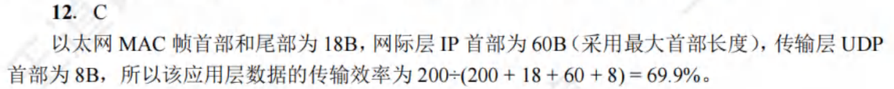

------------


### 面向连接的传输：TCP

#### TCP 概述

TCP 服务模型： 在一对通信的进程之间提供一条理想的**字节流管道**

**点到点通信**: 仅涉及一对一通信进程

**全双工**：可以同时双向传输数据

- **可靠、有序** 的字节流
- 不保留报文边界

TCP 适用于可靠性更重要的场合，如文件传输协议 FTP、超文本传输协议 HTTP、远程登录 TELNET 等

**需要的机制：**

1. 建立连接: 通信双方为本次通信建立数据传输所需的状态（套接字、缓存、变量等）
2. 可靠数据传输：流水线式发送，报文段检错，丢失重传
3. 流量控制: 发送方不会令接收方缓存溢出

> [!NOTE]
>
> TCP 和网络层虚电路的区别：TCP 报文段在传输层抽象的逻辑信道中传输，对路由器不可见；虚电路所经过的交换结点都必须保存虚电路状态信息。在网络层若采用虚电路方式，则无法提供无连接服务；而传输层采用 TCP 不影响网络层提供无连接服务。

#### TCP 报文段结构


- **源端口(source port)和目的端口(destination port)**：各占 2B
- **发送序号（Seq number）**：数据载荷中第一个字节在字节流中的序号，范围为 0~2^32^-1，共 2^32^个序号
- **确认序号（Ack number）**：期望接收的下一个字节的序号，若确认号为 N，则表明到序号 N-1 为止的所有数据都已正确收到
- **首部长度(head length）**：以 4B 为计算单位，指出 TCP 报文段的数据起始处距离 TCP 报文段的起始处有多远。首部的最大长度为 60B。
- 保留(not used)：占 6 位，保留位，0
- 紧急位 URG：URG = 1 时，表明紧急指针字段有效。它告诉系统此报文段中有紧急数据，应尽快传送；紧急数据被插入到报文段数据的最前面，而在紧急数据后面的数据仍是普通数据
- 确认位 ACK：仅当 ACK = 1 时确认号字段才有效。当 ACK = 0 时，确认号无效。TCP 规定，在连接建立后所有传送的报文段都必须把 ACK 置 1。
  - 对报文段的确认

- 推送位 PSH(Push)：接收方 TCP 收到 PSH = 1 的报文段后，就尽快交付给接收应用进程，而不再等到整个缓存都填满了后再向上交付。
- 复位位 RST(Reset)：RST=1，出现严重错误，必须释放连接
- 同步位 SYN：SYN = 1 时表示这是一个连接请求或连接接受报文。
- 终止位 FIN(Finish)：用来释放一个连接。
- **窗口(receive window)**：占 2B，范围为 0~2^16^-1。窗口值告诉对方，从本报文段首部中的确认号(ACK number)算起，**接收方目前允许对方发送的最大数据量**(以字节为单位)
- **检验和(checksum)**：占 2B。检验和字段检验的范围包括首部和数据两部分。在计算检验和时，和 UDP 一样，要在 TCP 报文段的前面加上 12B 的伪首部（只需将 UDP 伪首部的协议字段的 17 改成 6, UDP 长度字段改成 TCP 长度，其他的和 UDP 一样）
- 紧急指针：占 2B。紧急指针仅在 URG = 1 时才有意义
- **选项(Options)**：长度可变，最长可达 40B。*当不使用选项时，TCP 首部长度是 20B*。TCP 最初只规定了一种选项，即最大报文段长度(Maximum Segment Size)
  - **最大段长度（MSS）**：TCP 段中可以携带的最大数据字节数; 建立连接时，每个主机可声明自己能够接受的 MSS，缺省为 536 字节
- 填充：这是为了使整个首部长度是 4B 的整数倍。

TCP 报文长度根据接收方给出的窗口和当前网络拥塞程度来决定

除去选项和填充，TCP 有 20B 的固定首部


**窗口比例因子（window scale）**：

- 建立连接时，双方可以协商一个窗口比例因子

- 实际接收窗口大小 = window size * 2^window scale

**选择确认（SACK）**：

- 最初的 TCP 协议只使用累积确认
- 改进的 TCP 协议引入选择确认，允许接收端指出缺失的数据字节


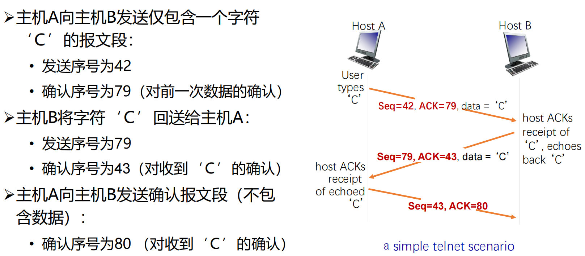

#### TCP 可靠数据传输

TCP 在不可靠的 IP 服务上建立可靠的数据传输

🚩 基本机制

- 发送端：流水线式发送数据、等待确认、超时重传
- 接收端：进行差错检测，采用累积确认机制

🚩 乱序段处理：协议没有明确规定

- 接收端不缓存：可以正常工作，处理简单，但效率低
- 接收端缓存：效率高，但处理复杂

##### 高度简化的 TCP 协议

**仅考虑可靠传输机制，且数据仅在一个方向上传输**


##### TCP 发送方要处理的事件

✋🏻 收到应用数据：

- 创建并发送 TCP 报文段

- 若当前没有定时器在运行（没有已发送、未确认的报文段），启动定时器

✋🏻 超时: 

- 重传包含最小序号的、未确认的报文段

- 重启定时器

✋🏻 收到 ACK： 

- 如果确认序号大于基序号（已发送未确认的最小序号）：
- 推进发送窗口（更新基序号）
- 如果发送窗口中还有未确认的报文段，启动定时器，否则终止定时器

##### 如何设置超时值

SampleRTT：瞬时 从发出某个报文段到收到其确认报文段之间经过的时间

EstimatedRTT：平均值​​

平均 RTT 的估算方法（指数加权移动平均）：

- $EstimatedRTT = α ✖EstimatedRTT + (1-α)✖SampleRTT$，典型地，α = 0.875 !

##### TCP 确认的二义性

重传的 TCP 报文段使用与原报文段相同的序号，发送端收到确认后 ，无法得知是对哪个报文段进行的确认

解决方法：定时器补偿

- 发送方每重传一个报文段，就直接将超时值增大一倍（不依赖于 RTT 的更新）
- 若连续发生超时事件，超时值呈指数增长（至一个设定的上限值）

##### TCP 接收端的事件和处理


##### 快速重传

仅靠超时重发丢失的报文段，恢复太慢

- 发送方可利用重复 ACK 检测报文段丢失

TCP 协议规定： 当发送方收到对同一序号的 3 次重复确认时，立即重发包含该序号的报文段

快速重传: 在定时器到期前重发丢失的报文段


##### 小结


##### TCP 使用 GBN 还是 SR

**TCP 结合了 GBN 和 SR 的优点**

TCP 在减小定时器开销和重传开销方面要优于 GBN 和 SR！

##### Crash Recovery


#### TCP 流量控制

TCP 接收端有一个接收缓存：

- 接收端 TCP 将收到的数据放入接收缓存
- 应用进程从接收缓存中读数据
- **进入接收缓存的数据不一定被立即取走、取完**
- 如果接收缓存中的数据未及时取走，后续到达的数据可能会因缓存溢出而丢失

流量控制本质：**发送端 TCP 通过调节发送速率，不使接收端缓存溢出**

> [!NOTE]
>
> GBN/SR 和 UDP 不需要流量控制：
>
> 


##### TCP 如何进行流量控制

TCP使用滑动窗口机制来进行流量控制

- 若滑动窗口值设置得太小，则会产生过多的ACK(因为窗口大可以累积确认，因此会有更少的ACK)
- 若设置得太大，则又会由于传送的数据过多而使路由器变得拥挤，导致主机可能丢失分组

接收缓存中的可用空间称为 **接收窗口(rwnd)**

- RcvWindow = RcvBuffer-(LastByteRcvd -LastByteRead)
- 接收方将 RcvWindow 放在报头中，向发送方通告接收缓存的可用空间
- 发送方限制 **未确认的字节数不超过接收窗口的大小**，即：LastByteSent-LastByteAcked ≦ RcvWindow

##### 非零窗口通告

发送方/接收方对零窗口的处理：

- 发送方：当接收窗口为 0 时，发送方必须停止发送
- 接收方：当接收窗口变为非 0 时，接收方应通告增大的接收窗口

TCP 协议规定： 

- 发送方收到“零窗口通告”后，可以发送“零窗口探测”报文段
- 从而接收方可以发送包含接收窗口的响应报文段

##### 零窗口探测的实现

发送端收到零窗口通告时，启动一个坚持定时器

定时器超时后，发送端发送一个零窗口探测报文段（序号为上一个段中最后一个字节的序号）

接收端在响应的报文段中通告当前接收窗口的大小

若发送端仍收到零窗口通告，重新启动坚持定时器

##### 小结


> [!NOTE]
>
> **传输层和数据链路层的流量控制的区别**：
>
> - 传输层实现的是端到端，即两个 **进程之间** 的流量控制
> - 数据链路层实现的是两个 **中间的相邻结点之间** 的流量控制
> - 此外，数据链路层的滑动窗口协议的窗口大小不能动态变化，传输层的窗口大小则可以动态变化。

#### TCP 连接管理

##### TCP 两次次握手建立连接

建立一条 TCP 连接需要确定两件事：

- 双方都同意建立连接（知晓另一方想建立连接） 
- 初始化连接参数（序号，MSS 等）

> [!CAUTION]
>
> **在网络中，2 次握手总是可行的吗？**
> 在一个不可靠的网络中，总会有一些意外发生：
> - 包传输延迟变化很大
> - 存在重传的报文段
> - 存在报文重排序
>
> ==> delayed duplicates problem


Problems：There are two problems which complicates the scenario:
- Possible wrap around of seqno
- Client/Host or Server may crash
- Assume seqno = 0,1,…,7 (i.e. 3 bits)

Problem: How to differentiate <span style="color:#CC0000;"> delay duplicate </span> and <span style="color:#336600;"> new pkt with wrapped around seqno </span>? 

Idea: use time 

Two assumptions that simplifies the problem
- Assumption 1. Time for seqno wrap around (**T1**) is typically large if, e.g., seqno is 32 bits long. 
- Assumption 2. If pkt delays a relatively short time (**T2 < T1**), we can use time to differentiate the two.


##### How to realize the assumptions?

**1. Restrict packet lifetime**

Packet lifetime can be restricted to a known maximum using one of the following techniques 

- Restricted subnet design. 

- Putting a hop counter in each packet. 

- Timestamping each packet (router synchronization required)

 **T** = *n* * (pkt lifetime)

- It is impossible to receive a delay duplicate after **T**

**2. use time-of-day clock**

- Time-of-day clock at hosts

Each clock is assumed to take the form of a binary counter that increments itself at uniform intervals. 时钟不断增加

The number of bits in the counter must equal or exceed the number of bits in the sequence numbers.

The clock is assumed to continue running even if the host goes down. 

The clocks at different hosts need **not** be synchronized.

- initial seqno of a connection = low k bits of time-of-day clock

##### TCP 起始序号的选择

基于时钟的起始序号选取算法：
- 每个主机使用一个时钟，以二进制计数器的形式工作，每隔 ΔT 时间计数器加 1 

- 新建一个连接时，以本地计数器值的最低 32 位作为起始序号
- 该方法确保连接的起始序号随时间单调增长
  - ΔT 取较小的值（4 微秒）：确保发送序号的增长速度，不会超过起始序号的增长速度
  - 使用较长的字节序号（32 位）： 确保序号回绕的时间远大于分组在网络中的最长寿命


##### Forbidden region of seqno


The increments of seqno cannot be **too fast or too slow**

Solution for the delayed duplicates：

1. the maximum data rate on any connection is one segment per clock tick. (i.e., cannot be too fast)
2. limits how slowly sequence numbers can advance on a connection (or how long the connections may last). (i.e., cannot be too slow)

##### TCP 三次握手建立连接


TCP 标准规定：ACK 报文段可以携带数据。但如果不携带数据，则不消耗序号。下一个数据报文段的序号仍是 seq = x + 1。

##### 关闭 TCP 连接

TCP 连接释放的过程通常称为“四次挥手”

Asymmetric release 非对称

- When one part hangs up, the connection is broken. 
- Asymmetric release is abrupt and may result in data loss

Symmetric release 对称

- treat the connection as two separate unidirectional connections and require each one to be released separately

SYMMETRIC EXAMPLE：


**Two army-problem**：A white army is encamped in a valley. On both of the surrounding hillsides are blue armies. 

FIN位用来释放一个连接，它表示本方已没有数据要传输。然而，在关闭一个连接后，对方还可以继续发送数据，所以还有可能接收到数据。

> [!IMPORTANT]
>
> 从客户机发出 FIN报文段时刻算起，客户机释放连接的最短时间为$1RTT+2MSL$，服务器释放连接的最短时间为$1.5RTT$

---------------

**TCP 连接和释放的总结**

1. 建立连接，分为 3 步：
   ①SYN = 1, seq = x
   ②SYN = 1, ACK = 1, seq = y, ack = x+1
   ③ACK = 1, seq = x+1, ack = y+1
2. 释放连接，分为 4 步：
   ①FIN = 1, seq = u
   ②ACK = 1, seq = v, ack = u+1
   ③FIN = 1, ACK = 1, seq = w, ack = u+1
   ④ACK = 1, seq = u+1, ack = w+1

##### 客户/服务器经历的 TCP 状态序列


##### SYN 洪泛攻击

攻击者采用伪造的源 IP 地址，向服务器发送大量的 SYN 段，却不发送 ACK 段

服务器为维护一个巨大的半连接表耗尽资源，导致无法处理正常客户的连接请求，表现为服务器停止服务

##### TCP 端口扫描

TCP 端口扫描的原理：
- 扫描程序依次与目标机器的各个端口建立 TCP 连接
- 根据获得的响应来收集目标机器信息

在典型的 TCP 端口扫描过程中，发送端向目标端口发送 SYN 报文段： 

- 若收到 SYNACK 段，表明目标端口上有服务在运行
- 若收到 RST 段，表明目标端口上没有服务在运行
- 若什么也没收到，表明路径上有防火墙，有些防火墙会丢弃来自外网的 SYN 报文段


### TCP 拥塞控制

> [!NOTE]
>
> 流量控制与拥塞控制的异同：
>
> - 流量控制：限制发送速度，使不超过接收端的处理能力
>
> - 拥塞控制：限制发送速度，使不超过网络的处理能力

#### 网络拥塞

**网络拥塞造成**：

- 丢包：由路由器缓存溢出造成
- 分组延迟增大：
  - 链路接近满载，造成大量网络资源用于：
    - 重传丢失的分组
    - （不必要地）重传延迟过大的分组
    - 转发最终被丢弃的分组


结果：进入 **网络的负载很重，网络吞吐量却很低**

**拥塞控制的常用方法**：端到端拥塞控制

- 网络层不向端系统提供反馈
- 端系统通过观察丢包和延迟，自行推断拥塞的发生
- TCP 采用此类方法

#### 拥塞检测和速率限制

<span style="color:#CC0000;"> 发送方如何感知拥塞?</span>

发送方利用丢包事件感知拥塞： - 拥塞造成丢包和分组延迟增大
- 无论是丢包还是分组延迟过大，对于发送端来说都是丢包了  丢包事件包括：
  - 重传定时器超时
  - 发送端收到 3 个重复的 ACK


<span style="color:#CC0000;"> 发送方采用什么机制限制发送速率？</span>

发送方使用 **拥塞窗口 cwnd** 限制已发 送未确认的数据量：LastByteSent-LastByteAcked ≤ cwnd 

$rate = \frac{cwnd}{RTT} \text{Bytes/sec}$

cwnd 随发送方感知的网络拥塞程度而变化

#### 拥塞窗口的调节策略：AIMD

Multiplicative Decrease & Additive Increase

拥塞窗口是发送端根据网络拥塞情况确定的窗口值


#### TCP 慢启动

在新建的连接（或沉寂了一段时间的连接）上，以什么速率发送数据（此时接收窗口达最大值）? 

早期的 TCP 协议：
- 发送端仅以接收窗口大小限制发送速率，网络经常因为拥塞而崩溃！

采用“加性增”增大发送窗口，太慢！
- 在新建连接上，令 cwnd = 1 MSS，起始速度 = MSS/RTT
- 然而，网络中的可用带宽可能远大于 MSS/RTT 

**慢启动** 的基本思想：

- 在新建连接上指数增大 cwnd，直至检测到丢包（此时终止慢启动）
- 希望迅速增大 cwnd 至可用的发送速度

慢启动的策略：每经过一个 RTT，将 cwnd 加倍

慢启动的具体实施：
- **每收到一个 ACK 段，cwnd 增加一个 MSS**
- 只要发送窗口允许，发送端可以立即发送下一个报文段

特点：以一个很低的速率开始，按指数增大发送速率

> 慢启动比谁“慢”？
>
> - 与早期 TCP 按接收窗口发送数据的策略相比，采用慢启动后发送速率的增长较慢

#### TCP 拥塞控制的实现

##### 区分不同的丢包事件


##### TCP 发送端的事件与动作

发送方维护变量 ssthresh

发生丢包时，ssthresh = cwnd/2

**ssthresh 是从慢启动转为拥塞避免的分水岭**：

- cwnd < ssthresh，执行慢启动，cwnd 指数规律增长
- cwnd > ssthresh：执行拥塞避免，cwnd 加法增大

拥塞避免阶段，拥塞窗口线性增长：每当收到 ACK， cwnd = cwnd + MSS*(MSS/cwnd)

检测到 3 个重复的 ACK 后：

- TCP Reno 实现快重传+快恢复算法，即[AIMD](# 拥塞窗口的调节策略：AIMD)： 
  - cwnd = ssthresh+3，线性增长 或者 ssthresh=cwnd=cwnd/2，开始执行拥塞避免算法

- TCP Tahoe 实现：cwnd = 1✖MSS，慢启动


> [!NOTE]
>
> 当题目同时现接收窗口(rwnd)和拥塞窗口(ewnd)时，发送方发送窗口的实际大小是由 rwnd 和 cwnd 中较小的那一个确定的

**Wireless Issues**：linker layer 重传 速度快于 TCP 的反应

##### TCP 连接的吞吐量


##### TCP 的公平性

公平性目标: 如果 K 条 TCP 连接共享某条带宽为 R 的瓶颈链路，每条连接应具有平均速度 R/K


### 拥塞控制的发展

#### TCP CUBIC

拥塞控制算法

##### 经典 TCP 拥塞控制的性能问题

TCP Reno 线性增大拥塞窗口，探测当前可用网络带宽，即每经过一个 RTT，拥塞窗口增加一个 MSS；当端到端时延带宽乘积（BDP）较大时，拥塞窗口增长过慢，导致信道无法满载


##### TCP-BIC

**TCP-BIC**: Binary Increase Congestion

BIC 算法对满载窗口进行二分查找：

- 如发生丢包时窗口大小是 *W* 1，为保持满载而不丢包，满载窗口应小于 *W* 1 

- 如检测到丢包并将窗口乘性减小为 *W* 2 ，则满载窗口应大于 *W* 2 

 窗口更新受 ACK 时钟驱动，即以 RTT 为更新间隔时间

 二分查找: 

- 在 ACK 时钟的驱动下，将拥塞窗口置为(*W* 1 + *W* 2)/2(新的 *W* 2 值)，不断逼近满载窗口

 最大探查: 

- 如窗口再次达到 *W* 1 而没有丢包，说明满载窗口大于 *W* 1 ，则以逼近 *W* 1 的镜像过程增大拥塞窗口


BIC 存在带宽 **不公平性问题**：BIC 以 ACK 时钟驱动拥塞窗口的更新，RTT 较短的连接会更快到达满载窗口，占据

更多的带宽，产生不公平性问题（RTT-fairness）

##### TCP CUBIC

CUBIC 将 BIC 算法连续化，用三次函数拟合 BIC 算法曲线

 拥塞窗口成为距上次丢包的时间 *t* 的函数，*t* 取值位于两次丢包之间，不再根据 RTT 间隔来确定调整窗口的时机，**避免了 RTT 不公平问题**

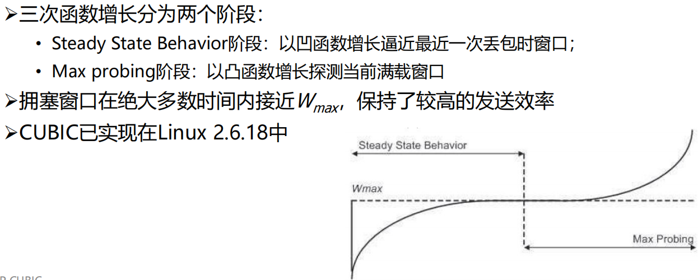

#### Google BBR

##### 拥塞与瓶颈链路带宽


**BBR**: Bottleneck Bandwidth and Round-trip propagation time

瓶颈链路带宽 BtlBw：不会引起路由器缓存排队的最大发送速率
RTprop：往返时间
BDP = BtlBw x RTprop

##### 优化点的近似观测

用过去 10 秒内的最小 RTT（min RTT）和最大投递率（max BW），分别近似 RTprop 和 BtlBw，并依据这两个值估算当前 BDP


> [!CAUTION]
>
> Max BW 和 min RTT 不能同时被测得！


##### BDP 检测阶段

**启动阶段（START_UP）**

 当连接建立时，类似 TCP 的慢启动，指数增加发送速率，尽可能快地占满管道

 若经过三次发现投递率不再增长，说明已达到 BtlBw，瓶颈链路处分组已开始排队（事实上此时占的是三倍 BDP）

**排空阶段（DRAIN）**

指数降低发送速率（相当于是 startup 的逆过程），将多占的两倍 buffer 慢慢排空

**瓶颈带宽探测（PROBE_BW）**


**时延探测（PROBE_RTT）**


#### Data Center TCP

数据中心内部有一类经典的通信模式-**Partition/Aggregate**

- Aggregator 将上层应用任务划分给下层的 worker 执行

##### 数据中心的性能问题

Incast：在一个很短的时间内，大量流量同时到达交换机的一个端口，导致缓冲区被占满，最终导致丢包

 Queue Buildup：

 Buffer Pressure：

##### 需要什么样的传输层协议

容忍高突发流量

- 在 Partition/Aggregate 通信模式中，所有 Worker 几乎会在同一时间向

Aggregator 返回执行结果，产生很高的突发流量

 低时延

- 数据中心有大量时延敏感的短流，如网页搜索等

 高吞吐

- 数据中心有大量吞吐敏感的长流，如文件传输、分布式机器学习中神经

网络模型参数的传输等

##### DCTCP 核心思想

根据网络拥塞程度精细地减小发送窗口


容忍高突发流量

- DCTCP 维持了较低的队列长度，可以留出较大的缓冲区给突发流量

- 采用激进的标记策略，使得发送端在丢包之前就感知到拥塞

 低时延

- 由于队列长度较短，也减少了包在队列中的排队时延

 高吞吐

- DCTCP 根据拥塞程度精确调节窗口，使得发送窗口的变化比较平滑，不

会出现吞吐量骤降的情形

#### DCCP

DCCP = UDP+拥塞控制

- DCCP 提供不可靠数据报流服务： 
  - UDP 报文段可能丢失、乱序到达
  - 无流量控制
- DCCP 提供模块化的拥塞控制： 
  - 应用可以根据需要，选择不同的拥塞控制机制


### 传输层协议的发展

#### MPTCP

传统 TCP 协议仅支持单路径传输，即只能利用终端主机上的一个网络接口传输数据

##### MPTCP 的优势

多径带宽聚合

- 终端设备可以聚合不同路径上的可用带

宽，以获得更高的网络带宽

 提升传输的可靠性

- 使用多条路径传输数据，可以有效避免

因单条路径性能恶化或中断导致的应用

连接中断

 支持链路的平滑切换

- 多路径传输方式允许终端在不同接入网

络间快速、平滑地切换，选取当前链路

质量最好的路径传输数据

##### MPTCP 在网络体系结构中的位置

MPTCP 位于套接字和 TCP 之间


公平性是关注的重点，MPTCP 采用的是网络公平性原则


#### QUIC

##### TCP 存在的问题

- TCP 实现在操作系统内核中
  - 作为传输优化的最终受益者，应用 *无法对 TCP 进行修改*
  - 操作系统的更新往往跟不上应用的需求和节奏

- TCP 体系握手时延大
  - 互联网上的大趋势：*低时延需求* 越来越强烈；加密流量占比越来越大
  - TLS(传输层安全性协议)+TCP 的体系握手时延很大，传输前需要 3 个 RTT 进行握手

TCP 多流复用存在队头阻塞问题-> 多流复用

TCP 传输需要保持有序性：出现丢包时，后面的数据需要等丢失的包重传完成才能使用，这就导致了队头阻塞

##### QUIC 在网络体系结构中的位置


QUIC 替代 TCP、TLS 和部分 HTTP 的功能


## 应用层

> [!IMPORTANT]
>
> 1. 掌握应用进程通信方式以及服务进程工作模式
> 2. 掌握域名系统基本原理和工作机制
> 3. 掌握电子邮件系统体系结构及基本工作原理
> 4. 了解 WWW 系统结构框架、静态和动态 Web 及其应用技术，掌握 HTTP 协议及其工作原理
>
> 5. 了解流媒体基本概念、数字音视频与编码、流式存储媒体、直播与实时音视频、流媒体动态自适应传输
>
> 6. 了解内容分发背景及内容分发网络、以及 P2P 网络的工作机制
> 7. 掌握 Telnet、FTP、SNMP 等应用层协议的工作原理

### 应用层概述

#### 应用进程通信方式

**客户/服务器**（**C/S**, Client/Server）方式

- C/S方式可以是面向连接的，也可以是无连接的

- 面向连接时，C/S 通信关系一旦建立，通信就是双向的，双方地位平等，都可发送和接收数据
- 客户机之间不直接通信
- 可拓展性不佳
- 特点
  - 在进行通信时临时成为客户，它也可在本地进行其它的计算
  - 用户计算机上运行，在打算通信时**主动**向远地服务器发起通信
  - 客户方必须知道服务器进程所在**主机的IP地址**才能发出服务请求
  - 需要时可以与多个服务器进行通信


**浏览器/服务器**（**B/S**，Browser/Server） 方式

- 浏览器请求、服务器响应的工作模式；用户界面完全通过 Web 浏览器实现，一部分事务逻辑在前端实现，但主要的事务逻辑在服务器端实现
- 采取3层架构实现
  - 数据层
  - 处理层
  - 表现层

- 特点：
  - 界面统一，使用简单。客户端只需要安装浏览器软件
  - 易于维护。对应用系统升级时，只需更新服务器端的软件，减轻了系统维护和升级的成本
  - 可扩展性好。采用标准的 TCP/IP 和 HTTP 协议，具有良好的扩展性
  - 信息共享度高。HTML 是数据格式的一个开放标准，目前大多数流行的软件均支持 HTML

**对等**（**P2P**，Peer to Peer）方式

- 两个进程在通信时并 *不区分* 服务的请求方和服务的提供方
-  音频/视频流量已占主要比例
- 每一个 P2P 进程**既是客户同时也是服务器**
- 一种通信模型、一种逻辑网络模型

#### 服务器进程工作方式

**循环方式(iterative mode)**

- 一次只运行一个服务进程

- 当有多个客户进程请求服务时，服务进程就按请求的先后顺序依次做出响应 (阻塞方式) 

 **并发方式(concurrent mode)**

- 可以同时运行多个服务进程

- 每一个服务进程都对某个特定的客户进程做出响应 (非阻塞方式)


### 域名系统 DNS 🔥

#### 历史和概述

**域名系统（DNS，Domain Name System）** 是互联网重要的基础设施之一，向所有需要域名解析的应用提供服务，主要负责将可读性好的域名映射成 IP 地址

- DNS是一个基于**C/S模型的分布式数据库系统**，主要用于域名和IP地址的映射
- DNS在**传输层**采用**无连接的UDP服务**

从概念上可将DNS分为三部分：层次域名空间、域名服务器和解析器

> [!CAUTION]
>
> Internet上提供访问的主机一定要有IP地址，而不一定要有域名！

#### 域名系统名字空间和层次结构

DNS 组成包括：域名空间、域名服务器、分布式数据库


##### 层级结构


edu 可以时顶级域名也可以是二级域名，美国的大学的 edu 就是顶级域名

关于域名中的标号有以下几点需要注意：

1. 标号中的英文不区分大小写。

2. 标号中除连字符(-)外不能使用其他的标点符号。

3. 每个标号不超过63个字符，多标号组成的完整域名最长不超过255个字符。

4. 级别最低的域名写在最左边，级别最高的顶级域名写在最右边。

##### 顶级域名


#### 域名服务器

保存关于域树(domain tree)的结构和设置信息的服务器程序称为 **名字服务器(name server)或域名服务器**，负责域名解析工作

域名解析过程对用户透明


名字服务器的管辖范围以“区”为单位，而不是以“域”为单位

 管辖区是域名“域”的子集。管辖区可以小于或等于域，但不可能大于域

##### 域名服务器分类

总体上，域名系统的名字服务器分为两大类

- **权威名字服务器(authoritative name server)**

- 一种根据本地知识知道一个 DNS 区(zone)的内容的服务器，它可以回答

有关该 DNS 区的查询而无需查询其他服务器

- 每个 DNS 区至少应有一个 IPv4 可访问的权威名字服务器提供服务

- **递归解析器(recursive resolver)/递归服务器**

- 以递归方式运行的、使用户程序联系域(domain)名字服务器的程序。

##### 权威名字服务器

根据对应域的层次，权威名字服务器又进一步分为以下类别

- 根名字服务器(root name server) /根服务器(root server)：
  - 每个根服务器都知道所有的顶级域名服务器的域名及其 IP 地址
  - 根服务器并不直接把主机用户所查的域名转换成 IP 地址
  - 根服务器共有 13 套，每套都可以有多个镜像(mirrored)根服务器，其内容定期与上述对应的根服务器同步

- 顶级域名字服务器(TLD name server)

- 二级域名字服务器(second level domain name server)
  - 一般来说，每个名字服务器只负责解析本辖域的域名

- 三级域名字服务器(third level domain name server)

- 三级域及以下的名字服务器也统称为本地域名服务器

##### 递归解析器/递归服务器

每一个 Internet 服务提供者 **ISP(Internet Service Provider)**, 都至少有一个递归服务器，距离用户主机较近

在递归服务器/本地域名服务器有多层的结构中，当本层服务器没有解析结果时，通常是**逐级向上递归进行查询**

当查询请求到达本地域最上一层名字服务器时，该层服务器对自己无法解析的任何一个域名，首先求助于根服务器（而不是二级域名字服务器），开始逐步**迭代查询**


#### 域名解析过程

当某一应用进程需要进行域名解析时，该应用进程将域名放在 DNS 请求报文（<span style="color:#CC0000;"> UDP 数据报, 端口号为 53 </span>）发给递归服务器（使用 UDP 是为了减少开销）。递归服务器得到查询结果后, 将对应 IP 地址放在应答报文中返回给应用进程

域名查询有 **递归查询(recursive query)** 和 **迭代查询(或循环查询，iterative query)** 两种方式

- 主机向递归解析器/本地域名字服务器的查询一般采用 *递归查询*
- 递归解析器/本地域名字服务器向根服务器可以采用递归查询，但一般优先采用 *迭代查询*

 

##### 题目


--------------


#### 域名系统查询和响应


**资源记录部分** 是 DNS 报文格式的最后 3 个字段，只有在 DNS 响应报文中才出现 ，包括 回答问题区域字段、权威名字服务器区域字段、附加信息区域字段。这 3 个字段都采用资源记录的格式

RR 格式：(name, ttl, class, type, value)

##### DNSSEC

DNSSEC 依靠**数字签名**保证 DNS 应答报文的**真实性和完整性**

在DNSSEC的使用中，域名服务器用自己的私有密钥对资源记录(Resource Record, RR)进行签名，解析服务器用域名服务器的公开密钥对收到的应答信息进行验证。如果验证失败，表明这一报文可能是假冒的，或者在传输过程、缓存过程中被篡改了


#### 域名系统高速缓存

**DNS 高速缓存作用**：为提高 DNS 查询效率，并减轻根域名服务器的负荷和减少 Internet 上的 DNS 查询报文数量，域名服务器广泛使用高速缓存，用来存放最近查询过的域名以及从何处获得域名映射信息的记录

好处：可以大大减轻根域名服务器的负荷，而且也能够使 Internet 上的 DNS 查询请求和回答报文的数量大为减少

#### 域名系统隐私(选讲)

QNAME 是用户请求的域名全名，它提供了用户的操作信息

DNS 敏感数据主要的泄露途径：通信链路窃听，服务器收集

> 思考题：What happens from opening a URL in a browser to the website being displayed?
>
> https://chatgpt.com/share/675122ac-d0a8-8002-9b88-0c990dcfe05f


### 电子邮件 🔥

#### 电子邮件系统体系结构

电子邮件系统采用**客户/服务器（C/S）**工作模式

- 用户代理（UA，user agent）——邮件客户端
  - 无统一标准

- 传输代理（message transfer agent）——邮件服务器


##### SMTP

简单**邮件传输协议 SMTP**（Simple Mail Transfer Protocol）——邮件服务器之间传递邮件使用的协议
- SMTP 利用 TCP 可靠地从客户向服务器传递邮件，使用**端口 25**
- SMTP 的 3 个阶段：连接建立、邮件传送、连接关闭
- SMTP 是一个简单的 ASCII 协议，邮件必须为 7 位 ASCII
- 不包括认证，不能传二进制数据（只能 ASCII），邮件以明文形式出现
- 不能用于接收方用户从服务器上读取邮件

#### 邮件格式

RFC 5322—Internet 邮件格式

- 基本 ASCII 电子邮件使用 RFC 5322

- 最新修订的 Internet 邮件格式，其前身是 RFC 822

 MIME(Multipurpose Internet Mail Extensions)—多用途 Internet 邮件扩展

- 基本格式的多媒体扩展

- 可传输多媒体消息和二进制文件

#### 最终交付协议

##### POP3 协议

POP(Post Office Protocol)邮局协议

POP3 由 RFC1939 定义，是一个非常简单的最终交付协议

用于用户代理从邮件服务器读取邮件

- POP3 使用 C/S 工作方式，在接收邮件的用户 PC 机中必须运行 POP 客户程序，而在用户所连接的 ISP 的邮件服务器中则运行 POP 服务器程序

- 在传输层使用TCP，端口号110
- 明文传输密码，不加密
- 基于ASCII码，若要传输非ACSII码的数据，则要使用MIME将数据转换成ASCII码形式

##### IMAP

- 用于最终交付的主要协议

- IMAP 是较早使用的最终交付协议—POP3(邮局协议，版本 3)的改进版

- 邮件服务器运行侦听端口 143 的 IMAP 服务器

  

### WWW🔥

#### WWW 体系结构概述

WWW (World Wide Web)万维网

- 由三个标准构成
  - 统一资源定位符(URL)
  - [超文本传输协议(HTTP)](# HTTP 协议)
  - 超文本标记语言(HTML)

WWW 性能提升方法

- 缓存（caching），如代理技术
- 多线程（multiple threads）
- 前端（front end）

#### 静态 Web（对象）


HTML 和 XML


#### 动态 Web 和 Web 应用

##### 动态 Web 页面

- 通用网关接口 CGI (*.cgi)

- 脚本语言+数据库技术 (*.php, *.asp, *.aspx) -服务器端动态网页

- 客户端动态网页（*.js）

##### 通用网关接口 CGI

CGI (Common Gateway Interface) 是一种标准

##### 脚本语言+数据库技术

PHP (Hypertext Preprocessor)

JSP (JavaServer Pages)

ASP.NET (Active Server Pages .NET) 

##### Client-side dynamic web page generation

**JavaScript** 客户端动态 web

##### 典型的动态 Web 技术：AJAX

**AJAX**：Asynchronous JavaScript and XML

- 超文本标记语言 HTML+CSS: 用于 Web 网页内容的显示

- 文档对象模型 DOM（Document Object Model）: 文档对象模型 (DOM)是 HTML 和 XML 文档的编程接口，其本质上是页面的 API，允许程序读取和操作页面的内容、结构和样式；采用树形结构组织

- 扩展标记语言 XML（eXtensible Markup Language）：用于程序与服务器交换应用数据

- 异步式工作方式：用于发送和检索 XML 数据

- JavaScript：用于将以上所有功能进行组合，并协同工作

<span style="color:#660066;"> AJAX 不是新的编程语言, 而是一种使用现有标准的新方法 </span>

#### HTTP 协议

##### 概述

超文本传输协议 HTTP（ HyperText Transfer Protocol）

- 在传输层通常使用 **TCP** 协议，**缺省使用 TCP 的 80 端口**

- HTTP 为 **无状态协议**，服务器端 *不保留之前请求的状态信息*

  - 无状态协议：效率低、但简单

  - 有状态协议：维护状态相对复杂，需要维护历史信息，在客户端或服务器出现故障时，需要保持状态的一致性等

- 更易支持大量并发的请求

- HTTP既可以使用非持续连接(HTTP/1.0)，也可以使用持续连接(HTTP/1.1支持)


##### HTTP 连接

**HTTP/1.0 非持久连接**

- Connection: close

- 服务器接收请求、响应、关闭TCP 连接

- 获取每个对象需要两阶段

  - 建立 TCP 连接


  - 对象请求和传输

- 每次连接需要经历 TCP 慢启动阶段

**HTTP/1.1 持久连接**

- Connection: keep-alive

- 在相同的 TCP 连接上，服务器接收请求、响应；再接收请求、响应；响应后保持连接

- HTTP/1.1 支持流水线机制
  - 需要按序响应

- 经历较少的慢启动过程，减少往返时间

- 降低响应时间


##### 思考题


##### HTTP报文结构

请求报文由三个部分组成，即开始行、首部行和实体主体


- 方法：对所请求的对象进行的操作，实际上也就是一些命令

  - 请求报文的类型是由它所采用的方法决定的

    

#### Web 缓存技术与 Web 代理

##### 浏览器缓存

- 目标：再次访问缓存在浏览器主机中的 Web 页副本，不必从原始服务器读取


##### Web 代理服务器缓存

- 目标：代理服务器缓存已访问过的 Web 页副本，满足用户浏览器从代理服务器提取 Web 页，尽量减少原始服务器参与

- 设置用户浏览器，通过代理服务器进行 Web 访问

- 浏览器将所有的 HTTP 请求发送到代理服务器

- 如果缓存中有被请求的对象，则直接返回对象

- 否则，代理服务器向原始服务器请求对象，再将对象返回给客户端

<span style="color:#FF0000;"> 降低时延、减少网络流量 </span>

##### Web 代理服务器缓存性能分析


Web 缓存存在的困难，即 Web 缓存与原始服务器 Web 页一致性问题

- **启发式策略**：服务器响应 Web 页的 Last-Modified 头和 Expires 头启发，原始 Web 页一段时间没更改，最近一段时间也不会更改。Expires 头很少用

- **询问式策略**：通过特殊的关键字头询问原始服务器，Web 副本是否已更新

#### Web 安全与隐私

##### Web 访问安全

- 无状态：客户端需要在每个请求中携带认证信息

- 认证方法：通常在 HTTP 请求中使用“用户名-密码” 

- 每个请求头中包含关键字 authorization: 

- 如果请求头中无 authorization: ，则服务器拒绝访问，并在响应头中包含 WWW authenticate：

##### Cookie

HTTP 无状态协议，服务器用 cookies 保持用户状态

- HTTP 在响应的首部行里使用一个关键字头 set-cookie：

选择的 cookie 号具有唯一性

- 后继的 HTTP 请求中使用服务器响应分配的 cookie： 

- Cookie 文件保存在用户的主机中，内容是服务器返回

的一些附加信息，由用户主机中的浏览器管理

- Web 服务器建立后端数据库，记录用户信息，cookie 作为关键字


Cookie 技术是把双刃剑，能分析用户喜好，向用户进行个性化推荐

Cookie 技术是把双刃剑，也能跟踪用户网络浏览痕迹，泄露用户隐私

> [!CAUTION]
>
> 误区：Cookie 容易嵌入间谍程序
>
> Cookie 文件保存的只是文本串，没有可执行程序，不会被嵌入间谍程序
>
> - 用户可以设置浏览器限制使用 Cookie


### 流式音频和视频

#### 流媒体概述

常见的流媒体服务：

- 点播：提前录制好，边下载边播放（起始时延 < 10s；类 VCR 操作（例如拖动进度条）< 1~2s） 
- 直播：边录制边上传，边下载边播放（大规模直播往往有数秒的时延）
- 实时交互 ：双方或多方实时交互式通信（时延 < 400ms 可接受，VR 则需要 < 25ms）

流媒体的特性：

- 端到端时延约束

- 时序性约束：流媒体数据必须按照一定的顺序连续播放

- 具有一定程度的容错性：丢失部分数据包也可完成基本功能

#### 数字音视频与编码

MPEG 视频压缩

I 帧必须周期性地出现在媒体流中


#### 直播与实时音视频

实际流媒体系统往往先尝试 UDP，如果失败则转为 TCP


实时流式协议 RTSP (Real-Time Streaming Protocol) 

实时传输协议 RTP (Real-time Transport Protocol) 

实时传输控制协议 RTCP (RTP Control Protocol) 

 

网页实时通信 WebRTC（Web Real-Time Communication） 


### 内容分发

#### 内容和 Internet 流量

内容分发，尤其是视频，是 Internet 流量的一个重要构成

#### 服务器群和 Web 代理

➢ 代理缓存帮助组织扩展 Web

- 将服务器内容缓存到客户上以提高性能

- 实现组织的策略(如访问策略)

#### 内容分发网络 CDN

怎样将内容（如 从百万的视频中选定的内容）分发给同时发起访问的数百万用户？

- 单个、大型的“服务器”？
  - 单点故障，网络拥塞，远程用户的长路径
  - 显然，这种解决方案 <span style="color:#990099;"> 可扩展性差 </span>

内容分发网络 CDN（Content Delivery Network，or Content Distribution Network）

- 基本思想源于 MIT 对 Web 服务瞬间拥塞问题的解决（1998） 

  - 一种 Web 缓存系统，靠近 **网络边缘（用户）** 提供内容服务

  - 目前提供更丰富的服务，包括静态内容、流媒体、用户上传视频等

- 主要优点
  - 降低响应时延，避免网络拥塞
  - 避免原始服务器过载及防止 DDoS 攻击
  - 分布式架构，具有良好的可扩展性
  - 对用户透明，无需用户感知

<span style="color:#FF0000;"> DNS 重定向实现 CDN </span>

将请求调度到较近或负载较轻的 CDN 服务器

➢ HTTP 重定向请求内容，服务提供者返回清单 CDN

- 原始服务器决策 CDN 服务器

- HTTP 响应：状态码 30X，Location：指明新的位置

<span style="color:#FF0000;"> DNS 辅助实现 CDN </span>

#### P2P 网络实现内容分发

P2P 文件分发协议：BitTorrent

- 文件被划分为 256Kb 大小的块

- 具有种子(torrents)的节点发送或接收文件


分布式哈希表（Distributed Hash Tables ，**DHT** s) 是一个完全分布式索引，可扩展到多客户端（或实体）

 

### 其它应用层协议

#### Telnet

1983 年由 RFC 854 确定为 Internet 标准

Telnet 协议使用 C/S 方式实现

Telnet 协议使用 TCP 连接通信，服务器进程默认监听 TCP23 端口

Telnet 协议引入网络虚拟终端 NVT（Network Virtual Terminal）

NVT 是 Telnet 协议定义的一组通用字符集

使用 Telnet 协议在网络中传输的数据都是 NVT 格式，不同的用户终端与服务器进程均与本地终端格式无关

#### FTP

**文件传输协议 FTP(File Transfer Protocol)**是 Internet 上使用最广泛的应用层协议之一

RFC 959 早在 1985 年就已经成为 Internet 的正式标准

FTP 使用 **C/S** 方式实现，使用TCP可靠的传输服务

- 允许客户指明文件的类型与格式

- 服务器主进程打开 TCP21 端口，等待客户进程发出的连接请求

- 客户请求到来时，服务器主进程启动从属进程来处理客户进程发来的请求

FTP 的两个端口与两个连接

- **控制连接在整个会话期间一直保持**，客户进程发出的文件传输请求通过控制连接发送给服务器**控制进程（工作在 TCP21 端口）**，但控制连接不用来传输文件

- 服务器控制进程在接收到客户进程发送来的文件传输请求后就创建数据**传输进程（工作在 TCP20 端口）**和数据连接
  - 端口号指的都是服务器的端口号！

- 数据连接用来连接客户进程和服务器数据传输进程，实际完成文件的传输。服务器数据传输进程在文件传输完毕后关闭数据连接并结束运行


FTP服务器的数据要经过应用层、传输层、网络层、数据链路层及物理层。因此，对应的封装是数据、数据段、数据报、数据帧，最后是比特。

-------------------------

简单文件传输协议 TFTP (Trivial File Transfer Protocol)

使用 C/S 方式和 UDP 协议实现

- 只支持文件传输而不支持交互

TFTP 的工作过程类似停止-等待协议

UDP 端口号为 69

#### SNMP

 使用 UPD 协议，以简化设计和降低通信开销

SNMP 使用 C/S 方式实现

- 代理运行服务器端进程在 UPD 端口 161 接收 get 或 set 报文以及发送 response 报文， 与 161 端口通信的客户端进程则使用临时端口
- 管理器运行客户端进程在 UPD 端口 162 接收来自代理的 trap 报文

### 总结

使用 UDP 和 TCP 的典型应用和应用层协议


## 网络安全

### 网络安全的基本属性

破坏数据机密性、完整性，系统的可用性、可认证性、不可抵赖性、可控性

木桶原理

伴生攻击

有线网络和无线网络中的窃听

### 网络攻击与威胁

被动式攻击

- 窃听 Eavesdropping

- 嗅探 Sniffing 

 主动式攻击

- 网络欺骗 Spoofing 

- 干扰与瘫痪 Disruption(DDos)

#### 窃听


#### 嗅探


#### ARP 协议

**ARP 缓存**：保存网络中各个电脑的 IP 地址和 MAC 地址的对照关系

有以下两种可能的攻击：

- 对路由器 ARP 表的欺骗

- 对局域网内 PC 的网关欺骗

##### ARP 欺骗 – “毒化”

目标

- 使 ARP 缓存中毒，又称“毒化” 
- 进行中间人攻击
- 使所有从目标主机传出的流量传输到攻击者的主机

方法

- 伪造 ARP 回复（伪造 IP 地址，MAC 地址是真实的）

- 对整个网络欺骗

#### 拒绝服务攻击（Deny of Service）

**目标：** 瘫痪服务乃至整个网络

**手段**

- 大量的，超过处理能力的请求/流量

**效果**

- 攻击者：不费劲

- 目标：代价高昂

**类型**

- 系统缺陷：不对称协议、返回服务器状态或计算结果

- 洪泛攻击：控制大量僵尸机器/网络发送请求

##### 网络各层中的拒绝服务攻击

链路层/网络层: 对路由器交换机发送大量流量
传输层：请求服务器保持大量连接或者特定状态
应用层：请求大量复杂查询、加密等高开销操作


##### SYN Floods

TCP 三次握手中，攻击者伪造大量 SYN 包发送到服务器端，产生大量半连接（不发生 ACK）

不实际的解决方案: 

- 增加队列规模 （Increase backlog queue size） 

- 减少计时器的时长（减小 timeout）

可行的解决方案：

- 避免保持状态（用 cookie）

#### 放大攻击

原理

- 请求所需的包很少（1 个或少量）

- 服务器端响应需要很多包

- 可用于放大 Dos 攻击效果

攻击方式

- 伪造报文的源地址

- 将源地址设为攻击目标的 IP 地址

- 服务器将大量响应报文发送给目标

必要条件

- 攻击者需要准备大量的服务请求

- 否则目标将通过简单的丢包化解


#### MAC Flooding

攻击者对交换机发送很多非法的、包含不同源 MAC 地址的封包

交换机会把所有这些 MAC 地址记录到自己 的 CAM(Content Addressable Memory) 表之中。

当这些记录超过交换机所能承载的内存的时候，MAC flooding 的效果就达成了。

这时，交换机就变成了集线器，对所有信息进行无定向广播。


### 安全机制与手段

#### 密码学

密码原则

**Kerckhoffs 原则**：即使密码系统的任何细节已为人悉知，只要密钥（key）未泄漏，它也应是安全的。<span style="color:#000099;"> 秘密 = key and 秘密 ≠ 加密算法 </span>

Shannon 提出加密的两个基本方法——扩散和混淆


Encryption and decryption:

• Encryption: E~k~(P) = C. 

• Decryption: D~k~(C) = D~k~( E~k~(P) ) = P. 

From the cryptanalyst's point of view, the cryptanalysis problem has three principal variations: 

• ciphertext only, 唯密文

• known plaintext, and 已知明文

• chosen plaintext. 选择明文（最难防）

To achieve security, the cryptographer should be conservative and make sure that the system is unbreakable even if his opponent can encrypt arbitrary amounts of chosen plaintext. 

##### Substitution Ciphers 替换密码

##### Transposition Ciphers 换位密码


##### One-Time Pads

#### 现代加密算法

##### 对称密码学

加密密钥与解密密钥都使用相同密钥的密码体制

1. **Feistel 结构** —— 对合密码/乘积密码（重要开端）

2. **DES**（Data Encryption Standard）算法（门禁系统）；**3DES**（银行系统）
   - 分组 64bit，密钥 56bit+8bit 奇偶校验码 = 64bit

3. IDEA
4. **AES**（当前安全！）
   - 密钥可以是 128bit,192bit,256bit
   - AES 在当前网络空间是足够安全的，除非部署未达到标准，或者是运行模式不合理

##### Cipher Modes

**Electronic Code Book Mode (ECB)**


对称密码存在的问题

 加密能力与解密能力是捆绑在一起的

• 能加密即能解密，能解密也能加密

• 不能实现数字签名

 密钥更换、传递和交换需要可靠信道，密钥分发困难

 密钥管理困难

• 如有 N 用户，则需要 C = N(N-1)/2 个密钥，N = 1000 时，C(1000,2)≈500000

 无法满足不相识的人之间通信的保密要求

##### 非对称密码学（掌握）

不同的加密密钥与解密密钥

本质上是寻找到陷门单向函数

对称+非对称 = 混合密码学

- 解决了密钥分发/密钥交换难题，但是存在中间人伪装的攻击风险

- 解决方案：对带有数字签名的公钥进行认证

1. **RSA 公钥密码**（掌握）
   - RSA的安全性
     - ① 穷举攻击：尝试所有可能的密钥
       ② 数学攻击：对两个素数乘积的因子分解(FAC问题)
       ③ 计时攻击：依赖于解密算法的运行时间
       ④ 选择密文攻击：利用了RSA算法的性质
2. 椭圆曲线密码 ECC
3. 密钥分发 —— D-H 算法
   - D-H 算法存在中间人攻击风险

#### 数字签名与报文完整性

数字签名 = 公钥加密的逆应用 = 私钥运算+公钥验证

接收者可以凭借消息上所附加的某种东西，确认发信人的身份。这种东西，就是签名。


##### 散列函数（HASH） 

实用的单向密码散列函数：MD5, SHA-1

散列函数问题：可以防篡改，但不能防伪造，不能真正实现报文鉴别

##### 消息验证码

消息认证码(Message Authentication Code MAC)

- MAC = 消息摘要+报文鉴别码
- HMAC (Hash MAC)是一种使用单向散列函数来构造消息认证码的方法
- 消息认证码不能解决的问题：
  - 对第三方证明
  - 防止否认，消息认证码无法防止否认，是因为消息认证码需要在发送者和接收者两者之间共享一个密钥

公钥证书（Public-Key Certificate，PKC）= 驾照

- 驾照包含：姓名、组织、邮箱、地址等个人信息，以及属于此人的公钥，并由官方认证机构（Certification Authority，CA）施加数字签名。
- X.509 是一种公钥证书生成和交换的标准规范
- CA 签名后不可更改


#### 认证协议

Shared Secret Key：Two-way authentication using a **challenge-response** protocol. (Incorrect)

**The reflection attack 反射攻击**


**Authentication using HMACs. (CORRECT)** (Hashed Message Authentication Code)

### 电子邮件安全

#### 安全电子邮件属性

保密性——加密

完整性和可验证性——哈希私钥签名（明文发，不保证保密性）

保密性、完整性和可验证性——三个密钥：私钥、随机生成的新对称密钥和对方的公钥


#### 优良保密协议 PGP

PGP(Pretty Good Privacy)  是一个完整的电子邮件安全软件包，提供了对邮件的加密、鉴别、电子签名和压缩等技术

PGP 综合应用了现有的 MD5，RSA 和 IDEA 等密码算法


#### 安全多功能互联网邮件扩展 S/MIME


### Web 安全

#### 定义


#### 风险分析


#### 常见攻击方式

攻击常见形式

• SQL 注入

• XSS（跨站脚本攻击）

• 点击劫持

• 木马


###  通信安全

#### 传输层安全

##### 安全套接字层协议 SSL

安全套接字层 SSL (Secure Socket Layer) 是一种在 **应用层协议**(如 http、telnet、NNTP、FTP)和 TCP/IP 之间提供数据安全性分层的机制。它为 TCP/IP 连接提供数据加密、服务器认证、消息完整性以及可选的客户机认证。

##### 安全传输层协议 TLS

运输层安全 TLS (Transport Layer Security) 在**传输层** 之上广泛部署的安全协议

- 可用于任何应用层协议
- 几乎所有浏览器都支持，web 服务器：https（端口 443）

提供以下安全保障: 

• 机密性：*通过对称加密实现*

• 完整性：*通过加密哈希实现*

• 身份验证：*通过公钥加密实现*

建立一个轻量级的 TLS(t-tls)需要准备哪些步骤？

1. 握手：通信双方使用各自证书和私钥相互认证，交换或创建共享秘密

2. 密钥生成：通信双方使用共享密钥生成密钥集

3. 数据传输：流数据传输：作为一系列记录的数据
   - 不仅仅是一次性交易
4. 连接关闭：关闭 TLS 连接之前，A 或 B 应当先发送关闭 TLS 的记录，以防止截断攻击 (truncation attack)


##### 超文本传输协议安全 HTTPS

HTTPS 是以安全为目标的 HTTP 通道，是 HTTP 的安全版，在 HTTP 协议应用层和传输层之间加了一层 SSL/TSL 安全层，**HTTPS 安全基础是基于 SSL/TSL 协议**


#### 网络层安全

##### IP Sec（有印象就行）

网络层协议（IP）几乎没有提供安全保护机制，且存在安全漏洞

IP Sec 是在 IP 层提供互联网通信安全的协议族和安全框架

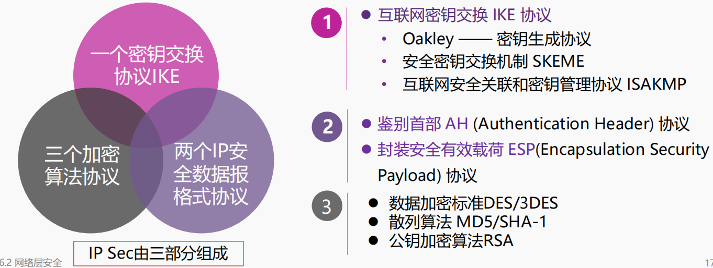

IP 安全数据报有两种工作模式：传输模式(transport mode)和隧道模式(tunnel mode)

- 隧道方式常用来实现虚拟专用网 VPN

安全关联(SA)：在发送 IP 安全数据报之前，在源实体和目的实体之间必须创建一条网络层的逻辑连接

IPsec 把传统互联网无连接的网络层转换为具有逻辑连接的网络层

#### 虚拟专用网

按 VPN 的协议分类

• VPN 的隧道协议主要有三种，PPTP、L2TP 和 IPSec，其中

PPTP 和 L2TP 协议工作在 OSI 模型的第二层，又称为二层隧道

协议；IPSec 是第三层隧道协议

按所用的设备类型进行分类

• 路由器式 VPN：路由器式 VPN 部署较容易，只要在路由器上添加 VPN 服务即可

• 交换机式 VPN：主要应用于连接用户较少的 VPN 网络

• 防火墙式 VPN：防火墙式 VPN 是最常见的一种 VPN 的实现方式，许多厂商都提供这种配置类型

#### 无线安全

802.11i: 认证和加密

需要加入网络的移动终端必须遵循: 

与接入点关联：建立无线链接通信

网络对移动终端进行身份认证

### 系统与运行安全

病毒、木马与恶意代码

#### 防火墙

一种访问控制技术，通过严格控制进出网络边界的分组，禁止任何不必要的通信，从而减少潜在入侵的发生，尽可能降低这类安全威胁所带来的安全风险。

- 访问控制策略由使用防火墙的单位自行制定

两类防火墙技术

- 分组过滤路由器
  - 过滤规则：基于分组的网络层或运输层首部信息，例如：源/目的IP地址、源/目的端口、协议类型（TCP 或 UDP），等等
- 应用网关，也称为代理服务器 (proxy server)
  - 对报文进行中继，实现基于应用层数据的过滤和高层用户鉴别

入侵检测系统

#### 沙盒与隔离

沙盒(sandbox，又译为沙箱)，通过重定向技术，把程序生成和修改的文件，定向到自身文件夹中

蜜罐（Honeypot） 

- 本质上是一种对攻击方进行欺骗的技术

- 通过布置一些作为诱饵的主机、网络服务或者信息，诱使攻击方对它们实施攻击，从而可以对攻击行为进行捕获和分析

### 安全技术前沿与未来发展

#### 量子密码

量子（quantum）是现代物理的重要概念。即一个物理量如果存在最小的不可分割的基本单位，则这个物理量是量子化的，并把最小单位称为量子。

量子密码学（Quantum Cryptography），泛指利用量子力学的特性来加密的科学

经典实例：量子密钥分发 ——BB84 协议

窃听量子信道会破坏数据——比较安全

#### 物联网安全

#### 应急响应

#### 风险评估

#### 等级保护


## PPT 例题

1.

> D

2. 
2. 
