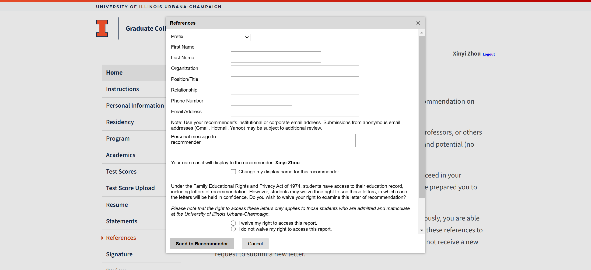

# Statement

Please write a statement that answers the following questions (1,000 words max):

1. How has your academic and professional background, including any professional training, prepared you for graduate study?
2. How will our program help you achieve your intellectual and professional goals?
3. What are your academic interests, and why do you wish to pursue graduate studies in this specific program?

------------------------------

Majoring in Software Engineering at Zhejiang University, I have acquired a rich blend of knowledge and skills including theoretical learning and practical application, which lays a solid foundation for my graduate studies. Through academic assignments, hands-on projects, and research, I have cultivated a strong interest in computer engineering and its transformative potential. The opportunity to join the Electrical and Computer Engineering (ECE) Master of Engineering (M.Eng) program at the University of Illinois Urbana-Champaign (UIUC) excites me, as it is perfectly suited to my academic ambitions and professional goals.

**Academic and Professional Background**

Over the past two years, my learning journey in college has equipped me with a holistic understanding of software engineering principles, particularly in areas where they intersect with computer engineering. I have just taken a course on IoT, which intrigues me a lot. In this course, our main goal is to program the ESP32 Digital Board to detect different moving states, presented by the LED color and dashboards online. This really unveils a brand-new world for me and hones my ability to solve complex, real-world problems. Besides, I have been researching a project on the detection of deepfake content using advanced algorithms and models. By contributing to the development of a practical detection platform, I felt the sense of achievement of turning theoretical concepts into some impactful tools—a process I am eager to expand upon in my graduate studies.

During the learning process, the interdisciplinary nature of my studies has also helped me develop a mindset that embraces innovation and adaptability. For example, while developing the deepfake detection platform, I collaborated with peers from diverse majors, which allowed me to learn from others' insights and enrich mine. 

**How the UIUC ECE M.Eng Program Will Help Achieve My Goals**

I learned about the 3+2 program through the university's official website. From my perspective, the UIUC ECE M.Eng program stands out for its rigorous curriculum, emphasis on applied learning, and access to world-class faculty and resources. Such an academic platform resonates with my aspiration to master the practical application of engineering principles while enhancing my technical expertise. The program’s flexibility in allowing students to tailor their coursework to specific interests is particularly appealing, as it will enable me to explore deeper into areas like machine learning, and hardware-software co-design—fields that are integral to my study and career goals.

UIUC’s reputation for fostering innovation and its close ties to the tech industry offer unparalleled opportunities for professional development. This program’s hands-on approach to learning will allow me to refine my skills while addressing real-world issues, ensuring that I'll become not only a well-rounded engineer but also a confident problem-solver prepared to make meaningful contributions to the society.

**Academic Interests and Motivation**

Since I became a college student, I have had a passion for engineering for its potential to address real-life issues in society as well as the likelihood of improving people's lives. As technology evolves, challenges like cybersecurity and content authenticity occur. My current work on deepfake detection has given me a glimpse into how computational tools can safeguard digital spaces, and the coursework on IoT has driven me to integrate software with hardware to connect physical things and the Internet world. Therefore, I am longing to expand my expertise in this area. Pursuing graduate studies in ECE at UIUC will provide me with the knowledge and resources to tackle such challenges on a larger scale.

Furthermore, I'm curious about fields like auto drive and embedded AI, so I suggest the convergence of software engineering and computer engineering matches perfectly with my academic interests. Both fields emphasize problem-solving, system optimization, and the translation of abstract ideas into tangible outcomes. By exploring topics such as embedded systems, AI-driven optimization, and digital signal processing during the M.Eng program, I can gain the specialized skills and knowledge needed to ace in a rapidly evolving technological landscape.

**Future Vision**

Zooming out into the future, the UIUC ECE M.Eng program is not just an academic pathway for me; it is a stepping stone toward realizing this vision. By immersing myself in an environment that values excellence, innovation, and collaboration, I am confident that I will acquire the expertise and confidence to excel as an engineer and make a meaningful difference in the world.

**Personal statement essays 1 and 2 are required for all applicants.**

1. Please describe pivotal experiences, opportunities, and/or challenges (including any financial or access to education barriers) that have influenced your educational and professional development. *(250 words max)*

------

Throughout my academic journey, I have faced some challenges that, while initially daunting, have ultimately shaped my resilience and improved my ability. Mathematics was one of my early hurdles. During senior high school, I had no exposure to calculus like many peers, which left me feeling unprepared when I encountered it in college. 

I struggled to grasp the mathematical reasoning at first, reading textbooks again and again to acquire the knowledge and logic behind every question. Step by step, my effort finally paid off through my consistent practice though my mathematical abilities are still of average level.

Similarly, computer programming was another pivotal challenge for a freshman like me with no prior experience. I found the transition into programming to be a significant shift in thinking. Adapting to this new field demanded both time and dedication as I navigated unfamiliar coding syntax and computational logic. Despite the steep learning curve, I embraced the opportunity to learn, eventually developing a passion for problem-solving and algorithmic thinking. Through much time and effort, I think I gradually mastered computer programming.

These experiences have profoundly influenced my educational and professional development. They have taught me that challenges, despite the difficulty, are opportunities for growth and self-discovery. My journey from a novice programmer to someone doing cutting-edge research in deepfake detection exemplifies the rewards of hard work and adaptability. These lessons have not only prepared me for the rigors of graduate study but have also built my confidence to tackle complex problems and continuously strive for improvement.

2. At Illinois, we value a student’s ability to contribute to a community of inclusion, belonging, and respect where our graduate students can learn and collaborate productively and positively. Please provide an example of how you contributed to or engaged with a community of students or colleagues with different perspectives, abilities, and experiences to achieve a positive outcome and reflect on what you learned from this experience. (*250 words max*)

In my Fundamentals of Software Engineering course last semester, I was the leader of a group of 5 students. While we shared a common goal, my team members had distinct perspectives, personalities, and working habits. Thus, it was really a challenge for me as thoughtful coordination was required to ensure a productive and inclusive collaboration.

In the group, I found some team members were always readily sharing their ideas, while others were a bit shy. To create an environment where everyone felt valued, I encouraged quieter members to share their thoughts, ensuring their voices were heard and integrated into our discussions. This approach not only enriched our project with diverse insights but also fostered a sense of belonging within the group.

However, during the teamwork, one team member was initially disengaged, falling behind on his responsibilities. Regardless of the frustrating fact, I tried to iron out the issue with patience and understanding. Through open communication with my teammate, I sought to understand his perspectives, reset the goals to be more clear, and reschedule the deadlines to leave him enough time to finish his part. This proactive approach eventually worked a lot, making the whole project progress smoothly.

This experience taught me the importance of empathy, adaptability, and effective communication in collaboration among individuals with different strengths and working styles. By creating a united and inclusive atmosphere and addressing problems constructively, I not only helped our team succeed but also mastered practical skills that I will bring to future academic and professional communities.

# 推荐信

Prefix 前缀称呼
First name 名
Last name 姓
Organization 组织
Position/Title 职位/名称
Relationship 和推荐人的关系
Phone number 电话号码
Email address 电子邮箱（最好用ZJU邮箱）
Personal message to the recommender 给推荐人的个人消息（我写给您的）

我填好推荐人信息后， UIUC会给您发邮件，您要点击邮件中的链接将推荐信上传（截至时间12/30）

----------------------------------------------

To Whom It May Concern:

 

It is my pleasure to write this letter to evaluate the research accomplishments of Dr. XXX, who has filed with your office the I-140, Immigration Petition under First Preference as an “Alien of Extraordinary Ability”.  Dr. XXX is an outstanding scientist and received national/international attention for his extraordinary work in the development of wireless communication technologies.  

 

A better understanding of my background and qualification may help you in interpreting this recommendation.  I am …[background info to be added]

 

I became aware of Dr. XXX’s research work a few years ago when he started publishing in international scientific journals and conferences.  Upon review of his substantial number of publications and related achievements, it is my professional opinion that Dr. XXX’s outstanding achievements have contributed extensively to the frontier area of Wireless Communication, and have highly exceeded those made by most of his peers with similar qualification in the filed of wireless communication.  The research expertise of Dr. XXX is Mobile Computing with the focus on ….  I can provide the following evidence of Dr. XXX’s prominent performance: 

 

Dr. XXX is a senior IEEE member. The IEEE senior membership is a merit based membership developed and limited to those professionals who must have been in professional practice for at least ten years and shall have shown significant performance over a period of at least five of those years.  Selection is very competitive and only a very small percentage of IEEE members have been awarded such senior membership. Dr. XXX has also been nominated as one of the two candidates for the Chair of the IEEE Computer Society Technical Committee on [ ], which is one of key Technical Committees of the IEEE Computer Society.  IEEE Computer Society has a pool of approximate 90000 members and the nomination is only given to who is an international recognized top scientist, showing extraordinary leadership in the field.  Election will soon be held in December, 2007. In addition, he has served for the past few years as a technical program committee in a number of international conferences or workshops which only invite internationally leading scientist in the fields related to the conference or workshop.  Such invitation by international conferences or workshops is solid proof that Dr. XXX’s has been internationally recognized. Dr. XXX has also served more than 30 times as a reviewer for more than 10 top-ranked international journals 

 

He is the author of the book *XYZ* published by [ ] (ISBN: 1234567) in June 2007, which is an excellent book that can be used as the reference of researchers and scientists in relevant fields. He is also the co-editor of the forthcoming book [], to be published by ABC, a leading global publisher, with offices in North America, Europe and Asian. 

 

Dr. XXX has published more than ten papers in the first class journals in the filed of wireless communication, including [ ]. All of these journals are notable with a high reputation in the filed.  For example, IEEE Wireless Communication Magazine and IEEE Transaction on Mobile Computing are ranked as the first and second among the most-cited journals in the category of Telecommunications, according to the annual Journal Citation Report published by the Thomson Institute for Scientific Information 2007.  In addition, his work has been extensively published in a number of prestigious international conferences.  

 

These publications represent Dr. XXX’s original and cutting edge scientific findings and accomplishments in the following aspects:

 

1. Dr. XXX     has successfully developed. 

 

1. Dr. XXX is     the first person that.  

 

1. Dr. XXX has     made a breakthrough.  

1. Dr. XXX has     also studied. 

1. Dr. XXX     has addressed the issue. 

1. Dr. XXX has     developed new techniques 

 

As illustrated above, Dr. XXX has impressively developed a variety of new wireless communication technologies and has recommended a series of promising new protocols for the next generation wireless communication.  His original scientific achievements have undoubtedly made him one of the top scientists in the field of endeavor. 

 

Because of his remarkable publication record, demonstrated skills, and considerable expertise in the filed of wireless communication, Dr. XXX has obtained international recognition in the national and international scientific community.  I would further validate this point from the following aspects:

 

1. Only a     very small percentage of researchers are able to publish their work in the     IEEE Wireless Communication. Dr. XXX,     within a few couple of years, has published  several papers in this journal, which     itself is proof of his outstanding achievements and reputation. 

 

1. Dr. XXX     has published a book, the first in the area of [ ], which helps     researchers to build their understanding of the cutting-edge []     technologies. He has also been     specially invited by ABC to co-edit a new book, [ ] which will appear as a     textbook.  Based on his established     reputation in the research community, this book will become a     comprehensive reference for researchers, engineers, and other     professionals in this field.

 

1. Dr. XXX is     an extraordinary international leader in his field and is frequently invited     by international journals and conferences as a judge to review his peers’     work.  In the past few years, he has     continuously reviewed more than thirty five papers for more than 15     different top international institutions.  

 

1. Many     international conferences and university seminars have invited Dr. XXX to     present his work, which shows that his works have received extensive     acclamations by professionals in the filed. 

 

1. Because of     his outstanding performance, Dr. XXX has earned several merit-based     membership that requires outstanding achievements determined by recognized     national or international experts, such as the IEEE senior membership and     the candidacy of the Chair of the IEEE Computer Society Technical     Committee on []. 

 

Currently, Dr. XXX is conducting his postdoctoral research in [] ati and is leading the research of many graduate students in the filed of Mobile Computing.  He has already made innovative and original contributions of major significance to the field of wireless communication and is internationally recognized as a top scientist through contributing books, extensively publishing in internationally circulated scholarly journals, earning memberships in prestigious organizations, participation in the scientific societies as a judge in his field of expertise.  I believe that his continuing contributions will undoubtedly benefit the wireless communication industry and academic research.  

 

Please do not hesitate to contact me if you should have any further questions. 

 

Yours sincerely, 

dongw@zju.edu.cn

xilizju@zju.edu.cn

junx@cs.zju.edu.cn

**Subject:** Request for a Letter of Recommendation

Dear Professor [Last Name],

I hope this message finds you well. My name is Zhou Xinyi(周歆仪), an undergraduate student majoring in Software Engineering, Class of 2022. I had the pleasure of attending your MATLAB short-term course during the summer of 2023.

Currently, I am applying to the UIUC 3+2 program under the College of Engineering, intending to pursue a Master of Engineering in Electrical and Computer Engineering with a focus on Computer Engineering. I was wondering if you would be willing to write me a letter of recommendation to support my application.

Attached to this email, you will find my resume and transcript for your reference. Attached to this email, you will find my resume and transcript for your reference. If you are willing to help, I can provide you with a recommendation letter template later for your convenience. I would be immensely grateful if you could assist me with this request.

Thank you very much for considering, and I deeply appreciate your time and support.

Sincerely,
Zhou Xinyi
December 7, 2024

-----------------------------------------------

**主题：推荐信请求**

尊敬的XX老师：

您好！我是22级软件工程专业的本科生Zhou，曾于2023年暑期参加过您主讲的MATLAB短学期课程，对您的悉心教学印象深刻，受益匪浅。

目前，我正在申请工学部UIUC 3+2项目，希望攻读电气与计算机工程（ECE）专业下的计算机工程方向的硕士学位。冒昧地询问您是否可以为我撰写一封推荐信，以帮助我的申请？

随信附上了我的简历和成绩单供您参考。如果您能帮助我，我可以之后提供推荐信的模板以供您参考。

非常感谢您在百忙之中考虑我的请求，祝您工作顺利，身体健康！

此致
敬礼！
Zhou
2024年12月7日

------------------------------------

​	

