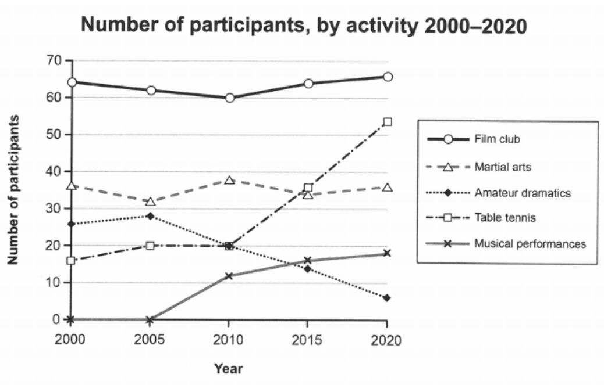

# IELTS Writing

## Task 1

### 折线图

**1. Percentage of population in living cities**

This line graph illustrates the proportion of urban citizens in Philippines, Malaysia, Thailand and Indonesia between 1970 and 2020, with the expected population in 2030 and 2040.

Overall, it can be easily seen from the graph that all four countries has **a dramatic rise** in population, starting at the lowest point in 1970 and being projected to reach the peak in 2040.

Malaysia starts at 30%, about twice as much as Indonesia. After that, both showed an obvious increase, with the former rising to approximately 76% in 2020, and the latter rising to approximately 50%. Both sides are expected to continue rising thereafter, with Malaysia slowly rising to about 83%, while Indonesia is expected to see a 12% gain.

The starting point of Philippines is about 31%, which is about 13% higher than Thailand. Over the next decade, the Philippines remained relatively stable. Between 1980 and 1990, the Philippines rose to about 48%, but fell to about 42% over the next 20 years. During this period, Thailand showed a gradual increase from 18% to approximately 30%. After 2010, both countries are expected to show an upward trend, rising to 55% and 49% respectively.

**2. changes in the size of the ozone hole**

The two line graphs illustrate changes in the size of the ozone hole over Antarctica and the production levels of three types of harmful gases (Freon, NO₂, and H₂O₂) from 1980 to 2000.

Overall, the size of the Antarctic ozone hole expanded significantly over the 20-year period. The production of Freon initially rose before falling sharply, whereas NO₂ and H₂O₂ **displayed steady increases** towards the end of the period.

In terms of the ozone hole size, it grew rapidly from approximately 50,000 square kilometers in 1980 to around 200,000 square kilometers by 1990. This increase was particularly **steep** between 1985 and 1990. **Subsequently**, the *growth rate* slowed, with the hole **expanding** more gradually to about 240,000 square kilometers by the year 2000.

Regarding the production of damaging gases, Freon initially experienced an upward trend, peaking at 200,000 metric tons in 1985. However, its production then decreased dramatically, **plummeting to** around 20,000 metric tons **by the end of the period**. In contrast, the levels of NO₂ remained relatively stable at around 110,000 metric tons from 1980 to 1990, after which it saw a **substantial rise**, reaching 160,000 metric tons by 2000.

Similarly, H₂O₂ production began at zero in 1980 but showed a gradual increase to approximately 18,000 metric tons by 1990. From this point onwards, it surged significantly, ending the period at 80,000 metric tons.

**3. numbers of participants for different activities**

The line graph illustrates the number of participants involved in five activities—film club, martial arts, amateur dramatics, table tennis, and musical performances—at a social center in Melbourne, Australia, from 2000 to 2020.

**Overall**, the film club consistently had the highest participation throughout the period, while amateur dramatics saw a steady decline. Musical performances, on the other hand, experienced a significant increase in participants, overtaking other activities except for the film club by 2020.

The film club started at around 63 in 2000, and then fluctuated slightly before rising to nearly 65 by 2020. Martial arts had the second-largest participation initially, with about 35 attendees, and remained relatively stable over the period, with minor fluctuations.

Amateur dramatics started with approximately 26 participants in 2000 but **experienced a gradual decline**, reaching less than 10 by 2020. In contrast, table tennis saw a remarkable growth over the years, surpassing amateur dramatics and martial arts in 2015 and climbing to over 50 participants by 2020.

Musical performances showed a dramatic increase in popularity. Starting with no participants in 2000 and 2005, it rose rapidly, surpassing amateur dramatics around 2010. By 2020, it had reached nearly 20 participants.

### 饼图

The three pie charts illustrate the proportion of four types of vehicles used in the UK in 1965, 1985, and 2005.

Overall, there is a significant rise in the proportion of private cars over time, while the proportions of lorries and other commercial vehicles, as well as recreational vehicles, experience a gradual decrease. Public transport remains relatively stable over the period.

With regard to private cars, the proportion starts at 40% in 1965, increases to 55% in 1985, and reaches 60% by 2005. Public transport initially accounts for 25% in 1965, drops slightly to 20% in 1985, and then rises to 22% in 2005.

In terms of lorries and other commercial vehicles, the proportion remains steady at 20% in 1965 and 1985, before falling by half to 10% in 2005. Recreational vehicles are always the least popular vehicles which show a decline from 15% in 1965 to 5% in 1985, with a small rise to 8% in 2005.

### 柱状图

**1. Number of US household in millions by their annual income**

This bar chart illustrates the numbers of US household in millions by their annual income in 2007, 2011 and 2015 respectively.

Overall, it can be easily seen that households of \$100000 or more climbs apparently and is the most, while other remain nearly steady, with \$25000-\$49999 the second, followed by less than \$25000 and the \$50000-\$74999, and the $75000-\$99999 the last.

From the graph, less than \$25000 and \$25000-\$49999 first rise in 2011 and sightly fall in 2015, from 25 to 29 to 28 and 27 to 30 to 29 respectively. While \$75000-\$99999 and \$100000 or more are the other way around, beginning at 14.5 and 29.5, decreasing to 14 and 27 and ending with 15 and 33. The middle bar, namely \$50000-\$74999 remains level in the three years, roughly 21.

In 2011, the bars of \$25000-\$49999 and less than \$25000 exceed \$100000 or more at a marginal edge. But the \$100000 or more has witnessed a dramatic increase in 2015, approximately from the lowest point 27 to 33.

**2.  Number of international applicants from four countries**

The bar chart below illustrates the number of international applicants from four countries (China, Japan, America, Russia) that a European university had from 2004 to 2008.

Overall, the total number of applicants from four countries generally remain stable over the period, while the respective numbers of applicants from different countries changed greatly. Generally, China and America had the highest numbers of applicants, followed by Japan, with Russia consistently having the fewest.

The number of applicants from China experienced **a notable decline**, beginning at approximately 27,000 in 2004, stabilizing at around 17,000 in 2006 and 2007, and finally dropping to 15,000 in 2008. In contrast, applicants from Japan showed a gradual upward trend, starting at 5,000 in 2004 and **doubling** to 10,000 by 2008.

Applications from America fluctuated over the period. They started at 20,000 in 2004, decreased to a low of 10,000 in 2007, and then **surged** to 27,000 in 2008. The number of Russian applicants steadily increased from around 1,000 in 2004 to 8,000 in 2007, before dropping sharply to approximately 3,000 in 2008.

## Task 2

### 同意/不同意

**1. The most important aim of science should be to improve people's lives. To what extent do you agree or disagree with this statement?**

The proposition that the most important aim of science should be to improve people's lives is a significant one, meriting thoughtful consideration. This essay will argue that, while the improvement of human lives is a crucial goal of science, it should not be viewed as its sole purpose.

Firstly, the advancement of human welfare through scientific discovery has undeniably been monumental. Medical science, for instance, has dramatically enhanced the quality and longevity of life. The development of vaccines, antibiotics, and advanced surgical techniques has transformed healthcare, drastically reducing mortality rates and improving the management of chronic diseases. Moreover, technological innovations, a product of scientific research, have reshaped daily life, offering unparalleled convenience and efficiency. The advent of the internet, smartphones, and smart home technology are prime examples of how science has made everyday tasks more accessible and interconnected.

However, the pursuit of science for the sheer expansion of knowledge should also be recognized as an essential aim. Many scientific endeavors, such as space exploration or the study of fundamental physics, may not have immediate practical applications but are crucial for our understanding of the universe. The pursuit of such knowledge can lead to unforeseen benefits. For example, the exploration of space has led to the development of satellite communication, GPS technology, and numerous other applications that have had a considerable impact on daily life.

Furthermore, it's important to consider the ethical and societal implications of focusing solely on science that improves human life. Such a focus might lead to the neglect of crucial environmental or ecological research, which may not have direct benefits for humans in the short term but are essential for the sustainability of life on Earth. Additionally, this approach might bias funding and attention towards projects with immediate commercial benefits, potentially at the expense of basic science research.

In conclusion, while improving human lives is a vital goal of scientific endeavor, it should not be the only aim. The pursuit of knowledge for its own sake and the exploration of questions beyond immediate human concerns are equally important. This broader perspective ensures a balanced approach to science, where the pursuit of understanding and the betterment of humanity go hand in hand.

------------------------------

2.

### 好/坏

**1. In many countries around the world, rural people are moving to cities, so the population in the countryside is decreasing. Do you think this is a positive or a negative development?**

In numerous nations worldwide, the trend of rural populations migrating to urban areas is prominent, leading to a dwindling number of inhabitants in the countryside. This shift, in my opinion, embodies a double-edged sword, reflecting the complex dynamics of societal evolution.

On the one hand, the allure of cities is undeniable. Urban centers, with their advanced infrastructure and abundant employment prospects, magnetize individuals seeking improved livelihoods. The superior quality of urban life, coupled with the automation of agricultural practices reducing rural labor demand, underscores the rationality behind this migration. Such developments signify progress, offering individuals the freedom to pursue a broader spectrum of opportunities.

On the other hand, this influx into urban areas introduces several challenges. Skyrocketing housing prices, escalating traffic congestion, rising unemployment rates, and deteriorating living conditions due to pollution are immediate repercussions. Moreover, the urban expansion necessitates converting more land into cityscapes, potentially straining resources. The diminished rural workforce and reduced agricultural lands could hinder food production, highlighting a critical balance between consumption and production that must be maintained.

Yet, the phenomenon of urbanization is not a one-way street. The concept of reverse urbanization, where individuals return to rural areas seeking respite from urban chaos, illustrates a natural recalibration process. This cycle suggests that concerns regarding urban overpopulation and rural depopulation may eventually equilibrate.

Hence, viewing rural-to-urban migration through a binary lens of positive or negative oversimplifies its implications. This movement is an intrinsic aspect of societal advancement, where the intertwined challenges and benefits will ultimately pave the way for a balanced development.

-----------------------------

**2. In many countries, people are now living longer than ever before. Some people say an ageing population creates problems for governments. Other people think there are benefits if society has more elderly people. To what extent do the advantages of having an ageing population outweigh the disadvantages?**

efore. While some people suggest the ageing population leads to problems for the government, others maitain it's beneficial to have more elderly poeple.
On one hand, a vast number of elderly people create a significant financial burden for the government and the young. The government has to impose more taxes on young people mainly due to the social security for the elderly including pensions and healthcare fees to ensure their life quality. Meanwhile, the ageing population may lead to a lack of labor because the base population doesn;t change a lot but the proportion of the young is relatively low. Therefore, there're plenty of vacant positions in the workforce. This may contribute to the decline of the economy and the stagnancy of development, which the government has to introduce policies such as encouraging migrants to deter from getting worse.
On the other hand, the increasing life span does imply that people have a better life in the modern world thanks to the advanced medical technology and social welfares. The aging population may greatly promote the medical industry, as there's a large demand in inventing more efficient drugs and finding treatments of some rare diseases which haven't been cured. On top of that, the elder may boost the local tourism as some of them are reluctant to stay at home after retirement. They can pay a visit to a number of attractions they haven't gone in their young ages or have anticipated for a long time.
 In conclusion, from my perspective, the benefits of an increasingly older population are kinds of limited, only conducive to medical industry and tourism while the harmful effects potencially impacting the whole society can't be neglected, which is really a headache for the government.

### 两问

**1. Many countries believe that international tourism has harmful effects. Why do they think so? What can be done to change their views?**

In recent years, concerns have grown among some countries about the negative impacts of international tourism. From my perspective, overburdened infrastructure and harmful environmental practices are key reasons for these concerns, but targeted solutions can help change these views.

Firstly, the **increased accessibility** of global travel has led to a **surge in tourist numbers**, often overwhelming local infrastructure. In popular destinations, public transportation, roads, and waste management systems can struggle to **handle the influx**. This overcrowding disrupts daily life for residents, reducing their quality of life. For example, cities like Venice frequently experience gridlock due to excessive tourist numbers, which creates tension between visitors and locals.

Additionally, the behavior of some tourists can harm the environment and cultural sites. Littering, vandalism, and disrespect for historical landmarks are common issues. For instance, reports of tourists **engraving names** on ancient monuments not only damage these sites but also offend local communities. This type of conduct **creates resentment and fuels negative perceptions** of international tourism.

To **mitigate** these negative effects of international tourism, several measures can be implemented. First, governments should invest in upgrading infrastructure to accommodate larger numbers of visitors without **compromising the well-being of residents**. This could include expanding public transport networks, improving waste management systems, and implementing sustainable tourism practices. Second, **stricter regulations and penalties** should be **enforced** to **curb** uncivilized behavior. Fines, community service, or even temporary bans from entering the country could **serve as effective deterrents** against tourists who break the rules.

Moreover, **fostering a culture** of responsible tourism through educational campaigns can encourage visitors to respect local traditions and the environment. If visitors demonstrate respect and cultural sensitivity, locals are likely to feel more positively about their presence.

In conclusion, while it is understandable that some countries are wary of international tourism, improving infrastructure, enforcing rules, and fostering responsible behavior can help mitigate its negative effects. This approach could allow countries to benefit economically from tourism while preserving their cultural and environmental integrity.

