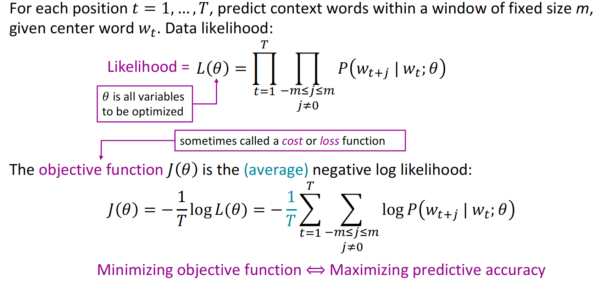
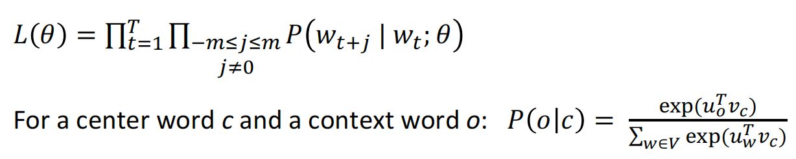
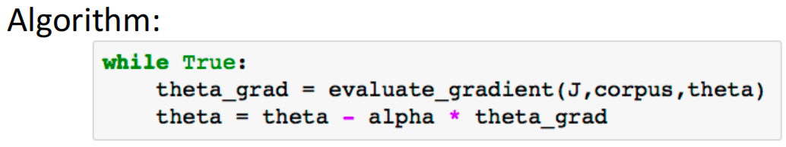

# Stanford CS224N: NLP with Deep Learning

[Stanford CS224N: NLP with Deep Learning | Spring 2024 | Lecture 1 - Intro and Word Vectors](https://www.youtube.com/watch?v=DzpHeXVSC5I&list=PLoROMvodv4rOaMFbaqxPDoLWjDaRAdP9D)

## Lecture 1 - Intro and Word Vectors

WordNet, a thesaurus containing lists of **synonym sets** and **hypernyms** (“is a” relationships)

词典包含同义词集和上位词列表

-   It can’t be used to compute word similarity accurately 

-   So we need to **learn to encode similarity in the vectors themselves**

Represent words by their **context**

>   [!NOTE]
>
>   Word vectors are also called (word) embeddings or (neural) word representations
>
>   They are a distributed representation

### word2vec

#### objective function

-   To  calculate $𝑃(𝑤_{t+j}|𝑤_t;\theta)$, we will *use two* vectors per word *w*: $v_w$ context and $u_w$ center.

    

#### Prediction fucntion

  Interactive Session

Model: the softmax function

Objective: Maximize the Log-Likelihood

## Lecture 2: Word Vectors, Word Senses, and Neural Classifiers

### Optimization: Gradient Descent

Actually never use because  $𝐽(𝜃)$ is a function of **all** windows in the corpus (potentially billions!)  very expensive to compute

Use **Stochastic Gradient Descent**

-   Repeatedly sample windows, and update after each one
-   

### Main idea of word2vac

-   Word2vec maximizes objective by putting similar words nearby in space
-   

Skip-gram

### GloVe

 **How to evaluate word vectors**

-   intrinsic and extrinsic

**A neural network = running several logistic regressions at the same time**

