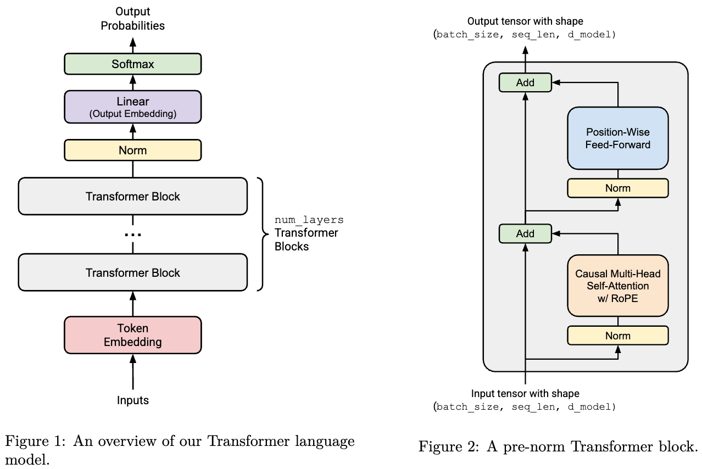

# CS336 Language Modeling from Scratch

[Language Modeling from Scratch](https://cs336.stanford.edu/)

[Stanford CS336 Language Modeling from Scratch | Spring 2025 | Lecture 1: Overview and Tokenization](https://www.youtube.com/watch?v=SQ3fZ1sAqXI&list=PLoROMvodv4rOY23Y0BoGoBGgQ1zmU_MT_&index=1)

## Lecture 1: Overview and Tokenization

accuracy = efficiency x resources

### Design Decisions

Focus on **compute-efficiency**

Data processing: avoid wasting precious compute updating on bad/irrelevant data

Tokenization: working with raw bytes is elegant, but computationally inefficient with today's model architectures.

Model architecture: many changes motivated by *reducing memory or FLOPs* (e.g., sharing KV caches, sliding window attention)

Training: We can get away with a single epoch!

Scaling laws: use less compute on smaller models to do hyperparameter tuning

Alignment: if tune model more to desired use cases, require smaller base models


### Tokenization

-   Tokenizer: strings <-> tokens (indices)

-   Character-based, byte-based, and word-based tokenization are highly suboptimal

-   BPE is an effective heuristic that looks at corpus statistics

-   Tokenization is a necessary evil, maybe one day we'll just do it from bytes...


**Character-based tokenization**

There are approximately 150K Unicode characters.  

`vocabulary_size = max(indices) + 1`  # This is a lower bound @inspect vocabulary_size

Problem 1: This is a very large vocabulary.

Problem 2: Many characters are quite rare (e.g., 🌍), which is an inefficient use of the vocabulary.


**Byte-based tokenization**

Unicode strings can be represented as a sequence of bytes, which can be represented by integers between 0 and 255.

The most common Unicode encoding is  [UTF-8](https://en.wikipedia.org/wiki/UTF-8)

assert `compression_ratio == 1`

The compression ratio is terrible, which means the sequences will be too long.


**Word-based tokenization**

We split strings into words

`string = "I'll say supercalifragilisticexpialidocious!"`

`segments = regex.findall(r"\w+|.", string)  # @inspect segments`

This regular expression keeps all alphanumeric characters together (words).

-   Map from each segment into an integer

But there are problems:

-   The number of words is huge (like for Unicode characters).
-   Many words are rare, and the model won't learn much about them.
-   This doesn't obviously provide a fixed vocabulary size.  
-   New words we haven't seen during training get a special UNK token, which is ugly and can mess up perplexity calculations.


### Byte Pair Encoding (BPE)

decode

```python
def train_bpe(string: str, num_merges: int) -> BPETokenizerParams:  # @inspect string, @inspect num_merges
    Start with the list of bytes of string.
    indices = list(map(int, string.encode("utf-8")))  # @inspect indices
    merges: dict[tuple[int, int], int] = {}  # index1, index2 => merged index
    vocab: dict[int, bytes] = {x: bytes([x]) for x in range(256)}  # index -> bytes
    for i in range(num_merges):
        Count the number of occurrences of each pair of tokens
        counts = defaultdict(int)
        for index1, index2 in zip(indices, indices[1:]):  # For each adjacent pair
            counts[(index1, index2)] += 1  # @inspect counts
        Find the most common pair.
        pair = max(counts, key=counts.get)  # @inspect pair
        index1, index2 = pair
        Merge that pair.
        new_index = 256 + i  # @inspect new_index
        merges[pair] = new_index  # @inspect merges
        vocab[new_index] = vocab[index1] + vocab[index2]  # @inspect vocab
        indices = merge(indices, pair, new_index)  # @inspect indices
    return BPETokenizerParams(vocab=vocab, merges=merges)
```





