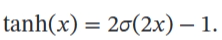
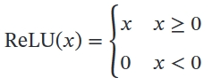
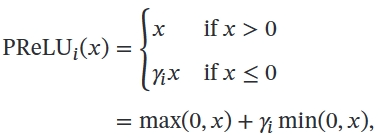
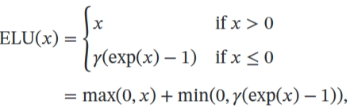
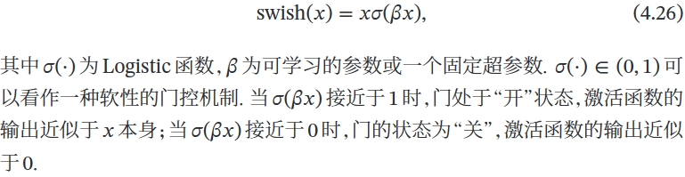
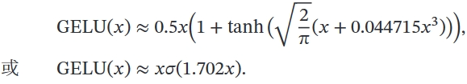

# Python机器学习

[Python Tutorial](https://www.w3schools.com/python/default.asp)

[神经网络与深度学习_邱锡鹏著_2020年.pdf](https://www.yuque.com/attachments/yuque/0/2024/pdf/34417153/1709725036974-bb82fbd2-62ff-4d31-b38e-890c326c92c8.pdf)<br />[Pytorch常用API汇总(持续更新)_pytorch的api-CSDN博客](https://blog.csdn.net/qq_49134563/article/details/108200828)<br />[PyTorch | 广播机制（broadcast）_pytorch broadcast-CSDN博客](https://blog.csdn.net/m0_52650517/article/details/119913625)
[rasbt/machine-learning-book: Code Repository for Machine Learning with PyTorch and Scikit-Learn (github.com)](https://github.com/rasbt/machine-learning-book)

## 数据预处理

### 缺失值填充

pandas库

处理方法

- 删除
- 替代
- 插值

### 异常值检测和处理

异常值判断方法

- 标准化后＞2或3
- 分位数判断，上四分数QU，下四分数QL，超过QU+1.5(QU-QL)或低于QL-1.5(QU-QL)为异常点
- OneClassSVM，用训练集判断

### 数据标准化

#### scale标准化

$$
xs=\frac{x-mean}{std}
$$

xs转换后数据，x转换前数据，mean代表x平均值，std为x标准偏差，该方法适用于数据（近似）符合正态分布

## 算法建模

10大经典算法分类

- 有监督算法：朴素贝叶斯、决策树、随机森林、Adaboost、GBDT、KNN、支持向量机
- 无监督算法：K-means聚类、Apriori关联规则算法、Page

## 机器学习分类

三种类型：监督、无监督、强化

### 监督

#### 分类（预测离散标签）

分类是监督学习的一个子任务

**Example**

```python  title="MNIST" linenums="1"
import torch
from torch import nn
from torch import optim
from torch.utils.data import DataLoader
from torchvision.datasets import MNIST
from torchvision.transforms import ToTensor
from tqdm import tqdm  # visual bar
import matplotlib.pyplot as plt

class Mymodel(nn.Module):
    def __init__(self, in_channels, classnumber):
        super(Mymodel, self).__init__()
        self.mymodel = nn.Sequential(
            nn.Conv2d(
                in_channels=in_channels,
                out_channels=32,
                kernel_size=3,
                # stride=1,
                padding=1,
            ),
            nn.BatchNorm2d(32),  # 正则化
            nn.ReLU(),
            nn.MaxPool2d(2,2),  # 28/2=14
            nn.Conv2d(
                in_channels=32,
                out_channels=32,
                kernel_size=3,
                # stride=1,
                # padding=0,
            ),
            # 14-2=12
            nn.BatchNorm2d(32),  # 正则化
            nn.ReLU(),
            nn.MaxPool2d(2, 2),  # 12/2=6
            nn.Conv2d(
                in_channels=32,
                out_channels=32,
                kernel_size=3,
                # stride=1,
                # padding=0
            ),
            # 6-2=4
            nn.BatchNorm2d(32),
            nn.ReLU(),
            nn.MaxPool2d(2, 2),  # 4/2=2
        )

        self.filter = nn.Sequential(
            nn.Linear(32*2*2, 64),
            nn.ReLU(),
            nn.Linear(64, classnumber)
        )
    def forward(self,inputs):
        inputs = self.mymodel(inputs)
        inputs = inputs.view(-1, 32*2*2)
        inputs = self.classifier(inputs)
        return inputs


if __name__ == '__main__':
    train_dataset = MNIST(root="D:\File\CODE\python\dataset")
    train_dataloader = DataLoader(dataset=train_dataset, batch_size=64, shuffle= True)

    test_dataset = MNIST(root= "D:\File\CODE\python\dataset", train=False, transform=ToTensor())
    test_dataloader = DataLoader(dataset=test_dataset, batch_size=10)

    device = "cuda"
    model = Mymodel(in_channels=1, classnumber=10).to(device)

    epochs = 100
    optimizer = optim.Adam(model.parameters()) # lr=1e-3 by default
    loss_fn = nn.CrossEntropyLoss()  # 交叉熵

    for i in range(epochs):
        model.train()
        train_data = tqdm(train_dataloader)

        mean_loss, acc = 0.0, 0.0  # 损失、精确度
        data_num = 0

        for x,y in train_data:  # x is input, y is label or target
            x = x.to(device)  # Move input and target to GPU if available
            y = y.to(device)

            predicts = model(x)  # 先预测
            # predicts: This is the output of the model for the current batch of inputs x.
            # [batch_size, n_classes], where n_classes is the number of classes in the classification problem.
            loss = loss_fn(predicts, y)  # 再算损失
            optimizer.zero_grad() # 优化器梯度清零
            loss.backward()  # 反向传播
            optimizer.step()  # 更新模型参数

            acc += torch.sum(torch.argmax(predicts,dim=1) == y).item()
            # torch.argmax(predicts, dim=1): This function finds the indices (i.e., the classes)
            # of the maximum values along dimension 1 (the class dimension) of predicts.
            # This effectively performs a prediction by selecting the class with the highest score for each input in the batch.
            # The output shape matches the batch size, containing the predicted class for each input.

            # torch.argmax(predicts, dim=1) == y: This compares the predicted classes to the true labels y.
            # If a prediction matches the true label, the comparison returns True; otherwise, it returns False.
            # this comparison effectively counts the correct predictions by returning a tensor of 1s and 0s.

            # torch.sum(...): This function sums up the values in the tensor of 1s (correct predictions) and 0s (incorrect predictions),
            # giving the total number of correct predictions in the batch.

            # item(): This method converts a PyTorch scalar tensor (a tensor with a single value) to a Python number.
            # It's used here to extract the number of correct predictions as a Python integer or float, which can then be accumulated in the acc variable.

            # acc += ...: This accumulates the number of correct predictions over all batches processed in the epoch.
            # By adding up the number of correct predictions after processing each batch, you keep a running total of how many samples have been correctly classified so far during the epoch.
            mean_loss /= loss.item() * x.size(0)
            data_num += x.size(0)
            train_data.set_description(f"Training..Epoach:{i+1}/{epochs},Loss:{loss.item(* x.size(0)):.4f}")

        mean_loss /=data_num
        acc /= data_num
        print(f"Training acc:{acc:.4f},Loss:{mean_loss:.4f}")

        model.eval()  # Set the model to evaluation mode评估模式
        test_data = tqdm(test_dataloader)  # Wrap dataloader with tqdm for a progress bar
        mean_loss, acc = 0.0, 0.0
        data_num = 0
        with torch.no_grad():  # Disable gradient calculation没有梯度计算和更新
            for x, y in test_data:
                x = x.to(device)
                y = y.to(device)
                predicts = model(x)
                loss = loss_fn(predicts, y)
                # 不需要优化和更新
                acc += torch.sum(torch.argmax(predicts, dim=1) == y).item()
                mean_loss += loss.item() * x.size(0)
                data_num += x.size(0)
                test_data.set_description(
                    f"Evaluation ... Epoch: {i + 1}/{epochs}, Loss: {loss.item() * x.size(0):.4f}")
            mean_loss /= data_num
            acc /= data_num
            print(f"\nTraining Acc: {acc:.4f}, Loss: {mean_loss:.4f}")

        torch.save(model.state_dict(), "./model.pth")

```

#### 回归（预测连续数值标签）

### 无监督

没有正确答案和奖励函数，处理无标签的数据来探索规律

#### 聚类

#### 降维压缩

### 强化

学习一系列使奖励最大化的动作

例子：国际象棋

## 简单机器学习算法

### 感知机算法

```python
import numpy as np

class Perceptron:
    """Perceptron classifier.

    Parameters
    ------------
    eta : float 学习率
      Learning rate (between 0.0 and 1.0)
    n_iter : int 学习次数
      Passes over the training dataset.
    random_state : int
      Random number generator seed for random weight
      initialization.

    Attributes
    -----------
    w_ : 1d-array
      Weights after fitting.
    b_ : Scalar
      Bias unit after fitting.
    errors_ : list
      Number of misclassifications (updates) in each epoch.

    """
    def __init__(self, eta=0.01, n_iter=50, random_state=1):
        self.eta = eta
        self.n_iter = n_iter
        self.random_state = random_state

    def fit(self, X, y):
        """Fit training data.

        Parameters
        ----------
        X : {array-like}, shape = [n_examples, n_features]
          Training vectors, where n_examples is the number of examples and
          n_features is the number of features.
        y : array-like, shape = [n_examples]
          Target values.

        Returns
        -------
        self : object

        """
        rgen = np.random.RandomState(self.random_state)
        # 用随机种子生成器初始化权重向量，rgen是Numpy的一个随机数生成器
        self.w_ = rgen.normal(loc=0.0, scale=0.01, size=X.shape[1]) # 产生均值为0、标准差为0.01的正态分布随机数
        self.b_ = np.float_(0.)
        # self.w_是初始化权重，self.b_是初始化偏置
        self.errors_ = []

        for _ in range(self.n_iter):
            errors = 0
            for xi, target in zip(X, y):
                update = self.eta * (target - self.predict(xi))
                self.w_ += update * xi
                self.b_ += update
                errors += int(update != 0.0)
            self.errors_.append(errors)
        return self

    def net_input(self, X):
        """Calculate net input"""
        return np.dot(X, self.w_) + self.b_

    def predict(self, X):
        """Return class label after unit step"""
        return np.where(self.net_input(X) >= 0.0, 1, 0)

```


## Deep learning

data<br />三要素：模型 model、学习准则 criteria、优化算法
<a name="tFbBb"></a>
### 模型
模型$f(x;θ)$<br />机器学习的目标是找到一个模型来近似真是映射函数$g(x)$或真是条件概率分布$p_r(y|x)$<br />非线性模型<br />KL 散度、交叉熵
<a name="I5ZUE"></a>
### 学习准则
期望风险<br />损失函数<br />平方、交叉熵、hinge<br />经验风险最小化 ERM<br />结构风险最小化 SRM：正则化防止过拟合
<a name="JNx6f"></a>

### 优化算法
（超）参数优化<br />（批量）梯度下降法 BGD：每次迭代时计算每个样本损失函数的梯度并求和<br />提前停止：防止过拟合<br />随机（增量）梯度下降法 SGD：抽 N 个样本，由它们计算出来的经验风险的梯度来近似期望风险的梯度<br />小批量梯度下降法：介于梯度下降法和随机梯度下降法之间


### 算法
前向传播：输入进去 网络做了什么计算

<a name="FEcw3"></a>

#### 常用的激活函数


1. **Sigmoid**，两端饱和函数
   1. **Logistic** 

   2. **Tanh** 
   饱和定义对于函数 𝑓(𝑥)，若 𝑥 → −∞ 时，其导数 𝑓′(𝑥) → 0，则称其为左饱和．若 𝑥 → +∞ 时，其导数 𝑓′(𝑥) → 0，则称其为右饱和．当同时满足左、右饱和时，就称为两端饱和

1. Hard-Logistic & hard-Tanh 一阶泰勒展开的直线近似
2. **ReLU**(PReLU)

<br />其中 𝛾𝑖 为 𝑥 ≤ 0 时函数的斜率．因此，PReLU 是非饱和函数．如果 𝛾𝑖 = 0，那么PReLU 就退化为 ReLU

4. **ELU**



5. **Softplus**

<br />Softplus 函数其导数刚好是 Logistic 函数．Softplus 函数虽然也具有单侧抑制、宽兴奋边界的特性，却没有稀疏激活性

6. **Swish**



7. **GELU**

<br />
<a name="njnWz"></a>

#### MLP（FNN）
多层感知器（MLP ）是现代前馈人工神经网络（ANN） 的名称，由具有非线性激活函数的**完全连接**的神经元组成，包含至少三层节点：输入层、一个或多个隐藏层和输出层。 一层中的每个节点或神经元以一定的权重连接到下一层中的每个节点，使网络完全连接。 MLP 使用称为**反向传播的监督学习**技术进行训练。 神经网络中的节点将**非线性激活函数**应用于从前一层接收的加权输入，然后将结果传递到下一层。 这种非线性使得 MLP 能够对输入和输出之间的复杂关系进行建模，而线性模型无法做到这一点。 <br />MLP 可用于从计算机视觉到语音识别等领域的各种任务，例如分类、回归和特征学习。 MLP 的关键特征包括其深度（层数）、宽度（每层中的节点数）、激活函数（例如 sigmoid、tanh 或 ReLU）以及用于训练的优化算法（通常是某种形式的梯度下降）。 MLP 被认为是深度学习的基础架构，尽管卷积神经网络 (CNN) 和循环神经网络 (RNN) 等更复杂的网络分别更常用于涉及图像和序列数据的任务。
<a name="t62Qq"></a>
#### CNN
滤波器 Filter，又叫卷积核 Kernal<br />卷积神经网络是多层感知器的变体<br />CNN 的层具有按3 个维度排列的神经元：宽度、高度和深度。[71]卷积层内的每个神经元仅与其之前层的一小部分区域相连，称为感受野。不同类型的层（局部连接和完全连接）堆叠在一起形成 CNN 架构。<br />局部连接：遵循感受野的概念，CNN 通过在相邻层的神经元之间强制执行**局部连接**模式来利用空间局部性。因此，该架构确保学习到的“过滤器”对空间局部输入模式产生最强的响应。堆叠许多这样的层会导致非线性滤波器变得越来越全局（即响应像素空间的更大区域），以便网络首先创建输入的小部分的表示，然后从它们组装更大区域的表示。<br />共享权重：在 CNN 中，每个过滤器都会在整个视野中复制。这些复制的单元共享相同的参数化（权重向量和偏差）并形成特征图。这意味着给定卷积层中的所有神经元在其特定响应场内响应相同的特征。以这种方式复制单元允许所得到的激活图在视野中输入特征的位置移动的情况下是等变的，即它们授予平移等变性——假设该层的步幅为一。[72]<br />池化：在 CNN 的池化层中，特征图被划分为矩形子区域，每个矩形中的特征被独立下采样为单个值，通常采用平均值或最大值。除了减小特征图的大小之外，池化操作还为其中包含的特征赋予一定程度的局部平移不变性，从而使 CNN 对于其位置的变化更加 ROBUST。

